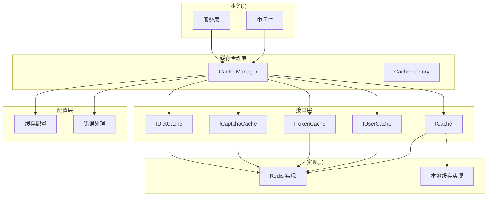
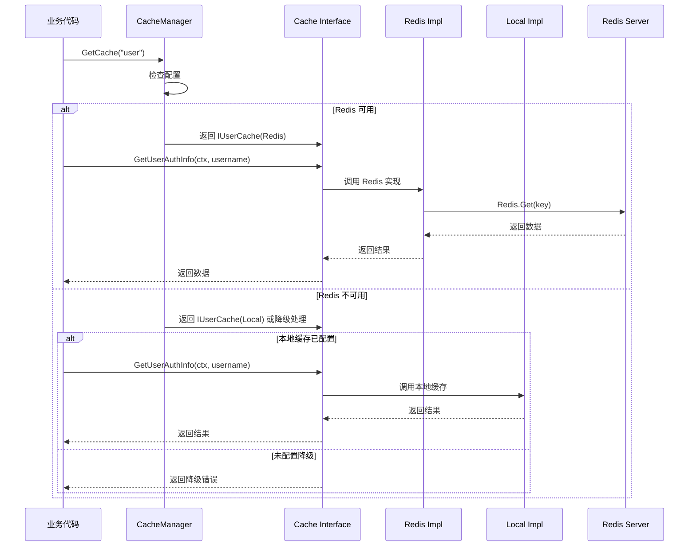
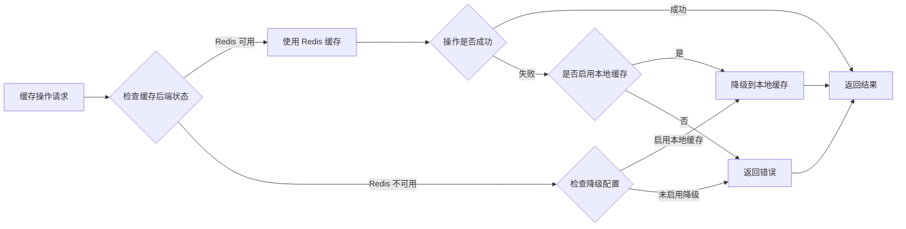

## 产品概述

对 dehaze-go/pkg/cache 缓存组件进行抽象和重构，设计统一的接口层，屏蔽底层存储实现差异（本地缓存/Redis/其他），提供清晰的缓存操作规范和最佳实践示例。

## 核心功能

- 实现 Redis 和本地缓存对接口的完整实现
- 提供统一的缓存工厂和管理器，支持多种存储后端切换
- 统一缓存配置管理和依赖注入支持
- 实现缓存降级策略和统一错误处理机制
- 提供日志记录和监控支持（使用项目统一 logger）
- 编写最佳实践文档和使用示例
- 重构中间件使用抽象接口，替代直接依赖 Redis

## 技术栈

- 语言：Go 1.24.4
- Redis 客户端：github.com/redis/go-redis/v9
- 本地缓存：github.com/songzhibin97/gkit/cache/local_cache
- 配置管理：github.com/spf13/viper
- 日志：go.uber.org/zap
- Web 框架：github.com/gin-gonic/gin

## 技术架构

### 系统架构

采用分层架构设计，包含接口层、实现层、管理层和配置层：



### 模块划分

**1. 接口定义模块（interfaces.go）**

- ICache：通用缓存接口（Get/Set/Delete/Exists/SetNX）
- IUserCache：用户缓存接口（用户认证信息、权限）
- ITokenCache：Token 缓存接口（Token 存储、黑名单）
- ICaptchaCache：验证码缓存接口（存储、校验、删除）
- IDictCache：字典缓存接口（字典数据、批量清理）

**2. Redis 实现模块（redis/）**

- RedisCache：实现 ICache 接口
- UserCache：实现 IUserCache 接口
- TokenCache：实现 ITokenCache 接口
- CaptchaCache：实现 ICaptchaCache 接口
- DictCache：实现 IDictCache 接口
- redis.go：Redis 客户端初始化（保持现有）

**3. 本地缓存实现模块（local/）**

- LocalCache：实现 ICache 接口
- LocalUserCache：实现 IUserCache 接口
- LocalTokenCache：实现 ITokenCache 接口
- LocalCaptchaCache：实现 ICaptchaCache 接口
- LocalDictCache：实现 IDictCache 接口

**4. 缓存管理模块（manager.go）**

- CacheManager：统一缓存管理器
- 负责缓存实例的创建、切换和降级
- 提供统一的错误处理和降级策略

**5. 配置模块（config.go）**

- CacheConfig：缓存配置结构体
- 支持多级缓存配置（L1 本地、L2 Redis）
- 配置加载和验证

**6. 工厂模块（factory.go）**

- CacheFactory：缓存工厂
- 根据配置创建缓存实例
- 支持依赖注入

### 数据流



### 错误处理和降级策略



## 实现细节

### 核心目录结构

```
dehaze-go/pkg/cache/
├── interfaces.go              # 缓存接口定义（保持现有）
├── config.go                 # 缓存配置结构体和加载
├── manager.go                # 缓存管理器（新增）
├── factory.go                # 缓存工厂（新增）
├── errors.go                 # 缓存错误定义（新增）
├── redis/
│   ├── redis.go             # Redis 客户端初始化（保持现有）
│   └── redis_cache.go       # Redis 实现（修改：实现接口）
├── local/
│   ├── local_cache.go       # 本地缓存初始化（保持现有）
│   └── local_cache_impl.go  # 本地缓存实现（新增）
└── README.md                # 缓存使用文档（新增）
```

### 关键代码结构

**1. 缓存配置结构**

```
type CacheConfig struct {
    // 后端类型：redis, local, multi
    BackendType string
    
    // Redis 配置
    Redis RedisConfig
    
    // 本地缓存配置
    Local LocalConfig
    
    // 降级配置
    Fallback FallbackConfig
}

type FallbackConfig struct {
    Enabled      bool
    FallbackType string // local, none
    MaxRetries   int
    RetryDelay   time.Duration
}
```

**2. 缓存管理器接口**

```
type CacheManager interface {
    // 获取通用缓存
    GetCache() ICache
    
    // 获取用户缓存
    GetUserCache() IUserCache
    
    // 获取 Token 缓存
    GetTokenCache() ITokenCache
    
    // 获取验证码缓存
    GetCaptchaCache() ICaptchaCache
    
    // 获取字典缓存
    GetDictCache() IDictCache
    
    // 健康检查
    HealthCheck(ctx context.Context) error
    
    // 关闭缓存连接
    Close() error
}
```

**3. Redis 实现适配器**

```
// RedisCache 实现 ICache 接口
type RedisCache struct {
    client *redis.Client
}

func (c *RedisCache) Get(ctx context.Context, key string) (string, error) {
    val, err := c.client.Get(ctx, key).Result()
    if err != nil {
        if err == redis.Nil {
            // key 不存在，返回缓存未命中错误
            return "", ErrKeyNotFound
        }
        // 其他错误记录日志后返回
        logger.Error("redis get failed", 
            zap.String("key", key), 
            zap.Error(err))
        return "", err
    }
    return val, nil
}
```

**4. 本地缓存实现**

```
type LocalCache struct {
    cache local_cache.Cache
}

func (c *LocalCache) Get(ctx context.Context, key string) (string, error) {
    val, found := c.cache.Get(key)
    if !found {
        return "", ErrKeyNotFound
    }
    return val.(string), nil
}
```

### 技术实现计划

#### 1. 接口实现层完善

- 修改 RedisCache/UserCache/TokenCache/CaptchaCache/DictCache 显式实现对应接口
- 实现本地缓存对 ICache/IUserCache/ITokenCache/ICaptchaCache/IDictCache 的实现
- 添加统一的错误处理和日志记录

#### 2. 缓存管理器开发

- 实现 CacheManager 接口
- 支持缓存后端切换
- 实现自动降级策略
- 集成统一的日志记录（使用项目 logger）

#### 3. 配置和工厂模块

- 定义完整的缓存配置结构
- 实现配置加载和验证
- 开发缓存工厂方法

#### 4. 中间件重构

- 重构 captcha.go 使用 ICaptchaCache 接口
- 重构 anti_repeat.go 使用 ICache 接口
- 移除对 redis.GetClient() 的直接依赖

#### 5. 测试和文档

- 编写单元测试和集成测试
- 编写最佳实践文档
- 提供使用示例代码

## 集成点

**与 Gin 中间件集成**

- 中间件通过依赖注入获取 CacheManager 实例
- 使用接口而非具体实现
- 统一错误处理

**与配置系统集成**

- 使用 viper 加载缓存配置
- 支持多环境配置（dev/test/prod）
- 配置热更新支持

**与日志系统集成**

- 使用项目统一 logger 记录缓存操作日志
- 区分不同日志级别（Info/Warn/Error）
- 支持结构化日志
- 记录缓存命中率、延迟、错误率等监控数据

## 技术考虑

### 日志

- 所有缓存操作记录操作类型、key、结果、耗时
- 错误记录完整错误堆栈
- 降级操作记录降级原因和降级后的实现

### 性能优化

- 使用连接池管理 Redis 连接
- 本地缓存使用 LRU 淘汰策略
- 支持批量操作减少网络开销
- 异步刷新缓存热点数据

### 安全措施

- 缓存 key 使用前缀隔离不同业务
- 敏感数据加密存储
- 支持缓存 key 模糊查询的安全限制

### 可扩展性

- 接口设计支持添加新的缓存后端（如 Memcached）
- 配置驱动的缓存切换
- 插件化的降级策略
- 易于添加新的业务缓存接口