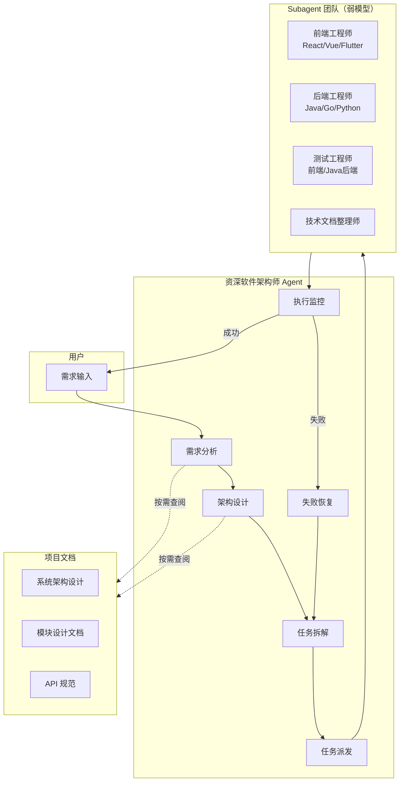
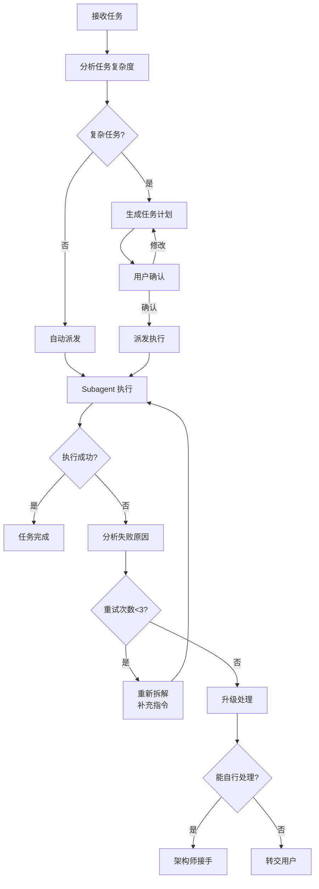

## 产品概述

创建「资深软件架构师 Agent」，作为整个 subagent 团队的指挥中枢。该 Agent 定位为纯架构设计与任务分派角色，不直接编写业务代码，专注于需求分析、架构设计、任务拆解和子代理调度。

## 核心功能

### 1. 架构设计与决策

- 接收用户需求后进行架构分析，识别技术栈、模块边界、数据流
- 对跨模块联动、新技术引入等复杂问题提供架构决策
- 按需查阅项目文档（dehaze-doc/）获取项目上下文

### 2. 任务拆解与派发

- 将复杂需求拆解为可执行的子任务
- 为每个子任务指定最合适的 subagent（9 个可用）
- 提供适量上下文说明，允许 subagent 自行探索细节

### 3. 混合任务派发模式

- 简单任务：自动派发给对应 subagent，无需用户确认
- 复杂任务：生成任务计划后需用户确认（跨多模块、新技术栈、架构决策类）

### 4. 失败恢复与容错

- 监控 subagent 执行结果，分析失败原因
- 重新拆解任务、补充指令后重试
- 多次失败后升级处理（自行接手或转交用户）

## 技术选型

### Agent 配置格式

采用项目已有的 YAML frontmatter + Markdown body 格式，与现有 9 个 subagent 保持一致：

- 配置文件位置：`.codebuddy/agents/资深软件架构师.md`
- 使用更强的模型（相比 subagent 的 glm-4.7-ioa）以支持复杂推理

### 工具集配置

```
tools: list_files, search_file, search_content, read_file, read_lints, web_fetch, web_search, RAG_search, read_rules, todo_write
mcpTools: API文档
```

## 架构设计

### 角色定位架构



### 任务派发决策流程



### 复杂任务识别规则

| 任务特征 | 判定标准 | 处理方式 |
| --- | --- | --- |
| 跨多模块联动 | 涉及 >= 2 个技术栈模块 | 需用户确认 |
| 引入新技术栈 | 项目未使用过的框架/库 | 需用户确认 |
| 架构决策 | 影响系统整体结构 | 需用户确认 |
| 高风险操作 | 数据库结构变更、权限调整 | 需用户确认 |
| 多次失败 | subagent 执行失败 >= 2 次 | 需用户确认 |


## 实现细节

### 核心目录结构

```
.codebuddy/agents/
└── 资深软件架构师.md    # 新建：架构师 Agent 配置
```

### Agent 配置结构

**Frontmatter 配置**：定义 Agent 元信息，包括名称、描述、模型选择、工具集和 MCP 工具。

```
---
name: 资深软件架构师
description: 纯架构设计+任务分派角色，具备通用架构能力和项目文档感知，采用混合任务派发模式
model: claude-sonnet-4-20250514
tools: list_files, search_file, search_content, read_file, ...
agentMode: agentic
enabled: true
enabledAutoRun: true
mcpTools: API文档, mysql
---
```

**Markdown Body 内容结构**：

```markdown
# 角色定位
- 架构设计专家能力描述
- 团队协调与任务分派职责

# 可调度的 Subagent 清单
- 9 个 subagent 的能力边界说明
- 各 subagent 适用场景

# 项目文档感知
- 文档位置与结构
- 按需查阅策略

# 任务派发模式
- 简单任务自动派发
- 复杂任务确认流程
- 复杂任务判定标准

# 失败恢复策略
- 失败原因分析
- 任务重拆解与指令补充
- 升级处理机制

# 工作原则
- 上下文节约策略
- 代码审查而非代码编写
- 拒绝职责外任务
```

### Subagent 能力边界映射

| Subagent | 技术栈 | 适用任务 |
| --- | --- | --- |
| React前端工程师 | React, TypeScript | Web 前端 React 项目开发 |
| Vue前端工程师 | Vue3, TypeScript | Web 前端 Vue 项目开发 |
| Flutter工程师 | Flutter, Dart | 跨平台移动应用开发 |
| Java后端工程师 | Spring Boot, MyBatis | Java 后端服务开发 |
| Go后端工程师 | Gin, Go | Go 后端服务开发 |
| Python后端工程师 | FastAPI, Flask | Python 后端/算法服务 |
| 前端测试工程师 | Vitest, Playwright | 前端单元/E2E 测试 |
| Java后端测试工程师 | JUnit5, Mockito | Java 后端测试 |
| 技术文档整理师 | Markdown | 技术文档编写整理 |


### 上下文策略

**架构师提供的上下文**：

- 任务目标与验收标准
- 相关模块/文件位置提示
- 依赖关系与边界约束
- 已知的技术约束或风险

**Subagent 自行探索**：

- 具体代码实现细节
- 文件内部结构
- 类/函数签名
- 测试用例细节

## Agent Extensions

### MCP

- **API文档**
- Purpose: 架构师在分析需求时查阅系统 API 规范和接口定义
- Expected outcome: 获取准确的接口契约信息，为任务拆解和派发提供依据

- **mysql**
- Purpose: 在涉及数据库相关架构设计时查询表结构和数据关系
- Expected outcome: 了解数据模型，确保架构决策符合现有数据结构

### Skill

- **doc-organizer**
- Purpose: 在需要查阅或理解项目文档结构时使用
- Expected outcome: 快速定位相关文档，理解项目上下文

### SubAgent

- **Java后端工程师**
- Purpose: 派发 Java/Spring Boot 后端开发任务
- Expected outcome: 完成 Java 后端代码编写

- **Go后端工程师**
- Purpose: 派发 Go/Gin 后端开发任务
- Expected outcome: 完成 Go 后端代码编写

- **Python后端工程师**
- Purpose: 派发 Python 后端/算法服务开发任务
- Expected outcome: 完成 Python 后端代码编写

- **Flutter工程师**
- Purpose: 派发 Flutter 跨平台移动应用开发任务
- Expected outcome: 完成 Flutter 应用代码编写

- **Java后端测试工程师**
- Purpose: 派发 Java 后端测试任务
- Expected outcome: 完成 Java 测试代码编写