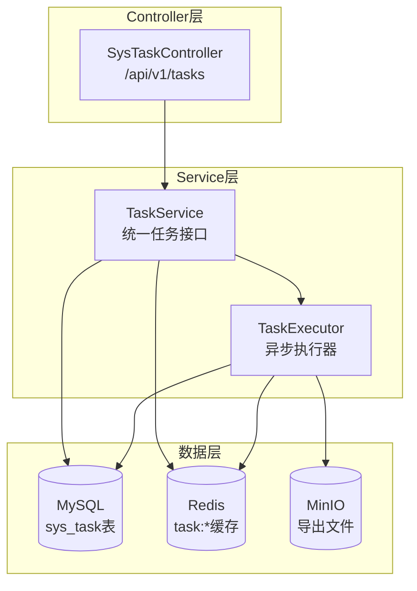
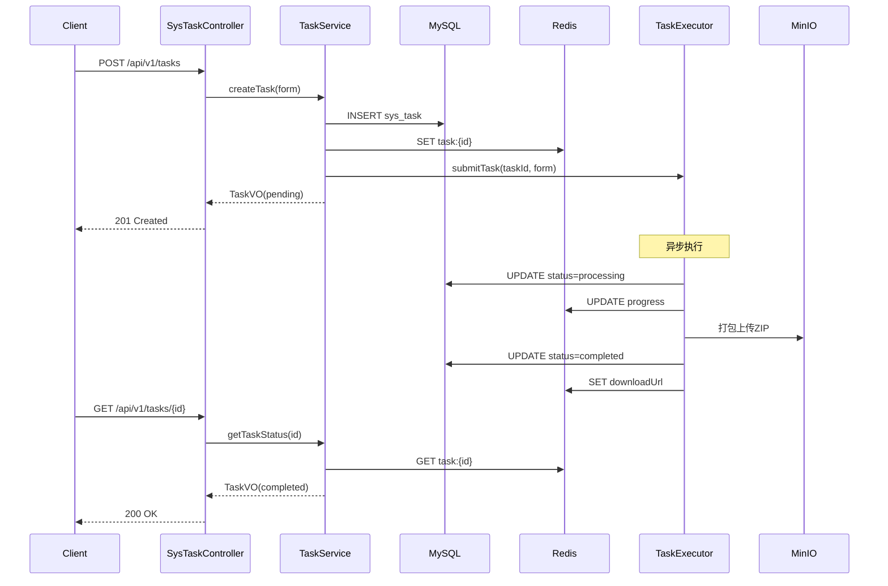

## 产品概述

统一任务系统架构重构，**全新重写**任务管理体系，删除现有的双轨系统（TaskService + DownloadService），建立清晰简洁的单一任务服务架构，降低新人理解成本。

## 核心功能

### 1. 全新任务管理

- **删除**旧任务系统（DownloadService 仅 Redis）和现有 TaskService
- **重写**统一的 TaskService，基于 MySQL + Redis 双写
- 统一数据模型：使用 SysTask 实体，废弃 DownloadTaskVO
- 统一 Redis Key 前缀：`task:{taskId}`

### 2. 统一 API 入口

- **删除**现有分散的 6 个任务相关 API 入口
- **新建**统一的 `/api/v1/tasks` RESTful 接口
- 支持任务类型：数据集导出、数据项下载、批量下载

### 3. 统一任务能力

- 所有任务类型统一支持取消机制
- 统一任务状态流转：PENDING -> PROCESSING -> COMPLETED/FAILED/CANCELLED
- 统一过期时间和清理机制

### 4. 删除旧代码

- 直接删除 DownloadService、DownloadServiceImpl、DownloadTaskVO
- 删除 SysExportTaskController
- 清理所有调用方的旧依赖

## 技术栈

- 后端框架：Spring Boot 3.x + MyBatis-Plus
- 数据持久化：MySQL（任务元数据）+ Redis（实时状态缓存）
- 异步处理：Spring @Async + 自定义线程池
- 文件存储：MinIO 对象存储

## 技术架构

### 系统架构



### 模块划分

| 模块 | 职责 | 关键技术 | 依赖 |
| --- | --- | --- | --- |
| SysTaskController | 统一任务 API 入口 | Spring MVC | TaskService |
| TaskService | 任务生命周期管理 | MyBatis-Plus, RedisTemplate | TaskExecutor, SysTaskMapper |
| TaskExecutor | 异步任务执行 | @Async, 线程池 | FileService, DatasetService |
| TaskCleanupJob | 过期任务清理 | XXL-Job | TaskService |


### 数据流



## 实现详情

### 核心目录结构

本次重构采用**删除+重写**策略，涉及文件：

```
dehaze-java/src/main/java/com/pei/dehaze/
├── controller/
│   ├── SysTaskController.java          # 新增：统一任务控制器
│   ├── SysExportTaskController.java    # 删除
│   ├── SysDatasetController.java       # 修改：移除旧任务相关代码
│   ├── SysDatasetItemController.java   # 修改：移除旧任务相关代码
│   └── FileController.java             # 修改：移除旧任务相关代码
├── service/
│   ├── TaskService.java                # 重写：全新接口设计
│   ├── DownloadService.java            # 删除
│   └── impl/
│       ├── TaskServiceImpl.java        # 重写：全新实现
│       └── DownloadServiceImpl.java    # 删除
├── model/
│   └── vo/
│       ├── TaskVO.java                 # 保留：统一任务响应
│       └── DownloadTaskVO.java         # 删除
└── common/
    └── constant/
        └── TaskConstants.java          # 新增：任务相关常量
```

### 关键代码结构

**统一任务接口 TaskService**：全新设计的任务服务接口。

```java
public interface TaskService {
    // 通用任务创建
    TaskVO createTask(TaskCreateForm form);
    
    // 查询任务状态
    TaskVO getTaskStatus(String taskId);
    
    // 下载导出文件
    String getDownloadUrl(String taskId);
    
    // 取消任务
    void cancelTask(String taskId);
    
    // 分页查询任务列表
    PageResult<TaskVO> listTasks(TaskQuery query);
}
```

**统一任务控制器 SysTaskController**：提供 RESTful 风格的统一 API 入口。

```java
@RestController
@RequestMapping("/api/v1/tasks")
public class SysTaskController {
    
    @PostMapping
    public Result<TaskVO> createTask(@RequestBody TaskCreateForm form);
    
    @GetMapping("/{taskId}")
    public Result<TaskVO> getTaskStatus(@PathVariable String taskId);
    
    @GetMapping("/{taskId}/download")
    public ResponseEntity<Resource> downloadFile(@PathVariable String taskId);
    
    @DeleteMapping("/{taskId}")
    @ResponseStatus(HttpStatus.NO_CONTENT)
    public void cancelTask(@PathVariable String taskId);
}
```

**统一 Redis Key 常量**：规范化所有任务相关的 Redis Key 前缀。

```java
public final class TaskConstants {
    // Redis Key 前缀
    public static final String TASK_CACHE_PREFIX = "task:";
    public static final String TASK_CANCEL_PREFIX = "task:cancel:";
    
    // 过期时间
    public static final long TASK_EXPIRE_HOURS = 24;
    public static final long CANCEL_FLAG_EXPIRE_MINUTES = 5;
    
    // 任务类型
    public static final String TYPE_DATASET_EXPORT = "dataset_export";
    public static final String TYPE_ITEM_DOWNLOAD = "item_download";
    public static final String TYPE_BATCH_DOWNLOAD = "batch_download";
}
```

### 技术实现方案

**1. 删除旧代码清单**

| 文件 | 类型 | 说明 |
| --- | --- | --- |
| DownloadService.java | 接口 | 旧下载服务接口 |
| DownloadServiceImpl.java | 实现类 | 旧下载服务实现 |
| DownloadTaskVO.java | VO | 旧下载任务响应对象 |
| SysExportTaskController.java | 控制器 | 旧导出任务控制器 |


**2. Redis Key 设计**

| Key 模式 | 用途 | 过期时间 |
| --- | --- | --- |
| `task:{id}` | 任务状态缓存 | 24小时 |
| `task:cancel:{id}` | 取消标识 | 5分钟 |


**3. 新 API 设计**

| 方法 | 路由 | 说明 |
| --- | --- | --- |
| POST | /api/v1/tasks | 创建任务（通过 type 区分类型） |
| GET | /api/v1/tasks/{taskId} | 查询任务状态 |
| GET | /api/v1/tasks/{taskId}/download | 下载文件 |
| DELETE | /api/v1/tasks/{taskId} | 取消任务 |
| GET | /api/v1/tasks | 分页查询任务列表 |


### 测试策略

| 测试类型 | 范围 | 关键点 |
| --- | --- | --- |
| 单元测试 | TaskServiceImpl | 任务创建、状态流转、取消机制 |
| 集成测试 | SysTaskController | API 路由、参数校验、响应格式 |


### 安全考量

- 任务创建需要用户认证，taskId 生成使用 UUID 防止遍历攻击
- 下载文件时验证任务所有者，防止越权访问
- 取消任务时验证用户权限，只能取消自己创建的任务

## Agent Extensions

### SubAgent

- **Java后端工程师**
- 用途：执行 Java 后端代码的重写、删除旧代码、新建统一 API 等核心编码工作
- 预期成果：完成 TaskService 重写、SysTaskController 新增、旧代码删除

### Skill

- **doc-organizer**
- 用途：更新重构涉及的现有模块文档（数据集管理、文件管理等）
- 预期成果：更新 dehaze-doc 中涉及任务相关的 API 接口文档和后端实现文档