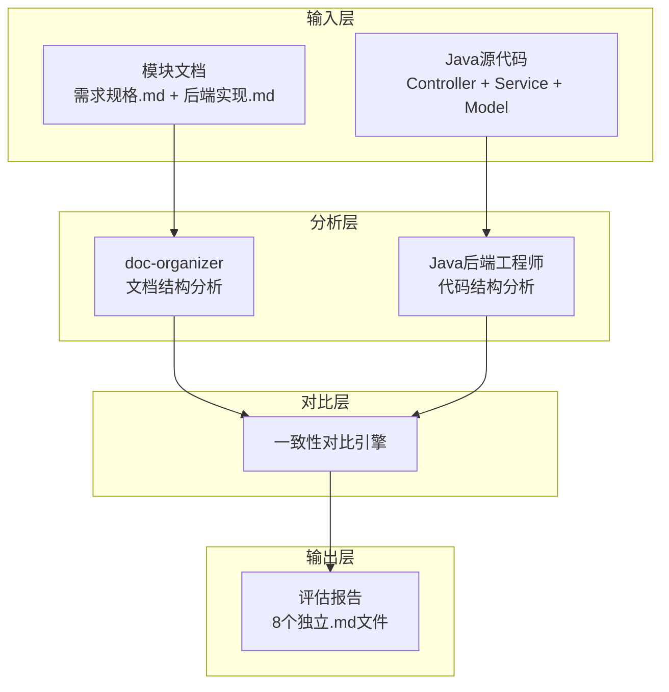
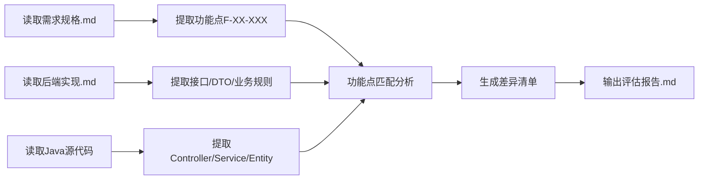

## 产品概述

基础模块文档与代码一致性评估系统，旨在对8个基础模块（用户管理、角色管理、部门管理、菜单管理、字典管理、认证管理、任务管理、文件管理）的需求规格文档、后端设计文档与 dehaze-java 源代码进行系统性的一致性分析，为每个模块生成独立的评估报告。

## 核心功能

### 1. 文档与代码一致性分析

- 对比需求规格文档中定义的功能点与实际代码实现的匹配度
- 检查后端实现文档描述的接口、DTO、业务逻辑与源代码的一致性
- 识别文档中存在但代码未实现、或代码已实现但文档未记录的差异项

### 2. 多维度差异识别

- **接口层差异**：Controller 方法与文档描述的 API 端点对比
- **数据模型差异**：Entity/DTO/VO/Form 与文档定义的字段对比
- **业务逻辑差异**：Service 层业务规则与需求规格的业务规则对比
- **权限配置差异**：代码中的权限注解与文档定义的权限矩阵对比

### 3. 独立评估报告生成

- 为每个模块生成独立的 Markdown 格式评估报告
- 报告包含：一致项清单、差异项清单、建议修复项、优先级评估
- 仅识别并报告差异，不对文档或代码进行任何修改

## 技术栈

- **文档格式**：Markdown (.md)
- **源代码语言**：Java (Spring Boot + MyBatis-Plus)
- **分析工具**：doc-organizer skill + Java后端工程师 subagent

## 技术架构

### 系统架构



### 模块划分

| 模块 | 文档文件 | 代码文件 |
| --- | --- | --- |
| 用户管理 | 需求规格.md, 后端实现.md, API接口.md | SysUserController, SysUserService, SysUser |
| 角色管理 | 需求规格.md, 后端实现.md, API接口.md | SysRoleController, SysRoleService, SysRole |
| 部门管理 | 需求规格.md, 后端实现.md, API接口.md | SysDeptController, SysDeptService, SysDept |
| 菜单管理 | 需求规格.md, 后端实现.md, API接口.md | SysMenuController, SysMenuService, SysMenu |
| 字典管理 | 需求规格.md, 后端实现.md, API接口.md | SysDictController, SysDictService, SysDict |
| 认证管理 | 需求规格.md, 后端实现.md | AuthController, AuthService |
| 任务管理 | 需求规格.md, 后端实现.md | SysTaskController, TaskService, SysTask |
| 文件管理 | 需求规格.md, 后端实现.md | FileController, FileService, SysFile |


### 数据流



## 实现细节

### 核心目录结构

```
dehaze-doc/docs/项目文档/图像去雾系统/新结构/03-模块设计/基础模块/
├── 用户管理/
│   ├── 需求规格.md          # 输入：功能需求
│   ├── 后端实现.md          # 输入：设计文档
│   ├── API接口.md           # 输入：接口契约
│   └── 一致性评估报告.md     # 输出：新增评估报告
├── 角色管理/
│   └── 一致性评估报告.md     # 输出
├── 部门管理/
│   └── 一致性评估报告.md     # 输出
├── 菜单管理/
│   └── 一致性评估报告.md     # 输出
├── 字典管理/
│   └── 一致性评估报告.md     # 输出
├── 认证管理/
│   └── 一致性评估报告.md     # 输出
├── 任务管理/
│   └── 一致性评估报告.md     # 输出
└── 文件管理/
    └── 一致性评估报告.md     # 输出
```

### 评估报告结构

每个模块的评估报告包含以下结构：

```markdown
# [模块名]一致性评估报告

## 1. 评估概览
- 评估范围、评估时间、一致性得分

## 2. 文档清单
- 本次评估涉及的文档和代码文件列表

## 3. 一致性分析结果

### 3.1 接口层对比
| 文档定义 | 代码实现 | 状态 | 差异说明 |

### 3.2 数据模型对比
| 字段/DTO | 文档定义 | 代码实现 | 状态 |

### 3.3 业务逻辑对比
| 功能点 | 需求描述 | 代码实现 | 状态 |

## 4. 差异项清单
- 文档有但代码无
- 代码有但文档无
- 定义不一致

## 5. 建议修复项
- 按优先级排序的修复建议
```

### 一致性检查维度

1. **API 接口一致性**

- HTTP Method 匹配
- 路径 Path 匹配
- 请求参数匹配
- 响应结构匹配

2. **数据模型一致性**

- Entity 字段与文档表结构
- DTO/VO 字段与文档定义
- 校验规则匹配

3. **业务规则一致性**

- 功能点实现完整性
- 业务流程匹配
- 权限控制匹配

## Agent Extensions

### Skill

- **doc-organizer**
- 用途：使用文档评审流程分析需求规格和后端实现文档的结构、内容边界、SSOT合规性
- 预期结果：识别文档中定义的功能点、接口、DTO、业务规则等关键信息

### SubAgent

- **Java后端工程师**
- 用途：分析 dehaze-java 源代码中 Controller、Service、Entity、DTO 的实现细节
- 预期结果：提取代码中实际实现的接口端点、字段定义、业务逻辑，用于与文档对比