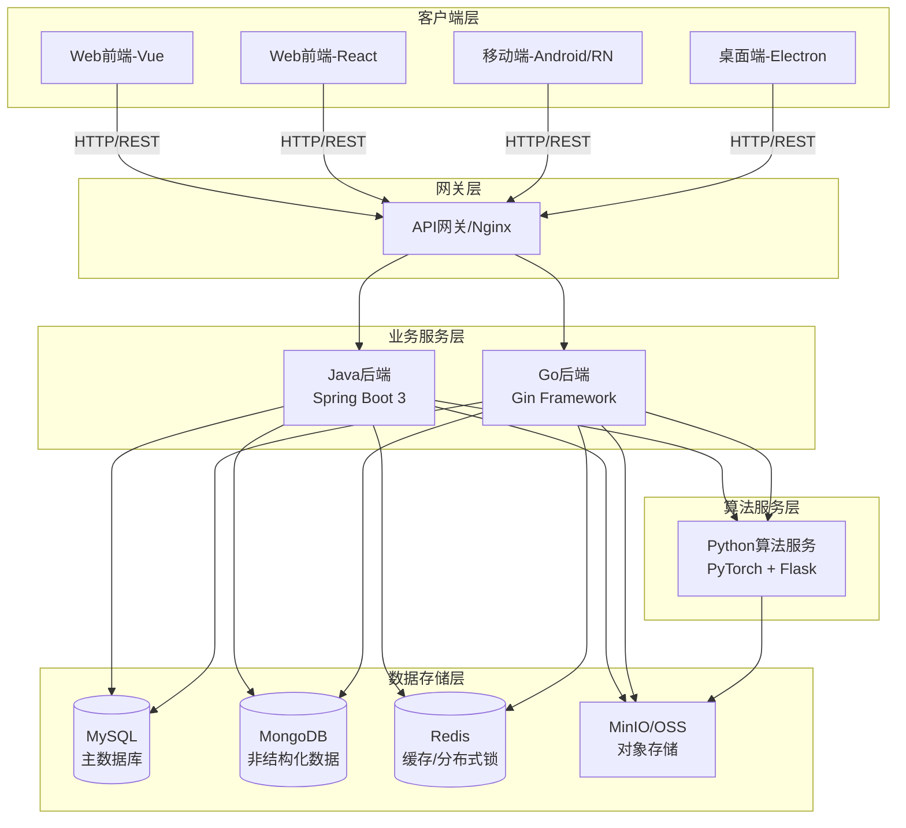
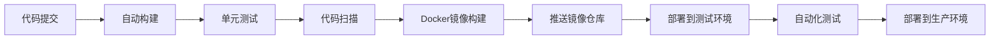

# Dehaze System - 基于深度学习的图像去雾系统

<p align="center">
  
</p>

<p align="center">
  <a href="https://gitee.com/earthy-zinc/dehaze-system">
    
  </a>
  <a href="https://gitee.com/earthy-zinc/dehaze-system/stargazers">
    
  </a>
  <a href="https://gitee.com/earthy-zinc/dehaze-system/network">
    
  </a>
</p>

---

## 📋 项目简介

**Dehaze System** 是一个基于深度学习的在线实时响应图像去雾系统,旨在改善受雾霾影响的图像质量。系统采用现代化全栈技术架构,提供完整的端到端图像去雾解决方案。

### 核心特性

- **🎯 智能去雾**: 集成20+种主流去雾算法(RIDCP、WPXNet、Dehamer等),基于深度学习实现高质量图像恢复
- **🌐 全栈开发**: 前后端分离架构,支持Vue/React双前端方案,Java/Go/Python多后端技术栈
- **📱 多端支持**: Web端、Android App、React Native、Taro小程序、Electron桌面应用
- **⚡ 实时处理**: WebSocket实时推送去雾进度,异步任务处理提高系统吞吐量
- **🔐 安全可靠**: JWT+RBAC权限模型,Redis分布式锁,完善的安全防护机制
- **🚀 高性能**: GPU加速推理,Redis缓存优化,支持Docker容器化部署

---

## 🏗️ 系统架构

### 整体架构图



### 技术架构分层

| 层级 | 技术栈 | 说明 |
|------|--------|------|
| **前端展示层** | Vue3/React + TypeScript + Vite | 响应式设计,支持PC/移动端 |
| **API网关层** | Nginx | 负载均衡,反向代理 |
| **业务服务层** | Spring Boot 3 / Gin | 用户管理,权限控制,业务逻辑 |
| **算法服务层** | PyTorch + Flask + Gunicorn | 深度学习模型推理,图像处理 |
| **数据持久层** | MySQL + MongoDB + Redis | 关系型/非关系型数据存储 |
| **对象存储层** | MinIO / 阿里云OSS | 图片文件存储 |

---

## 📦 技术栈详解

### 前端技术

#### Vue版本 (dehaze-front-vue)
- **核心框架**: Vue 3.4 + Vite 5 + TypeScript 5
- **UI组件库**: Element Plus 2.7
- **状态管理**: Pinia 2.1
- **路由管理**: Vue Router 4.3
- **工具库**: VueUse、Lodash-ES、ECharts 5.5
- **实时通信**: SockJS + StompJS (WebSocket)
- **代码规范**: ESLint + Prettier + Stylelint + Husky

**功能亮点**:
- 组件分层管理(基础组件/业务组件/布局组件)
- 瀑布流+懒加载优化大规模数据集展示
- Canvas实现放大镜功能
- CSS clip-path实现图像重叠对比
- 动态路由+静态路由分离

#### React版本 (dehaze-front-react)
- **核心框架**: React 18 + TypeScript + Vite
- **UI组件库**: Ant Design 5.x
- **状态管理**: Redux Toolkit
- **桌面端**: Electron 31
- **样式方案**: UnoCSS

### 后端技术

#### Java后端 (dehaze-java)
- **核心框架**: Spring Boot 3.3 + JDK 17
- **安全框架**: Spring Security 6 + JWT
- **ORM框架**: MyBatis-Plus 3.5
- **数据库**: MySQL 8.0 + MongoDB
- **缓存**: Redis 6.0+ + Redisson分布式锁
- **对象存储**: MinIO 8.5 / 阿里云OSS
- **接口文档**: Knife4j 4.3 (OpenAPI 3)
- **监控**: Prometheus + Grafana + Actuator

**核心功能模块**:
- 用户管理: JWT令牌认证,RBAC权限模型
- 文件管理: 多存储方案适配,支持分片上传
- 系统管理: 部门树形结构,数据权限控制
- 算法管理: 动态加载模型,支持12+种算法

**技术亮点**:
- 布隆过滤器防缓存穿透
- @PreventDuplicateSubmit防重复提交
- CompletableFuture异步任务处理
- 策略模式实现多存储方案适配

#### Go后端 (dehaze-go)
- **核心框架**: Gin + GORM
- **版本要求**: Go 1.20+
- **数据库**: MySQL + MongoDB + Redis
- **安全机制**: JWT + RBAC
- **接口文档**: Swagger

**优势特点**:
- 高性能并发处理(goroutine)
- 更优的内存管理(GC机制)
- 简洁的错误处理
- 灵活的中间件机制

#### Python算法服务 (dehaze-python)
- **深度学习**: PyTorch 1.7+
- **Web框架**: Flask + Gunicorn
- **容器化**: Docker (NVIDIA CUDA 12.1镜像)
- **依赖管理**: Conda + requirements.txt

**支持的去雾算法** (20+种):
- RIDCP: 基于高质量码本的双分支网络
- WPXNet: 金字塔空洞邻域注意力
- Dehamer: Transformer邻域注意力
- FFA-Net: 特征融合注意力网络
- AOD-Net: All-in-One去雾网络
- DCP: 暗通道先验算法
- ...更多算法持续集成中

**技术难点突破**:
- 模型动态加载与缓存机制
- GPU资源分配优化
- 跨平台兼容性处理(部分算法仅支持Linux)
- 模型输入输出格式统一

### 移动端技术

- **Android**: 原生Android开发
- **React Native**: 跨平台移动应用
- **Taro**: 多端统一开发框架(小程序/H5/RN)

---

## 🚀 快速开始

### 环境要求

| 软件 | 版本要求 | 说明 |
|------|----------|------|
| Node.js | 18.0+ | 前端开发环境 |
| Java JDK | 17+ | Java后端运行环境 |
| Python | 3.8+ | 算法服务环境 |
| Go | 1.20+ | Go后端运行环境 |
| MySQL | 8.0+ | 主数据库 |
| MongoDB | 4.4+ | 非结构化数据存储 |
| Redis | 6.0+ | 缓存与分布式锁 |
| Docker | 可选 | 容器化部署 |
| CUDA | 推荐 | GPU加速(算法服务) |

### 前端启动

#### Vue版本
```bash
cd dehaze-front-vue
npm install pnpm -g
pnpm install
pnpm run dev
```
访问: http://localhost:5173

#### React版本
```bash
cd dehaze-front-react
npm install pnpm -g
pnpm install
pnpm run dev
```

### 后端启动

#### Java后端
```bash
cd dehaze-java
# 1. 执行数据库初始化脚本
mysql -u root -p < sql/init.sql

# 2. 修改配置文件
# 编辑 src/main/resources/application-dev.yml
# 配置MySQL、Redis、MinIO等连接信息

# 3. 启动服务
mvn clean install
mvn spring-boot:run
```
访问接口文档: http://localhost:8989/doc.html

#### Go后端
```bash
cd dehaze-go
# 修改配置文件
vim config/config.yaml

# 启动服务
go mod download
go run main.go
```

#### Python算法服务
```bash
cd dehaze-python
# 创建虚拟环境
conda create -n dehaze_backend python=3.10
conda activate dehaze_backend

# 安装依赖
pip install -r requirements.txt

# 启动服务(开发环境)
python run.py

# 生产环境部署
gunicorn -w 4 run:app
```

---

## 📁 项目结构

```
dehaze-system/
├── dehaze-algorithm/          # 核心去雾算法实现
│   ├── basicsr/              # BasicSR框架
│   ├── options/              # 训练配置
│   └── inference_ridcp.py    # RIDCP算法推理脚本
│
├── dehaze-front-vue/          # Vue3前端实现
│   ├── src/
│   │   ├── views/            # 页面组件
│   │   ├── components/       # 复用组件
│   │   ├── api/              # API接口管理
│   │   ├── store/            # Pinia状态管理
│   │   └── router/           # 路由配置
│   └── package.json          # Vue 3.4 + Vite 5
│
├── dehaze-front-react/        # React前端实现
│   ├── src/
│   │   ├── pages/            # 页面组件
│   │   ├── components/       # 组件库
│   │   └── store/            # Redux状态
│   └── desktop/              # Electron桌面端
│
├── dehaze-java/               # Java后端 (主要后端)
│   ├── src/main/java/com/pei/dehaze/
│   │   ├── controller/       # 控制器层
│   │   ├── service/          # 服务层
│   │   ├── mapper/           # 数据访问层
│   │   ├── model/            # 实体类
│   │   └── config/           # 配置类
│   ├── pom.xml               # Spring Boot 3.3
│   └── sql/init.sql          # 数据库初始化脚本
│
├── dehaze-go/                 # Go后端 (备选方案)
│   ├── api/                  # API层
│   ├── service/              # 服务层
│   ├── model/                # 模型层
│   ├── router/               # 路由
│   ├── middleware/           # 中间件
│   └── config/               # 配置
│
├── dehaze-python/             # Python算法服务 (核心)
│   ├── algorithm/            # 20+种去雾算法
│   │   ├── RIDCP/
│   │   ├── WPXNet/
│   │   ├── Dehamer/
│   │   └── ...
│   ├── app/                  # Flask应用
│   ├── run.py                # 启动脚本
│   └── requirements.txt      # Python依赖
│
├── dehaze-java-cloud/         # Java微服务版本
├── dehaze-java-cloud-plus/    # Java微服务增强版
│
├── dehaze-android/            # Android客户端
├── dehaze-react-native/       # RN跨平台应用
├── dehaze-taro/               # Taro小程序
│
├── dehaze-paper/              # 学术论文
│   ├── CMFD-Net.tex          # 论文LaTeX源码
│   └── references.bib         # 参考文献
│
└── dehaze-doc/                # 项目文档
    └── docs/                 # VuePress文档站点
```

---

## 🧠 核心算法介绍

### 基于高质量码本先验的双分支多尺度图像去雾算法

本项目提出的创新算法,针对非均匀雾霾场景的图像去雾问题:

#### 核心创新点

1. **高质量码本先验**: 使用VQGAN训练离散码本,封装清晰图像的色彩和结构先验知识
2. **金字塔空洞邻域注意力编码器**: 聚合多层级特征,实现多尺度特征提取
3. **增强解码器**: 结合像素级和通道级注意力机制,处理浓雾区域
4. **双分支网络结构**: 通过特征融合提升去雾效果

#### 性能表现

在多个公开数据集上的实验结果:
- **O-HAZE数据集**: PSNR提升2.3dB, SSIM提升0.05
- **DENSE-HAZE数据集**: 浓雾场景下效果显著提升
- **推理速度**: 单张图像处理时间<2秒(GPU加速)

#### 算法使用

```bash
cd dehaze-algorithm
pip install -r requirements.txt

# 单张图像去雾
python inference_ridcp.py \
  -i inputs/foggy_image.jpg \
  -w weights/ridcp_model.pth \
  -o results/

# 批量处理
python inference_ridcp.py \
  -i inputs/ \
  -w weights/ridcp_model.pth \
  -o results/
```

---

## 📊 系统功能模块

### 用户管理模块
- 用户注册/登录/登出
- JWT令牌认证机制
- 角色-权限-菜单三级控制(RBAC)
- 部门树形结构管理
- 用户信息加密传输

### 数据集管理模块
- 数据集CRUD操作
- 瀑布流展示+懒加载
- 图片MD5校验去重
- 批量上传(支持分片)
- 数据集导入导出
- 图片数量统计

### 图像处理模块
- 实时摄像头捕获
- 图像叠加对比(CSS clip-path)
- 放大镜细节查看(Canvas)
- 亮度/对比度实时调节
- 图像参数可视化

### 算法管理模块
- 20+种去雾算法支持
- 算法参数配置
- 模型动态加载
- 批量图像处理
- 处理进度实时推送(WebSocket)
- 算法效果评估指标(PSNR/SSIM)

### 系统配置模块
- 主题色动态切换
- 暗黑模式支持
- 布局模式切换(侧边/顶部/混合)
- 水印开关
- 多语言支持(i18n)

---

## 🛠️ 部署方案

### Docker容器化部署

#### 构建镜像

```bash
# Vue前端
cd dehaze-front-vue
docker build -t dehaze-front-vue:latest .

# Java后端
cd dehaze-java
docker build -t dehaze-java:latest .

# Python算法服务(支持GPU)
cd dehaze-python
docker build -t dehaze-python:latest .
```

#### Docker Compose一键部署

```yaml
version: '3.8'
services:
  frontend:
    image: dehaze-front-vue:latest
    ports:
      - "80:80"
  
  backend:
    image: dehaze-java:latest
    ports:
      - "8989:8989"
    environment:
      - SPRING_DATASOURCE_URL=jdbc:mysql://mysql:3306/dehaze
      - SPRING_REDIS_HOST=redis
  
  algorithm:
    image: dehaze-python:latest
    ports:
      - "5000:5000"
    runtime: nvidia  # GPU支持
  
  mysql:
    image: mysql:8.0
    environment:
      MYSQL_ROOT_PASSWORD: password
      MYSQL_DATABASE: dehaze
  
  redis:
    image: redis:6.0
```

### Nginx配置

```nginx
server {
    listen 80;
    server_name your-domain.com;
    
    # 前端静态资源
    location / {
        root /usr/share/nginx/html;
        index index.html;
        try_files $uri $uri/ /index.html;
    }
    
    # API代理
    location /api/ {
        proxy_pass http://backend:8989/;
        proxy_set_header Host $host;
        proxy_set_header X-Real-IP $remote_addr;
    }
    
    # WebSocket支持
    location /ws/ {
        proxy_pass http://backend:8989/ws/;
        proxy_http_version 1.1;
        proxy_set_header Upgrade $http_upgrade;
        proxy_set_header Connection "upgrade";
    }
}
```

### CI/CD流程



---

## 📈 性能优化

### 前端优化策略

1. **资源加载优化**
   - 组件懒加载,按需引入
   - 图片懒加载(vue3-lazyload)
   - 路由懒加载
   - Vite构建优化(代码分割)

2. **渲染性能优化**
   - 虚拟滚动(大列表优化)
   - 防抖/节流(高频操作)
   - CSS transform硬件加速

3. **网络优化**
   - API请求合并
   - 资源CDN加速
   - Gzip压缩

### 后端优化策略

1. **数据库优化**
   - 索引优化(联合索引)
   - 慢SQL检测与优化
   - 分页查询优化

2. **缓存策略**
   - Redis多级缓存
   - 布隆过滤器防缓存穿透
   - 缓存预热机制

3. **并发处理**
   - Redisson分布式锁
   - CompletableFuture异步处理
   - 线程池参数调优

### 算法服务优化

1. **模型推理优化**
   - ONNX Runtime加速
   - TensorRT优化(GPU)
   - 模型量化(减小体积)

2. **资源管理**
   - 模型缓存机制
   - GPU显存管理
   - 多进程负载均衡

3. **通信优化**
   - gRPC替代HTTP
   - 结果异步返回
   - 熔断降级机制

---

## 📚 文档资源

### 技术文档

详细文档位于 `dehaze-doc` 目录:

- [系统需求分析](dehaze-doc/docs/项目文档/图像去雾系统/系统需求分析.md)
- [系统设计文档](dehaze-doc/docs/项目文档/图像去雾系统/系统设计.md)
- [数据库设计](dehaze-doc/docs/项目文档/图像去雾系统/数据库设计.md)
- [API接口设计](dehaze-doc/docs/项目文档/图像去雾系统/API接口设计.md)
- [系统部署文档](dehaze-doc/docs/项目文档/图像去雾系统/系统部署.md)
- [用户使用手册](dehaze-doc/docs/项目文档/图像去雾系统/用户手册.md)

### API接口文档

- **Knife4j文档**: http://localhost:8989/doc.html
- **Swagger文档**: http://localhost:8989/swagger-ui/index.html
- **Apifox在线文档**: [查看文档](https://www.apifox.cn/apidoc/shared-195e783f-4d85-4235-a038-eec696de4ea5)

### 学术论文

详见 `dehaze-paper` 目录,包含完整的LaTeX论文源码和参考文献。

---

## 🤝 贡献指南

我们欢迎任何形式的贡献,包括但不限于:

### 如何贡献

1. **Fork项目** - 点击右上角Fork按钮
2. **创建分支** - `git checkout -b feature/AmazingFeature`
3. **提交代码** - `git commit -m 'Add some AmazingFeature'`
4. **推送分支** - `git push origin feature/AmazingFeature`
5. **提交PR** - 在GitHub/Gitee上创建Pull Request

### 代码规范

- **前端**: 遵循ESLint + Prettier规范
- **后端**: 遵循阿里巴巴Java开发手册
- **Python**: 遵循PEP 8规范
- **提交信息**: 遵循Conventional Commits规范

### 问题反馈

如遇到问题,请通过以下方式反馈:
- 提交Issue描述问题
- 加入开发者交流群讨论
- 发送邮件至项目维护者

---

## 📄 开源协议

本项目采用 **Apache License 2.0** 开源协议。

- ✅ 允许商业使用
- ✅ 允许修改和分发
- ✅ 提供专利授权
- ⚠️ 需保留版权声明和许可证
- ⚠️ 修改需说明变更

详见 [LICENSE](LICENSE) 文件。

---

## 👥 开发团队

**项目负责人**: 土味锌 (武沛鑫)
- Gitee: [@earthy-zinc](https://gitee.com/earthy-zinc)
- GitHub: [@earthy-zinc](https://github.com/earthy-zinc)

---

## 🙏 致谢

### 开源项目
感谢以下优秀的开源项目:
- Vue.js / React.js - 前端框架
- Spring Boot - Java后端框架
- PyTorch - 深度学习框架
- Element Plus / Ant Design - UI组件库
- BasicSR - 图像超分辨率框架

### 研究贡献
感谢图像去雾领域的研究者和论文作者,为本项目提供了理论基础和算法支持。

### 社区支持
感谢所有参与项目开发、测试、文档编写的贡献者。

---

## 📞 联系方式

- **项目主页**: https://gitee.com/earthy-zinc/dehaze-system
- **问题反馈**: [提交Issue](https://gitee.com/earthy-zinc/dehaze-system/issues)
- **技术讨论**: 欢迎Star和Fork

---

<p align="center">
  <b>如果这个项目对你有帮助,请点个Star⭐支持一下!</b>
</p>
