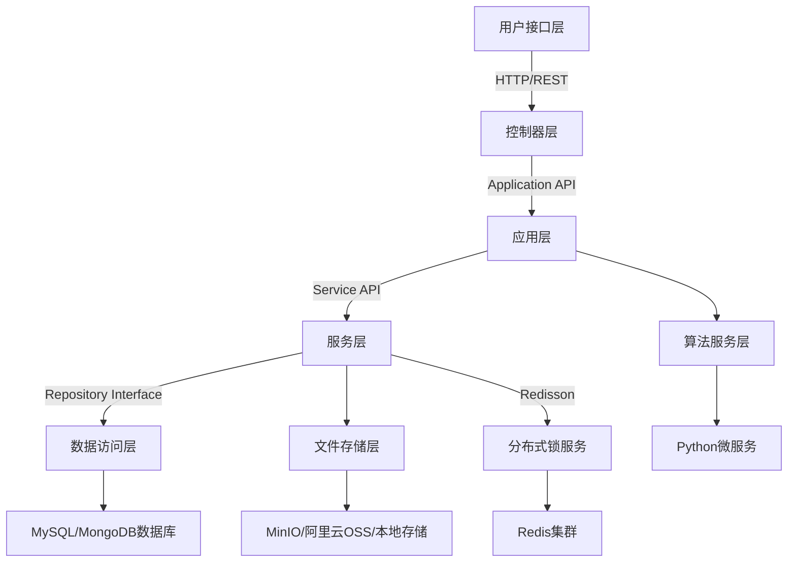

## 📢 项目简介

基于 JDK 17、Spring Boot 3、Spring Security 6、JWT、Redis、Mybatis-Plus、Knife4j 构建的前后端分离图像去雾系统后端。包括用户管理、角色管理、菜单管理、部门管理、字典管理等多个功能。后端自动生成接口文档，支持在线调试，提高开发效率。

## 技术栈

1. **后端框架：** Spring Boot 3 + Spring Security 6，基于Jakarta EE规范
2. **数据库：** MySQL（主数据库） + MongoDB（非结构化数据存储）
3. **缓存与存储：** Redis（分布式锁/缓存） + MinIO/阿里云OSS/本地存储（多存储方案）
4. **算法集成：** 通过Python服务（dehaze-python模块）进行图像处理，采用RESTful API
5. **安全机制：** JWT令牌 + RBAC权限模型 + Redis存储用户权限
6. **监控与日志：** Logback日志系统

## 项目架构



## 主要功能模块

| 模块类型 | 核心实现类                                                    | 关键技术点                                                      |
|------|----------------------------------------------------------|------------------------------------------------------------|
| 安全认证 | JwtValidationFilter/SecurityConfig/SysUserDetailsService | JWT令牌签发校验、Spring Security鉴权                                |
| 文件管理 | FileController/MinioFileService/FileUploadUtils          | 适配多存储方案，支持本地/MinIO/OSS存储，文件分片上传                            |
| 系统管理 | SysController+SysServiceImpl+SysMapper                   | RBAC模型、部门树形结构管理                                            |
| 算法管理 | SysAlgorithmController+算法配置JSON                          | 通过importPath字段实现算法模型动态加载、Python服务集成，支持MSFNet/FFANet等12+种算法 |
| 图像处理 | ImageUtils/FileService                                   | 缩略图生成、EXIF信息提取                                             |

## 项目难点

1. Java后端与Python算法服务的通信过程中可能导致任务阻塞，利用标准化RESTful
   API协议实现服务间通信，异步调用机制（CompletableFuture）与超时控制（Hystrix）解决，避免服务阻塞导致超时
2. 高并发场景下业务处理时间与锁过期时间不匹配导致死锁，通过 @PreventDuplicateSubmit 注解组合业务ID+接口标识生成唯一锁Key解决分布式锁竞争问题。
3. 通过文件分片上传合并策略提高大文件（>1GB）上传成功率
4. Python模型的内存泄漏问题，模型加载/卸载不及时导致内存和显存持续增长，最终会使服务器资源耗尽，不同算法模型的输出格式统一处理，避免算法输出格式不统一导致前端解析异常。
   算法执行超时控制与熔断机制，单个模型故障可能导致整个服务不可用，需要进行熔断处理，避免服务雪崩

## 项目亮点

1. **防⽌重复提交请求**：通过@PreventDuplicateSubmit注解，利⽤ Spring AOP 切⾯注解和 Redisson 分布式锁，通过加锁并设置过期时间，防⽌前端请求重复提交造成损失
2. **多存储方案适配：** 利用策略模式构建接口 FileService 实现多存储方案适配，如本地存储、MinIO、阿里云OSS，提升系统可扩展性
3. **三层安全防护设计：** JWT签名验证 → Redis权限校验 → 方法级@DataPermission注解，整体基于 RBAC 模型，实现细粒度的权限控制，涵盖接口方法和按钮级别
4. **⽤户输⼊及权限校验**：@Validate + 自定义 @DataPermission 注解 + Mybatis 拦截器动态拼接 SQL 查询用户权限，进而利⽤ JWT
   SpringSecurity 和 Redis，通过⽤户 ID 查询存储在 Redis
   中当前⽤户权限，从⽽判断是否准许放⾏，后端针对传⼊参数通过注解验证，提供安全、无状态、分布式友好的身份验证和授权机制，提⾼系统健壮性
5. **项⽬管理**：利⽤接⼝、枚举、泛型定义后端常量，通过继承、实现等⾯向对象⽅法统⼀后端响应结构体，构建全局系统异常处理器，区分开发和⽣产配置，提⾼开发效率和可维护性

## 🌺 相关工程代码
| Gitee                                                        | Github                                                        |
|--------------------------------------------------------------|---------------------------------------------------------------|
| [dehaze-front](https://gitee.com/earthy-zinc/dehaze_front)   | [dehaze-front](https://github.com/earthy-zinc/dehaze_front)   |
| [dehaze-python](https://gitee.com/earthy-zinc/dehaze_python) | [dehaze-python](https://github.com/earthy-zinc/dehaze_python) |

## 🌈 接口文档

- `knife4j` 接口文档：[http://localhost:8989/doc.html](http://localhost:8989/doc.html)
- `swagger` 接口文档：[http://localhost:8989/swagger-ui/index.html](http://localhost:8989/swagger-ui/index.html)
- `apifox`  在线接口文档：[https://www.apifox.cn/apidoc](https://www.apifox.cn/apidoc/shared-195e783f-4d85-4235-a038-eec696de4ea5)


## 🚀 项目启动

1. **数据库初始化**

   执行 [dehaze.sql](sql/init.sql) 脚本完成数据库创建、表结构和基础数据的初始化。

2. **修改配置**

    [application-dev.yml](src/main/resources/application-dev.yml) 修改MySQL、Redis连接配置；

3. **启动项目**

    执行 [SystemApplication.java](src/main/java/com/pei/dehaze/SystemApplication.java) 的 main 方法完成后端项目启动；

    访问接口文档地址 [http://ip:port/doc.html](http://localhost:8989/doc.html) 验证项目启动是否成功。

## 后续优化方案

1. 算法服务优化
    ```mermaid
    sequenceDiagram
        participant SpringBoot as 后端服务
        participant PythonService as 算法微服务
        participant Nginx as 负载均衡
        participant MQ as 消息队列
        SpringBoot->>Nginx: 发送处理请求
        Nginx->>PythonService: 轮询分发
        MQ->>PythonService: 异步任务队列（可选）
        PythonService-->>SpringBoot: 返回处理结果
    ```

* 将Python算法部署为独立微服务
* 使用gRPC替代HTTP协议提升性能
* 实现模型缓存（如ONNX Runtime加速推理）
* 添加健康检查和熔断机制（Hystrix或Resilience4j）

2. 文件存储优化

* 采用分块上传（如MinIO的Part Upload）
* 增加文件元数据缓存（Redis存储文件哈希值）

3. 安全性增强

* 实现JWT动态过期（根据用户登录时间动态计算）
* 增加IP黑白名单过滤
* 敏感操作二次验证（如短信/邮件验证码）

4. 性能监控

* 集成Prometheus+Grafana监控系统
* 添加Slow SQL检测（MyBatis-Plus插件）
* 实现HTTP请求链路追踪（SkyWalking或Zipkin）
