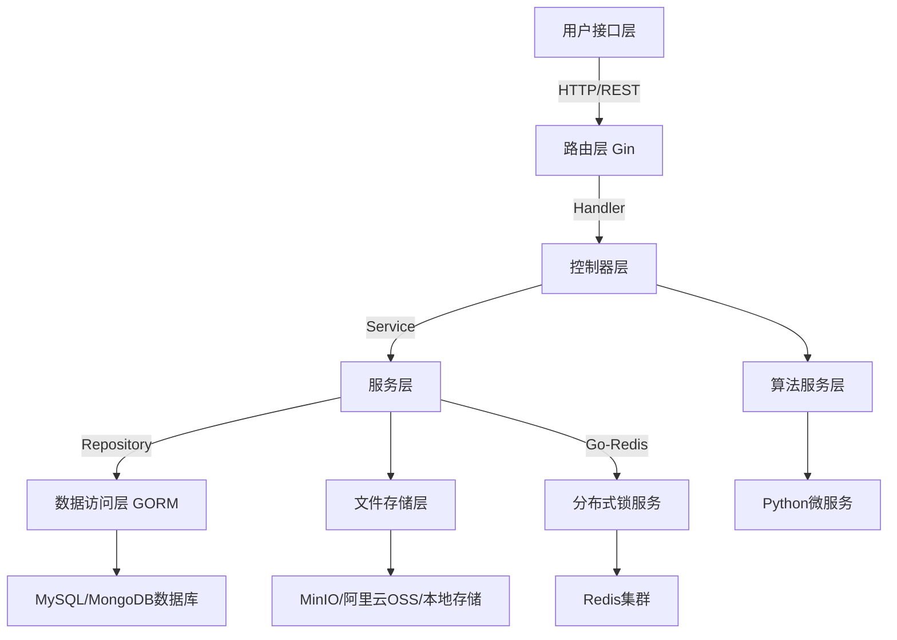

# 图像去雾系统 (Go 版本)

## 📢 项目简介

基于 Go 1.20、Gin、JWT、Redis、GORM、Swagger 构建的前后端分离图像去雾系统后端。包括用户管理、角色管理、菜单管理、部门管理、字典管理等多个功能。使用 Swagger 自动生成接口文档，支持在线调试，提高开发效率。

## 💻 技术栈

1. **后端框架：** Gin + GORM
2. **数据库：** MySQL（主数据库） + MongoDB（非结构化数据存储）
3. **缓存与存储：** Redis（分布式锁/缓存） + MinIO/阿里云OSS/本地存储（多存储方案）
4. **算法集成：** 通过Python服务（dehaze-python模块）进行图像处理，采用RESTful API
5. **安全机制：** JWT令牌 + RBAC权限模型 + Redis存储用户权限
6. **监控与日志：** Prometheus + Grafana 监控

## 🪄 项目架构



## 🛞 主要功能模块

| 模块类型 | 核心实现               | 关键技术点                          |
|------|--------------------|---------------------------------|
| 安全认证 | JWT中间件 + 权限中间件    | JWT令牌签发校验、RBAC权限控制             |
| 文件管理 | FileHandler/存储服务   | 适配多存储方案，支持本地/MinIO/OSS存储       |
| 系统管理 | SystemHandler/服务   | RBAC模型实现、部门树形结构管理              |
| 算法管理 | AlgorithmHandler   | 算法模型动态加载、Python服务集成            |
| 图像处理 | ImageUtil/文件服务     | 图像处理、元数据提取                     |

## 🚨 项目难点与解决方案

1. **并发控制：** 使用 Go 原生 goroutine 和 channel 处理并发，配合 Redis 分布式锁
2. **文件上传：** 实现分片上传，利用 Go 的并发特性优化上传性能
3. **服务间通信：** 使用标准化 RESTful API，实现超时控制和熔断
4. **权限控制：** 基于 RBAC 的多层次权限验证，使用中间件实现

## 💡 项目亮点

1. **高性能：** 充分利用 Go 的并发特性，提供更好的性能表现
2. **内存管理：** Go 的垃圾回收机制提供更稳定的内存管理
3. **优雅的API设计：** 使用 Gin 框架提供 RESTful API
4. **完整的错误处理：** 统一的错误处理机制
5. **中间件扩展：** 灵活的中间件机制支持功能扩展

## 🌺 相关工程

| 仓库                                                      | 说明       |
|---------------------------------------------------------|----------|
| [dehaze-front](https://github.com/your-repo/dehaze-front) | 前端项目     |
| [dehaze-python](https://github.com/your-repo/dehaze-python) | 算法服务     |

## 🌈 接口文档

- Swagger 接口文档：`http://localhost:8080/swagger/index.html`

## 🚀 项目启动

1. **环境要求**
   - Go 1.20+
   - MySQL 8.0+
   - Redis 6.0+

2. **数据库初始化**
   ```bash
   mysql -u root -p < ./sql/init.sql
   ```

3. **配置文件**
   修改 `config/config.yaml` 配置数据库连接等信息

4. **启动服务**
   ```bash
   go run main.go
   ```

## 📥 后续优化方案

1. **性能优化**
   - 实现连接池优化
   - 使用 gRPC 替代 HTTP 通信
   - 引入缓存中间件

2. **架构优化**
   - 服务模块化拆分
   - 引入服务发现
   - 完善监控系统

3. **安全性增强**
   - 实现请求签名机制
   - 添加操作审计
   - 加强数据加密
