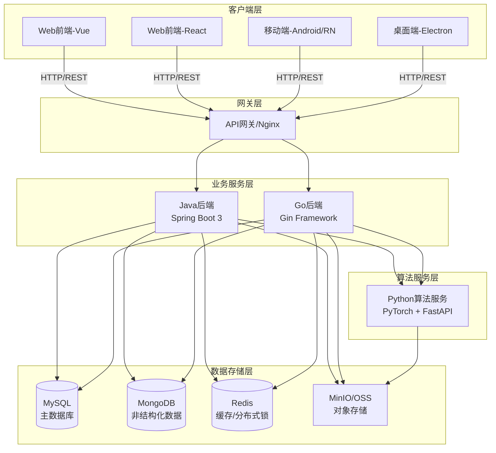

# Dehaze System - 基于深度学习的图像去雾系统

<p align="center">
  
</p>

<p align="center">
  <a href="https://gitee.com/earthy-zinc/dehaze-system">
    
  </a>
  <a href="https://gitee.com/earthy-zinc/dehaze-system/stargazers">
    
  </a>
  <a href="https://gitee.com/earthy-zinc/dehaze-system/network">
    
  </a>
</p>

---

## 📋 项目简介

**Dehaze System** 是一个基于深度学习的在线实时响应图像去雾系统,旨在改善受雾霾影响的图像质量。系统采用现代化全栈技术架构,提供完整的端到端图像去雾解决方案。

### 核心特性

- **🎯 智能去雾**: 集成30+种主流去雾算法(RIDCP、WPXNet、Dehamer等),基于深度学习实现高质量图像恢复
- **🌐 全栈开发**: 前后端分离架构,支持Vue/React双前端方案,Java/Go/Python多后端技术栈
- **📱 多端支持**: Web端、Android App、React Native、Taro小程序、Electron桌面应用
- **⚡ 实时处理**: WebSocket实时推送去雾进度,异步任务处理提高系统吞吐量
- **🔐 安全可靠**: Session+RBAC权限模型,Redis分布式锁,完善的安全防护机制
- **🚀 高性能**: GPU加速推理,Redis缓存优化,支持Docker容器化部署

---

## 🏗️ 系统架构

### 整体架构图


```mermaid
graph TB
    subgraph 客户端层
        A1[Web前端-Vue] 
        A2[Web前端-React]
        A3[移动端-Android/RN]
        A4[桌面端-Electron]
    end
    
    subgraph 网关层
        B[API网关/Nginx]
    end
    
    subgraph 业务服务层
        C1[Java后端<br/>Spring Boot 3]
        C2[Go后端<br/>Gin Framework]
    end
    
    subgraph 算法服务层
        D[Python算法服务<br/>PyTorch + FastAPI]
    end
    
    subgraph 数据存储层
        E1[(MySQL<br/>主数据库)]
        E2[(MongoDB<br/>非结构化数据)]
        E3[(Redis<br/>缓存/分布式锁)]
        E4[MinIO/OSS<br/>对象存储]
    end
    
    A1 & A2 & A3 & A4 -->|HTTP/REST| B
    B --> C1 & C2
    C1 & C2 --> D
    C1 & C2 --> E1 & E2 & E3 & E4
    D --> E4
```

### 技术架构分层

| 层级 | 技术栈 | 说明 |
|------|--------|------|
| **前端展示层** | Vue3/React + TypeScript + Vite | 响应式设计,支持PC/移动端 |
| **API网关层** | Nginx | 负载均衡,反向代理 |
| **业务服务层** | Spring Boot 3 / Gin | 用户管理,权限控制,业务逻辑 |
| **算法服务层** | PyTorch + FastAPI + Uvicorn | 深度学习模型推理,图像处理 |
| **数据持久层** | MySQL + MongoDB + Redis | 关系型/非关系型数据存储 |
| **对象存储层** | MinIO / 阿里云OSS | 图片文件存储 |

---

## 📦 技术栈详解

### 前端技术

#### Vue版本 (dehaze-front-vue)
- **核心框架**: Vue 3.5 + Vite 7 + TypeScript 5
- **UI组件库**: Element Plus 2.13
- **状态管理**: Pinia 3.0
- **路由管理**: Vue Router 4.6
- **工具库**: VueUse、Lodash-ES、ECharts 6.0
- **实时通信**: SockJS + StompJS (WebSocket)
- **代码规范**: ESLint + Prettier + Stylelint + Husky

**功能亮点**:
- 组件分层管理(基础组件/业务组件/布局组件)
- 瀑布流+懒加载优化大规模数据集展示
- Canvas实现放大镜功能
- CSS clip-path实现图像重叠对比
- 动态路由+静态路由分离

#### React版本 (dehaze-front-react)
- **核心框架**: React 19 + TypeScript + Vite 7
- **UI组件库**: Ant Design 5.x
- **状态管理**: Redux Toolkit
- **桌面端**: Electron 38
- **样式方案**: UnoCSS

### 后端技术

#### Java后端 (dehaze-java)
- **核心框架**: Spring Boot 3.3 + JDK 17
- **安全框架**: Spring Security 6 + Session（Redis 管理）
- **ORM框架**: MyBatis-Plus 3.5
- **数据库**: MySQL 8.0 + MongoDB
- **缓存**: Redis 6.0+ + Redisson分布式锁
- **对象存储**: MinIO 8.5 / 阿里云OSS
- **接口文档**: Knife4j 4.3 (OpenAPI 3)
- **监控**: Prometheus + Grafana + Actuator

**核心功能模块**:
- 用户管理: Session认证,RBAC权限模型
- 文件管理: 多存储方案适配,支持分片上传
- 系统管理: 部门树形结构,数据权限控制
- 算法管理: 动态加载模型,支持12+种算法

**技术亮点**:
- 布隆过滤器防缓存穿透
- @PreventDuplicateSubmit防重复提交
- CompletableFuture异步任务处理
- 策略模式实现多存储方案适配

#### Go后端 (dehaze-go)
- **核心框架**: Gin + GORM
- **版本要求**: Go 1.25+
- **数据库**: MySQL + MongoDB + Redis
- **安全机制**: Session + RBAC
- **接口文档**: Swagger

**优势特点**:
- 高性能并发处理(goroutine)
- 更优的内存管理(GC机制)
- 简洁的错误处理
- 灵活的中间件机制

#### Python算法服务 (dehaze-python)
- **深度学习**: PyTorch 2.9+
- **Web框架**: FastAPI + Uvicorn
- **容器化**: Docker (NVIDIA CUDA 12.1镜像)
- **依赖管理**: uv + pyproject.toml

**支持的去雾算法** (30+种):
- RIDCP: 基于高质量码本的双分支网络
- WPXNet: 金字塔空洞邻域注意力
- Dehamer: Transformer邻域注意力
- FFA-Net: 特征融合注意力网络
- AOD-Net: All-in-One去雾网络
- DCP: 暗通道先验算法
- ...更多算法持续集成中

**技术难点突破**:
- 模型动态加载与缓存机制
- GPU资源分配优化
- 跨平台兼容性处理(部分算法仅支持Linux)
- 模型输入输出格式统一

### 移动端技术

- **Android**: 原生Android开发
- **React Native**: 跨平台移动应用
- **Taro**: 多端统一开发框架(小程序/H5/RN)

---

## 🚀 快速开始

### 环境要求

| 软件 | 版本要求 | 说明 |
|------|----------|------|
| Node.js | 18.0+ | 前端开发环境 |
| Java JDK | 17+ | Java后端运行环境 |
| Python | 3.10+ | 算法服务环境 |
| Go | 1.25+ | Go后端运行环境 |
| MySQL | 8.4+ | 主数据库 |
| MongoDB | 4.4+ | 非结构化数据存储 |
| Redis | 6.0+ | 缓存与分布式锁 |
| Docker | 可选 | 容器化部署 |
| CUDA | 推荐 | GPU加速(算法服务) |

### 前端启动

#### dehaze-front-vue/dehaze-front-react
```bash
# 快速安装JS项目的所有依赖
pnpm install -r
```

```bash
# Vue版本
cd dehaze-front-vue
# React版本
cd dehaze-front-react
npm install pnpm -g
pnpm install
pnpm run dev
```
访问: http://localhost:5174 (Vue) / http://localhost:5173 (React)

#### dehaze-react-native

```bash
# 安装依赖
yarn

# 运行 Android
yarn android
# 或先启动 Metro，再运行原生构建:
yarn start
yarn react-native run-android

# 运行 iOS
yarn ios
# 或先启动 Metro，再运行原生构建:
yarn start
yarn react-native run-ios

# 测试与检查
yarn test
yarn lint
```

#### dehaze-taro/dehaze-uniapp

| 平台 | 开发模式 | 生产构建 |
|------|---------|---------|
| 微信小程序 | `pnpm dev:weapp` | `pnpm build:weapp` |
| H5 网页 | `pnpm dev:h5` | `pnpm build:h5` |
| 支付宝小程序 | `pnpm dev:alipay` | `pnpm build:alipay` |
| 百度小程序 | `pnpm dev:swan` | `pnpm build:swan` |
| 头条小程序 | `pnpm dev:tt` | `pnpm build:tt` |
| QQ 小程序 | `pnpm dev:qq` | `pnpm build:qq` |
| 京东小程序 | `pnpm dev:jd` | `pnpm build:jd` |
| 快应用 | `pnpm dev:quickapp` | `pnpm build:quickapp` |

#### dehaze_flutter

##### 技术栈

- Flutter 3.35+ / Dart 3.9+
- Riverpod（状态管理）
- GoRouter（路由管理，含路由守卫）
- Dio（网络请求，拦截器链：Auth → Response → Retry → Error）
- SharedPreferences（Token 持久化）
- json_serializable + build_runner（序列化）

```bash
# 安装依赖
flutter pub get

# 生成序列化代码
dart run build_runner build --delete-conflicting-outputs

# 运行（需后端 Java 服务运行在 127.0.0.1:8989）
flutter run -d chrome --web-port 5177    # Web（固定端口 5177）
flutter run -d windows                    # Windows
flutter run -d android                    # Android
```

#### dehaze-android

```bash
./gradlew build              # 构建
./gradlew installDebug       # 安装到设备
./gradlew testDebugUnitTest  # 运行单元测试
./gradlew jacocoTestReport   # 生成测试覆盖率报告
```

应用默认连接本地开发服务器，地址配置在 DehazeApplication.java 中：

```java
DehazeSDK.Builder()
    .setBaseUrl("http://10.0.2.2:8989") // Android模拟器访问本机需要使用10.0.2.2
    .setDebug(true)
```

如果需要更改服务器地址，请修改此处配置。

### 基础设施部署（Docker）

MySQL、Redis、MongoDB、MinIO、RabbitMQ、Elasticsearch 及监控组件（Prometheus/Grafana/ELK 等）统一通过根目录 `docker-compose.yml` 编排。

#### 1. 配置环境变量

```bash
cp .env.example .env
```

#### 2. 启动基础设施

```bash
# 启动核心依赖（数据库/缓存/存储/MQ）
docker compose up -d mysql redis mongodb minio rabbitmq

# 启动 ELK 日志栈 + SkyWalking 链路追踪
docker compose up -d elasticsearch kibana logstash filebeat sky-oap sky-ui
```

#### 3. 安全初始化（重要）

Elasticsearch 启用 `xpack.security` 后，`kibana_system` / `logstash_system` / `beats_system` 等系统用户需手动设置密码；Alertmanager Basic Auth 凭证需预生成。统一执行：

```bash
# 前置：elasticsearch 容器已启动
bash scripts/init-security.sh
```

脚本完成：
- 用 `elastic` 超级用户设置 `kibana_system` / `logstash_system` / `beats_system` 密码（= `${DEHAZE_PASSWORD}`）
- 生成 `config/alertmanager/web.yml`（bcrypt，账号 `admin` / 密码 `${DEHAZE_PASSWORD}`）

手动设置

```bash
# 1. 设置 ES 系统用户密码（用 elastic 超级用户）
curl -u elastic:${DEHAZE_PASSWORD} -X POST http://localhost:9200/_security/user/kibana_system/_password \
  -H 'Content-Type: application/json' -d '{"password":"'"${DEHAZE_PASSWORD}"'"}'
curl -u elastic:${DEHAZE_PASSWORD} -X POST http://localhost:9200/_security/user/logstash_system/_password \
  -H 'Content-Type: application/json' -d '{"password":"'"${DEHAZE_PASSWORD}"'"}'
curl -u elastic:${DEHAZE_PASSWORD} -X POST http://localhost:9200/_security/user/beats_system/_password \
  -H 'Content-Type: application/json' -d '{"password":"'"${DEHAZE_PASSWORD}"'"}'

# 2. 生成 Alertmanager Basic Auth 凭证（bcrypt，账号 admin）
docker run --rm httpd:alpine htpasswd -nbB admin "${DEHAZE_PASSWORD}" \
  | sed 's/^admin://' \
  | xargs -I{} printf 'basic_auth_users:\n  admin: "%s"\n' {} > config/alertmanager/web.yml
```

#### 4. 启动监控组件

```bash
docker compose up -d prometheus grafana alertmanager \
  node-exporter mysqld-exporter redis-exporter mongodb-exporter

# GPU 指标采集（需 NVIDIA GPU + nvidia-container-toolkit）
docker compose --profile gpu up -d dcgm-exporter
```

> 修改 `DEHAZE_PASSWORD` 后需重新执行 `bash scripts/init-security.sh` 并重启相关服务，详见脚本输出提示。

### 后端启动

三端后端统一通过 `scripts/run.py` 管理生命周期（启动/停止/重启/查看状态/查看日志），无需手动在各子项目目录下执行启动命令：

```bash
# 启动单个服务
python scripts/run.py run go      # Go:8990
python scripts/run.py run python  # Python:8991
python scripts/run.py run java    # Java:8989

# 启动全部后端
python scripts/run.py run all

# 停止 / 重启
python scripts/run.py stop go
python scripts/run.py restart go,python,java

# 查看运行状态
python scripts/run.py ps

# 查看日志（console.log 最近 N 行，默认 50）
python scripts/run.py logs go
```

日志统一存放在各服务 `logs/{yyyy-MM-dd}/` 目录下（详见 [部署架构 - 日志规范](dehaze-doc/docs/02-系统架构/06-部署架构.md#74-日志规范)）：

| 文件 | 说明 |
|------|------|
| `console.log` | `run.py` 重定向的启动/控制台输出（追加模式） |
| `info.log` | 应用 INFO 及以上日志（JSON 结构化，供 ELK/Loki 采集） |
| `error.log` | 应用 ERROR 日志（JSON 结构化，是 info 的子集） |

#### Java后端
```powershell
# 1. 执行数据库初始化脚本（先建表后插数据，均按文件名顺序执行）
Get-ChildItem config/sql/schema/*.sql | Sort-Object Name | ForEach-Object { Get-Content $_.FullName | mysql -u root -p dehaze }
Get-ChildItem config/sql/data/*.sql | Sort-Object Name | ForEach-Object { Get-Content $_.FullName | mysql -u root -p dehaze }

# 2. 修改配置文件
# 编辑 src/main/resources/application-dev.yml
# 配置MySQL、Redis、MinIO等连接信息

# 3. 启动服务
cd dehaze-java
mvn clean compile

mvn spring-boot:run

# 4. 打包
mvn package
```
访问接口文档: http://localhost:8989/doc.html

#### Go后端
```bash
cd dehaze-go
# 修改配置文件
vim config/config.yaml

# 启动服务
go mod download
go run cmd/main.go

# 测试
go test ./...

# 打包
go build ./cmd/main.go
```

#### Python算法服务
```bash
cd dehaze-python
# 创建虚拟环境并安装依赖
uv venv .venv --python 3.11
source .venv/bin/activate  # Linux/Mac
# Windows: .venv\Scripts\activate
uv sync

# 启动服务(开发环境，热重载)
python -m app.main

# 生产环境部署
APP_ENV=production python -m app.main
```

### 监控与日志（可选）

监控组件的启动方式见上方 [基础设施部署](#基础设施部署docker)。

访问地址：

- **Grafana**：http://localhost:13001（admin/`<DEHAZE_PASSWORD>`），`Dehaze` 文件夹下自动加载总览/基础设施/业务监控面板
- **Prometheus**：http://localhost:9091（Targets 状态、告警规则评估）
- **AlertManager**：http://localhost:9093（需 Basic Auth `admin`/`<DEHAZE_PASSWORD>`），邮件通知需先将 `config/alertmanager/alertmanager.yml` 中 SMTP 占位配置替换为真实值
- **Kibana**：http://localhost:5601，创建 `dehaze-logs-*` 索引模式后检索三端结构化日志
- **SkyWalking UI**：http://localhost:18080，三端调用链路追踪
- 指标命名规范与告警阈值详见 [部署架构 - 监控与告警](dehaze-doc/docs/02-系统架构/06-部署架构.md#7-监控与告警)

### 算法训练

#### 1. 安装依赖

```bash
cd dehaze-algorithm
pip install -e .
```

> `setup.py` 会读取 `requirements.txt` 安装全部依赖。如需编译 CUDA 算子（如 DCN），请设置环境变量 `BASICSR_EXT=True`。

#### 2. 推理

使用 `inference_ridcp.py` 进行单图或批量推理：

```bash
python inference_ridcp.py \
    -i inputs \
    -w path/to/model_weight.pth \
    -o results \
    --use_weight \
    --alpha 1.0
```

参数说明：

- `-i / --input`：输入图片或文件夹，默认 `inputs`
- `-w / --weight`：模型权重路径
- `-o / --output`：输出文件夹，默认 `results`
- `--use_weight`：启用权重融合
- `--alpha`：权重融合系数，默认 `1.0`
- `--max_size`：单张图片最大尺寸，超过则启用分块推理，默认 `10000`

#### 3. 训练

通过 `basicsr/train.py` 启动训练，配置文件位于 `options/` 目录：

```bash
python basicsr/train.py -opt options/common/NH-HAZE-20.yml
```

#### 4. 测试

通过 `basicsr/test.py` 跑测试集评估：

```bash
python basicsr/test.py -opt options/common/NH-HAZE-20.yml
```

### 论文编译

#### 1. 安装 TeX Live

##### Windows

1. 下载 [install-tl-windows.exe](https://www.tug.org/texlive/acquire-netinstall.html)，以管理员身份运行
2. 将 `C:\texlive\2025\bin\win32` 添加到系统 PATH

##### Linux

```bash
sudo perl install-tl
export PATH=/usr/local/texlive/2025/bin/x86_64-linux:$PATH
```

##### macOS

```bash
brew install --cask mactex
```

#### 2. 验证安装

```bash
tex --version
```

#### 3. 编译论文

依次执行以下命令：

```bash
cd dehaze-paper
pdflatex "CMFR-Net.tex"
bibtex "CMFR-Net"
pdflatex "CMFR-Net.tex"
pdflatex "CMFR-Net.tex"
```

编译完成后会在当前目录下生成 `CMFR-Net.pdf`。

#### 4. 缺包处理

如编译过程提示缺少宏包，使用 `tlmgr` 安装：

```bash
tlmgr install <package_name>
```

---

## 🔌 端口规范

本项目对所有服务的端口号进行了统一规范化，按服务类别分段分配，避免冲突。

### 应用服务端口

| 类别 | 项目 | 端口 | 说明 |
|------|------|------|------|
| **后端** | dehaze-java | 8989 | Spring Boot 主服务 |
| **后端** | dehaze-go | 8990 | Go Gin 服务 |
| **后端** | dehaze-python | 8991 | FastAPI 算法服务 |
| **前端** | dehaze-front-react | 5173 | Vite dev server |
| **前端** | dehaze-front-vue | 5174 | Vite dev server |
| **前端** | dehaze-taro (H5) | 5175 | Taro H5 dev server |
| **前端** | dehaze-uniapp (H5) | 5176 | uni-app H5 dev server |
| **前端** | dehaze-flutter (Web) | 5177 | Flutter Web dev server |
| **前端** | dehaze-front-react (Electron) | 5183 | Electron renderer |
| **前端** | dehaze-front-vue (Electron) | 5184 | Electron renderer |
| **前端** | dehaze-react-native (Metro) | 8081 | React Native bundler |

### 基础服务端口（docker-compose.yml）

| 类别 | 服务 | 宿主端口 | 说明 |
|------|------|----------|------|
| **数据库** | MySQL | 3306 | 主数据库 |
| **数据库** | MongoDB | 27017 | 非结构化数据 |
| **数据库** | TDengine | 6030/6041/6043-6049/6060 | 时序数据库 |
| **缓存** | Redis | 6379 | 缓存与分布式锁 |
| **消息队列** | RabbitMQ | 5672 / 15672 | AMQP / 管理界面 |
| **消息队列** | Kafka | 9092 / 19092 | Kafka / Manager |
| **消息队列** | RocketMQ | 9876 / 10909-10912 / 19876 | Namesrv / Broker / Console |
| **协调** | Zookeeper | 2181 | Kafka 协调 |
| **注册中心** | Nacos | 8848 / 9848 / 10848 | HTTP / gRPC / 控制台 |
| **对象存储** | MinIO API | 9110 | S3 兼容 API |
| **对象存储** | MinIO Console | 9190 | 管理界面 |
| **对象存储** | nginx-dataset | 9000 | 数据集静态文件 |
| **搜索** | Elasticsearch | 9200 / 9300 | HTTP / 传输 |
| **搜索** | Kibana | 5601 | ES 可视化 |
| **搜索** | Logstash | 4560 / 5044 | 日志管道 / Filebeat 输入 |
| **监控** | Prometheus | 9091 | 指标采集与告警评估 |
| **监控** | Grafana | 3001 | 可视化面板 |
| **监控** | AlertManager | 9093 | 告警通知 |
| **监控** | node/mysqld/redis/mongodb exporter | 9100 / 9104 / 9121 / 9216 | 基础设施指标 |
| **监控** | RabbitMQ 指标 | 15692 | 内置 prometheus 插件 |
| **监控** | dcgm-exporter | 9400 | GPU 指标（gpu profile 按需启动） |
| **监控** | SkyWalking | 11800 / 12800 / 18080 | gRPC / HTTP / UI |
| **任务调度** | XXL-Job Admin | 14980 | 定时任务控制台 |

### 端口分配规则

- **后端段 8989-8999**：业务服务端口集中分配，便于记忆和管理
- **前端段 5173-5186**：前端开发服务器统一使用 Vite 默认段，避免与 Grafana(3001) 等冲突（5173 React / 5174 Vue / 5175 Taro / 5176 uniapp / 5177 Flutter Web / 5183 React Electron / 5184 Vue Electron / 8081 RN Metro）
- **基础设施段**：保持各组件官方默认端口，仅对冲突端口调整
- **CORS 白名单**：三端后端（Java/Go/Python）的 CORS 配置需同步包含所有前端端口

---

## 📁 项目结构

```
dehaze-system/
├── dehaze-algorithm/          # 核心去雾算法实现
│   ├── basicsr/              # BasicSR框架
│   ├── options/              # 训练配置
│   └── inference_ridcp.py    # RIDCP算法推理脚本
│
├── dehaze-front-vue/          # Vue3前端实现
│   ├── src/
│   │   ├── views/            # 页面组件
│   │   ├── components/       # 复用组件
│   │   ├── api/              # API接口管理
│   │   ├── store/            # Pinia状态管理
│   │   └── router/           # 路由配置
│   └── package.json          # Vue 3.4 + Vite 5
│
├── dehaze-front-react/        # React前端实现
│   ├── src/
│   │   ├── pages/            # 页面组件
│   │   ├── components/       # 组件库
│   │   └── store/            # Redux状态
│   └── desktop/              # Electron桌面端
│
├── dehaze-java/               # Java后端
│   ├── src/main/java/com/pei/dehaze/
│   │   ├── controller/       # 控制器层
│   │   ├── service/          # 服务层
│   │   ├── mapper/           # 数据访问层
│   │   ├── model/            # 实体类
│   │   └── config/           # 配置类
│   ├── pom.xml               # Spring Boot 3.3
│
├── dehaze-go/                 # Go后端
│   ├── cmd/                  # 应用入口
│   ├── internal/             # 内部业务逻辑（app/model/router/service/middleware）
│   ├── pkg/                  # 可复用公共包（database/redis/response等）
│   └── config/               # 配置
│
├── dehaze-python/             # Python后端
│   ├── algorithm/            # 30+种去雾算法
│   │   ├── RIDCP/
│   │   ├── WPXNet/
│   │   ├── Dehamer/
│   │   └── ...
│   ├── app/                  # FastAPI应用
│   ├── pyproject.toml        # 项目配置与依赖
│   └── start.sh              # 一键启动脚本
│
├── dehaze-android/            # Android客户端
├── dehaze-react-native/       # RN跨平台应用
├── dehaze-taro/               # Taro小程序
│
├── dehaze-paper/              # 学术论文
│   ├── CMFD-Net.tex          # 论文LaTeX源码
│   └── references.bib         # 参考文献
│
└── dehaze-doc/                # 项目文档
    └── docs/                 # VuePress文档站点
```

---

## 📚 文档与资源

- **详细文档**: 位于 `dehaze-doc/` 目录（需求分析、系统设计、用户手册）
- **API 文档**: Java 后端启动后访问 `http://localhost:8989/doc.html`（Knife4j）
- **学术论文**: 位于 `dehaze-paper/` 目录，包含 LaTeX 源码
