# Dehaze System 图像去雾系统

<p align="center">
  
</p>

<p align="center">
  <a href="https://gitee.com/earthy-zinc/dehaze-system">
    
  </a>
  <a href="https://gitee.com/earthy-zinc/dehaze-system/stargazers">
    
  </a>
  <a href="https://gitee.com/earthy-zinc/dehaze-system/network">
    
  </a>
</p>

## 📋 项目简介

基于深度学习的在线实时响应图像去雾系统，主要功能是改善受到雾霾影响的图像质量，从而实现图像去雾的目标。系统采用现代化技术栈构建，包括多个平台的客户端实现和多种后端技术方案，提供完整的图像去雾解决方案。

系统支持多种去雾算法，包括RIDCP、WPXNet、Dehamer等20+种去雾模型，通过深度学习技术实现高质量的图像去雾效果。同时提供完善的用户管理、权限控制、数据集管理、算法评估等功能。

## 🌟 系统特色

### 多平台支持
- **Web前端**: Vue3 + Vite + TypeScript + Element-Plus 和 React + TypeScript + Vite 两套前端实现
- **移动端**: Android App、React Native、Taro小程序
- **桌面端**: Electron桌面应用
- **后端**: Java (Spring Boot 3)、Go (Gin)、Python (PyTorch/Flask) 多种技术栈实现

### 核心功能
- 用户注册/登录/权限管理（RBAC模型）
- 数据集管理（瀑布流展示、懒加载、图片MD5校验）
- 图像处理功能（实时摄像头捕获、图像叠加对比、放大镜效果）
- 算法集成（支持多种去雾算法、参数配置、结果可视化）
- 系统配置（主题色切换、暗黑模式、布局模式）

### 技术亮点
- 前后端分离架构
- 响应式布局，支持PC端和移动端
- WebSocket实时去雾进度推送
- 组件化设计，高代码复用性
- 完善的错误处理和日志系统
- Docker容器化部署支持
- CI/CD持续集成部署流程

## 🏗️ 系统架构

```mermaid
graph TD
    A[用户接口层] -->|HTTP/REST| B[Web/API网关]
    B --> C[后端服务层]
    C --> D[Java后端/SpringBoot]
    C --> E[Go后端/Gin]
    C --> F[Python后端/PyTorch]
    D --> G[(MySQL/MongoDB)]
    E --> G
    F --> H[(MinIO/阿里云OSS)]
    C --> I[算法微服务]
    I --> F
    D --> J[(Redis缓存)]
    E --> J
```



## 📦 技术栈

### 前端技术
- **Vue版本**: Vue3 + Vite4 + TypeScript5 + Element-Plus + Pinia
- **React版本**: React + TypeScript + Vite + Ant Design + Redux Toolkit
- **移动端**: Android、React Native、Taro小程序
- **桌面端**: Electron
- **构建工具**: Vite5 + Unocss + ESLint + Prettier

### 后端技术
- **Java后端**: Spring Boot 3 + Spring Security 6 + JWT + Mybatis-Plus
- **Go后端**: Gin + GORM + JWT + Redis
- **Python后端**: PyTorch + Flask + Gunicorn
- **数据库**: MySQL + MongoDB
- **缓存**: Redis
- **存储**: MinIO + 阿里云OSS + 本地存储

### 算法模型
- 支持20+种去雾算法模型
- RIDCP、WPXNet、Dehamer等主流去雾模型
- 基于Transformer的邻域注意力机制
- 金字塔空洞邻域注意力编码器

## 🚀 快速开始

### 环境准备
- Node.js 16+
- Java 17
- Python 3.8
- Go 1.20+
- MySQL 8.0+
- Redis 6.0+
- Docker (可选，用于容器化部署)

### 启动项目

#### 前端启动 (Vue版本)
```bash
cd dehaze-front-vue
npm install pnpm -g
pnpm install
pnpm run dev
```

#### 前端启动 (React版本)
```bash
cd dehaze-front-react
npm install pnpm -g
pnpm install
pnpm run dev
```

#### Java后端启动
```bash
cd dehaze-java
# 修改配置文件 src/main/resources/application-dev.yml
# 执行数据库初始化脚本 sql/init.sql
mvn spring-boot:run
```

#### Go后端启动
```bash
cd dehaze-go
# 修改配置文件 config/config.yaml
go run main.go
```

#### Python算法服务启动
```bash
cd dehaze-python
# 创建虚拟环境
conda env create -n dehaze_backend python=3.10
conda activate dehaze_backend
# 安装依赖
conda install --yes --file requirements.txt
# 启动服务
python start.py
```

## 📁 项目结构

```
dehaze-system/
├── dehaze-android/          # Android客户端
├── dehaze-doc/              # 项目文档
├── dehaze-front-react/      # React前端实现
├── dehaze-front-vue/        # Vue前端实现
├── dehaze-go/               # Go后端实现
├── dehaze-java/             # Java后端实现
├── dehaze-java-cloud/       # Java微服务架构版本
├── dehaze-java-cloud-plus/  # Java微服务增强版
├── dehaze-python/           # Python算法服务
├── dehaze-react-native/     # React Native移动应用
├── dehaze-taro/             # Taro小程序
└── README.md
```

## 🛠️ 部署方案

### Docker部署
系统支持Docker容器化部署，每个模块都有对应的Dockerfile：

```bash
# 构建前端镜像
cd dehaze-front-vue
docker build -t dehaze-front .

# 构建Java后端镜像
cd dehaze-java
docker build -t dehaze-backend .

# 构建Python算法服务镜像
cd dehaze-python
docker build -t dehaze-python .
```

### Nginx配置
```nginx
server {
    listen     80;
    server_name  localhost;
    location / {
        root /usr/share/nginx/html;
        index index.html index.htm;
    }
}
```

### 持续集成/持续部署(CI/CD)
- 使用Jenkins进行持续集成和持续部署
- 支持DevOps流水线
- 通过制品仓库管理软件版本

## 📊 系统功能模块

| 模块 | 功能描述 |
|------|----------|
| 用户管理 | 用户注册、登录、权限分配、角色管理 |
| 数据集管理 | 图片上传、瀑布流展示、MD5校验、数量统计 |
| 图像处理 | 实时摄像头捕获、图像对比、放大镜效果 |
| 算法管理 | 多种去雾算法、参数配置、效果评估 |
| 系统配置 | 主题切换、暗黑模式、布局调整 |

## 📈 性能优化

1. **前端优化**
   - 组件分层管理，提高可维护性
   - 图片懒加载，优化大规模数据集浏览
   - 响应式布局，适配多种设备

2. **后端优化**
   - Redis缓存穿透防护（布隆过滤器）
   - 分布式锁解决并发问题
   - 异步任务处理提高系统吞吐量

3. **算法优化**
   - GPU加速支持
   - 模型缓存机制
   - gRPC通信优化

## 📚 文档资料

详细的项目文档请查看 [dehaze-doc](dehaze-doc/) 目录：
- [系统需求分析](dehaze-doc/docs/项目文档/图像去雾系统/系统需求分析.md)
- [系统设计](dehaze-doc/docs/项目文档/图像去雾系统/系统设计.md)
- [数据库设计](dehaze-doc/docs/项目文档/图像去雾系统/数据库设计.md)
- [API接口设计](dehaze-doc/docs/项目文档/图像去雾系统/API接口设计.md)
- [系统部署](dehaze-doc/docs/项目文档/图像去雾系统/系统部署.md)
- [用户手册](dehaze-doc/docs/项目文档/图像去雾系统/用户手册.md)

## 🤝 贡献指南

欢迎提交Issue和Pull Request来帮助改进项目。

1. Fork项目
2. 创建功能分支 (`git checkout -b feature/AmazingFeature`)
3. 提交更改 (`git commit -m 'Add some AmazingFeature'`)
4. 推送到分支 (`git push origin feature/AmazingFeature`)
5. 开启Pull Request

## 📄 许可证

本项目采用Apache License 2.0许可证，详情请查看 [LICENSE](LICENSE) 文件。

## 👥 作者

土味锌 - [earthy-zinc](https://gitee.com/earthy-zinc)

## 🙏 致谢

- 所有使用的开源项目和库
- 图像去雾领域的研究者和贡献者
- 项目开发和维护的参与者