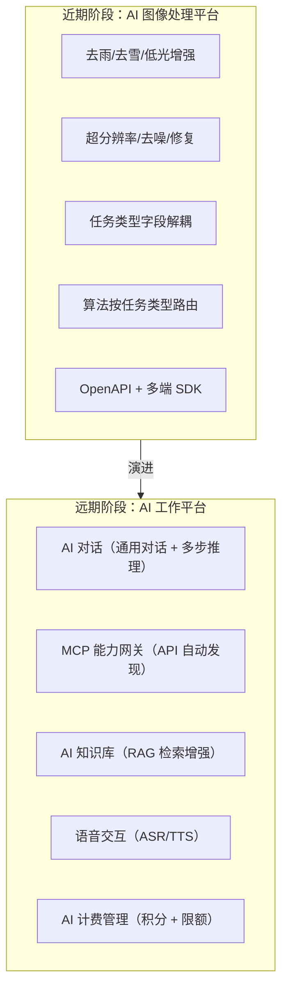
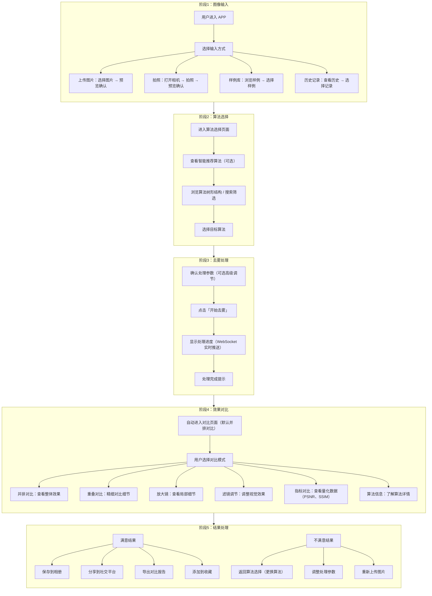
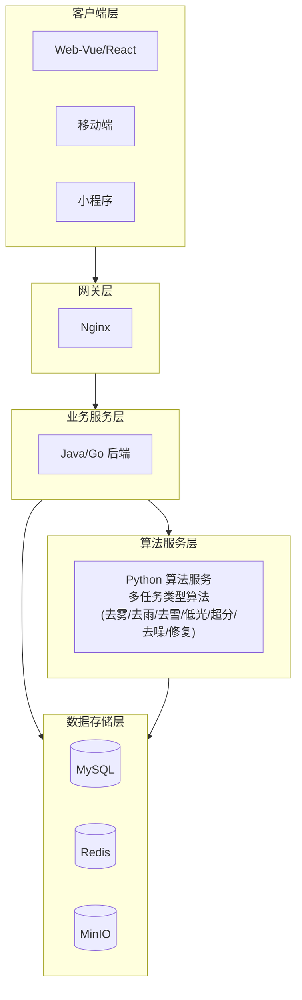

# AI 图像处理平台 - 产品概述

## 1. 项目概述

### 1.1 项目名称

AI 图像处理平台

### 1.2 项目背景

在现代社会中，摄像头已经无处不在，无论是高速公路上的交通监控摄像头，还是人们手中的智能手机，都为我们提供了丰富的图像信息。然而，图像在采集过程中常受恶劣天气（雾霾、雨雪）、光照不足、分辨率限制、噪声等因素影响，导致图像质量下降。

本系统起源于图像去雾，已发展为覆盖多种图像退化问题的 **AI 图像处理平台**。利用深度学习技术，通过训练神经网络模型对图像进行增强与恢复处理，支持去雾、去雨、去雪、低光增强、超分辨率、去噪、图像修复等多种任务类型。平台不仅解决单一场景的图像质量问题，更向通用 AI 工作平台演进，融入大语言模型对话与多模态交互能力。

### 1.3 战略目标：从做深去雾到 AI 图像处理平台

系统当前战略目标是从单一去雾工具演进为 **AI 图像处理平台**，远期进一步演进为 **AI 工作平台**：

- **近期：AI 图像处理平台**——横向扩展同类退化（去雨、去雪、低光增强）与通用图像处理（超分辨率、去噪、图像修复），任务系统与具体算法解耦，OpenAPI 对外开放并自动生成多端 SDK
- **远期：AI 工作平台**——在专业图像处理能力基础上融入通用大语言模型与多模态交互，构建"专业长板 + 通用底座"的融合定位，使平台具备向通用 AI 助手演进的潜力

### 1.4 项目目标

- 构建覆盖多种图像退化问题的端到端图像处理解决方案（去雾、去雨、去雪、低光增强、超分辨率、去噪、图像修复）
- 集成多任务类型的主流算法，按任务类型路由分发，满足不同场景需求
- 提供 Web 端、移动端、桌面端等多平台支持
- 实现高性能图像处理，支持实时处理和批量处理
- 通过 OpenAPI 对外开放能力，自动生成多端 SDK
- 建立完善的安全机制和权限管理体系
- 落地 VIP 会员体系，支撑商业化运营

***

## 2. 产品定位

### 2.1 产品愿景

以去雾为核心能力起点，逐步扩展为覆盖多种图像退化问题的图像增强系统，最终演进为 AI 图像处理平台。当前阶段聚焦"做深去雾"，将去雾体验打磨到生产级别。

### 2.2 核心价值主张

| 价值点       | 描述                              |
| --------- | ------------------------------- |
| **一站式处理** | 图像采集→算法选择→去雾处理→效果对比→数据分析全流程无缝衔接 |
| **智能化体验** | 树形算法结构、样例快速预览、智能推荐最优算法          |
| **专业级对比** | 多维度对比工具（并排、重叠、放大镜、滤镜、指标）        |
| **透明化评估** | 完整的算法信息和量化评估指标（PSNR、SSIM）       |
| **多平台覆盖** | 一套系统支持 Web、Android、iOS、桌面端等多终端  |
| **商业化闭环** | VIP 会员体系、套餐购买、订单管理支撑持续运营        |

### 2.3 差异化优势

- 移动端首个完整的去雾处理与对比分析系统
- 树形算法结构，支持多种算法快速切换
- 专业级对比工具，满足研究和实际应用需求
- 流畅的用户体验，降低使用门槛
- 支持 GPU 加速（自动回退 CPU）

### 2.4 发展路线图

系统已完成「做深去雾」阶段（处理历史、进度反馈、用户评分、VIP 体系均已落地），后续按近期、远期两阶段推进：

**近期：AI 图像处理平台**

横向扩展同类退化（去雨、去雪、低光增强）与通用图像处理（超分辨率、去噪、图像修复）。后端任务表新增任务类型字段，使任务系统与具体算法解耦；Python 算法服务改造为按任务类型分发的路由机制；前端「去雾处理」页面抽象为通用「图像处理」页面。OpenAPI 对外开放并自动生成多端 SDK，平台形成规模效应。产品名调整为「AI 图像处理平台」。

**远期：AI 工作平台**

在专业图像处理能力基础上融入通用大语言模型与多模态交互，构建"专业长板 + 通用底座"的融合定位。核心交付包括：

- **AI 对话模块**（统一对话入口）：通用大模型对话、多步推理、上下文分层管理、智能算法推荐、批量处理摘要
- **MCP 能力网关**：自动发现系统所有 API 并转换为 MCP tool 暴露给 LLM，认证复用 API Key
- **AI 知识库**：知识内容管理、向量索引构建、RAG 检索注入，为 LLM 提供专业知识
- **语音交互**：语音识别（ASR）、语音合成（TTS），系统级语音输入输出能力
- **AI 计费管理**：积分计量（按模型换算）、日限额 + 月限额、配额扣减

***

## 3. 目标用户分析

### 3.1 用户角色定义

#### 3.1.1 普通用户（手机拍照用户）

| 属性       | 描述                       |
| -------- | ------------------------ |
| **核心需求** | 实时去雾、提高照片清晰度、简单易用        |
| **使用场景** | 日常生活随手拍照、旅游景点拍摄          |
| **权限范围** | 仅能操作与个人相关的功能模块           |
| **期望特征** | 系统应能自动识别图片中的雾霾，并自动进行去雾处理 |

#### 3.1.2 专业摄影师

| 属性       | 描述                  |
| -------- | ------------------- |
| **核心需求** | 高质量去雾、细节和色彩保持、可调节参数 |
| **使用场景** | 专业摄影后期处理、影视后期制作     |
| **权限范围** | 高级处理功能、参数调节、批量处理    |
| **期望特征** | 灵活的调整选项、无损处理能力      |

#### 3.1.3 图像处理研究人员/算法工程师

| 属性       | 描述                  |
| -------- | ------------------- |
| **核心需求** | 算法效果验证、多算法对比、量化评估指标 |
| **使用场景** | 算法测试与对比、学术研究、数据集管理  |
| **权限范围** | 算法管理模块、数据集管理、评估分析   |
| **期望特征** | 完整的评估数据、算法参数可配置     |

#### 3.1.4 系统管理员

| 属性       | 描述                        |
| -------- | ------------------------- |
| **核心职责** | 系统整体管理，包括用户管理、角色权限分配、系统配置 |
| **权限范围** | 拥有系统所有功能的操作权限             |
| **特征要求** | 具备专业的系统管理知识，熟悉系统各项功能      |

### 3.2 应用场景分析

| 场景             | 需求特点            |
| -------------- | --------------- |
| **日常生活随手拍照**   | 快速去雾、简单操作、即时预览  |
| **地面道路状况实时分析** | 实时去雾、稳定可靠、高准确性  |
| **室内室外监控**     | 全天候运行、各种光照条件适配  |
| **遥感图像分析**     | 大规模图像处理、批量处理能力  |
| **影视后期**       | 高质量输出、无损处理、细节保留 |

***

## 4. 核心业务需求

### 4.1 图像处理核心需求

| 需求项     | 详细描述                                  |
| ------- | ------------------------------------- |
| 多任务类型   | 支持去雾、去雨、去雪、低光增强、超分辨率、去噪、图像修复等多种图像处理任务 |
| 单张/批量处理 | 支持单张图像和批量图像的处理                        |
| 多算法支持   | 每种任务类型集成多种主流算法，按任务类型路由分发              |
| 实时进度    | 支持实时处理进度查看和结果预览                       |
| 质量评估    | 提供图像质量评估指标（PSNR、SSIM 等）               |
| 效果对比    | 6 种对比模式：并排、重叠、放大镜、滤镜、指标、算法信息          |
| OpenAPI | 对外开放 API，自动生成多端 SDK                   |

### 4.2 数据管理需求

| 需求项   | 详细描述                |
| ----- | ------------------- |
| 数据集管理 | 支持数据集的创建、编辑、删除和查询   |
| 文件管理  | 支持图像文件的上传、下载和管理     |
| 导入导出  | 提供数据集导入导出功能         |
| 去重处理  | 支持图像文件的去重处理（MD5 校验） |

### 4.3 用户管理需求

| 需求项   | 详细描述                  |
| ----- | --------------------- |
| 用户认证  | 支持用户注册、登录、信息维护        |
| 权限控制  | 实现基于角色的访问控制（RBAC）     |
| 组织架构  | 提供部门组织架构管理            |
| 细粒度权限 | 支持用户权限的细粒度控制（精细到按钮级别） |

### 4.4 系统管理需求

| 需求项  | 详细描述        |
| ---- | ----------- |
| 配置管理 | 提供系统配置管理功能  |
| 菜单权限 | 支持菜单权限管理    |
| 日志审计 | 实现操作日志记录和审计 |
| 监控分析 | 提供系统监控和性能分析 |

***

## 5. 功能模块概览

### 5.1 前端核心功能模块（用户直接交互）

| 模块名称        | 核心功能                        | 目标用户 |
| ----------- | --------------------------- | ---- |
| **首页展示**    | 产品介绍、功能展示、使用教程、数据统计         | 所有用户 |
| **图像输入模块**  | 图片上传、拍照、样例库、历史记录            | 所有用户 |
| **算法选择模块**  | 树形算法结构、搜索筛选、智能推荐、算法详情       | 所有用户 |
| **图像处理模块**  | 处理控制、批量处理、参数调节、结果管理         | 所有用户 |
| **效果对比模块**  | 6 种对比模式、滤镜调节、指标分析、算法信息      | 所有用户 |
| **个人中心**    | 处理历史、个人设置、VIP 权益、套餐购买、反馈评价  | 所有用户 |
| **AI 对话模块** | 通用对话、多步推理、上下文管理、智能算法推荐、批量摘要 | 所有用户 |

### 5.2 后台管理功能模块（系统管理）

| 模块名称         | 核心功能                              | 目标用户     |
| ------------ | --------------------------------- | -------- |
| **算法管理模块**   | 算法生命周期管理、版本控制、性能监控、模型配置           | 管理员/研究人员 |
| **数据集管理模块**  | 数据集管理、图片浏览、类型筛选、搜索、瀑布流展示          | 管理员/研究人员 |
| **用户管理模块**   | 用户信息管理、密码重置、用户状态管理                | 管理员      |
| **角色管理模块**   | 角色权限管理、权限分配                       | 管理员      |
| **菜单管理模块**   | 菜单配置、层级结构、动态配置                    | 管理员      |
| **部门管理模块**   | 部门组织架构管理                          | 管理员      |
| **字典管理模块**   | 系统字典配置、数据映射                       | 管理员      |
| **会员管理模块**   | VIP 用户管理、等级体系、成长值、权益管理            | 管理员      |
| **套餐管理模块**   | VIP 套餐配置、价格策略、上下架管理               | 管理员      |
| **订单管理模块**   | 订单记录、支付状态、退款处理                    | 管理员      |
| **反馈评价模块**   | 用户评价管理、反馈处理、评分统计                  | 管理员      |
| **MCP 网关管理** | 查看自动发现的 API/Tool 列表、过滤规则配置、手动刷新发现 | 管理员      |

***

## 6. 用户旅程设计

### 6.1 完整用户旅程（5 阶段闭环）

### 6.2 快捷操作流程

| 流程类型     | 操作步骤                                    | 预计用时 |
| -------- | --------------------------------------- | ---- |
| **快速体验** | 点击"快速体验" → 选择样例图片 → 自动应用推荐算法 → 直接查看对比结果 | <10秒 |
| **重复处理** | 历史记录 → 选择记录 → 更换算法 → 重新处理 → 对比新旧结果      | <30秒 |
| **批量处理** | 批量上传 → 选择算法 → 批量处理 → 批量查看结果 → 批量导出      | 根据数量 |

***

## 7. 系统架构概览

### 7.1 整体架构

系统采用现代化全栈技术架构，整体分为五层：

### 7.2 技术栈概览

| 层级        | 技术栈                                        | 说明                     |
| --------- | ------------------------------------------ | ---------------------- |
| **客户端层**  | Vue3/React + TypeScript                    | 响应式设计，支持 PC/移动端        |
| **网关层**   | Nginx                                      | 负载均衡，反向代理              |
| **业务服务层** | Spring Boot 3 / Gin / FastAPI              | 用户管理，权限控制，业务逻辑         |
| **算法服务层** | PyTorch（Python 业务后端内嵌）                     | 深度学习模型推理，图像处理          |
| **数据存储层** | MySQL + Redis + MongoDB + RabbitMQ + MinIO | 关系型数据 + 缓存 + 消息 + 对象存储 |

### 7.3 多端覆盖

| 平台               | 技术实现                                  |
| ---------------- | ------------------------------------- |
| **Web 端（Vue）**   | Vue 3 + Element Plus + Pinia          |
| **Web 端（React）** | React 18 + Ant Design + Redux Toolkit |
| **桌面端**          | Electron 31（基于 React）                 |
| **Android 原生**   | Java + MVVM                           |
| **Flutter 跨平台**  | Flutter + Dart + Riverpod             |
| **小程序**          | UniApp / Taro                         |

***

## 8. 非功能需求

### 8.1 性能需求

| 指标       | 要求                       |
| -------- | ------------------------ |
| 图像处理响应时间 | 单张图像不超过 30 秒（取决于算法和图像大小） |
| 并发用户数    | 支持至少 100 个并发用户同时使用       |
| 系统可用性    | 达到 99.9%                 |
| 页面加载时间   | 不超过 3 秒                  |
| 操作响应时间   | 任何操作响应不超过 2 秒            |

### 8.2 安全需求

| 方面   | 措施                    |
| ---- | --------------------- |
| 身份认证 | JWT + RBAC 权限控制       |
| 数据传输 | HTTPS 加密传输            |
| 数据存储 | 敏感数据加密存储              |
| 攻击防护 | 防止 SQL 注入、XSS 等常见安全攻击 |
| 日志审计 | 操作日志记录和审计跟踪           |

### 8.3 可用性需求

| 方面    | 要求                                  |
| ----- | ----------------------------------- |
| 界面设计  | 直观友好的用户界面，操作流程清晰                    |
| 浏览器支持 | 支持主流浏览器（Chrome、Firefox、Safari、Edge） |
| 响应式设计 | 适配不同屏幕尺寸（手机、平板、PC）                  |
| 帮助信息  | 提供详细的操作提示和帮助信息                      |

### 8.4 兼容性需求

| 方面    | 支持范围                   |
| ----- | ---------------------- |
| 前端技术栈 | Vue 和 React 两种技术栈      |
| 后端技术栈 | Java、Go、Python 三种技术栈   |
| 操作系统  | Windows、Linux、macOS    |
| 数据库   | MySQL、MongoDB          |
| 移动端   | Android 7.0+、iOS 12.0+ |

***

## 9. 商业化体系

### 9.1 核心叙事

- **会员**：本产品所有服务的身份与权益包（订阅型）——等级、多服务权益、成长值
- **套餐**：商品打包售卖的抽象——会员卡、积分卡（AI 加量包）
- **积分**：AI 用量的计量单位——随会员赠送、可加购

> 一句话：买会员得全产品权益额度；AI 用量不够时加购积分包。

### 9.2 体系分层

商业化体系自下而上分为六个层次，完整架构见 [07-商业化体系总体架构](./07-商业化体系总体架构.md)：

| 层次 | 承载模块 | 职责 |
|------|---------|------|
| 用户认知层 | 各前端 | 会员中心、套餐商店、账户中心的统一入口与心智 |
| 商品层 | 套餐管理 | 所有可售商品的定义与售卖（会员卡 / 积分卡） |
| 交易层 | 订单管理 | 统一承接商品购买交易 |
| 身份权益层 | 会员管理 | 等级、多服务权益打包、成长值 |
| 履约消耗层 | 各产品服务 | 按权益执行服务并计量消耗 |
| 计费核算层 | AI 计费 | 积分账户、AI 计量计费、成本核算 |

### 9.3 会员等级与权益

等级阶梯：普通 → VIP1 → VIP2 → SVIP。各等级权益（任务额度、AI 积分限额、功能开关等）以 [会员管理需求规格](../03-模块设计/基础模块/会员管理/需求规格.md) 为权威，此处不重复列示。

### 9.4 付费流程

1. 用户在套餐商店选择商品：会员卡（升级身份与权益）或积分卡（AI 加量包）
2. 进入订单管理完成下单与支付
3. 会员卡支付成功 → 权益即时生效、成长值累积；积分卡支付成功 → 积分到账

***

## 10. 用户体验目标

### 10.1 核心体验指标

| 指标             | 目标值   |
| -------------- | ----- |
| 快速体验完成时间（样例图片） | <10 秒 |
| 完整去雾流程时间       | <1 分钟 |
| 首次使用引导完成率      | >90%  |
| 用户操作错误率        | <5%   |

### 10.2 交互设计原则

- **一致性**：统一的视觉风格和交互模式
- **可用性**：界面简洁明了，操作流程清晰
- **可访问性**：支持屏幕阅读器、足够的对比度
- **响应式**：适配不同屏幕尺寸，支持触控操作

