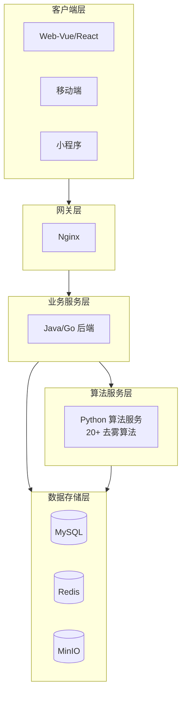

# 图像去雾系统 - 产品概述

## 1. 项目概述

### 1.1 项目名称

图像去雾系统（Dehaze System）

### 1.2 项目背景

在现代社会中，摄像头已经无处不在，无论是高速公路上的交通监控摄像头，还是人们手中的智能手机，都为我们提供了丰富的图像信息。然而，当恶劣天气如雾霾出现时，图像采集设备可能会受到影响，导致采集的图像模糊，对比度降低，甚至无法辨别图像中的物体。

随着大气污染问题日益严重，雾霾天气对图像采集设备的影响也越来越明显，导致图像对比度降低、颜色失真等问题。因此，开发一款能够在线实时响应的图像去雾系统，将极大地方便人们的生活，特别是对生活在雾霾地区的用户来说，这是一项急需解决的问题。

本系统是一套基于深度学习的去雾系统，利用先进的人工智能技术，通过训练神经网络模型对图像进行处理，从而实现去雾的目标。这不仅是一种技术上的创新，也是对人们生活质量改善的有力贡献。

### 1.3 战略目标：做深去雾

系统当前阶段的核心战略是"做深去雾"——将去雾体验打磨到生产级别，而非盲目扩展功能广度。具体含义：

- **体验闭环**：补齐处理历史、实时进度反馈、用户评分与反馈，让用户从上传到结果评估的每一步都有清晰的感知和回溯能力
- **商业化基础**：落地 VIP 会员体系（会员等级、套餐购买、订单管理），为持续运营提供收入支撑
- **数据飞轮**：通过用户评分和处理数据反哺算法迭代，形成"使用→反馈→优化"的正向循环
- **架构沉淀**：文件管理、任务队列、算法管理、用户权限等基础设施保持通用性，为后续横向扩展同类退化问题（去雨、去雪、低光增强）预留接口

### 1.4 项目目标

- 构建一个完整的端到端图像去雾解决方案
- 集成 20+ 种主流去雾算法（RIDCP、WPXNet、Dehamer、FFA-Net、AOD-Net、DCP 等），满足不同场景需求
- 提供 Web 端、移动端、桌面端等多平台支持
- 实现高性能图像处理，支持实时处理和批量处理
- 建立完善的安全机制和权限管理体系
- 落地 VIP 会员体系，支撑商业化运营

---

## 2. 产品定位

### 2.1 产品愿景

以去雾为核心能力起点，逐步扩展为覆盖多种图像退化问题的图像增强系统，最终演进为 AI 图像处理平台。当前阶段聚焦"做深去雾"，将去雾体验打磨到生产级别。

### 2.2 核心价值主张

| 价值点 | 描述 |
|-------|------|
| **一站式处理** | 图像采集→算法选择→去雾处理→效果对比→数据分析全流程无缝衔接 |
| **智能化体验** | 树形算法结构、样例快速预览、智能推荐最优算法 |
| **专业级对比** | 多维度对比工具（并排、重叠、放大镜、滤镜、指标） |
| **透明化评估** | 完整的算法信息和量化评估指标（PSNR、SSIM） |
| **多平台覆盖** | 一套系统支持 Web、Android、iOS、桌面端等多终端 |
| **商业化闭环** | VIP 会员体系、套餐购买、订单管理支撑持续运营 |

### 2.3 差异化优势

- 移动端首个完整的去雾处理与对比分析系统
- 树形算法结构，支持多种算法快速切换
- 专业级对比工具，满足研究和实际应用需求
- 流畅的用户体验，降低使用门槛
- 支持 GPU 加速（自动回退 CPU）

### 2.4 发展路线图

系统采用四阶段渐进式演进策略，每个阶段以前一阶段的稳定运营为前提：

```
阶段一（当前）          阶段二（近期→中期）       阶段三（中期）            阶段四（中期→远期）
做深去雾               横向扩展同类退化          AI 图像处理平台           AI 工作平台
━━━━━━━━━━━━━━━━━━━━━━━━━━━━━━━━━━━━━━━━━━━━━━━━━━━━━━━━━━━━━━━━━━━━━━━━━━━━━━━━━━
• 处理历史              • 去雨/去雪算法           • 超分辨率/去噪/修复       • 多模态交互
• 实时进度反馈           • 低光增强               • 模型市场                • 语音指令控制
• 用户评分与反馈         • 任务类型字段解耦        • OpenAPI + 多端 SDK      • 智能报告生成
• VIP 会员体系           • 产品名调整为            • 第三方算法接入          • 工作流编排
• 套餐/订单/反馈模块     「图像增强系统」                                   • 企业级解决方案
```

**阶段一：做深去雾（当前）**

目标是将去雾体验达到生产级别。补齐处理历史、进度反馈、用户评分三大核心体验缺口；落地 VIP 会员体系（会员等级、套餐购买、订单管理）；建立反馈评价闭环，形成数据飞轮。本阶段不扩展新算法类型，专注打磨现有 20+ 去雾算法的端到端体验。

**阶段二：横向扩展同类退化（近期→中期）**

去雨、去雪与去雾同属大气散射模型退化，算法结构几乎一致，是风险最低的扩展方向。后端任务表新增任务类型字段，使任务系统与具体算法解耦；Python 算法服务改造为按任务类型分发的路由机制；前端「去雾处理」页面抽象为通用「图像处理」页面。产品名调整为「图像增强系统」。

**阶段三：AI 图像处理平台（中期）**

增加超分辨率、去噪、图像修复等处理能力，引入模型市场支持第三方算法接入，OpenAPI 对外开放并自动生成多端 SDK。平台形成规模效应，用户量和数据量显著增长。

**阶段四：AI 工作平台（中期→远期）**

在图像处理能力基础上叠加多模态功能，构建"专业图像处理 + 多模态增强"的差异化定位。落地语音指令控制、智能报告生成、工作流编排等能力，从工具集合升级为智能工作流平台。

> 详细扩展可行性评估、兼容性判断、分阶段路径见 [产品拓展升级规划](../05-改造计划/产品拓展升级规划.md)

---

## 3. 目标用户分析

### 3.1 用户角色定义

#### 3.1.1 普通用户（手机拍照用户）

| 属性 | 描述 |
|-----|------|
| **核心需求** | 实时去雾、提高照片清晰度、简单易用 |
| **使用场景** | 日常生活随手拍照、旅游景点拍摄 |
| **权限范围** | 仅能操作与个人相关的功能模块 |
| **期望特征** | 系统应能自动识别图片中的雾霾，并自动进行去雾处理 |

#### 3.1.2 专业摄影师

| 属性 | 描述 |
|-----|------|
| **核心需求** | 高质量去雾、细节和色彩保持、可调节参数 |
| **使用场景** | 专业摄影后期处理、影视后期制作 |
| **权限范围** | 高级处理功能、参数调节、批量处理 |
| **期望特征** | 灵活的调整选项、无损处理能力 |

#### 3.1.3 图像处理研究人员/算法工程师

| 属性 | 描述 |
|-----|------|
| **核心需求** | 算法效果验证、多算法对比、量化评估指标 |
| **使用场景** | 算法测试与对比、学术研究、数据集管理 |
| **权限范围** | 算法管理模块、数据集管理、评估分析 |
| **期望特征** | 完整的评估数据、算法参数可配置 |

#### 3.1.4 系统管理员

| 属性 | 描述 |
|-----|------|
| **核心职责** | 系统整体管理，包括用户管理、角色权限分配、系统配置 |
| **权限范围** | 拥有系统所有功能的操作权限 |
| **特征要求** | 具备专业的系统管理知识，熟悉系统各项功能 |

### 3.2 应用场景分析

| 场景 | 需求特点 |
|-----|---------|
| **日常生活随手拍照** | 快速去雾、简单操作、即时预览 |
| **地面道路状况实时分析** | 实时去雾、稳定可靠、高准确性 |
| **室内室外监控** | 全天候运行、各种光照条件适配 |
| **遥感图像分析** | 大规模图像处理、批量处理能力 |
| **影视后期** | 高质量输出、无损处理、细节保留 |

---

## 4. 核心业务需求

### 4.1 图像处理核心需求

| 需求项 | 详细描述 |
|-------|---------|
| 单张/批量处理 | 支持单张图像和批量图像的去雾处理 |
| 多算法支持 | 集成多种主流去雾算法（RIDCP、WPXNet、Dehamer、DCP、CAP 等） |
| 实时进度 | 支持实时处理进度查看和结果预览 |
| 质量评估 | 提供图像质量评估指标（PSNR、SSIM 等） |
| 效果对比 | 6 种对比模式：并排、重叠、放大镜、滤镜、指标、算法信息 |

### 4.2 数据管理需求

| 需求项 | 详细描述 |
|-------|---------|
| 数据集管理 | 支持数据集的创建、编辑、删除和查询 |
| 文件管理 | 支持图像文件的上传、下载和管理 |
| 导入导出 | 提供数据集导入导出功能 |
| 去重处理 | 支持图像文件的去重处理（MD5 校验） |

### 4.3 用户管理需求

| 需求项 | 详细描述 |
|-------|---------|
| 用户认证 | 支持用户注册、登录、信息维护 |
| 权限控制 | 实现基于角色的访问控制（RBAC） |
| 组织架构 | 提供部门组织架构管理 |
| 细粒度权限 | 支持用户权限的细粒度控制（精细到按钮级别） |

### 4.4 系统管理需求

| 需求项 | 详细描述 |
|-------|---------|
| 配置管理 | 提供系统配置管理功能 |
| 菜单权限 | 支持菜单权限管理 |
| 日志审计 | 实现操作日志记录和审计 |
| 监控分析 | 提供系统监控和性能分析 |

---

## 5. 功能模块概览

### 5.1 前端核心功能模块（用户直接交互）

| 模块名称 | 核心功能 | 目标用户 |
|---------|---------|---------|
| **首页展示** | 产品介绍、功能展示、使用教程、数据统计 | 所有用户 |
| **图像输入模块** | 图片上传、拍照、样例库、历史记录 | 所有用户 |
| **算法选择模块** | 树形算法结构、搜索筛选、智能推荐、算法详情 | 所有用户 |
| **去雾处理模块** | 处理控制、批量处理、参数调节、结果管理 | 所有用户 |
| **效果对比模块** | 6 种对比模式、滤镜调节、指标分析、算法信息 | 所有用户 |
| **个人中心** | 处理历史、个人设置、VIP 权益、套餐购买、反馈评价 | 所有用户 |

### 5.2 后台管理功能模块（系统管理）

| 模块名称 | 核心功能 | 目标用户 |
|---------|---------|---------|
| **算法管理模块** | 算法生命周期管理、版本控制、性能监控、模型配置 | 管理员/研究人员 |
| **数据集管理模块** | 数据集管理、图片浏览、类型筛选、搜索、瀑布流展示 | 管理员/研究人员 |
| **用户管理模块** | 用户信息管理（增删改查）、密码重置、用户状态管理 | 管理员 |
| **角色管理模块** | 角色权限管理、权限分配 | 管理员 |
| **菜单管理模块** | 菜单配置、层级结构、动态配置 | 管理员 |
| **部门管理模块** | 部门组织架构管理 | 管理员 |
| **字典管理模块** | 系统字典配置、数据映射 | 管理员 |
| **会员管理模块** | VIP 用户管理、等级体系、成长值、权益管理 | 管理员 |
| **套餐管理模块** | VIP 套餐配置、价格策略、上下架管理 | 管理员 |
| **订单管理模块** | 订单记录、支付状态、退款处理 | 管理员 |
| **反馈评价模块** | 用户评价管理、反馈处理、评分统计 | 管理员 |

---

## 6. 用户旅程设计

### 6.1 完整用户旅程（5 阶段闭环）

```
【阶段1：图像输入】
用户进入APP
    ↓
选择输入方式
    ├→ 上传图片：选择图片 → 预览确认
    ├→ 拍照：打开相机 → 拍照 → 预览确认
    ├→ 样例库：浏览样例 → 选择样例
    └→ 历史记录：查看历史 → 选择记录
    ↓
【阶段2：算法选择】
进入算法选择页面
    ↓
查看智能推荐算法（可选）
    ↓
浏览算法树形结构 / 搜索筛选
    ↓
选择目标算法
    ↓
【阶段3：去雾处理】
确认处理参数（可选高级调节）
    ↓
点击"开始去雾"
    ↓
显示处理进度（WebSocket 实时推送）
    ↓
处理完成提示
    ↓
【阶段4：效果对比】
自动进入对比页面（默认并排对比）
    ↓
用户选择对比模式
    ├→ 并排对比：查看整体效果
    ├→ 重叠对比：精细对比细节
    ├→ 放大镜：查看局部细节
    ├→ 滤镜调节：调整视觉效果
    ├→ 指标对比：查看量化数据（PSNR、SSIM）
    └→ 算法信息：了解算法详情
    ↓
【阶段5：结果处理】
满意结果
    ├→ 保存到相册
    ├→ 分享到社交平台
    ├→ 导出对比报告
    └→ 添加到收藏
    ↓
不满意结果
    ├→ 返回算法选择（更换算法）
    ├→ 调整处理参数
    └→ 重新上传图片
```

### 6.2 快捷操作流程

| 流程类型 | 操作步骤 | 预计用时 |
|---------|---------|---------|
| **快速体验** | 点击"快速体验" → 选择样例图片 → 自动应用推荐算法 → 直接查看对比结果 | &lt;10秒 |
| **重复处理** | 历史记录 → 选择记录 → 更换算法 → 重新处理 → 对比新旧结果 | &lt;30秒 |
| **批量处理** | 批量上传 → 选择算法 → 批量处理 → 批量查看结果 → 批量导出 | 根据数量 |

---

## 7. 系统架构概览

### 7.1 整体架构

系统采用现代化全栈技术架构，整体分为五层：



### 7.2 技术栈概览

| 层级 | 技术栈 | 说明 |
|-----|-------|------|
| **客户端层** | Vue3/React + TypeScript | 响应式设计，支持 PC/移动端 |
| **网关层** | Nginx | 负载均衡，反向代理 |
| **业务服务层** | Spring Boot 3 / Gin | 用户管理，权限控制，业务逻辑 |
| **算法服务层** | PyTorch + Flask | 深度学习模型推理，图像处理 |
| **数据存储层** | MySQL + Redis + MinIO | 关系型数据 + 缓存 + 对象存储 |

### 7.3 多端覆盖

| 平台 | 技术实现 | 状态 |
|-----|---------|------|
| **Web 端（Vue）** | Vue 3 + Element Plus + Pinia | ✅ 主力开发 |
| **Web 端（React）** | React 18 + Ant Design + Redux Toolkit | ✅ 可用 |
| **桌面端** | Electron 31（基于 React） | ✅ 可用 |
| **Android 原生** | Java + MVVM | ✅ 可用 |
| **Flutter 跨平台** | Flutter + Dart + Riverpod | ✅ 开发中 |
| **小程序** | UniApp / Taro | ✅ 可用 |

---

## 8. 非功能需求

### 8.1 性能需求

| 指标 | 要求 |
|-----|------|
| 图像处理响应时间 | 单张图像不超过 30 秒（取决于算法和图像大小） |
| 并发用户数 | 支持至少 100 个并发用户同时使用 |
| 系统可用性 | 达到 99.9% |
| 页面加载时间 | 不超过 3 秒 |
| 操作响应时间 | 任何操作响应不超过 2 秒 |

### 8.2 安全需求

| 方面 | 措施 |
|-----|------|
| 身份认证 | JWT + RBAC 权限控制 |
| 数据传输 | HTTPS 加密传输 |
| 数据存储 | 敏感数据加密存储 |
| 攻击防护 | 防止 SQL 注入、XSS 等常见安全攻击 |
| 日志审计 | 操作日志记录和审计跟踪 |

### 8.3 可用性需求

| 方面 | 要求 |
|-----|------|
| 界面设计 | 直观友好的用户界面，操作流程清晰 |
| 浏览器支持 | 支持主流浏览器（Chrome、Firefox、Safari、Edge） |
| 响应式设计 | 适配不同屏幕尺寸（手机、平板、PC） |
| 帮助信息 | 提供详细的操作提示和帮助信息 |

### 8.4 兼容性需求

| 方面 | 支持范围 |
|-----|---------|
| 前端技术栈 | Vue 和 React 两种技术栈 |
| 后端技术栈 | Java、Go、Python 三种技术栈 |
| 操作系统 | Windows、Linux、macOS |
| 数据库 | MySQL、MongoDB |
| 移动端 | Android 7.0+、iOS 12.0+ |

---

## 9. VIP 会员体系

> **本章节为概要描述，完整的会员等级体系、成长规则、权益划分及管理流程见 [会员管理模块需求规格](../03-模块设计/基础模块/会员管理/需求规格.md)。套餐方案与价格策略见 [套餐管理模块需求规格](../03-模块设计/基础模块/套餐管理/需求规格.md)。订单流程与支付管理见 [订单管理模块需求规格](../03-模块设计/基础模块/订单管理/需求规格.md)。**

### 9.1 会员等级概览

| 项目 | 普通用户 | VIP1 | VIP2 | SVIP |
|-----|---------|------|------|------|
| 去雾次数 | 每月 20 次 | 每月 100 次 | 每月 500 次 | 每月 3000 次 |
| 评估次数 | 每月 20 次 | 每月 100 次 | 每月 500 次 | 每月 3000 次 |
| 历史记录保留条数 | 10 条 | 50 条 | 100 条 | 500 条 |
| 批量处理上限 | 5 张 | 10 张 | 15 张 | 20 张 |
| 处理优先级 | 普通 | 优先 | 高优先 | 最高 |

### 9.2 付费流程

1. 用户主动购买 VIP 或使用次数达上限自动跳转
2. 选择套餐类型（包月/季/年）
3. 跳转支付界面完成支付
4. 权益即时生效，成长值同步累积

---

## 10. 用户体验目标

### 10.1 核心体验指标

| 指标 | 目标值 |
|-----|-------|
| 快速体验完成时间（样例图片） | &lt;10 秒 |
| 完整去雾流程时间 | &lt;1 分钟 |
| 首次使用引导完成率 | >90% |
| 用户操作错误率 | &lt;5% |

### 10.2 交互设计原则

- **一致性**：统一的视觉风格和交互模式
- **可用性**：界面简洁明了，操作流程清晰
- **可访问性**：支持屏幕阅读器、足够的对比度
- **响应式**：适配不同屏幕尺寸，支持触控操作

---

## 11. 术语表

| 术语 | 说明 |
|-----|------|
| **去雾算法** | 用于去除图像中雾霾影响的计算机视觉算法 |
| **SSIM** | 结构相似性指数（Structural SIMilarity），衡量图像相似度的指标 |
| **PSNR** | 峰值信噪比（Peak Signal to Noise Ratio），衡量图像质量的指标 |
| **DCP** | 暗通道先验算法（Dark Channel Prior） |
| **CAP** | 色彩衰减先验算法（Color Attenuation Prior） |
| **RIDCP** | 一种先进的去雾算法 |
| **WPXNet** | 一种基于深度学习的去雾算法 |
| **Dehamer** | 一种基于 Transformer 的去雾算法 |
| **CNN** | 卷积神经网络（Convolutional Neural Network） |
| **GAN** | 生成对抗网络（Generative Adversarial Network） |
| **Transformer** | 注意力机制模型 |
| **RBAC** | 基于角色的访问控制（Role-Based Access Control） |
| **JWT** | JSON Web Token，用于身份认证 |
