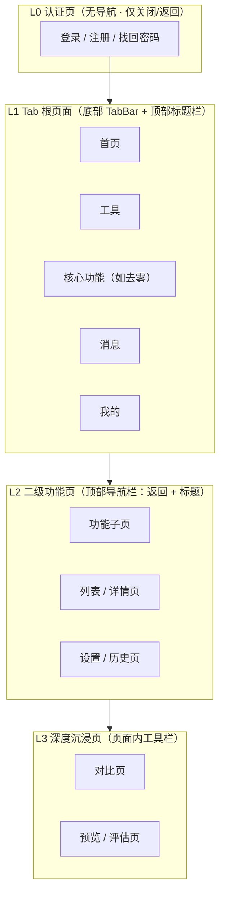

# 移动端界面设计规范（通用）

> 本规范定义移动端应用的页面层级体系与导航组件出现时机，适用于**所有移动端项目**（UniApp / Taro / React Native / Flutter / Android / iOS 等）。规范与具体技术栈、具体页面解耦，各端按自身组件能力落地同一套规则。视觉参考见 [UI/UX 设计规范](./02-UI-UX设计规范)，初始视觉稿见 `dehaze-mobile` 设计稿目录。

## 1. 规范定位与要解决的问题

移动端页面若缺少统一的框架约束，会出现：同一层级页面导航形态各异、TabBar 在任意页面随意出现、二级页面缺失返回路径、用户无法感知当前所处位置。本规范以「**页面层级决定导航形态**」为总纲，给出统一、可预测、可执行的导航与页面框架准则。

**规范适用范围**：应用内全部页面（含未来新增页面）。新增页面时必须先判定其层级归属，再按对应层级的导航模板实现。

## 2. 设计目标与总体原则

### 2.1 设计目标

| 目标 | 说明 |
|------|------|
| 位置可感知 | 用户在任何页面都能立即判断「我在哪、我从哪来、我能去哪」 |
| 导航一致性 | 同一层级页面使用统一的导航形态，一次学习、全端通用 |
| 路径可预测 | TabBar 出现/消失、返回方式遵循固定规则，不随页面临时改变 |
| 层级清晰 | TabBar 仅代表顶层目的地，杜绝任意深度页面出现 TabBar |
| 沉浸专注 | 结果类页面全屏呈现内容，避免无关导航干扰 |

### 2.2 总体原则

1. **层级决定导航形态**：页面类型（认证 / 首屏 / 功能 / 沉浸）直接决定其导航框架，不因业务细节改变。
2. **TabBar 只放顶层目的地**：底部导航栏承载 3-5 个应用最高层级的入口，代表应用的信息架构主干。
3. **深入即隐藏 TabBar**：从 Tab 根页面进入子页面（二级及以上）时，TabBar 隐藏，由顶部导航栏 + 返回接管。
4. **认证页无导航**：登录/注册跳出应用导航层级，仅保留关闭/返回。
5. **结果页去装饰**：结果/审阅类页面隐藏全局导航，使用页面内工具栏。

## 3. 页面层级体系

### 3.1 页面类型定义

| 层级 | 页面类型 | 特征 | 导航形态 |
|------|---------|------|---------|
| **L0** | 认证页（登录 / 注册 / 找回密码） | 全屏任务型页面，无应用内上下文 | 无任何应用导航，仅左上角关闭/返回 |
| **L1** | Tab 根页面（首屏页） | 应用顶层目的地，彼此平行、无返回语义 | 底部 TabBar + 顶部标题栏（品牌/标题） |
| **L2** | 二级功能页 | 有明确来源的功能执行页 | 顶部导航栏（返回 + 标题），TabBar 隐藏 |
| **L3** | 深度沉浸页 | 结果审阅类，需最大化内容面积 | 页面内深色工具栏（返回 + 本页操作），全局导航隐藏 |
| **弹层** | 模态页 / 半屏页（弹窗、底部面板、全屏模态） | 依附于当前页面上下文的临时任务 | 无导航栏，遮罩 + 关闭/取消 |

> 除上述类型外，运营落地页（营销 H5 等）遵循 L2 规则：顶部返回 + 标题，无 TabBar。

### 3.2 层级关系图

### 3.3 层级流转规则

| 流转 | 规则 |
|------|------|
| L0 → L1 | 认证成功后进入主界面（清空页面栈） |
| L1 ↔ L1 | 通过 TabBar 切换（清空栈语义），禁止互相压栈跳转 |
| L1 → L2 | 顶部导航栏出现返回，回到来源根页面 |
| L2 → L3 | 结果页工具栏返回，回到来源功能页 |
| 任意层级 | 可通过返回手势/按钮逐级回退；L1 根页面按系统惯例退至后台 |

## 4. 导航组件出现时机规范

### 4.1 底部导航栏（TabBar）

| 维度 | 规范 |
|------|------|
| 结构 | **3-5 个顶层目的地**。本项目目标架构：首页 / 工具 / 核心功能 / 消息 / 我的 |
| 展示条件 | **仅 L1 Tab 根页面显示**；进入二级及以上页面一律隐藏 |
| 隐藏方式 | 页面跳转时隐藏（对应 iOS `hidesBottomBarWhenPushed` 语义） |
| 交互规范 | ① 切换：替换当前 Tab 根页面并清空其子页面栈；② 高亮：当前页面对应 Tab 图标+文字高亮；③ 重复点击当前 Tab 回滚至根页面顶部；④ 内容区底部预留 TabBar 高度 + 安全区 |
| 数量准则 | 少于 3 项说明架构可收敛；多于 5 项须将低频入口降级收纳（如「更多」或侧边菜单） |
| 结构准则 | Tab 应反映信息架构主干（如：认知入口 / 工具集 / 核心动作 / 通知 / 个人中心），避免单 Tab 堆叠过多功能 |

**设计依据**：TabBar 是应用顶层导航（iOS HIG / Material Design 共识），应只在顶层页面出现。子页面保留 TabBar 会造成层级语义混乱——用户无法分辨当前是顶层还是子层，这正是「位置迷失」的主要来源。

### 4.2 顶部导航栏（NavBar）

| 维度 | 规范 |
|------|------|
| 展示层级 | L1 根页面（标题栏形态）与 L2 功能页（返回+标题形态） |
| L1 形态 | 品牌标识（点击回首页）+ 当前 Tab 标题 + 全局能力入口（搜索等） |
| L2 形态 | 返回按钮 + 页面标题（居中）+ 右侧操作区；标题文案 = 页面功能名，作为位置指示 |
| 隐藏条件 | L3 沉浸页（由页面内工具栏替代）；L0 认证页（无导航） |
| 交互 | 返回按钮回退一页；L1 品牌点击回到首页根页面 |

### 4.3 侧边菜单（可选辅助）

| 维度 | 规范 |
|------|------|
| 定位 | 非主导航，仅在功能超过 TabBar 承载上限（>5 顶层入口）时作为补充 |
| 触发 | 由顶部导航栏菜单按钮触发；触发前提是该页面存在顶部导航栏 |
| 内容 | 按业务分组收纳低频/管理类功能；当前路由高亮；选择后自动关闭 |
| 约束 | 禁止与 TabBar 承载同一层级功能造成双入口；L0/L3 页面禁止触发 |

### 4.4 页面内工具栏（沉浸页）

| 维度 | 规范 |
|------|------|
| 适用 | L3 深度沉浸页（结果对比、预览、评估） |
| 构成 | 返回 + 页面标题 + 本页专属操作（模式切换、保存、导出等） |
| 样式 | 与内容视觉基调融合（深色内容用深色工具栏），不套用全局导航样式 |
| 约束 | 无 TabBar、无全局导航；返回路径必须存在，防止用户陷入无出口状态 |

## 5. 各页面类型展示规范

> 回答「每种页面模块应该采用什么样的展示」：以下为每种页面类型的完整框架定义。

### 5.1 认证页（L0）—— 登录 / 注册

| 区块 | 规范 |
|------|------|
| 导航 | **无底部导航、无顶部导航栏**。仅保留左上角关闭按钮（独立进入时）或返回按钮（从业务上下文进入时） |
| 头部 | 品牌 Logo + 应用名 + 一句价值文案（居中） |
| 主体 | 表单（输入 + 主操作按钮），触控目标 ≥ 44×44 |
| 底部 | 辅助入口（切换登录方式、去注册/去登录、协议说明） |
| 背景 | 全屏内容沉浸，不留空白导航区 |

**依据**：认证是「任务型页面」，用户心智中它不属于应用导航层级；保留 TabBar/导航栏会暗示"可以随时离开"，分散认证专注度。行业实践（微信、淘宝、抖音等）一致：认证页无应用导航。

### 5.2 Tab 根页面（L1）—— 首屏页

| 区块 | 规范 |
|------|------|
| 顶部 | 标题栏：品牌标识（仅首页）/ 当前 Tab 标题 + 全局能力入口（搜索、菜单等） |
| 主体 | 该 Tab 的核心内容流（列表 / 卡片 / 宫格） |
| 底部 | TabBar（常驻，当前项高亮） |
| 特殊 | 首页可承载产品介绍、快捷入口、数据统计等聚合内容 |

### 5.3 二级功能页（L2）

| 区块 | 规范 |
|------|------|
| 顶部 | 导航栏：返回按钮 + 页面标题 + 右侧操作区 |
| 主体 | 功能内容；表单、列表、详情按业务实现 |
| 底部 | **无 TabBar**；底部操作栏（如确认按钮）可选，需预留安全区 |
| 状态 | 数据加载 / 空态 / 错误态均需完整呈现，并保留返回能力 |

### 5.4 深度沉浸页（L3）

| 区块 | 规范 |
|------|------|
| 顶部 | 页面内工具栏：返回 + 标题 + 本页操作（与内容同基调） |
| 主体 | 内容最大化（图像、图表、对比视图），可横屏 |
| 底部 | 无 TabBar；操作类按钮（如保存/分享）放工具栏或内容区内 |
| 状态 | 处理进度、加载、失败重试均需提供，且不阻塞返回 |

### 5.5 弹层（模态 / 半屏）

| 类型 | 规范 |
|------|------|
| 底部面板 | 顶部标题 + 关闭按钮；下拉手势关闭；不遮挡 TabBar 高亮状态 |
| 模态弹窗 | 遮罩 + 居中卡片；确认/取消；宽度 ≤ 屏幕 80% |
| 全屏模态 | 无导航栏；右上角关闭/取消；用于临时编辑类任务 |

## 6. 位置感知设计（解决「用户迷茫无措」）

导航一致性的核心是让用户随时知道「我在哪」。以下机制为**硬性要求**：

### 6.1 位置指示系统

| 机制 | 要求 |
|------|------|
| TabBar 高亮 | L1 页面当前 Tab 必须高亮，且高亮随页面切换即时更新 |
| 导航栏标题 | L2 页面标题 = 页面功能名，与入口文案一致，形成「入口→页面」对应 |
| 面包屑等价物 | 深度流转时用标题 + 返回按钮暗示层级（如「去雾处理 → 效果对比」） |
| 返回路径 | 每个非 L1 页面必须存在可见返回入口；L3 沉浸页返回按钮常驻 |

### 6.2 防迷失规则

- **禁止**在二级及以上页面显示 TabBar（否则用户无法判断是否处于顶层）。
- **禁止**无返回入口的页面（L3 页必须在工具栏提供返回）。
- **禁止**同一功能在 TabBar 与侧边菜单双入口。
- **禁止**页面标题与入口文案不一致（造成「我点进来的和我看到的不一样」）。
- 深链直达（分享/推送进入 L2/L3）时，仍须提供与正常流程一致的返回路径。

### 6.3 页面过渡

| 场景 | 过渡 |
|------|------|
| L1 ↔ L1 | Tab 切换（无堆叠动画） |
| 推入（L1→L2→L3） | 右滑入 + 返回右滑出 |
| 认证页 | 全屏模态弹出/滑入 |
| 底部面板 | 底部上滑 |

## 7. 设计决策依据（行业实践）

| 决策 | 结论 | 依据 |
|------|------|------|
| 认证页无导航 | 仅关闭/返回 | 认证为任务型全屏页，跳出导航层级；iOS HIG 模态任务惯例；主流 App 一致实践 |
| TabBar 3-5 项 | 本项目 5 项 | iOS HIG：TabBar 代表顶层信息架构，3-5 个清晰分组最佳 |
| 二级页隐藏 TabBar | 隐藏 | HIG 推入导航惯例（`hidesBottomBarWhenPushed`）；保持「TabBar=顶层」的单一语义 |
| 首页可放聚合内容 | 首页承载介绍+入口 | 首个 Tab 是用户认知入口，允许聚合，但须以入口卡片分流功能，避免单 Tab 过载 |
| 沉浸页用页面内工具栏 | 隐藏全局导航 | 结果审阅需最大化内容面积；深色工具栏避免白色导航破坏沉浸 |
| 侧边菜单仅作补充 | 可选 | 功能超出 TabBar 上限时兜底；不作主导航，避免双重入口 |

## 8. 落地指引（跨端）

| 能力 | UniApp | Taro | React Native |
|------|--------|------|--------------|
| TabBar 根页面 | `pages.json` tabBar 配置（原生） | `app.config` tabBar 配置（原生） | 自绘底部导航 |
| 推入隐藏 TabBar | 原生 tabBar 仅在 tabBar 页面显示 | 原生 tabBar 仅在 tabBar 页面显示 | `tabBar.hidden` 或按路由渲染 |
| 顶部导航栏 | 自绘 NavBar 组件（含状态栏高度适配） | Taro 导航栏 / 自绘 | react-navigation header |
| 返回路径 | `uni.navigateBack` | `Taro.navigateBack` | `navigation.goBack` |
| 安全区 | `env(safe-area-inset-*)` | 同左 | `SafeAreaView` |

> **TabBar 落地约定**：本项目的 UniApp 与 Taro 端均采用**原生 tabBar**（`pages.json` / `app.config` 配置），Tab 根页面跳转必须使用 `uni.switchTab` / `Taro.switchTab`，禁止 `navigateTo` / `reLaunch` 进入 Tab 页（原生 tabBar 页面由各端框架渲染，不随页面重建）。tabBar 图标使用 81×81 透明 PNG，普通态/选中态各一张，可由 `dehaze-taro/scripts/gen-tabbar-icons.mjs` 从设计稿 SVG 一键生成。

**新增页面流程**：判定层级 → 套用对应模板（见第 5 节）→ 注册路由/菜单 → 按第 6 节走查位置指示。

### 8.1 尺寸单位与适配基准（统一标准）

- **设计稿基准**：统一按 **750 宽度设计稿** 出图，代码中一律使用 **`rpx`**（750 基准）作为长度单位，`1rpx = 屏宽/750`。
- **禁止混用**：禁止在同一项目内混用 `px`（375 基准）与 `rpx`。旧代码历史遗留的 `px` 必须按 `1px = 2rpx` 迁移，不得新增 `px`。
- **Taro H5 机制说明**：Taro H5 通过编译期 `rpx→rem` + 运行时设置 `<html>` 根字号实现等比缩放，根字号被钳制在 `[minRootSize=20, maxRootSize=40]px`（`deviceRatio` 必须使用官方默认 `750: 1`，若配成 `750: 2` 会导致 rpx 渲染放大一倍）。
- **内联样式例外**：H5 端内联样式（JSX `style` 对象）不支持 `rpx`，仅可用 `px`；此类少量场景保持 `px` 并与 375 基准下的设计值一致。

## 9. 自查清单

- [ ] 认证页无任何应用导航，仅有关闭/返回
- [ ] TabBar 仅出现在 L1 根页面；二级及以上一律隐藏
- [ ] TabBar 项数 3-5，无单 Tab 功能过载
- [ ] L2 页面有返回 + 标题，标题与入口文案一致
- [ ] L3 沉浸页有页面内工具栏与常驻返回，无全局导航
- [ ] 无「同一功能双入口」，无「无返回出口」页面
- [ ] 深链直达的返回路径与正常流程一致
- [ ] 底部安全区 / 状态栏高度在各端正确适配
