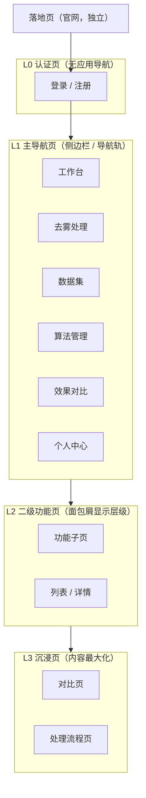

# 桌面端/网页端界面设计规范（通用）

> 本规范定义**桌面浏览器网页端**与**原生桌面端（Electron）**的页面层级体系、导航框架与窗口形态，适用于所有桌面端项目。视觉参考见 [UI/UX 设计规范](./02-UI-UX设计规范)，初始视觉稿见 `dehaze-desktop-web` 设计稿目录。与 [移动端界面设计规范](./03-移动端界面设计规范) 并列，同一产品在两端按平台习惯呈现导航。

## 1. 规范定位与核心问题

桌面端常见的框架问题：原生桌面与网页端共用一套布局导致平台体验割裂；网页端菜单在原生窗口里显得臃肿、浪费纵向空间；无边框窗口缺少规范的拖拽区与窗口控制；用户无法分辨当前所在功能层级。

本规范以「**同源产品、分端适配**」为总纲：产品逻辑与页面层级两端一致，但导航形态按平台惯例差异化——网页端用「侧边栏 + 顶栏」，原生桌面端用「无边框标题栏 + 窄导航轨」。

**规范适用范围**：桌面端全部页面（含未来新增页面）。新增页面先判定层级归属，再按对应端模板实现。

## 2. 两种形态的定位差异

### 2.1 形态定义

| 形态 | 载体 | 特点 |
|------|------|------|
| **桌面网页端** | 浏览器标签页 | URL 驱动导航、可刷新/收藏、浏览器前进后退 |
| **原生桌面端** | Electron 独立窗口（无边框） | 窗口驱动、自定义标题栏、应用菜单、全局快捷键 |

### 2.2 关键差异对照

| 维度 | 网页端 | 原生桌面端 |
|------|--------|-----------|
| 顶部导航 | 页面内顶栏（面包屑 + 全局操作） | 自定义标题栏（兼窗口拖拽区 + 窗口控制） |
| 主导航 | 完整侧边栏（可折叠，展开显示菜单文字） | 窄图标导航轨（rail，图标 + 文字） |
| 位置指示 | 面包屑 + 多标签页 + URL | 标题栏面包屑 + 导航轨高亮 |
| 返回/前进 | 浏览器按钮 + 应用内返回 | 仅应用内返回（可复用路由历史） |
| 刷新恢复 | URL 直达 + 本地存储恢复状态 | 窗口状态记忆（大小/位置/最大化） |
| 菜单承载 | 全部在页面内（侧边栏/下拉） | 高频在导航轨，低频在应用菜单 |
| 快捷键 | 受浏览器保留键限制 | 全局快捷键可用 |
| 窗口控制 | 浏览器统一管理 | 自定义最小化/最大化/关闭 |
| 退出 | 关闭标签 | 窗口关闭 + 退出确认（有未完成任务时） |

## 3. 页面层级体系

### 3.1 页面类型定义

| 层级 | 页面类型 | 特征 | 导航形态 |
|------|---------|------|---------|
| **L0** | 认证页（登录 / 注册） | 全屏任务型页面 | 无应用导航，仅关闭/返回 |
| **L1** | 主导航页 | 侧边栏/导航轨的一级目的地 | 侧边栏（web）/ 导航轨（desktop）+ 顶栏/标题栏 |
| **L2** | 二级功能页 | 一级功能下的子页面 | 顶栏面包屑显示层级，浏览器/应用内返回 |
| **L3** | 沉浸页（对比 / 处理 / 预览） | 内容最大化，弱化导航 | 内容占满，仅保留最小工具栏 |
| **落地页** | 官网 / 营销页（可选独立站） | 面向未登录访客 | 固定顶栏导航 + Hero，无侧边栏 |

### 3.2 层级关系图



### 3.3 层级流转规则

| 流转 | 规则 |
|------|------|
| L0 → L1 | 登录成功后进入主导航首页（清空历史） |
| L1 ↔ L1 | 侧边栏/导航轨切换，保持当前窗口与登录态 |
| L1 → L2 | 顶栏面包屑显示「L1 / L2」层级，返回一级 |
| L2 → L3 | 沉浸页提供返回（Esc 或工具栏返回） |
| 落地页 → L0 | 官网「登录/注册」入口进入认证页 |

## 4. 桌面网页端展示规范

### 4.1 整体布局

```
┌──────────────────────────────────────────────┐
│ 顶栏（64px）：面包屑 / 全局搜索 / 通知 / 用户  │
├──────────┬───────────────────────────────────┤
│ 侧边栏   │                                   │
│ (248px,  │        内容区（可多标签）          │
│ 可折叠   │                                   │
│ 至 64px) │                                   │
│          │                                   │
│ Logo     │                                   │
│ 菜单分组  │                                   │
│ 折叠按钮  │                                   │
└──────────┴───────────────────────────────────┘
```

| 区块 | 规范 |
|------|------|
| 侧边栏 | 宽度 248px，折叠后 64px（仅图标）；Logo + 品牌于顶部；菜单按业务分组；当前路由高亮；折叠状态持久化 |
| 顶栏 | 左侧面包屑（位置指示）；右侧全局搜索、通知、用户头像下拉（个人中心/设置/退出） |
| 内容区 | 可承载多标签页（TagsView）；独立滚动区域 |

### 4.2 侧边栏

| 维度 | 规范 |
|------|------|
| 宽度 | 展开 248px / 折叠 64px；默认展开 |
| 菜单结构 | 一级目的地直接展示；子级通过展开/缩进呈现，层级 ≤ 2 层 |
| 激活态 | 当前路由菜单高亮（主色浅底 + 主色文字），子页面所属一级菜单保持展开 |
| 权限过滤 | 按角色/权限过滤菜单项（`sys:{模块}:{操作}`），禁止出现无权限入口 |
| 分组 | 按业务分组（如：处理流程 / 数据管理 / 系统管理），分组标题弱化显示 |
| 状态记忆 | 折叠状态、展开的分组存本地存储，刷新后恢复 |

### 4.3 顶栏

| 区块 | 规范 |
|------|------|
| 面包屑 | 位置指示核心：首页 / 一级 / 二级；每级可点击回跳 |
| 全局搜索 | 跨功能搜索（算法、数据集、历史），快捷键 Ctrl/Cmd + K |
| 通知 | 铃铛图标 + 未读角标；下拉面板展示通知列表 |
| 用户区 | 头像 + 用户名下拉：个人中心、系统设置、退出登录 |

### 4.4 多标签页（TagsView，可选）

| 维度 | 规范 |
|------|------|
| 定位 | 内容区顶部标签条，记录已访问页面，便于多任务切换 |
| 行为 | 点击切换、可关闭（当前页可关闭并回到上一标签）、右键菜单（关闭其他/关闭全部） |
| 约束 | 标签上限（如 15 个），超出自动关闭最早标签；当前标签高亮 |
| 恢复 | 刷新后恢复已打开标签及激活项 |

### 4.5 路由与状态恢复

- **URL 驱动**：每个页面有唯一可直达的 URL；分享/收藏/刷新均恢复同一页面。
- **刷新恢复**：侧边栏折叠、标签页、筛选条件等 UI 状态持久化到本地存储。
- **浏览器导航**：前进/后退与路由栈一致；二级页面禁入后按返回键回到上一级。

## 5. 原生桌面端展示规范

### 5.1 无边框窗口与标题栏

| 维度 | 规范 |
|------|------|
| 窗口 | `frame: false` 无边框；标题栏作为拖拽区（`-webkit-app-region: drag`） |
| 标题栏高度 | 36-40px；含窗口拖拽区 + 交互元素标记 `no-drag` |
| 布局 | 左侧：品牌（Logo + 应用名）；中间：面包屑/页面标题（位置指示）；右侧：主题切换、设置、头像 + 窗口控制（最小化/最大化/关闭） |
| 窗口控制 | 最小化/最大化/关闭按钮置于标题栏右侧；关闭按钮 hover 变红 |
| macOS 适配 | 红绿灯（关闭/最小化/全屏）置于左侧，品牌右移避开；拖拽区避开红绿灯 |
| 多平台差异 | Windows 控制按钮在右；macOS 在左；图标统一但位置按平台惯例 |

### 5.2 导航轨（Rail）

| 维度 | 规范 |
|------|------|
| 形态 | 窄竖向导航轨（如 72-80px），图标 + 短文字纵排，容纳 5-7 个顶级目的地 |
| 定位 | 原生桌面端主导航；将网页端的 248px 侧边栏压缩为导航轨，纵向空间还给内容 |
| 内容 | 一级目的地（工作台 / 去雾 / 资料库 / 消息 / 我的 等），高频在前 |
| 高亮 | 当前页面对应项高亮（主色图标 + 浅底） |
| 扩展 | 需展示更多入口时：hover 弹出分组面板 / 或展开为完整侧边栏（记忆状态） |
| 底部 | 可放置设置、折叠按钮等低频入口 |

### 5.3 应用菜单（Menu）

| 维度 | 规范 |
|------|------|
| 定位 | 承载浏览器端没有的系统级能力与低频操作 |
| 结构 | 文件（新建任务、打开、退出）、编辑（撤销/重做/剪切复制粘贴）、视图（侧边栏显隐、全屏、缩放）、帮助（文档、关于） |
| 约束 | 应用菜单不承载业务导航；业务导航一律在导航轨 |
| 平台 | Windows/Linux 显示菜单栏或并入标题栏；macOS 使用系统菜单栏 |

### 5.4 快捷键

| 类别 | 建议 |
|------|------|
| 导航 | Ctrl/Cmd + 1-5 切换导航轨；Ctrl/Cmd + K 全局搜索 |
| 任务 | Ctrl/Cmd + N 新建处理任务；Ctrl/Cmd + Enter 提交 |
| 窗口 | Ctrl/Cmd + W 关闭窗口；F11 全屏 |
| 对比 | Esc 退出沉浸页；方向键切换对比模式 |
| 约束 | 避免与系统保留键冲突；在帮助菜单或设置中提供快捷键说明 |

### 5.5 窗口状态与托盘

- **窗口记忆**：大小、位置、最大化状态持久化，重启恢复。
- **单实例**：二次启动聚焦已有窗口，不重复开窗。
- **托盘（可选）**：关闭窗口最小化至托盘（设置开关），托盘菜单提供「打开主窗口 / 退出」。
- **退出确认**：存在进行中的处理任务时，退出前确认，防止数据丢失。

## 6. 共有页面类型展示规范

### 6.1 认证页（L0）—— 登录 / 注册

| 区块 | 规范 |
|------|------|
| 导航 | 无应用导航；仅左上角返回（从业务上下文进入时）或关闭 |
| 布局 | 居中卡片式：品牌 Logo + 表单 + 辅助入口；两侧留白或品牌视觉区 |
| 状态 | 错误提示、加载态、禁用态完整；支持 Enter 提交 |
| 原生桌面 | 登录页同样无侧边栏/导航轨，标题栏仅保留窗口控制 |

### 6.2 沉浸页（L3）—— 对比 / 处理 / 预览

| 区块 | 规范 |
|------|------|
| 布局 | 内容最大化，可隐藏侧边栏/导航轨（视图菜单控制显隐） |
| 工具栏 | 顶部最小工具栏：返回 + 页面标题 + 本页操作（保存/导出/模式切换） |
| 约束 | 返回路径必须存在（按钮或 Esc）；处理进度不阻塞返回 |
| 原生桌面 | 沉浸页可进入独立最大化状态，标题栏保留窗口控制 |

### 6.3 列表与表单页（L1/L2 通用）

- 列表：筛选区 + 表格/卡片 + 分页；支持搜索、排序、批量操作；空态/加载态/错误态完整。
- 表单：分组卡片、校验即时反馈、提交防重复；底部或右侧固定操作栏。

### 6.4 弹窗与抽屉

| 类型 | 规范 |
|------|------|
| 模态弹窗 | 居中，宽度按内容（≤ 720px）；确认/取消；Esc 关闭 |
| 抽屉 | 右侧滑出（408px 起），用于详情/编辑；遮罩点击关闭 |
| 确认框 | 危险操作需二次确认（删除、覆盖、退出） |

## 7. 设计决策依据（产品角度 + 平台最佳实践）

| 决策 | 结论 | 依据 |
|------|------|------|
| 网页端用完整侧边栏 | 248px 可折叠 | 浏览器用户依赖 URL/刷新/多标签；侧边栏是后台管理通用范式，信息密度高 |
| 原生桌面用导航轨 | 窄 rail | 无边框窗口纵向空间宝贵；Slack / VS Code / Teams / 飞书等桌面应用均以图标导航轨最大化内容区 |
| 原生桌面用自定义标题栏 | 无边框 + 拖拽区 | 与设计稿一致且已落地；统一品牌视觉、节省一栏高度 |
| 位置指示分端实现 | web 面包屑+标签 / desktop 标题栏面包屑 | 网页端浏览器已提供多标签，TagsView 是补充；桌面端需在标题栏内补足位置指示 |
| 应用菜单仅承载系统能力 | 不承载业务导航 | 业务导航走导航轨，应用菜单做平台能力（文件/编辑/视图/帮助），避免双入口 |
| 认证页两端一致 | 无应用导航 | 任务型全屏页惯例；桌面端登录页仅保留窗口控制 |
| 沉浸页两端一致 | 内容最大化 | 对比/处理是核心审阅场景，导航让位于内容 |

## 8. 落地指引

| 能力 | 网页端（dehaze-front-vue） | 原生桌面端（dehaze-front-react） |
|------|---------------------------|--------------------------------|
| 当前布局 | 侧边栏 + 顶栏 + TagsView（Element Plus） | Ant Design 侧边栏 + 顶栏 + 无边框标题栏 |
| 演进方向 | 保持侧边栏 + 顶栏 + 多标签，按第 4 节细化 | 向「标题栏 + 导航轨」演进（第 5 节），内容区最大化 |
| 关键改动点 | 面包屑、标签恢复、URL 直达、折叠记忆 | 导航轨替代宽侧边栏、窗口记忆、应用菜单、快捷键 |
| 认证/沉浸页 | 独立路由无布局壳 / 沉浸布局 | 同左；沉浸页可独立窗口 |

**新增页面流程**：判定层级（L0-L3）→ 按端套用模板（第 4/5/6 节）→ 注册路由与菜单（权限过滤）→ 走查位置指示与返回路径。

## 9. 自查清单

- [ ] 认证页无应用导航，桌面端仅保留窗口控制
- [ ] 网页端：侧边栏可折叠、激活态正确、折叠状态记忆、面包屑完整
- [ ] 网页端：每页有唯一 URL，刷新恢复状态，浏览器前进后退一致
- [ ] 原生桌面端：标题栏为拖拽区、交互元素 no-drag、窗口控制位置按平台惯例
- [ ] 原生桌面端：导航轨高亮正确，无 248px 宽侧边栏挤压内容区
- [ ] 应用菜单仅承载系统能力，无业务双入口
- [ ] 快捷键可用且不与系统冲突；帮助/设置中可查
- [ ] 窗口大小/位置记忆；单实例；退出确认（有未完成任务时）
- [ ] 沉浸页有返回路径（按钮或 Esc），内容最大化
- [ ] 暗色模式 / 多主题随项目主题机制适配
