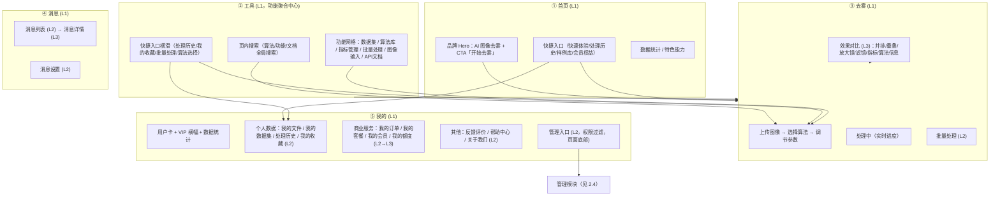
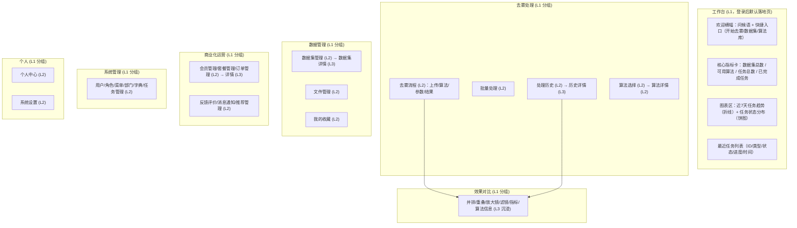

# 菜单与页面层级规划（移动端 / 桌面端）

> 本文档基于 [移动端界面设计规范](./03-移动端界面设计规范)（L0-L3 层级）与 [桌面端界面设计规范](./04-桌面端界面设计规范)（侧边栏/导航轨）制定，为产品移动端与桌面端分别规划**完整的菜单结构与页面层级**，回答每个功能模块「放在哪、从哪进、怎么交互」。核心目标：菜单组织逻辑清晰、层级合理、核心链路 ≤ 2 步可达。

## 1. 规划目标与总原则

| 原则 | 说明 |
|------|------|
| 核心链路最短 | 输入 → 算法 → 去雾 → 对比的主链路，入口常驻、路径 ≤ 2 步 |
| 位置可感知 | 每个页面有明确层级归属（L1/L2/L3）与位置指示（TabBar 高亮 / 导航栏标题 / 面包屑） |
| 模块单一归属 | 同一功能只有一个主入口，避免双入口造成的认知混乱 |
| 权限驱动菜单 | 管理类模块按 `sys:{模块}:{操作}` 权限过滤，无权限不显示 |
| 分端同构 | 产品模块两端一致，仅导航形态按平台差异化（移动端 TabBar / 桌面端侧边栏·导航轨） |

**层级语义约定**（与两端规范一致）：

| 层级 | 移动端 | 桌面端 |
|------|--------|--------|
| L0 | 认证页（登录/注册），无导航 | 同左 |
| L1 | Tab 根页面（底部 TabBar 常驻） | 侧边栏 / 导航轨一级目的地 |
| L2 | 二级功能页（顶部导航栏：返回+标题，TabBar 隐藏） | 二级功能页（顶栏面包屑显示层级） |
| L3 | 深度沉浸页（页面内深色工具栏） | 沉浸页（内容最大化，最小工具栏） |

---

## 2. 移动端菜单页面层级规划

### 2.1 整体架构（5 Tab）

```
L1 Tab 根页面（底部 TabBar 常驻）
├── ① 首页      —— 认知入口：品牌 Hero + 快捷入口 + 数据统计 + 特色能力
├── ② 工具      —— 功能聚合中心：全局搜索 + 快捷入口横滑 + 功能网格
├── ③ 去雾      —— 核心动作：完整处理流程（上传→算法→参数→处理→对比）
├── ④ 消息      —— 通知中心：系统/处理/活动消息
└── ⑤ 我的      —— 个人中心：用户卡 / VIP / 统计 / 个人数据 / 商业服务 / 管理入口
```

### 2.2 菜单树



### 2.3 各 Tab 模块详解

#### ① 首页（L1 根页面）

| 模块 | 层级 | 导航路径 | 交互逻辑 |
|------|------|---------|---------|
| 品牌 Hero | 首页顶部 | 品牌标语「AI 图像去雾」+ 副标题 + CTA「开始去雾」 | 展示系统形象；CTA 直达去雾流程（L1→去雾 Tab） |
| 快速体验 | 首页快捷入口 | 点击 → 直达去雾流程（自动载入样例图） | 一键体验核心链路，<10 秒完成；不进入任何中间页 |
| 处理历史入口 | 首页快捷入口 | 点击 → 我的 > 处理历史 (L2) | 复用上次处理，支持「换算法重新处理」 |
| 样例库入口 | 首页快捷入口 | 点击 → 工具 > 图像输入（样例） | 从样例开始体验，选图后带入去雾流程 |
| 会员权益入口 | 首页快捷入口 | 点击 → 我的 > 会员中心 (L2) | 未登录时跳转登录；已登录直达会员权益页 |
| 数据统计 | 首页区块 | 展示算法数 / 处理量 / 评分 | 静态数据展示，无跳转 |
| 特色能力 | 首页区块 | 展示推荐/对比/进度/VIP 卖点 | 可点击项跳转对应功能页 |

#### ② 工具（L1 根页面，功能聚合中心）

工具 Tab 采用**聚合页形态**：顶部页内搜索 + 快捷入口横滑区 + 全功能网格，一屏覆盖全部功能入口。

| 区块 | 层级 | 导航路径 | 交互逻辑 |
|------|------|---------|---------|
| 全局搜索栏 | 页内搜索 | 聚焦展开搜索建议（算法/功能/文档匹配）+ 最近搜索；输入实时出结果 | 点击算法结果 → 带入去雾流程并预选；点击功能结果 → 跳转对应页面；「取消」收起返回默认视图 |
| 快捷入口横滑区 | 页内快捷区 | 处理历史 / 我的收藏 / 批量处理 / 算法选择 | 高频功能横滑直达；均为已有 L2 页面的快捷引用，不重复建页 |
| 功能网格（3 列） | 页内网格 | 数据集 / 算法库 / 指标管理 / 批量处理 / 图像输入 / API文档 | 网格项直达对应 L2 页；按实际功能数量增减，网格 ≤ 3 列 |
| 图像输入 | L2 | 工具 → 图像输入（网格项） | 四个输入方式 Tab（上传/拍照/样例库/历史记录）；选图确认后弹出「开始去雾」→ 带入去雾流程 |
| 算法库 | L2 | 工具 → 算法库 | 树形算法结构 + 搜索 + 智能推荐；点「使用该算法」→ 带入去雾流程步骤 2；算法卡片可进详情 (L3) |
| 算法详情 | L3 | 工具 → 算法库 → 算法详情 | 深色沉浸展示算法说明/参数/适用场景；「返回」回到算法库 |
| 数据集 | L2 | 工具 → 数据集 | 数据集卡片列表（公开/共享数据集）；支持搜索筛选 |
| 数据集详情 | L3 | 工具 → 数据集 → 数据集详情 | 图片瀑布流 + 类型筛选 + 搜索；点图预览 |
| 指标管理 | L2 | 工具 → 指标管理 | 指标查询与对比（PSNR/SSIM 等） |
| 批量处理 | L2 | 工具 → 批量处理 | 批量上传（≤ 会员上限）→ 选择算法 → 批量执行 → 结果列表；**与去雾 Tab 的批量处理共用同一页面** |
| API文档 | L2 | 工具 → API文档 | 开放接口文档（面向开发者） |

> **职责边界**：工具 Tab 只放**工具/浏览类**功能（普通用户可用、不依赖权限）。**管理类**（算法管理、用户管理、系统设置等）一律归「我的 > 管理入口」（权限过滤，见 2.4），不在工具网格出现，避免无权限入口裸露与层级混乱。
>
> **工具与去雾的分工**：**去雾** 是主流程（上传后一路走完）；**工具** 是功能聚合与备选入口（先选图/选算法再带入流程、浏览数据集/算法）。两者通过「开始去雾 / 使用该算法」动作衔接。
>
> **搜索能力统一**：工具页内搜索与顶部导航栏搜索为**同一全局搜索能力**（搜索算法/功能/文档），任意页面均可达；工具页内为常驻强化形态（含建议与最近搜索）。

#### ③ 去雾（L1 根页面，核心动作）

| 模块 | 层级 | 导航路径 | 交互逻辑 |
|------|------|---------|---------|
| 去雾流程 | L1 页内步骤流 | 上传图像 → 选择算法 → 调节参数 → 开始处理 | 步骤间可来回切换（步骤条指示）；每步保留上一步选择 |
| 上传图像 | 流程步骤 1 | 页内上传区（拍照/相册/样例/从工具带入） | 拖拽/点击上传；上传后进入算法选择步骤 |
| 选择算法 | 流程步骤 2 | 从工具/算法选择带入，或页内直接选 | 推荐算法置顶；选中即高亮 |
| 参数调节 | 流程步骤 3 | 页内滑块（强度/亮度/对比度） | 实时预览效果（可选） |
| 处理进度 | 页内状态 | 点击「开始去雾」后展示 | 真实进度（WebSocket），可取消；完成后进入结果 |
| 效果对比 | L3 沉浸 | 处理完成自动进入 | 6 种模式（并排/重叠/放大镜/滤镜/指标/算法信息）页面内切换；「返回」回到处理结果 |
| 批量处理 | L2 | 去雾 Tab 内入口 | 与工具 Tab 共用批量处理页（单一归属：主入口在去雾 Tab） |
| 处理历史 | L2 | 去雾 Tab 内入口 | 与我的 Tab 共用（单一归属：主入口在我的 Tab） |

#### ④ 消息（L1 根页面）

| 模块 | 层级 | 导航路径 | 交互逻辑 |
|------|------|---------|---------|
| 消息列表 | L2 | 消息 → 消息列表 | 分类（系统通知/处理完成/活动）；未读角标；点击进详情 |
| 消息详情 | L3 | 消息 → 消息列表 → 详情 | 正文展示；处理类消息可一键跳转对应处理结果 |
| 消息设置 | L2 | 消息 → 设置 | 通知开关、免打扰时段、处理完成提醒开关 |

#### ⑤ 我的（L1 根页面，个人中心）

采用**顶部信息区 + 分组列表**结构：用户卡 / VIP 横幅 / 数据统计（顶部），个人数据、商业服务、其他三个分组，管理入口分组收于页面底部（权限过滤）。

| 区块 | 层级 | 导航路径 | 交互逻辑 |
|------|------|---------|---------|
| 用户卡 | L1 顶部 | 展示头像/昵称/会员等级 | 未登录显示「登录 / 注册」按钮；点击进登录 |
| VIP 横幅 | L1 顶部 | 会员权益引导「开通 VIP 畅享 3000 次/月」 | 点击「去开通」→ 会员中心 |
| 数据统计 | L1 顶部 | 剩余额度 / 本月处理 / 我的收藏数 | 静态展示，点击对应项可进详情页 |
| 个人数据分组 | L2 列表 | 我的文件 / 我的数据集 / 处理历史 / 我的收藏 | 列表项点击进入对应 L2 页 |
| 处理历史 | L2 | 我的 → 个人数据 → 处理历史 | 任务列表（时间倒序）+ 状态筛选；点进详情 (L3) 可对比/复用 |
| 历史详情 | L3 | 我的 → 处理历史 → 详情 | 结果对比 + 重处理（换算法/调参数） |
| 我的收藏 | L2 | 我的 → 个人数据 → 我的收藏 | 收藏的处理结果/算法；可取消收藏、按类型筛选 |
| 我的文件 | L2 | 我的 → 个人数据 → 我的文件 | 个人上传图片/结果文件列表；搜索/筛选；点进预览 (L3) |
| 文件预览 | L3 | 我的 → 我的文件 → 预览 | 全屏预览；可分享/删除/用于重新处理 |
| 我的数据集 | L2 | 我的 → 个人数据 → 我的数据集 | 个人创建/共享的数据集列表 |
| 商业服务分组 | L2 列表 | 我的订单 / 我的套餐 / 我的会员 / 我的额度 | 列表项点击进入对应 L2 页 |
| 会员中心 | L2 | 我的 → 商业服务 → 我的会员 | 当前等级 + 成长值 + 权益说明；未开通引导购买 |
| 套餐购买 | L3 | 我的 → 我的会员 → 套餐 | 套餐卡片（包月/季/年）→ 下单 → 支付 |
| 我的订单 | L2 | 我的 → 商业服务 → 我的订单 | 订单列表 → 订单详情（状态/发票/退款入口） |
| 我的额度 | L2 | 我的 → 商业服务 → 我的额度 | 额度明细 / 恢复规则 |
| 其他分组 | L2 列表 | 反馈评价 / 帮助中心 / 关于我们 | 列表项点击进入对应 L2 页 |
| 反馈评价 | L2 | 我的 → 其他 → 反馈评价 | 我的反馈 + 我的评价两个 Tab；新增反馈 |
| 反馈/评价详情 | L3 | 我的 → 反馈评价 → 详情 | 处理进度/回复；可评价评分 |
| 系统设置 | L2 | 右上角齿轮图标（页头） | 账号安全、通知偏好、缓存清理、关于、退出登录；不占分组列表 |
| 管理入口分组 | L2 列表 | **我的 → 管理入口（页面底部，权限过滤）** | 见 2.4；仅管理员/研究人员可见，无权限整组不显示 |

### 2.4 移动端管理模块（「我的」Tab 底部管理入口内，L2 级子页面）

> 入口位置：「我的」页底部**管理入口分组**（权限过滤，无权限整组不显示）。管理功能不进入「工具」网格，避免普通用户看到无权限入口。

| 分组 | 模块 | 说明 | 权限 |
|------|------|------|------|
| 算法与数据 | 算法管理 | 算法列表/上架下架/参数配置 | `sys:algorithm:*` |
| 算法与数据 | 数据集管理 | 数据集创建/上传/图片管理 | `sys:dataset:*` |
| 系统管理 | 用户管理 | 用户增删改查/密码重置 | `sys:user:*` |
| 系统管理 | 角色管理 | 角色/权限分配 | `sys:role:*` |
| 系统管理 | 菜单管理 | 菜单配置 | `sys:menu:*` |
| 系统管理 | 部门管理 | 组织架构 | `sys:dept:*` |
| 系统管理 | 字典管理 | 数据字典 | `sys:dict:*` |
| 系统管理 | 任务管理 | 任务队列监控 | `sys:task:*` |
| 运营管理 | 会员管理 | 会员等级/权益配置 | `sys:member:*` |
| 运营管理 | 套餐管理 | 套餐/价格/上下架 | `sys:package:*` |
| 运营管理 | 订单管理 | 订单/退款处理 | `sys:order:*` |
| 运营管理 | 反馈评价管理 | 评价统计/反馈处理 | `sys:feedback:*` |
| 运营管理 | 推荐管理 | 推荐规则配置 | `sys:recommendation:*` |
| 运营管理 | 消息管理 | 公告/模板/推送配置 | `sys:notify:*` |

> 移动端管理模块是**轻量管理**（查看/处理/简单配置），复杂管理与报表建议在桌面端操作；无对应权限的模块不显示。

---

## 3. 桌面端菜单页面层级规划

### 3.1 整体架构

**网页端（完整侧边栏，分组式）**：

```
L1 侧边栏（248px 可折叠）
├── 工作台
│   └── 工作台（统计仪表盘 + 快捷入口）
├── 去雾处理
│   ├── 去雾流程（上传→算法→参数→处理→对比）
│   ├── 批量处理
│   ├── 处理历史
│   └── 算法选择
├── 效果对比
│   ├── 并排对比 / 重叠对比 / 放大镜 / 滤镜调节 / 指标评估 / 算法信息
├── 数据管理
│   ├── 数据集管理
│   ├── 文件管理
│   └── 我的收藏
├── 商业化运营
│   ├── 会员管理 / 套餐管理 / 订单管理 / 反馈评价 / 消息通知 / 推荐管理
├── 系统管理
│   ├── 用户管理 / 角色管理 / 菜单管理 / 部门管理 / 字典管理 / 任务管理
└── 个人
    └── 个人中心 / 系统设置
```

**原生桌面端（导航轨，5 个顶级目的地）**：

```
Rail（72-80px，图标+短文字）
├── 工作台
├── 去雾     ← 核心动作
├── 资料库   （数据集 + 文件 + 收藏）
├── 消息
└── 我的     （个人中心 + 设置 + 管理）
Hover 当前项 → 弹出分组浮层（完整菜单，同网页端分组）
```

### 3.2 菜单树



### 3.3 各分组模块详解

#### 工作台（L1，登录后默认落地页）

> 对应实现：`dehaze-front-vue/src/views/dashboard`。工作台是登录后的默认落地页（数据总览 + 快捷操作），与「首页」（产品介绍/品牌落地页）并存：**首页**面向品牌形象与访客认知，**工作台**面向登录用户的数据与操作。两者均为一等页面，按产品需要配置菜单显隐。

| 模块 | 层级 | 导航路径 | 交互逻辑 |
|------|------|---------|---------|
| 欢迎横幅 | 工作台顶部 | 问候语（按时段）+ 快捷入口（开始去雾/数据集/算法库） | 快捷入口直达对应 L2 页（去雾流程/数据集管理/算法库） |
| 核心指标卡 | 工作台指标区 | 数据集总数 / 可用算法 / 任务总数 / 已完成任务 | 数据来自**真实统计接口**；点击卡片直达对应列表页 |
| 任务趋势图 | 工作台图表区 | 近 7 天任务处理趋势（折线图） | 趋势数据由后端统计接口提供，按天聚合 |
| 任务状态分布 | 工作台图表区 | 任务状态分布（饼图：待执行/执行中/已完成/失败/已取消） | 全量状态计数来自真实接口，**禁止**用最近 N 条局部数据近似 |
| 最近任务 | 工作台列表区 | 最近任务表格（ID/类型/状态/进度/创建时间）→「查看全部」进任务管理 | 展示最近任务，状态与进度实时反映后端 |

**硬性约束**：
- **禁止模拟/假统计**：工作台全部数值与图表必须对接真实后端统计接口（统计口径统一，含全量状态计数），当前实现的随机模拟数据与"最近 5 条近似统计"需改造为真实接口，与 [产品概述](./01-产品概述) 的体验目标一致。
- **默认落地页**：登录成功后默认进入**工作台**；「首页」（品牌介绍）作为品牌入口保留，二者不可混为一谈（见 [文案与术语规范](./06-文案与术语规范) 术语表：工作台 vs 首页）。

#### 去雾处理（L1 分组，核心）

| 模块 | 层级 | 导航路径 | 交互逻辑 |
|------|------|---------|---------|
| 去雾流程 | L2 | 去雾处理 → 去雾流程 | 左侧步骤导航（上传→算法→参数→处理→结果）或顶部步骤条；每步可回改；处理进度实时展示 |
| 批量处理 | L2 | 去雾处理 → 批量处理 | 批量上传（上限按会员等级）→ 选算法 → 批量执行 → 批量结果导出 |
| 处理历史 | L2 | 去雾处理 → 处理历史 | 任务列表（状态/时间/算法筛选）→ 历史详情 (L3) 对比 + 复用 |
| 算法选择 | L2 | 去雾处理 → 算法选择 | 树形结构 + 搜索 + 推荐；「使用」带入去雾流程；独立入口满足先选算法再处理的需求 |

#### 效果对比（L1 分组）

| 模块 | 层级 | 导航路径 | 交互逻辑 |
|------|------|---------|---------|
| 6 种对比模式 | L3 沉浸 | 效果对比 → 模式 / 处理结果自动进入 | 并排/重叠/放大镜/滤镜/指标/算法信息，模式间页内切换；最大化内容区，顶栏最小工具栏（返回+操作）；Esc/按钮返回 |

#### 数据管理（L1 分组）

| 模块 | 层级 | 导航路径 | 交互逻辑 |
|------|------|---------|---------|
| 数据集管理 | L2 | 数据管理 → 数据集管理 | 数据集列表（创建/编辑/删除/导入导出）→ 数据集详情 (L3)：图片瀑布流、筛选、搜索、批量操作 |
| 文件管理 | L2 | 数据管理 → 文件管理 | 个人文件列表（上传/下载/删除/重命名/去重） |
| 我的收藏 | L2 | 数据管理 → 我的收藏 | 收藏的处理结果/算法，取消收藏、重新处理 |

#### 商业化运营（L1 分组，管理向）

| 模块 | 层级 | 导航路径 | 交互逻辑 |
|------|------|---------|---------|
| 会员管理 | L2 | 商业化运营 → 会员管理 | 会员列表 → 会员详情（等级/成长值/权益调整） |
| 套餐管理 | L2 | 商业化运营 → 套餐管理 | 套餐配置/价格/上下架 |
| 订单管理 | L2 | 商业化运营 → 订单管理 | 订单列表（状态筛选）→ 订单详情 → 退款处理 |
| 反馈评价 | L2 | 商业化运营 → 反馈评价 | 评价统计 + 反馈列表 → 详情处理；含我的评价/我的反馈个人视图 |
| 消息通知 | L2 | 商业化运营 → 消息通知 | 公告管理、消息模板、推送设置 |
| 推荐管理 | L2 | 商业化运营 → 推荐管理 | 推荐规则配置 |

#### 系统管理（L1 分组）

| 模块 | 层级 | 导航路径 | 交互逻辑 |
|------|------|---------|---------|
| 用户管理 | L2 | 系统管理 → 用户管理 | 用户增删改查、密码重置、状态管理 |
| 角色管理 | L2 | 系统管理 → 角色管理 | 角色 CRUD + 权限分配（菜单/按钮级） |
| 菜单管理 | L2 | 系统管理 → 菜单管理 | 菜单树配置（增删改、排序、隐藏） |
| 部门管理 | L2 | 系统管理 → 部门管理 | 部门树组织架构 |
| 字典管理 | L2 | 系统管理 → 字典管理 | 字典类型 → 字典项维护 |
| 任务管理 | L2 | 系统管理 → 任务管理 | 任务队列监控、重试、取消 |

#### 个人（L1 分组）

| 模块 | 层级 | 导航路径 | 交互逻辑 |
|------|------|---------|---------|
| 个人中心 | L2 | 个人 → 个人中心 | 个人信息编辑、我的会员、我的订单、我的收藏、我的反馈 |
| 系统设置 | L2 | 个人 → 系统设置 | 主题/语言、快捷键说明、通知偏好、账号安全、关于、退出登录 |

### 3.4 原生桌面端导航轨映射

| 导航轨项 | 对应分组 | 展开内容 |
|---------|---------|---------|
| 工作台 | 工作台 | 工作台 |
| 去雾 | 去雾处理 | 去雾流程/批量处理/处理历史/算法选择 |
| 资料库 | 数据管理 | 数据集管理/文件管理/我的收藏 |
| 消息 | 商业化运营（消息部分） | 消息通知；未读角标 |
| 我的 | 个人 + 管理 | 个人中心/系统设置 + 商业化运营/系统管理（权限过滤） |

> 桌面端管理功能（系统管理/商业化运营）为**完整管理能力**，是管理员的日常操作主战场，优于移动端轻量管理。

---

## 4. 权限与菜单过滤

| 场景 | 规则 |
|------|------|
| 菜单过滤 | 侧边栏/导航轨/移动端管理入口按 `sys:{模块}:{操作}` 权限动态渲染，无权限不显示入口 |
| 直达校验 | 路由守卫校验访问权限，无权限跳转 401/403，防止 URL 直达绕过 |
| 可见性 | 普通用户仅见个人功能；管理员见全部；研究人员额外可见算法/数据集管理 |

## 5. 关键交互规则（防迷失与防双入口）

- **主入口唯一，快捷引用允许**：每个功能有唯一的页面归属主入口（如处理历史归「我的 > 个人数据」，批量处理归去雾 Tab）；首页快捷入口、工具快捷入口横滑区为**快捷引用**（直达同一页面，不重复建页），与主入口并存合理，但须保证引用目标一致。
- **管理功能不裸露**：管理类模块只出现在「我的 > 管理入口」（权限过滤），不进入工具网格与首页快捷入口；无权限整组不显示。
- **主链路 ≤ 2 步**：去雾处理入口在移动端 TabBar 常驻 + 首页 Hero CTA/快捷入口；桌面端侧边栏/导航轨常驻。
- **带入衔接**：工具中选择的图像/算法通过「开始去雾 / 使用该算法」动作带入流程，不直接跳转多个页面。
- **全局搜索统一**：工具页内搜索与顶部导航栏搜索共用同一全局搜索能力（算法/功能/文档），搜索结果的行为一致（算法 → 预选带入流程；功能 → 跳转页面）。
- **返回路径**：所有 L2/L3 页面必须有返回入口（导航栏返回 / 沉浸页工具栏 / Esc）。
- **权限一致**：两端菜单过滤规则与后端权限模型一致，新增管理模块须同步两端菜单配置。

## 6. 自查清单

- [ ] 移动端 5 Tab 命名与结构符合 [移动端界面设计规范](./03-移动端界面设计规范)
- [ ] 桌面端分组/导航轨符合 [桌面端界面设计规范](./04-桌面端界面设计规范)
- [ ] 核心链路（输入→算法→去雾→对比）两端 ≤ 2 步可达
- [ ] 每个模块主入口唯一；首页/工具快捷区仅作引用，引用目标一致
- [ ] 管理模块仅存在于「我的 > 管理入口」并按权限过滤；工具网格无管理项
- [ ] 首页含品牌 Hero（系统形象）+ 快捷入口 + 统计 + 特色能力
- [ ] 工具 Tab 为聚合页（页内搜索 + 快捷入口横滑 + 功能网格 ≤ 3 列）
- [ ] 管理模块按权限过滤，移动端轻量、桌面端完整
- [ ] 所有 L2/L3 页面有返回路径与位置指示
- [ ] 工作台统计与图表对接真实后端接口，无模拟数据 / 假统计
- [ ] 新增模块时同步更新两端菜单配置与本规划文档
