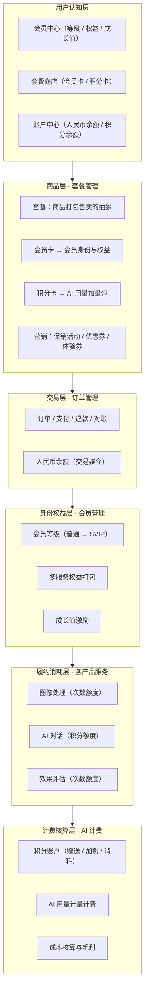

# 商业化体系总体架构

> **文档定位**：本文档是商业化体系的产品级思想指导，从产品概念层定义"会员—套餐—积分—交易—计费"的整体架构与设计原则，供套餐管理、会员管理、订单管理、AI 计费等各模块需求规格设计时统一遵循。
> 文档只描述产品概念与设计原则，具体实现细节（数据结构、接口、流程）由各模块需求规格承载。

## 1. 体系定位

本平台是"专业图像处理 + 通用 AI 能力"的多服务产品（图像处理、效果评估、AI 对话、知识库、语音等）。商业化体系以**会员制多服务打包**为核心：用户通过成为会员获得全产品服务的使用权益，通过购买商品获得身份升级或用量加量。

## 2. 核心产品叙事

体系由三个概念构成，三者不混用：

| 概念 | 含义 | 用户视角 |
|------|------|---------|
| **会员** | 本产品所有服务的身份与权益包（订阅型） | "我是什么等级，享有什么权益额度" |
| **套餐** | 商品打包售卖的抽象（会员卡 / 积分卡等） | "我买什么，获得什么" |
| **积分** | AI 用量的计量单位（随会员赠送、可加购） | "我的 AI 用量还够吗" |

**一句话讲清**：买会员得全产品权益额度；AI 用量不够时加购积分包。

## 3. 整体架构

体系分为六个层次，自下而上支撑商业化闭环：



### 各层职责

| 层次 | 承载模块 | 职责 |
|------|---------|------|
| 用户认知层 | 各前端 | 用户接触体系的入口：会员中心、套餐商店、账户中心；承载"会员/套餐/积分"的心智 |
| 商品层 | 套餐管理 | 所有可售商品的定义与售卖：套餐抽象、商品类型、定价与营销 |
| 交易层 | 订单管理 | 统一承接所有商品的购买交易；人民币余额作为交易媒介 |
| 身份权益层 | 会员管理 | 会员等级、多服务权益打包、成长值激励；商业化体系的身份中枢 |
| 履约消耗层 | 各产品服务 | 按会员权益执行服务并计量消耗（次数 / 积分） |
| 计费核算层 | AI 计费 | 积分账户与 AI 用量计费；成本核算与毛利分析支撑商业健康度 |

## 4. 关键产品设计

### 4.1 会员：身份 + 多服务权益包

- 等级阶梯（普通 → VIP1 → VIP2 → SVIP），权益逐级递进，付费动机清晰
- 权益 = 本产品**所有服务**的额度打包：图像处理任务额度、评估额度、AI 积分额度、功能开关、历史保留、批量上限、处理优先级等
- 成长值：将购买与使用行为量化为等级激励（购买套餐累积、使用服务累积），形成"使用 → 活跃 → 升级"闭环
- 权益表达采用**前端合并、后台精细**：后台按服务逐项配置，用户端合并展示（如"图像处理本月剩余 N 次"），降低认知负荷

### 4.2 套餐：商品打包售卖的抽象

- 套餐是通用商品概念，**任何产品服务都可打包成套餐售卖**
- 商品类型（当前两类，可随产品线扩展）：
  - **会员卡**：打包"会员身份与权益"，购买获得或升级会员等级（订阅型）
  - **积分卡**：打包"积分数量"，购买为积分余额加量，**服务于当前会员的超额用量场景**（加量型）
- 所有商品类型共用同一套营销能力：促销活动（限时折扣 / 新用户专享 / 节日 / 满减）、优惠券（满减 / 折扣 / 无门槛 / 体验券）、价格快照
- 商品价格以**标准兑换率为锚**：积分卡定价可按此锚做量价优惠（大额档位更优惠），鼓励大额加购

### 4.3 积分：AI 用量的计量单位

- 积分是 AI 服务（对话 / 知识库 / 语音 / 工具调用）的计量单位，是会员权益构成之一
- 积分来源：
  - **会员赠送**：随会员等级按月赠送（订阅权益的一部分）
  - **积分卡加购**：通过购买积分卡补充（加量）
- 积分消耗：AI 服务按计量扣减积分
- 积分价值以**标准兑换率**衡量（会员赠送与积分卡定价统一基于该锚）

### 4.4 交易与账户

- **统一交易**：会员卡与积分卡的购买都经订单管理完成下单、支付、退款、对账
- **两类账户职责分离**：
  - 人民币余额：交易媒介（充值 / 支付 / 退款）
  - 积分余额：AI 消耗计量账户（赠送 / 加购到账、消耗扣减）
- 两类账户在产品叙事上统一呈现（账户中心），职责上明确分离

### 4.5 转化漏斗

新用户从接触到付费的路径在产品中串联呈现：

```
注册 → 免费试用（试用积分 / 体验券）→ 购买会员卡 → 超额用量加购积分卡
```

各阶段的试用权益、体验券、新用户专享在用户端以一条路径呈现，避免分散。

## 5. 商业化改进原则

1. **降低理解成本**：以"会员 / 套餐 / 积分"三概念叙事；权益前端合并表达；套餐商店分类呈现（会员卡 / 积分卡）
2. **提高销售额**：积分卡提供量价优惠与营销能力；转化漏斗串联；激励闭环覆盖所有服务（含 AI）
3. **财务口径正确**：商品收入按**实收金额**计；赠送与优惠作为营销成本；积分价值以标准兑换率为衡量锚

## 6. 各模块职责边界与改造指引

| 模块 | 职责 | 改造方向（由各模块需求规格细化） |
|------|------|------------------------------|
| 套餐管理 | 商品定义与售卖 | 支持会员卡与积分卡两类商品；营销工具覆盖全部商品类型 |
| 订单管理 | 统一交易 + 人民币余额 | 积分卡购买纳入统一交易链路 |
| 会员管理 | 等级 / 权益 / 成长值 | 权益前端合并表达；试用漏斗串联；AI 使用纳入激励 |
| AI 计费 | 积分账户 / 计量计费 / 成本核算 | 积分加购并入积分卡商品；积分卡加量包定位；毛利口径 |
| 各前端 | 用户触达 | 套餐商店分类展示；配额合并展示；账户中心统一呈现 |

## 7. 设计基线（各模块需求规格统一遵循）

1. 三概念不混用：会员 = 身份 + 权益；套餐 = 商品抽象；积分 = AI 计量
2. 所有可售商品统一经套餐管理定义、订单管理交易（商品中心单一入口）
3. 前端简化表达，后台保留精细
4. 收入按实收，赠送与优惠作营销成本；积分价值以标准兑换率为锚
5. 本文档为商业化体系的产品思想指导，实现细节以各模块需求规格为准
