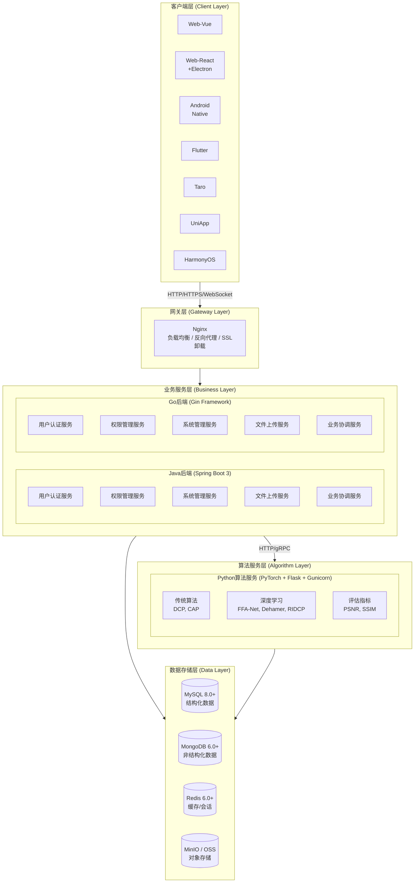
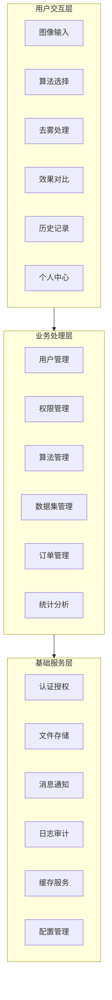
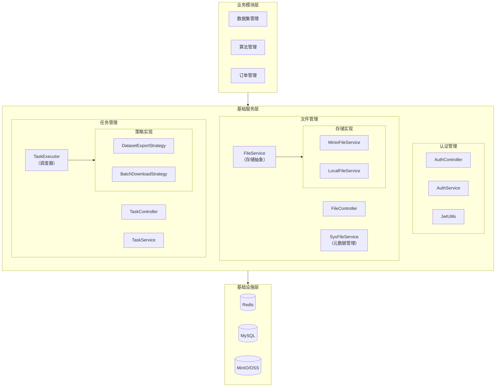
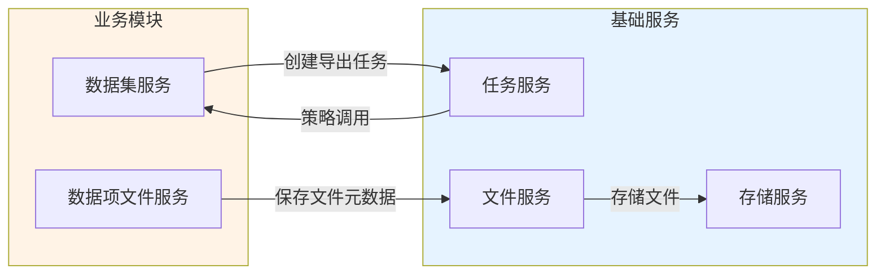

# 图像去雾系统 - 总体架构设计

## 1. 文档概述

### 1.1 文档目的

本文档描述图像去雾系统的整体技术架构，包括系统分层结构、数据流设计、安全策略和扩展性设计等，为系统开发和维护提供技术指导。

### 1.2 适用范围

本文档适用于系统架构师、开发人员及相关技术管理人员，提供统一的技术标准和规范。

### 1.3 架构设计原则

| 原则           | 说明                                                             |
| -------------- | ---------------------------------------------------------------- |
| **分层架构**   | 客户端、网关、业务服务、算法服务、数据存储五层分离，各层职责清晰 |
| **前后端分离** | 前端多端覆盖，后端提供统一 RESTful API                           |
| **微服务化**   | 业务服务与算法服务独立部署，支持独立扩缩容                       |
| **多语言支持** | Java/Go 双后端可选，Python 专职算法服务                          |
| **安全优先**   | JWT + RBAC 权限控制，HTTPS 加密传输                              |

### 1.4 相关文档

| 文档                                            | 说明                             |
| ----------------------------------------------- | -------------------------------- |
| [02-环境与兼容性要求](./02-环境与兼容性要求.md) | 硬件环境、中间件版本、兼容性矩阵 |
| [03-数据库设计](./03-数据库设计.md)             | 表结构、索引、ER 关系图          |
| [04-API 规范](./04-API规范.md)                  | 全局 API 规范、认证方式、错误码  |
| [05-测试架构](./05-测试架构.md)                 | 测试策略、框架选型、质量门禁     |
| [06-部署架构](./06-部署架构.md)                 | 部署模式、环境规划、CI/CD        |
| [07-后端基础设施设计(Go)](./07-后端基础设施设计(Go).md) | Go 后端技术基座、基础设施层设计  |
| [08-后端基础设施设计(Python)](./08-后端基础设施设计(Python).md) | Python 算法服务基础设施层设计 |
| [09-后端基础设施设计(Java)](./09-后端基础设施设计(Java).md) | Java 后端基础设施层设计 |

---

## 2. 整体架构设计

### 2.1 系统架构图



### 2.2 技术架构分层说明

| 层级           | 职责说明                     | 关键技术                     | 详细文档                                   |
| -------------- | ---------------------------- | ---------------------------- | ------------------------------------------ |
| **客户端层**   | 用户界面交互，多平台覆盖     | Vue3/React, TypeScript, Vite | 各前端 README                              |
| **网关层**     | 请求路由、负载均衡、SSL 卸载 | Nginx                        | [部署架构 §3](./06-部署架构.md#3-服务组件) |
| **业务服务层** | 用户认证、权限管理、业务逻辑 | Spring Boot 3 / Gin          | 各后端 README                              |
| **算法服务层** | 深度学习模型推理、图像去雾   | PyTorch, Flask               | `dehaze-python/README.md`                  |
| **数据存储层** | 数据持久化、缓存、文件存储   | MySQL, Redis, MinIO          | [数据库设计](./03-数据库设计.md)           |

### 2.3 业务架构



---

## 3. 分层架构详细设计

### 3.1 前端架构

前端采用组件化架构设计：

| 层次           | 职责                 | 典型目录                |
| -------------- | -------------------- | ----------------------- |
| **页面组件层** | 页面级组件，对应路由 | `views/*.vue`           |
| **业务组件层** | 业务相关可复用组件   | `components/business/*` |
| **基础组件层** | 通用 UI 组件         | `components/common/*`   |
| **状态管理层** | Pinia/Redux 状态管理 | `stores/*.ts`           |
| **API 调用层** | 后端 API 封装        | `api/*.ts`              |
| **工具函数层** | 通用工具函数         | `utils/*.ts`            |

> 📁 目录结构详见各前端项目 README

### 3.2 后端架构

后端采用经典分层架构，遵循 MVC 模式：

| 层次              | 职责                         | 典型类                      |
| ----------------- | ---------------------------- | --------------------------- |
| **Controller 层** | 接收请求、参数校验、返回响应 | `*Controller.java`          |
| **Service 层**    | 业务逻辑处理、事务管理       | `*Service.java`             |
| **Mapper 层**     | 数据库操作、SQL 映射         | `*Mapper.java`              |
| **Model 层**      | Entity 实体、DTO、VO         | `entity/*`, `dto/*`, `vo/*` |

> 📁 目录结构详见各后端项目 README

### 3.3 算法服务架构

算法服务采用微服务架构设计：

| 层次           | 职责                                   |
| -------------- | -------------------------------------- |
| **API 接口层** | Flask 路由、请求解析、响应封装         |
| **算法调度层** | 算法选择、参数配置、任务队列           |
| **模型加载层** | 模型缓存、动态加载、GPU 管理           |
| **图像处理层** | 图像预处理、去雾推理、后处理、质量评估 |
| **结果返回层** | 结果图像存储、指标计算、响应构建       |

> 🔗 支持的去雾算法列表见 `dehaze-python/README.md`

### 3.4 基础服务层架构

基础服务层为业务模块提供通用能力支撑，采用分层解耦设计：



#### 3.4.1 基础服务模块清单

| 模块         | 职责                              | 核心组件                    | 详细文档                                                          |
| ------------ | --------------------------------- | --------------------------- | ----------------------------------------------------------------- |
| **认证管理** | 用户身份认证、Token 管理、验证码  | AuthService, JwtUtils       | [认证管理/后端实现](../03-模块设计/基础模块/认证管理/后端实现.md) |
| **文件管理** | 文件上传/下载、MD5 去重、存储抽象 | FileService, SysFileService | [文件管理/后端实现](../03-模块设计/基础模块/文件管理/后端实现.md) |
| **任务管理** | 异步任务调度、进度跟踪、结果管理  | TaskService, TaskExecutor   | [任务管理/后端实现](../03-模块设计/基础模块/任务管理/后端实现.md) |
| **缓存服务** | Redis 缓存操作封装                | RedisTemplate               | -                                                                 |
| **日志审计** | 操作日志记录                      | LogAspect                   | -                                                                 |

#### 3.4.2 设计原则

| 原则         | 说明                   | 示例                                   |
| ------------ | ---------------------- | -------------------------------------- |
| **单一职责** | 每个服务只负责一类功能 | FileService 只负责存储，不处理业务逻辑 |
| **依赖倒置** | 依赖抽象而非具体实现   | TaskExecutor 依赖 TaskStrategy 接口    |
| **开闭原则** | 扩展开放，修改关闭     | 新增存储后端只需实现 FileService 接口  |
| **事件驱动** | 模块间通过事件解耦     | 文件创建发布事件，统计模块监听更新     |

#### 3.4.3 模块间依赖关系



**依赖规则**：

- ✅ 业务模块 → 基础服务：允许直接依赖
- ✅ 基础服务 → 基础服务：允许（如 SysFileService → FileService）
- ⚠️ 基础服务 → 业务模块：通过策略模式/事件驱动解耦
- ❌ 循环依赖：禁止，使用事件或策略模式打破

---

## 4. 数据流设计

### 4.1 用户请求处理流程

```
┌──────┐    ┌────────┐    ┌───────────┐    ┌───────────┐    ┌──────────┐
│ 用户  │ → │ Nginx  │ → │ Java/Go   │ → │  Python   │ → │  数据存储 │
│      │    │  网关   │    │ 业务服务  │    │ 算法服务  │    │          │
└──────┘    └────────┘    └───────────┘    └───────────┘    └──────────┘
     │           │              │               │               │
     │  HTTPS    │   路由转发    │   HTTP调用    │    读写数据    │
     │  请求     │   负载均衡    │   去雾处理    │               │
     └───────────┴──────────────┴───────────────┴───────────────┘
```

### 4.2 去雾处理完整流程

```
1. 用户上传有雾图像
       ↓
2. 前端发送请求到业务服务
       ↓
3. 业务服务验证用户权限和配额
       ↓
4. 业务服务将图像存储到 MinIO
       ↓
5. 业务服务调用 Python 算法服务
       ↓
6. 算法服务加载指定模型
       ↓
7. 算法服务执行去雾处理
       ↓
8. 算法服务返回去雾结果图像
       ↓
9. 业务服务存储结果并记录日志
       ↓
10. WebSocket 推送处理完成通知
       ↓
11. 前端展示去雾结果
```

### 4.3 数据存储策略

> 🔗 详细表结构和 ER 图见 [数据库设计](./03-数据库设计.md)

| 数据类型         | 存储位置  | 说明                         |
| ---------------- | --------- | ---------------------------- |
| **结构化数据**   | MySQL     | 用户信息、权限配置、订单数据 |
| **非结构化数据** | MongoDB   | 操作日志、处理记录           |
| **缓存数据**     | Redis     | Token、会话信息、热点数据    |
| **文件数据**     | MinIO/OSS | 原始图像、去雾结果、模型文件 |

### 4.4 实时通信机制

系统使用 WebSocket 实现实时通信：

| 场景             | 说明                   |
| ---------------- | ---------------------- |
| **处理进度推送** | 去雾处理进度实时反馈   |
| **结果通知**     | 处理完成/失败通知      |
| **系统消息**     | 维护通知、权限变更通知 |

**技术方案**：SockJS + STOMP 协议，后端 Spring WebSocket + Redis Pub/Sub

---

## 5. 安全架构设计

### 5.1 认证授权机制

| 机制          | 说明                                                   |
| ------------- | ------------------------------------------------------ |
| **JWT Token** | AccessToken (短期) + RefreshToken (长期) 双 Token 机制 |
| **RBAC 权限** | 用户 → 角色 → 权限 三级权限模型                        |
| **权限标识**  | 格式：`模块:功能:操作`，如 `sys:user:add`              |

### 5.2 数据安全

| 安全措施       | 实现方式                             |
| -------------- | ------------------------------------ |
| **传输加密**   | HTTPS/TLS 1.3 加密传输               |
| **存储加密**   | 敏感数据（密码）BCrypt 加密存储      |
| **访问控制**   | 基于角色的数据访问控制（数据权限）   |
| **Token 安全** | 短期 AccessToken + 长期 RefreshToken |

### 5.3 应用安全

| 安全措施       | 说明                              |
| -------------- | --------------------------------- |
| **输入验证**   | 参数校验，防止 SQL 注入、XSS 攻击 |
| **防重复提交** | Token 机制防止表单重复提交        |
| **速率限制**   | 接口限流，防止恶意请求和 DDoS     |
| **日志审计**   | 关键操作记录审计日志              |
| **文件校验**   | 上传文件类型、大小、内容校验      |

---

## 6. 扩展性设计

### 6.1 水平扩展能力

| 扩展维度       | 实现方式                       |
| -------------- | ------------------------------ |
| **服务扩展**   | 无状态服务设计，支持水平扩缩容 |
| **数据库扩展** | 读写分离、分库分表             |
| **缓存扩展**   | Redis Cluster 动态扩容         |
| **存储扩展**   | MinIO 分布式存储               |

### 6.2 算法扩展机制

新增去雾算法只需实现标准接口：

| 方法                     | 说明                           |
| ------------------------ | ------------------------------ |
| `load_model(model_path)` | 加载模型权重文件               |
| `dehaze(image, params)`  | 执行去雾处理，返回结果图像     |
| `get_info()`             | 返回算法名称、版本、特点等信息 |

**扩展流程**：实现标准接口 → 上传模型权重 → 管理后台注册 → 算法服务自动加载

### 6.3 功能扩展

| 扩展能力         | 说明                                    |
| ---------------- | --------------------------------------- |
| **插件化架构**   | 支持功能模块插件化接入                  |
| **API 版本管理** | URL 路径版本控制 `/api/v1/`, `/api/v2/` |
| **多租户支持**   | 支持 SaaS 多租户模式扩展                |

---

## 7. 关键技术决策

### 7.1 双后端可选方案

系统同时提供 Java 和 Go 两套后端实现：

| 方案                   | 优势                     | 适用场景             |
| ---------------------- | ------------------------ | -------------------- |
| **Java (Spring Boot)** | 生态完善、企业级特性丰富 | 传统企业、大型团队   |
| **Go (Gin)**           | 高性能、低资源占用       | 云原生环境、追求性能 |

### 7.2 算法服务独立部署

算法服务使用 Python 独立部署的原因：

- 深度学习生态以 Python 为主（PyTorch、TensorFlow）
- GPU 资源独立管理，不影响业务服务
- 支持算法热更新，业务服务无需重启

### 7.3 前端多端统一方案

| 方案          | 原因                           |
| ------------- | ------------------------------ |
| Vue/React Web | 主流 Web 技术，生态完善        |
| Flutter/RN    | 跨平台移动端，一套代码多端运行 |
| UniApp/Taro   | 小程序生态覆盖                 |

---

## 8. 已知通用问题与改进方向

> 以下为 Java、Go、Python 三端在架构设计层面存在的**通用问题**（不区分语言）。各语言特有问题见 [04-改造计划](../04-改造计划/) 下对应文档。

### 8.1 可观测性体系

| 问题 | 严重级别 | 状态 | 概述 |
|------|----------|------|------|
| **TraceId 全链路追踪缺失** | P0 | 部分解决 | 三端均未接入 OpenTelemetry，无法形成跨 Python↔Java↔Go 的可视化全链路。Java 已实现 `TraceIdFilter` + MDC，Go 已实现 `trace.go` 中间件，但 `task_service.go` 仍有 6 处 `context.Background()` 断裂 TraceId |
| **日志集中化管道未落地** | P1 | 部分解决 | 三端日志均为本地文件输出，缺乏集中检索、告警与审计管道。Java 端 `KafkaLogProducer` 死代码已删除 |
| **多实例/多 Worker 指标聚合** | P1 | 未解决 | Python 端 uvicorn 多 Worker 下 `/metrics` 仅返回局部数据；XXL-Job executor 端口多 Worker 冲突 |

**改进方向**：三端统一接入 OpenTelemetry SDK；实施 Kafka 日志管道（应用日志 → Kafka → ES/对象存储）；配置 `PROMETHEUS_MULTIPROC_DIR` 聚合多 Worker 指标。

### 8.2 安全防护

> CORS 通配符 + 凭据组合问题与监控端点鉴权缺失问题**已解决**：Java `CorsConfig` 改为 `setAllowedOrigins(白名单)`，Go 改为 `CorsByRules()` 严格白名单模式；Java `/actuator/**` 要求 `hasRole("ADMIN")`，Go `/metrics` 要求 `JWTAuth + RequireAdmin`。

### 8.3 缓存与弹性容错

| 问题 | 严重级别 | 状态 | 概述 |
|------|----------|------|------|
| **缓存防护体系落地不完整** | P1 | 部分解决 | Java 已落地 Caffeine L1 + Redis L2 多级缓存（`MultiLevelCacheManager`），Go 已落地 gkit local_cache + Redis + 布隆/SingleFlight/熔断/空值缓存四重防护，Python 已落地 `local_cache.py`（TTLCache + SingleFlight）。**遗留问题**：Java `MultiLevelCache` L2 缓存 null 值时被误统计为 miss 并继续回源，空值缓存防穿透失效；Python `CacheService` 每请求重建导致 L1 失效 |
| **熔断/重试机制错误** | P1 | 部分解决 | Java 自研熔断器（`PythonAlgorithmClient`）无滑动窗口、CLOSED 状态下成功不重置，仍存在根本性计算错误；Go 已实现 `pkg/cache/protection/breaker.go` 熔断器；Python `RedisCircuitBreaker` 死代码已删除，改为 `redis_operation_with_fallback` 降级 |

**改进方向**：Java 修复 `MultiLevelCache` 空值缓存逻辑 + 引入 Resilience4j 替换自研熔断器；Python 将 `CacheService` 改为单例；持续灰度启用 L1 + SingleFlight（低风险）。

### 8.4 异步任务与健康检查

| 问题 | 严重级别 | 状态 | 概述 |
|------|----------|------|------|
| **异步任务可靠性不足** | P0 | 部分解决 | Java MQ 生产者已启用，但消费者为 TODO 桩，`TaskExecutorImpl` 仍走 `@Async` 双路径死代码；Go MQ 框架完整（含 DLX），但 `handler.go` 收到消息后立即标记 FAILED；Python `aio-pika` 已完整实现。**三端均缺乏任务幂等键** |
| **健康检查端点不完整** | P1 | 已解决 | 三端均实现 `/health`（liveness）+ `/ready`（readiness）双端点规范。Java `/ready` 检查 DB/Redis/MQ；Python `/ready` 检查 DB/Redis/RabbitMQ（已知 RabbitMQ 检查逻辑 bug）；Go `/ready` 检查 RabbitMQ Consumer/Publisher |

**改进方向**：任务创建引入客户端幂等键（`Idempotency-Key` 头）；Java 落地 MQ 消费者替换 `@Async` 双路径；Go 实现 `handler.go` 真正执行策略并修复任务 ID 类型不匹配（int64 主键 vs UUID 字符串）；修复 Python `/ready` RabbitMQ 检查 `and/or` 逻辑错误。
