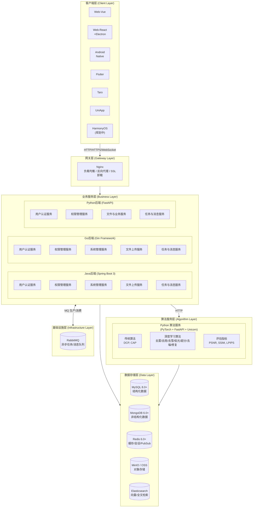
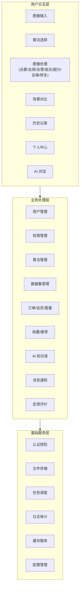
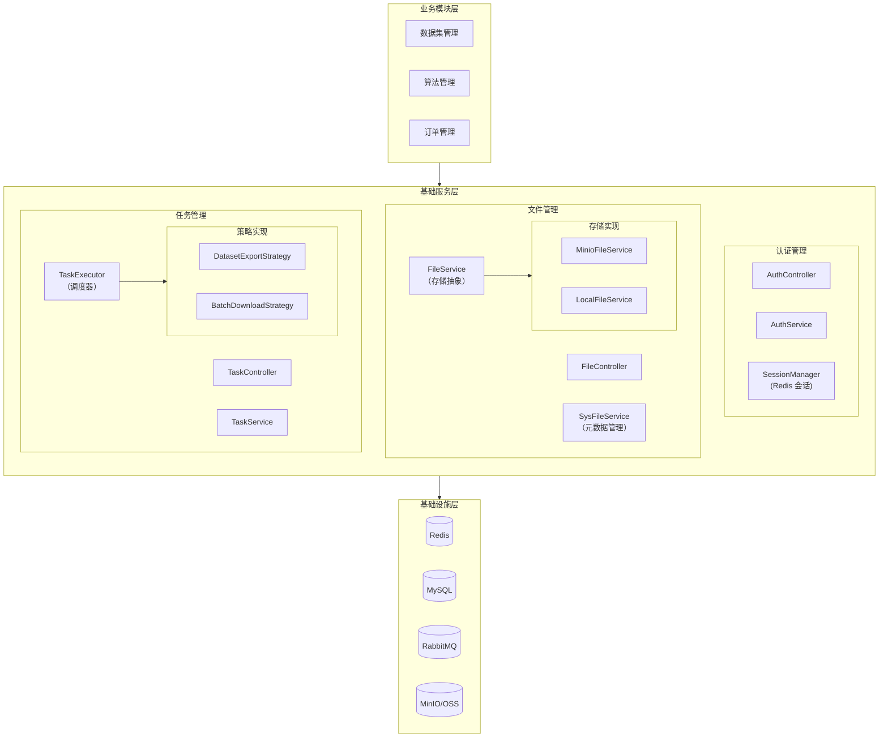
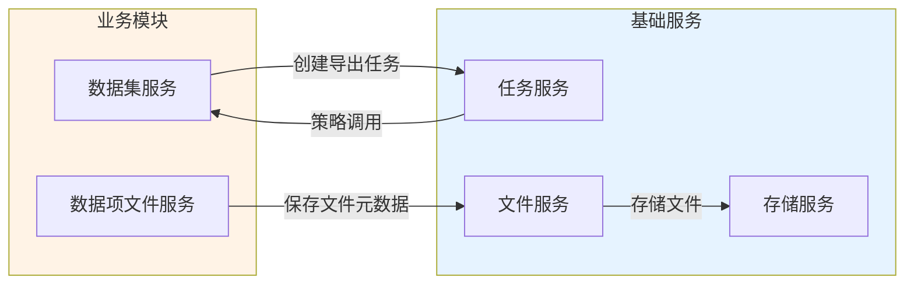
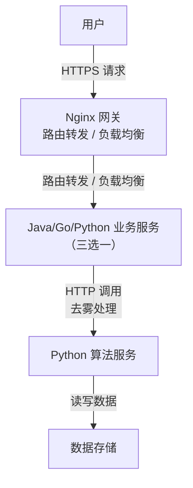

# AI 图像处理平台 - 总体架构设计

## 1. 文档概述

### 1.1 文档目的

本文档描述 AI 图像处理平台的整体技术架构，包括系统分层结构、数据流设计、安全策略和扩展性设计等，为系统开发和维护提供技术指导。平台支持去雾、去雨、去雪、低光增强、超分辨率、去噪、图像修复等多种图像处理任务类型，远期向 AI 工作平台演进。

### 1.2 适用范围

本文档适用于系统架构师、开发人员及相关技术管理人员，提供统一的技术标准和规范。

### 1.3 架构设计原则

| 原则        | 说明                                           |
| --------- | -------------------------------------------- |
| **分层架构**  | 客户端、网关、业务服务、算法服务、数据存储五层分离，各层职责清晰             |
| **前后端分离** | 前端多端覆盖，后端提供统一 RESTful API                    |
| **微服务化**  | 业务服务与算法服务独立部署，支持独立扩缩容                        |
| **多语言支持** | Java/Go/Python 三端后端提供完全一致的 API，Python 兼任算法服务 |
| **安全优先**  | Session + RBAC 权限控制，HTTPS 加密传输               |

## 2. 整体架构设计

### 2.1 系统架构图



### 2.2 技术架构分层说明

| 层级        | 职责说明               | 关键技术                                       | 详细文档                                             |
| --------- | ------------------ | ------------------------------------------ | ------------------------------------------------ |
| **客户端层**  | 用户界面交互，多平台覆盖       | Vue3/React, TypeScript, Vite               | [前端架构文档](../04-项目实现/前端/)（各端一档 + sdk 文档）          |
| **网关层**   | 请求路由、负载均衡、SSL 卸载   | Nginx                                      | [部署架构 §3](./06-部署架构.md#3-服务组件)                   |
| **业务服务层** | 用户认证、权限管理、业务逻辑     | Spring Boot 3 / Gin / FastAPI              | [后端架构文档](../04-项目实现/后端/01-Java架构文档.md)           |
| **算法服务层** | 深度学习模型推理、多任务类型图像处理 | PyTorch, FastAPI                           | [Python架构文档](../04-项目实现/后端/03-Python算法服务架构文档.md) |
| **数据存储层** | 数据持久化、缓存、消息、检索     | MySQL, MongoDB, Redis, MinIO, RabbitMQ, ES | [数据库设计](./03-数据库设计.md)                           |

### 2.3 业务架构



***

## 3. 分层架构详细设计

### 3.1 前端架构

前端采用组件化架构设计：

| 层次          | 职责               | 典型目录                    |
| ----------- | ---------------- | ----------------------- |
| **页面组件层**   | 页面级组件，对应路由       | `views/*.vue`           |
| **业务组件层**   | 业务相关可复用组件        | `components/business/*` |
| **基础组件层**   | 通用 UI 组件         | `components/common/*`   |
| **状态管理层**   | Pinia/Redux 状态管理 | `stores/*.ts`           |
| **API 调用层** | 后端 API 封装        | `api/*.ts`              |
| **工具函数层**   | 通用工具函数           | `utils/*.ts`            |

> 📁 目录结构详见 [前端架构文档](../04-项目实现/前端/)

### 3.2 后端架构

后端采用经典分层架构，三端（Java/Go/Python）提供完全一致的 API 与统一响应格式（见 [API 规范 §9.2](./04-API规范.md)），分层职责对齐：

| 层次        | 职责               | Java                        | Go                | Python            |
| --------- | ---------------- | --------------------------- | ----------------- | ----------------- |
| **接口层**   | 接收请求、参数校验、返回响应   | `*Controller.java`          | `handler/*.go`    | `router/*.py`     |
| **服务层**   | 业务逻辑处理、事务管理      | `*Service.java`             | `service/*.go`    | `service/*.py`    |
| **数据访问层** | 数据库操作、SQL 映射     | `*Mapper.java`              | `repository/*.go` | `repository/*.py` |
| **模型层**   | Entity 实体、DTO、VO | `entity/*`, `dto/*`, `vo/*` | `model/*.go`      | `model/*.py`      |

> 📁 目录结构详见 [后端架构文档](../04-项目实现/后端/)

### 3.3 算法服务架构

算法服务采用微服务架构设计，按任务类型路由分发：

| 层次          | 职责                                      |
| ----------- | --------------------------------------- |
| **API 接口层** | FastAPI 路由、请求解析、响应封装                    |
| **任务路由层**   | 按 `任务类型`（去雾/去雨/去雪/低光/超分/去噪/修复）路由到对应算法集合 |
| **算法调度层**   | 算法选择、参数配置、任务队列                          |
| **模型加载层**   | 模型缓存、动态加载、GPU 管理                        |
| **图像处理层**   | 图像预处理、推理、后处理、质量评估                       |
| **结果返回层**   | 结果图像存储、指标计算、响应构建                        |

### 3.4 基础服务层架构

基础服务层为业务模块提供通用能力支撑，采用分层解耦设计：



#### 3.4.1 基础服务模块清单

| 模块       | 职责                                                   | 核心组件                                 | 详细文档                                        |
| -------- | ---------------------------------------------------- | ------------------------------------ | ------------------------------------------- |
| **认证管理** | 用户身份认证（Session）、验证码、API Key                          | AuthService, SessionManager          | [认证管理/后端实现](../03-模块设计/基础模块/认证管理/后端实现.md)   |
| **文件管理** | 文件上传/下载、MD5 去重、存储抽象                                  | FileService, SysFileService          | [文件管理/后端实现](../03-模块设计/基础模块/文件管理/后端实现.md)   |
| **任务管理** | 异步任务调度、进度跟踪、结果管理                                     | TaskService, TaskExecutor            | [任务管理/后端实现](../03-模块设计/基础模块/任务管理/后端实现.md)   |
| **缓存服务** | 多级缓存（L1 本地缓存 + L2 Redis）、防穿透防护（布隆/SingleFlight/空值缓存） | MultiLevelCacheManager, CacheService | [Java架构文档 §四](../04-项目实现/后端/01-Java架构文档.md) |
| **日志审计** | 登录审计（MongoDB）、业务操作审计（白名单驱动）、日志契约                     | 三端 Logger + 后端接收 API                 | [日志架构设计](./07-日志架构设计.md)                    |
| **AI 模型管理** | 模型供应商配置（API Key 加密/负载均衡/健康容错）、模型注册表（chat/embedding/rerank）与生命周期 | AiProviderService, AiModelService, ProviderHealthService | [AI模型管理/后端实现](../03-模块设计/基础模块/AI模型管理/后端实现.md) |

#### 3.4.2 设计原则

| 原则       | 说明          | 示例                              |
| -------- | ----------- | ------------------------------- |
| **单一职责** | 每个服务只负责一类功能 | FileService 只负责存储，不处理业务逻辑       |
| **依赖倒置** | 依赖抽象而非具体实现  | TaskExecutor 依赖 TaskStrategy 接口 |
| **开闭原则** | 扩展开放，修改关闭   | 新增存储后端只需实现 FileService 接口       |
| **事件驱动** | 模块间通过事件解耦   | 文件创建发布事件，统计模块监听更新               |

#### 3.4.3 模块间依赖关系



**依赖规则**：

- ✅ 业务模块 → 基础服务：允许直接依赖
- ✅ 基础服务 → 基础服务：允许（如 SysFileService → FileService）
- ⚠️ 基础服务 → 业务模块：通过策略模式/事件驱动解耦
- ❌ 循环依赖：禁止，使用事件或策略模式打破

***

## 4. 数据流设计

### 4.1 用户请求处理流程



### 4.2 图像处理完整流程

```
1. 用户上传待处理图像
       ↓
2. 前端发送请求到业务服务
       ↓
3. 业务服务验证用户权限和配额
       ↓
4. 业务服务将图像存储到 MinIO
       ↓
5. 业务服务调用 Python 算法服务
       ↓
6. 算法服务加载指定模型
       ↓
7. 算法服务执行图像处理
       ↓
8. 算法服务返回处理结果图像
       ↓
9. 业务服务存储结果并记录日志
       ↓
10. WebSocket 推送处理完成通知
       ↓
11. 前端展示处理结果
```

### 4.3 数据存储策略

> 🔗 详细表结构和 ER 图见 [数据库设计](./03-数据库设计.md)

| 数据类型      | 存储位置          | 说明                                              |
| --------- | ------------- | ----------------------------------------------- |
| **业务数据**  | MySQL         | 用户信息、权限配置、订单数据、业务任务记录（预测/评估日志）、商业化数据、消息通知       |
| **审计日志**  | MongoDB       | 登录审计日志（login\_log）、业务操作审计日志（audit\_log，含变更前后快照） |
| **缓存与会话** | Redis         | 业务缓存、Session 存储、分布式锁、限流计数器、Pub/Sub 消息中继         |
| **消息与任务** | RabbitMQ      | 异步任务生产消费、死信重试、消息通知分发                            |
| **向量与检索** | Elasticsearch | 知识库向量索引（`kb_chunks_{id}`）、RAG 检索                |
| **文件数据**  | MinIO/OSS     | 原始图像、去雾结果、模型文件                                  |

**存储分层原则**：
是否需要和业务表做 JOIN 查询？

- 需要 → MySQL
- 不需要，且为只追加审计 → MongoDB；
- 需要向量/全文检索 → Elasticsearch；
- 纯内存临时数据 → Redis；
- 文件二进制 → MinIO；
- 异步解耦 → RabbitMQ。

### 4.4 实时通信机制

系统使用 WebSocket 实现实时消息推送，由 **消息通知模块** 统一承载：

| 场景         | 说明           |
| ---------- | ------------ |
| **处理进度推送** | 异步任务处理进度实时反馈 |
| **结果通知**   | 处理完成/失败通知    |
| **系统消息**   | 维护通知、权限变更通知  |

**技术方案**：Java 端使用 STOMP/SockJS + Redis Pub/Sub，Python/Go 端使用原生 WebSocket，三端消息格式一致（`new_message` 事件）；WebSocket 用于在线用户实时 UI 更新，外部渠道（APP 推送/邮件/短信）由推送分发器异步执行。详见 [消息通知/后端实现 §7](../03-模块设计/基础模块/消息通知/后端实现.md)

***

## 5. 安全架构设计

### 5.1 认证授权机制

| 机制             | 说明                                          |
| -------------- | ------------------------------------------- |
| **Session 认证** | Redis 存储会话状态，客户端通过 `X-Session-Id` Cookie 传递 |
| **RBAC 权限**    | 用户 → 角色 → 权限 三级权限模型                         |
| **权限标识**       | 格式：`模块:功能:操作`，如 `sys:user:add`              |

### 5.2 数据安全

| 安全措施         | 实现方式                                     |
| ------------ | ---------------------------------------- |
| **传输加密**     | HTTPS/TLS 1.3 加密传输                       |
| **存储加密**     | 敏感数据（密码）BCrypt 加密存储                      |
| **访问控制**     | 基于角色的数据访问控制（数据权限）                        |
| **行级数据权限**   | 基于角色 `data_scope` 的行级过滤，三端实现一致（见下表）       |
| **Token 安全** | Session 由 Redis 管理，TTL 7 天，剩余 < 24h 自动续期 |

#### 行级数据权限（DataScope）

基于角色 `data_scope` 字段实现行级数据可见性控制，三端 API 契约一致、过滤语义一致，实现方式因 ORM 差异各不相同：

| 端 | 实现方式 | 生效位置 |
|----|---------|---------|
| Java | MyBatis-Plus `DataPermissionInterceptor` + `@DataPermission` 注解 | Mapper 查询自动追加条件 |
| Go | GORM Plugin `dataScopeCallback`（`Before("gorm:query")`/`Before("gorm:row")`） | Repository 查询自动过滤 |
| Python | 显式调用 `apply_data_scope(stmt, user, db, dept_field, creator_field)` | Repository 查询显式过滤 |

**data_scope 取值**（`sys_role.data_scope`）：

| 取值 | 含义 | 过滤条件 |
|:----:|------|---------|
| `NULL` / `0` | 全部数据 | 不过滤（ROOT 用户始终跳过） |
| `1` | 部门及子部门 | `dept_field IN (本部门及子部门ID)` |
| `2` | 本部门 | `dept_field == user.dept_id` |
| `3` | 本人 | `creator_field == user.id` |

> Python 端因异步 ORM 下 ContextVar 在 event 回调中不可靠，采用显式过滤而非自动 SQL 改写；需数据权限的 Repository 查询方法新增 `current_user` 参数，由 Service 层透传。详见 [Python 后端架构文档 §5.1](../04-项目实现/后端/03-Python算法服务架构文档.md#51-行级数据权限datascope)。

### 5.3 应用安全

| 安全措施      | 说明                    |
| --------- | --------------------- |
| **输入验证**  | 参数校验，防止 SQL 注入、XSS 攻击 |
| **防重复提交** | Token 机制防止表单重复提交      |
| **速率限制**  | 接口限流，防止恶意请求和 DDoS     |
| **日志审计**  | 关键操作记录审计日志            |
| **文件校验**  | 上传文件类型、大小、内容校验        |

***

## 6. 扩展性设计

### 6.1 水平扩展能力

| 扩展维度      | 实现方式               |
| --------- | ------------------ |
| **服务扩展**  | 无状态服务设计，支持水平扩缩容    |
| **数据库扩展** | 读写分离、分库分表          |
| **缓存扩展**  | Redis Cluster 动态扩容 |
| **存储扩展**  | MinIO 分布式存储        |

### 6.2 算法扩展机制

新增图像处理算法只需在 `algorithm/<name>/run.py` 中实现统一入口函数并声明任务类型：

| 函数签名                             | 说明                            |
| -------------------------------- | ----------------------------- |
| `dehaze(haze_image, model_path)` | 执行图像处理，接收图像字节流与模型路径，返回处理结果字节流 |

**扩展流程**：新建 `algorithm/<name>/run.py`（实现 `dehaze` 函数）→ 上传模型权重 → 管理后台注册算法（声明 `task_type`）→ 算法服务按任务类型自动路由加载

**任务类型**：`dehaze`（去雾）/ `derain`（去雨）/ `desnow`（去雪）/ `lowlight`（低光增强）/ `super_resolution`（超分辨率）/ `denoise`（去噪）/ `inpaint`（图像修复）

> 算法目录维持平铺结构（`algorithm/<name>/run.py`），与 [§3.3 算法服务架构](#33-算法服务架构) 一致；模型统一由 `model_loader.py` 加载，接口规范详见 `dehaze-python/algorithm/` 实现。

### 6.3 功能扩展

| 扩展能力         | 说明                                                         |
| ------------ | ---------------------------------------------------------- |
| **插件化架构**    | 支持功能模块插件化接入                                                |
| **API 版本管理** | URL 路径版本控制 `/api/v1/`, `/api/v2/`                          |
| **多租户支持**    | SaaS 多租户模式扩展（**规划中**，见 [产品拓展升级规划](../05-改造计划/产品拓展升级规划.md)） |

***

## 7. 关键技术决策

### 7.1 三后端统一方案

系统提供 Java、Go、Python 三套后端实现，**API 契约完全一致**（Java 为 spec 唯一权威来源，Go/Python 对齐），可按部署环境选择其一承载业务：

| 方案                     | 优势               | 适用场景         |
| ---------------------- | ---------------- | ------------ |
| **Java (Spring Boot)** | 生态完善、企业级特性丰富     | 传统企业、大型团队    |
| **Go (Gin)**           | 高性能、低资源占用        | 云原生环境、追求性能   |
| **Python (FastAPI)**   | 与算法服务同语言栈，兼任算法服务 | 算法密集、AI 业务为主 |

> 三端 API 契约与统一响应格式见 [API 规范 §9.2](./04-API规范.md)。

### 7.2 算法服务独立部署

算法服务使用 Python 独立部署的原因：

- 深度学习生态以 Python 为主（PyTorch、TensorFlow）
- GPU 资源独立管理，不影响业务服务
- 支持算法热更新，业务服务无需重启

### 7.3 前端多端统一方案

| 方案            | 原因              |
| ------------- | --------------- |
| Vue/React Web | 主流 Web 技术，生态完善  |
| Flutter/RN    | 跨平台移动端，一套代码多端运行 |
| UniApp/Taro   | 小程序生态覆盖         |

***

## 8. 已知通用问题与改进方向

> 以下为 Java、Go、Python 三端在架构设计层面存在的**通用问题**（不区分语言）。整体改造规划见 [产品拓展升级规划](../05-改造计划/产品拓展升级规划.md)。

### 8.1 可观测性体系

| 问题                    | 严重级别 | 状态   | 概述                                                                                                                       |
| --------------------- | ---- | ---- | ------------------------------------------------------------------------------------------------------------------------ |
| **TraceId 全链路追踪缺失**   | P0   | 部分解决 | 三端均未接入 OpenTelemetry，无法形成跨 Python↔Java↔Go 的可视化全链路。Java（`TraceIdFilter` + MDC）与 Go（trace 中间件）已实现请求级透传，异步任务链路仍有断裂（见各端架构文档） |
| **日志集中化管道未落地**        | P1   | 部分解决 | 三端日志均为本地文件输出，缺乏集中检索、告警与审计管道（日志契约见 [07-日志架构设计](./07-日志架构设计.md)）                                                           |
| **多实例/多 Worker 指标聚合** | P1   | 未解决  | Python 端 uvicorn 多 Worker 下 `/metrics` 仅返回局部数据                                                                           |

**改进方向**：三端统一接入 OpenTelemetry SDK；实施 Kafka 日志管道（应用日志 → Kafka → ES/对象存储）；配置 `PROMETHEUS_MULTIPROC_DIR` 聚合多 Worker 指标。具体代码级技术债明细见 [Java架构文档](../04-项目实现/后端/01-Java架构文档.md)、[Go架构文档](../04-项目实现/后端/02-Go架构文档.md)、[Python架构文档](../04-项目实现/后端/03-Python算法服务架构文档.md)。

### 8.2 安全防护

### 8.3 缓存与弹性容错

| 问题              | 严重级别 | 状态   | 概述                                                                                                                  |
| --------------- | ---- | ---- | ------------------------------------------------------------------------------------------------------------------- |
| **缓存防护体系落地不完整** | P1   | 部分解决 | 三端均已落地多级缓存（本地 L1 + Redis L2）与防穿透防护（布隆/SingleFlight/空值缓存）；遗留问题：Java L2 空值缓存防穿透失效、Python `CacheService` 每请求重建导致 L1 失效 |
| **熔断/重试机制错误**   | P1   | 部分解决 | Java 自研熔断器仍存在计算缺陷（无滑动窗口），Go 已落地标准熔断器，Python 已删除死代码并改为降级兜底                                                           |

**改进方向**：Java 修复空值缓存逻辑并引入 Resilience4j 替换自研熔断器；Python 将 `CacheService` 改为单例；持续灰度启用 L1 + SingleFlight。具体技术债明细见 [Java架构文档 §四](../04-项目实现/后端/01-Java架构文档.md)。

### 8.4 异步任务与健康检查

| 问题            | 严重级别 | 状态  | 概述                                                                                                                                                                                                                   |
| ------------- | ---- | --- | -------------------------------------------------------------------------------------------------------------------------------------------------------------------------------------------------------------------- |
| **异步任务可靠性不足** | P0   | 已解决 | 三端 MQ 消费者均已落地，统一使用 `dehaze.tasks` 主交换机 + `dehaze.tasks.dlx` 独立死信交换机架构。队列命名、路由键、TTL（24h）、TTL 分级延迟重试（5s/30s/5min × 3 次）三端完全一致。消息处理失败按 `x-retry-count` header 投递到 `{queue}.retry.{0-2}` 重试队列，TTL 过期后自动路由回主队列，重试耗尽入死信队列。 |
| **健康检查端点不完整** | P1   | 已解决 | 三端均实现 `/health`（liveness）+ `/ready`（readiness）双端点规范。`/ready` 按"启用才检查"原则探测各自依赖的全部基础设施，任一必选组件不可用返回 503 并列出各组件状态：Python 检查 DB/Redis/RabbitMQ/ES/MongoDB/MinIO/本地 LLM（`LOCAL_LLM_ENABLED` 开关，未就绪自动拉起子进程），并附带只读 ASR/TTS 引擎状态（`voice_asr`/`voice_tts`，进程内懒加载引擎，不阻断就绪）；Go/Java 检查 DB/Redis/RabbitMQ/MongoDB/MinIO（二者不使用 ES）；MinIO 仅当默认存储类型为 minio 时检查 |

**MQ 统一拓扑**：三端共享 `dehaze.tasks` 主交换机 + `dehaze.tasks.dlx` 独立死信交换机，队列命名/路由键/TTL（24h）/分级延迟重试（5s/30s/5min × 3）三端完全一致，任一端启动声明相同参数，不产生 PRECONDITION 冲突。完整队列与路由键定义见 [Java架构文档](../04-项目实现/后端/01-Java架构文档.md)、[Go架构文档](../04-项目实现/后端/02-Go架构文档.md)、[Python架构文档](../04-项目实现/后端/03-Python算法服务架构文档.md)。
