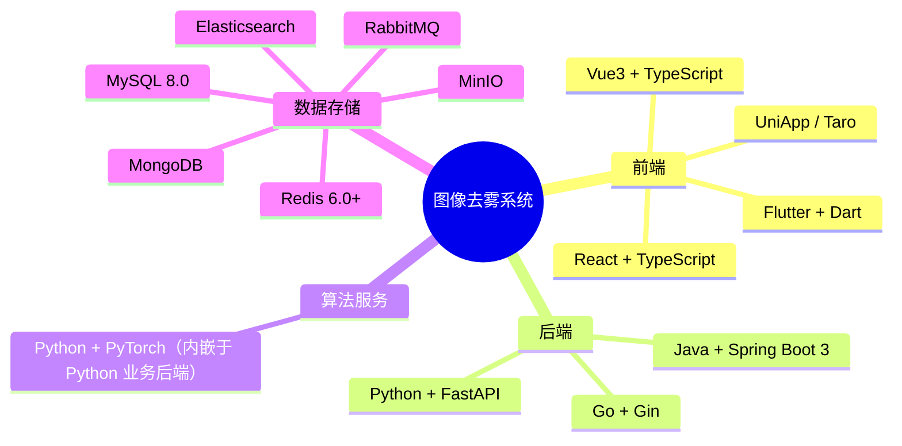

# 图像去雾系统 - 环境与兼容性要求

## 1. 文档概述

### 1.1 文档目的

本文档定义图像去雾系统的运行环境要求、中间件版本约束和客户端兼容性矩阵，为部署运维和质量保障提供参考。

### 1.2 适用范围

本文档适用于运维人员、QA 测试人员和需要搭建开发/生产环境的技术人员。

### 1.3 技术栈详情

各端详细技术栈、依赖版本请参考：

| 端 | 参考位置 |
|---|---------|
| **Vue 前端** | `dehaze-front-vue/package.json` + `README.md` |
| **React 前端** | `dehaze-front-react/package.json` + `README.md` |
| **Java 后端** | `dehaze-java/pom.xml` + `README.md` |
| **Go 后端** | `dehaze-go/go.mod` + `README.md` |
| **Python 业务后端** | `dehaze-python/requirements.txt` + `README.md`（含算法服务） |

---

## 2. 技术栈全景

---

## 3. 硬件环境要求

### 3.1 开发环境

| 组件 | 最低配置 | 推荐配置 |
|-----|---------|---------|
| CPU | 4 核 | 8 核+ |
| 内存 | 8 GB | 16 GB+ |
| 存储 | 100 GB SSD | 256 GB SSD |
| GPU | - | NVIDIA GPU（开发算法时） |

### 3.2 算法服务生产环境

| 项目 | 要求 |
|-----|------|
| **操作系统** | Ubuntu 18.04+ / Windows 10+ / CentOS 7+ |
| **CPU** | 8 核+ |
| **内存** | ≥ 16 GB（推荐 32 GB） |
| **GPU** | NVIDIA GPU，显存 ≥ 8 GB（推荐 16 GB+） |
| **GPU Driver** | 450+ |
| **CUDA** | 10.1+ / 11.x / 12.x |

### 3.3 业务服务生产环境

| 服务类型 | CPU | 内存 | 存储 |
|---------|-----|------|------|
| **业务服务** | 4 核+ | 8 GB+ | 50 GB SSD |
| **数据库服务** | 4 核+ | 8 GB+ | 200 GB SSD |
| **Redis 服务** | 2 核+ | 4 GB+ | 20 GB SSD |
| **MinIO 存储** | 2 核+ | 4 GB+ | 500 GB+ |

---

## 4. 中间件版本

### 4.1 数据库

| 中间件 | 版本要求 | 说明 |
|-------|---------|------|
| MySQL | 8.0+ | 主数据库 |
| MongoDB | 6.0+ | 文档数据库 |
| Redis | 6.0+ | 缓存/消息 |

### 4.2 存储与网关

| 中间件 | 版本要求 | 说明 |
|-------|---------|------|
| MinIO | 最新 | 对象存储 |
| Nginx | 1.20+ | 反向代理/负载均衡 |

### 4.3 容器化

| 中间件 | 版本要求 | 说明 |
|-------|---------|------|
| Docker | 20.10+ | 容器运行时 |
| Docker Compose | 2.x | 容器编排 |
| Kubernetes | 1.24+ | 集群编排（可选） |

---

## 5. 版本兼容性矩阵

### 5.1 前端兼容性

| 浏览器 | 最低版本 | 说明 |
|-------|---------|------|
| Chrome | 90+ | 推荐 |
| Firefox | 88+ | 支持 |
| Safari | 14+ | 支持 |
| Edge | 90+ | 支持 |

### 5.2 移动端兼容性

| 平台 | 最低版本 |
|-----|---------|
| Android | 7.0 (API 24) |
| iOS | 12.0 |
| HarmonyOS | 3.0 |

### 5.3 Node.js 兼容性

| 项目 | Node.js 版本 |
|-----|-------------|
| dehaze-front-vue | ≥ 18.0.0 |
| dehaze-front-react | ≥ 18.0.0 |
| dehaze-taro | ≥ 16.0.0 |

### 5.4 运行时版本

| 运行时 | 版本要求 |
|-------|---------|
| JDK | 17+ |
| Go | 1.20+ |
| Python | 3.8 - 3.11（推荐 3.10） |
