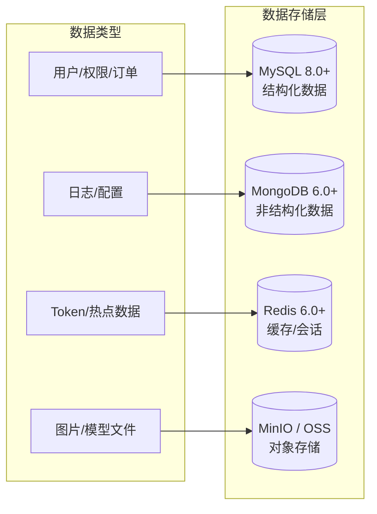
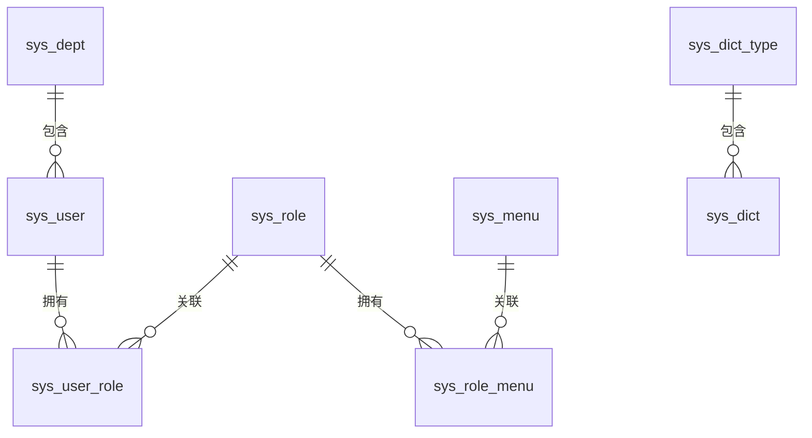
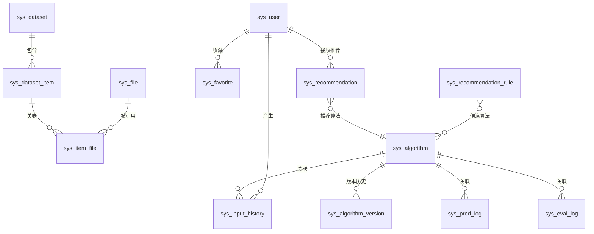
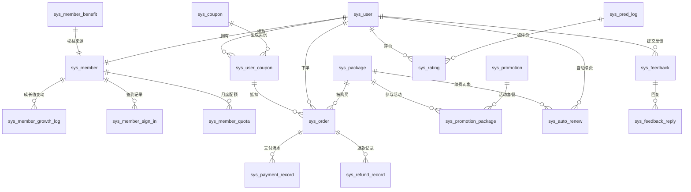
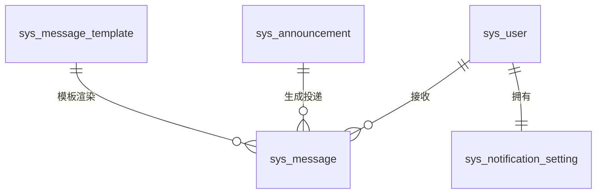

# 图像去雾系统 - 数据库设计

## 1. 文档概述

### 1.1 文档目的

本文档描述图像去雾系统的数据库设计，包括数据库选型、ER 关系模型、各模块的关键设计决策和数据存储规范。**表结构、字段定义、索引的权威定义以 `config/sql/schema/` 目录下的各 SQL 文件为准**，每个 SQL 文件头部以注释形式记录该表的设计思路。本文档不重复 DDL 细节。

### 1.2 适用范围

本文档适用于后端开发人员、DBA 及相关技术管理人员。

### 1.3 SQL 文件位置

数据库脚本存放在项目根目录 `config/sql/` 下，三个后端（dehaze-java / dehaze-go / dehaze-python）共享同一套 schema。文件组织如下：

```
config/sql/
├── schema/                    # 按表名拆分的建表语句
│   ├── sys_user.sql           # 用户表（文件头部含设计思路注释）
│   ├── sys_role.sql           # 角色表
│   ├── ...                    # 其他表，文件名即表名
├── data/                      # 按表名拆分的初始化数据
│   ├── sys_user.sql           # 用户初始数据
│   ├── sys_menu.sql           # 菜单初始数据
│   ├── ...                    # 其他表，文件名与 schema 对应
└── load-data.sh               # Docker 初始化辅助脚本
```

- `schema/` 目录按表名拆分，每个 `.sql` 文件对应一张表，文件头部以注释形式记录该表的设计思路、关键字段语义和枚举值。修改表结构时只需编辑对应文件。
- `data/` 目录同样按表名拆分，每个 `.sql` 文件存放对应表的 `INSERT` 初始化数据（菜单、角色、字典、部门等），文件名与 `schema/` 一一对应。
- `load-data.sh` 是 Docker 初始化辅助脚本，在所有 schema 建表完成后按序执行 `data/` 下的数据文件。

> **Docker 初始化**：MySQL 容器通过 `MYSQL_DATABASE=dehaze` 自动建库，`schema/` 目录挂载到 `docker-entrypoint-initdb.d/` 按文件名排序先执行建表，`load-data.sh` 脚本（命名前缀 `zz_` 保证排在最后）随后执行 `data/` 目录下所有数据文件。
>
> **测试复用**：dehaze-java 测试通过 Maven `maven-resources-plugin` 自动从 `config/sql/` 复制 `schema/` 和 `data/` 目录到测试 classpath，`application-test.yml` 以 `classpath:db/schema/*.sql` 和 `classpath:db/data/*.sql` 通配符加载，无需维护测试副本。详见 `dehaze-java/src/test/resources/db/README.md`。

---

## 2. 数据库选型

### 2.1 多数据库架构

系统采用多种数据库技术来满足不同的数据存储需求：



### 2.2 数据库职责划分

| 数据库 | 版本 | 用途 | 存储内容 |
|-------|------|------|---------|
| **MySQL** | 8.0+ | 业务数据库 | 用户、角色、菜单、部门、字典、数据集、算法模型、文件元数据、业务任务记录（预测/评估日志）、商业化数据（会员/订单/套餐）、消息通知 |
| **MongoDB** | 6.0+ | 审计日志数据库 | 登录审计日志（login_log）、业务操作审计日志（audit_log，含变更前后快照） |
| **Redis** | 6.0+ | 缓存与会话数据库 | 业务缓存、Session 存储、分布式锁、限流计数器、Pub/Sub 消息中继 |
| **MinIO/OSS** | - | 对象存储 | 图片文件、算法模型权重文件、导出文件 |

> **存储分层原则**：是否需要和业务表做 JOIN 查询？需要 → MySQL；不需要 → MongoDB。
> - `sys_pred_log`/`sys_eval_log` 需要与 `sys_rating`、`sys_algorithm` JOIN → MySQL
> - `login_log`/`audit_log` 独立查阅无 JOIN 需求 → MongoDB

---

## 3. ER 关系图

> 以下 ER 图仅展示表名与关系连线，各表字段定义详见 `config/sql/schema/` 目录下对应表名的 `.sql` 文件。

### 3.1 系统管理模块 ER 图



### 3.2 业务模块 ER 图



### 3.3 商业化模块 ER 图



### 3.4 消息通知模块 ER 图



---

## 4. 顶层设计思路

### 4.1 系统管理模块

系统管理模块采用经典 RBAC（基于角色的访问控制）模型，通过 `sys_user`、`sys_role`、`sys_menu` 三张主表以及 `sys_user_role`、`sys_role_menu` 两张多对多关联表实现权限分配。用户与角色、角色与菜单均为多对多关系，支持一个用户拥有多个角色、一个角色配置多个菜单/权限。

部门（`sys_dept`）和菜单（`sys_menu`）均采用树形结构，通过 `parent_id` 和 `tree_path` 字段实现层级关系，`tree_path` 存储父节点 ID 路径以加速子树查询。角色的 `data_scope` 字段控制数据权限范围，支持全部数据、部门及子部门、本部门、本人四种粒度，由后端在查询时动态拼接数据权限条件。

字典（`sys_dict_type` / `sys_dict`）采用类型-数据项两级结构，通过 `type_code` 关联，用于集中管理系统中可枚举的配置项（如算法类型、任务状态等），避免在代码中硬编码。

### 4.2 业务模块

业务模块围绕数据集、算法模型、文件三个核心实体展开。数据集（`sys_dataset`）支持树形嵌套组织，其下挂载数据项（`sys_dataset_item`），数据项再通过 `sys_item_file` 与文件表（`sys_file`）多对多关联。`sys_item_file` 同时承载图片类型（hazy/clear/trans/depth/segment）和场景标注（雾霾程度等）元数据，使一条数据项可同时关联雾图与清晰图（GT）。

算法模型（`sys_algorithm`）同样采用树形结构实现算法分类，其 `status` 字段（`tinyint`）定义了 6 种生命周期状态（`1=草稿`/`2=测试中`/`3=待审核`/`4=已发布`/`5=已停用`/`6=已归档`），与其他表的启用/禁用二值状态含义不同，支撑完整的算法发布审核流程。每次算法发布新版本时，将配置快照写入 `sys_algorithm_version` 版本历史表，通过 `is_active` 标记当前活跃版本，配置快照使用原生 `json` 类型存储在 `config_json` 字段，支持版本回滚。`recommend_score`（`decimal(3,2)`）字段由推荐管理模块基于用户评分、处理成功率、推荐采纳率综合计算并回写（0-5 分），作为推荐排序权重因子之一，新算法默认 3.5 分（冷启动策略）。

文件表（`sys_file`）通过 MD5 唯一索引实现去重，相同内容文件只存储一份。`sys_file` 只存与环境无关的稳定标识——`object_name`（对象键）与 `storage`（存储后端标识：`minio`/`local`/`nginx-static`），完整访问 URL 永远运行时拼接（`storage.baseUrl + object_name`），不落库；已删除历史的环境相关 `url` 字段与语义重叠的 `path` 字段。nginx 直服的数据集静态文件通过 `storage=nginx-static` 纳入统一存储抽象，与托管文件同构登记。图像输入历史（`sys_input_history`）记录用户去雾操作，为避免频繁 join 冗余存储了算法名称。`is_favorite` 字段已移除，收藏状态统一由收藏管理模块的 `sys_favorite` 表（`target_type='result'`）管理，历史列表的收藏筛选通过 JOIN `sys_favorite` 表实现。

### 4.2.1 收藏管理模块

收藏管理模块通过统一的 `sys_favorite` 表为所有可收藏对象提供通用收藏能力，替代旧的 `sys_algorithm_favorite` 表。详见 [收藏管理/需求规格.md](../03-模块设计/基础模块/收藏管理/需求规格.md) 和 [收藏管理/后端实现.md](../03-模块设计/基础模块/收藏管理/后端实现.md)。

**`sys_favorite` 表设计**：

- `target_type`（`varchar(32)`）+ `target_id`（`bigint`）实现多态收藏，当前支持 `algorithm`（算法）、`result`（处理结果）、`dataset`（数据集），预留 `image`（图片）、`preset`（参数方案）。
- `uk_user_target`（`user_id, target_type, target_id`）唯一索引防止同一用户重复收藏同一对象，同时支撑收藏状态批量查询。
- `idx_user_type_time`（`user_id, target_type, create_time DESC`）复合索引优化「按类型筛选 + 时间倒序」的收藏列表分页查询。
- `is_invalid`（`tinyint`）标识收藏对象是否已失效：当对象被逻辑删除时置 1，收藏列表中可标记「已失效」并支持一键清理。
- 收藏记录使用逻辑删除；取消后再次收藏时通过 upsert 复活原软删行（`uk_user_target` 不含 `deleted`，见 §5.3.1 类别①），不插入新行，原 id 保持不变。

**迁移关系**：

| 旧方案 | 新方案 | 迁移策略 |
|--------|--------|---------|
| `sys_algorithm_favorite` 表 | `sys_favorite` 表（`target_type='algorithm'`） | 旧表已废弃删除，存量数据迁移到新表（`target_id` 取原 `algorithm_id`） |
| `sys_input_history.is_favorite` 字段 | `sys_favorite` 表（`target_type='result'`） | 字段及 `idx_user_favorite` 索引已删除，收藏状态统一由 `sys_favorite` 表管理。历史列表的收藏筛选通过 JOIN `sys_favorite` 表实现，避免数据冗余 |

### 4.2.2 推荐管理模块

推荐管理模块根据图像特征和用户偏好推荐最合适的去雾算法，当前阶段采用规则匹配引擎。详见 [推荐管理/需求规格.md](../03-模块设计/基础模块/推荐管理/需求规格.md) 和 [推荐管理/后端实现.md](../03-模块设计/基础模块/推荐管理/后端实现.md)。

**`sys_recommendation` 表（推荐记录）**：

- `image_md5`（`char(32)`）关联图像特征分析缓存（`recommend:feature:{imageMd5}`），相同图片复用分析结果避免重复计算。
- `target_type`（`varchar(32)`）标识推荐对象类型，当前为 `algorithm`，预留 `preset`/`dataset`/`enhance`。
- `top_algorithms`（`json`）存储推荐算法列表（Top 3：算法 ID 及匹配度），避免拆子表。
- `analysis_result`（`json`）存储图像特征分析向量（7 维：雾霾浓度/场景类型/光照条件/复杂度/颜色分布/分辨率/噪声）。
- `feedback`（`tinyint`）记录用户对推荐结果的整体反馈（`0=未反馈`/`1=有用`/`2=无用`），用于推荐效果度量。
- `adopted_algorithm_id`（`bigint`，`null` 表示未采纳）记录用户最终采纳的算法 ID，关联推荐采纳率统计。
- 推荐记录为只追加，**不使用逻辑删除**；过期数据通过定时任务物理清理。

**`sys_recommendation_rule` 表（推荐规则配置）**：

- `scene_type`（`varchar(32)`）标识场景类型（`urban`/`landscape`/`night`/`backlight`/`indoor` 等）。
- `algorithm_ids`（`json` 数组）存储该场景下的候选算法 ID 列表，避免拆关联表。
- `weight`（`int`）控制规则优先级，数值越大越优先匹配。
- `enabled`（`tinyint`）控制规则启停，便于灰度发布和 A/B 测试。
- 推荐规则使用逻辑删除，保留历史配置可追溯。

### 4.3 业务任务记录模块

业务任务记录模块包含预测日志（`sys_pred_log`）和评估日志（`sys_eval_log`），分别记录算法推理与评估操作的完整任务记录。**这两张表是业务任务记录而非"日志"，存储在 MySQL 中**，因为它们有状态机、外键关联、索引查询和分页 API。

两张表均通过 `algorithm_id` + 原图/预测图 MD5 实现缓存查询：相同算法处理相同图片可直接返回历史结果，避免重复计算。

为配合 Python 后端的异步处理，两张日志表均引入 `status` 字段（`tinyint`，`1=处理中`/`2=已完成`/`3=失败`）追踪异步任务状态，`error_message` 字段在失败时填充错误信息。基于 `status` 索引可扫描僵尸任务并触发恢复。评估日志的 `result` 字段使用原生 `json` 类型存储 PSNR/SSIM/LPIPS/NIQE/熵等评估指标。日志表为只追加记录，**不使用逻辑删除**。

### 4.4 审计日志模块（MongoDB）

审计日志模块采用 MongoDB 存储，与业务数据库 MySQL 分离，遵循"只追加、无 JOIN、schema 可演化"原则。包含两个 collections：

**login_log（登录审计）**：记录用户登录成功/失败信息，用于安全审计和账号保护。字段包括 user_id、username、ip、location、browser、os、status（1:成功;0:失败）、message、create_time。索引：`{userId:1, createTime:-1}`、`{createTime:-1}`、`{status:1}`。三端在 AuthService 中异步写入，登录日志写入失败不影响登录主流程。

**audit_log（业务操作审计）**：记录关键业务写操作，白名单驱动，仅审计会员/订单/数据集/角色/用户的核心写操作（共 14 个 Service 方法）。字段包括 operator_id、target_type、target_id、action、module、before_value（变更前快照）、after_value（变更后快照）、ip、user_agent、create_time。索引：`{operatorId:1, createTime:-1}`、`{targetType:1, targetId:1, createTime:-1}`、`{module:1, createTime:-1}`。before_value/after_value 是 JSON 快照，不同业务模块的快照结构不同——schema-free 正是 MongoDB 的典型场景。

> **审计白名单**（14 个核心 Service 方法）：
> - 会员：`adjustLevel` / `adjustGrowth` / `deductQuota` / `updateStatus`
> - 订单：`create` / `cancel` / `applyRefund` / `approveRefund` / `rejectRefund`
> - 数据集：`batchDeleteDatasets` / `batchDeleteDatasetItemsCascadeWithResult`
> - 角色：`assignMenusToRole` / `updateRoleStatus` / `deleteRoles`
> - 用户：`updatePassword` / `deleteUsers`

异步任务调度通过 `sys_task` 表配合 RabbitMQ 实现生产消费分离。该表统一承载所有模块的导入导出任务，通过 `task_type` 区分模块和操作类型。`task_id`（UUID）和 `idempotency_key`（客户端幂等键）均为唯一索引，保证任务可查询且幂等。`status`（`tinyint`）使用 5 状态机：`1=待处理`/`2=处理中`/`3=已完成`/`4=失败`/`5=已取消`，并通过 `started_at`/`completed_at`/`expires_at` 管理任务生命周期。任务参数与结果分别使用原生 `json` 类型存储在 `params` 和 `result` 字段：`result` 存储导出文件的**对象键**（`object_name`），下载 URL 由响应层运行时拼接（`storage.baseUrl + object_name`），不落库，环境迁移零改动。任务表为只追加记录，**不使用逻辑删除**。

### 4.5 扩展模块

扩展模块包含 WPX 文件映射表（`sys_wpx_file`）和 API 密钥表（`sys_api_key`）。`sys_wpx_file` 记录原始文件与 WPX 格式新文件的对应关系，通过 `origin_md5` 和 `new_md5` 双唯一约束保证文件映射唯一性。文件映射为只追加记录，**不使用逻辑删除**。

API 密钥表支持用户创建长期鉴权密钥，三端（Java/Go/Python）共享此表。出于安全考虑，密钥明文仅在创建时返回一次，数据库存储 SHA-256 哈希值（`key_hash`），通过 `key_prefix` 在列表中识别密钥。同一密钥可在任意后端通过 `Authorization: Bearer dhak_xxx` 鉴权。本表不使用逻辑删除（无 `deleted` 字段）：吊销的密钥必须永久保留 `key_hash`（绝不复用、绝不物理删，否则无法拒绝已泄露的旧密钥），吊销通过 `revoked_at` 字段标记（见 §5.3.1 类别③）；鉴权与列表查询均以 `revoked_at IS NULL` 判定有效（列表只展示未吊销的 key），HTTP 吊销端点保持 `DELETE /api/v1/auth/api-keys/{id}`（内部执行 `revoked_at=now()`）。

### 4.6 商业化模块

商业化模块围绕会员体系、套餐交易、优惠券、评价反馈四条主线展开。会员（`sys_member`）与用户一一对应，记录等级、成长值、当月配额（去雾/评估次数）及权益状态，用户注册时自动初始化。成长值变动通过 `sys_member_growth_log` 记录明细，签到记录通过 `sys_member_sign_in` 支撑签到日历与连续签到计算。各等级默认权益配置在 `sys_member_benefit` 中，套餐购买时从此表读取写入会员记录。`sys_member_quota` 作为月度配额历史归档表，每月1日由定时任务将上月配额使用情况写入此表后重置 `sys_member` 当月字段，便于追溯历史月份的使用情况。

套餐（`sys_package`）定义商品定价与计费周期，套餐对等级权益的覆盖项通过 `benefit_overrides` JSON 字段存储，避免单独建表。促销活动由 `sys_promotion` 管理，通过 `sys_promotion_package` 关联表实现活动与套餐的多对多关系，便于按套餐维度查询活动信息。优惠券采用模板-实例两级设计：`sys_coupon` 为模板（含发行总量与库存计数），用户领取后生成 `sys_user_coupon` 实例。订单（`sys_order`）记录完整交易链路，通过支付流水（`sys_payment_record`）和退款记录（`sys_refund_record`）支撑对账与回调幂等。订单号格式为 `DH` + 时间戳 + 随机数，渠道流水号唯一约束保证支付回调幂等。自动续费配置由 `sys_auto_renew` 管理，定时任务每小时扫描 `next_renew_time` 到期记录发起扣款，连续失败3次后自动关闭。

评价（`sys_rating`）与反馈（`sys_feedback`）构成用户互动闭环。评价表通过 `pred_log_id` 唯一约束保证每条处理记录仅可评价一次。反馈表支持分类、优先级和标签管理，通过 `sys_feedback_reply` 记录处理过程中的用户补充与管理员回复。低分评价（rating≤2）由后端逻辑触发告警通知，不单独建告警表。

### 4.6 消息通知模块

消息通知模块作为系统的统一消息分发与触达中心，由 `sys_message`、`sys_message_template`、`sys_notification_setting`、`sys_announcement` 四张表构成。

消息主表（`sys_message`）存储所有投递给用户的消息记录，每条消息一行，`recipient_id` 标识接收人，`type` 区分消息类型（站内信/系统公告/业务通知/会员通知/告警通知/严重告警）。`biz_module` + `biz_id` 实现业务幂等去重，防止同一业务事件重复生成消息。`read_status` 管理已读/未读状态，`deleted` 为用户侧软删除标识，`expires_at` 驱动定时物理清理。`(recipient_id, read_status)` 复合索引优化高频的未读数查询，`(recipient_id, deleted, create_time)` 复合索引优化列表分页。

消息模板表（`sys_message_template`）存储各业务通知的标题和正文模板，使用 `{varName}` 语法标记变量占位符，`code` 唯一索引作为业务层引用标识。`channels` 和 `variables` 字段使用 JSON 存储默认推送渠道配置和变量定义，管理员可在后台动态调整文案而无需修改代码。

通知偏好设置表（`sys_notification_setting`）每用户一行（`user_id` 唯一索引），存储 APP 推送开关、免打扰时段和细粒度偏好。`preferences` 字段（JSON）存储按消息类型的推送开关和按业务模块的通知开关，用户注册时自动初始化默认设置。

系统公告表（`sys_announcement`）存储管理员创建的公告定义，`status` 字段管理公告生命周期（草稿→待发送→已发送/已取消）。公告发送时系统根据 `target_scope` + `target_params` 批量生成 `sys_message` 记录，实现公告内容管理与投递记录分离。`importance` 字段区分普通/重要公告，重要公告在消息列表顶部置顶展示。

---

## 5. 数据存储规范

### 5.1 命名规范

| 类型 | 规范 | 示例 |
|------|------|------|
| 表名 | 小写 + 下划线，`sys_` 前缀 | `sys_user`, `sys_dataset` |
| 字段名 | 小写 + 下划线 | `create_time`, `parent_id` |
| 索引名 | `idx_` 前缀 + 字段名 | `idx_parent_id`, `idx_status` |
| 唯一索引 | `uk_` 前缀 + 字段名 | `uk_algo_version` |

### 5.2 通用字段规范

所有核心业务表统一包含以下审计字段，由各端审计填充器自动注入：

- `create_time` / `update_time`：datetime，默认 `CURRENT_TIMESTAMP`，`update_time` 带 `ON UPDATE CURRENT_TIMESTAMP`
- `create_by` / `update_by`：bigint，记录创建/修改人 ID

常用数据类型约定：主键使用 `bigint` 自增；状态字段使用 `tinyint`；时间字段统一 `datetime`；MD5 值使用 `char(32)`；结构化数据使用 MySQL 8.0 原生 `json` 类型；长文本（URL、描述）使用 `TEXT`。所有表统一使用 `utf8mb4_0900_ai_ci` 排序规则；唯一索引统一 `uk_` 前缀。

### 5.3 逻辑删除规范

**核心业务表**（用户、角色、部门、菜单、字典、字典类型、数据集、数据集项、数据项文件关联、文件、算法、算法版本、统一收藏、推荐规则配置）使用逻辑删除：

- 字段名：`deleted`
- 类型：`tinyint`
- 默认值：`0`
- 值：`0` = 未删除，`1` = 已删除
- 各端自动软删除机制：Java 端由 MyBatis-Plus 全局 `logic-delete-field: deleted` 配置自动过滤；Go 端由 `RegisterSoftDeleteCallback` GORM 回调自动过滤；Python 端在 repository 层手工追加 `deleted == 0` 条件

**不使用逻辑删除的表**：

- 关联表（`sys_user_role`、`sys_role_menu`）：权限变更直接覆盖
- 日志/历史表（`sys_pred_log`、`sys_eval_log`、`sys_task`、`sys_input_history`、`sys_wpx_file`、`sys_recommendation`）：只追加记录，不删除；过期数据通过定时任务物理清理
- `sys_api_key`：API Key 唯一的"移除"即吊销，吊销后 hash 必须永久保留以拒绝已泄露旧密钥，故用 `revoked_at` 标记而非删除（见 §5.3.1 类别③）

#### 5.3.1 软删除与唯一索引冲突处理策略

软删除（`deleted` 字段）使物理行在删除后仍占用数据库唯一索引槽位，当业务再次用相同唯一键插入时必然触发唯一约束冲突。处理方式只取决于两个业务问题：**该唯一键是否会被重复写入**、**旧行数据能否被新主体安全继承**。据此分四类，所有含软删除+唯一索引的表必须按下表归类处理，**禁止采用"唯一索引并入 `deleted` 列"的方案**（`deleted` 仅 0/1 两个值，反复删除会累积多条 `deleted=1` 同键行再次撞键）：

| 类别 | 特征 | 处理方式 | 本库适用表 |
|------|------|---------|-----------|
| ① 高频反复增删 | 删除后必然还会用相同键再插，且旧行可被新主体安全继承 | 唯一键不含 `deleted`，写入走 `INSERT ... ON DUPLICATE KEY UPDATE` upsert 复活（`deleted=0` + 业务字段重置） | `sys_favorite`、`sys_file`、`sys_auto_renew`、`sys_notification_setting`、`sys_member_quota`、`sys_member` |
| ② 配置类标识 | 键是业务引用键，删除低频，键不需要回收 | 保持 `UNIQUE(key)` 不变；新建/改名查重必须【绕过软删过滤查全表】（Java 用原生 SQL 绕过 `@TableLogic`、Go 用 `Unscoped()`、Python 去掉 `deleted==0`），命中即报"已被历史记录占用"，绝不 upsert、绝不复活 | `sys_role`(`name`+`code`)、`sys_dict_type`(`code`)、`sys_dict`(`type_code,value`)、`sys_message_template`(`code`)、`sys_package`(`name`)、`sys_member_benefit`(`level_code`)、`sys_algorithm_version`(`algorithm_id,version`) |
| ③ 敏感身份/高安全 | 旧行 id 是多表外键锚点，复活会导致新主体继承旧账号数据（越权+泄露） | 绝不 upsert 复活；软删行保留原键，注册/改名查重查全表，命中报"不可用" | `sys_user`(`username`)、`sys_api_key`(`key_hash`：吊销 key 永久保留 hash，吊销用独立 `revoked_at` 字段而非 `deleted`) |
| ④ 天然不重复流水 | 键为系统生成的全局唯一流水号 | 无需处理，不会冲突 | `sys_order`、`sys_payment_record`、`sys_refund_record` 等 |

**类别②的删除前置校验**（以 `sys_role` 为例，三端一致）：内置角色（`ROOT`/`ADMIN`）禁止删除；存在 `sys_user_role` 关联用户的角色必须先解绑才允许删除（不静默解绑）；软删角色时同步物理清理 `sys_role_menu` 关联，避免权限缓存残留。

**类别①的 upsert id 回填**：MySQL `ON DUPLICATE KEY UPDATE` 走 UPDATE 分支时需在 UPDATE 子句写 `id=LAST_INSERT_ID(id)`，配合各端自增 id 回填机制，确保调用方拿到的是原行 id 而非新分配值。`sys_member` 复活时业务决策：等级降为 `level_0`、清空 `monthly_*_quota`，但保留 `total_consumption`（风控用）；`sys_member` 无独立删除入口，生命周期跟随 `sys_user` 级联。

### 5.4 状态字段编码规范

系统中所有 `status` 字段统一使用 `tinyint` 类型。各表 `status` 字段语义如下：

| 表名 | 字段语义 | 取值 |
|------|---------|------|
| `sys_user` / `sys_role` / `sys_dept` / `sys_dict` / `sys_dict_type` / `sys_dataset` / `sys_api_key` / `sys_menu` / `sys_recommendation_rule` | 启用/禁用 | `1=正常`，`0=禁用`（默认 1） |
| `sys_algorithm` | 算法生命周期 | `1=草稿`，`2=测试中`，`3=待审核`，`4=已发布`，`5=已停用`，`6=已归档` |
| `sys_algorithm_version` | 版本状态快照 | 沿用 `sys_algorithm` 编码（记录该版本发布时的算法状态） |
| `sys_input_history` | 处理状态 | `1=成功`，`2=失败`，`3=处理中`（默认 3） |
| `sys_pred_log` / `sys_eval_log` | 异步任务状态 | `1=处理中`，`2=已完成`（默认 2），`3=失败` |
| `sys_task` | 任务状态机 | `1=待处理`（默认 1），`2=处理中`，`3=已完成`，`4=失败`，`5=已取消` |
| `sys_favorite` | 收藏对象失效标识 | `is_invalid` 字段：`0=正常`，`1=已失效`（默认 0） |
| `sys_recommendation` | 推荐反馈 | `feedback` 字段：`0=未反馈`，`1=有用`，`2=无用`（默认 0） |

各端通过枚举类统一管理状态值：Java 端 `LogStatusEnum`、`TaskStatusEnum`、`AlgorithmStatusEnum`、`StatusEnum`；Python 端 `LogStatus`、`TaskStatus`、`AlgorithmStatus`；Go 端 `LogStatus`、`TaskStatus`、`AlgorithmStatus`。**禁止在业务代码中使用字符串字面量表示状态**。
