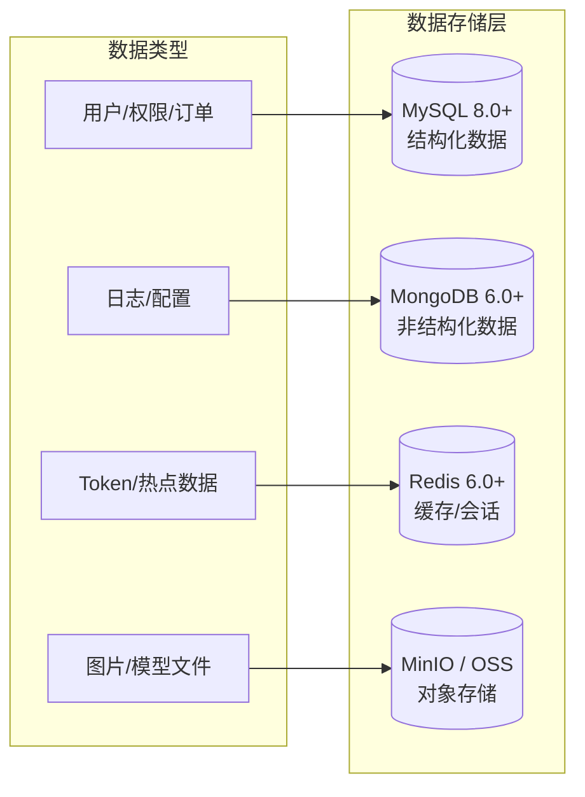
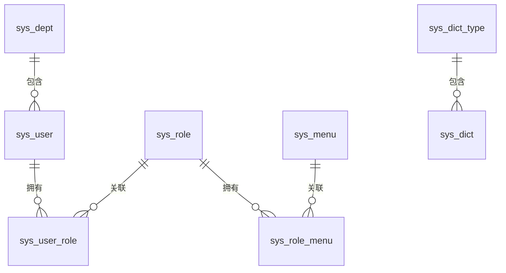
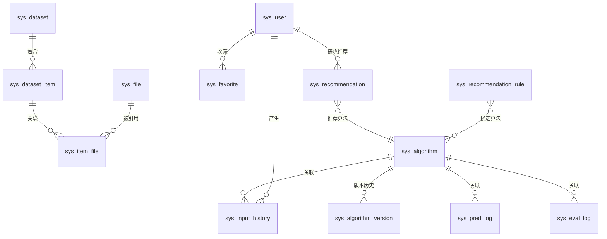
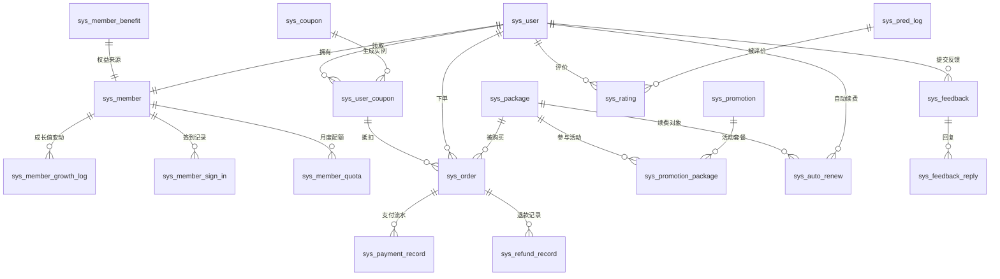
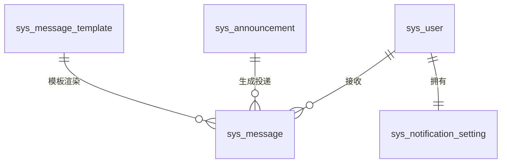
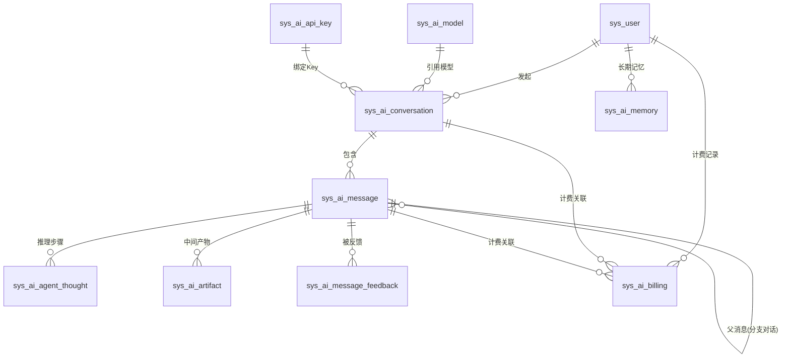
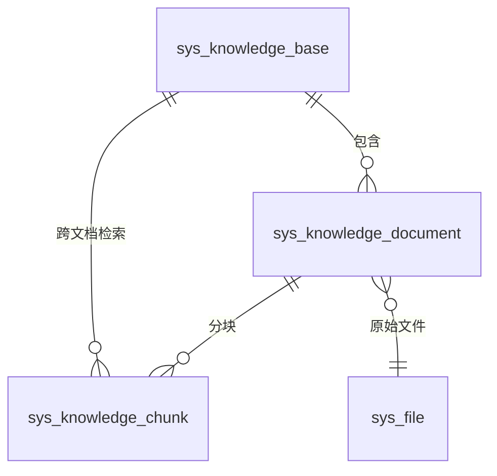

# 图像去雾系统 - 数据库设计

## 1. 文档概述

### 1.1 文档目的

本文档描述图像去雾系统的数据库设计，包括数据库选型、ER 关系模型、各模块的关键设计决策和数据存储规范。**表结构、字段定义、索引的权威定义以 `config/sql/schema/` 目录下的各 SQL 文件为准**，每个 SQL 文件头部以注释形式记录该表的设计思路。本文档不重复 DDL 细节。

### 1.2 适用范围

本文档适用于后端开发人员、DBA 及相关技术管理人员。

### 1.3 SQL 文件位置

数据库脚本存放在项目根目录 `config/sql/` 下，三个后端（dehaze-java / dehaze-go / dehaze-python）共享同一套 schema。文件组织如下：

```
config/sql/
├── schema/                    # 按表名拆分的建表语句
│   ├── sys_user.sql           # 用户表（文件头部含设计思路注释）
│   ├── sys_role.sql           # 角色表
│   ├── ...                    # 其他表，文件名即表名
├── data/                      # 按表名拆分的初始化数据
│   ├── sys_user.sql           # 用户初始数据
│   ├── sys_menu.sql           # 菜单初始数据
│   ├── ...                    # 其他表，文件名与 schema 对应
└── load-data.sh               # Docker 初始化辅助脚本
```

- `schema/` 目录按表名拆分，每个 `.sql` 文件对应一张表，文件头部以注释形式记录该表的设计思路、关键字段语义和枚举值。修改表结构时只需编辑对应文件。
- `data/` 目录同样按表名拆分，每个 `.sql` 文件存放对应表的 `INSERT` 初始化数据（菜单、角色、字典、部门等），文件名与 `schema/` 一一对应。
- `load-data.sh` 是 Docker 初始化辅助脚本，在所有 schema 建表完成后按序执行 `data/` 下的数据文件。

> **Docker 初始化**：MySQL 容器通过 `MYSQL_DATABASE=dehaze` 自动建库，`schema/` 目录挂载到 `docker-entrypoint-initdb.d/` 按文件名排序先执行建表，`load-data.sh` 脚本（命名前缀 `zz_` 保证排在最后）随后执行 `data/` 目录下所有数据文件。
>
> **测试复用**：dehaze-java 测试通过 Maven `maven-resources-plugin` 自动从 `config/sql/` 复制 `schema/` 和 `data/` 目录到测试 classpath，`application-test.yml` 以 `classpath:db/schema/*.sql` 和 `classpath:db/data/*.sql` 通配符加载，无需维护测试副本。详见 `dehaze-java/src/test/resources/db/README.md`。

---

## 2. 数据库选型

### 2.1 多数据库架构

系统采用多种数据库技术来满足不同的数据存储需求：



### 2.2 数据库职责划分

| 数据库 | 版本 | 用途 | 存储内容 |
|-------|------|------|---------|
| **MySQL** | 8.0+ | 业务数据库 | 用户、角色、菜单、部门、字典、数据集、算法模型、文件元数据、业务任务记录（预测/评估日志）、商业化数据（会员/订单/套餐）、消息通知 |
| **MongoDB** | 6.0+ | 审计日志数据库 | 登录审计日志（login_log）、业务操作审计日志（audit_log，含变更前后快照） |
| **Redis** | 6.0+ | 缓存与会话数据库 | 业务缓存、Session 存储、分布式锁、限流计数器、Pub/Sub 消息中继 |
| **MinIO/OSS** | - | 对象存储 | 图片文件、算法模型权重文件、导出文件 |

> **存储分层原则**：是否需要和业务表做 JOIN 查询？需要 → MySQL；不需要 → MongoDB。
> - `sys_pred_log`/`sys_eval_log` 需要与 `sys_rating`、`sys_algorithm` JOIN → MySQL
> - `login_log`/`audit_log` 独立查阅无 JOIN 需求 → MongoDB

---

## 3. ER 关系图

> 以下 ER 图仅展示表名与关系连线，各表字段定义详见 `config/sql/schema/` 目录下对应表名的 `.sql` 文件。

### 3.1 系统管理模块 ER 图



### 3.2 业务模块 ER 图



### 3.3 商业化模块 ER 图



### 3.4 消息通知模块 ER 图



### 3.5 AI 对话模块 ER 图



> `sys_ai_api_key` 为 `sys_api_key` 的 AI 对话绑定引用（会话表 `api_key_id` 关联 `sys_api_key.id`）。

### 3.6 AI 知识库模块 ER 图



> 分块向量索引存储在 Elasticsearch（`kb_chunks_{knowledgeBaseId}`），MySQL `sys_knowledge_chunk` 为源头数据。

---

## 4. 模块数据设计总览

> 各表的**字段定义、索引、枚举值**以 `config/sql/schema/{表名}.sql` 为权威（文件头部含该表设计思路注释）；各模块的详细数据设计见 `03-模块设计/` 下对应模块文档。本节仅阐述各模块的表组成与核心设计决策。

### 4.1 系统管理模块

系统管理模块采用经典 RBAC 模型，通过 `sys_user`、`sys_role`、`sys_menu` 三张主表及 `sys_user_role`、`sys_role_menu` 两张多对多关联表实现权限分配。

部门（`sys_dept`）和菜单（`sys_menu`）采用树形结构，通过 `parent_id` + `tree_path` 实现层级与子树加速查询。角色的 `data_scope` 控制数据权限粒度（全部/部门及子部门/本部门/本人），由后端查询时动态拼接条件。

字典（`sys_dict_type` / `sys_dict`）采用类型-数据项两级结构，通过 `type_code` 关联，集中管理可枚举配置项，避免代码硬编码。

### 4.2 核心业务模块

业务模块围绕数据集、算法模型、文件三个核心实体展开：

- **数据集**：`sys_dataset` 树形嵌套组织，挂载数据项 `sys_dataset_item`，经 `sys_item_file` 与文件表 `sys_file` 多对多关联；`sys_item_file` 同时承载图片类型与场景标注元数据，使一条数据项可同时关联雾图与清晰图（GT）。
- **算法模型**：`sys_algorithm` 树形分类，`status` 生命周期状态机（6 种取值，见 §5.4）支撑发布审核流程；发布新版本时将配置快照（`json`）写入 `sys_algorithm_version`，支持版本回滚与活跃版本标记；`recommend_score` 由推荐模块综合评分回写，作为推荐排序权重。
- **文件**：`sys_file` 以 MD5 唯一索引去重，只存与环境无关的稳定标识（`object_name` + `storage`），完整访问 URL 一律运行时拼接、不落库；`sys_input_history` 记录用户图像处理操作，冗余算法名避免频繁 JOIN。
- **收藏/推荐**：分别由 `sys_favorite`、`sys_recommendation`/`sys_recommendation_rule` 承担，见 4.2.1/4.2.2。

#### 4.2.1 收藏管理模块

`sys_favorite` 统一收藏表，以 `target_type` + `target_id` 多态收藏任意业务实体（算法/处理结果/数据集等），唯一索引防同一用户重复收藏，`is_invalid` 标记收藏对象失效（源对象删除时置位），取消后重收藏通过 upsert 复活原行（软删与唯一索引冲突处理见 §5.3.1 类别①）。详见 [收藏管理模块](../03-模块设计/基础模块/收藏管理/后端实现.md)。

#### 4.2.2 推荐管理模块

`sys_recommendation` 记录每次推荐请求（图像特征向量与 Top 3 推荐列表以 `json` 存储，用户反馈与采纳算法用于效果度量，只追加不逻辑删除）；`sys_recommendation_rule` 配置"场景 → 候选算法"规则（权重控制优先级，支持启停灰度）。详见 [推荐管理模块](../03-模块设计/基础模块/推荐管理/后端实现.md)。

### 4.3 业务任务记录模块

`sys_pred_log` / `sys_eval_log` 分别记录算法推理与评估操作的完整任务记录。**这两张表是业务任务记录而非"日志"，存储在 MySQL**——有状态机、外键关联、索引查询和分页 API。

两张表通过 `algorithm_id` + 原图/预测图 MD5 实现缓存查询（相同算法处理相同图片直接返回历史结果）；配合 Python 异步处理引入 `status` 追踪任务状态（枚举见 §5.4），失败时记录错误信息。评估日志的指标结果（PSNR/SSIM/LPIPS 等）以 `json` 存储。日志表为只追加记录，不使用逻辑删除。

异步任务调度由 `sys_task` 表配合 RabbitMQ 实现生产消费分离，统一承载导入导出与图像处理任务：`task_type` 区分任务类型，`task_id`/`idempotency_key` 唯一索引保证可查询与幂等，`status` 使用 5 状态机，任务参数与结果以 `json` 存储（导出结果只存对象键，下载 URL 运行时拼接）。只追加记录，不使用逻辑删除。

### 4.4 审计日志模块（MongoDB）

审计日志采用 MongoDB 存储，与业务 MySQL 分离，遵循"只追加、无 JOIN、schema 可演化"原则，包含两个集合：

- **login_log（登录审计）**：记录用户登录成功/失败信息（用户、IP、终端、结果、时间），三端在 AuthService 中异步写入，写入失败不影响登录主流程。
- **audit_log（业务操作审计）**：白名单驱动，仅审计会员/订单/数据集/角色/用户的核心写操作，`before_value`/`after_value` 为变更前后 JSON 快照——不同业务快照结构不同，正是 schema-free 的典型场景。白名单明细见 [日志架构设计 §5.4](./07-日志架构设计.md)。

### 4.5 商业化模块

商业化模块围绕会员体系、套餐交易、优惠券、评价反馈四条主线展开：

- **会员**：`sys_member` 与用户一对一，注册时自动初始化，记录等级、成长值、当月配额；成长值变动（`sys_member_growth_log`）、签到（`sys_member_sign_in`）明细化记录；`sys_member_quota` 为月度配额历史归档表（定时任务每月归档后重置）；各等级默认权益配置在 `sys_member_benefit`。
- **套餐交易**：`sys_package` 定义商品与计费周期，等级权益覆盖项以 `benefit_overrides`（JSON）存储；`sys_promotion` + `sys_promotion_package` 支撑活动与套餐多对多；优惠券采用模板-实例两级（`sys_coupon` → `sys_user_coupon`）；`sys_order`/`sys_payment_record`/`sys_refund_record` 记录完整交易链路，渠道流水号唯一约束保证支付回调幂等；`sys_auto_renew` 由定时任务扫描续费。
- **评价反馈**：`sys_rating` 通过 `pred_log_id` 唯一约束保证每条处理记录仅可评价一次；`sys_feedback` + `sys_feedback_reply` 记录反馈与处理过程；低分评价由后端逻辑触发告警，不单独建表。

### 4.6 消息通知模块

消息通知模块是统一消息分发与触达中心，由四张表构成：`sys_message` 存储投递消息（`type` 区分消息类型，`biz_module`+`biz_id` 幂等去重，已读/软删/过期清理）；`sys_message_template` 存储通知模板（`{varName}` 变量占位，JSON 存渠道与变量定义）；`sys_notification_setting` 每用户一行存储推送偏好（JSON）；`sys_announcement` 管理公告定义，发送时按 `target_scope` 批量生成 `sys_message`，实现内容管理与投递分离。详见 [消息通知模块](../03-模块设计/基础模块/消息通知/后端实现.md)。

### 4.7 AI 对话模块

AI 对话模块是 AI 工作平台的交互中枢，以通用大语言模型为底座，通过对话式统一入口调度图像处理、指标评估、算法选择等系统能力。数据模型参考 OpenAI Assistants API（Thread/Run/RunStep）、Dify（Conversation/Message/MessageAgentThought）、LangGraph（checkpoint 持久化）等主流实现，由 8 张业务表 + LangGraph 框架管理的检查点表构成：

| 表 | 职责 | 关键设计决策 |
|----|------|-------------|
| `sys_ai_model` | 模型配置 | `model_id` 为业务引用键（会话/消息引用），计费比例与能力标识，支持降级链；删除后不可复用（§5.3.1 类别②） |
| `sys_ai_conversation` | 对话会话 | 会话级模型/系统提示词/模型参数（JSON），摘要压缩支撑长对话，分支指针支撑多端同步 |
| `sys_ai_message` | 对话消息 | 消息树（`parent_message_id`）支撑分支对话，工具调用（JSON）与角色体系对齐 OpenAI/Claude |
| `sys_ai_agent_thought` | 推理过程 | 对齐 Dify/OpenAI RunStep，推理步骤独立成表而非塞入消息正文；只追加不逻辑删除 |
| `sys_ai_artifact` | 中间产物 | 大体积产物（图像结果/指标）绝不入 LLM 上下文，以多态引用 + 业务摘要存储；URL 永不落库；只追加不逻辑删除 |
| `sys_ai_memory` | 长期记忆 | 按认知心理学分类（情景/语义/程序），重要性评分 + 遗忘曲线衰减，写入后同步 ES 向量检索 |
| `sys_ai_message_feedback` | 消息反馈 | 点赞/点踩 + 预设标签，唯一索引保证每用户每消息仅一次（upsert 复活，§5.3.1 类别①） |
| `sys_ai_billing` | 计费记录 | 记录 Token 消耗明细与积分扣减，只追加不逻辑删除（财务记录不可删），详见 [AI 计费管理模块](../03-模块设计/基础模块/AI计费管理/需求规格.md) |

LangGraph 检查点持久化由 `MySQLCheckpointSaver` 自动管理（运行时 `RedisSaver` 高速读写），4 张 `langgraph_*` 表由框架自动创建、**不纳入本系统 `config/sql/schema/`**，业务层仅通过 Checkpointer API 交互。详见 [AI 对话模块后端实现-架构与公共](../03-模块设计/核心模块/AI对话/后端实现-架构与公共.md)。

### 4.8 AI 知识库模块

AI 知识库模块管理专业知识（算法文档、用户手册、最佳实践、用户上传文档），构建向量索引，为 AI 对话提供 RAG 支持。参考 Dify/RAGFlow 架构，由 3 张 MySQL 表 + ES 向量索引构成：

| 表 | 职责 | 关键设计决策 |
|----|------|-------------|
| `sys_knowledge_base` | 知识库配置 | embedding/分块/检索策略创建后不可修改（已有向量不兼容）；冗余统计字段避免 JOIN |
| `sys_knowledge_document` | 文档记录 | 关联 `sys_file` 原始文件（URL 不落库），异步解析状态机，纯文本与富文本双份存储 |
| `sys_knowledge_chunk` | 分块记录 | 分块序号支撑引用溯源，`metadata`（JSON）支撑检索过滤；只追加（更新时删旧分块重分块） |

向量索引存 Elasticsearch（索引名 `kb_chunks_{knowledgeBaseId}` 按知识库隔离，`dense_vector` 维度由 embedding 模型决定），MySQL `sys_knowledge_chunk` 为源头数据，`embedding`（JSON）作为降级检索备用。详见 [AI 知识库模块](../03-模块设计/基础模块/AI知识库/后端实现-架构与公共.md)。

### 4.9 扩展模块

- **`sys_wpx_file`**：记录原始文件与 WPX 格式文件的映射关系，`origin_md5` + `new_md5` 双唯一约束保证映射唯一；只追加不逻辑删除。
- **`sys_api_key`**：三端（Java/Go/Python）共享的长期鉴权密钥表，仅存 SHA-256 哈希（明文创建时返回一次），`key_prefix` 用于列表识别；吊销通过 `revoked_at` 标记而非删除——`key_hash` 必须永久保留以拒绝已泄露旧密钥（§5.3.1 类别③）。

---

## 5. 数据存储规范

### 5.1 命名规范

| 类型 | 规范 | 示例 |
|------|------|------|
| 表名 | 小写 + 下划线，`sys_` 前缀 | `sys_user`, `sys_dataset` |
| 字段名 | 小写 + 下划线 | `create_time`, `parent_id` |
| 索引名 | `idx_` 前缀 + 字段名 | `idx_parent_id`, `idx_status` |
| 唯一索引 | `uk_` 前缀 + 字段名 | `uk_algo_version` |

### 5.2 通用字段规范

所有核心业务表统一包含以下审计字段，由各端审计填充器自动注入：

- `create_time` / `update_time`：datetime，默认 `CURRENT_TIMESTAMP`，`update_time` 带 `ON UPDATE CURRENT_TIMESTAMP`
- `create_by` / `update_by`：bigint，记录创建/修改人 ID

常用数据类型约定：主键使用 `bigint` 自增；状态字段使用 `tinyint`；时间字段统一 `datetime`；MD5 值使用 `char(32)`；结构化数据使用 MySQL 8.0 原生 `json` 类型；长文本（URL、描述）使用 `TEXT`。所有表统一使用 `utf8mb4_0900_ai_ci` 排序规则；唯一索引统一 `uk_` 前缀。

### 5.3 逻辑删除规范

**核心业务表**（用户、角色、部门、菜单、字典、字典类型、数据集、数据集项、数据项文件关联、文件、算法、算法版本、统一收藏、推荐规则配置、AI 模型配置、AI 对话会话、AI 对话消息、AI 长期记忆、AI 消息反馈、AI 知识库、AI 知识库文档）使用逻辑删除：

- 字段名：`deleted`
- 类型：`tinyint`
- 默认值：`0`
- 值：`0` = 未删除，`1` = 已删除
- 各端自动软删除机制：Java 端由 MyBatis-Plus 全局 `logic-delete-field: deleted` 配置自动过滤；Go 端由 `RegisterSoftDeleteCallback` GORM 回调自动过滤；Python 端在 repository 层手工追加 `deleted == 0` 条件

**不使用逻辑删除的表**：

- 关联表（`sys_user_role`、`sys_role_menu`）：权限变更直接覆盖
- 日志/历史表（`sys_pred_log`、`sys_eval_log`、`sys_task`、`sys_input_history`、`sys_wpx_file`、`sys_recommendation`、`sys_ai_agent_thought`、`sys_ai_artifact`、`sys_ai_billing`、`sys_knowledge_chunk`）：只追加记录，不删除；过期数据通过定时任务物理清理
- `sys_api_key`：API Key 唯一的"移除"即吊销，吊销后 hash 必须永久保留以拒绝已泄露旧密钥，故用 `revoked_at` 标记而非删除（见 §5.3.1 类别③）

#### 5.3.1 软删除与唯一索引冲突处理策略

软删除（`deleted` 字段）使物理行在删除后仍占用数据库唯一索引槽位，当业务再次用相同唯一键插入时必然触发唯一约束冲突。处理方式只取决于两个业务问题：**该唯一键是否会被重复写入**、**旧行数据能否被新主体安全继承**。据此分四类，所有含软删除+唯一索引的表必须按下表归类处理，**禁止采用"唯一索引并入 `deleted` 列"的方案**（`deleted` 仅 0/1 两个值，反复删除会累积多条 `deleted=1` 同键行再次撞键）：

| 类别 | 特征 | 处理方式 | 本库适用表 |
|------|------|---------|-----------|
| ① 高频反复增删 | 删除后必然还会用相同键再插，且旧行可被新主体安全继承 | 唯一键不含 `deleted`，写入走 `INSERT ... ON DUPLICATE KEY UPDATE` upsert 复活（`deleted=0` + 业务字段重置） | `sys_favorite`、`sys_file`、`sys_auto_renew`、`sys_notification_setting`、`sys_member_quota`、`sys_member`、`sys_ai_message_feedback`(`message_id,user_id`) |
| ② 配置类标识 | 键是业务引用键，删除低频，键不需要回收 | 保持 `UNIQUE(key)` 不变；新建/改名查重必须【绕过软删过滤查全表】（Java 用原生 SQL 绕过 `@TableLogic`、Go 用 `Unscoped()`、Python 去掉 `deleted==0`），命中即报"已被历史记录占用"，绝不 upsert、绝不复活 | `sys_role`(`name`+`code`)、`sys_dict_type`(`code`)、`sys_dict`(`type_code,value`)、`sys_message_template`(`code`)、`sys_package`(`name`)、`sys_member_benefit`(`level_code`)、`sys_algorithm_version`(`algorithm_id,version`)、`sys_ai_model`(`model_id`) |
| ③ 敏感身份/高安全 | 旧行 id 是多表外键锚点，复活会导致新主体继承旧账号数据（越权+泄露） | 绝不 upsert 复活；软删行保留原键，注册/改名查重查全表，命中报"不可用" | `sys_user`(`username`)、`sys_api_key`(`key_hash`：吊销 key 永久保留 hash，吊销用独立 `revoked_at` 字段而非 `deleted`) |
| ④ 天然不重复流水 | 键为系统生成的全局唯一流水号 | 无需处理，不会冲突 | `sys_order`、`sys_payment_record`、`sys_refund_record` 等 |

**类别②的删除前置校验**（以 `sys_role` 为例，三端一致）：内置角色（`ROOT`/`ADMIN`）禁止删除；存在 `sys_user_role` 关联用户的角色必须先解绑才允许删除（不静默解绑）；软删角色时同步物理清理 `sys_role_menu` 关联，避免权限缓存残留。

**类别①的 upsert id 回填**：MySQL `ON DUPLICATE KEY UPDATE` 走 UPDATE 分支时需在 UPDATE 子句写 `id=LAST_INSERT_ID(id)`，配合各端自增 id 回填机制，确保调用方拿到的是原行 id 而非新分配值。`sys_member` 复活时业务决策：等级降为 `level_0`、清空 `monthly_*_quota`，但保留 `total_consumption`（风控用）；`sys_member` 无独立删除入口，生命周期跟随 `sys_user` 级联。

### 5.4 状态字段编码规范

系统中所有 `status` 字段统一使用 `tinyint` 类型。各表 `status` 字段语义如下：

| 表名 | 字段语义 | 取值 |
|------|---------|------|
| `sys_user` / `sys_role` / `sys_dept` / `sys_dict` / `sys_dict_type` / `sys_dataset` / `sys_api_key` / `sys_menu` / `sys_recommendation_rule` | 启用/禁用 | `1=正常`，`0=禁用`（默认 1） |
| `sys_algorithm` | 算法生命周期 | `1=草稿`，`2=测试中`，`3=待审核`，`4=已发布`，`5=已停用`，`6=已归档` |
| `sys_algorithm` (`task_type`) | 算法任务类型 | `dehaze`/`derain`/`desnow`/`lowlight`/`super_resolution`/`denoise`/`inpaint` |
| `sys_algorithm_version` | 版本状态快照 | 沿用 `sys_algorithm` 编码（记录该版本发布时的算法状态） |
| `sys_input_history` | 处理状态 | `1=成功`，`2=失败`，`3=处理中`（默认 3） |
| `sys_pred_log` / `sys_eval_log` | 异步任务状态 | `1=处理中`，`2=已完成`（默认 2），`3=失败` |
| `sys_task` | 任务状态机 | `1=待处理`（默认 1），`2=处理中`，`3=已完成`，`4=失败`，`5=已取消` |
| `sys_favorite` | 收藏对象失效标识 | `is_invalid` 字段：`0=正常`，`1=已失效`（默认 0） |
| `sys_recommendation` | 推荐反馈 | `feedback` 字段：`0=未反馈`，`1=有用`，`2=无用`（默认 0） |
| `sys_ai_model` | 模型启停 | `1=启用`，`0=禁用`（默认 1） |
| `sys_ai_conversation` | 会话状态 | `1=活跃`（默认 1），`2=已归档` |
| `sys_ai_message` | 消息状态 | `1=流式输出中`（默认 1），`2=已完成`，`3=失败`，`4=已取消` |
| `sys_ai_agent_thought` | 推理步骤状态 | `1=成功`（默认 1），`2=失败`，`3=跳过` |
| `sys_ai_memory` | 记忆启停/归档 | `status`：`1=启用`，`0=禁用`（默认 1）；`archived`：`0=未归档`，`1=已归档`（默认 0）；`importance`：0-100 重要性评分 |
| `sys_ai_message_feedback` | 反馈评分 | `rating` 字段：`1=点赞`，`-1=点踩` |
| `sys_knowledge_base` | 知识库启停 | `1=启用`，`2=处理中`（默认 1），`0=禁用` |
| `sys_knowledge_document` | 文档处理状态 | `processing_status` 字段：`pending`/`processing`/`completed`/`failed`（默认 `pending`） |

各端通过枚举类统一管理上述状态值（Java 端 `*Enum`、Python/Go 端 `*Status`），**禁止在业务代码中使用字符串字面量表示状态**。
