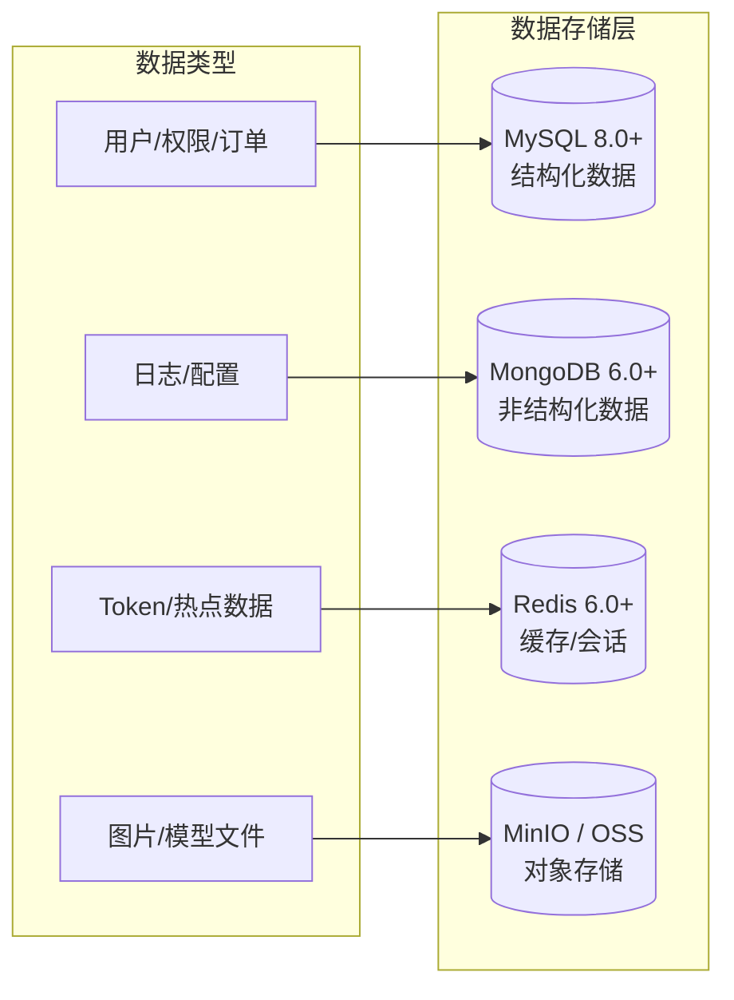
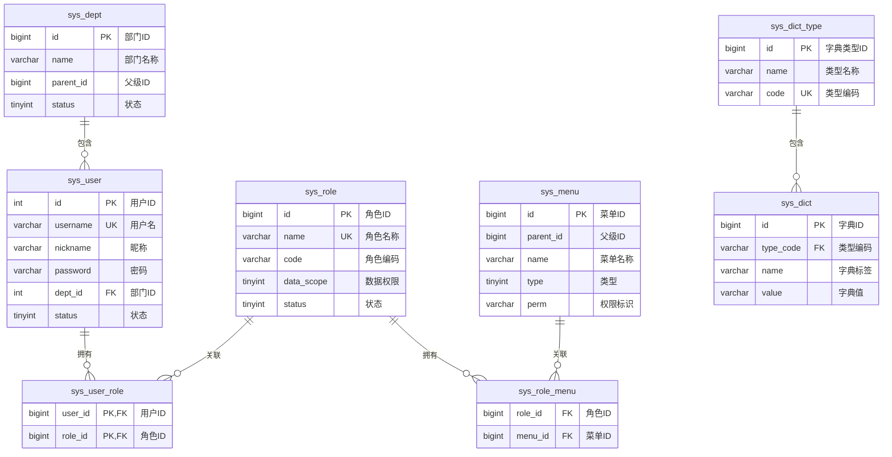
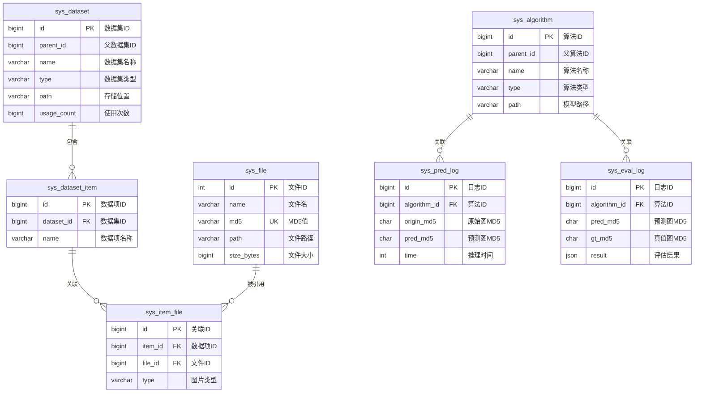

# 图像去雾系统 - 数据库设计

## 1. 文档概述

### 1.1 文档目的

本文档详细描述图像去雾系统的数据库设计，包括数据库选型、表结构设计、索引策略、关系模型和数据存储规范，为系统开发和维护提供数据层面的技术指导。

### 1.2 适用范围

本文档适用于后端开发人员、DBA 及相关技术管理人员。

---

## 2. 数据库选型

### 2.1 多数据库架构

系统采用多种数据库技术来满足不同的数据存储需求：



### 2.2 数据库职责划分

| 数据库 | 版本 | 用途 | 存储内容 |
|-------|------|------|---------|
| **MySQL** | 8.0+ | 主数据库 | 用户、角色、菜单、部门、字典、数据集、算法模型、文件元数据 |
| **MongoDB** | 6.0+ | 日志数据库 | 操作日志、处理记录、非结构化配置 |
| **Redis** | 6.0+ | 缓存数据库 | Token 存储、会话管理、热点数据缓存、分布式锁 |
| **MinIO/OSS** | - | 对象存储 | 图片文件、算法模型权重文件、导出文件 |

---

## 3. ER 关系图

### 3.1 系统管理模块 ER 图



### 3.2 业务模块 ER 图



---

## 4. 表结构设计

### 4.1 系统管理模块

#### 4.1.1 用户表 (sys_user)

```sql
CREATE TABLE `sys_user` (
    `id`          int          NOT NULL AUTO_INCREMENT COMMENT '用户ID',
    `username`    varchar(64)  NULL DEFAULT NULL COMMENT '用户名',
    `nickname`    varchar(64)  NULL DEFAULT NULL COMMENT '昵称',
    `gender`      tinyint(1)   NULL DEFAULT 1 COMMENT '性别(1:男;2:女)',
    `password`    varchar(100) NULL DEFAULT NULL COMMENT '密码(BCrypt加密)',
    `dept_id`     int          NULL DEFAULT NULL COMMENT '部门ID',
    `avatar`      TEXT         NULL COMMENT '用户头像URL',
    `mobile`      varchar(20)  NULL DEFAULT NULL COMMENT '联系方式',
    `status`      tinyint(1)   NULL DEFAULT 1 COMMENT '用户状态(1:正常;0:禁用)',
    `email`       varchar(128) NULL DEFAULT NULL COMMENT '用户邮箱',
    `deleted`     tinyint(1)   NULL DEFAULT 0 COMMENT '逻辑删除标识(0:未删除;1:已删除)',
    `create_time` datetime     NULL DEFAULT NULL COMMENT '创建时间',
    `update_time` datetime     NULL DEFAULT NULL COMMENT '更新时间',
    PRIMARY KEY (`id`) USING BTREE,
    UNIQUE INDEX `login_name` (`username` ASC) USING BTREE
) ENGINE=InnoDB CHARSET=utf8mb4 COMMENT='用户信息表';
```

**字段说明**：
| 字段 | 类型 | 说明 |
|------|------|------|
| `username` | varchar(64) | 登录用户名，唯一索引 |
| `password` | varchar(100) | 使用 BCrypt 加密存储 |
| `dept_id` | int | 关联部门表，外键关系 |
| `status` | tinyint | 1=正常，0=禁用 |
| `deleted` | tinyint | 逻辑删除，0=未删除，1=已删除 |

#### 4.1.2 角色表 (sys_role)

```sql
CREATE TABLE `sys_role` (
    `id`          bigint      NOT NULL AUTO_INCREMENT,
    `name`        varchar(64) NOT NULL DEFAULT '' COMMENT '角色名称',
    `code`        varchar(32) NULL DEFAULT NULL COMMENT '角色编码',
    `sort`        int         NULL DEFAULT NULL COMMENT '显示顺序',
    `status`      tinyint(1)  NULL DEFAULT 1 COMMENT '角色状态(1:正常;0:停用)',
    `data_scope`  tinyint     NULL DEFAULT NULL COMMENT '数据权限(0:所有;1:部门及子部门;2:本部门;3:本人)',
    `deleted`     tinyint(1)  NOT NULL DEFAULT 0 COMMENT '逻辑删除标识',
    `create_time` datetime    NULL DEFAULT NULL COMMENT '创建时间',
    `update_time` datetime    NULL DEFAULT NULL COMMENT '更新时间',
    PRIMARY KEY (`id`) USING BTREE,
    UNIQUE INDEX `name` (`name` ASC) USING BTREE
) ENGINE=InnoDB CHARSET=utf8mb4 COMMENT='角色表';
```

**数据权限范围说明**：
| data_scope | 说明 |
|------------|------|
| 0 | 所有数据 |
| 1 | 部门及子部门数据 |
| 2 | 本部门数据 |
| 3 | 本人数据 |

#### 4.1.3 菜单表 (sys_menu)

```sql
CREATE TABLE `sys_menu` (
    `id`          bigint       NOT NULL AUTO_INCREMENT,
    `parent_id`   bigint       NOT NULL COMMENT '父菜单ID',
    `tree_path`   varchar(255) DEFAULT NULL COMMENT '父节点ID路径',
    `name`        varchar(64)  NOT NULL DEFAULT '' COMMENT '菜单名称',
    `type`        tinyint      NOT NULL COMMENT '菜单类型(1:菜单;2:目录;3:外链;4:按钮)',
    `path`        varchar(128) DEFAULT '' COMMENT '路由路径',
    `component`   varchar(128) DEFAULT NULL COMMENT '组件路径',
    `perm`        varchar(128) DEFAULT NULL COMMENT '权限标识',
    `visible`     tinyint(1)   NOT NULL DEFAULT 1 COMMENT '显示状态(1:显示;0:隐藏)',
    `sort`        int          DEFAULT 0 COMMENT '排序',
    `icon`        varchar(64)  DEFAULT '' COMMENT '菜单图标',
    `redirect`    varchar(128) DEFAULT NULL COMMENT '跳转路径',
    `create_time` datetime     DEFAULT NULL COMMENT '创建时间',
    `update_time` datetime     DEFAULT NULL COMMENT '更新时间',
    `always_show` tinyint      DEFAULT NULL COMMENT '目录-只有一个子路由是否始终显示',
    `keep_alive`  tinyint      DEFAULT NULL COMMENT '菜单-是否开启页面缓存',
    PRIMARY KEY (`id`) USING BTREE
) ENGINE=InnoDB CHARSET=utf8mb4 COMMENT='菜单管理';
```

**菜单类型说明**：
| type | 说明 | path/component 要求 |
|------|------|---------------------|
| 1 | 菜单 | 必填 path 和 component |
| 2 | 目录 | 必填 path |
| 3 | 外链 | 必填 path（外部 URL） |
| 4 | 按钮 | 必填 perm（权限标识） |

#### 4.1.4 部门表 (sys_dept)

```sql
CREATE TABLE `sys_dept` (
    `id`          bigint       NOT NULL AUTO_INCREMENT COMMENT '主键',
    `name`        varchar(64)  NOT NULL DEFAULT '' COMMENT '部门名称',
    `parent_id`   bigint       NOT NULL DEFAULT 0 COMMENT '父节点ID',
    `tree_path`   varchar(255) NULL DEFAULT '' COMMENT '父节点ID路径',
    `sort`        int          NULL DEFAULT 0 COMMENT '显示顺序',
    `status`      tinyint      NOT NULL DEFAULT 1 COMMENT '状态(1:正常;0:禁用)',
    `deleted`     tinyint      NULL DEFAULT 0 COMMENT '逻辑删除标识',
    `create_time` datetime     NULL DEFAULT NULL COMMENT '创建时间',
    `update_time` datetime     NULL DEFAULT NULL COMMENT '更新时间',
    `create_by`   bigint       NULL DEFAULT NULL COMMENT '创建人ID',
    `update_by`   bigint       NULL DEFAULT NULL COMMENT '修改人ID',
    PRIMARY KEY (`id`) USING BTREE
) ENGINE=InnoDB CHARSET=utf8mb4 COMMENT='部门表';
```

#### 4.1.5 字典类型表 (sys_dict_type)

```sql
CREATE TABLE `sys_dict_type` (
    `id`          bigint       NOT NULL AUTO_INCREMENT COMMENT '主键',
    `name`        varchar(50)  NULL DEFAULT '' COMMENT '类型名称',
    `code`        varchar(50)  NULL DEFAULT '' COMMENT '类型编码',
    `status`      tinyint(1)   NULL DEFAULT 0 COMMENT '状态(0:正常;1:禁用)',
    `remark`      varchar(255) NULL DEFAULT NULL COMMENT '备注',
    `create_time` datetime     NULL DEFAULT NULL COMMENT '创建时间',
    `update_time` datetime     NULL DEFAULT NULL COMMENT '更新时间',
    PRIMARY KEY (`id`) USING BTREE,
    UNIQUE INDEX `type_code` (`code` ASC) USING BTREE
) ENGINE=InnoDB CHARSET=utf8mb4 COMMENT='字典类型表';
```

#### 4.1.6 字典数据表 (sys_dict)

```sql
CREATE TABLE `sys_dict` (
    `id`          bigint       NOT NULL AUTO_INCREMENT COMMENT '主键',
    `type_code`   varchar(64)  NULL DEFAULT NULL COMMENT '字典类型编码',
    `name`        varchar(50)  NULL DEFAULT '' COMMENT '字典项名称',
    `value`       varchar(50)  NULL DEFAULT '' COMMENT '字典项值',
    `sort`        int          NULL DEFAULT 0 COMMENT '排序',
    `status`      tinyint      NULL DEFAULT 0 COMMENT '状态(1:正常;0:禁用)',
    `defaulted`   tinyint      NULL DEFAULT 0 COMMENT '是否默认(1:是;0:否)',
    `remark`      varchar(255) NULL DEFAULT '' COMMENT '备注',
    `create_time` datetime     NULL DEFAULT NULL COMMENT '创建时间',
    `update_time` datetime     NULL DEFAULT NULL COMMENT '更新时间',
    PRIMARY KEY (`id`) USING BTREE
) ENGINE=InnoDB CHARSET=utf8mb4 COMMENT='字典数据表';
```

#### 4.1.7 用户角色关联表 (sys_user_role)

```sql
CREATE TABLE `sys_user_role` (
    `user_id` bigint NOT NULL COMMENT '用户ID',
    `role_id` bigint NOT NULL COMMENT '角色ID',
    PRIMARY KEY (`user_id`, `role_id`) USING BTREE
) ENGINE=InnoDB CHARSET=utf8mb4 COMMENT='用户和角色关联表';
```

#### 4.1.8 角色菜单关联表 (sys_role_menu)

```sql
CREATE TABLE `sys_role_menu` (
    `role_id` bigint NOT NULL COMMENT '角色ID',
    `menu_id` bigint NOT NULL COMMENT '菜单ID'
) ENGINE=InnoDB CHARSET=utf8mb4 COMMENT='角色和菜单关联表';
```

---

### 4.2 业务模块

#### 4.2.1 数据集表 (sys_dataset)

```sql
CREATE TABLE `sys_dataset` (
    `id`          bigint        NOT NULL AUTO_INCREMENT COMMENT '数据集ID',
    `parent_id`   bigint        NOT NULL DEFAULT 0 COMMENT '父数据集ID',
    `type`        varchar(64)   NOT NULL DEFAULT '' COMMENT '数据集类型',
    `name`        varchar(64)   NOT NULL DEFAULT '' COMMENT '数据集名称',
    `img`         TEXT          NULL DEFAULT NULL COMMENT '数据集样例图片',
    `description` varchar(2048) NULL DEFAULT '' COMMENT '数据集描述',
    `path`        varchar(512)  NOT NULL DEFAULT '' COMMENT '存储位置',
    `size`        varchar(100)  NULL DEFAULT '' COMMENT '占用空间大小',
    `status`      tinyint       NOT NULL DEFAULT 1 COMMENT '状态(1:启用;0:禁用)',
    `usage_count` bigint        NOT NULL DEFAULT 0 COMMENT '使用次数',
    `deleted`     tinyint       NULL DEFAULT 0 COMMENT '逻辑删除标识',
    `create_time` datetime      NULL DEFAULT NULL COMMENT '创建时间',
    `update_time` datetime      NULL DEFAULT NULL COMMENT '更新时间',
    `create_by`   bigint        NULL DEFAULT NULL COMMENT '创建人ID',
    `update_by`   bigint        NULL DEFAULT NULL COMMENT '修改人ID',
    PRIMARY KEY (`id`) USING BTREE,
    INDEX `idx_parent_id` (`parent_id`) USING BTREE,
    INDEX `idx_name` (`name`) USING BTREE,
    INDEX `idx_parent_name` (`parent_id`, `name`) USING BTREE,
    INDEX `idx_deleted` (`deleted`) USING BTREE,
    INDEX `idx_status` (`status`) USING BTREE,
    INDEX `idx_create_time` (`create_time`) USING BTREE
) ENGINE=InnoDB CHARSET=utf8mb4 COMMENT='数据集表';
```

#### 4.2.2 数据集项表 (sys_dataset_item)

```sql
CREATE TABLE `sys_dataset_item` (
    `id`          bigint      NOT NULL AUTO_INCREMENT COMMENT 'id',
    `dataset_id`  bigint      NOT NULL COMMENT '所属数据集ID',
    `name`        varchar(64) NULL COMMENT '数据项名称',
    `create_time` datetime    DEFAULT CURRENT_TIMESTAMP COMMENT '创建时间',
    `update_time` datetime    DEFAULT CURRENT_TIMESTAMP ON UPDATE CURRENT_TIMESTAMP COMMENT '更新时间',
    PRIMARY KEY (`id`) USING BTREE,
    INDEX `idx_dataset_id` (`dataset_id`) USING BTREE
) ENGINE=InnoDB CHARSET=utf8mb4 COMMENT='数据集与数据项关联表';
```

#### 4.2.3 数据项文件关联表 (sys_item_file)

```sql
CREATE TABLE `sys_item_file` (
    `id`                bigint       NOT NULL AUTO_INCREMENT COMMENT 'id',
    `item_id`           bigint       NOT NULL COMMENT '所属数据项ID',
    `file_id`           bigint       NOT NULL COMMENT '文件ID',
    `thumbnail_file_id` bigint       DEFAULT NULL COMMENT '缩略图文件ID',
    `type`              varchar(64)  NOT NULL COMMENT '图片类型（清晰图、雾霾图、分割图等）',
    `description`       varchar(255) DEFAULT NULL COMMENT '描述',
    `scene_type`        varchar(64)  DEFAULT NULL COMMENT '场景类型',
    `haze_level`        varchar(32)  DEFAULT NULL COMMENT '雾霾程度',
    `width`             int          DEFAULT NULL COMMENT '图片宽度',
    `height`            int          DEFAULT NULL COMMENT '图片高度',
    `usage_count`       bigint       DEFAULT 0 COMMENT '使用次数',
    `create_time`       datetime     DEFAULT CURRENT_TIMESTAMP COMMENT '创建时间',
    `update_time`       datetime     DEFAULT CURRENT_TIMESTAMP ON UPDATE CURRENT_TIMESTAMP COMMENT '更新时间',
    PRIMARY KEY (`id`) USING BTREE,
    INDEX `idx_item_id_file_id` (`item_id`, `file_id`) USING BTREE
) ENGINE=InnoDB CHARSET=utf8mb4 COMMENT='数据项图片关联表';
```

**图片类型 (type) 枚举**：
| 值 | 说明 |
|----|------|
| `hazy` | 雾霾图 |
| `clear` | 清晰图（GT） |
| `depth` | 深度图 |
| `segment` | 分割图 |

#### 4.2.4 算法模型表 (sys_algorithm)

```sql
CREATE TABLE `sys_algorithm` (
    `id`              bigint        NOT NULL AUTO_INCREMENT COMMENT '模型ID',
    `parent_id`       bigint        DEFAULT 0 COMMENT '模型的父ID',
    `type`            varchar(100)  DEFAULT '' COMMENT '模型类型(关联字典 sys_algorithm_type)',
    `name`            varchar(64)   NOT NULL COMMENT '模型名称',
    `version`         varchar(20)   DEFAULT 'v1.0.0' COMMENT '版本号',
    `img`             TEXT          DEFAULT NULL COMMENT '模型图片',
    `path`            varchar(255)  DEFAULT '' COMMENT '模型存储路径',
    `size`            varchar(100)  DEFAULT NULL COMMENT '模型大小',
    `params`          varchar(255)  DEFAULT NULL COMMENT '模型参数量',
    `flops`           varchar(255)  DEFAULT NULL COMMENT '模型浮点运算次数',
    `import_path`     varchar(255)  DEFAULT NULL COMMENT '模型代码导入路径',
    `config_json`     json          DEFAULT NULL COMMENT '配置参数JSON',
    `description`     varchar(2048) DEFAULT NULL COMMENT '模型详细描述',
    `status`          tinyint(1)    DEFAULT 0 COMMENT '算法状态(0:草稿;1:测试中;2:待审核;3:已发布;4:已停用;5:已归档)',
    `audit_by`        bigint        DEFAULT NULL COMMENT '审核人ID',
    `audit_time`      datetime      DEFAULT NULL COMMENT '审核时间',
    `audit_remark`    varchar(500)  DEFAULT NULL COMMENT '审核备注（驳回原因）',
    `create_time`     datetime      DEFAULT NULL COMMENT '创建时间',
    `update_time`     datetime      DEFAULT NULL COMMENT '更新时间',
    `create_by`       bigint        NULL DEFAULT NULL COMMENT '创建人ID',
    `update_by`       bigint        NULL DEFAULT NULL COMMENT '修改人ID',
    PRIMARY KEY (`id`) USING BTREE,
    INDEX `idx_status` (`status`) USING BTREE,
    INDEX `idx_type` (`type`) USING BTREE,
    INDEX `idx_create_by` (`create_by`) USING BTREE
) ENGINE=InnoDB CHARSET=utf8mb4 COMMENT='算法模型表';
```

**算法类型 (type)**：关联字典表 `sys_algorithm_type`，初始值如下：
| dict_value | dict_label | 说明 |
|------------|------------|------|
| `traditional` | 传统算法 | DCP、CAP 等 |
| `deep_learning` | 深度学习 | CNN、ResNet 等 |
| `transformer` | Transformer | ViT、Swin 等 |

> 用户可通过字典管理自行扩展算法类型（如 GAN、Diffusion 等）

**算法状态 (status) 枚举**：

> 注意：此 `status` 字段表示算法生命周期状态（6 种值），与其他表的启用/禁用状态（2 种值）含义不同。

| 值 | 说明 |
|----|------|
| 0 | 草稿 |
| 1 | 测试中 |
| 2 | 待审核 |
| 3 | 已发布 |
| 4 | 已停用 |
| 5 | 已归档 |

**config_json 字段 JSON 结构示例**：
```json
{
  "batch_size": 1,
  "image_size": [512, 512],
  "threshold": 0.5,
  "use_gpu": true
}
```

#### 4.2.5 算法版本历史表 (sys_algorithm_version)

```sql
CREATE TABLE `sys_algorithm_version` (
    `id`              bigint        NOT NULL AUTO_INCREMENT COMMENT '版本记录ID',
    `algorithm_id`    bigint        NOT NULL COMMENT '算法ID',
    `version`         varchar(20)   NOT NULL COMMENT '版本号',
    `path`            varchar(255)  DEFAULT '' COMMENT '模型存储路径',
    `size`            varchar(100)  DEFAULT NULL COMMENT '模型大小',
    `config_json`     json          DEFAULT NULL COMMENT '配置参数JSON快照',
    `description`     varchar(2048) DEFAULT NULL COMMENT '版本说明',
    `changelog`       text          DEFAULT NULL COMMENT '变更日志',
    `is_current`      tinyint(1)    DEFAULT 0 COMMENT '是否当前版本(0:否;1:是)',
    `create_time`     datetime      DEFAULT CURRENT_TIMESTAMP COMMENT '创建时间',
    `create_by`       bigint        DEFAULT NULL COMMENT '创建人ID',
    PRIMARY KEY (`id`) USING BTREE,
    INDEX `idx_algorithm_id` (`algorithm_id`) USING BTREE,
    UNIQUE INDEX `uk_algorithm_version` (`algorithm_id`, `version`) USING BTREE
) ENGINE=InnoDB CHARSET=utf8mb4 COMMENT='算法版本历史表';
```

**版本管理说明**：
- 每次算法发布新版本时，保存当前配置快照到版本历史表
- `is_current` 标记当前生效的版本，同一算法只有一个当前版本
- 版本回滚时，将目标版本的配置恢复到主表，并更新 `is_current` 标记

#### 4.2.6 文件表 (sys_file)

```sql
CREATE TABLE `sys_file` (
    `id`          int          NOT NULL AUTO_INCREMENT COMMENT '文件ID',
    `type`        varchar(100) DEFAULT NULL COMMENT '文件类型',
    `url`         TEXT         DEFAULT NULL COMMENT '文件URL',
    `name`        varchar(100) NOT NULL COMMENT '文件原始名',
    `object_name` varchar(100) NOT NULL COMMENT '文件存储名',
    `size`        varchar(100) NOT NULL DEFAULT '0' COMMENT '文件大小（格式化显示）',
    `size_bytes`  bigint       DEFAULT NULL COMMENT '文件大小（原始字节数）',
    `path`        varchar(255) NOT NULL COMMENT '文件路径',
    `md5`         char(32)     NOT NULL COMMENT '文件MD5值',
    `create_time` datetime     NOT NULL COMMENT '创建时间',
    `update_time` datetime     DEFAULT NULL COMMENT '更新时间',
    PRIMARY KEY (`id`) USING BTREE,
    UNIQUE INDEX `md5_key` (`md5` ASC) USING BTREE
) ENGINE=InnoDB CHARSET=utf8mb4 COMMENT='文件表';
```

**MD5 去重机制**：系统通过 MD5 值唯一索引实现文件去重，相同内容的文件只存储一份。

---

### 4.3 日志模块

#### 4.3.1 预测日志表 (sys_pred_log)

```sql
CREATE TABLE `sys_pred_log` (
    `id`             bigint   NOT NULL AUTO_INCREMENT COMMENT 'id',
    `algorithm_id`   bigint   NOT NULL COMMENT '算法ID',
    `origin_file_id` bigint   DEFAULT NULL COMMENT '原始图像文件ID',
    `origin_md5`     char(32) NOT NULL COMMENT '原始图像MD5值',
    `origin_url`     TEXT     NOT NULL COMMENT '原始图像URL',
    `pred_file_id`   bigint   DEFAULT NULL COMMENT '预测图像文件ID',
    `pred_md5`       char(32) NOT NULL COMMENT '预测图像MD5值',
    `pred_url`       TEXT     NOT NULL COMMENT '预测图像URL',
    `time`           int      DEFAULT 0 COMMENT '推理时间（毫秒）',
    `create_time`    datetime NOT NULL DEFAULT CURRENT_TIMESTAMP COMMENT '创建时间',
    `update_time`    datetime NOT NULL DEFAULT CURRENT_TIMESTAMP ON UPDATE CURRENT_TIMESTAMP COMMENT '更新时间',
    `create_by`      bigint   NULL DEFAULT NULL COMMENT '创建人ID',
    `update_by`      bigint   NULL DEFAULT NULL COMMENT '修改人ID',
    PRIMARY KEY (`id`) USING BTREE,
    KEY `idx_algorithm_id` (`algorithm_id`) USING BTREE,
    KEY `idx_origin_md5` (`origin_md5`) USING BTREE,
    KEY `idx_pred_md5` (`pred_md5`) USING BTREE,
    KEY `idx_pred_cache` (`algorithm_id`, `origin_md5`) USING BTREE
) ENGINE=InnoDB CHARSET=utf8mb4 COMMENT='模型预测日志表';
```

**缓存查询**：通过 `idx_pred_cache` 复合索引（`algorithm_id + origin_md5`）可快速查找已有预测结果，避免重复推理。

#### 4.3.2 评估日志表 (sys_eval_log)

```sql
CREATE TABLE `sys_eval_log` (
    `id`           bigint   NOT NULL AUTO_INCREMENT COMMENT 'id',
    `algorithm_id` bigint   NOT NULL COMMENT '算法ID',
    `pred_file_id` bigint   DEFAULT NULL COMMENT '预测图像文件ID',
    `pred_md5`     char(32) NOT NULL COMMENT '预测图像MD5值',
    `pred_url`     TEXT     NOT NULL COMMENT '预测图像URL',
    `gt_file_id`   bigint   DEFAULT NULL COMMENT '真值图像文件ID',
    `gt_md5`       char(32) NOT NULL COMMENT '真值图像MD5值',
    `gt_url`       TEXT     NOT NULL COMMENT '真值图像URL',
    `time`         int      DEFAULT 0 COMMENT '评估时间（毫秒）',
    `result`       json     COMMENT '评估结果（PSNR/SSIM等）',
    `create_time`  datetime NOT NULL DEFAULT CURRENT_TIMESTAMP COMMENT '创建时间',
    `update_time`  datetime NOT NULL DEFAULT CURRENT_TIMESTAMP ON UPDATE CURRENT_TIMESTAMP COMMENT '更新时间',
    `create_by`    bigint   NULL DEFAULT NULL COMMENT '创建人ID',
    `update_by`    bigint   NULL DEFAULT NULL COMMENT '修改人ID',
    PRIMARY KEY (`id`) USING BTREE,
    KEY `idx_algorithm_id` (`algorithm_id`) USING BTREE,
    KEY `idx_pred_md5` (`pred_md5`) USING BTREE,
    KEY `idx_gt_md5` (`gt_md5`) USING BTREE,
    KEY `idx_eval_cache` (`algorithm_id`, `pred_md5`, `gt_md5`) USING BTREE
) ENGINE=InnoDB CHARSET=utf8mb4 COMMENT='模型评估日志表';
```

**result 字段 JSON 结构示例**：
```json
{
  "psnr": 28.56,
  "ssim": 0.9234,
  "lpips": 0.0856,
  "niqe": 3.45,
  "entropy": 7.23
}
```

**评估指标说明**：
| 指标 | 说明 | 取值范围 |
|------|------|---------|
| `psnr` | 峰值信噪比 | 越高越好（通常>30dB为好） |
| `ssim` | 结构相似性 | 0-1，越接近1越好 |
| `lpips` | 学习感知图像块相似度 | 0-1，越低越好 |
| `niqe` | 自然图像质量评价 | 越低越好 |
| `entropy` | 信息熵 | 越高越好 |

**缓存查询**：通过 `idx_eval_cache` 复合索引可快速查找已有评估结果，避免重复评估。

#### 4.3.3 任务表 (sys_task)

```sql
CREATE TABLE `sys_task` (
    `id`              bigint      NOT NULL AUTO_INCREMENT COMMENT '主键ID',
    `task_id`         varchar(64) NOT NULL COMMENT '任务ID（UUID）',
    `task_type`       varchar(32) NOT NULL COMMENT '任务类型',
    `status`          varchar(32) NOT NULL DEFAULT 'pending' COMMENT '任务状态',
    `progress`        int         DEFAULT 0 COMMENT '任务进度（百分比）',
    `total_files`     int         DEFAULT 0 COMMENT '总文件数',
    `processed_files` int         DEFAULT 0 COMMENT '已处理文件数',
    `params`          text        COMMENT '任务参数（JSON）',
    `result`          text        COMMENT '任务结果（下载链接）',
    `error_message`   text        COMMENT '错误信息',
    `created_by`      bigint      COMMENT '创建人ID',
    `created_at`      datetime    NOT NULL DEFAULT CURRENT_TIMESTAMP COMMENT '创建时间',
    `started_at`      datetime    COMMENT '开始时间',
    `completed_at`    datetime    COMMENT '完成时间',
    `expires_at`      datetime    COMMENT '过期时间',
    PRIMARY KEY (`id`) USING BTREE,
    UNIQUE INDEX `idx_task_id` (`task_id`) USING BTREE,
    INDEX `idx_status` (`status`) USING BTREE,
    INDEX `idx_created_by` (`created_by`) USING BTREE,
    INDEX `idx_created_at` (`created_at`) USING BTREE
) ENGINE=InnoDB CHARSET=utf8mb4 COMMENT='系统任务表';
```

**任务状态枚举**：
| status | 说明 |
|--------|------|
| `pending` | 等待中 |
| `processing` | 处理中 |
| `completed` | 已完成 |
| `failed` | 失败 |
| `cancelled` | 已取消 |

---

### 4.4 扩展模块

#### 4.4.1 WPX 文件表 (sys_wpx_file)

```sql
CREATE TABLE `sys_wpx_file` (
    `id`             bigint       NOT NULL AUTO_INCREMENT COMMENT 'id',
    `origin_file_id` bigint       COMMENT '原文件ID',
    `origin_md5`     char(32)     NOT NULL COMMENT '原文件MD5值',
    `origin_path`    varchar(255) NOT NULL COMMENT '原文件路径',
    `new_file_id`    bigint       COMMENT '新文件ID',
    `new_path`       varchar(255) NOT NULL COMMENT '新文件路径',
    `new_md5`        char(32)     NOT NULL COMMENT '新文件MD5值',
    PRIMARY KEY (`id`) USING BTREE,
    UNIQUE INDEX `origin_md5` (`origin_md5`) USING BTREE,
    UNIQUE INDEX `new_md5` (`new_md5`) USING BTREE,
    INDEX `idx_origin_md5` (`origin_md5`) USING BTREE
) ENGINE=InnoDB CHARSET=utf8mb4 COMMENT='WPX文件表';
```

---

## 5. 索引设计策略

### 5.1 索引类型说明

| 索引类型 | 使用场景 | 示例 |
|---------|---------|------|
| **主键索引** | 各表 `id` 字段 | `PRIMARY KEY (id)` |
| **唯一索引** | 需要唯一性约束的字段 | `username`, `code`, `md5` |
| **普通索引** | 经常查询的字段 | `parent_id`, `status`, `create_time` |
| **复合索引** | 多字段组合查询 | `(parent_id, name)`, `(item_id, file_id)` |

### 5.2 各表索引清单

| 表名 | 索引名 | 索引字段 | 索引类型 | 说明 |
|------|--------|---------|---------|------|
| sys_user | PRIMARY | id | 主键 | 用户ID |
| sys_user | login_name | username | 唯一 | 用户名唯一 |
| sys_role | PRIMARY | id | 主键 | 角色ID |
| sys_role | name | name | 唯一 | 角色名唯一 |
| sys_dict_type | type_code | code | 唯一 | 字典类型编码唯一 |
| sys_file | md5_key | md5 | 唯一 | 文件MD5去重 |
| sys_file | idx_size_bytes | size_bytes | 普通 | 文件大小查询优化 |
| sys_dataset | idx_parent_id | parent_id | 普通 | 树形查询优化 |
| sys_dataset | idx_parent_name | (parent_id, name) | 复合 | 父级+名称组合查询 |
| sys_item_file | idx_item_file_composite | (item_id, type, haze_level, scene_type) | 复合 | 数据项文件组合查询优化 |
| sys_item_file | idx_item_file_covering | (item_id, type, file_id, width, height) | 复合 | 覆盖索引，避免回表 |
| sys_pred_log | idx_algorithm_id | algorithm_id | 普通 | 按算法查询 |
| sys_pred_log | idx_origin_md5 | origin_md5 | 普通 | 缓存命中查询 |
| sys_pred_log | idx_pred_cache | (algorithm_id, origin_md5) | 复合 | 预测缓存查询 |
| sys_eval_log | idx_eval_cache | (algorithm_id, pred_md5, gt_md5) | 复合 | 评估缓存查询 |
| sys_algorithm | idx_workflow_status | workflow_status | 普通 | 工作流状态查询 |

### 5.3 数据集管理模块索引优化

针对数据集管理模块的高频查询场景，需要创建以下专用索引：

```sql
-- 数据项文件组合索引（优化多条件筛选查询）
CREATE INDEX idx_item_file_composite 
ON sys_item_file (item_id, type, haze_level, scene_type);

-- 覆盖索引（避免回表查询，提升查询性能）
CREATE INDEX idx_item_file_covering 
ON sys_item_file (item_id, type, file_id, width, height);

-- 文件大小索引（优化按大小排序和筛选）
CREATE INDEX idx_size_bytes ON sys_file (size_bytes);
```

**索引使用场景说明**：

| 索引 | 适用查询场景 | 性能提升 |
|------|-------------|---------|
| `idx_item_file_composite` | 按数据项ID + 图片类型 + 雾霾程度 + 场景类型组合查询 | 避免全表扫描 |
| `idx_item_file_covering` | 查询数据项的文件列表（包含宽高信息） | 避免回表，直接从索引获取数据 |
| `idx_size_bytes` | 按文件大小排序、筛选大文件 | 加速排序和范围查询 |

---

## 6. 数据库配置

### 6.1 连接池配置（HikariCP）

```yaml
spring:
  datasource:
    hikari:
      minimum-idle: 10          # 最小空闲连接数
      maximum-pool-size: 50     # 最大连接数
      idle-timeout: 600000      # 空闲连接超时时间 (10分钟)
      max-lifetime: 1800000     # 连接最大生命周期 (30分钟)
      connection-timeout: 30000 # 连接超时时间 (30秒)
```

### 6.2 MySQL 配置优化

```ini
[mysqld]
# 字符集
character-set-server = utf8mb4
collation-server = utf8mb4_general_ci

# InnoDB 配置
innodb_buffer_pool_size = 2G
innodb_log_file_size = 256M
innodb_flush_log_at_trx_commit = 2

# 连接数
max_connections = 500

# 慢查询日志
slow_query_log = 1
long_query_time = 2
```

### 6.3 Redis 配置

```yaml
spring:
  redis:
    host: localhost
    port: 6379
    password: your_password
    database: 0
    lettuce:
      pool:
        max-active: 100
        max-idle: 50
        min-idle: 10
        max-wait: 3000ms
```

---

## 7. 数据存储规范

### 7.1 命名规范

| 类型 | 规范 | 示例 |
|------|------|------|
| 表名 | 小写 + 下划线，`sys_` 前缀 | `sys_user`, `sys_dataset` |
| 字段名 | 小写 + 下划线 | `create_time`, `parent_id` |
| 索引名 | `idx_` 前缀 + 字段名 | `idx_parent_id`, `idx_status` |
| 唯一索引 | `uk_` 前缀 + 字段名 | `uk_username`, `uk_code` |

### 7.2 字段规范

| 数据类型 | 建议使用 | 说明 |
|---------|---------|------|
| 主键 | `bigint` / `int` | 使用自增 |
| 状态字段 | `tinyint` | 0/1 表示禁用/启用 |
| 时间字段 | `datetime` | 统一使用 datetime |
| 长文本 | `TEXT` | URL、描述等长字段 |
| JSON 数据 | `json` | MySQL 8.0 原生 JSON 类型 |
| MD5 值 | `char(32)` | 固定 32 位长度 |

### 7.3 逻辑删除规范

所有核心业务表使用逻辑删除：
- 字段名：`deleted`
- 类型：`tinyint`
- 值：`0` = 未删除，`1` = 已删除
