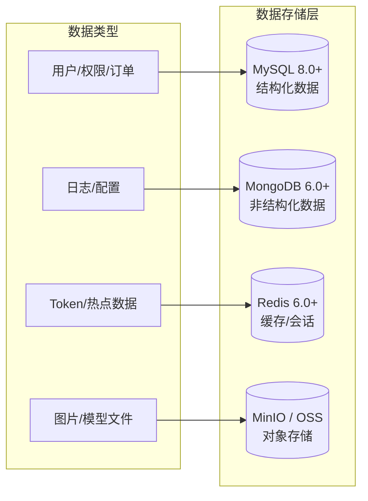
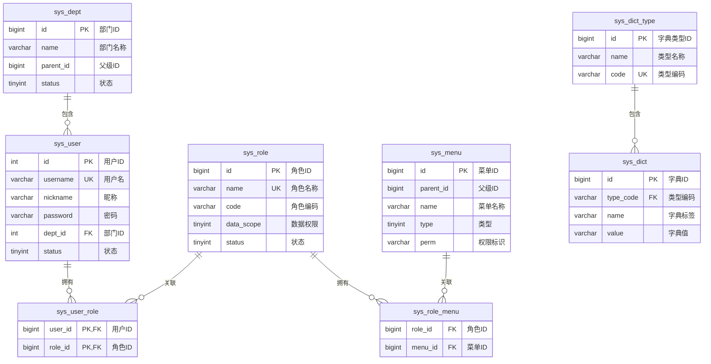
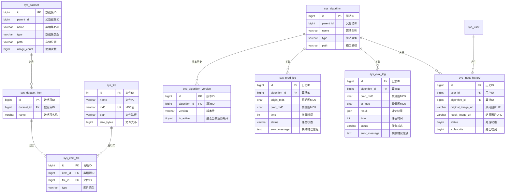

# 图像去雾系统 - 数据库设计

## 1. 文档概述

### 1.1 文档目的

本文档描述图像去雾系统的数据库设计，包括数据库选型、表结构设计、索引策略、关系模型和数据存储规范。**表结构权威定义以 `config/sql/schema.sql` 为准**，本文档仅说明设计意图、关键字段语义、枚举值与索引策略，不重复 DDL 细节。

### 1.2 适用范围

本文档适用于后端开发人员、DBA 及相关技术管理人员。

### 1.3 SQL 文件位置

数据库脚本存放在项目根目录 `config/sql/` 下，三个后端（dehaze-java / dehaze-go / dehaze-python）共享同一套 schema：

| 文件 | 说明 |
|------|------|
| `config/sql/schema.sql` | 全量建表语句（DROP + CREATE），用于全新初始化。不含 `CREATE DATABASE`/`USE`，数据库由 Docker `MYSQL_DATABASE` 环境变量自动创建 |
| `config/sql/data.sql` | 初始化数据（菜单、角色、字典、部门等） |

> **Docker 初始化**：MySQL 容器通过 `MYSQL_DATABASE=dehaze` 自动建库，`schema.sql` 和 `data.sql` 挂载到 `docker-entrypoint-initdb.d/` 按序执行。
>
> **测试复用**：dehaze-java 测试通过 Maven `maven-resources-plugin` 自动从 `config/sql/` 复制 `schema.sql` 和 `data.sql` 到测试 classpath，无需维护测试副本。详见 `dehaze-java/src/test/resources/db/README.md`。

---

## 2. 数据库选型

### 2.1 多数据库架构

系统采用多种数据库技术来满足不同的数据存储需求：



### 2.2 数据库职责划分

| 数据库 | 版本 | 用途 | 存储内容 |
|-------|------|------|---------|
| **MySQL** | 8.0+ | 主数据库 | 用户、角色、菜单、部门、字典、数据集、算法模型、文件元数据 |
| **MongoDB** | 6.0+ | 日志数据库 | 操作日志、处理记录、非结构化配置 |
| **Redis** | 6.0+ | 缓存数据库 | Token 存储、会话管理、热点数据缓存、分布式锁 |
| **MinIO/OSS** | - | 对象存储 | 图片文件、算法模型权重文件、导出文件 |

---

## 3. ER 关系图

### 3.1 系统管理模块 ER 图



### 3.2 业务模块 ER 图



---

## 4. 表结构设计

> **权威 SQL 定义**：见 `config/sql/schema.sql`。本节仅说明各表的设计意图、关键字段语义和枚举值，不重复完整 DDL。

所有核心业务表统一包含以下审计字段：
- `create_time` / `update_time`：datetime，默认 `CURRENT_TIMESTAMP`，`update_time` 带 `ON UPDATE CURRENT_TIMESTAMP`
- `create_by` / `update_by`：bigint，由各端审计填充器自动注入（无安全上下文时回退系统用户 ID）

### 4.1 系统管理模块

#### 4.1.1 用户表 (sys_user)

存储用户基本信息，关联部门与角色。

| 关键字段 | 类型 | 说明 |
|---------|------|------|
| `username` | varchar(64) | 登录用户名，唯一索引 `login_name` |
| `password` | varchar(100) | BCrypt 加密存储 |
| `dept_id` | int | 关联 `sys_dept.id` |
| `status` | tinyint | 1=正常，0=禁用 |
| `deleted` | tinyint | 逻辑删除标识 |

#### 4.1.2 角色表 (sys_role)

RBAC 权限模型的核心，承载数据权限范围配置。

| 关键字段 | 类型 | 说明 |
|---------|------|------|
| `name` | varchar(64) | 角色名称，唯一索引 |
| `code` | varchar(32) | 角色编码，用于权限缓存 Key |
| `data_scope` | tinyint | 数据权限范围 |
| `deleted` | tinyint | 逻辑删除标识 |

**数据权限范围 (data_scope) 枚举**：

| 值 | 说明 |
|----|------|
| 0 | 所有数据 |
| 1 | 部门及子部门数据 |
| 2 | 本部门数据 |
| 3 | 本人数据 |

#### 4.1.3 菜单表 (sys_menu)

菜单与权限标识统一存储，通过 `type` 区分。

| 关键字段 | 类型 | 说明 |
|---------|------|------|
| `parent_id` | bigint | 父菜单 ID，0 表示根 |
| `tree_path` | varchar(255) | 父节点 ID 路径，逗号分隔 |
| `type` | tinyint | 菜单类型（见下表） |
| `path` | varchar(128) | 路由路径 |
| `component` | varchar(128) | Vue 组件路径 |
| `perm` | varchar(128) | 权限标识，格式 `模块:功能:操作` |
| `visible` | tinyint(1) | 1=显示，0=隐藏 |
| `always_show` | tinyint | 目录只有一个子路由是否始终显示 |
| `keep_alive` | tinyint | 菜单是否开启页面缓存 |

**菜单类型 (type) 枚举**：

| 值 | 说明 | path/component 要求 |
|----|------|---------------------|
| 1 | 菜单 | 必填 path 和 component |
| 2 | 目录 | 必填 path |
| 3 | 外链 | 必填 path（外部 URL） |
| 4 | 按钮 | 必填 perm（权限标识） |

#### 4.1.4 部门表 (sys_dept)

树形结构组织单位。

| 关键字段 | 类型 | 说明 |
|---------|------|------|
| `parent_id` | bigint | 父节点 ID，0 表示根 |
| `tree_path` | varchar(255) | 父节点 ID 路径，逗号分隔 |
| `status` | tinyint | 1=正常，0=禁用 |
| `deleted` | tinyint | 逻辑删除标识 |

#### 4.1.5 字典类型表 (sys_dict_type)

| 关键字段 | 类型 | 说明 |
|---------|------|------|
| `name` | varchar(50) | 类型名称 |
| `code` | varchar(50) | 类型编码，唯一索引 `type_code` |
| `status` | tinyint(1) | 0=正常，1=禁用 |

#### 4.1.6 字典数据表 (sys_dict)

| 关键字段 | 类型 | 说明 |
|---------|------|------|
| `type_code` | varchar(64) | 关联 `sys_dict_type.code` |
| `name` | varchar(50) | 字典项标签 |
| `value` | varchar(50) | 字典项值 |
| `defaulted` | tinyint | 1=默认，0=非默认 |

#### 4.1.7 用户角色关联表 (sys_user_role)

多对多关联表，联合主键 `(user_id, role_id)`。

#### 4.1.8 角色菜单关联表 (sys_role_menu)

多对多关联表，`role_id` + `menu_id` 组合。

---

### 4.2 业务模块

#### 4.2.1 数据集表 (sys_dataset)

支持树形嵌套的数据集组织。

| 关键字段 | 类型 | 说明 |
|---------|------|------|
| `parent_id` | bigint | 父数据集 ID，0 表示根 |
| `type` | varchar(64) | 数据集类型 |
| `path` | varchar(512) | 存储位置 |
| `usage_count` | bigint | 使用次数（统计字段） |
| `deleted` | tinyint | 逻辑删除标识 |

**索引**：`idx_parent_id`、`idx_name`、`idx_parent_name`、`idx_deleted`、`idx_status`、`idx_create_time`

#### 4.2.2 数据集项表 (sys_dataset_item)

| 关键字段 | 类型 | 说明 |
|---------|------|------|
| `dataset_id` | bigint | 所属数据集 ID |
| `name` | varchar(64) | 数据项名称 |

**索引**：`idx_dataset_id`

#### 4.2.3 数据项文件关联表 (sys_item_file)

数据项与文件的多对多关联，承载图片类型与场景标注元数据。

| 关键字段 | 类型 | 说明 |
|---------|------|------|
| `item_id` | bigint | 数据项 ID |
| `file_id` | bigint | 文件 ID |
| `thumbnail_file_id` | bigint | 缩略图文件 ID |
| `type` | varchar(64) | 图片类型（见下表） |
| `scene_type` | varchar(64) | 场景类型 |
| `haze_level` | varchar(32) | 雾霾程度标识，支持多种规范：`light/medium/heavy`（人工分级）、`beta=0.5`（β参数）、`A=0.8,beta=0.2`（大气光A+β双参数）、空值表示未标注或无雾 |
| `width` / `height` | int | 图片尺寸 |
| `usage_count` | bigint | 使用次数 |

**索引**：`idx_item_id_file_id`

**图片类型 (type) 枚举**：

| 值 | 说明 |
|----|------|
| `hazy` | 雾霾图 |
| `clear` | 清晰图（GT） |
| `trans` | 透射率图 |
| `depth` | 深度图 |
| `segment` | 分割图 |

#### 4.2.4 算法模型表 (sys_algorithm)

| 关键字段 | 类型 | 说明 |
|---------|------|------|
| `parent_id` | bigint | 父算法 ID，0 表示根 |
| `type` | varchar(100) | 模型类型，关联字典 `sys_algorithm_type` |
| `version` | varchar(50) | 算法版本号 |
| `name` | varchar(64) | 模型名称 |
| `path` | varchar(255) | 模型存储路径 |
| `params` | varchar(255) | 模型参数量 |
| `flops` | varchar(255) | 模型浮点运算次数 |
| `import_path` | varchar(255) | 模型代码导入路径 |
| `description` | varchar(2048) | 详细描述 |
| `status` | tinyint(1) | 算法生命周期状态（见下表） |
| `audit_by` | bigint | 审核人 ID |
| `audit_time` | datetime | 审核时间 |
| `audit_remark` | varchar(500) | 审核备注（驳回原因） |

> 注意：此 `status` 字段表示算法生命周期状态（6 种值），与其他表的启用/禁用状态（2 种值）含义不同。

**算法类型 (type) 字典**：关联字典表 `sys_algorithm_type`，初始值：

| dict_value | dict_label | 说明 |
|------------|------------|------|
| `traditional` | 传统算法 | DCP、CAP 等 |
| `deep_learning` | 深度学习 | CNN、ResNet 等 |
| `transformer` | Transformer | ViT、Swin 等 |

> 用户可通过字典管理自行扩展算法类型（如 GAN、Diffusion 等）

**算法状态 (status) 枚举**：

| 值 | 说明 |
|----|------|
| 0 | 草稿 |
| 1 | 测试中 |
| 2 | 待审核 |
| 3 | 已发布 |
| 4 | 已停用 |
| 5 | 已归档 |

#### 4.2.5 算法版本历史表 (sys_algorithm_version)

每次算法发布新版本时，保存当前配置快照到版本历史表。

| 关键字段 | 类型 | 说明 |
|---------|------|------|
| `algorithm_id` | bigint | 关联算法 ID |
| `version` | varchar(50) | 版本号 |
| `change_log` | TEXT | 变更日志 |
| `status` | int | 该版本时的状态快照 |
| `config_json` | TEXT | 该版本时的配置 JSON 快照 |
| `model_file_id` | bigint | 模型文件 ID |
| `is_active` | tinyint(1) | 是否当前活跃版本（0=否，1=是），同一算法只有一个活跃版本 |

**索引**：`uk_algo_version (algorithm_id, version)` 唯一索引、`idx_algorithm_id`

**版本回滚**：将目标版本的配置恢复到主表，并更新 `is_active` 标记。

#### 4.2.6 图像输入历史表 (sys_input_history)

记录用户图像去雾操作历史。

| 关键字段 | 类型 | 说明 |
|---------|------|------|
| `user_id` | bigint | 用户 ID |
| `original_image_url` | varchar(500) | 原始图片 URL |
| `original_thumbnail_url` | varchar(500) | 原始缩略图 URL |
| `result_image_url` | varchar(500) | 处理结果图片 URL |
| `result_thumbnail_url` | varchar(500) | 结果缩略图 URL |
| `algorithm_id` | bigint | 算法 ID |
| `algorithm_name` | varchar(100) | 算法名称（冗余字段，避免 join） |
| `algorithm_params` | TEXT | 算法参数 JSON |
| `processing_time` | int | 处理耗时（毫秒） |
| `status` | tinyint | 处理状态（见下表） |
| `input_source` | varchar(20) | 图片来源（见下表） |
| `is_favorite` | tinyint(1) | 是否收藏 |
| `sync_status` | tinyint | 同步状态（0=未同步，1=已同步） |

**索引**：`idx_user_time (user_id, create_time DESC)`、`idx_user_favorite (user_id, is_favorite, create_time DESC)`

**处理状态 (status) 枚举**：

| 值 | 说明 |
|----|------|
| 1 | 成功 |
| 2 | 失败 |
| 3 | 处理中 |

**图片来源 (input_source) 枚举**：

| 值 | 说明 |
|----|------|
| `upload` | 用户上传 |
| `camera` | 摄像头拍摄 |
| `sample` | 示例图片 |

#### 4.2.7 文件表 (sys_file)

| 关键字段 | 类型 | 说明 |
|---------|------|------|
| `name` | varchar(100) | 文件原始名 |
| `object_name` | varchar(100) | 文件存储名（MinIO 对象名） |
| `size` | varchar(100) | 文件大小（格式化显示） |
| `size_bytes` | bigint | 文件大小（原始字节数） |
| `path` | varchar(255) | 文件路径 |
| `md5` | char(32) | 文件 MD5 值，唯一索引 `md5_key` |

**MD5 去重机制**：系统通过 MD5 值唯一索引实现文件去重，相同内容的文件只存储一份。

---

### 4.3 日志模块

#### 4.3.1 预测日志表 (sys_pred_log)

记录算法预测操作的日志，支持基于算法+原图MD5的缓存查询，并通过 `status` 字段追踪异步任务状态。

| 关键字段 | 类型 | 说明 |
|---------|------|------|
| `algorithm_id` | bigint | 算法 ID |
| `origin_file_id` | bigint | 原始图像文件 ID |
| `origin_md5` | char(32) | 原始图像 MD5 |
| `origin_url` | TEXT | 原始图像 URL |
| `pred_file_id` | bigint | 预测图像文件 ID |
| `pred_md5` | char(32) | 预测图像 MD5 |
| `pred_url` | TEXT | 预测图像 URL |
| `time` | int | 推理时间（毫秒） |
| `status` | varchar(20) | 任务状态：`processing` / `completed` / `failed`，默认 `completed`（历史记录兼容） |
| `error_message` | text | 失败时的错误信息（`status=failed` 时填充） |

**索引**：`idx_algorithm_id`、`idx_origin_md5`、`idx_pred_md5`、`idx_status`

#### 4.3.2 评估日志表 (sys_eval_log)

记录算法评估操作日志，存储 PSNR/SSIM 等评估指标，并通过 `status` 字段追踪异步任务状态。

| 关键字段 | 类型 | 说明 |
|---------|------|------|
| `algorithm_id` | bigint | 算法 ID |
| `pred_file_id` | bigint | 预测图像文件 ID |
| `pred_md5` | char(32) | 预测图像 MD5 |
| `pred_url` | TEXT | 预测图像 URL |
| `gt_file_id` | bigint | 真值图像文件 ID |
| `gt_md5` | char(32) | 真值图像 MD5 |
| `gt_url` | TEXT | 真值图像 URL |
| `time` | int | 评估时间（毫秒） |
| `result` | json | 评估结果（PSNR/SSIM 等） |
| `status` | varchar(20) | 任务状态：`processing` / `completed` / `failed`，默认 `completed`（历史记录兼容） |
| `error_message` | text | 失败时的错误信息（`status=failed` 时填充） |

**索引**：`idx_algorithm_id`、`idx_pred_md5`、`idx_gt_md5`、`idx_status`

**result 字段 JSON 结构示例**：

```json
{
  "psnr": 28.56,
  "ssim": 0.9234,
  "lpips": 0.0856,
  "niqe": 3.45,
  "entropy": 7.23
}
```

**评估指标说明**：

| 指标 | 说明 | 取值范围 |
|------|------|---------|
| `psnr` | 峰值信噪比 | 越高越好（通常 >30dB 为好） |
| `ssim` | 结构相似性 | 0-1，越接近 1 越好 |
| `lpips` | 学习感知图像块相似度 | 0-1，越低越好 |
| `niqe` | 自然图像质量评价 | 越低越好 |
| `entropy` | 信息熵 | 越高越好 |

#### 4.3.3 任务表 (sys_task)

异步任务调度主表，配合 RabbitMQ 实现生产消费分离。

| 关键字段 | 类型 | 说明 |
|---------|------|------|
| `task_id` | varchar(64) | 任务 ID（UUID），唯一索引 `idx_task_id` |
| `task_type` | varchar(32) | 任务类型（dataset_export/item_download/batch_download/custom_export） |
| `status` | varchar(32) | 任务状态，默认 `PENDING`（见下表） |
| `progress` | int | 任务进度（百分比） |
| `total_files` / `processed_files` | int | 总文件数 / 已处理文件数 |
| `params` | TEXT | 任务参数 JSON |
| `result` | TEXT | 任务结果（下载链接） |
| `error_message` | TEXT | 错误信息 |
| `started_at` / `completed_at` / `expires_at` | datetime | 开始/完成/过期时间 |
| `idempotency_key` | varchar(64) | 客户端幂等键（HTTP Idempotency-Key 头），唯一索引 `idx_idempotency_key` |
| `retry_count` | int | MQ 重试次数 |
| `worker_id` | varchar(64) | 执行 Worker 标识 |

**索引**：`idx_task_id`（唯一）、`idx_idempotency_key`（唯一）、`idx_status`、`idx_create_by`、`idx_create_time`

**任务状态 (status) 枚举**：

| 值 | 说明 |
|----|------|
| `PENDING` | 待执行 |
| `PROCESSING` | 执行中 |
| `COMPLETED` | 已完成 |
| `FAILED` | 已失败 |
| `CANCELLED` | 已取消 |

---

### 4.4 扩展模块

#### 4.4.1 WPX 文件表 (sys_wpx_file)

WPX 数据集文件映射表，记录原始文件与 WPX 格式新文件的对应关系。

| 关键字段 | 类型 | 说明 |
|---------|------|------|
| `origin_file_id` | bigint | 旧文件 ID |
| `origin_md5` | char(32) | 旧文件 MD5，唯一约束 |
| `origin_path` | varchar(255) | 旧文件路径 |
| `new_file_id` | bigint | 新文件 ID |
| `new_path` | varchar(255) | 新文件路径 |
| `new_md5` | char(32) | 新文件 MD5，唯一约束 |

**索引**：`idx_origin_md5`

#### 4.4.2 API 密钥表 (sys_api_key)

API 密钥表，存储用户创建的长期鉴权密钥。密钥明文仅在创建时返回一次，数据库存储 SHA-256 哈希值。三端（Java/Go/Python）共享此表，同一密钥可在任意后端通过 `Authorization: Bearer dhak_xxx` 鉴权。

| 关键字段 | 类型 | 说明 |
|---------|------|------|
| `user_id` | bigint | 所属用户 ID |
| `name` | varchar(128) | 密钥名称 |
| `key_prefix` | varchar(16) | 密钥前缀（用于识别，如 `dhak_ab3x`） |
| `key_hash` | varchar(64) | 密钥 SHA-256 哈希，唯一约束 |
| `status` | tinyint | 状态（1:启用；0:禁用） |
| `expires_at` | datetime | 过期时间（NULL 表示永不过期） |
| `last_used_at` | datetime | 最后使用时间 |

**索引**：`uk_key_hash`（唯一）、`idx_user_id`（普通）

---

## 5. 索引设计策略

### 5.1 索引类型说明

| 索引类型 | 使用场景 | 示例 |
|---------|---------|------|
| **主键索引** | 各表 `id` 字段 | `PRIMARY KEY (id)` |
| **唯一索引** | 需要唯一性约束的字段 | `username`, `code`, `md5` |
| **普通索引** | 经常查询的字段 | `parent_id`, `status`, `create_time` |
| **复合索引** | 多字段组合查询 | `(parent_id, name)`, `(item_id, file_id)` |

### 5.2 各表索引清单

> 完整索引定义见 `config/sql/schema.sql`，本表仅列出非主键索引。

| 表名 | 索引名 | 索引字段 | 索引类型 | 说明 |
|------|--------|---------|---------|------|
| sys_user | login_name | username | 唯一 | 用户名唯一 |
| sys_role | name | name | 唯一 | 角色名唯一 |
| sys_dict_type | type_code | code | 唯一 | 字典类型编码唯一 |
| sys_dataset | idx_parent_id | parent_id | 普通 | 树形查询 |
| sys_dataset | idx_name | name | 普通 | 按名称查询 |
| sys_dataset | idx_parent_name | (parent_id, name) | 复合 | 父级+名称组合查询 |
| sys_dataset | idx_deleted | deleted | 普通 | 逻辑删除过滤 |
| sys_dataset | idx_status | status | 普通 | 状态过滤 |
| sys_dataset | idx_create_time | create_time | 普通 | 时间排序 |
| sys_dataset_item | idx_dataset_id | dataset_id | 普通 | 按数据集查询 |
| sys_item_file | idx_item_id_file_id | (item_id, file_id) | 复合 | 按数据项+文件查询 |
| sys_file | md5_key | md5 | 唯一 | 文件 MD5 去重 |
| sys_algorithm_version | uk_algo_version | (algorithm_id, version) | 唯一 | 算法+版本号唯一 |
| sys_algorithm_version | idx_algorithm_id | algorithm_id | 普通 | 按算法查询版本 |
| sys_input_history | idx_user_time | (user_id, create_time DESC) | 复合 | 用户历史按时间倒序 |
| sys_input_history | idx_user_favorite | (user_id, is_favorite, create_time DESC) | 复合 | 用户收藏历史 |
| sys_task | idx_task_id | task_id | 唯一 | 任务 UUID 查询 |
| sys_task | idx_idempotency_key | idempotency_key | 唯一 | 幂等键去重 |
| sys_task | idx_status | status | 普通 | 按状态查询 |
| sys_task | idx_create_by | create_by | 普通 | 按创建人查询 |
| sys_task | idx_create_time | create_time | 普通 | 时间排序 |
| sys_wpx_file | idx_origin_md5 | origin_md5 | 普通 | 按原文件 MD5 查询 |
| sys_pred_log | idx_algorithm_id | algorithm_id | 普通 | 按算法查询 |
| sys_pred_log | idx_origin_md5 | origin_md5 | 普通 | 按原图 MD5 查询 |
| sys_pred_log | idx_pred_md5 | pred_md5 | 普通 | 按预测图 MD5 查询 |
| sys_pred_log | idx_status | status | 普通 | 异步任务状态查询（僵尸任务恢复） |
| sys_eval_log | idx_algorithm_id | algorithm_id | 普通 | 按算法查询 |
| sys_eval_log | idx_pred_md5 | pred_md5 | 普通 | 按预测图 MD5 查询 |
| sys_eval_log | idx_gt_md5 | gt_md5 | 普通 | 按真值图 MD5 查询 |
| sys_eval_log | idx_status | status | 普通 | 异步任务状态查询（僵尸任务恢复） |
| sys_api_key | uk_key_hash | key_hash | 唯一 | 密钥哈希查找 |
| sys_api_key | idx_user_id | user_id | 普通 | 按用户查询密钥 |

---

## 6. 数据库配置

### 6.1 连接池配置（HikariCP）

```yaml
spring:
  datasource:
    hikari:
      minimum-idle: 10          # 最小空闲连接数
      maximum-pool-size: 50     # 最大连接数
      idle-timeout: 600000      # 空闲连接超时时间 (10分钟)
      max-lifetime: 1800000     # 连接最大生命周期 (30分钟)
      connection-timeout: 30000 # 连接超时时间 (30秒)
```

### 6.2 MySQL 配置优化

```ini
[mysqld]
# 字符集
character-set-server = utf8mb4
collation-server = utf8mb4_general_ci

# InnoDB 配置
innodb_buffer_pool_size = 2G
innodb_log_file_size = 256M
innodb_flush_log_at_trx_commit = 2

# 连接数
max_connections = 500

# 慢查询日志
slow_query_log = 1
long_query_time = 2
```

### 6.3 Redis 配置

```yaml
spring:
  redis:
    host: localhost
    port: 6379
    password: your_password
    database: 0
    lettuce:
      pool:
        max-active: 100
        max-idle: 50
        min-idle: 10
        max-wait: 3000ms
```

---

## 7. 数据存储规范

### 7.1 命名规范

| 类型 | 规范 | 示例 |
|------|------|------|
| 表名 | 小写 + 下划线，`sys_` 前缀 | `sys_user`, `sys_dataset` |
| 字段名 | 小写 + 下划线 | `create_time`, `parent_id` |
| 索引名 | `idx_` 前缀 + 字段名 | `idx_parent_id`, `idx_status` |
| 唯一索引 | `uk_` 前缀 + 字段名 | `uk_algo_version` |

### 7.2 字段规范

| 数据类型 | 建议使用 | 说明 |
|---------|---------|------|
| 主键 | `bigint` / `int` | 使用自增 |
| 状态字段 | `tinyint` | 0/1 表示禁用/启用 |
| 时间字段 | `datetime` | 统一使用 datetime |
| 长文本 | `TEXT` | URL、描述等长字段 |
| JSON 数据 | `json` | MySQL 8.0 原生 JSON 类型 |
| MD5 值 | `char(32)` | 固定 32 位长度 |

### 7.3 逻辑删除规范

所有核心业务表使用逻辑删除：
- 字段名：`deleted`
- 类型：`tinyint`
- 值：`0` = 未删除，`1` = 已删除
