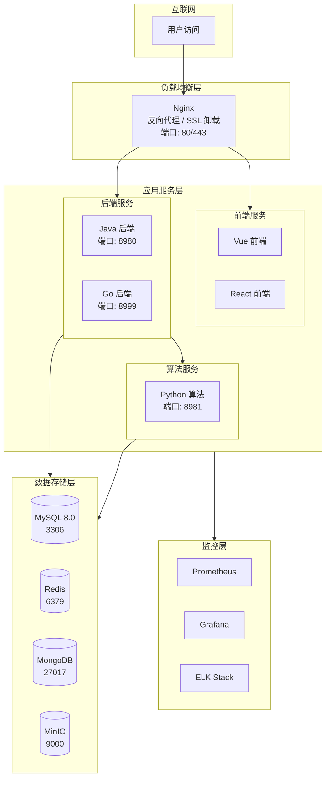

# 部署架构

## 1. 文档概述

### 1.1 文档目的

描述图像去雾系统的部署架构设计，包括部署模式、环境规划、服务编排和监控体系。

### 1.2 适用范围

本文档适用于运维人员、DevOps 工程师和需要进行系统部署的开发人员。

---

## 2. 部署架构概览

### 2.1 架构图



### 2.2 部署模式

| 部署模式 | 适用场景 | 说明 |
|---------|---------|------|
| **单机部署** | 开发/测试环境 | 所有服务部署在一台服务器 |
| **Docker Compose** | 小型生产环境 | 容器化部署，方便管理 |
| **Kubernetes** | 中大型生产环境 | 集群部署，高可用、自动扩缩容 |

---

## 3. 服务组件

### 3.1 应用服务

| 服务 | 技术栈 | 端口 | 说明 |
|------|--------|------|------|
| **Vue 前端** | Vue3 + Vite | - | 静态资源，由 Nginx 托管 |
| **React 前端** | React + Vite | - | 静态资源，由 Nginx 托管 |
| **Java 后端** | Spring Boot 3 | 8980 | 核心业务服务 |
| **Go 后端** | Gin + GORM | 8999 | 备选业务服务 |
| **Python 算法** | Flask + PyTorch | 8981 | 去雾算法服务 |

### 3.2 基础设施

| 服务 | 版本 | 端口 | 用途 |
|------|------|------|------|
| **Nginx** | stable | 80/443 | 反向代理、SSL 卸载、静态资源 |
| **MySQL** | 8.4+ | 3306 | 关系型数据库 |
| **Redis** | 7.x | 6379 | 缓存、会话存储 |
| **MongoDB** | 7.x | 27017 | 文档存储（算法结果） |
| **MinIO** | latest | 9000/9090 | 对象存储（图片/数据集） |

### 3.3 监控组件

| 服务 | 端口 | 用途 |
|------|------|------|
| **Prometheus** | 9091 | 指标采集 |
| **Grafana** | 3000 | 监控面板 |
| **Elasticsearch** | 9200 | 日志存储 |
| **Kibana** | 5601 | 日志可视化 |
| **Logstash** | 4560 | 日志收集 |

---

## 4. 环境规划

### 4.1 环境定义

| 环境 | 用途 | 数据库 | 部署方式 |
|------|------|--------|---------|
| **开发环境** | 本地开发调试 | SQLite/H2 内存库 | 本地启动 |
| **测试环境** | 集成测试、E2E 测试 | MySQL Docker | Docker Compose |
| **预发布环境** | 发布前验证 | 独立测试库 | Docker Compose |
| **生产环境** | 正式运行 | 生产数据库 | Docker Compose / K8s |

### 4.2 服务器配置建议

| 服务类型 | CPU | 内存 | 存储 | 说明 |
|---------|-----|------|------|------|
| **Web 服务器** | 2 核+ | 4 GB+ | 50 GB SSD | Nginx + 前端静态资源 |
| **业务服务器** | 4 核+ | 8 GB+ | 100 GB SSD | Java/Go 后端服务 |
| **算法服务器** | 8 核+ | 16 GB+ | 200 GB SSD | Python 算法服务 |
| **GPU 服务器** | 8 核+ | 32 GB+ | 500 GB SSD | 深度学习推理（显存 ≥ 8GB） |
| **数据库服务器** | 4 核+ | 16 GB+ | 500 GB SSD | MySQL + Redis + MongoDB |
| **存储服务器** | 2 核+ | 8 GB+ | 1 TB+ | MinIO 对象存储 |

---

## 5. 请求路由

### 5.1 路由规则

| 路径前缀 | 转发目标 | 说明 |
|---------|---------|------|
| `/` | 静态资源 | Vue/React 前端页面 |
| `/java-api/*` | Java 后端 (8980) | 业务服务接口 |
| `/py-api/*` | Python 后端 (8981) | 算法服务接口 |
| `/go-api/*` | Go 后端 (8999) | 备选业务接口 |

### 5.2 特殊配置

| 配置项 | 值 | 说明 |
|--------|-----|------|
| 请求体大小限制 | 100MB | 支持大文件上传 |
| 算法接口超时 | 300s | 去雾处理耗时较长 |
| WebSocket | 支持 | 实时进度推送 |

---

## 6. CI/CD 流程

### 6.1 流程概览

```
代码提交 → 代码构建 → 自动化测试 → 打包制品 → 自动部署 → 验证测试 → 发布上线
```

### 6.2 构建产物

| 项目 | 构建命令 | 产物 |
|------|---------|------|
| **Vue 前端** | `pnpm build:prod` | `dist/` 目录 |
| **React 前端** | `pnpm build` | `dist/` 目录 |
| **Java 后端** | `mvn package` | `target/*.jar` |
| **Python 算法** | - | 源码 + requirements.txt |

### 6.3 部署检查清单

- [ ] 环境变量已配置（数据库密码、密钥等）
- [ ] 数据库已初始化
- [ ] 存储目录已挂载
- [ ] 端口未被占用
- [ ] 健康检查通过

---

## 7. 监控与告警

### 7.1 监控体系

```
应用服务 → 指标采集(Prometheus) → 存储(TSDB) → 可视化(Grafana)
    ↓
日志输出 → 日志采集(Filebeat) → 存储(ES) → 分析(Kibana)
    ↓
异常检测 → 告警管理(AlertManager) → 通知(邮件/钉钉)
```

### 7.2 关键告警指标

| 指标类别 | 指标 | 告警阈值 |
|---------|------|---------|
| **系统资源** | CPU 使用率 | > 80% |
| | 内存使用率 | > 85% |
| | 磁盘使用率 | > 90% |
| **应用性能** | 接口响应时间 | > 3s |
| | 错误率 | > 1% |
| **业务指标** | 去雾处理成功率 | < 95% |
| | 队列积压数量 | > 100 |
| **数据库** | 连接池使用率 | > 80% |
| | 慢查询数量 | > 10/min |

### 7.3 日志保留策略

| 日志类型 | 保留周期 |
|---------|---------|
| 应用日志 | 30 天 |
| 访问日志 | 90 天 |
| 错误日志 | 180 天 |
| 审计日志 | 1 年 |

---

## 8. 备份策略

| 数据类型 | 备份频率 | 保留周期 | 备份方式 |
|---------|---------|---------|---------|
| **MySQL** | 每日全量 + Binlog | 30 天 | mysqldump + 增量 |
| **MongoDB** | 每日全量 | 14 天 | mongodump |
| **Redis** | 每 6 小时 RDB | 7 天 | RDB 快照 |
| **MinIO 文件** | 每日增量 | 30 天 | 跨桶同步 |
| **配置文件** | 每次变更 | 永久 | Git 版本控制 |

---

## 9. 安全加固

### 9.1 网络安全

| 措施 | 说明 |
|-----|------|
| 防火墙规则 | 仅开放必要端口（80/443） |
| 内网隔离 | 数据库等服务仅内网访问 |
| HTTPS | 生产环境强制 HTTPS |
| WAF | Web 应用防火墙防护 |

### 9.2 部署安全检查清单

- [ ] 修改默认密码（MySQL、Redis、MinIO 等）
- [ ] 配置 HTTPS 证书
- [ ] 限制数据库远程访问
- [ ] 配置防火墙规则
- [ ] 启用日志审计
- [ ] 定期更新系统和依赖
- [ ] 容器使用非 root 用户运行

---

## 10. 配置文件参考

> **注**：以下配置文件存放在项目仓库中，此处仅列出路径，具体内容以项目实际文件为准。

| 配置类型 | 文件路径 |
|---------|---------|
| **Docker Compose** | `docker-compose.yml` |
| **环境变量** | `.env` |
| **Nginx 配置** | `config/nginx/dataset.conf` |
| **Prometheus 配置** | `config/prometheus/prometheus.yml` |
| **Redis 配置** | `config/redis/redis.conf` |
| **Logstash 配置** | `config/logstash/logstash.conf` |
| **Kafka JAAS 配置** | `config/kafka/kafka_jaas.conf` |
| **数据库初始化 SQL** | `config/sql/schema.sql`、`config/sql/data.sql` |
| **Kubernetes 配置** | `config/kube/config` |
| **Java Dockerfile** | `dehaze-java/Dockerfile` |
| **Python Dockerfile** | `dehaze-python/Dockerfile` |
| **Vue Dockerfile** | `dehaze-front-vue/Dockerfile` |
