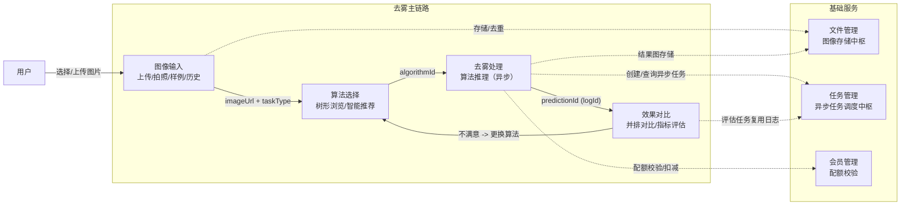
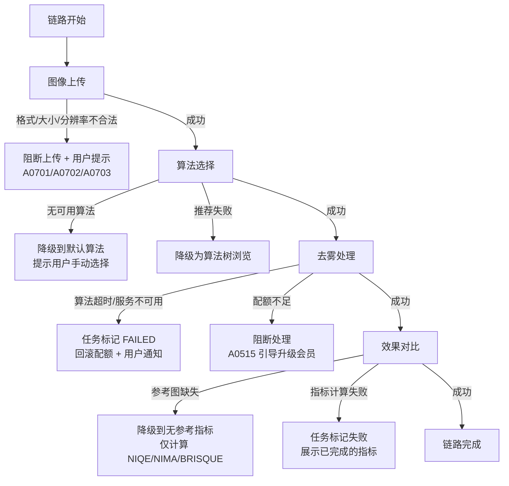
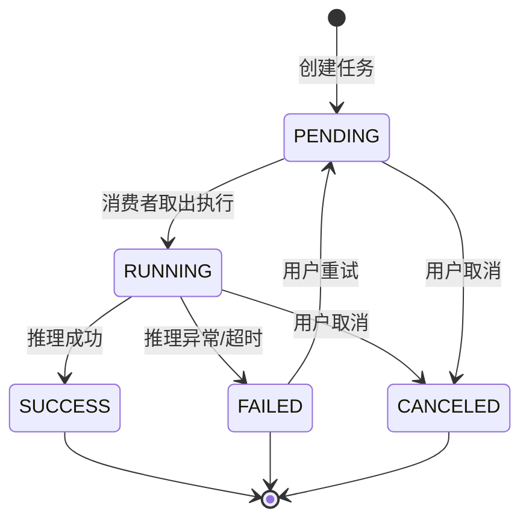

# 去雾主链路协作设计

## 1. 文档概述

### 1.1 文档目的

本文档描述图像处理平台核心业务链路——"图像输入 -> 算法选择 -> 去雾处理 -> 效果对比"的跨模块数据流、数据传递契约、异常处理链路与异步任务调度机制，为各核心模块的协作提供统一架构指导。

### 1.2 业务价值与技术挑战

| 维度 | 说明 |
|------|------|
| **业务价值** | 去雾主链路是用户使用平台的核心路径，端到端体验直接影响用户留存。单图快速体验流程目标 < 1 分钟，从图像输入到效果对比全链路贯通 |
| **技术挑战** | 四个核心模块串行协作但需异步解耦；GPU 推理资源受限需并发控制；算法服务与业务服务跨语言栈（Java/Go ↔ Python）；处理失败需精确回滚配额并通知用户 |

### 1.3 相关文档

| 文档 | 说明 |
|------|------|
| [01-总体架构设计](./01-总体架构设计.md) | 系统分层架构、数据流总览 |
| [03-数据库设计](./03-数据库设计.md) | `sys_pred_log`、`sys_eval_log`、`sys_task` 表结构 |
| [图像输入/需求规格](../03-模块设计/核心模块/图像输入/需求规格.md) | 图像输入模块功能与数据契约 |
| [算法选择/需求规格](../03-模块设计/核心模块/算法选择/需求规格.md) | 算法选择与推荐 |
| [去雾处理/需求规格](../03-模块设计/核心模块/去雾处理/需求规格.md) | 图像处理引擎 |
| [效果对比/需求规格](../03-模块设计/核心模块/效果对比/需求规格.md) | 效果评估与对比 |
| [任务管理/需求规格](../03-模块设计/基础模块/任务管理/需求规格.md) | 异步任务调度 |
| [文件管理/后端实现](../03-模块设计/基础模块/文件管理/后端实现.md) | 文件存储抽象 |

***

## 2. 主链路数据流

### 2.1 数据流总览

### 2.2 链路阶段说明

| 阶段 | 模块 | 产出 | 协作要点 |
|------|------|------|---------|
| 图像输入 | 图像输入 | `imageUrl`、`taskType`、`source` | 复用文件管理上传能力，MD5 去重跳过重复存储 |
| 算法选择 | 算法选择 | `algorithmId` | 图像特征分析推荐由推荐管理模块提供；关键词推荐匹配可被 AI 对话经 MCP 调用 |
| 去雾处理 | 去雾处理 | `predictionId`（即 `sys_pred_log.id`） | 异步推理，配额预校验；缓存命中（MD5）直接返回结果 |
| 效果对比 | 效果对比 | 评估指标 + 对比报告 | 评估为异步任务模式，复用 `sys_eval_log` 表，不走任务管理模块 |

***

## 3. 关键数据传递契约

### 3.1 契约矩阵

| 数据契约 | 产出方 | 消费方 | 传递载体 | 说明 |
|---------|--------|--------|---------|------|
| `imageUrl` | 图像输入 | 算法选择 / 去雾处理 | 预测请求体 | 原始图片 URL，由文件管理运行时拼接，不落库 |
| `taskType` | 图像输入 | 去雾处理 | 预测请求体 | 任务类型（dehaze/derain/desnow/lowlight/super_resolution/denoise/inpaint），必填 |
| `algorithmId` | 算法选择 | 去雾处理 | 预测请求体 | 选定算法 ID；样例推荐或历史记录可携带 |
| `predictionId` | 去雾处理 | 效果对比 | 路径参数 / 请求体 | 即 `sys_pred_log.id`，效果对比与报告导出均以此为关联键 |
| `taskId` | 任务管理 | 各模块 | 任务查询接口 | 异步任务统一标识，各模块通过 `GET /api/v1/tasks/{taskId}` 查询状态 |

### 3.2 历史记录回写契约

去雾处理完成后向图像输入模块回写历史记录，数据闭环：

| 回写字段 | 来源 | 说明 |
|---------|------|------|
| 原图/结果图 URL | 文件管理 | 缩略图 150×150px |
| 算法 ID/名称/参数 | 去雾处理请求参数 | 记录本次使用的算法与参数 |
| 处理状态 | 去雾处理结果 | 1 成功 / 2 失败 / 3 处理中 |
| 处理耗时 | 去雾处理日志 | 单位：秒 |

> 历史记录由去雾处理模块在处理完成/失败时调用 `POST /api/v1/image-input/history` 创建，前端本地历史（localStorage）在上传成功后同步创建。

***

## 4. 异常处理链路

### 4.1 异常处理流程图

### 4.2 异常处理策略

| 异常场景 | 错误码 | 处理策略 | 用户感知 |
|---------|--------|---------|---------|
| 图像上传：格式不支持 | `A0701` | 阻断上传，展示支持格式列表 | "不支持该图片格式，请选择 JPG/PNG/WEBP" |
| 图像上传：文件过大 | `A0702` | 阻断上传，提供压缩选项 | "图片大小超过 {limit}MB" |
| 图像上传：分辨率不足 | `A0703` | 警告但允许，提示效果可能不佳 | "分辨率过低，建议 ≥640×480" |
| 算法选择：无可用算法 | - | 降级到默认算法或引导切换任务类型 | "该任务类型暂无可用算法" |
| 算法选择：推荐接口异常 | - | 降级为算法树浏览 | "图像分析失败，请手动选择" |
| 去雾处理：算法超时 | `B0100` | 任务标记失败，回滚配额 | 错误提示 + 重试面板（指数退避） |
| 去雾处理：配额不足 | `A0515` | 阻断处理 | "本月次数已用完" + 升级引导 |
| 效果对比：参考图缺失 | `B0001` | 降级为无参考指标 | 仅展示 NIQE/NIMA/BRISQUE |
| 效果对比：指标计算失败 | - | 展示已完成的部分指标 | "部分指标计算失败" |

> 去雾处理失败的重试机制：自动重试采用指数退避（2s -> 4s -> 8s），最大 3 次；超限后仅保留手动重试。

***

## 5. 异步任务状态机

### 5.1 任务状态流转

### 5.2 状态变更触发点与通知机制

| 状态变更 | 触发模块 | 触发条件 | 通知机制 |
|---------|---------|---------|---------|
| -> PENDING | 去雾处理 | 用户提交预测请求 | 返回 taskId，前端进入进度展示 |
| PENDING -> RUNNING | 算法服务 | 消费者从 MQ 取出消息 | WebSocket 推送进度（5 阶段） |
| RUNNING -> SUCCESS | 算法服务 | 推理完成，结果图存储完成 | WebSocket 推送完成 + 自动跳转对比页 |
| RUNNING -> FAILED | 算法服务 | 推理异常/超时/重试耗尽 | WebSocket 推送失败 + 回滚配额 |
| RUNNING -> CANCELED | 去雾处理 | 用户调用取消接口 | 终止推理 + 回滚配额 + 更新状态 |
| FAILED -> PENDING | 去雾处理 | 用户手动重试 | 清除错误信息，重新入队执行 |

> **现状说明**：去雾处理当前使用独立异步执行（`sys_pred_log` 状态机：处理中 -> 已完成/已失败），改造目标迁移至任务管理模块的 `image_processing` 任务类型，统一由任务管理承载状态、进度与重试。

### 5.3 进度推送阶段

去雾处理进度按 5 阶段推送，阶段名按 `taskType` 动态化：

| 阶段 | 说明 | 进度范围 |
|------|------|---------|
| 预处理 | 图像读取、格式转换、尺寸校验 | 0-20% |
| 算法初始化 | 模型加载、GPU 分配 | 20-40% |
| 任务处理 | 算法推理（阶段名按 taskType：去雾处理/超分辨率重建等） | 40-80% |
| 后处理 | 结果图后处理、质量检查 | 80-95% |
| 保存 | 结果图存储、日志回写、历史记录创建 | 95-100% |

***

## 6. 性能与并发约束

### 6.1 并发与超时约束

| 约束项 | 目标值 | 说明 |
|--------|--------|------|
| 单图处理时延 | ≤ 30s | 含上传 + 推理 + 结果回写（现状 300s 轮询超时为技术债） |
| 单用户并发任务上限 | 5（单类型） | 常量已定义，待 `image_processing` 任务类型上线后启用 |
| 并发处理能力 | 100 并发 | 单实例同时处理的图像处理任务数 |
| 任务超时阈值 | 30s | 单图推理超时；超时标记失败并回滚配额 |
| 僵尸任务修复 | 30 分钟 | 定时任务检测长时间执行中的任务，标记为失败 |
| 结果保留时长 | 7 天 | 任务完成后结果文件保留期 |

### 6.2 队列优先级策略

| 策略 | 说明 |
|------|------|
| 当前调度 | 单队列 FIFO（先进先出），不支持优先级 |
| VIP 优先 | 会员权益定义了处理优先级（普通/优先/高优先/最高），待任务管理模块承载图像处理后落地 |
| 限流策略 | 超过并发上限时排队等待或返回限流提示，优先保障 VIP 任务 |
| 缓存优化 | 相同算法 + 相同图片 MD5 命中缓存（Redis，24h TTL）直接返回，跳过推理 |

### 6.3 GPU 降级策略

GPU 推理失败时自动回退 CPU 降级执行，保障可用性；回退事件记录日志，不影响用户感知。GPU 与 CPU 资源隔离，ASR 使用 CPU 不与图像处理竞争 GPU。

***

## 7. 跨模块协作要点

### 7.1 文件管理作为图像存储中枢

文件管理为去雾主链路提供统一的存储抽象，所有图像（原图、结果图、参考图）经文件管理上传、去重、存储：

- **上传去重**：MD5 指纹校验，命中已有文件直接复用引用，跳过重复存储与传输
- **存储抽象**：MinIO / Local 双实现，URL 运行时拼接不落库，环境迁移只改配置
- **结果注册**：去雾处理完成后自动注册结果文件并关联预测日志

### 7.2 任务管理作为异步调度中枢

任务管理模块为去雾主链路提供统一的异步任务调度能力（改造目标）：

- **统一任务类型**：`image_processing` 承载所有图像处理场景，按 `params.taskType` 路由算法集合
- **状态机统一**：PENDING -> RUNNING -> SUCCESS/FAILED/CANCELED，替代 `sys_pred_log` 独立状态机
- **进度真实推送**：通过 WebSocket 推送 5 阶段真实进度，替代前端模拟进度
- **失败重试与取消**：统一由任务管理提供重试（FAILED -> PENDING）与取消（回滚配额）能力

### 7.3 消息通知集成（规划中）

去雾主链路的消息通知能力当前未接入，改造目标：

| 触发事件 | 通知类型 | 通知内容 |
|---------|---------|---------|
| 单张/批量处理完成 | 业务通知 | 任务完成，点击查看效果 |
| 处理失败 | 业务通知 | 任务失败，说明失败原因 |
| 月度配额即将用尽 | 业务通知 | 剩余次数不足，建议升级会员 |

> 通知通过消息通知模块的 WebSocket 通道（`new_message` 事件）实时推送给在线用户。
