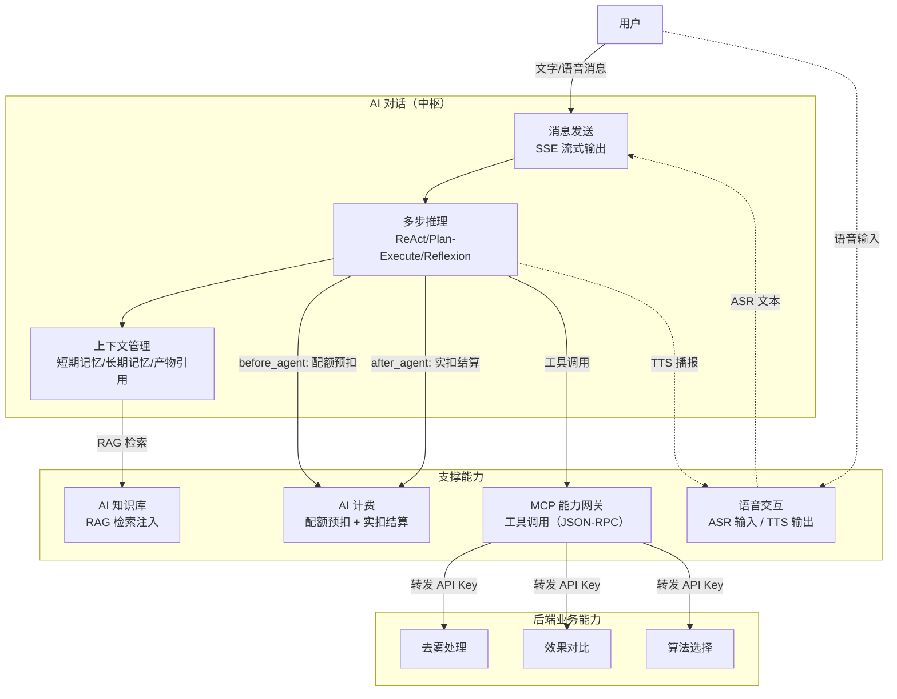
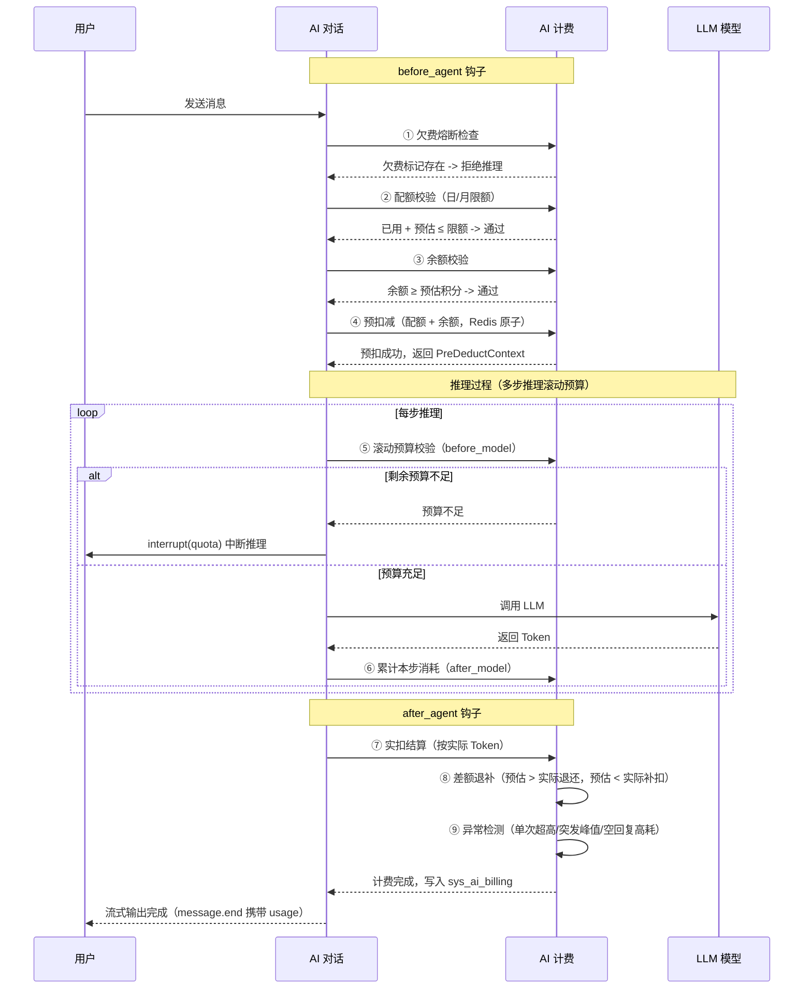
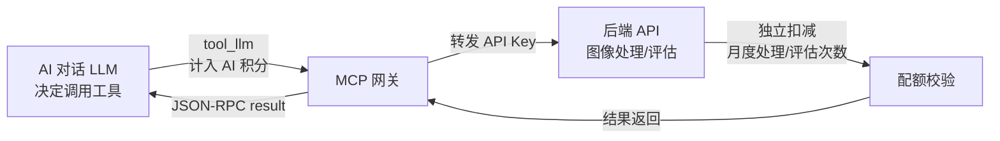
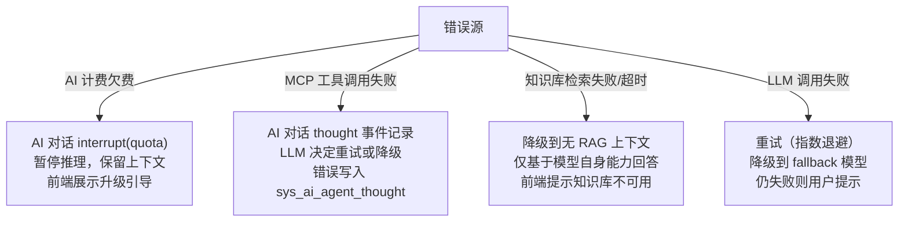

# AI 能力链路协作设计

## 1. 文档概述

### 1.1 文档目的

本文档描述 AI 工作平台核心业务链路--以 AI 对话为中枢，AI 计费、MCP 能力网关、AI 知识库、语音交互为支撑的跨模块协作机制，涵盖配额扣减时序、流式协议统一视图、工具调用计费规则与跨模块错误传播，为 AI 能力链路的协作提供统一架构指导。

### 1.2 业务价值

| 维度 | 说明 |
|------|------|
| **AI 对话为核心** | 以通用 LLM 为底座，通过对话式统一入口调度图像处理、指标评估、算法选择等系统能力，将平台从"工具集合"升级为"智能工作平台" |
| **计费为基石** | 积分余额账户 + 配额限额双控模式，预扣实扣确保原子性，支撑 AI 对话/知识库/语音/MCP 工具的统一计量 |
| **MCP 为桥梁** | 自动发现后端 API 并转换为 MCP tool，AI 对话通过工具调用间接调度系统能力，零配置接入 |
| **知识库为增强** | RAG 检索注入提升响应专业性与准确性，检索失败可降级不影响主流程 |
| **语音为延伸** | ASR 文本进入对话消息管道，由 LLM 统一理解意图，不单独维护语音指令解析 |

### 1.3 相关文档

| 文档 | 说明 |
|------|------|
| [01-总体架构设计](./01-总体架构设计.md) | 系统分层架构 |
| [08-去雾主链路协作设计](./08-去雾主链路协作设计.md) | 去雾主链路协作（AI 对话通过 MCP 调用） |
| [AI对话/需求规格](../03-模块设计/核心模块/AI对话/需求规格.md) | AI 对话功能需求 |
| [AI对话/后端实现-架构与公共](../03-模块设计/核心模块/AI对话/后端实现-架构与公共.md) | 生命周期钩子、SSE 管理 |
| [AI计费管理/需求规格](../03-模块设计/基础模块/AI计费管理/需求规格.md) | 计费模型与配额管理 |
| [AI计费管理/后端实现](../03-模块设计/基础模块/AI计费管理/后端实现.md) | 预扣实扣流程 |
| [MCP能力网关/需求规格](../03-模块设计/核心模块/MCP能力网关/需求规格.md) | MCP 协议与工具注册 |
| [AI知识库/需求规格](../03-模块设计/基础模块/AI知识库/需求规格.md) | RAG 检索引擎 |
| [语音交互/需求规格](../03-模块设计/基础模块/语音交互/需求规格.md) | ASR/TTS 能力 |

***

## 2. AI 能力链路协作图

### 2.1 协作总览

### 2.2 协作要点

| 协作关系 | 触发时机 | 交互方式 | 说明 |
|---------|---------|---------|------|
| AI 对话 -> AI 计费 | 推理开始前 / 推理结束后 | 生命周期钩子（before_agent / after_agent） | 预扣配额 + 余额，实扣差额退补 |
| AI 对话 -> MCP 网关 | LLM 决定调用工具时 | JSON-RPC 2.0 over HTTP | 网关透传用户 API Key 调用后端 API |
| AI 对话 -> AI 知识库 | 每次消息发送前 | 内部检索注入 / MCP tool（kb_search） | RAG 检索 Top-K 片段注入 LLM prompt |
| AI 对话 -> 语音交互 | 用户语音输入 / 回复播报 | WebSocket（ASR）/ HTTP 流式（TTS） | ASR 文本进入消息管道，TTS 合成回复 |
| MCP 网关 -> 后端 API | tools/call 调用时 | HTTP + API Key | 网关不校验权限和配额，由底层 API 负责 |

> AI 对话通过 MCP 网关间接调用图像处理、效果对比、算法选择等后端能力，不直接依赖这些业务模块。

***

## 3. 配额扣减时序

### 3.1 配额扣减全流程

### 3.2 预扣实扣核心规则

| 阶段 | 规则 | 说明 |
|------|------|------|
| 欠费熔断 | 读取 `ai:arrears:{userId}` | 标记存在直接拒绝，避免欠费累积 |
| 配额校验 | 日已用 + 预估 ≤ 日限额；月已用 + 预估 ≤ 月限额 | Redis 原子读取，不足则拒绝 |
| 余额校验 | 余额 ≥ 预估积分 | 不足提示充值 |
| 预扣减 | Redis DECR 日/月配额 + 余额 | 原子操作，任一返回负数则回滚全部 |
| 滚动预算 | 每步 before_model 校验 remainingBudget | 不足时 interrupt(type=quota) 中止，保留上下文 |
| 实扣结算 | 按实际 Token 换算积分 | 差额 > 0 退还多扣；差额 < 0 补扣，余额不足标记欠费 |

> 预扣减值 = 计费预估算法输出值。预估输入 Token = 历史上下文均值 × 0.8 + 当前消息 × 1.2 + 记忆 200 + 工具定义 500；预估输出 = max_output_tokens × 0.3。

### 3.3 子智能体并行计费

多个子智能体并行执行时，主 Agent 统一管理预算池：

- 主 Agent 预扣总预算（含所有子智能体预估消耗）
- 子智能体向主 Agent 申请子预算，不独立预扣配额/余额
- 每个子智能体 LLM 调用独立写入 `sys_ai_billing`（关联同一会话）
- 实扣由主 Agent 统一完成，按"总预算 vs 总实际"结算差额退补

***

## 4. 流式协议统一视图

### 4.1 协议矩阵

| 能力通道 | 协议 | 传输方式 | 路径/端点 | 适用场景 |
|---------|------|---------|---------|---------|
| AI 对话（内部） | SSE 自定义事件 | HTTP 长连接 | `POST /api/v1/ai/conversations/{id}/messages` | 本系统前端，完整功能 |
| AI 对话（OpenAI 兼容） | SSE OpenAI 格式 | HTTP 长连接 | `POST /api/v1/chat/completions` | 第三方 OpenAI SDK 接入 |
| AI 对话（Claude 兼容） | SSE Claude 格式 | HTTP 长连接 | `POST /api/v1/messages` | Claude SDK 接入 |
| MCP 工具调用 | JSON-RPC 2.0 | Streamable HTTP | `POST /api/v1/mcp` | LLM 工具发现与调用 |
| 语音识别（ASR） | WebSocket | 双向长连接 | `/ws/asr` | 流式音频推送与识别返回 |
| 语音合成（TTS） | HTTP 流式 | HTTP 响应流 | `POST /api/v1/voice/tts` | 流式合成音频返回 |

### 4.2 内部 SSE 事件类型

| 事件 | 说明 | 触发时机 |
|------|------|---------|
| `message.start` | 消息开始 | Agent 推理启动 |
| `content_block.start/delta/stop` | 内容块生命周期 | 文本/思考/工具参数流式输出 |
| `thought` | 推理步骤完成 | 每步 Thought -> Action -> Observation 循环结束 |
| `interrupt` | 推理中断 | 确认/配额不足/异步任务等待 |
| `ping` | 心跳保活 | 每 15 秒 |
| `error` | 错误事件 | 推理异常 |
| `message.end` | 消息结束 | 携带 usage（Token 用量 + 积分消耗） |

> 断线重连：客户端携带 `Last-Event-ID` 从 Redis token 缓存重放断点后事件，5 分钟窗口内可恢复。

### 4.3 MCP 异步调用与回调

MCP 工具调用分为同步与异步两种模式：

| 模式 | 判断依据 | 行为 |
|------|---------|------|
| 同步调用 | 后端 API 直接返回结果 | 立即返回 JSON-RPC result |
| 异步调用 | 后端返回 task_id | AI 对话持久化 checkpoint（task_id -> 会话映射），Agent 进入 `async_wait` 中断，任务完成后回调恢复推理 |

> 网关无状态，不维护 task_id -> 会话映射，仅透传 task_id。映射由 AI 对话模块维护。

***

## 5. 工具调用计费规则

### 5.1 计费类型分离

不同 AI 能力的 LLM 调用按 `bill_type` 区分记录，各自创建独立计费记录：

| bill_type | 场景 | 计费单元 | 计入 AI 积分 |
|-----------|------|---------|:----------:|
| `chat` | AI 对话消息的 LLM 回复 | 输入/输出 Token | ✅ |
| `tool_llm` | MCP 工具推理步骤的 LLM 调用（如 ReAct observe） | LLM Token | ✅ |
| `kb_inject` | 知识库 RAG 检索注入的 Top-K 片段 | 注入 Token（随对话输入计量） | ✅ |
| `asr` | 语音识别 | 按音频时长（秒） | ✅ |
| `tts` | 语音合成 | 按字符数 | ✅ |

### 5.2 底层 API 配额独立扣减

MCP 工具调用转发的第三方 API（如图像处理次数、评估次数）由底层 API 独立扣减其配额，**不重复计入 AI 积分**：

> AI 计费仅记录工具推理的 LLM 调用（`tool_llm`），底层 API 的图像处理/评估次数配额走会员管理的月度配额，两套配额独立扣减、互不干扰。

### 5.3 模型降级计费

模型路由降级（主模型不可用时自动切换 fallback）时，按实际使用的降级模型计费比例换算积分，用户不为服务降级多付积分。计费记录中 `model` 为降级模型，`actual_model` 为用户原选模型。

***

## 6. 跨模块错误传播

### 6.1 错误传播流程

### 6.2 错误处理策略

| 错误源 | 传播方式 | 处理策略 | 用户感知 |
|--------|---------|---------|---------|
| AI 计费欠费 | `interrupt(type=quota)` | 暂停 Agent 保留上下文 | "积分不足"卡片 + 升级引导，升级后可恢复 |
| 配额不足（推理中途） | `interrupt(type=quota)` | 停止后续步骤，已生成结果以摘要返回 | "配额不足，部分结果未完成" |
| MCP 工具调用失败 | `thought` 事件 + `isError: true` | LLM 分析错误原因，决定重试/降级/跳过 | 推理面板展示工具调用失败与 LLM 决策 |
| 后端业务错误（4xx） | `content + isError: true` | LLM 据错误信息调整策略 | 推理面板展示错误，LLM 尝试替代方案 |
| 后端不可用（5xx/超时） | JSON-RPC error(-32005) | GET 方法可重试 1 次 | LLM 提示服务暂时不可用 |
| 知识库检索失败 | 降级标志 | 不注入知识片段，仅基于模型能力回答 | "知识库检索暂不可用，回复未引用专业知识" |
| LLM 调用失败 | 重试/降级链 | 指数退避重试 -> 降级到 fallback 模型 -> 用户提示 | 首次重试无感，最终失败提示重试 |
| TTS 不可用 | 降级为纯文本 | 重试 1 次后降级 | 展示纯文本回复，无语音播报 |
| ASR 失败 | 降级为文字输入 | 语音识别失败提示 | 自动退化为文字输入，不影响核心流程 |

### 6.3 配额不足中止策略

| 场景 | 处理方式 |
|------|---------|
| 单步预扣失败 | 立即暂停推理，已完成步骤保留；展示"积分不足"卡片，升级后从当前步骤继续 |
| 推理中途累计超额 | 停止后续步骤，已生成部分结果以摘要形式返回 |
| 子智能体并行超额 | 主 Agent 召回未启动的子智能体，已完成子智能体结果保留并参与汇总 |
| 降级继续 | 用户可选择跳过非关键步骤、切换更便宜的模型或减少并行度 |

***

## 7. 生命周期钩子与计费集成

AI 对话通过 AgentHooks 在推理全生命周期注入横切逻辑，计费模块通过钩子集成而非硬编码。钩子链路为：`before_agent` -> `before_model` -> LLM 调用 -> `after_model` -> 工具调用 -> `after_tool` -> `after_agent`。

| 钩子 | 计费集成 | 说明 |
|------|---------|------|
| `before_agent` | 欠费熔断 -> 配额校验 -> 余额校验 -> 预扣减 | 任一失败拒绝推理 |
| `before_model` | 滚动预算校验 + 工具命名空间预筛选 | remainingBudget 不足时 interrupt(quota)；按用户意图仅展开匹配的工具分组 |
| `after_model` | 累计本步 Token 消耗 | 滚动扣减预算池 |
| `after_agent` | 实扣结算 + 差额退补 + 异常检测 | 写入 sys_ai_billing，更新消息积分 |

> 钩子通过配置注册，新增横切逻辑不改推理代码。计费模块的集成全部通过钩子完成，不硬编码到 LangGraph 推理流程中。`before_model` 钩子同时负责 MCP 工具命名空间预筛选，通过三层压缩（命名空间摘要 -> 意图匹配预过滤 -> tools/search 按需发现）将工具定义上下文开销从 50,000 tokens 降至最低 80 tokens。
