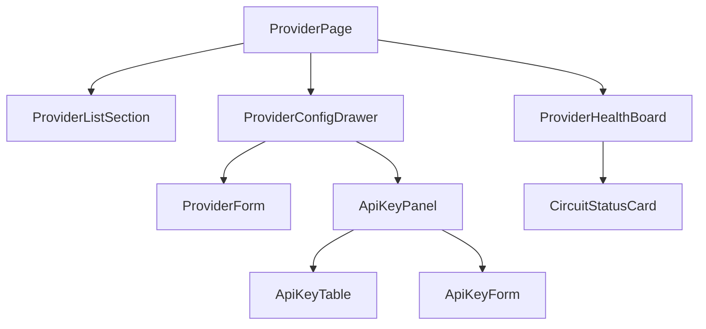

# AI 模型管理模块 - 前端实现设计（供应商管理）

## 1. 文档概述

本文档描述 AI 模型管理模块**供应商管理页**的 Web 端（React）前端实现方案，聚焦供应商接入、API Key 管理与健康容错看板；模型资产与定价页见 [前端实现-模型管理.md](./前端实现-模型管理.md)，两页共享同一注册表数据底座。Android / Flutter / Taro 等多端参考本 Web 端组件结构与状态管理方案按各自技术栈适配。

> 边界：本页仅承载**供应商接入与容错**（配置、Key、健康），不涉及模型定价与生命周期；供应商成本侧计费规则配置归属 AI 计费管理模块。

---

## 2. 组件树设计

| 组件 | 职责 |
|------|------|
| ProviderPage | 供应商管理页容器与路由入口，编排列表/配置/健康看板 |
| ProviderListSection | 供应商列表区：分页表格 + 新增/编辑/删除/测试连接操作 |
| ProviderConfigDrawer | 供应商配置抽屉：ProviderForm + ApiKeyPanel 分区承载 |
| ProviderForm | 供应商表单（编码/API 地址/协议/认证方式/默认请求头/健康检查开关/用户身份透传/备注），保存后异步连通性测试仅提示 |
| ApiKeyPanel | API Key 管理区：Key 列表 + 新增/启停/删除 |
| ApiKeyTable | Key 列表表格，冷却状态与优先级/权重可视化 |
| ApiKeyForm | Key 新增表单：明文输入（界面不回显）、优先级/权重/限额配置 |
| ProviderHealthBoard | 供应商健康看板：成功率/限流率/P95 延迟/熔断次数与持续时间 |
| CircuitStatusCard | 熔断状态卡：熔断醒目标识 + 触发条件说明 + 手动解除入口 |

---

## 3. 状态管理

### 3.1 Store 模块划分

| Store 模块 | 职责 | 生命周期 |
|-----------|------|---------|
| 供应商管理 Store（adminProviderStore） | 供应商列表/配置抽屉/Key 列表/健康看板 | 页面级，进入供应商管理页初始化，离开销毁 |

### 3.2 核心状态

| 状态 | 说明 |
|------|------|
| `providers` | 供应商分页列表（含健康状态） |
| `providerQuery` | 列表查询条件（分页/关键字） |
| `configDrawer` | 配置抽屉状态（`{provider, visible}`），含异步连通性测试结果 |
| `providerKeys` | 当前供应商的 API Key 列表（仅前缀） |
| `healthBoard` | 健康看板数据（成功率/限流率/P95/熔断） |
| `circuit` | 当前供应商熔断状态（open/closed + 触发条件说明） |

### 3.3 核心操作

| 操作 | 说明 |
|------|------|
| `fetchProviders` | 拉取供应商分页列表（含健康状态） |
| `saveProvider` | 新增/编辑供应商，保存后触发异步连通性测试 |
| `deleteProvider` | 删除供应商 |
| `testConnection` | 手动连通性测试，展示状态码/延迟/错误信息 |
| `fetchProviderKeys` / `saveKey` / `deleteKey` | API Key 管理 |
| `toggleKeyStatus` | 启用/停用 Key（配合轮换流程引导） |
| `fetchHealthBoard` / `closeCircuit` | 健康看板加载 / 手动解除熔断 |

---

## 4. 路由设计

| 路由路径 | 页面 | 权限控制 |
|---------|------|---------|
| `/admin/ai-models/providers` | 供应商管理页 | 管理员（`ai:model:manage`） |

> 父路由 `/admin/ai-models`（AI 模型管理）默认重定向至 `/admin/ai-models/providers`，供应商与模型管理为兄弟子路由。

---

## 5. 数据流

| 区块 | 获取时机 | 缓存策略 |
|------|---------|---------|
| 供应商列表（含健康字段） | 进入页面 + 分页/搜索变更 | 当前查询结果缓存；保存/删除后失效刷新 |
| 配置抽屉回显 | 打开抽屉时 | 抽屉会话级缓存 |
| API Key 列表 | 展开 Key 区时加载 | 页面级缓存；增删改后刷新 |
| 连通性测试结果 | 保存供应商 / 手动触发 | 仅提示，不持久化 |
| 熔断状态 | 进入页面 + 手动刷新 | 实时性优先，不缓存 |

---

## 6. 交互设计决策

| 交互点 | 技术选型 | 理由 |
|--------|---------|------|
| 列表 + 抽屉分区承载 | 列表区 + 配置抽屉（ProviderForm 与 ApiKeyPanel 分区） | 供应商接入动作内聚，配置项多但分区清晰；列表保持概览态 |
| 连通性测试不阻断 | 保存后异步测试，结果仅提示 | 配置优先录入，网络问题事后定位，避免配置流程被外部依赖阻断 |
| Key 安全可见性 | 仅前缀展示、明文不回显、查重即时提示 | 凭据安全是硬约束；重复录入立即提示避免同名 Key 堆积 |
| 多 Key 容错可视化 | 冷却标记、优先级/权重可配置、轮换流程引导 | Key 是外部依赖的第一层容错，状态可见才能驱动轮换决策 |
| 熔断可处置 | 熔断醒目标识 + 触发条件说明 + 手动解除 | 熔断自动发生、解除需人工判断（外部故障可能已恢复），页面提供闭环处置 |
| 健康看板内联 | 列表页内 ProviderHealthBoard | 运维高频关注健康，进页即见；完整成本归因在模型管理页运营视图 |
