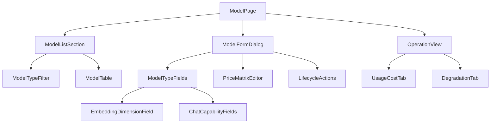

# AI 模型管理模块 - 前端实现设计（模型管理）

## 1. 文档概述

本文档描述 AI 模型管理模块**模型管理页**的 Web 端（React）前端实现方案，聚焦模型注册表管理（类型筛选、类型专属配置、价格档位、生命周期、降级链）与用量成本运营视图；供应商接入与容错见 [前端实现-供应商管理.md](./前端实现-供应商管理.md)。

> 边界：本页承载**模型资产与定价**（注册表、类型配置、价格档位、生命周期、降级链、用量成本）；供应商接入/Key/健康看板见供应商管理页；消费方（AI 对话会话内选择、AI 知识库创建向导）只消费启用模型列表，其页面实现归各消费方模块。

---

## 2. 组件树设计

| 组件 | 职责 |
|------|------|
| ModelPage | 模型管理页容器与路由入口，编排模型列表/表单/生命周期/运营视图 |
| ModelListSection | 模型列表区：类型筛选 + 分页表格 + 新增/编辑/禁用/下线操作 |
| ModelTypeFilter | 模型类型筛选（全部/chat/embedding/rerank），驱动列表查询 |
| ModelTable | 模型列表：类型/名称/供应商/状态/积分单价/上下文长度/速度档位/降级标识 |
| ModelFormDialog | 模型表单弹窗：类型选择 + 类型专属字段 + 价格档位编辑 + 生命周期操作 |
| ModelTypeFields | 类型专属字段容器，按 `model_type` 切换字段集合 |
| EmbeddingDimensionField | embedding 维度输入框（仅 embedding 类型展示），创建后禁用并提示"变更需重建索引" |
| ChatCapabilityFields | chat 能力字段（多模态/工具调用/流式/Prompt Caching/结构化输出标识） |
| PriceMatrixEditor | 价格档位矩阵编辑：token 类型 × 上下文分段 × 时段，保存生成新价格版本 |
| LifecycleActions | 生命周期操作：启用/禁用/下线/替换迁移 |
| OperationView | 运营视图区：用量成本与降级统计 Tab |
| UsageCostTab | 用量与成本分析：供应商健康看板、模型用量分布、成本归因 |
| DegradationTab | 降级与故障统计：各模型降级频率、Key 失败切换次数 |

---

## 3. 状态管理

### 3.1 Store 模块划分

| Store 模块 | 职责 | 生命周期 |
|-----------|------|---------|
| 模型管理 Store（adminModelStore） | 模型列表/类型筛选/表单（含价格档位）/生命周期/运营视图 | 页面级，进入模型管理页初始化，离开销毁 |

### 3.2 核心状态

| 状态 | 说明 |
|------|------|
| `models` | 模型分页列表（含类型/状态/单价） |
| `modelTypeFilter` | 当前类型筛选（all/chat/embedding/rerank） |
| `modelForm` | 模型表单状态（`{model, visible}`），`model_type` 决定字段集合 |
| `priceMatrix` | 当前模型价格档位矩阵（token 类型 × 上下文分段 × 时段） |
| `lifecycle` | 生命周期操作状态（禁用前活跃会话校验、替换迁移目标推荐） |
| `operationView` | 运营视图数据（用量分布/健康看板/降级统计） |

### 3.3 核心操作

| 操作 | 说明 |
|------|------|
| `fetchModels` | 按 `model_type` 筛选拉取模型列表 |
| `saveModel` | 新增/编辑模型 |
| `disableModel` | 禁用模型（"即将下线"，向活跃会话推送替换推荐） |
| `deleteModel` | 下线模型 |
| `configureFallback` | 配置降级链（fallback 模型） |
| `savePriceMatrix` | 保存价格档位矩阵（生成新价格版本） |
| `fetchOperationView` | 拉取运营视图数据（用量分布/健康看板/降级统计） |

---

## 4. 路由设计

| 路由路径 | 页面 | 权限控制 |
|---------|------|---------|
| `/admin/ai-models/models` | 模型管理页 | 管理员（`ai:model:manage`） |

---

## 5. 数据流

| 区块 | 获取时机 | 缓存策略 |
|------|---------|---------|
| 模型列表 | 进入页面 + 类型筛选/分页变更 | 当前筛选结果缓存；保存/生命周期操作后失效 |
| 模型表单（回显 + 启用供应商下拉） | 打开弹窗时 | 弹窗会话级缓存 |
| 价格档位 | 随模型保存提交 | 版本化存储，历史版本可查询 |
| 生命周期操作 | 用户触发 | 操作后刷新列表 |
| 运营视图 | 切换运营视图 Tab 时 | 当前时间范围结果缓存 |

---

## 6. 交互设计决策

| 交互点 | 技术选型 | 理由 |
|--------|---------|------|
| 类型化表单 | `model_type` 决定字段集合（chat 能力标识/embedding 维度/rerank 配置） | 三类模型配置差异大，类型化表单避免配错字段；embedding 维度创建后不可改（向量索引依赖） |
| 价格档位矩阵编辑 | 按"token 类型 × 上下文分段 × 时段"矩阵填写，保存生成新价格版本 | 价格体系维度多，矩阵化编辑直观；版本化保证历史计费可追溯 |
| 生命周期引导 | 禁用即"即将下线"并推送替换推荐；下线前校验活跃会话并引导切换 | 模型演进不能打断活跃用户，页面提供状态可见 + 替换引导闭环 |
| 降级链配置内联 | 在模型表单内配置 fallback | 降级链与模型配置同表单完成，无需另找入口 |
| 运营视图 Tab 承载 | OperationView 挂于模型管理页（含供应商健康看板） | 用量成本分析服务于定价与轮换决策，与模型配置同页闭环；与供应商页健康看板入口分层、不重复实现 |
| 消费方状态联动 | 模型状态醒目标识，禁用模型在消费方不可选 | 管理端配置结果直接决定消费方可用性，状态可见防"配了不可用" |
