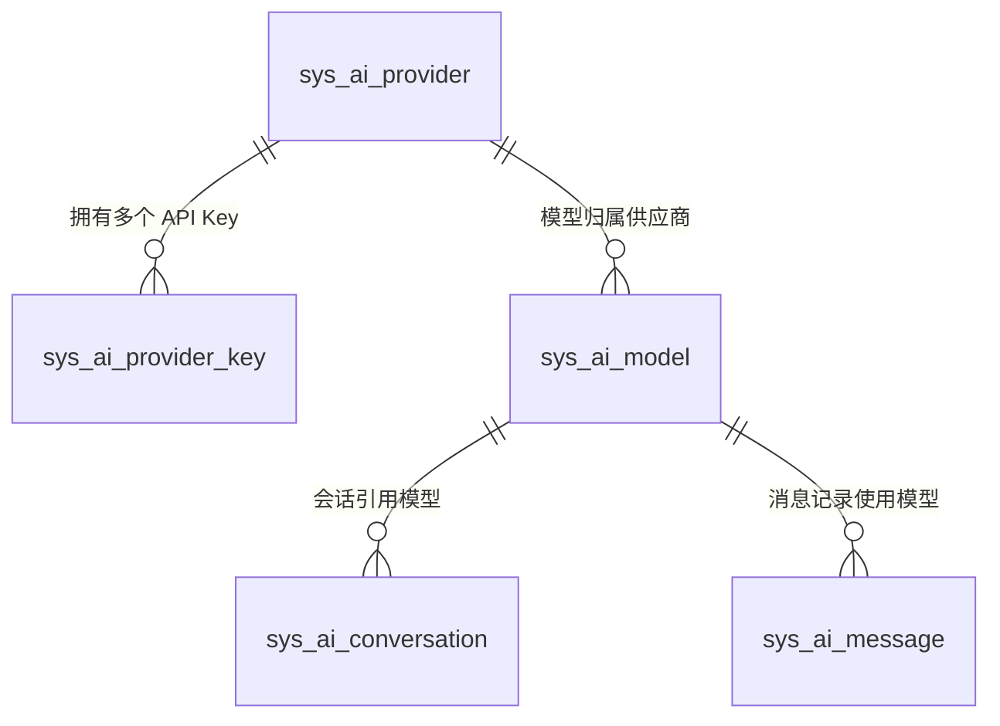
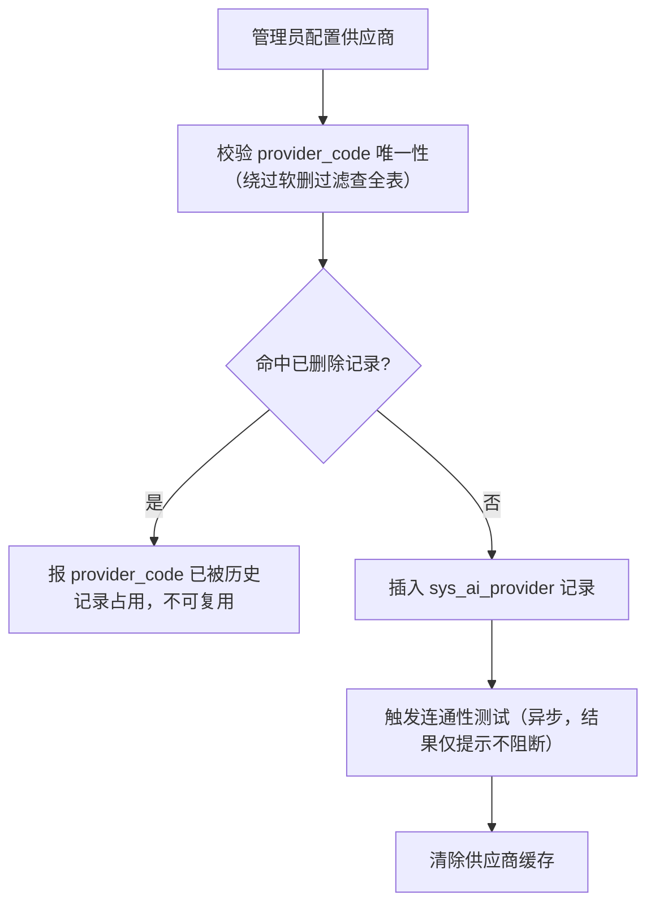
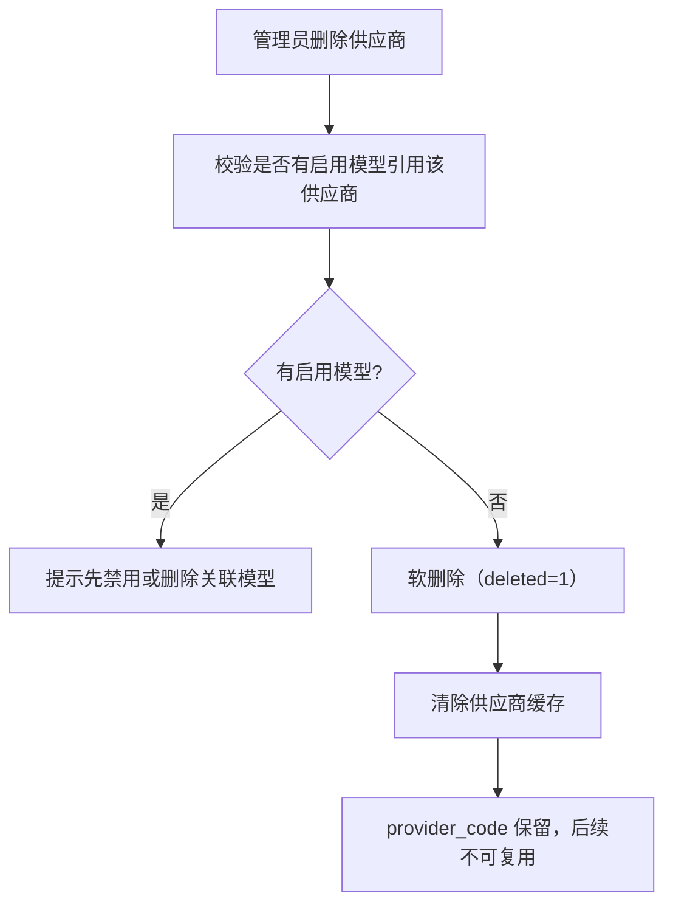
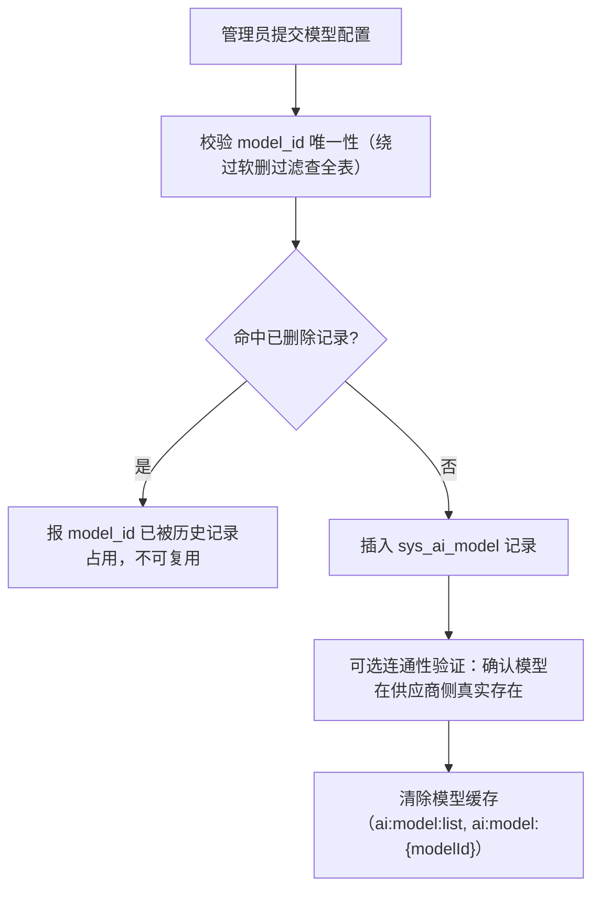
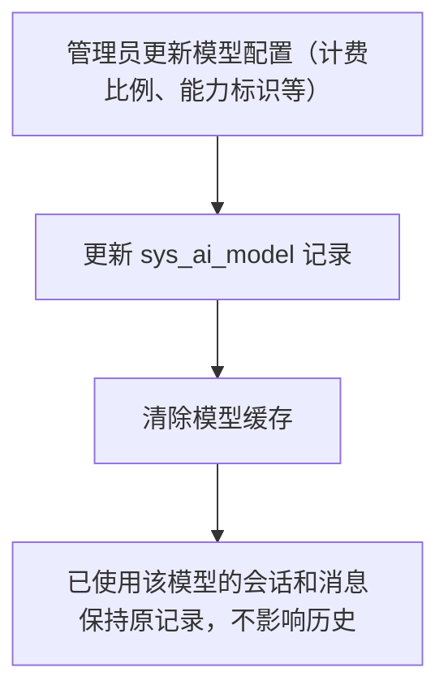
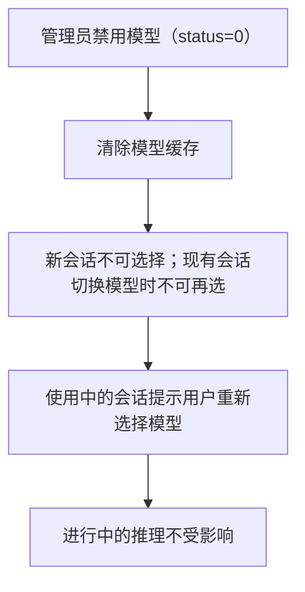
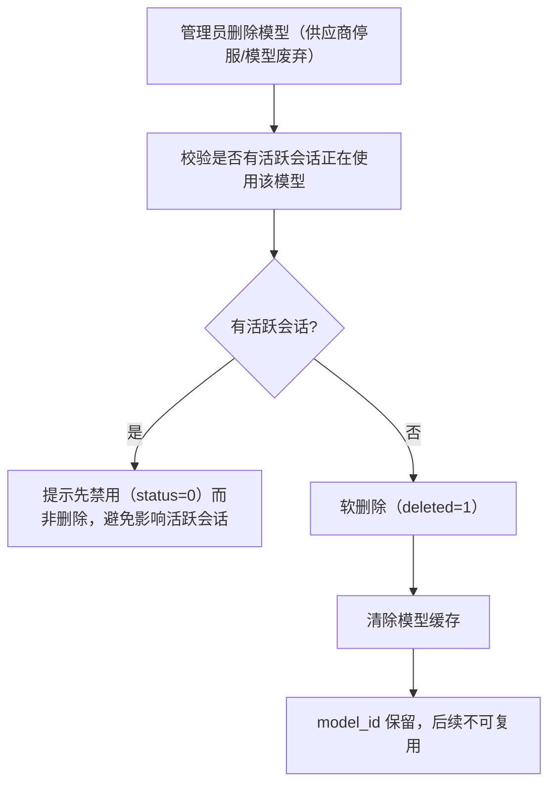
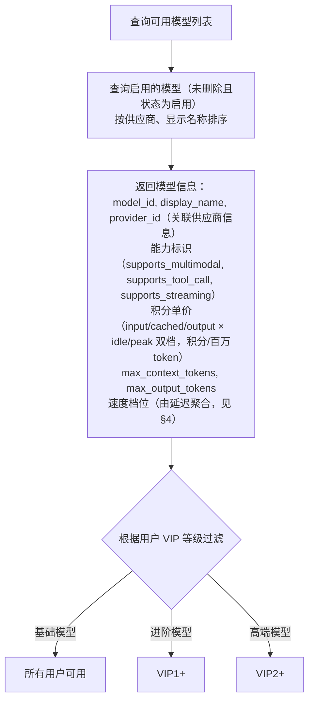

# AI 模型管理模块 - 后端实现设计

## 1. 文档概述

本文档描述 AI 模型管理模块的后端实现，包括模型供应商配置管理、API Key 管理、供应商健康与容错、模型配置管理、模型生命周期、模型注册表与路由、用量与成本分析。本模块承载平台全部 AI 模型（chat/embedding/rerank）与供应商的统一管理，消费方 AI 对话与 AI 知识库按模型类型接入。

> 本文档含模型管理核心与消费方调用设计：**会话级模型选择（§2.8）、推理调度与降级（§2.9）、Prompt Caching（§2.10）、结构化输出（§2.11）、计费集成（§3）** 为消费方 AI 对话的调用实现，在 AI 对话推理链路中引用本模块的模型注册表与路由能力；**知识库的 embedding/rerank 消费**见 [AI知识库/后端实现](../AI知识库/后端实现-架构与公共.md)。
>
> 与 [需求规格.md](./需求规格.md) 同步：本文档覆盖供应商连通性测试、供应商健康与容错（§2.4）、模型生命周期（§2.6）、用量与成本分析（§4）、供应商计费规则差异与限速隔离（§2.7/§2.2.1）、用户售价档位模型与价格版本化（§2.12）。

### 1.1 设计思想

#### 设计动机

AI 模型管理是平台 AI 能力的"地基层"，本模块的根本矛盾是：**供应商外部服务的不可控性**与**平台服务可用性/成本的要求**之间的张力。

LLM 供应商是不可控的外部依赖：可能限流（429）、可能宕机（5xx）、可能涨价、可能停服。同时，模型成本与积分定价直接挂钩，定价错误会让平台亏损或让用户不满。

本功能域的设计目标：**把不可控的供应商抽象为可控的配置层，用多级降级保证可用性，用显式计费比例保证成本透明**。

#### 核心设计原则

| 原则 | 说明 |
|------|------|
| 配置驱动 | 供应商、模型、API Key 全部数据库管理：供应商协议差异（OpenAI 兼容/Anthropic）、模型计费比例、VIP 门槛、降级链、能力标识全部可配置。接入新供应商 = 插入一条配置，不改代码（详见 §2.1） |
| 降级容错 | 主模型不可用时自动沿降级链切换（A→B→C），用主键引用避免同模型多供应商歧义，降级模型必须能力匹配。用"配置冗余"换"服务可用"（详见 §2.9） |
| 健康感知 | Key 级失败冷却 + 供应商级熔断两级容错：单 Key 故障不影响供应商，供应商整体故障自动切到备用供应商或降级模型，且对用户无感（详见 §2.4） |
| 成本显性化 | 计费比例（input/output/cached_rate）挂在模型上，积分换算完全可审计；Prompt Caching 让高频稳定前缀（系统提示词/工具定义）按折扣计费，降低用户成本也提升平台吞吐（详见 §2.10/§2.12） |
| 密钥最小暴露 | API Key 明文不落库（SHA256 哈希查重 + AES 密文）、不进入日志与上下文、多 Key 轮换与失败自动切换，兼顾安全与可用（详见 §2.3） |

#### 关键架构取舍

| 取舍点 | 方案对比 | 选择与理由 |
|--------|---------|-----------|
| 供应商配置存储 | 环境变量硬编码 vs 数据库配置 | 选数据库。环境变量只能静态配置、变更需重启；数据库配置可运行时调整、可区分供应商协议差异、可支撑前端管理界面。加密密钥（`AI_PROVIDER_KEY_ENCRYPTION_KEY`）作为环境变量管理，符合密钥管理规范 |
| API Key 组织 | 单 Key vs 多 Key（优先级+权重+失败切换） | 选多 Key。单 Key 遇限流即整个供应商不可用；多 Key 支持负载均衡、轮换、失败自动切换，是高可用模型调用的前提（详见 §2.3） |
| 供应商绑定 | 模型硬绑供应商 vs 同模型多供应商可切换 | 选后者。`(model_id, provider_id)` 联合唯一，同一模型可通过不同供应商配置多行，配合降级链实现"主备供应商"，避免单供应商停服导致平台不可用 |
| 健康状态存储 | 落库持久化 vs 运行时聚合（Redis + 调用日志） | 选运行时聚合。健康指标（成功率/429 率/P95）由调用日志聚合，熔断标记走 Redis（TTL 冷却），不新增库表；供应商健康状态是短时效信息，落库只会引入过期脏数据 |

#### 总体规划

模型是"地基层"，其他所有功能域（推理、会话、上下文）都建立在其上：

```
供应商/Key（基础设施，含健康监控）→ 模型（计费比例 + 能力 + 降级链）→ LlmClient 调用
                                                                            ↓
                                  推理/会话/上下文（消费模型能力，按比例计费）
```

本功能域保证一件事：**任何时刻，平台都能用"当前可用且用户有权限"的最优模型完成推理**。

---

## 2. 模型供应商管理 (F-M08-007)

> **Python 端供应商/Key 实现（已落地）**：路由 `app/router/ai_provider.py`（prefix=`/api/v1/ai/providers`）含供应商 CRUD、`enabled` 列表、连通性测试（`test-connection`）、熔断解除（`circuit/close`）、API Key CRUD（`/providers/{id}/keys`）。除 `enabled` 列表外均需 `@require_permission("ai:model:manage")` 权限注解；新增/更新供应商后由 `BackgroundTasks` 异步触发连通性测试（结果仅提示不阻断）。供应商分页列表为 `PageResult` 结构（含健康看板字段）。供应商字段 `user_identity_forward`（JSON：enabled/field/prefix/max_len）与 Key 字段 `rpm_limit`（0=不限）已在实体/Schema/服务层落地，见 §2.2.1/§2.3。运营统计 `GET /api/v1/ai/usage/stats`（`ai:model:manage`）由 `app/service/ai_usage_stats_service.py` 承载，口径见 §4。

### 2.1 数据模型

模型供应商管理涉及三张业务表（+ 一张只读引用的成本单价表）：

| 实体 | 职责 | 服务层关键用途 |
|------|------|-------------|
| `sys_ai_provider` | 模型供应商配置（API 地址、协议类型、认证方式、健康检查开关、用户身份透传配置（JSON）、备注） | 供应商 CRUD、协议适配、连通性测试 |
| `sys_ai_provider_key` | 供应商 API Key（加密存储、优先级+权重选取、日额度/频率限额） | Key CRUD、Key 选取与轮换、失败冷却 |
| `sys_ai_model` | AI 模型配置（类型 model_type=chat/embedding/rerank、embedding 向量维度 dimension、能力标识、降级链、VIP 门槛、图片换算上限、并发限制参考） | 模型 CRUD、能力校验、降级路由、VIP 过滤、生命周期、类型筛选 |
| `sys_ai_model_price` + `sys_ai_model_price_detail` | 模型用户售价（绝对单价，积分/百万 token，价格版本 + 档位明细行：token 类型 × 上下文分段 × 时段档位） | 售价版本/档位维护、售价展示、计费换算读取 |
| `sys_ai_model_cost` + `sys_ai_model_cost_detail` | 模型成本单价（供应商采购价，元/百万 token，价格版本 + 档位明细行；**表归 AI 计费管理模块**） | 模型管理侧**只读引用**：供应商/模型调价评估、毛利测算；成本核算由 AI 计费模块完成 |

**ER 关系**：



- 一个供应商（`sys_ai_provider`）拥有多个 API Key（`sys_ai_provider_key`），支持负载均衡和 Key 轮换
- 一个供应商提供多个模型（`sys_ai_model`），`model.provider_id` 关联 `sys_ai_provider.id`
- 同一 `model_id` 可通过不同 `provider_id` 配置多行，联合唯一索引 `(model_id, provider_id)` 保证不重复

`sys_ai_provider.provider_code` 为业务引用键，删除后不可复用（逻辑删除类别②）。`sys_ai_provider_key` 不使用逻辑删除（Key 管理为状态控制：启用/禁用/过期，物理删除）。

**API Key 安全**：明文不存储，只存哈希（SHA256，`char(64)` 固定长度，用于查重）+ 密文（AES-256-CBC 加密后 base64 编码，`varchar(512)`，运行时解密）。Key 明文绝不进入日志、不进入 LLM 上下文。加密密钥由环境变量注入（`AI_PROVIDER_KEY_ENCRYPTION_KEY`），支持密钥轮换。日调用计数走 Redis（`ai:provider_key:{key_id}:daily:{date}`），不落库。`last_used_at` / `last_used_by` 异步更新（Redis 缓冲 + 定时批量刷库），避免高并发频繁写库。

**新增字段说明**（对齐需求规格 §2.7.5）：

| 表 | 字段 | 说明 |
|----|------|------|
| `sys_ai_provider` | `health_check_enabled` | 健康检查开关（默认 1），关闭后该供应商不参与熔断判定 |
| `sys_ai_provider` | `remark` | 运维备注（账号归属、合同号、商务信息），不参与逻辑 |
| `sys_ai_provider_key` | `rpm_limit` | 分钟调用频率上限（Key 级限速，配合三层限速见 §2.4），超限后本轮跳过该 Key |
| `sys_ai_model` | `image_tokens_per_image` | 多模态单图 Token 换算上限（0=无该规则），预扣估算按"图片数 × 上限"计入输入 Token，实扣以供应商返回为准 |
| `sys_ai_model` | `concurrency_limit` | 供应商侧并发上限参考值（如 DeepSeek v4-flash 2500），用于平台侧限流与 Key 级 RPM 配置参考 |
| `sys_ai_model_price` / `sys_ai_model_price_detail` | （新表） | 用户售价：版本主表（model_id/provider_id/price_version/有效期）+ 档位明细表（token_type × time_slot × min/max_tokens × unit_price）；`sys_ai_model` 不承载价格字段 |

健康状态（健康/可疑/熔断）为运行时聚合信息，不落库：指标来自调用日志聚合，熔断标记走 Redis（`ai:provider:{provider_id}:circuit_open`），与 Key 冷却标记（`ai:provider_key:{key_id}:unavailable`）同机制。

### 2.2 供应商 CRUD

#### 新增供应商



供应商核心字段：

| 字段 | 说明 | 示例 |
|------|------|------|
| `provider_code` | 供应商编码（唯一） | `openai`、`anthropic`、`deepseek` |
| `api_base_url` | API 基础地址 | `https://api.openai.com/v1` |
| `protocol_type` | 协议类型 | `openai_compat`（OpenAI 兼容）、`anthropic`（Claude 原生） |
| `auth_type` | 认证方式 | `bearer`（`Authorization: Bearer`）、`x-api-key`、`custom`（自定义请求头，头名在 `default_headers` 配置） |
| `default_headers` | 默认请求头（JSON） | `{"anthropic-version": "2023-06-01"}`；`auth_type=custom` 时保留键 `auth_header` 指定认证头名（值填 api_key），其余键原样合并为请求头 |
| `sort_order` | 排序序号 | 数字越小越靠前 |
| `health_check_enabled` | 健康检查开关 | `1`（默认，参与熔断判定）/ `0`（关闭） |
| `user_identity_forward` | 用户身份透传配置（JSON：enabled/field/prefix/max_len），NULL 不启用（见 §2.2.1） | `{"enabled":true,"field":"user_id","prefix":"u_","max_len":512}` |
| `remark` | 运维备注 | `OpenAI 主账号，合同 2026-12 到期` |

#### 连通性测试

```
管理员保存/更新供应商 或 手动触发连通性测试
    ↓
按 protocol_type + auth_type + default_headers 组装最小探测请求
  （GET 模型列表接口，如 OpenAI 兼容协议 GET /models）
    ↓
发送请求（超时 5s，不产生业务计费）
    ↓
记录结果：连通状态 / 状态码 / 延迟 / 错误信息
    ↓
展示给管理员（仅提示，不阻断保存流程）
```

- 测试请求不携带用户上下文，不产生 Token 消耗与计费
- 测试失败常见原因：地址不可达、凭据无效（401/403）、协议不匹配，错误信息直接展示便于定位
- 更新 API 地址或认证方式后建议重新测试

#### 用户身份透传（user_id）

部分供应商支持透传用户标识实现账号维度下的内容安全/KVCache/调度隔离，`sys_ai_provider.user_identity_forward.enabled=true` 时启用：

```
LlmClient 组装请求体（user_identity_forward.enabled=true 的供应商）
    ↓
生成透传用户标识（脱敏，不透传隐私信息）：
  - 规则：prefix + sha256(userId) 截断，如 "u_{sha256(userId)[:12]}"
  - prefix/max_len 来自 sys_ai_provider.user_identity_forward
    ↓
协议落位：
  - openai_compat：请求体附加配置字段（field=user_id 或 user；透传参数与 extra_request_params 同理受核心键保护）
  - anthropic：请求体按 field 嵌套路径注入（metadata.user_id）
    ↓
供应商侧按透传标识并发限制 → 超限返回 429 → 走 Key 失败冷却/降级容错（§2.3/§2.4）
```

- 透传的 user_id 仅作供应商侧隔离标识，**不含任何用户隐私信息**（合规要求）
- 供应商对 user_id 的并发限制（如 DeepSeek v4-pro 500 / v4-flash 2500）作为模型并发配置（§2.5）与 Key 级 RPM（§2.3）参考值

#### 删除供应商



### 2.3 API Key 管理

#### 新增 API Key

```
管理员录入 Key 明文
    ↓
计算 SHA256 哈希（查重，校验唯一性）
    ↓
AES-256 加密明文 → key_cipher
    ↓
截取前 8 位 + "..." → key_prefix（展示用）
    ↓
插入 sys_ai_provider_key 记录（可选配置 priority/weight/daily_quota/rpm_limit）
    ↓
返回 Key ID（不返回明文）
```

#### Key 选取策略

`LlmClient` 调用 LLM 时，从 `sys_ai_provider_key` 选取可用 Key：

```
按 provider_id 查询所有 status=1 且未过期的 Key
    ↓
排除 Redis 临时不可用标记的 Key（ai:provider_key:{key_id}:unavailable，冷却期）
    ↓
排除超出调用限额的 Key：
  - 日调用计数达到 daily_quota（ai:provider_key:{key_id}:daily:{date}）
  - 分钟调用计数达到 rpm_limit（ai:provider_key:{key_id}:minute:{yyyyMMddHHmm}，Key 级三层限速，见需求规格 §2.7.9）
    ↓
按 priority 升序排序，取最高优先级组
    ↓
同优先级内按 weight 加权随机选取一个 Key
    ↓
解密 key_cipher 获取明文 API Key
    ↓
记录 last_used_at + last_used_by（Redis 缓冲 + 定时批量刷库）
    ↓
调用失败（401/429）→ Redis 标记该 Key 进入冷却期，切到下一个 Key 重试
```

#### 失败冷却与冷却升级

```
Key 调用失败（401/429/5xx）
    ↓
Redis 标记 ai:provider_key:{key_id}:unavailable，TTL = 冷却时长
    ↓
冷却时长随连续失败次数逐步提升：
  - 第 1 次失败 → 5 分钟
  - 连续失败 ≥ 3 次 → 15 分钟
  - 连续失败 ≥ 5 次 → 30 分钟（上限）
  （连续失败计数：ai:provider_key:{key_id}:fail_streak，成功调用即清零）
    ↓
冷却期结束 / 手动恢复 → 自动参与选取
```

**两级容错关系**：Key 冷却解决单 Key 故障（§2.3），供应商熔断解决供应商整体不可用（§2.4）。Key 连续失败到熔断阈值时，LlmClient 会放弃当前供应商，直接走模型降级链或同模型备用供应商。

#### Key 轮换

```
管理员新增新 Key（priority 与旧 Key 相同或更高）
    ↓
新 Key 自动参与选取
    ↓
管理员禁用旧 Key
    ↓
旧 Key 不再被选取，进行中的推理不受影响
    ↓
确认无流量后删除旧 Key
```

### 2.4 供应商健康与容错

#### 健康指标聚合

供应商健康指标由调用日志聚合得出，无独立采集任务：

| 指标 | 数据来源 | 聚合口径 |
|------|---------|---------|
| 成功率 | 消息/计费记录中的调用结果 | 近 24h 成功调用 / 总调用 |
| 429 限流率 | 调用错误码 | 近 24h 429 次数 / 总调用 |
| P95 延迟 | 调用耗时 | 近 24h P95 |
| 熔断状态 | Redis 标记 | 当前是否熔断 |

> 指标只读聚合（定时计算缓存到 Redis `ai:provider:{provider_id}:health`），不作为调用链路热点。

#### 健康状态机

```
健康（正常参与选取）
  → 错误率升高/延迟恶化 → 可疑（降权观察 + 保留探测流量）
  → 连续失败超过熔断阈值 → 熔断（停止选取该供应商全部 Key，进入冷却期）
  → 冷却期结束 / 管理员手动解除 → 恢复
```

| 状态 | 触发条件（参考阈值，可配置） | 调度行为 |
|------|---------------------------|---------|
| 健康 | 错误率 < 10% | 正常参与选取 |
| 可疑 | 10% ≤ 错误率 < 30%，或 P95 延迟超基线 2 倍 | 降低选取权重，仍参与调用；触发运维告警 |
| 熔断 | 错误率 ≥ 30% 持续 1 分钟，或连续失败 ≥ 5 次 | Redis 标记 `ai:provider:{provider_id}:circuit_open`（默认 TTL 60s）；该供应商下的模型自动走降级链或同模型备用供应商；进行中的推理不受影响 |
| 恢复 | 冷却期结束或管理员手动解除 | 先按"可疑"低权重观察一段时间，再恢复常态 |

```
LlmClient 选取 Key 前检查供应商健康状态
    ↓
正常（健康/可疑）→ 进入 §2.3 Key 选取
    ↓
熔断（circuit_open 标记存在）→ 跳过该供应商：
  - 模型有其他供应商配置（同 model_id 其他 provider_id 行）→ 用备用供应商重试
  - 无备用供应商 → 走模型降级链（§2.9）
  - 全部不可用 → 报错，推送 error 事件
```

**熔断阈值配置**：错误率阈值、持续时长、冷却时长、连续失败次数均存配置表（`sys_dict`，类型 `ai_provider_health`，见种子 `config/sql/data/sys_dict.sql`），管理员可调，无需改代码。

**实现（ProviderHealthService，`app/infrastructure/provider/provider_health_service.py`）**：
- 指标运行时聚合，不新增库表。Redis Key 约定：`ai:provider:{id}:circuit_open`（熔断标记）、`ai:provider:{id}:fail_streak`（连续失败计数）、`ai:provider:{id}:calls`（调用记录列表 LPUSH+LTRIM 近 24h 滑动窗口）、`ai:provider:{id}:latency`（延迟列表取 P95）、`ai:provider:{id}:health`（聚合快照缓存）。
- `record_call` 内联判定：连续失败 ≥5，或窗口 ≥20 次调用且错误率 ≥30% → 写 `circuit_open`（TTL=冷却时长 60s）。成功调用清零连续失败计数。
- **健康开关高频查询**：`get_status` 仅读 Redis 缓存标记 `ai:provider:{id}:health_enabled`（供应商 CRUD 时写入，缺省视为开启），不读库。`health_check_enabled=0` 的供应商 `get_status` 恒返回 `healthy`、`record_call` 不参与聚合与判定。
- 熔断阈值读取 `sys_dict(ai_provider_health)` 并缓存到 Redis（TTL 5 分钟），缓存未命中回落到种子同源默认。
- 看板：`GET /api/v1/ai/providers` 列表逐项带 `health` 字段（调 `get_health_snapshot`）；`POST /api/v1/ai/providers/{id}/circuit/close` 手动解除熔断。

**健康看板**：供应商列表页展示各供应商健康状态（§4 用量与成本分析），数据即 §2.4 聚合指标。

### 2.5 模型配置管理

> **Python 端实现**：路由 `app/router/ai_model.py`（prefix=`/api/v1/ai/models`）提供 5 个端点——管理端分页列表（GET `/models`）、用户端启用列表（GET `/models/enabled`）、新增（POST `/models`）、更新（PUT `/models/{model_id}`）、删除（DELETE `/models/{model_id}`）。管理端 4 接口已补 `@require_permission("ai:model:manage")` 权限注解（后端拦截，越权返回 403/`A0301`）；`/models/enabled` 无需特殊权限，按登录用户 VIP 等级过滤。update/delete 以 **`model_id` 字符串** 为路径参数（非自增主键）。服务 `app/service/ai_model_service.py`，供应商/Key 管理见 §2.1~2.4（`app/service/ai_provider_service.py`、`ai_provider_key_service.py`、`provider_health_service.py`）。

模型配置表 `sys_ai_model` 通过 `provider_id` 关联供应商，`model_type` 标识模型类型：

| model_type | 说明 | 特有配置 |
|-----------|------|---------|
| `chat` | 对话/推理模型 | 能力标识、计费档位（§2.12）、VIP 门槛、降级链 |
| `embedding` | 文本向量化模型 | `dimension`（向量维度，知识库创建 ES 索引时读取，创建后不可修改） |
| `rerank` | 重排序模型（Cross-Encoder） | 知识库检索可选启用（enable_rerank） |

`model_id` 为业务引用键（会话/消息引用、知识库 embedding/rerank 引用），删除后不可复用（逻辑删除类别②）。新建/改名查重必须绕过软删过滤查全表，命中即报"已被历史记录占用"。

`vip_level` 标识模型的最低可用 VIP 等级（`0`=所有用户、`1`=VIP1 及以上、`2`=VIP2 及以上），模型列表按当前用户等级过滤（`model.vip_level <= user_level`）。

`extra_request_params`（JSON）为**厂商私有请求参数**（如阿里云 `enable_thinking`、OpenAI `reasoning_effort`），随推理请求体透传：

- 绑定模型（删模型即删参数），由管理员在模型配置上显式声明，不开放给用户请求级透传（避免厂商差异上抛给用户、无 schema 校验、请求体污染）
- 透传采用**核心键保护**：仅补充 `model`/`messages`/`stream`/`stream_options`/`temperature`/`max_tokens`/`tools` 等核心键之外的键，调用方控制的参数不可被配置覆盖
- 厂商对未知参数容忍度不一（实测 DeepSeek 忽略未知参数正常回复），接入新厂商时应按厂商文档核对参数名，配置错误由厂商 4xx 暴露（属配置问题非代码缺陷）
- 同一供应商下多模型共享参数时逐模型配置；供应商级共有请求头走 `sys_ai_provider.default_headers`

**模型生命周期状态**（对齐需求规格 §2.8.4）：

| 状态 | 字段表达 | 行为 |
|------|---------|------|
| 启用 | `status=1, deleted=0` | 可选择、可路由、可计费 |
| 禁用 | `status=0, deleted=0` | 新会话不可选择、现有会话切换时不可再选；进行中的推理不受影响；可逆（重新启用） |
| 已下线 | `deleted=1` | 不可逆；model_id 保留不可复用；无活跃会话后软删除 |

### 2.6 模型 CRUD

#### 新增模型



#### 更新模型



#### 禁用模型



#### 下线模型（替换迁移）

**标记"即将下线" = 禁用 + 通知**：供应商发布模型停服公告后，管理员将模型禁用（`status=0`），服务端向使用该模型的所有活跃会话用户推送替换模型推荐（消息中心站内信，经 `MessageService.send`，去重键 `bizModule=ai_model, bizId=model_id`），推荐复用 `fallback_model_id` 指向的模型，无配置则提示管理员配置替代模型：

```
管理员禁用模型（status=1 → 0，即"即将下线"）
    ↓
查使用该模型的活跃会话用户（list_active_conversation_users，去重）
    ↓
取替换模型（fallback_model_id 指向的启用模型，无则 None）
    ↓
MessageService.send：向每个用户推送站内信
  - 有替换模型 → 文案"建议切换到「{fallback.display_name}」"
  - 无替换模型 → 文案"暂未配置替代模型，请及时更换"
    ↓
通知失败仅记日志，不阻断禁用流程
```

**物理下线（软删除）**：



- 软删除要求无活跃会话，故无需再通知；通知发生在"禁用"阶段（即"即将下线"）
- 迁移窗口期内，供应商不可用由降级链/同模型备用供应商自动兜底（§2.9）

### 2.7 模型列表查询



**前端展示增强字段**（对齐需求规格 §2.8.2，`list_enabled_models` 返回）：

| 字段 | 数据来源 | 说明 |
|------|---------|------|
| 速度档位 `speed_tier` | 供应商健康快照 P95 延迟（`ProviderHealthService.get_health_snapshot` 的 `p95_latency_ms`） | `fast`（P95 < 2s）/ `medium`（< 8s）/ `slow`（其余）/ `unknown`（无健康数据）；阈值走配置 `AI_SPEED_TIER_FAST_P95_MS` / `AI_SPEED_TIER_MEDIUM_P95_MS` |
| 上下文长度 | `max_context_tokens` / `max_output_tokens` | 前端展示，超限时按 §2.8 上下文校验处理 |
| 模型标签 | `display_name` + 能力标识推导 | 前端按能力/成本/场景筛选 |
| 降级标识 `is_fallback_target` | 该模型是否被其他启用模型 `fallback_model_id` 引用（repo `count_fallback_targets`） | 减少用户对"模型变化"的困惑 |

> 列表结果缓存于 Redis（`ai:model:list`，TTL 1h），健康快照仅在缓存重建时逐供应商读取，失败模型档位降为 `unknown`，不影响列表返回。

### 2.8 模型选择与切换

#### 会话级模型绑定

```
用户在会话设置中选择模型
    ↓
更新 sys_ai_conversation.model = 新 model_id
    ↓
下一条消息使用新模型
    ↓
历史消息保持原 model 记录（每条消息记录实际使用的模型）
    ↓
积分按新模型的计费比例扣减
```

#### 模型能力校验

发送消息前校验模型能力（`AiMessageService.send_message` → `AiModelService.validate_model_caps`）：

```
发送消息前校验模型能力
    ↓
如果消息包含文件附件（多模态输入）：
  - 校验模型 supports_multimodal = 1
  - 图片附件需模型支持视觉能力，文档/音视频附件需模型支持对应模态理解
  - 不支持 → 返回 A0601（模型不可用）
    ↓
如果消息需要工具调用（need_tools）：
  - 校验模型 supports_tool_call = 1
  - 不支持 → 返回 A0601
    ↓
校验通过 → 使用该模型发起推理
```

**need_tools 判定**（默认 True，对齐主链路恒绑业务工具的实际行为）：

- 推理引擎已重构为 deepagents，主 Agent 恒定装载业务工具（algorithm_recommend 等），
  除 `reasoning_mode=direct` 直连路径外几乎所有推理都要求 `supports_tool_call`
- 默认按 True 校验（宁可对 direct 误拦，也不放行后让推理到 tool_call 阶段才中途失败）
- 例外：会话锚定的 Agent 显式固定为 `reasoning_mode=direct`（无工具直连回复）且未在
  `model_config.needTools` 显式声明时，跳过工具调用校验
- 优先级：`model_config.needTools` 显式值 > Agent `reasoning_mode` 判断 > 默认 True

#### 上下文校验

```
发送消息前估算输入上下文（会话历史 + 注入记忆 + 工具定义）
    ↓
估算值 > 模型 max_context_tokens？
    ↓
是 → 先由上下文管理模块压缩（摘要压缩/裁剪历史）后再次估算
    ↓
压缩后仍超限 → 拒绝发送，提示用户拆分消息或更换更长上下文的模型
    ↓
估算值 ≤ 上限 → 正常发起推理
```

> 上下文压缩逻辑由上下文管理模块承载（见 [后端实现-上下文管理](./后端实现-上下文管理.md)），模型管理侧只做上限校验与超限提示。

#### 默认模型

```
新建会话时确定默认模型：
  - 优先使用用户偏好默认模型（用户设置中配置）
  - 未配置偏好 → 使用平台默认模型
    ↓
平台默认模型从配置读取：ai.model.default = "gpt-4o-mini"
```

### 2.9 模型路由与降级

主模型不可用（限流 429、服务端错误 5xx、超时、供应商熔断）时自动切换到 fallback 模型，保证可用性：

```
LLM 调用失败（429/5xx/超时）或 当前供应商熔断（§2.4）
    ↓
优先尝试同模型备用供应商（同 model_id 的其他 provider_id 行，若存在）
    ↓
检查 sys_ai_model.fallback_model_id（引用 sys_ai_model.id 主键）
    ↓
有降级模型：
  - 校验降级模型状态（status=1 且 supports 能力匹配）
  - 切换到降级模型重新调用（按 fallback_model_id 查询，含 provider_id）
  - 消息记录实际使用的降级模型（model 字段）
  - 积分按降级模型计费比例扣减
    ↓
无降级模型 或 降级模型也失败：
  - 推送 error 事件，消息标记为 status=3（失败）
  - error 记录"主模型和降级模型均不可用"
```

**降级链**：支持多级降级（A → B → C），每级模型的 `fallback_model_id` 指向下一级模型的 `id`（主键）。降级时逐级尝试，全部失败才报错。使用主键引用而非 `model_id`，避免同一 `model_id` 在多供应商下降级指向歧义。

**能力匹配校验**：降级模型必须满足原模型的能力要求（多模态/工具调用/流式输出），不满足则跳过该降级模型继续寻找下一级。

**与供应商熔断联动**：供应商熔断时优先切同模型备用供应商（保持模型不变，用户无感）；无备用供应商时走降级链（模型变化，前端提示"已切换到备用模型"）。

#### LlmClient 调用调度实现（候选路由 + 逐 Key 重试）

`LlmClient.stream_chat` 内部按「候选路由序列 + 逐候选尝试」调度，候选序列由
`AiModelService.get_call_routes`（当前启用行 → 同模型备用供应商 → 降级链各级，
能力匹配过滤、防环）返回；每个候选路由内按 Key 优先级组逐 Key 重试：

```
构建候选序列（按序）：① 当前 (model, provider) → ② 同模型备用供应商 → ③ 降级链各级
每个候选路由内部：
  供应商熔断（ProviderHealthService.get_status == "open"）→ 跳过该路由
  ↓
  AiProviderKeyService.list_usable_keys(db, redis, provider.id)
    返回可用 Key 实体（启用+未过期+非冷却+未超日额度），
    priority 升序、同优先级 weight 降序 —— 与 select_key 共享同一资格过滤（单一信息源）
  ↓
  按序逐 Key 尝试：
    调用失败（401/403/429/5xx/超时/连接错误）
      → AiProviderKeyService.mark_call_failed（冷却升级 5/15/30min）
      → ProviderHealthService.record_call(失败) → 切换下一 Key
    Key 耗尽 → _RouteFailed → 下一候选路由
  ↓
调用成功 → mark_call_success（清零 fail_streak + last_used 缓冲）
         + daily 计数 INCR（ai:provider_key:{key_id}:daily:{date}，当日 TTL）
         + record_call(成功) → 透出实际路由归因（on_route_result 回调）
全部候选失败 → 抛业务异常「主模型和降级模型均不可用」（含最后错误详情）
```

**流式失败两段处理**：连接/首字节前失败（401/403/429/5xx/连接错误/超时）属于可切换
失败，标记 Key 失败后切换下一 Key 或候选路由；**流中断**（已下发部分内容）属于不可
重放失败——标记 Key 失败后直接抛出业务异常，不切换 Key、不降级重试。

**Prompt Caching 注入**：anthropic 协议按模型 `prompt_cache_prefix_len` 对稳定前缀
（system 转内容块 + 最后一个工具定义）注入 `cache_control: {"type": "ephemeral"}`；
openai_compat 协议自动缓存，无需干预。

**实际路由归因透出**：每次调用成功后通过 `on_route_result` 回调透出实际使用的
`model_id/model_pk/provider_id/key_id/latency_ms/error_code/request_id`，由
`DehazeChatModel` 写入 `AIMessage.response_metadata.call_meta`，经
`DehazeHooksMiddleware` 透传至 `after_agent` 计费结算钩子（降级计费 + 成本归因）。

### 2.10 Prompt Caching 优化

利用 OpenAI/Anthropic 的 Prompt Caching 能力降低成本和延迟。`cached_input_tokens` 字段记录缓存命中的 token 数，按 `cached_rate`（折扣价）计费：

```
组装 prompt 时优化结构（稳定前缀 + 动态后缀）：
    ↓
稳定前缀（可缓存部分，放在 prompt 头部）：
  - system_prompt（会话级，不变）
  - 长期记忆注入（低频变化）
  - 工具定义（工具列表 schema，不变）
  - 长度参考 sys_ai_model.prompt_cache_prefix_len
    ↓
动态后缀（不可缓存部分，放在 prompt 尾部）：
  - 会话摘要（偶尔更新）
  - 最近 N 轮消息（每轮变化）
  - 当前用户消息
    ↓
模型 supports_prompt_cache = 1 时：
  - 调用 API 时自动启用缓存（OpenAI 自动缓存，Anthropic 需 cache_control 标记）
  - 稳定前缀命中缓存，按 cached_rate 计费
  - 响应中返回 cached_input_tokens（缓存命中的 token 数）
    ↓
模型 supports_prompt_cache = 0 时：
  - 正常调用，cached_input_tokens = 0
```

### 2.11 结构化输出校验

工具调用参数和推理结果通过 JSON Schema 校验，防止 LLM 输出格式错误：

```
LLM 返回工具调用参数（tool_input）
    ↓
模型 supports_structured_output = 1 时：
  - 调用 API 时传入 JSON Schema 约束输出格式
  - API 保证返回的 JSON 符合 schema
    ↓
模型 supports_structured_output = 0 时：
  - LLM 自由输出 JSON 字符串
  - 服务端解析后用 JSON Schema 校验
  - 校验失败 → 记录错误，LLM 重试或降级处理
    ↓
校验通过 → 存入 sys_ai_agent_thought.tool_input
```

**应用场景**：
- 工具调用参数：按工具的参数 schema 校验
- 推理结果：按预期输出格式 schema 校验（如算法推荐结果的结构化格式）
- 批量处理摘要：按摘要 schema 校验

### 2.12 计费比例应用（用户售价）

```
推理完成后获取 token 用量
    ↓
从 sys_ai_model_price 读取用户售价（价格版本 effective_from ≤ t < effective_to）
    ↓
三维匹配单价：
  1. 时段档位：按调用时刻 + 高峰时段规则（ai.billing.peak-hours）→ peak/idle
  2. 上下文分段：按本次输入总长度（inputTokens，含缓存命中）匹配 min ≤ len < max 的档位行
  3. token 类型：input/cached/output 各取档位行单价（积分/百万 token）
    ↓
换算积分：
  credits = (inputTokens − cachedInputTokens) × input档位单价/1M
          + cachedInputTokens × cached档位单价/1M
          + outputTokens × output档位单价/1M
  Decimal 精确计算后四舍五入取整（单次至少 1 积分）
    ↓
示例（GPT-4o，档位行 = token_type × time_slot，min=0/max=NULL）：
  档位：input idle=2000/peak=4000；cached idle=500/peak=1000；output idle=6000/peak=12000（积分/百万 token）
  inputTokens=1000, cachedInputTokens=200, outputTokens=500
  空闲 credits = 800×2000/1M + 200×500/1M + 500×6000/1M = 1.6+0.1+3 = 4.7 ≈ 5
  高峰 credits = 800×4000/1M + 200×1000/1M + 500×12000/1M = 3.2+0.2+6 = 9.4 ≈ 9
  分段示例：input 档位拆 [0,200000) idle=2000/peak=4000 与 [200000,NULL) idle=3000/peak=5000，
    当 inputTokens=300000 时按第二分段单价换算
```

> **价格版本化**：用户售价存 `sys_ai_model_price`（版本主表）+ `sys_ai_model_price_detail`（档位明细），调价生成新版本（effective_from/effective_to），历史消息按调用时刻对应版本计费；消息已记 credits，价格版本变更不影响历史记录。

> **售价与成本价分离（对称结构）**：用户售价存 `sys_ai_model_price` + `sys_ai_model_price_detail`（绝对单价，积分/百万 token，档位 = token 类型 × 上下文分段 × 时段）；供应商采购价存 `sys_ai_model_cost` + `sys_ai_model_cost_detail`（元/百万 token，同构档位，价格版本化，归 AI 计费模块，见 [AI计费管理/后端实现.md §4.8](../AI计费管理/后端实现.md)）。两表结构完全对称，共用价格版本选择、时段判定与分段匹配逻辑；积分换算按售价，成本核算按成本价，二者解耦；供应商调价只影响成本侧，用户售价调整由管理员基于毛利目标决策。

### 2.13 内置本地 provider（local_llm）

内置本地 LLM 作为零外部依赖的降级 provider（数据库中 `provider_code = "local"`），以独立子进程运行（OpenAI 兼容，默认 `127.0.0.1:8992`），由 `local_llm_manager`（懒启动 + 健康探测 + 进程守护）管理，`local_llm_server`（`app/infrastructure/llm/local/local_llm_server.py`）承载推理：

```
LlmClient.stream_chat（provider_code = "local"）
    ↓
asyncio.to_thread(ensure_running)     # 每次调用前确保子进程可用（串行化锁保护）
    ↓
HTTP -> 本地 OpenAI 兼容接口（对话 Qwen3-0.6B / 向量 Qwen3-Embedding-0.6B，GGUF）
```

**子进程生命周期**：

| 机制 | 说明 |
|------|------|
| 懒启动 | 首次调用时自动下载模型（hf-mirror 断点续传）并拉起子进程 |
| 就绪等待 | /health 仅在模型加载完成（loaded=true）后返回就绪，manager 轮询至就绪才放行 |
| 优雅退出 | PDEATHSIG + atexit 双保险，主进程退出时回收子进程 |
| 孤儿自愈 | 主进程被强杀遗留的孤儿（端口被占且不健康且非自管理 pid）SIGKILL 后接管重启 |

**误杀防护（健康判定）**：推理满载（尤其纯 CPU 构建）时 /health 响应变慢属正常现象，不是假死：

| 措施 | 说明 |
|------|------|
| 探测超时 10s | 短超时会把满载健康进程误判为假死 |
| 自管理进程只等待不杀 | 端口持有者为自管理子进程且探测无响应时，等待恢复（60s），超时才判定真死锁重启 |
| ensure_running 串行化 | threading.Lock 防止并发请求交叉误杀对方刚拉起的进程（或重复拉起） |

**GPU 优先推理**：`LOCAL_LLM_NGPU_LAYERS` 未显式配置时自动检测——llama-cpp-python 为 CUDA 构建则全量卸载至 GPU（`n_gpu_layers=-1`），纯 CPU 构建回退 CPU。

**跨平台安装策略**：uv.lock 锁定 PyPI sdist 基线，各平台 `uv sync` 本地编译 CPU 版（按本机指令集生成，Windows/Linux/macOS 通用）。Linux + NVIDIA GPU 环境源码编译 CUDA 版覆盖安装：

```bash
uv cache clean llama-cpp-python
CMAKE_ARGS="-DGGML_CUDA=on -DCMAKE_CUDA_HOST_COMPILER=/usr/bin/g++-11" uv pip install \
  --python .venv/bin/python --no-deps --no-binary llama-cpp-python --force-reinstall llama-cpp-python==0.3.35
```

> **坑位说明**：① 官方 cu121 预编译 wheel（abetlen.github.io）在 12-14 代 Intel 消费级 CPU（无 AVX512）上触发 SIGILL 崩溃（含纯 CPU 路径），不可用；② CUDA 12.1 仅支持 GCC ≤ 12 作 host compiler（Ubuntu 24.04 默认 GCC 13 需 `apt install g++-11` 并经 `-DCMAKE_CUDA_HOST_COMPILER` 指定）；③ 镜像 wheel 均为 CPU 构建。故 Linux GPU 环境必须源码编译（需 nvcc + cmake + g++-11），按本机 CPU 指令集生成，同时规避上述全部问题。

**推理串行化**：对话与嵌入共用 asyncio.Lock，同一时刻仅一个推理执行，其余排队（排队等待可被取消，断连即停）。

---

## 3. 计费集成

### 3.1 计费流程

```
消息推理完成
    ↓
LlmClient 透出实际路由归因 call_meta
  - model_id（降级时为实际使用的模型）、provider_id、key_id、latency_ms、request_id
  - 经 DehazeChatModel.response_metadata → DehazeHooksMiddleware → after_agent 结算钩子
    ↓
MessageService 统计 token 用量
  - input_tokens, output_tokens, cached_input_tokens
    ↓
ModelService 按 §2.12 换算积分（credits）
  - 降级时 actual_model_id 取 call_meta.model_id，按实际模型计费比例换算
    ↓
更新 sys_ai_message.credits
    ↓
BillingService.settle()（after_agent 实扣结算）：
  - 差额退补 + 更新 sys_ai_billing 记录
  - 透传 provider_id / latency_ms / error_code / request_id 成本归因
    ↓
推送 message.end 事件（含 token 统计、积分消耗）
```

**成本归因字段**（对齐需求规格 §2.8.6，与 AI 计费模块协同）：`sys_ai_billing` 记录 request_id、供应商、模型、Token 明细、是否降级、错误码、延迟，支撑供应商健康聚合（§2.4）与成本对账（§4）。落地字段见下表（`BillingService.settle` 扩展参数写入，调用方由 `after_agent` 钩子透传）：

| 字段 | 类型 | 说明 |
|------|------|------|
| `request_id` | varchar(64) | 请求唯一 ID，串联日志与计费，支撑对账与异常追溯 |
| `provider_id` | bigint NULL | 实际供应商 ID（关联 `sys_ai_provider.id`） |
| `error_code` | varchar(16) NULL | 调用失败错误码（如 429/5xx），成功为 NULL |
| `latency_ms` | int NULL | 调用耗时（毫秒） |
| `actual_model` | varchar(64) NULL | 用户原选模型标识（非 NULL 表示发生了降级） |
| `model` | varchar(64) | 实际使用模型标识（降级场景为降级模型） |

> `settle` 仅写入非空值（`request_id`/`provider_id`/`error_code`/`latency_ms` 为 None 时不更新），历史记录不受影响。字段结构以 [config/sql/schema/sys_ai_billing.sql](../../../../config/sql/schema/sys_ai_billing.sql) 与 [02-系统架构/03-数据库设计.md](../../../02-系统架构/03-数据库设计.md) 为准。

### 3.2 配额校验

```
推理前预校验配额
    ↓
查询用户当前 VIP 等级
    ↓
获取日限额和月限额
    ↓
查询今日已用积分：ai:quota:daily:{userId}:{date}
查询本月已用积分：ai:quota:monthly:{userId}:{month}
    ↓
预估本次积分消耗（基于输入 token 估算）
    ↓
今日已用 + 预估 > 日限额？
  - 是 → interrupt（type=quota, data={已用, 限额, 提示="今日配额已用尽"}）
    ↓
本月已用 + 预估 > 月限额？
  - 是 → interrupt（type=quota, data={已用, 限额, 提示="本月配额已用尽，请升级 VIP"}）
    ↓
校验通过 → 继续推理
```

### 3.3 配额不足处理

```
配额不足触发 interrupt
    ↓
LangGraph 暂停 Agent，保存检查点
    ↓
推送 interrupt 事件（type=quota，data 含 used/limit/period/message）
    ↓
前端展示配额不足提示 + 升级引导
    ↓
用户升级 VIP → 配额刷新 → 调用 resume 接口恢复推理
```

### 3.4 工具调用配额

工具调用的配额由底层 API 统一扣减，不在 AI 计费中重复记录：

| 工具调用 | 配额扣减位置 | 说明 |
|---------|------------|------|
| `process_image` | 预测 API | 扣处理次数（会员月度配额） |
| `evaluate_metrics` | 评估 API | 扣评估次数（会员月度配额） |
| 查询类工具 | 无 | 不扣配额 |

MCP 网关透传用户身份，底层 API 自行校验和扣减配额。配额不足时返回 4xx 错误，LLM 决定是否 interrupt 提示用户。

---

## 4. 用量与成本分析（运营视角）

> 与 [AI 计费管理模块](../AI计费管理/需求规格.md) 协同：计费模块负责积分计量与账单统计，本节聚焦供应商/模型的运营健康与成本归因，数据同源（`sys_ai_billing` 等调用日志），面向管理员。
>
> 管理端运营视图通过 `GET /api/v1/ai/usage/stats`（`ai:model:manage`）聚合返回（见 [API接口.md §2.3](./API接口.md)），数据源为调用日志表聚合。

| 分析维度 | 数据来源 | 实现说明 |
|---------|---------|---------|
| 供应商健康看板 | 调用日志聚合 | 成功率、429 率、P95 延迟、熔断次数与持续时间（即 §2.4 指标，缓存到 Redis） |
| 模型用量分布 | `sys_ai_billing` | 按模型/供应商统计 Token 消耗、调用次数、积分开销，识别高成本与热销模型 |
| 降级与故障统计 | 降级频率：`sys_ai_billing`（actual_model 非空，按原选模型聚合）；Key 失败切换：Redis 冷却 Key 计数（`ai:provider_key:*:unavailable` 当前快照） | 各模型降级频率、Key 失败切换次数，驱动轮换决策 |
| 成本归因 | `sys_ai_billing` | request_id、供应商、模型、Token 明细、售价计费比例、成本单价版本、是否降级、错误码、延迟，支撑成本核算（`cost` 字段，AI 计费模块 §4.8 异步回填）与供应商实际账单对账 |

一期落地范围：供应商健康看板。完整成本归因与计费模块统计并轨评估（见需求规格 §2.8.7 待确认事项）。
