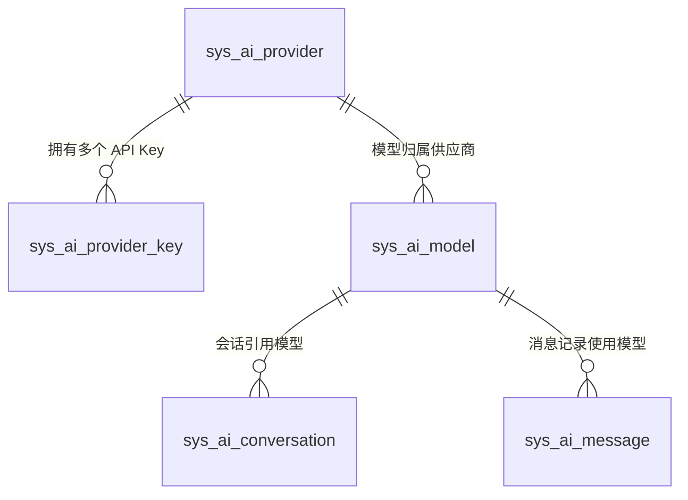
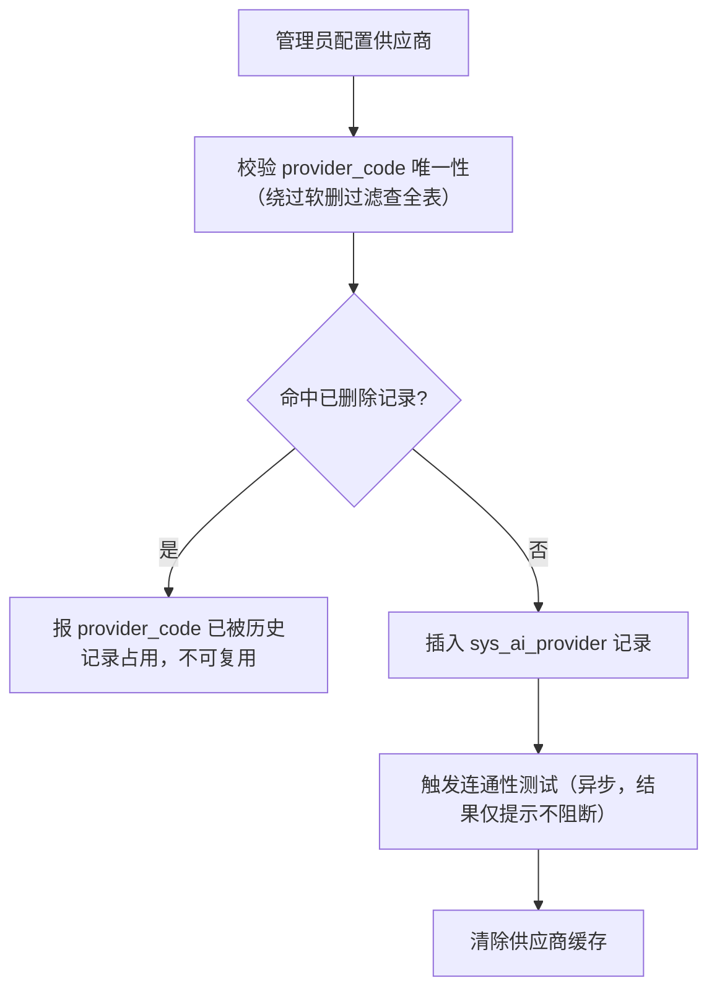
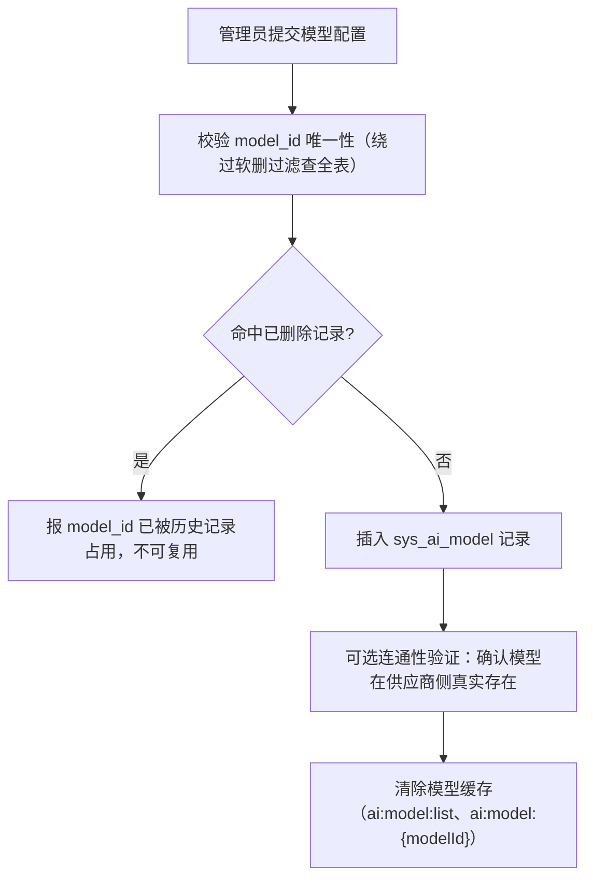
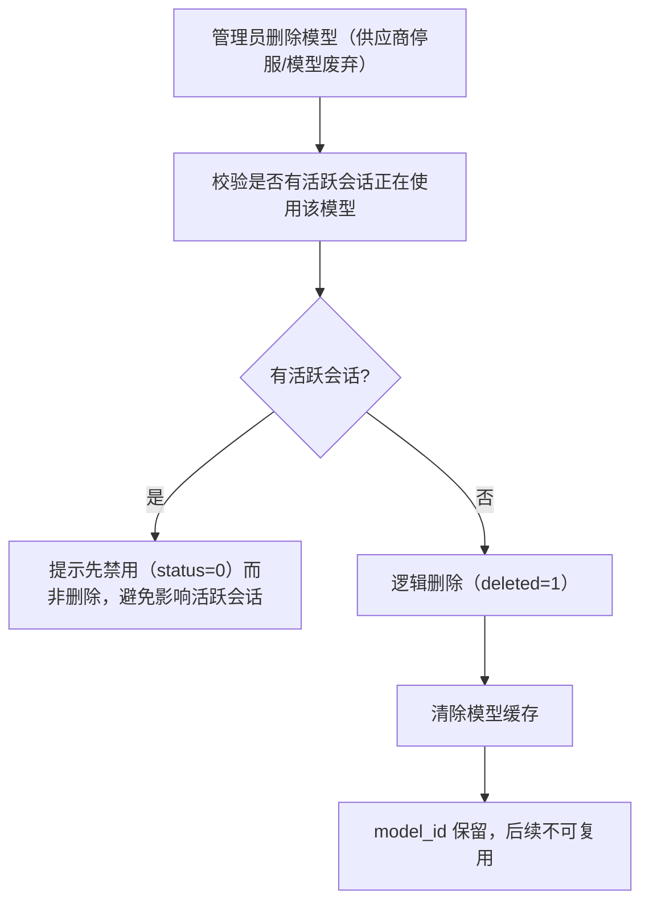

# AI 模型管理模块 - 后端实现设计

## 1. 文档概述

本文档描述 AI 模型管理模块的后端实现：模型供应商配置管理、API Key 管理、供应商健康与容错、模型配置与生命周期、模型注册表与路由、用量与成本分析。本模块承载平台全部 AI 模型（chat/embedding/rerank）与供应商的统一管理，消费方 AI 对话与 AI 知识库按模型类型接入。

模型选择与切换（§2.8）、推理调度与降级（§2.9）、Prompt Caching（§2.10）、结构化输出（§2.11）、计费集成（§3）描述本模块向 AI 对话推理链路提供的调度与计费换算能力；接口契约见 [API接口.md](./API接口.md)，表结构见 [02-系统架构/03-数据库设计.md](../../../02-系统架构/03-数据库设计.md)。

### 1.1 设计思想

#### 设计动机

本模块的根本矛盾是：**供应商外部服务的不可控性**（限流 429、宕机 5xx、涨价、停服）与**平台可用性/成本要求**之间的张力；同时模型成本与积分定价直接挂钩，定价错误会让平台亏损或让用户不满。设计目标是：**把不可控的供应商抽象为可控的配置层，用多级降级保证可用性，用显式价格档位保证成本透明**。

#### 核心设计原则

| 原则 | 说明 |
|------|------|
| 配置驱动 | 供应商、模型、API Key 全部数据库管理：协议差异、价格档位、VIP 门槛、降级链、能力标识均可配置，接入新供应商 = 插入一条配置，不改代码 |
| 降级容错 | 主模型不可用时自动沿降级链切换（A→B→C），用主键引用避免同模型多供应商歧义，降级模型必须能力匹配。用"配置冗余"换"服务可用" |
| 健康感知 | Key 级失败冷却 + 供应商级熔断两级容错：单 Key 故障不影响供应商，供应商整体故障自动切到备用供应商或降级模型，对用户无感 |
| 成本显性化 | 价格档位挂在模型上，积分换算完全可审计；Prompt Caching 让高频稳定前缀按折扣计费，降低用户成本也提升平台吞吐 |
| 密钥最小暴露 | API Key 明文不落库（SHA256 哈希查重 + AES 密文），不进入日志与上下文，多 Key 轮换与失败自动切换 |

#### 关键架构取舍

| 取舍点 | 方案对比 | 选择与理由 |
|--------|---------|-----------|
| 供应商配置存储 | 环境变量硬编码 vs 数据库配置 | 选数据库。环境变量只能静态配置、变更需重启；数据库配置可运行时调整、可区分协议差异、可支撑管理界面。加密密钥（`AI_PROVIDER_KEY_ENCRYPTION_KEY`）仍走环境变量 |
| API Key 组织 | 单 Key vs 多 Key（优先级+权重+失败切换） | 选多 Key。单 Key 遇限流即整个供应商不可用；多 Key 支持负载均衡、轮换、失败自动切换 |
| 供应商绑定 | 模型硬绑供应商 vs 同模型多供应商可切换 | 选后者。`(model_id, provider_id)` 联合唯一，同一模型可配多行，配合降级链实现"主备供应商" |
| 健康状态存储 | 落库持久化 vs 运行时聚合（Redis + 调用日志） | 选运行时聚合。健康指标是短时效信息，落库只会引入过期脏数据；熔断标记走 Redis TTL，不新增库表 |

#### 总体规划

模型是"地基层"，推理、会话、上下文等功能域都建立在其上：

```
供应商/Key（基础设施，含健康监控）→ 模型（价格档位 + 能力 + 降级链）→ LlmClient 调用
                                                                            ↓
                                  推理/会话/上下文（消费模型能力，按档位计费）
```

---

## 2. 模型供应商管理 (F-M08-007)

服务层落位（Python 端）：`ai_provider_service`（供应商 CRUD 与连通性测试）、`ai_provider_key_service`（Key CRUD 与选取冷却）、`provider_health_service`（健康聚合与熔断）、`ai_model_service`（模型 CRUD、路由、能力校验）、`ai_usage_stats_service`（运营统计），路由 `app/router/ai_provider.py`、`app/router/ai_model.py`。

### 2.1 数据模型

模型供应商管理涉及三张业务表（+ 售价表与只读引用的成本单价表）：

| 实体 | 职责 | 服务层关键用途 |
|------|------|-------------|
| `sys_ai_provider` | 供应商配置（API 地址、协议类型、认证方式、健康检查开关、用户身份透传配置、备注） | 供应商 CRUD、协议适配、连通性测试 |
| `sys_ai_provider_key` | 供应商 API Key（加密存储、优先级+权重选取、日额度/分钟频率限额） | Key CRUD、Key 选取与轮换、失败冷却 |
| `sys_ai_model` | 模型配置（`model_type`、embedding `dimension`、能力标识、降级链、VIP 门槛、图片换算上限、并发限制参考） | 模型 CRUD、能力校验、降级路由、VIP 过滤、生命周期、类型筛选 |
| `sys_ai_model_price` + `sys_ai_model_price_detail` | 用户售价（积分/百万 token，价格版本 + 档位明细：token 类型 × 上下文分段 × 时段） | 售价版本/档位维护、售价展示、计费换算读取 |
| `sys_ai_model_cost` + `sys_ai_model_cost_detail` | 成本单价（供应商采购价，元/百万 token；**表归 AI 计费管理模块**） | 本模块**只读引用**：调价评估、毛利测算 |

**ER 关系**：



`sys_ai_provider.provider_code` 与 `sys_ai_model.model_id` 均为业务引用键，逻辑删除后不可复用（逻辑删除类别②），查重必须绕过软删过滤查全表。`sys_ai_provider_key` 不使用逻辑删除（Key 管理为状态控制：启用/禁用/过期 + 物理删除）。同一 `model_id` 可通过不同 `provider_id` 配置多行，联合唯一索引 `(model_id, provider_id)` 保证不重复。

**API Key 安全**：明文不存储，只存哈希（SHA256，查重用）+ 密文（AES-256-CBC 后 base64 编码，运行时解密）；明文绝不进入日志与 LLM 上下文。加密密钥由环境变量 `AI_PROVIDER_KEY_ENCRYPTION_KEY` 注入，支持密钥轮换。日调用计数走 Redis（`ai:provider_key:{key_id}:daily:{date}`）不落库；`last_used_at` / `last_used_by` 走 Redis 缓冲 + 定时批量刷库，避免高并发频繁写库。

健康状态（健康/可疑/熔断）为运行时聚合信息，不落库：指标来自调用日志聚合，熔断标记走 Redis（`ai:provider:{provider_id}:circuit_open`），与 Key 冷却标记（`ai:provider_key:{key_id}:unavailable`）同机制。

### 2.2 供应商 CRUD

#### 新增供应商



供应商核心字段：

| 字段 | 说明 | 示例 |
|------|------|------|
| `provider_code` | 供应商编码（唯一，不可复用） | `openai`、`anthropic`、`deepseek` |
| `api_base_url` | API 基础地址 | `https://api.openai.com/v1` |
| `protocol_type` | 协议类型 | `openai_compat`（OpenAI 兼容）、`anthropic`（Claude 原生） |
| `auth_type` | 认证方式 | `bearer`、`x-api-key`、`custom`（头名在 `default_headers` 配置） |
| `default_headers` | 默认请求头（JSON） | `{"anthropic-version": "2023-06-01"}`；`auth_type=custom` 时保留键 `auth_header` 指定认证头名，其余键原样合并 |
| `sort_order` | 排序序号 | 数字越小越靠前 |
| `health_check_enabled` | 健康检查开关，`0` 时不参与熔断判定 | `1`（默认） |
| `user_identity_forward` | 用户身份透传配置（JSON），NULL 不启用 | `{"enabled":true,"field":"user_id","prefix":"u_","max_len":512}` |
| `remark` | 运维备注（账号归属、合同号），不参与逻辑 | — |

#### 连通性测试

按 `protocol_type` + `auth_type` + `default_headers` 组装最小探测请求（如 OpenAI 兼容协议 `GET /models`），超时 5s，记录连通状态/状态码/延迟/错误信息：

- 测试请求不携带用户上下文，不产生 Token 消耗与计费
- 保存供应商后由后台任务异步触发，结果仅提示，不阻断保存
- 常见失败原因：地址不可达、凭据无效（401/403）、协议不匹配，错误信息直接展示便于定位

#### 用户身份透传

`user_identity_forward.enabled=true` 时，`LlmClient` 组装请求体阶段注入脱敏用户标识：

- 取值规则：`prefix + sha256(userId)` 截断（受 `max_len` 约束），**不含任何用户隐私信息**（合规要求）
- 协议落位：`openai_compat` 按配置的 `field` 附加到请求体顶层；`anthropic` 按 `field` 嵌套路径注入（如 `metadata.user_id`）
- 透传字段与 `extra_request_params` 同受核心键保护（见 §2.5）
- 供应商按透传标识做并发限制，超限返回 429 时走 Key 失败冷却与降级容错（§2.3/§2.4）

#### 删除供应商

校验是否有启用模型引用该供应商：有则提示先禁用或删除关联模型；无则逻辑删除（`deleted=1`）并清除供应商缓存，`provider_code` 保留且不可复用。

### 2.3 API Key 管理

#### 新增 API Key

录入明文 → SHA256 哈希查重 → AES-256 加密为 `key_cipher` → 取前 8 位 + `...` 作为展示用 `key_prefix` → 插入记录（可选配置 `priority`/`weight`/`daily_quota`/`rpm_limit`）→ 仅返回 Key ID，不返回明文。

#### Key 选取策略

`LlmClient` 调用 LLM 时从 `sys_ai_provider_key` 选取可用 Key：

```
按 provider_id 查询所有 status=1 且未过期的 Key
    ↓
排除 Redis 冷却标记的 Key（ai:provider_key:{key_id}:unavailable）
    ↓
排除超出限额的 Key：
  - 日额度：ai:provider_key:{key_id}:daily:{date} ≥ daily_quota
  - 分钟频率：ai:provider_key:{key_id}:minute:{yyyyMMddHHmm} ≥ rpm_limit
    ↓
按 priority 升序取最高优先级组 → 组内按 weight 加权随机选取
    ↓
解密 key_cipher 获取明文 → 记录 last_used_at / last_used_by（Redis 缓冲后批量刷库）
    ↓
调用失败（401/429）→ 标记该 Key 冷却，切到下一个 Key 重试
```

#### 失败冷却与冷却升级

调用失败（401/403/429/5xx/超时）后写 Redis 冷却标记 `ai:provider_key:{key_id}:unavailable`，TTL 随连续失败次数升级（连续失败计数 `ai:provider_key:{key_id}:fail_streak`，成功调用清零）：

| 连续失败次数 | 冷却时长 |
|------------|---------|
| 1 次 | 5 分钟 |
| ≥ 3 次 | 15 分钟 |
| ≥ 5 次 | 30 分钟（上限） |

**两级容错关系**：Key 冷却解决单 Key 故障；Key 全部不可用或供应商熔断（§2.4）时，`LlmClient` 放弃当前供应商，转同模型备用供应商或模型降级链。Key 轮换为纯配置操作（新增新 Key 自动参与选取 → 禁用旧 Key → 确认无流量后删除），进行中的推理不受影响。

### 2.4 供应商健康与容错

#### 健康指标聚合

供应商健康指标由调用日志聚合得出，无独立采集任务：

| 指标 | 数据来源 | 聚合口径 |
|------|---------|---------|
| 成功率 | 消息/计费记录中的调用结果 | 近 24h 成功调用 / 总调用 |
| 429 限流率 | 调用错误码 | 近 24h 429 次数 / 总调用 |
| P95 延迟 | 调用耗时 | 近 24h P95 |
| 熔断状态 | Redis 标记 | 当前是否熔断 |

> 指标为只读聚合（定时计算缓存到 Redis `ai:provider:{provider_id}:health`），不进入调用链路热点。

#### 健康状态机

| 状态 | 触发条件（参考阈值，可配置） | 调度行为 |
|------|---------------------------|---------|
| 健康 | 错误率 < 10% | 正常参与选取 |
| 可疑 | 10% ≤ 错误率 < 30%，或 P95 延迟超基线 2 倍 | 降低选取权重，仍参与调用；触发运维告警 |
| 熔断 | 错误率 ≥ 30% 持续 1 分钟，或连续失败 ≥ 5 次 | 写 Redis `ai:provider:{provider_id}:circuit_open`（默认 TTL 60s）；该供应商下模型走降级链或同模型备用供应商；进行中的推理不受影响 |
| 恢复 | 冷却期结束或管理员手动解除 | 先按"可疑"低权重观察一段时间，再恢复常态 |

`LlmClient` 选取 Key 前先检查供应商健康状态：健康/可疑进入 §2.3 Key 选取；熔断则跳过该供应商——优先用同 `model_id` 其他 `provider_id` 行重试，无备用供应商则走模型降级链（§2.9），全部不可用才报错并推送 error 事件。

**熔断阈值配置**：错误率阈值、持续时长、冷却时长、连续失败次数存 `sys_dict`（类型 `ai_provider_health`），管理员可调无需改代码；读取后缓存到 Redis（TTL 5 分钟），未命中回落种子同源默认。

**ProviderHealthService 实现要点**：

- 指标运行时聚合不新增库表。Redis Key 约定：`circuit_open`（熔断标记）、`fail_streak`（连续失败计数）、`calls`（近 24h 调用滑动窗口，LPUSH+LTRIM）、`latency`（延迟列表取 P95）、`health`（聚合快照缓存）
- `record_call` 内联判定：连续失败 ≥5，或窗口 ≥20 次调用且错误率 ≥30% → 写 `circuit_open`；成功调用清零连续失败计数
- 健康开关为调用链路高频查询，`get_status` 只读 Redis 标记 `ai:provider:{id}:health_enabled`（供应商 CRUD 时写入，缺省视为开启）不读库；`health_check_enabled=0` 的供应商恒返回健康且不参与聚合判定
- 供应商列表逐项返回健康快照供看板展示；熔断可由管理员手动解除

### 2.5 模型配置管理

模型配置表 `sys_ai_model` 通过 `provider_id` 关联供应商，`model_type` 标识模型类型：

| model_type | 说明 | 特有配置 |
|-----------|------|---------|
| `chat` | 对话/推理模型 | 能力标识、价格档位（§2.12）、VIP 门槛、降级链 |
| `embedding` | 文本向量化模型 | `dimension`（向量维度，知识库建立向量索引时读取，创建后不可修改） |
| `rerank` | 重排序模型 | 知识库检索可选启用 |

`vip_level` 标识模型的最低可用 VIP 等级（`0`=所有用户、`1`=VIP1 及以上、`2`=VIP2 及以上），模型列表按当前用户等级过滤（`model.vip_level <= user_level`）。

`extra_request_params`（JSON）为**厂商私有请求参数**（如阿里云 `enable_thinking`、OpenAI `reasoning_effort`），随推理请求体透传：

- 绑定模型（删模型即删参数），由管理员在模型配置上显式声明，不开放给用户请求级透传（避免厂商差异上抛给用户、无 schema 校验、请求体污染）
- 采用**核心键保护**：仅补充 `model`/`messages`/`stream`/`stream_options`/`temperature`/`max_tokens`/`tools` 等核心键之外的键，调用方控制的参数不可被配置覆盖
- 厂商对未知参数容忍度不一，接入新厂商时按厂商文档核对参数名；配置错误由厂商 4xx 暴露。供应商级共有请求头走 `sys_ai_provider.default_headers`

**模型生命周期状态**：

| 状态 | 字段表达 | 行为 |
|------|---------|------|
| 启用 | `status=1, deleted=0` | 可选择、可路由、可计费 |
| 禁用 | `status=0, deleted=0` | 新会话不可选择、现有会话切换时不可再选；进行中的推理不受影响；可逆 |
| 已下线 | `deleted=1` | 不可逆；`model_id` 保留不可复用；需无活跃会话方可删除 |

### 2.6 模型 CRUD

#### 新增模型



更新与禁用模型均在写库后清除模型缓存：更新不影响历史会话与消息记录（消息记录实际使用的模型）；禁用后新会话与会话内切换均不可选，使用中的会话提示用户重新选择，进行中的推理不受影响。

#### 下线模型（替换迁移）

**标记"即将下线" = 禁用 + 通知**：供应商发布模型停服公告后，管理员禁用模型（`status=0`），服务端查出使用该模型的活跃会话用户（去重），取 `fallback_model_id` 指向的启用模型作为替换推荐，经 `MessageService.send` 推送站内信（去重键 `bizModule=ai_model, bizId=model_id`）；无替换模型则提示"暂未配置替代模型，请及时更换"。通知失败仅记日志，不阻断禁用流程。

**物理下线（逻辑删除）**：



逻辑删除要求无活跃会话，故无需再通知（通知发生在"禁用"阶段）；迁移窗口期内供应商不可用由降级链/同模型备用供应商自动兜底（§2.9）。

### 2.7 模型列表查询

启用模型列表（`list_enabled_models`）查询未删除且启用的模型，按供应商与显示名称排序，按当前用户 VIP 等级过滤，返回模型标识、显示名称、供应商信息、能力标识、积分单价档位、上下文/输出上限，并附以下派生字段：

| 字段 | 数据来源 | 说明 |
|------|---------|------|
| 速度档位 `speed_tier` | 供应商健康快照的 `p95_latency_ms` | `fast`（P95 < 2s）/ `medium`（< 8s）/ `slow`（其余）/ `unknown`（无健康数据）；阈值走配置 `AI_SPEED_TIER_FAST_P95_MS`、`AI_SPEED_TIER_MEDIUM_P95_MS` |
| 模型标签 | 显示名称 + 能力标识推导 | 供前端按能力/成本/场景筛选 |
| 降级标识 `is_fallback_target` | 该模型是否被其他启用模型的 `fallback_model_id` 引用 | 减少用户对"模型变化"的困惑 |

> 列表结果缓存于 Redis（`ai:model:list`，TTL 1h），健康快照仅在缓存重建时逐供应商读取，读取失败的模型档位降为 `unknown`，不影响列表返回。

### 2.8 模型选择与切换

**会话级模型绑定**：用户在会话设置中选择模型即更新 `sys_ai_conversation.model`，下一条消息使用新模型并按新模型档位计费，历史消息保持原 `model` 记录。

**模型能力校验**（`AiMessageService.send_message` → `AiModelService.validate_model_caps`）：

- 消息含文件附件时校验 `supports_multimodal=1`，且附件模态需与模型能力匹配（图片需视觉能力，文档/音视频需对应模态理解）
- 需要工具调用时校验 `supports_tool_call=1`
- 任一不满足返回 `A0601`（模型不可用）

**need_tools 判定**：主 Agent 恒定装载业务工具，除 `reasoning_mode=direct` 直连路径外几乎所有推理都要求 `supports_tool_call`，故默认按 `True` 校验（宁可对 direct 误拦，也不放行后在 tool_call 阶段中途失败）。优先级：`model_config.needTools` 显式值 > Agent `reasoning_mode` 判断 > 默认 `True`；会话锚定 Agent 固定为 `direct` 且未显式声明时跳过工具能力校验。

**上下文校验**：发送前估算输入上下文（会话历史 + 注入记忆 + 工具定义），超过 `max_context_tokens` 时先由上下文管理模块压缩后重新估算，仍超限则拒绝发送并提示用户拆分消息或更换更长上下文的模型。压缩逻辑由 [上下文管理](../../核心模块/AI对话/上下文管理/后端实现.md) 承载，本模块只做上限校验与超限提示。

**默认模型**：新建会话优先用用户偏好默认模型，未配置则取平台默认（配置 `ai.model.default`）。

### 2.9 模型路由与降级

主模型不可用（429、5xx、超时、供应商熔断）时自动切换，保证可用性：

```
调用失败或当前供应商熔断（§2.4）
    ↓
① 同模型备用供应商（同 model_id 的其他 provider_id 行，若存在）
    ↓
② 降级链：按 sys_ai_model.fallback_model_id（引用主键）逐级尝试
   - 校验降级模型 status=1 且能力匹配，不匹配则跳过继续下一级
   - 消息记录实际使用的降级模型，积分按降级模型档位扣减
    ↓
③ 全部失败 → 推送 error 事件，消息 status=3（失败），error 记录"主模型和降级模型均不可用"
```

**降级链**用主键引用而非 `model_id`，避免同一 `model_id` 在多供应商下降级指向歧义。**能力匹配校验**要求降级模型满足原模型的能力要求（多模态/工具调用/流式输出）。**与熔断联动**：熔断时优先切同模型备用供应商（模型不变，用户无感）；无备用供应商才走降级链（模型变化，前端提示"已切换到备用模型"）。

#### LlmClient 调用调度实现

`LlmClient.stream_chat` 按「候选路由序列 + 逐 Key 重试」调度。候选序列由 `AiModelService.get_call_routes` 返回（当前启用行 → 同模型备用供应商 → 降级链各级，含能力匹配过滤与防环）；每个候选路由内先判供应商熔断（熔断即跳过），再取 `list_usable_keys`（启用 + 未过期 + 非冷却 + 未超限额，priority 升序、同优先级 weight 降序，与 `select_key` 共享同一资格过滤）按序尝试：

- 调用失败 → `mark_call_failed`（冷却升级）+ `record_call(失败)` → 切下一个 Key；Key 耗尽 → 切下一候选路由
- 调用成功 → `mark_call_success`（清零连续失败 + `last_used` 缓冲）+ 日计数 INCR + `record_call(成功)`
- 全部候选失败 → 抛业务异常"主模型和降级模型均不可用"（含最后错误详情）

**流式失败两段处理**：连接建立/首字节前失败属可切换失败，标记 Key 失败后切换 Key 或候选路由；**流中断**（已下发部分内容）属不可重放失败，标记 Key 失败后直接抛出业务异常，不切换、不降级重试。

**实际路由归因透出**：调用成功后经 `on_route_result` 回调透出实际使用的 `model_id/model_pk/provider_id/key_id/latency_ms/error_code/request_id`，由 `DehazeChatModel` 写入 `AIMessage.response_metadata.call_meta`，经 `DehazeHooksMiddleware` 透传至 `after_agent` 计费结算钩子（降级计费 + 成本归因）。

### 2.10 Prompt Caching 优化

利用 OpenAI/Anthropic 的 Prompt Caching 降低成本与延迟：`cached_input_tokens` 记录缓存命中的 token 数，按缓存档位单价计费。

组装 prompt 时按"稳定前缀 + 动态后缀"分层，长度参考 `sys_ai_model.prompt_cache_prefix_len`：

- **稳定前缀**（放头部，可缓存）：系统提示词、长期记忆注入、工具定义 schema
- **动态后缀**（放尾部，不可缓存）：会话摘要、最近 N 轮消息、当前用户消息

`supports_prompt_cache=1` 时启用缓存（`openai_compat` 自动缓存；`anthropic` 需对稳定前缀注入 `cache_control: {"type": "ephemeral"}`），响应返回 `cached_input_tokens`；为 `0` 时正常调用且 `cached_input_tokens=0`。

### 2.11 结构化输出校验

工具调用参数与推理结果通过 JSON Schema 校验，防止 LLM 输出格式错误：`supports_structured_output=1` 时调用 API 传入 JSON Schema 由 API 保证格式；为 `0` 时服务端解析后自行校验，校验失败则记录错误并由 LLM 重试或降级处理。应用场景：工具调用参数、结构化推理结果（如算法推荐结果）、批量处理摘要。

### 2.12 计费比例应用（用户售价）

推理完成后按 token 用量换算积分：

```
从 sys_ai_model_price 读取生效价格版本（effective_from ≤ t < effective_to）
    ↓
三维匹配档位单价（sys_ai_model_price_detail）：
  ① 时段档位：按调用时刻 + 高峰时段规则（ai.billing.peak-hours）→ peak/idle
  ② 上下文分段：按本次输入总长度匹配 min ≤ len < max 的档位行
  ③ token 类型：input / cached / output 各取档位行单价（积分/百万 token）
    ↓
credits = (inputTokens − cachedInputTokens) × input单价/1M
        + cachedInputTokens × cached单价/1M
        + outputTokens × output单价/1M
Decimal 精确计算后四舍五入取整（单次至少 1 积分）
```

> **售价与成本价分离（对称结构）**：用户售价存 `sys_ai_model_price` + `sys_ai_model_price_detail`（积分/百万 token），供应商采购价存 `sys_ai_model_cost` + `sys_ai_model_cost_detail`（元/百万 token，归 AI 计费模块）。两表结构对称，共用价格版本选择、时段判定与分段匹配逻辑；调价生成新版本，历史消息按调用时刻对应版本计费（消息已记 credits，版本变更不影响历史）。积分换算按售价、成本核算按成本价，供应商调价只影响成本侧，用户售价由管理员基于毛利目标决策。

### 2.13 内置本地 provider（local_llm）

内置本地 LLM 作为零外部依赖的降级 provider（`provider_code = "local"`），以独立子进程运行（OpenAI 兼容，默认 `127.0.0.1:8992`），由 `local_llm_manager`（懒启动 + 健康探测 + 进程守护）管理，`local_llm_server` 承载推理（对话 Qwen3-0.6B / 向量 Qwen3-Embedding-0.6B，GGUF）。每次调用前先 `ensure_running` 确保子进程可用（串行化锁保护）。

**子进程生命周期**：

| 机制 | 说明 |
|------|------|
| 懒启动 | 首次调用时自动下载模型（断点续传）并拉起子进程 |
| 就绪等待 | `/health` 仅在模型加载完成后返回就绪，manager 轮询至就绪才放行 |
| 优雅退出 | PDEATHSIG + atexit 双保险，主进程退出时回收子进程 |
| 孤儿自愈 | 主进程被强杀遗留的孤儿（端口被占且不健康且非自管理 pid）SIGKILL 后接管重启 |

**误杀防护**：推理满载（尤其纯 CPU 构建）时 `/health` 响应变慢属正常现象——探测超时放宽至 10s；端口持有者为自管理子进程且探测无响应时先等待恢复（60s），超时才判定死锁重启；`ensure_running` 加锁防止并发请求交叉误杀或重复拉起。

**推理资源**：`LOCAL_LLM_NGPU_LAYERS` 未显式配置时自动检测，llama-cpp-python 为 CUDA 构建则全量卸载至 GPU，纯 CPU 构建回退 CPU；对话与嵌入共用一把异步锁，同一时刻仅一个推理执行、其余排队（排队可取消，断连即停）。安装侧以 PyPI sdist 为基线按本机指令集本地编译，Linux + NVIDIA GPU 环境需源码编译 CUDA 版覆盖安装（官方预编译 wheel 在部分消费级 CPU 上会触发非法指令崩溃）。

---

## 3. 计费集成

### 3.1 计费流程

```
消息推理完成
    ↓
LlmClient 透出实际路由归因 call_meta（model_id/provider_id/key_id/latency_ms/request_id）
  经 DehazeChatModel.response_metadata → DehazeHooksMiddleware → after_agent 结算钩子
    ↓
MessageService 统计 token 用量（input_tokens / output_tokens / cached_input_tokens）
    ↓
按 §2.12 换算积分（降级时取 call_meta 中实际使用的模型档位）
    ↓
更新 sys_ai_message.credits
    ↓
BillingService.settle()：差额退补 + 更新 sys_ai_billing，透传成本归因字段
    ↓
推送 message.end 事件（含 token 统计、积分消耗）
```

**成本归因字段**：`sys_ai_billing` 记录 `request_id`（串联日志与计费）、`provider_id`（实际供应商）、`error_code`、`latency_ms`、`actual_model`（用户原选模型，非空表示发生降级）、`model`（实际使用模型），支撑供应商健康聚合（§2.4）与成本对账（§4）。`settle` 仅写入非空值，历史记录不受影响；字段定义以 [02-系统架构/03-数据库设计.md](../../../02-系统架构/03-数据库设计.md) 为准。

### 3.2 配额校验

推理前的配额预校验、配额不足的 interrupt 与恢复、工具调用配额扣减均由 [AI 计费管理模块](../AI计费管理/后端实现.md) 承载，本模块只负责提供计费换算所需的模型档位与实际路由归因。

---

## 4. 用量与成本分析（运营视角）

面向管理员的运营视图，数据同源调用日志（`sys_ai_billing` 等）：

| 分析维度 | 数据来源 | 实现说明 |
|---------|---------|---------|
| 供应商健康看板 | Redis 健康快照 | 成功率、429 率、P95 延迟、熔断次数与持续时间（即 §2.4 聚合指标） |
| 模型用量分布 | `sys_ai_billing` | 按模型/供应商统计 Token 消耗、调用次数、积分开销，识别高成本与热销模型 |
| 降级与故障统计 | 降级频率取 `sys_ai_billing`（`actual_model` 非空，按原选模型聚合）；Key 失败切换取 Redis 冷却标记当前快照 | 驱动供应商与 Key 轮换决策 |
| 成本归因 | `sys_ai_billing` | 供应商、模型、Token 明细、售价与成本单价版本、是否降级、错误码、延迟，支撑成本核算与供应商实际账单对账 |
