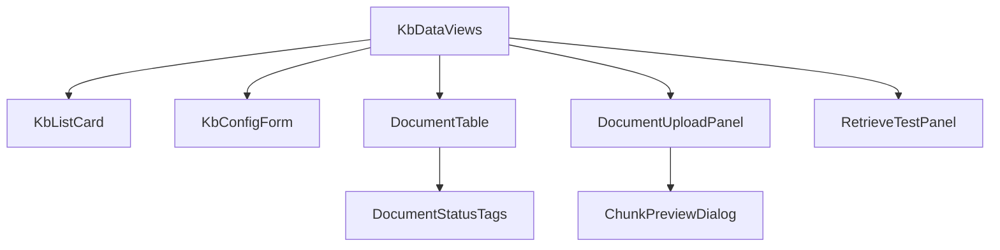

# AI 知识库模块 - 前端实现设计（公共）

## 1. 文档概述

本文档描述 AI 知识库模块**用户端与管理端共用的知识库数据视图层**：基于 `KnowledgeBaseVO` / `DocumentVO` / `ChunkVO` 的复用组件、Store 与数据流。核心设计是**视图同构、数据范围可切换**——用户端查看本人可见知识库（`scope=self`），管理端查看全部知识库（`scope=admin`），两端渲染同一套组件，仅查询参数与操作入口不同。

页面结构与交互规范见 [需求规格.md](./需求规格.md) §2.8，接口契约见 [API接口.md](./API接口.md) §2.1-2.4。用户端页面见 [前端实现-用户端.md](./前端实现-用户端.md)，管理端页面见 [前端实现-管理端.md](./前端实现-管理端.md)。Android / Flutter / Taro 等多端参考本 Web 端的组件结构与状态管理方案按各自技术栈适配。

> 本公共文档仅承载**知识库数据视图层**（列表 / 详情 / 文档管理 / 分块预览 / 检索测试输入）。创建向导的推荐配置引导（用户端）、索引状态区 / 召回测试集 / 低质量片段 / embedding 迁移（管理端）为端内特有，见各端文档；全局卡片 / 表格 / Tag 等组件属项目公共组件库，不在本模块文档定义。

---

## 2. 公共组件树设计

| 组件 | 职责 |
|------|------|
| KbDataViews | 知识库数据视图层容器（无独立路由），按 `scope` 渲染对应视图，供用户端/管理端页面嵌入 |
| KbListCard | 知识库卡片列表：名称/描述/可见性/统计（文档数/分块数/token 总数/处理中标记）；`scope=self` 按"我的/公共"分组，`scope=admin` 全量展示 |
| KbConfigForm | 知识库配置表单（创建/编辑）：名称/描述/可见性/向量化模型/分块/检索配置；模型选项从 [AI模型管理模块](../AI模型管理/API接口.md) 模型注册表拉取；`scope=self` 提供推荐默认值并提示不可改项，`scope=admin` 全量配置 |
| DocumentTable | 文档列表：标题/处理状态/分块数/更新时间 + 查看原文/删除/重新处理；处理中实时进度展示 |
| DocumentUploadPanel | 上传入口面板：单文件/批量/URL 导入/自定义文本 + 分块预览确认（复用 ChunkPreviewDialog） |
| ChunkPreviewDialog | 分块预览弹窗：展示分块内容/序号/token 数，可调整分块大小/重叠重新预览，确认后提交入库 |
| RetrieveTestPanel | 检索测试面板：输入问题 → 展示召回片段（内容/来源文档/相似度） |
| DocumentStatusTags | 行内处理状态标签组（待处理/处理中/已完成/失败），失败附错误原因可查看 |

> 组件只做数据获取与展示编排，是否提供创建/上传/删除等操作入口由宿主页面按 `scope` 与可见性决定。

---

## 3. 状态管理

### 3.1 Store 模块划分

| Store 模块 | 职责 | 生命周期 |
|-----------|------|---------|
| 知识库数据 Store（kbDataStore） | 知识库列表、详情、文档列表、检索测试；数据范围由 `scope`（self/admin）区分 | 宿主页面级，随嵌入的用户端/管理端页面初始化，离开销毁 |

### 3.2 核心状态

| 状态 | 说明 |
|------|------|
| `scope` | 数据范围（`self`=本人可见 / `admin`=全部含私有库只读监控），由宿主页面注入 |
| `kbList` | 知识库列表（含统计字段），驱动 KbListCard 渲染 |
| `kbListQuery` | 列表查询条件（scope、分组、搜索、分页） |
| `kbDetail` | 当前知识库详情（配置摘要 + 统计） |
| `documents` | 文档列表（含处理状态），驱动 DocumentTable 渲染 |
| `documentQuery` | 文档筛选条件（状态、分页） |

### 3.3 核心操作

| 操作 | 说明 |
|------|------|
| `fetchKbList` | 按 kbListQuery 拉取知识库列表（`scope=self` 走默认可见性过滤，`scope=admin` 带 `view=admin`） |
| `fetchKbDetail` | 拉取知识库详情 |
| `fetchDocuments` | 按 documentQuery 分页拉取文档列表 |
| `createKb` / `updateKb` / `deleteKb` | 知识库 CRUD，后端校验权限与配额 |
| `previewChunks` | 分块预览（基于 file_id + 分块配置，不向量化不写索引） |
| `uploadDocuments` | 提交文档入库（单/批量/URL/自定义文本，携带确认后的分块配置） |
| `deleteDocument` / `reprocessDocument` | 删除文档 / 重新处理失败文档 |
| `retrieveTest` | 检索测试，验证知识库检索效果 |

---

## 4. 数据流

| 视图 | 数据来源 | 获取时机 | 缓存策略 |
|------|---------|---------|---------|
| 知识库列表 | `GET /api/v1/kb`（scope 决定是否带 `view=admin`） | 视图挂载 + 筛选/分组变更 | 当前查询条件结果缓存；创建/删除后失效刷新 |
| 知识库详情 | `GET /api/v1/kb/{id}` | 进入详情页 | 页面级缓存；配置更新后失效 |
| 文档列表 | `GET /api/v1/kb/{id}/documents`（状态筛选 + 分页） | 挂载 + 筛选/分页/状态变更 | 当前查询条件结果缓存；上传/删除/重处理后刷新 |
| 分块预览 | `POST /api/v1/kb/documents/chunks/preview` | 用户触发 | 无 |
| 检索测试 | `POST /api/v1/kb/{id}/retrieve/test` | 用户触发 | 无 |

> 文档上传的异步处理进度由服务端推送（WebSocket），DocumentTable 监听本库处理状态变更实时刷新，列表接口轮询 `processing_status` 兜底。

---

## 5. 公共交互设计决策

| 交互点 | 技术选型 | 理由 |
|--------|---------|------|
| 视图同构、scope 驱动数据范围 | 组件/Store 统一以 `scope` 决定查询参数与操作入口 | 用户端=self、管理端=admin，同一份实现两端复用，杜绝重复开发 |
| 上传即预览 | DocumentUploadPanel 上传后先经 ChunkPreviewDialog 展示分块效果（可调参重新预览），确认后入库；跳过确认按库默认配置入库 | 分块质量决定检索效果，预览确认降低"入库后效果差"的返工 |
| 状态可见 | DocumentStatusTags 随行展示处理状态，处理中实时进度推送，失败附原因可"重新处理" | 异步处理长链路透明化，失败可定位可重试，减少用户疑虑 |
| 检索测试即对话效果 | RetrieveTestPanel 与 AI 对话检索共用同一检索链路 | 验证结果即对话实际效果，测试与使用口径一致 |
| 只读语义显性化 | 公共库（用户端）与私有库监控（管理端）仅展示信息与文档原文，不渲染内容操作入口 | 可见性边界在前端交互中显性表达，避免"看得到却操作失败"的体验断裂 |
