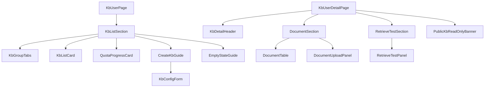

# AI 知识库模块 - 前端实现设计（用户端）

## 1. 文档概述

本文档描述 AI 知识库模块**用户端知识库页**的 Web 端（React）前端实现方案，聚焦页面编排、端内状态与交互决策。页面结构与交互规范见 [需求规格.md](./需求规格.md) §2.8.2，接口契约见 [API接口.md](./API接口.md) §2.1-2.4。知识库列表/详情/文档管理/分块预览/检索测试等**知识库数据视图层**为用户端与管理端共用，见 [前端实现-公共.md](./前端实现-公共.md)（本端以 `scope=self` 使用）。

用户端知识库页承担"知识消费 + 轻量私有知识沉淀"：列表页按"我的/公共"分组展示，详情页承载文档管理与检索测试。

---

## 2. 组件树设计

| 组件 | 职责 |
|------|------|
| KbUserPage | 知识库列表页容器与路由入口，编排分组/配额/创建引导 |
| KbListSection | 列表区：分组 Tab + 卡片列表 + 配额进度 + 创建入口 |
| KbGroupTabs | 分组切换（我的知识库 / 公共知识库） |
| KbListCard（公共） | 知识库卡片：`scope=self`，我的/公共分组按可见性展示；公共库卡片标注"平台公共知识库" |
| QuotaProgressCard | 私有库配额进度（已建 X/Y）+ 配额达限时创建入口置灰并引导升级会员 |
| CreateKbGuide | 创建向导：嵌入公共 KbConfigForm（推荐默认值 + 不可改项提示），提交走 `createKb` |
| EmptyStateGuide | 空状态引导"创建我的第一个知识库"，触发创建向导 |
| KbUserDetailPage | 知识库详情页容器与路由入口（我的/公共库共用同一详情页） |
| KbDetailHeader（公共） | 基本信息区：名称/描述/可见性/配置摘要/统计 |
| DocumentSection | 文档管理区容器：嵌入公共 DocumentTable + DocumentUploadPanel |
| RetrieveTestSection | 检索测试区容器：嵌入公共 RetrieveTestPanel，验证本人库对话可用性 |
| PublicKbReadOnlyBanner | 公共库只读提示条（浏览公共库时展示，隐藏创建/上传/删除操作入口） |

---

## 3. 状态管理

### 3.1 Store 模块划分

| Store 模块 | 职责 | 生命周期 |
|-----------|------|---------|
| 用户端知识库 Store（userKbStore） | 分组选择、配额进度、创建向导、详情页只读语义 | 页面级，进入知识库页初始化，离开销毁 |
| 知识库数据 Store（kbDataStore，公共） | 知识库列表/详情/文档列表/检索测试（scope=self） | 宿主页面级 |

### 3.2 核心状态

| 状态 | 说明 |
|------|------|
| `activeGroup` | 当前分组（mine / public） |
| `quota` | 私有库配额与已建数量（来自会员权益 + 列表统计） |
| `createDialog` | 创建向导弹窗状态（`{visible}`） |
| `currentKbVisibility` | 当前详情页知识库可见性，驱动 PublicKbReadOnlyBanner 与操作入口显隐 |

> 知识库列表（`kbList`/`kbListQuery`）、详情（`kbDetail`）、文档（`documents`/`documentQuery`）状态在公共 kbDataStore 中，本端以 `scope=self` 注入。

### 3.3 核心操作

| 操作 | 说明 |
|------|------|
| `switchGroup` | 切换我的/公共分组，重置列表查询并重新拉取 |
| `openCreateGuide` | 打开创建向导（配额达限时置灰并引导升级会员） |
| `submitCreate` | 提交创建向导表单（经 kbDataStore.createKb），成功后刷新列表与配额 |
| `openKbDetail` | 进入详情页，注入当前库可见性（只读语义） |
| `jumpToCitation` | 引用溯源跳转：由 AI 对话携带 `documentId + page + paragraph` 定位文档原文高亮 |

> 列表（`fetchKbList`）、详情（`fetchKbDetail`）、文档（`fetchDocuments`）、上传（`uploadDocuments`）、检索测试（`retrieveTest`）操作在公共 kbDataStore 中。

---

## 4. 路由设计

| 路由路径 | 页面 | 权限控制 |
|---------|------|---------|
| `/kb` | 用户端知识库列表页 | 登录用户 |
| `/kb/:id` | 知识库详情页（我的/公共库共用） | 登录用户；公共库全员可浏览，私有库校验所有权（后端） |

> AI 对话引用溯源跳转（`/kb/:id?citation=文档Id:页码:段落`）由全局导航统一处理，不在本模块路由内重复定义。

---

## 5. 数据流

### 5.1 数据获取策略

端内特有区块如下，共用视图（详情/文档列表/分块预览/检索测试）的数据流见 [前端实现-公共.md](./前端实现-公共.md) §4。

| 区块 | 数据来源 | 获取时机 | 缓存策略 |
|------|---------|---------|---------|
| 列表区 | `GET /api/v1/kb`（scope=self 默认可见性过滤） | 进入页面 + 分组/搜索变更 | 当前分组结果缓存；创建/删除后刷新 |
| 配额进度 | 会员权益配额 + 列表已建数量 | 列表加载时 | 页面级缓存；创建成功后更新 |

### 5.2 更新策略

- **配额联动**：创建成功后刷新列表与配额进度；配额达限（已建 = 上限）时创建入口置灰并展示升级会员引导
- **只读语义**：`currentKbVisibility = public` 时隐藏创建/上传/删除入口，仅保留浏览文档与查看原文（KbDetailHeader 配置项只读）
- **状态联动**：文档处理完成/失败经服务端推送实时刷新 DocumentTable；失败文档展示原因并可"重新处理"

---

## 6. 交互设计决策

| 交互点 | 技术选型 | 理由 |
|--------|---------|------|
| 创建向导推荐配置 | CreateKbGuide 嵌入 KbConfigForm（推荐默认值 + 高级配置折叠 + 不可改项提示） | 普通用户不感知底层参数，同时明确"创建后不可修改"防返工 |
| 配额进度前置 | 列表页顶部 QuotaProgressCard 常驻 | 私有库配额是用户端核心约束，进度前置让"还能建几个"一目了然，达限直接引导升级 |
| 空状态引导 | EmptyStateGuide 首屏引导"创建我的第一个知识库" | 新用户无库时降低上手门槛，直接串联创建闭环 |
| 公共库只读语义 | PublicKbReadOnlyBanner 提示 + 操作入口隐藏 | 可见性与权限边界显性化，避免"看得到却操作失败"的体验断裂 |
| 引用溯源跳转 | 对话引用编号点击 → `/kb/:id` 定位原文高亮 | 让用户可核实知识来源，提升引用可信度 |
