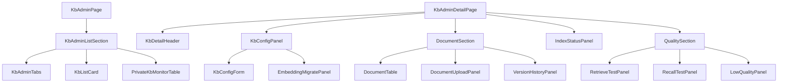

# AI 知识库模块 - 前端实现设计（管理端）

## 1. 文档概述

本文档描述 AI 知识库模块**管理端知识库页**的 Web 端（React）前端实现方案，聚焦页面编排、端内状态与交互决策。页面结构与交互规范见 [需求规格.md](./需求规格.md) §2.8.3，接口契约见 [API接口.md](./API接口.md) §2.1-2.4。知识库列表/详情/文档管理/分块预览/检索测试等**知识库数据视图层**为用户端与管理端共用，见 [前端实现-公共.md](./前端实现-公共.md)（本端以 `scope=admin` 使用）。

管理端知识库页承担"平台知识资产运营"：公共知识库完整管理（配置/文档/版本）+ 全部私有库只读监控 + 检索质量评估（检索测试/召回测试/低质量片段）。

---

## 2. 组件树设计

| 组件 | 职责 |
|------|------|
| KbAdminPage | 管理端知识库列表页容器与路由入口，编排公共库管理 + 私有库监控 |
| KbAdminListSection | 列表区：Tab 切换（公共知识库 / 私有库监控） |
| KbAdminTabs | 公共知识库 / 私有库监控切换 |
| KbListCard（公共） | 公共知识库卡片：`scope=admin` 全量管理（创建/编辑/删除/配置），展示统计与索引状态标识 |
| PrivateKbMonitorTable | 私有库监控表（只读）：创建者/容量/文档数/索引健康/失败文档数，仅监控与审计，无内容操作入口 |
| KbAdminDetailPage | 公共知识库详情页容器（私有库监控行不进入详情页） |
| KbDetailHeader（公共） | 基本信息区：名称/描述/可见性/配置摘要/统计 |
| KbConfigPanel | 配置管理区：嵌入公共 KbConfigForm（全量配置，模型选项从 [AI模型管理模块](../AI模型管理/API接口.md) 注册表拉取）+ embedding 模型下线迁移入口 |
| EmbeddingMigratePanel | embedding 迁移面板：选择目标模型 → 批量重新向量化 → 重建索引 |
| DocumentSection | 文档管理区容器：公共 DocumentTable + DocumentUploadPanel + 端内版本历史 |
| VersionHistoryPanel | 版本历史：最近 5 个版本列表，查看历史版本内容与恢复 |
| IndexStatusPanel | 索引状态区：索引大小/索引文档数/阈值告警状态 + 分块数/token 总数/处理失败任务 |
| QualitySection | 检索质量区容器：Tab 切换（检索测试 / 召回测试 / 低质量片段） |
| RetrieveTestPanel（公共） | 检索测试：调试输入 → 召回片段 + 相似度，可标注应命中段落 |
| RecallTestPanel | 召回测试：测试集管理（问题 + 期望命中段落）+ 版本对比（调参后重跑，对比 Recall@K 与命中率） |
| LowQualityPanel | 低质量片段：被点踩片段列表（关联 chunk_id），清理或触发重新分块 |

---

## 3. 状态管理

### 3.1 Store 模块划分

| Store 模块 | 职责 | 生命周期 |
|-----------|------|---------|
| 管理端知识库 Store（adminKbStore） | 私有库监控、索引状态、embedding 迁移、召回测试、低质量片段 | 页面级，进入知识库管理页初始化，离开销毁 |
| 知识库数据 Store（kbDataStore，公共） | 知识库列表/详情/文档列表/检索测试（scope=admin） | 宿主页面级 |

### 3.2 核心状态

| 状态 | 说明 |
|------|------|
| `adminTab` | 列表区当前 Tab（public / private） |
| `privateKbs` | 私有库监控列表（创建者/容量/索引健康/失败文档数，来自 `GET /api/v1/kb?view=admin`） |
| `indexStats` | 当前库索引状态（索引大小/索引文档数/阈值告警状态，来自 `GET /api/v1/kb/{id}/index-stats`） |
| `qualityTab` | 检索质量区当前 Tab（retrieve / recall / low-quality） |
| `recallSets` | 召回测试集列表（问题 + 期望命中段落） |
| `recallCompare` | 召回测试版本对比结果（Recall@K 与命中率） |
| `lowQualityChunks` | 低质量片段列表（被点踩片段，类型筛选 + 分页） |
| `migrateDialog` | embedding 迁移弹窗状态（`{visible}`） |

> 知识库列表（`kbList`/`kbListQuery`，`scope=admin` 带 `view=admin`）、详情（`kbDetail`）、文档（`documents`/`documentQuery`）状态在公共 kbDataStore 中，本端以 `scope=admin` 注入。

### 3.3 核心操作

| 操作 | 说明 |
|------|------|
| `switchAdminTab` | 切换公共知识库/私有库监控，重置列表查询 |
| `fetchPrivateKbs` | 拉取私有库监控列表（只读） |
| `fetchIndexStats` | 拉取当前库索引状态，驱动 IndexStatusPanel 与 1GB 告警展示 |
| `submitEmbeddingMigrate` | 提交 embedding 迁移（选择目标模型 → 重建索引） |
| `fetchRecallSets` / `runRecallSet` | 拉取测试集 / 执行测试集并生成版本对比 |
| `fetchLowQuality` | 按筛选条件分页拉取低质量片段 |
| `disposeLowQuality` | 处置低质量片段（清理或触发重新分块） |
| `restoreVersion` | 恢复历史版本（重新设为当前版本并重建索引） |

> 列表（`fetchKbList`）、详情（`fetchKbDetail`）、文档（`fetchDocuments`）、上传（`uploadDocuments`）、检索测试（`retrieveTest`）操作在公共 kbDataStore 中。

---

## 4. 路由设计

| 路由路径 | 页面 | 权限控制 |
|---------|------|---------|
| `/admin/ai-knowledge` | 管理端知识库列表页 | 管理员（`kb:manage`） |
| `/admin/ai-knowledge/:id` | 公共知识库详情页 | 管理员（`kb:manage`）；私有库不进入详情页（监控在列表内） |

> 路由守卫校验权限标识：无 `kb:manage` 禁止访问；列表内私有库监控行仅展示，不提供详情跳转与内容操作。

---

## 5. 数据流

### 5.1 数据获取策略

端内特有区块如下，共用视图（文档列表/分块预览/检索测试）的数据流见 [前端实现-公共.md](./前端实现-公共.md) §4。

| 区块 | 数据来源 | 获取时机 | 缓存策略 |
|------|---------|---------|---------|
| 公共库列表 | `GET /api/v1/kb?view=admin` | 进入页面 + 切换 Tab + 筛选变更 | 当前查询条件结果缓存；创建/删除后失效 |
| 私有库监控 | `GET /api/v1/kb?view=admin`（按可见性过滤私有库） | 切换 Tab 时加载 | 当前结果缓存；进入时刷新 |
| 索引状态区 | `GET /api/v1/kb/{id}/index-stats` | 进入详情页 + 手动刷新 | 无（索引状态实时性优先） |
| 检索质量区 | 检索测试 / 测试集 / 低质量片段接口 | Tab 切换时按需加载 | 当前筛选结果缓存 |

### 5.2 更新策略

- **索引告警**：`indexStats.indexSize` 超阈值（默认 1GB）时 IndexStatusPanel 红色告警，引导调整分块策略或清理低价值文档
- **私有库监控只读**：私有库行仅展示容量/索引健康/失败文档，点击不进入详情，避免越权操作
- **召回测试对比**：调整分块/检索参数后重跑同一测试集，`recallCompare` 输出 Recall@K 与命中率对比，驱动调优决策
- **低质量片段闭环**：处置（清理/重新分块）后刷新列表，与用户点踩反馈形成闭环
- **文档状态联动**：批量上传/算法同步入库后，文档处理状态经服务端推送实时刷新；失败文档集中列出可批量重新处理

---

## 6. 交互设计决策

| 交互点 | 技术选型 | 理由 |
|--------|---------|------|
| 概览-详情-质量三层组织 | 列表页（公共管理 + 私有监控）→ 详情页（配置/文档/索引/质量四区） | 列表回答"有哪些库"，详情回答"怎么管好一个库"，质量区回答"检索效果如何"，符合运营决策路径 |
| 私有库监控只读 | PrivateKbMonitorTable 列表内展示，无详情跳转与操作 | 管理端审计视角与创建者所有权边界分离，监控不越权 |
| 索引告警内联 | IndexStatusPanel 阈值告警红色标识 + 引导处置 | 索引健康是知识质量底座，告警"可见可追"，直接关联处置入口 |
| 质量闭环可视化 | 召回测试版本对比 + 低质量片段处置联动 | 调参效果量化对比，低质量片段处置与点踩反馈闭环，支撑检索质量持续优化 |
| 批量维护效率 | DocumentUploadPanel 批量/URL/算法同步 + 失败批量重处理 | 适配平台算法更新节奏，减少逐条操作成本 |
| 权限收敛 | 详情页/质量区/迁移按权限标识显隐 | 检索质量数据与迁移操作属高权能力，界面显隐与后端权限一致 |
