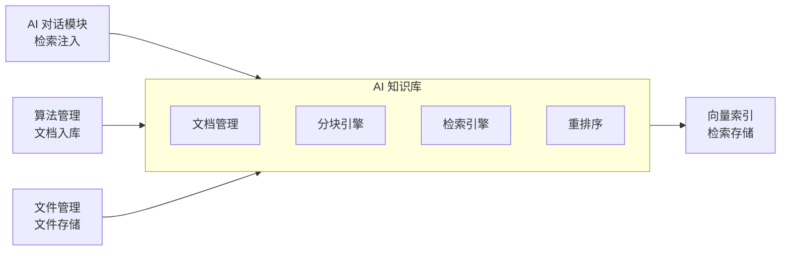

# AI 知识库模块需求规格

## 1. 模块概述

### 1.1 模块定位

AI 知识库模块是 AI 工作平台的知识基础设施，负责管理系统专业知识（算法文档、用户手册、最佳实践、用户上传文档），构建向量索引，为 AI 对话、语音问答及系统其他能力提供检索增强生成（RAG）支持。知识库是 LLM 准确理解图像处理专业领域知识的唯一知识来源。

### 1.2 核心价值

| 价值维度 | 具体内容 |
|---------|---------|
| **知识沉淀** | 将算法文档、操作经验、最佳实践、用户上传文档结构化入库 |
| **检索增强** | AI 对话时根据用户提问自动检索相关知识片段注入 LLM prompt，含来源引用 |
| **文档理解** | 支持 PDF/Word/Excel/PPT/Markdown/图片等多种格式的深度解析（OCR/表格提取） |
| **经验复用** | 历史处理经验（场景-算法匹配、参数推荐）沉淀为可检索知识（远期） |
| **知识更新** | 算法更新、新增算法时，知识库同步新增算法文档，LLM 自动获取最新知识 |
| **能力开放** | 知识库检索作为 MCP tool（kb_search）暴露，可被 AI 对话及其他 Agent 调用 |

### 1.3 依赖关系



| 依赖方向 | 模块 | 依赖说明 |
|---------|------|---------|
| 依赖 | **文件管理** | 知识文档的文件上传、存储、URL 拼接 |
| 依赖 | **算法管理** | 算法文档变更时由算法管理模块调用知识库 API 入库（详见 §1.4） |
| 依赖 | **会员管理** | VIP 等级决定用户可建知识库数与容量配额（详见 §1.4） |
| 依赖 | **AI 计费管理** | RAG 检索注入的 Token 消耗计入 AI 积分（随对话输入 Token 计量） |
| 被依赖 | **AI 对话模块** | 对话过程中检索知识注入 LLM prompt（含来源引用） |
| 被依赖 | **语音交互模块** | 语音问答同样注入知识库检索（ASR 转文本→检索→注入→TTS） |
| 被依赖 | **MCP 能力网关** | 知识库检索暴露为 MCP tool（kb_search），供 AI 对话及其他 Agent 调用（详见 §2.7） |

### 1.4 模块协同

| 协同模块 | 协同内容 |
|---------|---------|
| **会员管理** | VIP 等级决定用户可建私有知识库数与单库容量配额（普通/VIP1/VIP2/SVIP 递增，见 §2.1.3）；公共知识库全员只读，不受个人配额限制 |
| **AI 计费管理** | RAG 检索注入的 Top-K 片段 Token 消耗计入 AI 积分（随对话输入 Token 计量，bill_type=kb_inject）；知识库管理操作（上传/检索测试）不计费 |
| **算法管理** | 算法管理模块的算法文档变更**触发新增知识库文档**（非重建现有文档），由算法管理模块调用知识库文档创建 API 入库（source=algorithm_sync）；知识库不主动监听算法变更，避免双向耦合 |
| **MCP 能力网关** | 知识库检索暴露为 MCP tool（kb_search），AI 对话及第三方 Agent 可通过 MCP 网关调用检索能力（详见 §2.7） |
| **语音交互模块** | 语音问答链路同样注入知识库检索：ASR 转文本 → 知识库检索 → 注入 LLM prompt → TTS 合成回复 |
| **AI 对话模块** | 对话时调用检索注入接口，检索结果按 LLM prompt 格式注入并附带引用溯源 |

---

## 2. 功能需求

### 2.1 知识库管理 (F-KB-001)

#### 2.1.1 知识库 CRUD

| 操作 | 说明 |
|------|------|
| 创建知识库 | 配置名称、描述、可见性、embedding 模型、分块策略、检索策略 |
| 编辑知识库 | 修改名称、描述、检索策略（分块策略和 embedding 模型创建后不可修改） |
| 删除知识库 | 软删除，同时软删除关联的所有文档和分块，并删除 ES 索引 |
| 知识库列表 | 展示当前用户可见的知识库（个人私有库 + 平台公共库），含文档数/分块数/token 总数统计 |

#### 2.1.2 权限与可见性控制

知识库按可见性分为公开库与私有库，按角色/VIP 等级进行访问控制：

| 可见性 | 说明 | 访问控制 |
|--------|------|---------|
| **公开（public）** | 平台公共知识库，由管理员维护 | 全员只读；仅管理员可创建/编辑/删除 |
| **私有（private）** | 用户个人知识库 | 仅创建者可读写；其他用户不可见 |

- 私有库数量受 VIP 等级配额限制（见 §2.1.3）
- 检索接口按可见性过滤：私有库仅返回创建者自己的库，公共库对所有登录用户可见
- 知识库详情、文档管理接口校验所有权（私有库）或只读权限（公共库）

#### 2.1.3 容量与配额管理

| 配额项 | 普通用户 | VIP1 | VIP2 | SVIP | 说明 |
|--------|---------|------|------|------|------|
| 可建私有知识库数 | 3 | 10 | 30 | 100 | 超出时拒绝创建并提示升级 |
| 单库文档数上限 | 500 | 500 | 500 | 500 | 上传时校验，超出拒绝 |
| 单库分块数上限 | 10,000 | 10,000 | 10,000 | 10,000 | 索引构建时校验，超出拒绝并告警 |

- 公共知识库不受个人配额限制，由管理员独立管理
- ES 索引大小监控：单库索引超过阈值（默认 1GB）触发告警，管理员可调整分块策略或清理低价值文档
- 配额字段配置复用会员管理权益配置功能，落地见[会员管理需求规格 §5](../会员管理/需求规格.md)

#### 2.1.4 知识库配置

| 配置项 | 说明 | 可选值 |
|--------|------|--------|
| 可见性 | 知识库可见范围 | 公开 / 私有 |
| embedding 模型 | 文本向量化的模型，创建后不可修改 | text-embedding-3-small / text-embedding-3-large / bge-m3 / bge-large-zh |
| 分块策略 | 文档分块方式 | 固定长度 / 语义切分 / 递归切分 / 问答对 / 表格感知 |
| 分块大小 | 每个分块的 token 数 | 50-2000（默认 800） |
| 分块重叠 | 相邻分块的重叠 token 数 | 0-200（默认 80） |
| 检索策略 | 检索时使用的匹配方式 | 纯向量 / 纯关键词(BM25) / 混合检索 |
| Top-K | 检索返回的最相关片段数 | 1-50（默认 5） |
| 相似度阈值 | 低于此分数不返回 | 0.1-0.99（默认 0.5） |
| 重排序 | 是否启用 Rerank 模型对检索结果二次排序 | 是 / 否（需额外配置 Rerank 模型） |

> 混合检索采用 ES RRF（Reciprocal Rank Fusion）融合向量与关键词检索结果，rank_constant/rank_window 可配，不使用固定向量权重（详见 §2.4.1）。

### 2.2 文档管理 (F-KB-002)

#### 2.2.1 文档上传

| 操作 | 说明 |
|------|------|
| 上传文档 | 支持 PDF/Word(.docx)/Excel(.xlsx)/PPT(.pptx)/Markdown(.md)/TXT/图片(.jpg/.png) |
| 批量上传 | 一次上传多个文档 |
| 导入网页 | 通过 URL 导入网页内容为文档 |
| 自定义文本 | 直接粘贴文本创建文档 |

#### 2.2.2 文档解析

根据文档格式自动选择解析策略：

| 文档格式 | 解析策略 | 提取能力 |
|---------|---------|---------|
| PDF | OCR（扫描件）/ 文本提取（电子档） | 文字、表格、图片描述 |
| Word (.docx) | 文本提取 | 文字、表格、段落结构 |
| Excel (.xlsx) | 表格感知 | 单元格内容、行列结构 |
| PPT (.pptx) | 文本提取 | 幻灯片文字、备注 |
| Markdown (.md) | 纯文本 | 文字、代码块 |
| TXT | 纯文本 | 文字 |
| 图片 (.jpg/.png) | OCR | 图片中的文字 |

#### 2.2.3 文档管理

| 操作 | 说明 |
|------|------|
| 文档列表 | 按知识库展示文档列表，含处理状态（待处理/处理中/已完成/失败） |
| 查看原文 | 查看解析后的纯文本内容 |
| 删除文档 | 删除文档及关联的所有分块（软删除文档，清除 ES 索引分块） |
| 重新处理 | 对处理失败的文档重新分块和入库 |
| 处理进度 | 通过 WebSocket/SSE 实时推送文档的解析和入库进度（复用消息通知模块的 WebSocket 通道） |

#### 2.2.4 文档版本管理

文档更新保留历史版本，支持回溯：

- 文档记录 `version` 字段，更新文档时版本号 +1，旧版本分块索引归档（不立即删除，支持回滚）
- 默认仅最新版本参与检索，历史版本可通过管理界面查看与恢复
- 版本历史保留最近 5 个版本，超出后清理最旧版本的分块索引

#### 2.2.5 导入导出与备份（远期）

- 导出：支持将知识库文档与分块导出为标准格式（JSON/Markdown 归档），便于迁移与备份
- 导入：支持批量导入已导出的知识归档，快速重建知识库
- 本需求为远期规划，近期不实现

### 2.3 分块与索引 (F-KB-003)

#### 2.3.1 分块策略

参考 Dify/RAGFlow 的最佳实践，支持多种分块策略：

| 策略 | 说明 | 适用场景 |
|------|------|---------|
| **固定长度** (fixed) | 按固定 token 数切分 | 简单文本，无结构要求 |
| **语义切分** (semantic) | 按段落/句子切分，保留语义完整性 | 结构化文档、技术文章 |
| **递归切分** (recursive) | 先按段落，再按句子，层层细化 | 层次化文档 |
| **问答对** (qa) | 按 Q&A 结构切分（Q 单独分块 + A 单独分块） | FAQ 类文档 |
| **表格感知** (table) | 表格完整保留不分块，附带行列元数据 | Excel 表格数据 |

#### 2.3.2 索引构建流程

```
文档上传
    ↓
文档解析（OCR/文本提取/表格提取）
    ↓
文本清洗（去除噪声、统一格式）
    ↓
按配置的分块策略切分为片段
    ↓
每个片段调用 Embedding 模型向量化
    ↓
写入向量索引（向量 + 原文 + 元数据 + 关键词）
    ↓
更新文档处理状态为"已完成"
```

#### 2.3.3 索引更新

| 触发条件 | 说明 |
|---------|------|
| 文档新增 | 新文档解析后自动构建索引 |
| 文档删除 | 删除文档后从索引中移除所有关联分块 |
| 知识库删除 | 删除知识库后移除索引中所有关联分块 |
| 文档更新 | 更新文档生成新版本，旧版本分块归档（见 §2.2.4） |

#### 2.3.4 Embedding 模型下线迁移

当某 embedding 模型供应商下线模型时：

- 标注该模型为"已下线"，禁止新建使用该模型的知识库
- 已有知识库需切换至新模型并**重建索引**（重新向量化所有分块，向量维度随新模型变化）
- 提供迁移工具：选择目标 embedding 模型 → 批量重新向量化 → 重建 ES 索引 mapping（dense_vector 维度更新）

### 2.4 检索引擎 (F-KB-004)

#### 2.4.1 检索方式

| 方式 | 说明 | 使用场景 |
|------|------|---------|
| **向量检索** (vector) | 基于语义相似度的向量近邻查询 | 语义匹配、模糊查询 |
| **关键词检索** (keyword) | 基于关键词的全文本匹配 | 精确术语查询 |
| **混合检索** (hybrid) | ES RRF 融合向量 + 关键词检索（默认） | 通用场景，兼顾语义和精确 |

混合检索使用 ES 8.x 内置 `retriever` API 的 RRF（Reciprocal Rank Fusion）算法，单次查询同时执行向量与关键词检索并融合排序，各 retriever 权重可配，消除不同检索器分数不可比的误差。**不使用固定向量权重（如 0.7）的手写加权融合**。

#### 2.4.2 检索后处理

| 能力 | 说明 |
|------|------|
| **Rerank 重排序** | 使用 Cross-Encoder 模型对检索结果二次排序，提升 Top-K 精度 |
| **MMR 多样性** | Maximum Marginal Relevance 算法，去除高度重复的结果，保留多样性 |
| **相似度阈值** | 低于阈值的片段不返回，避免注入无关内容 |
| **数量限制** | 单次最多返回 Top-K 个片段，避免 prompt 过长 |

#### 2.4.3 元数据过滤

检索前可通过元数据过滤缩小检索范围：

| 过滤维度 | 说明 | 示例 |
|---------|------|------|
| 文档来源 | 指定检索的知识库 | 只检索"算法文档"知识库 |
| 文档类型 | 按文档类型过滤 | 只看"PPT"和"Word"文档 |
| 标签 | 按标签过滤 | 只看"去雾算法"相关的分块 |
| 时间范围 | 按文档创建/更新时间过滤 | 只看近 30 天新文档 |
| 算法关联 | 按关联算法过滤 | 只看 RIDCP 算法相关的分块 |

#### 2.4.4 引用溯源

每个检索结果附带来源引用信息：

| 引用信息 | 说明 |
|---------|------|
| 文档标题 | 来源文档的名称 |
| chunk 序号 | 在文档中的位置（第 N 个分块） |
| 页码/段落 | 原始文档中的页码或段落编号 |
| 相似度 | 检索匹配分数 |

#### 2.4.5 RAG 效果度量与反馈闭环

| 度量维度 | 说明 |
|---------|------|
| **召回率** | 检索结果是否覆盖标注答案所需的知识片段（基于测试集评估） |
| **引用采纳率** | LLM 回复中实际引用的检索片段占注入片段的比例 |
| **用户反馈** | 用户对检索结果/回复点赞或点踩，反馈数据用于优化分块与检索策略 |

**检索失败/超时降级策略**：

- 检索接口超时（默认 2s）或 ES 不可用时，AI 对话降级为**无知识回复**（不注入知识片段，仅基于模型自身能力回答）
- 降级时记录告警日志，前端提示"知识库检索暂不可用，回复未引用专业知识"
- 降级不影响对话主流程，仅丢失知识增强能力

### 2.5 知识图谱增强 (F-KB-005，远期)

构建算法（实体）-场景（关系）-指标（属性）的知识图谱，检索时融合图结构信息，提升关联知识的召回率。参考 Microsoft GraphRAG 的"实体提取 → 社区检测 → 社区摘要"流水线。

> **技术栈对齐说明**：知识图谱为远期规划，**不引入 Neo4j 图数据库**，与系统架构技术栈（Elasticsearch/MySQL/Redis/MongoDB）对齐。实体与关系基于 ES 的关系检索实现（实体/关系作为 metadata 字段或独立关系索引，复用现有 kb_chunks 索引能力），社区检测与摘要离线计算后写入 ES 供检索融合。近期优先实现向量 + 关键词混合检索。

### 2.6 经验复用闭环 (F-KB-006，远期)

从图像处理/评估结果自动提取知识入库，形成"处理→评估→沉淀→复用"闭环：

| 环节 | 说明 |
|------|------|
| **触发机制** | 用户完成图像处理并对结果评分/评估后，可一键沉淀为知识条目（需用户主动确认，不自动入库避免噪声） |
| **提取流程** | 提取结构化字段（场景描述、任务类型、算法、参数、PSNR/SSIM 指标、用户评分）→ 生成结构化知识文档（source=experience）→ 走分块与索引流程入库 |
| **复用方式** | AI 对话推荐算法/参数时检索经验知识，给出"类似场景历史最优参数"建议 |

> 本需求为远期规划，近期不实现。

### 2.7 MCP 网关协同 (F-KB-007)

知识库检索暴露为 MCP tool，可被 AI 对话及其他 Agent 调用：

| 项目 | 说明 |
|------|------|
| **tool 名称** | `kb_search` |
| **输入参数** | `query`（查询文本）、`knowledgeBaseIds`（可选，指定知识库）、`topK`（可选）、`filters`（可选，元数据过滤） |
| **输出** | 检索片段列表（每项含内容、来源文档、相似度分数、元数据） |
| **调用方** | AI 对话模块（对话检索注入）、第三方 Agent（经 MCP 网关认证后调用） |
| **认证复用** | 复用 API Key 认证，调用方需具备知识库检索权限 |

MCP 网关自动发现知识库检索接口并转换为 `kb_search` tool 暴露给 LLM，AI 对话通过 tool_call 触发检索并注入结果。

---

## 3. 用户交互流程

### 3.1 知识库创建与文档上传

用户/管理员创建知识库 → 配置可见性、embedding 模型和分块策略 → 上传文档 → 系统异步解析/分块/向量化（WebSocket 推送进度） → 索引就绪 → 知识库可被检索

### 3.2 AI 对话检索注入

用户提问 → AI 对话模块调用知识库检索接口（或经 MCP 调用 kb_search） → ES 混合检索 top-K 片段 → 可选 Rerank → 注入 LLM prompt（含来源引用） → LLM 基于注入知识生成响应 → 回复中标注引用来源

### 3.3 语音问答检索注入

用户语音提问 → ASR 转文本 → 知识库检索 top-K 片段 → 注入 LLM prompt → LLM 生成回复 → TTS 合成语音回复（回复含引用来源标注）

### 3.4 文档更新流程

管理员上传新版本文档 → 旧版本分块归档（version+1） → 新文档重新解析/分块/向量化 → 索引更新完成 → 新版本参与检索，旧版本可回溯

---

## 4. 数据模型

> 完整表结构、索引设计见 [02-系统架构/03-数据库设计.md](../../../02-系统架构/03-数据库设计.md)（AI 知识库相关表）与 [后端实现-架构与公共](./后端实现-架构与公共.md)。本节仅列核心实体关键字段概要。

### 4.1 核心实体字段概要

| 实体 | 关键字段 | 说明 |
|------|---------|------|
| **知识库** sys_knowledge_base | id、name、description、visibility(public/private)、owner_id、embedding_model、chunking_strategy、chunk_size、chunk_overlap、search_strategy、top_k、score_threshold、enable_rerank、rerank_model、status、document_count、chunk_count、total_tokens、deleted | visibility 控制可见性；owner_id 标识私有库创建者；统计字段驱动列表展示与配额校验 |
| **文档** sys_knowledge_document | id、knowledge_base_id、file_id、title、source(manual/upload/url/algorithm_sync/experience)、parsing_strategy、processing_status(pending/processing/completed/failed)、content、raw_content、version、chunk_count、total_tokens、error、deleted | source 标识文档来源；version 支持版本回溯；processing_status 驱动异步流水线 |
| **分块** sys_knowledge_chunk | id、document_id、knowledge_base_id、chunk_index、content、embedding、token_count、metadata(json: page/paragraph/type/algorithm_id/tags) | 只追加记录，文档更新时整批替换；metadata 支撑元数据过滤与引用溯源 |

### 4.2 向量索引

- ES 索引按知识库分索引隔离：`kb_chunks_{knowledgeBaseId}`
- 索引字段：dense_vector（向量，维度=embedding 模型维度）、content（全文检索）、doc_title、metadata（页码/段落/类型/关联算法/标签）、tags
- 分块记录与 ES 索引同步写入，供混合检索使用

---

## 5. 非功能性需求

| 指标 | 要求 | 说明 |
|------|------|------|
| 检索延迟 P99 | ≤ 500ms | 含 embedding 提取 + ES 检索 + Rerank（如启用） |
| 索引构建吞吐 | ≥ 100 chunks/s | 单知识库异步构建向量化与索引写入速率 |
| 并发检索 | ≥ 50 QPS | 多用户并发检索不降级 |
| 向量维度限制 | 按 embedding 模型维度 | text-embedding-3-small=1536 维、bge-m3=1024 维；ES dense_vector 维度与模型一致 |
| ES 资源占用监控 | 索引大小/堆内存/查询延迟告警 | 单库索引超 1GB 告警，集群堆内存使用率 > 85% 告警 |
| 异步处理可靠性 | 失败自动重试 3 次 | 解析/分块/向量化/索引任一步骤失败重试，耗尽后标记 failed 并保留错误信息 |

---

## 6. 三后端一致性约束

Java/Go/Python 三后端 API 契约完全一致，Java 权威，Go/Python 对齐：

- 检索注入接口（内部 `SearchService.search` 与对外 `/api/v1/kb/search`）三端请求/响应结构一致
- ES 索引 mapping、分块策略实现、RRF 混合检索参数三端一致
- 异步处理流水线状态机（pending/processing/completed/failed）三端一致
- 权限与可见性过滤逻辑三端一致（私有库仅创建者可见，公共库全员只读）

---

## 7. 相关文档

| 文档类型 | 文档路径 |
|---------|---------|
| **API 接口** | [API接口](./API接口.md) |
| **后端实现-架构与公共** | [后端实现-架构与公共](./后端实现-架构与公共.md) |
| **后端实现-文档管理** | [后端实现-文档管理](./后端实现-文档管理.md) |
| **后端实现-检索引擎** | [后端实现-检索引擎](./后端实现-检索引擎.md) |
| **测试用例** | [测试用例](./测试用例.md) |
| **AI 对话模块** | [AI对话/需求规格](../../核心模块/AI对话/需求规格.md) |
| **算法管理** | [算法管理/需求规格](../算法管理/需求规格.md) |
| **文件管理** | [文件管理/需求规格](../文件管理/需求规格.md) |
| **会员管理** | [会员管理/需求规格](../会员管理/需求规格.md) |
