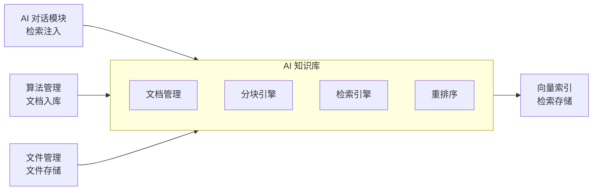

# AI 知识库模块需求规格

## 1. 模块概述

### 1.1 模块定位

AI 知识库模块是 AI 工作平台的知识基础设施，负责管理系统专业知识（算法文档、用户手册、最佳实践、用户上传文档），构建向量索引，为 AI 对话、语音问答及系统其他能力提供检索增强生成（RAG）支持。知识库是 LLM 准确理解图像处理专业领域知识的唯一知识来源。

### 1.2 核心价值

| 价值维度 | 具体内容 |
|---------|---------|
| **知识沉淀** | 将算法文档、操作经验、最佳实践、用户上传文档结构化入库 |
| **检索增强** | AI 对话时根据用户提问自动检索相关知识片段注入 LLM prompt，含来源引用 |
| **文档理解** | 支持 PDF/Word/Excel/PPT/Markdown/图片等多种格式的深度解析（OCR/表格提取） |
| **知识更新** | 算法更新、新增算法时，知识库同步新增算法文档，LLM 自动获取最新知识 |
| **能力开放** | 知识库检索作为 MCP tool（kb_search）暴露，可被 AI 对话及其他 Agent 调用 |

### 1.3 依赖关系

| 依赖方向 | 模块 | 依赖内容 |
|---------|------|---------|
| 依赖 | **文件管理** | 知识文档的文件上传、存储与 URL 拼接 |
| 依赖 | **算法管理** | 算法文档变更时调用知识库接口入库 |
| 依赖 | **会员管理** | VIP 等级决定用户可建知识库数与容量配额 |
| 依赖 | **AI 计费管理** | RAG 检索注入的 Token 消耗计入 AI 积分 |
| 被依赖 | **AI 对话模块** | 对话过程中检索知识注入 LLM prompt（含来源引用） |
| 被依赖 | **语音交互模块** | 语音问答同样注入知识库检索 |
| 被依赖 | **MCP 能力网关** | 知识库检索暴露为 MCP tool（kb_search） |

### 1.4 模块协同

| 协同模块 | 协同要点 |
|---------|---------|
| **会员管理** | VIP 等级决定用户可建私有知识库数与单库容量配额（见 §2.1.3）；公共知识库全员只读，不受个人配额限制 |
| **AI 计费管理** | RAG 检索注入的 Top-K 片段 Token 消耗计入 AI 积分（随对话输入 Token 计量，`bill_type=kb_inject`）；知识库管理操作（上传/检索测试）不计费 |
| **算法管理** | 算法文档变更**触发新增知识库文档**（非重建现有文档），由算法管理模块调用知识库文档创建接口入库（`source=algorithm_sync`）；知识库不主动监听算法变更，避免双向耦合 |
| **MCP 能力网关** | 知识库检索暴露为 MCP tool（kb_search），AI 对话及第三方 Agent 可经 MCP 网关调用（见 §2.7） |
| **语音交互模块** | 语音问答链路同样注入知识库检索：ASR 转文本 → 检索 → 注入 LLM prompt → TTS 合成回复 |
| **AI 对话模块** | 对话时调用检索注入接口，检索结果按 LLM prompt 格式注入并附带引用溯源 |

---

## 2. 功能需求

### 2.1 知识库管理 (F-KB-001)

#### 2.1.1 知识库 CRUD

| 操作 | 说明 |
|------|------|
| 创建知识库 | 配置名称、描述、可见性、向量化模型、分块策略、检索策略 |
| 编辑知识库 | 修改名称、描述、检索策略（分块策略和向量化模型创建后不可修改） |
| 删除知识库 | 删除知识库及关联的所有文档、分块与检索索引 |
| 知识库列表 | 展示当前用户可见的知识库（个人私有库 + 平台公共库），含文档数/分块数/token 总数统计 |

#### 2.1.2 权限与可见性控制

知识库按可见性分为公开库与私有库，按角色/VIP 等级进行访问控制：

| 可见性 | 说明 | 访问控制 |
|--------|------|---------|
| **公开（public）** | 平台公共知识库，由管理员维护 | 全员只读；仅管理员可创建/编辑/删除 |
| **私有（private）** | 用户个人知识库 | 仅创建者可读写；其他用户不可见；管理员可见（只读监控） |

- 私有库数量受 VIP 等级配额限制（见 §2.1.3）
- 检索接口按可见性过滤：私有库仅返回创建者自己的库，公共库对所有登录用户可见
- 知识库详情、文档管理接口校验所有权（私有库）或只读权限（公共库）
- **管理端监控例外**：管理员可查看全部知识库（含用户私有库）的列表与索引状态，用于运营监控与审计；私有库的内容管理（文档上传/删除/配置修改）权限仍属创建者

#### 2.1.3 容量与配额管理

| 配额项 | 普通用户 | VIP1 | VIP2 | SVIP | 说明 |
|--------|---------|------|------|------|------|
| 可建私有知识库数 | 3 | 10 | 30 | 100 | 超出时拒绝创建并提示升级 |
| 单库文档数上限 | 500 | 500 | 500 | 500 | 上传时校验，超出拒绝 |
| 单库分块数上限 | 10,000 | 10,000 | 10,000 | 10,000 | 索引构建时校验，超出拒绝并告警 |

- 公共知识库不受个人配额限制，由管理员独立管理
- 单库索引存储超过阈值（默认 1GB）触发告警，管理员可调整分块策略或清理低价值文档
- 配额字段配置复用会员管理权益配置功能，落地见[会员管理需求规格 §5](../会员管理/需求规格.md)

#### 2.1.4 知识库配置

| 配置项 | 说明 | 可选值 |
|--------|------|--------|
| 可见性 | 知识库可见范围 | 公开 / 私有 |
| 向量化模型 | 文本向量化的模型，从 [AI模型管理模块](../AI模型管理/需求规格.md) 模型注册表选择，创建后不可修改 | 已启用的向量化模型；向量维度随模型而定 |
| 分块策略 | 文档分块方式 | 固定长度 / 语义切分 / 递归切分 / 问答对 / 表格感知 |
| 分块大小 | 每个分块的 token 数 | 50-2000（默认 800） |
| 分块重叠 | 相邻分块的重叠 token 数 | 0-200（默认 80） |
| 检索策略 | 检索时使用的匹配方式，可按需选择向量模型与关键词融合 | 纯向量 / 纯关键词 / 混合检索 |
| Top-K | 检索返回的最相关片段数 | 1-50（默认 5） |
| 相似度阈值 | 低于此分数不返回 | 0.1-0.99（默认 0.5） |
| 重排序 | 是否启用重排序模型对检索结果二次排序 | 是 / 否（模型从 AI 模型管理注册表选择） |

### 2.2 文档管理 (F-KB-002)

#### 2.2.1 文档上传

| 操作 | 说明 |
|------|------|
| 上传文档 | 支持 PDF/Word(.docx)/Excel(.xlsx)/PPT(.pptx)/Markdown(.md)/TXT/图片(.jpg/.png) |
| 批量上传 | 一次上传多个文档 |
| 导入网页 | 通过 URL 导入网页内容为文档 |
| 自定义文本 | 直接粘贴文本创建文档 |

**分块预览确认**：上传文档时支持在入库前预览分块效果，用户可调整分块大小/重叠后重新预览，确认分块效果后再提交入库；未确认时按知识库默认分块配置直接入库。

#### 2.2.2 文档解析

根据文档格式自动选择解析策略，提取文字、表格、公式与图片描述：

| 文档格式 | 提取能力 |
|---------|---------|
| PDF | 文字、表格、公式、图片描述；扫描件走 OCR 识别 |
| Word (.docx) | 文字、表格、段落结构 |
| Excel (.xlsx) | 单元格内容、行列结构 |
| PPT (.pptx) | 幻灯片文字、备注 |
| Markdown (.md) | 文字、代码块 |
| TXT | 文字 |
| 图片 (.jpg/.png) | OCR 识别图片中的文字 |

**解析质量分级**：按文档复杂度自动选择解析档位，兼顾质量与成本——纯文本为主、无复杂表格的文档走快速文本提取；算法论文、技术手册等含表格/公式/图片的复杂文档走版面感知解析（版面检测 → 阅读顺序恢复 → 区域级解析，表格输出 Markdown 表格与原图双态、公式转为可检索文本、图片生成描述文本）；扫描件与图片型 PDF 回退纯 OCR。每个解析块保留页码/段落/区域顺序元数据，支撑引用溯源定位。

#### 2.2.3 文档管理

| 操作 | 说明 |
|------|------|
| 文档列表 | 按知识库展示文档列表，含处理状态（待处理/处理中/已完成/失败） |
| 查看原文 | 查看解析后的纯文本内容 |
| 删除文档 | 删除文档及关联的所有分块 |
| 重新处理 | 对处理失败的文档重新分块和入库 |
| 处理进度 | 实时推送文档的解析与入库进度，向知识库 owner 推送处理状态变更 |

#### 2.2.4 文档版本管理

文档更新保留历史版本，支持回溯：

- 文档更新时版本号 +1，旧版本分块索引归档（不立即删除，支持回滚）
- 默认仅最新版本参与检索，历史版本可通过管理界面查看与恢复
- 版本历史保留最近 5 个版本，超出后清理最旧版本的分块索引
- **更新一致性**：文档更新生成新版本时，旧版本分块从检索索引中移除（仅保留归档记录供回溯），避免残留旧分块干扰检索

### 2.3 分块与索引 (F-KB-003)

#### 2.3.1 分块策略

支持多种分块策略：

| 策略 | 说明 | 适用场景 |
|------|------|---------|
| **固定长度** (fixed) | 按固定 token 数切分 | 简单文本，无结构要求 |
| **语义切分** (semantic) | 按段落/句子切分，保留语义完整性 | 结构化文档、技术文章 |
| **递归切分** (recursive) | 先按段落，再按句子，层层细化 | 层次化文档 |
| **问答对** (qa) | 按 Q&A 结构切分（Q 单独分块 + A 单独分块） | FAQ 类文档 |
| **表格感知** (table) | 表格完整保留不分块，附带行列元数据 | Excel 表格数据 |

#### 2.3.2 索引构建流程

文档上传后异步完成解析、文本清洗、分块、向量化与索引写入，处理状态实时可查（见 §2.2.3）。

#### 2.3.3 索引更新

| 触发条件 | 说明 |
|---------|------|
| 文档新增 | 新文档解析后自动构建索引 |
| 文档删除 | 删除文档后从索引中移除所有关联分块 |
| 知识库删除 | 删除知识库后移除索引中所有关联分块 |
| 文档更新 | 更新文档生成新版本，旧版本分块归档（见 §2.2.4） |

#### 2.3.4 向量化模型下线迁移

当某向量化模型下线时（模型生命周期由 [AI模型管理模块](../AI模型管理/需求规格.md) 统一管理，本模块承接知识库侧迁移执行）：

- 模型标记下线后，禁止新建使用该模型的知识库
- 已有知识库切换至新模型并**重建索引**（重新向量化所有分块，向量维度随新模型变化）
- 提供迁移工具：选择目标模型 → 批量重新向量化 → 重建索引

### 2.4 检索引擎 (F-KB-004)

#### 2.4.1 检索方式

| 方式 | 说明 | 使用场景 |
|------|------|---------|
| **向量检索** (vector) | 基于语义相似度的向量近邻查询 | 语义匹配、模糊查询 |
| **关键词检索** (keyword) | 基于关键词的全文本匹配 | 精确术语查询 |
| **混合检索** (hybrid) | 融合向量与关键词检索结果排序，融合参数可配（默认） | 通用场景，兼顾语义和精确 |

#### 2.4.2 检索后处理

| 能力 | 说明 |
|------|------|
| **重排序** | 使用重排序模型对检索结果二次排序，提升 Top-K 精度 |
| **MMR 多样性** | Maximum Marginal Relevance 算法，去除高度重复的结果，保留多样性 |
| **相似度阈值** | 低于阈值的片段不返回，避免注入无关内容 |
| **数量限制** | 单次最多返回 Top-K 个片段，避免 prompt 过长 |

#### 2.4.3 元数据过滤

检索前可通过元数据过滤缩小检索范围：

| 过滤维度 | 说明 | 示例 |
|---------|------|------|
| 文档来源 | 指定检索的知识库 | 只检索"算法文档"知识库 |
| 文档类型 | 按文档类型过滤 | 只看"PPT"和"Word"文档 |
| 标签 | 按标签过滤 | 只看"去雾算法"相关的分块 |
| 时间范围 | 按文档创建/更新时间过滤 | 只看近 30 天新文档 |
| 算法关联 | 按关联算法过滤 | 只看 RIDCP 算法相关的分块 |

#### 2.4.4 引用溯源

每个检索结果附带来源引用信息：

| 引用信息 | 说明 |
|---------|------|
| 文档标题 | 来源文档的名称 |
| chunk 序号 | 在文档中的位置（第 N 个分块） |
| 页码/段落 | 原始文档中的页码或段落编号 |
| 相似度 | 检索匹配分数 |

**引用交互**：回复中的引用编号 [1][2] 支持点击跳转，前端定位到来源文档原文对应位置（页码/段落高亮），提升引用可信度与可验证性。

#### 2.4.5 RAG 效果度量与反馈闭环

| 度量维度 | 说明 |
|---------|------|
| **召回率** | 检索结果是否覆盖标注答案所需的知识片段（基于测试集评估） |
| **引用采纳率** | LLM 回复中实际引用的检索片段占注入片段的比例 |
| **用户反馈** | 用户对检索结果/回复点赞或点踩，反馈数据用于优化分块与检索策略 |

**召回测试工具**：知识库管理页提供"召回测试"面板，支持：

- 输入问题 → 展示召回段落 + 相似度分数
- 标注"应命中段落" → 记录命中/未命中
- 测试集管理：一组"问题 + 期望命中段落"的集合，可重复执行
- 版本对比：调整分块/检索参数后重跑同一测试集，对比 Recall@K 与命中率，量化评估检索质量

**反馈闭环落地**：用户点赞/点踩数据关联到具体检索片段，沉淀为"低质量片段"标记；管理员可在召回测试工具中查看被点踩片段，针对性调整分块策略或清理低价值文档。

**检索失败/超时降级策略**：

- 检索不可用时，AI 对话降级为**无知识回复**（不注入知识片段，仅基于模型自身能力回答）
- 降级时前端提示"知识库检索暂不可用，回复未引用专业知识"
- 降级不影响对话主流程，仅丢失知识增强能力

### 2.7 MCP 网关协同 (F-KB-007)

知识库检索暴露为 MCP tool，可被 AI 对话及其他 Agent 调用：

| 项目 | 说明 |
|------|------|
| **tool 名称** | `kb_search` |
| **能力** | 按查询文本检索知识库，返回片段列表（每项含内容、来源文档、相似度分数、元数据）；支持指定知识库、Top-K 与元数据过滤（契约见 [API接口](./API接口.md) §2.5） |
| **调用方** | AI 对话模块（对话检索注入）、第三方 Agent（经 MCP 网关认证后调用） |
| **认证复用** | 复用 API Key 认证，调用方需具备知识库检索权限 |

MCP 网关自动发现知识库检索接口并转换为 `kb_search` tool 暴露给 LLM，AI 对话通过 tool_call 触发检索并注入结果。

---

### 2.8 页面设计（用户端 + 管理端）(F-KB-008)

#### 2.8.1 设计原则

| 原则 | 说明 |
|------|------|
| **一页一角色** | 用户端回答"我能用哪些知识、我的私有知识状态如何"；管理端回答"平台公共知识资产的质量与检索效果如何"。两份页面各自只承载单一角色的核心问题，不做能力混装 |
| **数据同源** | 两份页面消费同一份知识库/文档/分块数据，检索口径与统计口径完全一致 |
| **可见性隔离** | 用户端仅见本人私有库 + 公共库（只读）；管理端可见全部知识库（含私有库只读监控）与检索质量数据（召回测试、低质量片段、索引告警） |
| **用户端轻量、管理端精细** | 用户端创建知识库走推荐默认配置，关注文档状态与检索效果；管理端保留全量配置项与质量评估工具 |

#### 2.8.2 用户端知识库页

**定位**：知识消费 + 轻量私有知识沉淀。让用户"查得到公共知识、存得下个人资料、看得见处理状态"，并能验证对话中能否用上自己的知识。

**入口规划**：

| 端 | 入口 | 说明 |
|----|------|------|
| 桌面端 | 数据管理分组 → 知识库 | 与数据集管理/文件管理并列的个人知识入口 |
| 移动端 | 工具 Tab 功能网格 → 知识库 | 浏览类功能，普通用户可用 |
| 交叉入口 | AI 对话引用溯源 | 对话中点击引用编号定位来源文档原文，见 §2.4.4 |

**页面结构**：

| 页面 | 区块 | 内容 | 关联功能点 |
|------|------|------|-----------|
| 知识库列表 | 我的知识库 | 私有库卡片（名称/描述/文档数/分块数/处理中标记）+ 配额进度（已建 X/Y）+ 创建入口；空状态引导"创建我的第一个知识库" | F-KB-001 |
| 知识库列表 | 公共知识库 | 公共库卡片只读浏览（名称/描述/文档数/分块数），标注"平台公共知识库" | F-KB-001 |
| 知识库详情 | 基本信息区 | 名称/描述/可见性/配置摘要（向量化模型、分块、检索）/统计（文档数、分块数、token 总数） | F-KB-001 |
| 知识库详情 | 文档管理区 | 文档列表（标题/处理状态/分块数/更新时间）+ 上传/批量上传/导入网页/自定义文本入口 + 查看原文 + 删除 | F-KB-002 |
| 知识库详情 | 检索测试区 | 输入问题 → 召回片段（内容/来源文档/相似度），验证对话可用性 | F-KB-004 |

**交互细节**：

- **创建向导**：可见性固定"私有"，名称/描述必填；向量化模型、分块策略、检索策略提供推荐默认值，高级配置折叠；不可改项（向量化模型、分块策略/大小/重叠）在向导内明确提示"创建后不可修改"
- **上传即预览**：上传/导入后先展示分块预览（可调整分块大小/重叠重新预览），确认后提交入库；跳过确认则按库默认配置入库（见 §2.2.1）
- **状态可见**：文档处理状态（待处理/处理中/已完成/失败）随列表展示，处理中实时进度推送；失败文档可"重新处理"并查看失败原因
- **配额预警**：私有库数量达配额上限时创建入口置灰并引导升级会员；上传文档/分块超限时拒绝并说明（见 §2.1.3）
- **只读语义**：公共库仅浏览文档、查看原文，不提供创建/上传/删除入口

#### 2.8.3 管理端知识库页

**定位**：知识资产运营驾驶舱，按"概览 → 下钻 → 治理"组织，支撑公共库内容维护、索引健康监控与检索质量提升。

**入口**：桌面端系统管理 → AI 知识库管理（完整管理）；移动端管理入口 → 知识库管理（轻量管理，复杂操作建议桌面端）。

**页面结构**：

| 页面 | 区块 | 内容 | 关联功能点 |
|------|------|------|-----------|
| 知识库列表 | 公共知识库 | 公共库列表（创建/编辑/删除/配置），展示文档数/分块数/token 总数/索引状态 | F-KB-001 |
| 知识库列表 | 私有库监控 | 全部用户私有库只读列表（创建者/容量/文档数/索引健康/失败文档数），仅监控与审计，不提供内容操作 | F-KB-001 |
| 公共库详情 | 配置管理区 | 可见性、向量化模型、分块、检索全量配置编辑；模型下线迁移与索引重建入口 | F-KB-001/003 |
| 公共库详情 | 文档管理区 | 文档列表 + 上传/批量/URL 导入/自定义文本 + 版本历史（查看/恢复）+ 重新处理 | F-KB-002 |
| 公共库详情 | 索引状态区 | 索引大小/索引文档数/阈值告警状态；分块数/token 总数/处理失败任务 | F-KB-001/003 |
| 检索质量区 | 检索测试 | 调试面板：输入问题 → 召回片段 + 相似度；标注应命中段落 | F-KB-004 |
| 检索质量区 | 召回测试 | 测试集管理（问题 + 期望命中段落）+ 版本对比（调参后重跑，对比 Recall@K 与命中率） | F-KB-004 |
| 检索质量区 | 低质量片段 | 被点踩片段列表，清理或触发重新分块 | F-KB-004 |

**交互细节**：

- **批量维护**：批量上传、URL 导入、算法文档同步入库，适配平台算法更新节奏
- **只读监控语义**：私有库监控仅展示容量/索引健康/失败文档，不提供内容操作入口，内容管理权仍属创建者
- **失败处置**：处理失败文档集中列出并支持重新处理，错误信息可查看
- **索引告警**：单库索引超阈值（默认 1GB）红色告警，引导调整分块策略或清理低价值文档
- **质量闭环**：低质量片段（用户点踩）与召回测试联动，支持"清理/重新分块/调整检索策略"处置；调参后重跑测试集量化对比效果（见 §2.4.5）
- **版本回溯**：文档更新保留最近 5 个版本，支持查看历史版本与恢复（见 §2.2.4）

#### 2.8.4 双端联动

- 用户端"检索测试"与 AI 对话检索共用同一检索链路，验证结果即对话实际效果
- 用户点踩反馈沉淀为低质量片段，在管理端检索质量区闭环处置
- 引用溯源（对话 → 用户端文档原文定位）使用户可核实知识来源，提升引用可信度

---

## 3. 用户交互流程

### 3.1 知识库创建与文档上传

用户/管理员创建知识库 → 配置可见性、向量化模型和分块策略 → 上传文档 → 系统异步解析/分块/向量化（推送进度） → 索引就绪 → 知识库可被检索

### 3.2 AI 对话检索注入

用户提问 → AI 对话模块调用知识库检索接口（或经 MCP 调用 kb_search） → 混合检索 top-K 片段 → 可选重排序 → 注入 LLM prompt（含来源引用） → LLM 基于注入知识生成响应 → 回复中标注引用来源

### 3.3 语音问答检索注入

用户语音提问 → ASR 转文本 → 知识库检索 top-K 片段 → 注入 LLM prompt → LLM 生成回复 → TTS 合成语音回复（回复含引用来源标注）

### 3.4 文档更新流程

管理员上传新版本文档 → 旧版本分块归档（版本号+1） → 新文档重新解析/分块/向量化 → 索引更新完成 → 新版本参与检索，旧版本可回溯

---

## 4. 数据模型

知识库、文档、分块构成三级数据模型：知识库持有配置与统计，文档记录来源与处理状态，分块承载检索内容与元数据。表结构与索引定义见 [02-系统架构/03-数据库设计.md](../../../02-系统架构/03-数据库设计.md)（AI 知识库相关表）。

---

## 5. 非功能性需求

| 指标 | 要求 | 说明 |
|------|------|------|
| 检索延迟 P99 | ≤ 500ms | 含向量化 + 检索 + 重排序（如启用） |
| 索引构建吞吐 | ≥ 100 chunks/s | 单知识库异步构建向量化与索引写入速率 |
| 并发检索 | ≥ 50 QPS | 多用户并发检索不降级 |
| 索引资源监控 | 单库索引存储与集群资源告警 | 单库索引超 1GB 告警，集群堆内存使用率 > 85% 告警 |
| 异步处理可靠性 | 失败自动重试 3 次 | 解析/分块/向量化/索引任一步骤失败重试，耗尽后标记 failed 并保留错误信息 |
