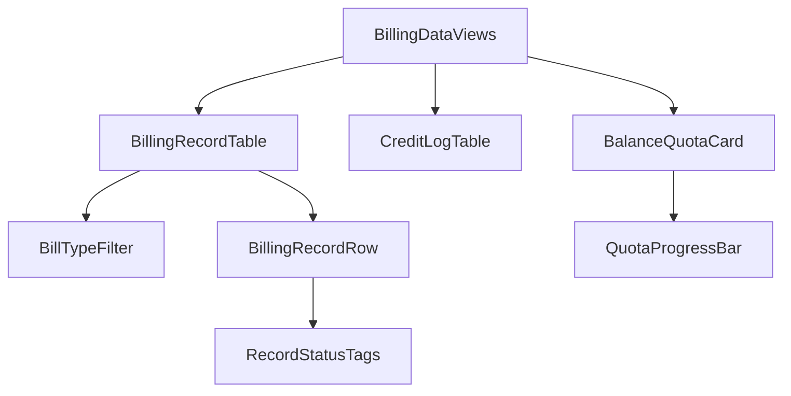

# AI 计费管理模块 - 前端实现设计（公共）

## 1. 文档概述

本文档描述 AI 计费管理模块**用户端与管理端共用的计费数据视图层**：基于收入线数据结构（`BillingRecordVO` / `CreditLogVO` / `BalanceVO`）的复用组件、Store 与数据流。核心设计是**视图同构、数据范围可切换**——用户端查看本人数据（`scope=self`），管理端下钻查看指定用户数据（`scope=userId`），两端渲染同一套组件，仅查询参数与操作入口不同。

页面结构与交互规范见 [需求规格.md](./需求规格.md) §2.11，接口契约见 [API接口.md](./API接口.md) §2.1。用户端页面见 [前端实现-用户端.md](./前端实现-用户端.md)，管理端页面见 [前端实现-管理端.md](./前端实现-管理端.md)。

> 本公共文档仅承载**收入线数据视图**（计费明细 / 积分流水 / 余额配额）。成本线（成本单价 / 毛利 / 对账 / 异常监控 / 积分调整）为管理端特有，见管理端文档；全局图表 / 表格 / Tag 等组件属项目公共组件库，不在本模块文档定义。

---

## 2. 公共组件树设计

| 组件 | 职责 |
|------|------|
| BillingDataViews | 计费数据视图层容器（无独立路由），按 `scope` 渲染对应视图，供用户端/管理端页面嵌入 |
| BillingRecordTable | 计费明细表：bill_type 筛选 + 分页 + 明细行；`scope=self` 查本人、`scope=userId` 查指定用户 |
| BillTypeFilter | 计费类型筛选（全部/对话/知识库/语音/工具） |
| BillingRecordRow | 明细行：时间/会话/模型（降级标识）/Token 明细/实扣 vs 预估/缓存节省/申诉状态 |
| RecordStatusTags | 行内状态标签组：降级标识（`actualModel` 非空）、缓存节省（`creditsSaved > 0`）、申诉状态（`refundStatus`） |
| CreditLogTable | 积分流水表：source 标识（到账/扣减/回退/补偿），`scope` 语义同明细表 |
| BalanceQuotaCard | 余额与日/月限额进度卡：当前余额、欠费标识、限额进度条 |
| QuotaProgressBar | 日限额/月限额进度条（已用/限额），≥80% 变色预警、达限标红 |

> 明细行"实扣 vs 预估对比"直接取记录字段 `preDeduct`（预扣=预估）与 `credits`（实扣），"缓存节省"取 `creditsSaved > 0`，"降级标识"取 `actualModel` 非空，无需前端二次计算。

---

## 3. 状态管理

### 3.1 Store 模块划分

| Store 模块 | 职责 | 生命周期 |
|-----------|------|---------|
| 计费数据 Store（billingDataStore） | 余额与配额、计费明细、积分流水；数据范围由 `scope`（self/userId）区分 | 宿主页面级，随嵌入的用户端/管理端页面初始化，离开销毁 |

### 3.2 核心状态

| 状态 | 说明 |
|------|------|
| `scope` | 数据范围（`self`=本人 / `userId`=指定用户），由宿主页面注入 |
| `balance` | 余额账户与配额（来自 `GET /api/v1/ai-billing/balance`） |
| `records` | 计费明细分页数据（含当前筛选条件） |
| `recordQuery` | 计费明细筛选条件（scope、billType、分页） |
| `creditLogs` | 积分流水分页数据 |
| `creditLogQuery` | 流水筛选条件（scope、source、分页） |

### 3.3 核心操作

| 操作 | 说明 |
|------|------|
| `fetchBalance` | 按 scope 拉取余额与配额，驱动 BalanceQuotaCard 渲染 |
| `fetchRecords` | 按 recordQuery 分页拉取计费明细 |
| `fetchCreditLogs` | 按 creditLogQuery 分页拉取积分流水 |
| `refreshRecordStatus` | 申诉提交/审核后刷新对应行申诉状态（本地置位，下次拉取以服务端为准） |

---

## 4. 数据流

| 视图 | 数据来源 | 获取时机 | 缓存策略 |
|------|---------|---------|---------|
| 余额/配额卡 | `GET /api/v1/ai-billing/balance` | 视图挂载时加载 | 宿主页面级缓存；欠费/配额接近达限时展示提醒 |
| 计费明细表 | `GET /api/v1/ai-billing/records`（分页 + bill_type 筛选，scope 决定 userId 参数） | 挂载 + 筛选/分页变更 | 当前查询条件结果缓存；申诉提交/审核后刷新对应行 |
| 积分流水表 | `GET /api/v1/ai-billing/credit-logs`（分页 + source 筛选，scope 决定 userId 参数） | Tab/视图切换时按需加载 | 当前查询条件结果缓存 |

---

## 5. 公共交互设计决策

| 交互点 | 技术选型 | 理由 |
|--------|---------|------|
| 视图同构、scope 驱动数据范围 | 组件/Store 统一以 `scope` 决定查询参数与渲染 | 用户端=本人、管理端=指定用户，同一份实现两端复用，杜绝重复开发 |
| 限额进度预警 | QuotaProgressBar 按已用/限额比例变色（≥80% 黄、达限红） | 将"余额账户 vs 限额阈值"双控结构可视化为单条进度，一眼判断可用余量 |
| 实扣 vs 预估对比 | 明细行对比 `preDeduct` 与 `credits`，标记偏高/正常/偏低 | 预扣实扣差额透明化（需求规格 §2.6.2），消除"积分被多扣"疑虑 |
| 状态标识 | RecordStatusTags：降级/缓存节省/申诉状态随行展示 | 缓存优惠、降级不亏两项产品承诺显性化，减少投诉与误扣申诉 |

---

## 6. 两端差异

| 差异点 | 用户端（scope=self） | 管理端（scope=userId） |
|--------|---------------------|----------------------|
| 数据范围 | 本人 | 下钻指定的用户 |
| 申诉交互 | 行内提交误扣申诉（RefundApplyDialog） | 仅展示状态，审核入口在治理层 |
| 加购引导 | 余额不足展示 RechargeGuide | 无 |
| 余额卡位置 | 页面顶部主区块 | 用户级下钻/积分调整详情内 |
