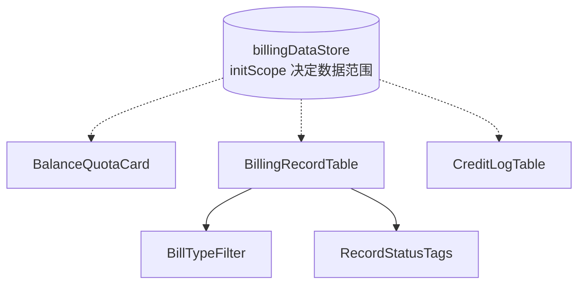

# AI 计费管理模块 - 前端实现设计（公共）

## 1. 文档概述

本文档描述 AI 计费管理模块**用户端与管理端共用的计费数据视图层**（计费明细 / 积分流水 / 余额配额）的复用组件、Store 与数据流。核心设计是**视图同构、数据范围可切换**——用户端查看本人数据（`scope=self`），管理端下钻查看指定用户数据（`scope=userId`），两端渲染同一套组件，仅查询参数与操作入口不同。

本文档以 Web 端（Vue 3，`dehaze-front-vue`）描述实现方案；Android / Flutter / Taro 等多端按各自技术栈适配同一套组件结构与状态划分。

---

## 2. 公共组件设计

组件统一放在 `src/components/billing/`，由用户端/管理端页面直接组合嵌入——**不设 BillingDataViews 容器组件**：数据范围的切换由 `billingDataStore.initScope(scope)` 承担（见 §3.3），各组件在挂载与 `scope` 变更时自行注入并重拉数据，省去一层无状态的壳组件。

| 组件 | 文件 | 职责 |
|------|------|------|
| BillingRecordTable | `components/billing/BillingRecordTable.vue` | 计费明细表：bill_type 筛选 + 日期范围 + 分页 + 明细行（行渲染内联在表格内，无独立 Row 组件）；`scope=self` 查本人、`scope=userId` 查指定用户 |
| BillTypeFilter | `components/billing/BillTypeFilter.vue` | 计费类型筛选（全部/对话/知识库注入/语音识别/语音合成/工具） |
| RecordStatusTags | `components/billing/RecordStatusTags.vue` | 行内状态标签组：降级标识（`actualModel` 非空）、缓存节省（`creditsSaved > 0`）、申诉状态（`refundStatus`） |
| CreditLogTable | `components/billing/CreditLogTable.vue` | 积分流水表：source 筛选 + 分页 + 流水行（到账/赠送/试用/消费/回退/管理员调整/月末清零），`scope` 语义同明细表 |
| BalanceQuotaCard | `components/billing/BalanceQuotaCard.vue` | 余额与日/月限额进度卡：当前余额、欠费标识、限额进度条（进度条直接内联 `el-progress`，无独立 ProgressBar 组件） |

> **语音类型不合并**：`bill_type` 后端为单值等值过滤（`SysAiBilling.bill_type == bill_type`，见后端实现），若把 `asr`/`tts` 合并为一个「语音」选项只能传单个值，会静默漏掉另一类记录。故拆为「语音识别(asr)」「语音合成(tts)」两个选项，`v-model` 类型仍为 `BillingType | ""`。
>
> **中文映射单一信息源**：`BillTypeFilter.vue` 以普通 `<script>` 块导出 `BILL_TYPE_OPTIONS`（value + 中文 label），明细表类型列复用同一份映射，不在两个组件里各写一份 map。

---

## 3. 状态管理

### 3.1 Store 模块划分

| Store 模块 | 职责 | 生命周期 |
|-----------|------|---------|
| 计费数据 Store（billingDataStore） | 余额与配额、计费明细、积分流水；数据范围由 `scope`（self/userId）区分 | Pinia 全局单例，用户端/管理端页面共用；页面离开时由宿主调 `resetScope` 恢复 `self` 并清空数据 |

### 3.2 核心状态

| 状态 | 说明 |
|------|------|
| `scope` | 数据范围（`self`=本人 / `userId`=指定用户），由组件经 `initScope` 注入 |
| `balance` | 余额账户与配额（来自 `GET /api/v1/ai-billing/balance`） |
| `balanceLoading` / `recordsLoading` / `creditLogsLoading` | 三类数据的独立 loading（不做单一 loading，供各组件独立 `v-loading`） |
| `records` / `recordsTotal` | 计费明细分页数据与总数 |
| `recordQuery` | 计费明细筛选条件（pageNum/pageSize、billType、dateStart/dateEnd） |
| `creditLogs` / `creditLogsTotal` | 积分流水分页数据与总数 |
| `creditLogQuery` | 流水筛选条件（pageNum/pageSize、source） |
| `userId` | 派生：`scope` 为数字时即该 userId，`self` 时为 `undefined`（请求不带该参数，后端按登录态取本人） |

### 3.3 核心操作

| 操作 | 说明 |
|------|------|
| `initScope` | 注入数据范围；组件在挂载与 `scope` 变更时调用并重拉数据 |
| `fetchBalance` | 按 scope 拉取余额与配额，**仅由 BalanceQuotaCard 调用**（同一页面不重复请求） |
| `fetchRecords` | 按 recordQuery 分页拉取计费明细 |
| `fetchCreditLogs` | 按 creditLogQuery 分页拉取积分流水 |
| `refreshRecordStatus` | 申诉提交/审核后刷新对应行申诉状态（本地置位，下次拉取以服务端为准） |
| `resetScope` | 恢复 `self` 并清空余额/明细/流水数据与筛选条件 |

---

## 4. 数据流

| 视图 | 数据来源 | 获取时机 | 缓存策略 |
|------|---------|---------|---------|
| 余额/配额卡 | `GET /api/v1/ai-billing/balance` | 视图挂载时加载 | 宿主页面级缓存；欠费/配额接近达限时展示提醒 |
| 计费明细表 | `GET /api/v1/ai-billing/records`（分页 + bill_type 筛选，scope 决定 userId 参数） | 挂载 + 筛选/分页变更 | 当前查询条件结果缓存；申诉提交/审核后刷新对应行 |
| 积分流水表 | `GET /api/v1/ai-billing/credit-logs`（分页 + source 筛选，scope 决定 userId 参数） | Tab/视图切换时按需加载 | 当前查询条件结果缓存 |

---

## 5. 公共交互设计决策

| 交互点 | 技术选型 | 理由 |
|--------|---------|------|
| 限额进度预警 | BalanceQuotaCard 内联 `el-progress` 按已用/限额比例变色（≥80% 黄、达限红、无限额蓝） | 将"余额账户 vs 限额阈值"双控结构可视化为单条进度，一眼判断可用余量 |
| 实扣 vs 预估对比 | 明细行直接对比记录字段 `preDeduct`（预扣=预估）与 `credits`（实扣），标记偏高/正常/偏低，无需前端二次计算 | 预扣实扣差额透明化，消除"积分被多扣"疑虑 |
| 状态标识 | 降级/缓存节省/申诉状态由 RecordStatusTags 随行展示，不另设筛选页 | 缓存优惠、降级不亏两项产品承诺显性化，减少投诉与误扣申诉 |
| 两端差异收敛 | 组件与 Store 统一以 `scope` 决定查询参数与渲染；差异仅在操作入口——用户端行内提交申诉、余额不足展示加购引导，管理端仅展示申诉状态（审核入口在治理层） | 同一份实现两端复用，杜绝重复开发 |
