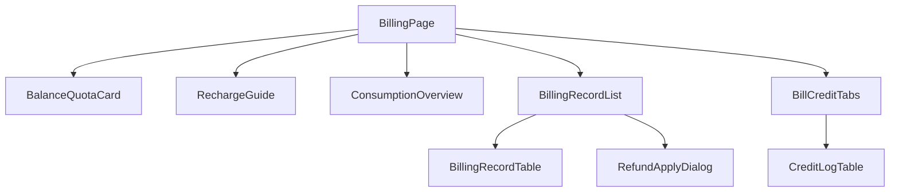

# AI 计费管理模块 - 前端实现设计（用户端）

## 1. 文档概述

本文档描述 AI 计费管理模块**用户端计费页**的前端实现方案，聚焦页面编排、端内状态与交互决策。

用户端计费页按"余额状态区 → 消耗总览区 → 计费明细区 → 账单与流水区"四区自上而下组织，四区数据相互独立、按需加载，仅在余额不足时联动加购引导。

> 余额、计费明细、积分流水的组件/Store/数据流为两端共用，见 [前端实现-公共.md](./前端实现-公共.md)（本端以 `scope=self` 使用），本文档只描述端内特有部分。

---

## 2. 组件树设计

| 组件 | 职责 |
|------|------|
| BillingPage | 页面容器与路由入口（`/billing`），编排四区，注入 `scope=self` 并加载消耗汇总 |
| BalanceQuotaCard | 公共余额与配额卡（`scope=self`，挂载时自行拉数，见[前端实现-公共.md](./前端实现-公共.md)） |
| RechargeGuide | 余额不足/欠费/配额达限引导卡片，展示补齐缺口与"去加购"入口（跳转套餐商店） |
| ConsumptionOverview | 消耗总览区：日/月维度切换 + 消耗趋势折线图 + 模型消耗占比环形图（Top N，其余归入"其他"）+ 缓存节省汇总 |
| BillingRecordList | 计费明细区容器：公共 BillingRecordTable（`scope=self`，行内申诉入口）+ 端内 RefundApplyDialog |
| RefundApplyDialog | 误扣申诉弹窗：原因类型选择 + 补充说明 + 提交，提交成功后对应行申诉状态置"待审核" |
| BillCreditTabs | 账单与流水区 Tab 容器：积分流水（CreditLogTable `scope=self`）Tab + 月结账单查询与下载面板 Tab |
| BillingRecordTable / CreditLogTable | 公共计费明细表 / 积分流水表（`scope=self`，见[前端实现-公共.md](./前端实现-公共.md)） |

> 趋势图、分布图、节省汇总、月结账单面板均为**页面区块而非可复用组件**，故不拆独立文件，分别在 `ConsumptionOverview`、`BillCreditTabs` 内实现。

---

## 3. 状态管理

### 3.1 Store 模块划分

| Store 模块 | 职责 | 生命周期 |
|-----------|------|---------|
| 用户端计费 Store（billingStore） | 消耗汇总、账单、申诉弹窗、加购引导 | 页面级，进入计费页初始化，离开销毁 |
| 计费数据 Store（billingDataStore，公共） | 余额与配额、计费明细、积分流水（scope=self） | 宿主页面级（公共） |

> 余额、计费明细、积分流水由公共组件在挂载/`scope` 变更时自行拉取，宿主页面只注入 `scope` 并驱动端内 Store，首次进入不重复发起请求；加购返回时页面由 keep-alive 重新激活，由宿主页面补拉一次 `balance`。

### 3.2 核心状态

| 状态 | 说明 |
|------|------|
| `consumptionSummary` | 消耗汇总（趋势序列、模型分布、节省汇总） |
| `summaryDimension` | 消耗汇总维度（`day` / `month`） |
| `currentBill` | 当前查看月份的账单汇总 |
| `currentMonth` | 当前账单月份（`yyyy-MM`，默认当月） |
| `refundDialog` | 误扣申诉弹窗状态（`{billingId, visible}`） |
| `refundTarget` | 申诉目标记录快照（退款申请需携带该条实扣积分） |
| `rechargeGuideVisible` | 加购引导是否展示（用户可手动关闭） |
| `rechargeAlert` | 加购引导内容（`{reason: 欠费/配额达限/余额偏低, gap}`），由 `billingDataStore.balance` 推导 |

### 3.3 核心操作

| 操作 | 说明 |
|------|------|
| `setDimension` | 切换消耗汇总维度（日/月）并重新拉取汇总 |
| `fetchSummary` | 按维度（日/月）拉取消耗汇总 |
| `fetchBill` | 拉取指定月份账单汇总 |
| `downloadBill` | 下载月结账单（取接口返回的账单内容另存为 JSON 文件） |
| `submitRefund` | 提交误扣申诉（原因 + 本次实扣积分），成功后调用 `billingDataStore.refreshRecordStatus` 将对应行置"待审核"并关闭弹窗 |
| `syncRechargeGuide` | 余额到位后按 `rechargeAlert` 判定是否展示加购引导 |

---

## 4. 路由设计

| 路由路径 | 页面 | 权限控制 |
|---------|------|---------|
| `/billing` | 用户端计费页 | 登录用户 |

> 加购引导跳转套餐商店、配额不足提示升级会员等跨模块跳转由全局导航统一处理，不在本模块路由内定义。

---

## 5. 数据流

### 5.1 数据获取策略

| 区块 | 数据来源 | 获取时机 | 缓存策略 |
|------|---------|---------|---------|
| 消耗总览区 | 消耗汇总接口（日/月趋势、模型分布、节省汇总） | 进入页面 + 维度切换 | 维度切换即请求，无本地缓存 |
| 账单与流水区 | 月结账单查询与下载接口 | Tab 切换时按需加载 | 月账单查询结果页面级缓存 |

### 5.2 更新策略

- **余额联动**：余额低于预估值、配额达限或 `balance.arrearsStatus` 为欠费时展示 `RechargeGuide`；加购返回等余额变化后重新拉取 `balance`

---

## 6. 交互设计决策

| 交互点 | 技术选型 | 理由 |
|--------|---------|------|
| 误扣申诉 | 行内操作唤起 RefundApplyDialog（原因类型 + 说明），提交后行内状态置"处理中" | 申诉不打断明细浏览；状态随行展示，用户可跟踪处理进度 |
| 消耗总览懒加载 | 总览区独立于明细区按需加载 | 明细区是高频操作区，总览数据量大，两者解耦避免互相阻塞 |
