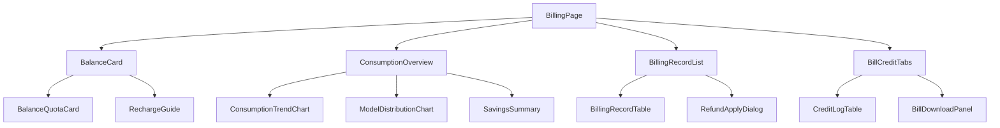

# AI 计费管理模块 - 前端实现设计（用户端）

## 1. 文档概述

本文档描述 AI 计费管理模块**用户端计费页**的 Web 端（React）前端实现方案，聚焦页面编排、端内状态与交互决策。页面结构与交互规范见 [需求规格.md](./需求规格.md) §2.11.2，接口契约见 [API接口.md](./API接口.md) §2.1。管理端计费页见 [前端实现-管理端.md](./前端实现-管理端.md)。余额/计费明细/积分流水等**计费数据视图层**为用户端与管理端共用，见 [前端实现-公共.md](./前端实现-公共.md)（本端以 `scope=self` 使用）。Android / Flutter / Taro 等多端参考本 Web 端的组件结构与状态管理方案按各自技术栈适配。

用户端计费页按"余额状态区 → 消耗总览区 → 计费明细区 → 账单与流水区"四区自上而下组织，四区数据相互独立、按需加载，仅在余额不足时联动加购引导。

---

## 2. 组件树设计

| 组件 | 职责 |
|------|------|
| BillingPage | 页面容器与路由入口，编排四区，管理计费页全局状态 |
| BalanceCard | 余额状态区容器：嵌入公共 BalanceQuotaCard（scope=self）+ 端内 RechargeGuide |
| RechargeGuide | 余额不足引导卡片，展示缺口金额与"去加购"入口（跳转套餐商店） |
| ConsumptionOverview | 消耗总览区：日/月消耗趋势、模型分布、缓存与降级节省汇总 |
| ConsumptionTrendChart | 日/月维度消耗趋势折线图（支持日/月切换） |
| ModelDistributionChart | 模型消耗占比环形图（Top N） |
| SavingsSummary | "本月累计节省 X 积分"汇总（缓存命中 + 降级） |
| BillingRecordList | 计费明细区容器：嵌入公共 BillingRecordTable（scope=self）+ 端内 RefundApplyDialog |
| RefundApplyDialog | 误扣申诉弹窗：原因类型选择 + 补充说明 + 提交，提交成功后刷新对应行申诉状态 |
| BillCreditTabs | 账单与流水区 Tab 容器 |
| BillDownloadPanel | 月结账单查询与下载面板 |

> 公共组件 `BalanceQuotaCard`（余额+限额进度）、`BillingRecordTable`（明细表）、`CreditLogTable`（流水表）的职责、Store 与数据流见 [前端实现-公共.md](./前端实现-公共.md)。

---

## 3. 状态管理

### 3.1 Store 模块划分

| Store 模块 | 职责 | 生命周期 |
|-----------|------|---------|
| 用户端计费 Store（billingStore） | 消耗汇总、账单、申诉弹窗、加购引导 | 页面级，进入计费页初始化，离开销毁 |
| 计费数据 Store（billingDataStore，公共） | 余额与配额、计费明细、积分流水（scope=self） | 宿主页面级，见 [前端实现-公共.md](./前端实现-公共.md) |

### 3.2 核心状态

| 状态 | 说明 |
|------|------|
| `consumptionSummary` | 消耗汇总（趋势序列、模型分布、节省汇总） |
| `currentBill` | 当前查看月份的账单汇总 |
| `refundDialog` | 误扣申诉弹窗状态（`{billingId, visible}`） |
| `rechargeGuideVisible` | 余额不足加购引导是否展示 |

> 余额与配额（`balance`）、计费明细（`records`/`recordQuery`）、积分流水（`creditLogs`/`creditLogQuery`）状态在公共 billingDataStore 中，本端以 `scope=self` 注入。

### 3.3 核心操作

| 操作 | 说明 |
|------|------|
| `fetchSummary` | 按维度（日/月）拉取消耗汇总 |
| `fetchBill` | 拉取指定月份账单汇总 |
| `downloadBill` | 下载月结账单（日/月明细） |
| `submitRefund` | 提交误扣申诉（原因类型 + 说明），成功后调用 `billingDataStore.refreshRecordStatus` 刷新对应行 |

> 余额（`fetchBalance`）、明细（`fetchRecords`）、流水（`fetchCreditLogs`）操作在公共 billingDataStore 中。

---

## 4. 路由设计

| 路由路径 | 页面 | 权限控制 |
|---------|------|---------|
| `/billing` | 用户端计费页 | 登录用户 |

> 加购引导跳转套餐商店、配额不足提示升级会员等跨模块跳转由全局导航统一处理，不在本模块路由内定义。

---

## 5. 数据流

### 5.1 数据获取策略

| 区块 | 数据来源 | 获取时机 | 缓存策略 |
|------|---------|---------|---------|
| 消耗总览区 | 消耗汇总接口（日/月趋势、模型分布、节省汇总） | 进入页面 + 维度切换 | 维度切换即请求，无本地缓存 |
| 账单与流水区 | `GET /api/v1/ai-billing/bills/{month}`、`GET /api/v1/ai-billing/bills/{month}/download` | Tab 切换时按需加载 | 月账单查询结果页面级缓存 |

> 余额状态区、计费明细区、积分流水区的数据来源与缓存策略见 [前端实现-公共.md](./前端实现-公共.md) 数据流（本端 `scope=self`）。

### 5.2 更新策略

- **余额联动**：余额不足（`balance` 中余额 < 预估值或配额达限）时展示 `RechargeGuide`；加购返回等余额变化后重新拉取 `balance`
- **欠费状态**：`balance.arrearsStatus` 为欠费时，BalanceQuotaCard 展示欠费标识，本端联动展示加购引导
- **明细行申诉状态**：`submitRefund` 成功后经 `billingDataStore.refreshRecordStatus` 置"处理中"，避免整页刷新（见 [前端实现-公共.md](./前端实现-公共.md)）

---

## 6. 交互设计决策

| 交互点 | 技术选型 | 理由 |
|--------|---------|------|
| 误扣申诉 | 行内操作唤起 RefundApplyDialog（原因类型 + 说明），提交后行内状态置"处理中" | 申诉不打断明细浏览；状态随行展示，用户可跟踪处理进度 |
| 加购引导 | RechargeGuide 内嵌跳转套餐商店 | 余额/配额不足场景直接串联"消费预警 → 加购"转化闭环（需求规格 §2.5.3） |
| 消耗总览懒加载 | 总览区独立于明细区按需加载 | 明细区是高频操作区，总览数据量大，两者解耦避免互相阻塞 |

> 限额进度预警、实扣 vs 预估对比、缓存/降级/申诉状态标识等公共交互见 [前端实现-公共.md](./前端实现-公共.md) §5。

---

## 7. 公共组件使用

| 公共组件 | 配置要点 |
|---------|---------|
| 折线图组件 | 消耗趋势：时间维度横轴（日/月）、积分消耗纵轴 |
| 环形图组件 | 模型分布：Top N 占比，其余归入"其他" |
| 进度条组件 | 日/月限额进度（BalanceQuotaCard 内部）：阈值变色由公共视图自定义 |
| 分页表格 | 计费明细与积分流水列表（公共视图内部） |
| Tab 组件 | 账单与流水区切换 |
| 弹窗（Dialog） | 误扣申诉表单（原因类型下拉 + 说明文本框） |
| Tag/徽标 | 降级标识、缓存节省、申诉状态标签（公共视图内部） |
