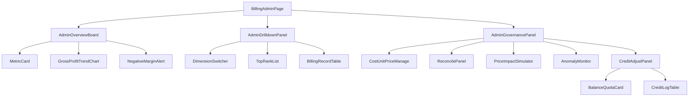

# AI 计费管理模块 - 前端实现设计（管理端）

## 1. 文档概述

本文档描述 AI 计费管理模块**管理端计费页**的 Web 端（React）前端实现方案，聚焦页面编排、端内状态与交互决策。页面结构与交互规范见 [需求规格.md](./需求规格.md) §2.11.3，接口契约见 [API接口.md](./API接口.md) §2.2。用户端计费页见 [前端实现-用户端.md](./前端实现-用户端.md)。余额/计费明细/积分流水等**计费数据视图层**为用户端与管理端共用，见 [前端实现-公共.md](./前端实现-公共.md)（本端以下钻用户 `scope=userId` 使用）。Android / Flutter / Taro 等多端参考本 Web 端的组件结构与状态管理方案按各自技术栈适配。

管理端计费页按"概览看板 → 消耗与成本下钻 → 治理与对账"三层组织，是成本线（收入/成本/毛利）的管理入口。成本单价、毛利等成本数据仅管理员可见（权限 `ai:billing:cost`）。

---

## 2. 组件树设计

| 组件 | 职责 |
|------|------|
| BillingAdminPage | 页面容器与路由入口，编排三层，管理计费页全局状态 |
| AdminOverviewBoard | 概览看板：指标卡片 + 毛利趋势 + 负毛利预警 |
| MetricCard | 关键指标卡片：实收收入、模型调用成本、毛利/毛利率（整体口径主 + AI 参考口径辅）、积分-成本对照 |
| GrossProfitTrendChart | 毛利与成本趋势图（按月/季/自定义） |
| NegativeMarginAlert | 负毛利预警条（毛利 < 0 时展示，含下钻入口） |
| AdminDrilldownPanel | 消耗与成本下钻：维度切换 + Top N 排行 + 用户级计费明细 |
| DimensionSwitcher | 下钻维度切换（用户/模型/供应商/时间） |
| TopRankList | 高消耗用户/模型 Top N（积分消耗 + 成本双列排序） |
| BillingRecordTable（公共） | 用户级计费明细：复用公共计费明细表（`scope=userId`），展示字段与用户端一致 |
| AdminGovernancePanel | 治理与对账：成本单价、账单对账、调价测算、异常监控、积分调整 |
| CostUnitPriceManage | 成本单价管理：模型-供应商价格版本与档位明细维护 |
| ReconcilePanel | 实际账单对账：账单导入 → 逐笔核对 → 差异归因 → 价格校准 |
| PriceImpactSimulator | 供应商调价影响测算：输入新价格版本，模拟重算成本与毛利 |
| AnomalyMonitor | 异常监控：异常计费记录清单（四类规则）与趋势 |
| CreditAdjustPanel | 积分调整：补扣/补偿表单 + 误扣审核入口；内嵌公共 BalanceQuotaCard/CreditLogTable（scope=userId）查看目标用户余额与流水 |

> 公共组件 `BillingRecordTable`（明细表）、`BalanceQuotaCard`（余额+限额进度）、`CreditLogTable`（流水表）的职责、Store 与数据流见 [前端实现-公共.md](./前端实现-公共.md)。

---

## 3. 状态管理

### 3.1 Store 模块划分

| Store 模块 | 职责 | 生命周期 |
|-----------|------|---------|
| 管理端计费 Store（adminBillingStore） | 概览指标、下钻聚合、成本单价、对账、异常清单、积分调整 | 页面级，进入计费页初始化，离开销毁 |
| 计费数据 Store（billingDataStore，公共） | 余额与配额、计费明细、积分流水（scope=userId） | 宿主页面级，见 [前端实现-公共.md](./前端实现-公共.md) |

### 3.2 核心状态

| 状态 | 说明 |
|------|------|
| `overview` | 概览指标（income/cost/grossProfit/grossMargin + aiIncome/aiGrossProfit/aiGrossMargin 双口径，来自 `GET /api/v1/ai-billing/cost-stats`） |
| `drilldown` | 下钻数据（维度、Top N 排行） |
| `drilldownDimension` | 当前下钻维度（user/model/provider/day） |
| `costVersions` | 成本单价价格版本列表 |
| `reconcile` | 对账会话状态（导入结果、核对差异、归因标记） |
| `anomalies` | 异常计费记录清单（类型筛选 + 分页） |
| `anomalyFilter` | 异常筛选条件（异常类型、时间范围） |
| `adjustDialog` | 积分调整弹窗状态（`{userId, visible}`） |

> 目标用户余额与配额（`balance`）、计费明细（`records`/`recordQuery`）、积分流水（`creditLogs`/`creditLogQuery`）状态在公共 billingDataStore 中，本端以 `scope=userId` 注入。

### 3.3 核心操作

| 操作 | 说明 |
|------|------|
| `fetchOverview` | 拉取概览指标（周期可切换），驱动 MetricCard 与预警条 |
| `fetchDrilldown` | 按维度拉取下钻数据与 Top N |
| `fetchCostVersions` | 拉取成本单价价格版本列表 |
| `saveCostVersion` | 新增/更新/停用成本价格版本 |
| `importReconcileBill` | 上传供应商账单并触发逐笔核对 |
| `simulatePriceImpact` | 按新价格版本模拟重算成本与毛利 |
| `fetchAnomalies` | 按筛选条件分页拉取异常记录清单 |
| `submitCreditAdjust` | 提交积分调整（补扣/补偿，携带原因） |
| `auditRefund` | 审核误扣申诉（通过/驳回），成功后调用 `billingDataStore.refreshRecordStatus` 刷新目标用户明细行状态 |

> 目标用户余额（`fetchBalance`）、明细（`fetchRecords`）、流水（`fetchCreditLogs`）操作在公共 billingDataStore 中。

---

## 4. 路由设计

| 路由路径 | 页面 | 权限控制 |
|---------|------|---------|
| `/admin/ai-billing` | 管理端计费页 | 管理员（`ai:billing:cost` 或 `ai:billing:stat`） |

> 路由守卫校验权限标识：无 `ai:billing:cost` 的用户禁止访问成本单价/成本-利润（成本属商业机密）；无 `ai:billing:stat` 的用户禁止访问统计与异常监控。治理层各面板按子权限显隐（如积分调整需 `ai:billing:adjust`）。

---

## 5. 数据流

### 5.1 数据获取策略

| 区块 | 数据来源 | 获取时机 | 缓存策略 |
|------|---------|---------|---------|
| 概览看板 | `GET /api/v1/ai-billing/cost-stats`（双口径毛利） | 进入页面 + 周期切换 | 周期级缓存，切换周期即请求 |
| 消耗下钻 | `GET /api/v1/ai-billing/stats`（groupBy user/model/day）、`GET /api/v1/ai-billing/cost-stats`（groupBy provider） | 维度切换时请求 | 当前维度结果缓存 |
| 成本单价管理 | `GET/POST/PUT/DELETE /api/v1/ai-billing/costs` | 进入治理层时加载 | 版本列表页面级缓存；保存后失效刷新 |
| 实际账单对账 | `POST /api/v1/ai-billing/reconcile/import` | 用户触发导入 | 对账结果会话级状态 |
| 异常监控 | 异常计费记录清单接口（类型筛选 + 分页） | 进入面板 + 筛选变更 | 当前筛选结果缓存 |
| 积分调整 | `POST /api/v1/ai-billing/adjust`、`POST /api/v1/ai-billing/refunds/{id}/audit` | 用户触发提交 | 无 |

> 用户级计费明细（BillingRecordTable）、目标用户余额（BalanceQuotaCard）、积分流水（CreditLogTable）的数据来源与缓存策略见 [前端实现-公共.md](./前端实现-公共.md) 数据流（本端 `scope=userId`）。

### 5.2 更新策略

- **毛利预警**：`overview.grossProfit < 0` 时展示 NegativeMarginAlert，点击下钻至负毛利明细
- **双口径并列**：MetricCard 以整体毛利（官方口径）为主展示，AI 参考毛利折叠展示为次级指标，避免口径混用
- **对账流程**：导入 → 核对差异列表 → 勾选差异归因（价格配置过期/供应商折扣/计量口径）→ 提交价格校准建议
- **调价测算**：在 CostUnitPriceManage 编辑价格版本时提供"测算影响"入口，触发 `simulatePriceImpact`，结果在原表单旁展示毛利变化
- **误扣审核联动**：`auditRefund` 通过/驳回后，经 `billingDataStore.refreshRecordStatus` 刷新目标用户明细行申诉状态

---

## 6. 交互设计决策

| 交互点 | 技术选型 | 理由 |
|--------|---------|------|
| 概览-下钻-治理三层 | 单页面三层垂直排布，治理层 Tab 折叠 | 概览回答"赚不赚钱"，下钻回答"钱在哪"，治理回答"怎么调"；三层垂直组织符合决策路径，治理层折叠减少低频功能干扰 |
| 毛利双口径并列 | 整体毛利主卡片 + AI 参考毛利次级折叠指标 | 官方口径与辅助口径并存但不混淆：主指标支撑经营决策，辅助指标仅定价参考（需求规格 §2.10.3） |
| 负毛利预警 | 概览顶部预警条 + 点击下钻 | 预警要"可见且可追"：提示问题同时直接进入问题明细，缩短排查路径 |
| 高消耗 Top N 双列排序 | 积分消耗 + 成本双列，可切换排序 | 用户视角关注积分消耗（哪个用户/模型烧得多），经营视角关注成本（哪个最费钱），双列支持两种判断 |
| 调价影响测算 | 编辑价格版本时内联"测算影响"，不离开表单 | 供应商调价决策需要"改价 → 看毛利影响"的即时反馈，内联避免上下文切换 |
| 对账流程化 | ReconcilePanel 分步：导入 → 核对 → 归因 → 校准 | 对账差异是半结构化问题，分步引导降低管理员操作门槛 |
| 权限收敛 | 治理层子面板按权限标识显隐 | 成本数据敏感（商业机密），积分调整/误扣审核属高权操作，界面显隐与后端权限一致 |

> 限额进度预警、实扣 vs 预估对比、缓存/降级/申诉状态标识等公共交互见 [前端实现-公共.md](./前端实现-公共.md) §5。

---

## 7. 公共组件使用

| 公共组件 | 配置要点 |
|---------|---------|
| 指标卡片组件 | 概览指标：主指标 + 副指标 + 环比，负值标红 |
| 折线图组件 | 毛利/成本趋势、异常趋势：时间横轴 |
| 柱状图组件 | Top N 排行：积分消耗与成本双序列 |
| 分页表格 | 下钻明细、异常清单 |
| Tab 组件 | 治理层各面板切换 |
| 上传组件 | 供应商账单导入（CSV/Excel 校验） |
| 弹窗（Dialog） | 积分调整表单、调价测算结果、审核弹窗 |
