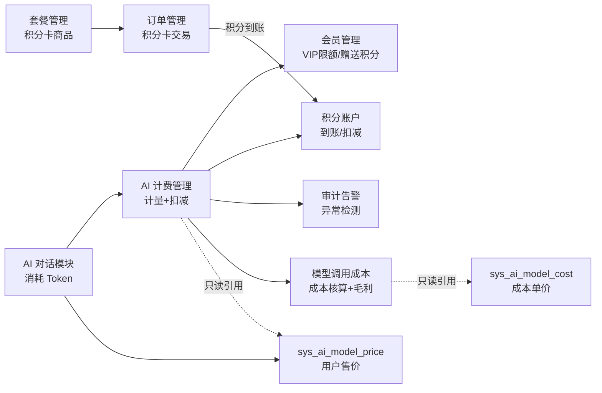

# AI 计费管理模块需求规格

> **模块边界说明**：本模块是 AI 用量的**计量与核算中枢**，聚焦三件事——积分账户（怎么来、怎么扣）、用量计量计费、模型调用成本核算。**积分卡商品的定义、定价与售卖**由[套餐管理模块](../套餐管理/需求规格.md)承接，**积分卡交易与支付**由[订单管理模块](../订单管理/需求规格.md)承接（支付成功后积分到账），**VIP 赠送积分**由[会员管理模块](../会员管理/需求规格.md)承接。
>
> **设计基线**：本模块遵循[商业化体系总体架构](../../../01-产品设计/07-商业化体系总体架构.md)的产品思想——"会员=身份+权益、套餐=商品抽象、积分=AI 计量"。积分是本产品众多服务（图像处理/评估/AI 等）中 AI 服务的计量单位；积分卡是套餐抽象下的"AI 加量包"商品。
>
> **三后端契约**：Java/Go/Python 三后端 API 契约完全一致，Java 权威，Go/Python 对齐。

## 1. 模块概述

### 1.1 模块定位

AI 计费管理是 AI 用量的计量与核算基础模块，采用**双线并行**架构：

- **收入线（面向用户）**：负责 AI 能力（AI 对话、知识库检索、语音交互、MCP 工具调用）的 Token/时长/字符消耗计量、积分换算、积分账户管理与配额扣减。采用**积分余额账户 + 配额限额**双控模式：用户拥有积分余额账户（积分卡到账/VIP 赠送/试用），同时受日限额/月限额约束（防滥用）。用户售价采用**绝对单价（积分/百万 token）+ 多维档位**（时段 × 上下文分段 × 输入/输出/缓存），价格版本化可追溯，高峰时段规则全局可配（见 §2.4.2）。对齐 OpenAI/Anthropic 等主流大模型平台的预付费 + 层级限额计费模式。
- **成本线（面向管理员）**：负责模型调用成本管理——按供应商采购单价核算每次调用的真实货币成本，与收入线对比形成毛利，支撑成本控制与定价决策（见 §2.10）。

收入线与成本线**数据同源**（基于同一计费记录 sys_ai_billing 的 token 明细，不重复计量），但计量单位、管理对象与可见性完全分离：用户只见积分（收入线），成本属商业机密仅管理员可见（成本线）。

> **定位收敛说明**：积分卡商品售卖已由套餐管理商品中心承接（原"积分包定价与充值"移出本模块）。本模块不再定义商品，仅承接积分到账（积分卡履约）、计量扣减与成本核算。

### 1.2 核心价值

| 价值维度 | 具体内容 |
|---------|---------|
| **积分账户** | 单一积分账户、多来源（积分卡到账 / VIP 赠送 / 试用 / 管理员调整），按消耗扣减，支持回退与补偿 |
| **统一计量** | 以积分（credits）为统一单位，AI 对话/知识库/语音/MCP 工具调用统一计入 AI 积分 |
| **模型差异** | 按模型售价换算原始 Token，支持不同模型的输入/输出/缓存命中差异化定价 |
| **多维档位定价** | 积分单价以档位行表达（时段 × 上下文分段 × 输入/输出/缓存任意组合，绝对单价，积分/百万 token），价格版本化可追溯；高峰时段规则全局可配不写死 |
| **余额 vs 限额** | 余额账户记录可用积分；日/月限额为防滥用阈值（不计余额，仅限流/告警） |
| **限额分层** | 日限额（成本控制）+ 月限额（预算控制），防异常消耗与预算管理 |
| **降级计费** | 模型路由降级时按实际使用的降级模型计费，用户不亏（降级模型通常更便宜） |
| **缓存节约** | Prompt Caching 命中时按折扣价计费，节省的积分透明展示 |
| **异常检测** | 异常 Token 消耗（突发峰值/单次超高开销）检测与告警 |
| **成本核算** | 按供应商采购单价核算每次调用的真实成本，随计费记录落库，可审计追溯 |
| **利润分析** | 收入（订单实收）vs 成本（采购价核算）对比形成毛利，毛利为负预警 |
| **定价决策** | 供应商调价对毛利的影响测算，支撑用户积分售价调整决策 |

### 1.3 依赖关系



| 依赖方向 | 模块 | 依赖说明 |
|---------|------|---------|
| 依赖 | **会员管理** | 获取用户 VIP 等级对应的 AI 积分日限额/月限额；VIP 赠送积分按月发放 |
| 依赖 | **订单管理** | 积分卡支付成功后积分到账（source=recharge）；积分卡退款时未消耗积分回退 |
| 依赖 | **AI 模型管理模块** | 对话消耗 Token 的计量和配额扣减；`sys_ai_model_price` 用户售价表归 AI 模型管理模块所有，计费模块**只读引用**（绝对单价，价格版本化） |
| 被依赖 | **AI 对话模块** | 对话前调用配额校验/预扣，对话后调用实扣 |

### 1.4 模块协同

| 协同模块 | 协同内容 |
|---------|---------|
| **会员管理** | VIP 等级决定日/月限额（`sys_member_benefit.ai_credits_daily`/`ai_credits_monthly`）；VIP 赠送积分按月发放；**成长值由会员管理模块负责累计**（计费模块仅触发事件，不直接写成长值） |
| **套餐管理** | 积分卡商品定义/定价/营销（本模块不定义商品）；积分卡为"AI 加量包" |
| **订单管理** | 积分卡交易与支付；支付成功触发积分到账；退款触发未消耗积分回退 |
| **AI 对话模块** | 对话消耗 Token 计量与配额扣减；用户售价表归 AI 模型管理模块，计费模块只读引用 |
| **AI 知识库** | RAG 注入的 Top-K 片段 Token 消耗计入 AI 积分（随对话输入 Token 计量，bill_type=kb_inject） |
| **语音交互** | ASR 按音频时长（秒）计费、TTS 按字符数计费，计入 AI 积分（bill_type=asr/tts） |
| **MCP 能力网关** | MCP 工具调用中**工具推理的 LLM 调用计入 AI 积分**（bill_type=tool_llm）；**底层第三方 API 配额由底层 API 独立扣减，不重复计入 AI 积分** |
| **多模态视觉读取限额** | 多模态视觉读取次数限额归会员权益/AI 对话模块，计费模块仅按 Token 计量，不管理视觉读取次数配额 |

---

## 2. 功能需求

### 2.1 积分余额账户 (F-MB-001)

#### 2.1.1 账户模型

- 每个用户拥有唯一积分余额账户，余额字段 `credits_balance`
- 积分到账（积分卡/VIP 赠送/试用）增加余额，消耗扣减减少余额，回退/补偿增加余额
- 余额账户记录流水（`sys_ai_credit_log`）：到账/赠送/扣减/回退/补偿/管理员调整，每笔流水含来源、金额、关联业务记录、操作人

#### 2.1.2 余额 vs 限额（厘清）

| 项目 | 余额账户 | 日/月限额 |
|------|---------|---------|
| 性质 | 可用积分池（消耗计量负债） | 防滥用阈值 |
| 是否计余额 | 是（实际扣减来源） | 否（仅计数已用量，不扣余额） |
| 作用 | 实际扣减 | 限流/告警阈值 |
| 重置规则 | 不重置（随到账/消耗变动） | 日限额每日 0 点重置，月限额每月 1 日重置 |

**扣减流程**：先校验日/月限额（已用 + 预估 ≤ 限额），通过后从余额账户扣减实际积分。限额不足时拒绝调用并告警/限流；余额不足时提示加购积分卡。

### 2.2 积分来源与到账 (F-MB-002)

积分余额来自四个来源，规则各异：

| 来源 | 说明 | 有效期 | 流水 source |
|------|------|--------|-------------|
| **积分卡到账** | 用户购买积分卡（AI 加量包），订单支付成功后积分到账（本模块承接到账处理） | 永久有效 | `recharge` |
| **VIP 赠送** | VIP 会员按月赠送积分（各等级差异化），每月发放至余额账户 | 当月有效，**月末清零未用部分** | `vip_gift` |
| **免费试用** | 新用户注册赠送 100 积分试用额度 | 永久有效（计入余额） | `trial` |
| **管理员调整** | 管理员手动调整用户积分（客服补扣/补偿），记录原因与操作人 | 实时生效 | `admin_adjust` |

> **积分卡到账说明**：积分卡商品由[套餐管理模块](../套餐管理/需求规格.md)定义（可得积分、定价、营销），交易由[订单管理模块](../订单管理/需求规格.md)承接。本模块承接履约：订单支付成功回调 → 积分余额增加 → 流水记录（source=recharge）。充值积分**永久有效**。
> **VIP 赠送月末清零**：次月重新发放，清零未用部分（月度额度语义）。

### 2.3 积分回退与补偿 (F-MB-003)

两类回退场景：

#### 2.3.1 积分卡退款回退

- 积分卡订单售后申请审核通过后，**未消耗积分**从余额账户扣回（已消耗部分不退）
- 流水记录（source=refund，关联原积分卡订单）
- 折算口径（按用量）与审核流程见[订单管理 §4](../订单管理/需求规格.md)

#### 2.3.2 异常消耗/误扣补偿

**申请入口**：用户在计费明细中对单笔计费记录提交"误扣申诉"（选择原因类型 + 补充说明），申诉状态（处理中/已通过/已驳回）在计费明细中展示；系统检测到异常消耗时也可主动触发补偿流程。

```
用户提交误扣申诉（关联计费记录）或系统检测到误扣
    ↓
管理员审核（关联原计费记录，核对误扣原因）
    ├─ 通过 → 余额回补（credits_balance += 补偿金额）
    └─ 驳回 → 说明原因
    ↓
流水记录（source=refund，关联原计费记录）
```

- 补偿记录关联原计费记录，便于审计追溯
- 补偿**不重置**日/月限额已用计数（避免绕过限额防滥用机制）
- 误扣申诉接口见 [API接口.md](./API接口.md)（`/refunds` 提交申诉、`/refunds/{id}/audit` 管理员审核）

### 2.4 积分计量 (F-MB-004)

#### 2.4.1 计量维度

| 项目 | 说明 |
|------|------|
| 计量单位 | 积分（credits），面向用户的统一计量单位 |
| 输入 Token | 用户消息 + 上下文（system prompt、长期记忆、摘要、知识库检索结果、多模态输入等） |
| 图片输入 | 多模态图片按模型配置的换算规则折算 Token（如 DeepSeek 单图缩放后计入上限 384 token），随输入 Token 一并计量（bill_type=chat） |
| 输出 Token | LLM 回复内容（含工具调用参数输出），单价通常高于输入 |
| 缓存命中 | Prompt Caching 命中时按折扣价计费（cached_rate） |
| 时段 | 高峰/空闲时段按各自档位行单价计费（档位见 §2.4.2），时段规则全局配置 |

> **图片换算 Token**：不同供应商对图片输入按自身规则换算 Token（缩放、单图上限等）。模型配置可设置图片换算上限（见 [AI模型管理/需求规格.md](../AI模型管理/需求规格.md) §2.8.3），预扣估算时按"图片数 × 单图上限"计入输入 Token，实扣以供应商返回的 token 用量为准。

#### 2.4.2 积分换算

用户售价采用**绝对单价**（积分/百万 token），以"价格版本主表 + 档位明细行"表达（`sys_ai_model_price` + `sys_ai_model_price_detail`）。档位按三维匹配当前单价：**时段档位**（time_slot）+ **上下文长度分段**（min_tokens~max_tokens）+ **token 类型**（input/cached/output）：

```
1. 价格版本：按调用时刻取生效版本（effective_from ≤ t < effective_to）
2. 时段档位：按调用时刻 + 全局高峰时段规则（ai.billing.peak-hours）判定 peak/idle
3. 上下文分段：按本次输入总长度（inputTokens，含缓存命中）匹配 min_tokens ≤ len < max_tokens 的档位
4. token 类型单价：按 input/cached/output 分别取对应档位行的 unit_price
5. 换算：
   credits = (inputTokens − cachedInputTokens) × input单价/1,000,000
           + cachedInputTokens × cached单价/1,000,000
           + outputTokens × output单价/1,000,000
```

- 档位表达覆盖能力：**高峰/空闲分时定价**（如 DeepSeek）、**上下文长度分段定价**（如 OpenAI/Anthropic 按 ≤200K / >200K 分档）、**输入/输出/缓存差异化**，及三者任意组合；未来新增时段/分段/计费维度仅**追加档位行**，不改表结构
- 简单场景：不分时段、不分段的模型，档位行仅 3 行（input/cached/output，min_tokens=0、max_tokens=NULL，peak/idle 两时段填相同单价）
- **价格版本化**：调价生成新版本（effective_from/effective_to），历史计费按调用时刻对应版本核算，对账有据
- **高峰时段规则为全局配置**（默认北京时间周一至周五 9:00-12:00、14:00-18:00），时段定义可配置，随产品定价调整不写死
- 价格表结构与成本单价表（`sys_ai_model_cost` + `sys_ai_model_cost_detail`）**完全对称**，共用价格版本选择与时段判定逻辑
- 积分取整：Decimal 精确计算后四舍五入到整数，单次消耗至少 1 积分（最小计费粒度）
- `credits_saved`：缓存命中的积分节省量 = `cachedInputTokens × (输入档位单价 − 缓存档位单价)/1,000,000`（按匹配到的档位）
- 不同 AI 能力按 `bill_type` 分类记录（见 §2.4.6），各自创建独立计费记录

#### 2.4.3 降级模型计费

模型路由降级（主模型不可用时自动切换 fallback）时的计费规则：

| 场景 | 计费模型 | 理由 |
|------|---------|------|
| 主模型正常调用 | 主模型 | 用户选择了主模型 |
| 主模型降级到 fallback | **降级模型**（更便宜） | 用户不应为服务降级多付积分 |
| 降级链（A→B→C） | 最终使用的降级模型 | 逐级降级按最终实际模型计费 |

计费记录中记录实际使用的降级模型（`model`）与用户原选模型（`actual_model`），统计可对比"用户期望成本 vs 实际成本"。

#### 2.4.4 Prompt Caching 积分节约

- 缓存命中按折扣价（cached_rate）扣减积分
- `credits_saved` 记录节省量，用户可见"本次节省 X 积分（缓存命中）"
- 节省的积分不退回或增加配额，仅信息展示

#### 2.4.5 子智能体并行计费

多个子智能体并行执行时各自独立消耗 LLM Token：

- 每个子智能体的 LLM 调用创建独立的计费记录（按实际调用类型 bill_type=chat/tool_llm，关联同一会话）
- 主智能体汇总所有子智能体的积分消耗，更新消息的积分（消息级汇总）
- 配额扣减以消息级汇总积分为准

#### 2.4.6 bill_type 计费类型分离

不同 AI 能力的 LLM 调用按 `bill_type` 区分记录：

| bill_type | 场景 | 计费单元 |
|-----------|------|---------|
| `chat` | AI 对话消息的 LLM 回复 | 输入/输出 Token |
| `tool_llm` | MCP 工具推理步骤的 LLM 调用（如 ReAct observe） | LLM Token |
| `kb_inject` | 知识库 RAG 检索注入的 Top-K 片段 | 注入 Token（随对话输入 Token 计量） |
| `asr` | 语音识别 | 按音频时长（秒） |
| `tts` | 语音合成 | 按字符数 |

> **底层 API 配额独立扣减**：MCP 工具调用转发的第三方 API（如图像处理次数、评估次数）由底层 API 独立扣减其配额，**不重复计入 AI 积分**。AI 计费仅记录工具推理的 LLM 调用（tool_llm）。

### 2.5 配额管理 (F-MB-005)

#### 2.5.1 限额分层

| 限额类型 | 说明 | 重置周期 | 扣减方式 |
|---------|------|---------|---------|
| 日限额 | 控制单日消耗（防异常调用），各 VIP 等级差异化 | 每日 0 点（Asia/Shanghai） | 原子计数 + 阈值判断 |
| 月限额 | 月度预算控制，各 VIP 等级差异化 | 每月 1 日（Asia/Shanghai） | 原子计数 + 阈值判断 |

> **TPM/RPM**（每分钟 Token/请求数）是平台级运行时并发控制，在 API 网关层统一限制，不进 VIP 配额。计费模块不调整 TPM/RPM，仅在突发峰值时告警并触发日限额限流。

#### 2.5.2 配额扣减流程（预扣 + 实扣）

采用预扣减 + 实扣减两步模式，确保配额原子性和准确性：

1. 发送消息前**预扣减**日/月配额（预扣减值 = 计费预估算法输出值，见 §2.6），不足则拒绝发送
2. 对话完成后按**实际 Token 消耗**实扣减，**退还预扣与实际之间的差额**

> 具体实现流程（预估算法、原子扣减、差额退补计算）详见 [后端实现 §4 计费流程](./后端实现.md#4-计费流程)。

#### 2.5.3 配额不足处理

配额不足时暂停 Agent 执行并保留上下文：

```
LLM Agent 对话 → 配额检查失败
    ↓
暂停 Agent，保留对话上下文
    ↓
前端展示配额不足提示 + 加购引导
    ↓
用户加购积分卡/升级 VIP → 余额或配额刷新 → 恢复推理
用户等待重置 → 上下文保留至重置（或超时清理）
用户放弃 → 清除上下文
```

### 2.6 计费预估 (F-MB-006)

#### 2.6.1 预估算法

| 预估项 | 算法 |
|--------|------|
| 预估输入 Token | 历史 10 轮平均上下文 × 0.8 + 当前消息 Token × 1.2 + 记忆注入 200 + 工具定义 500 |
| 预估输出 Token | 模型 max_output_tokens × 0.3（保守估计） |
| 预估积分 | 按当前时段档位匹配档位行单价：预估积分 = 预估输入 × input档位单价/1M + 预估输出 × output档位单价/1M（高峰时段按 peak 行，空闲按 idle 行） |
| 预估范围 | 展示为范围："预计消耗 1000 - 3000 积分" |

> **预扣减值 = 计费预估算法输出的预估积分值**（即上表"预估积分"项的计算结果）。

#### 2.6.2 预估值展示

| 展示场景 | 内容 |
|---------|------|
| 对话发送前 | "本次对话大约消耗 1000 - 3000 积分" |
| 余额不足警告 | "本次对话预计 3000 积分，当前余额 2500 积分，请加购积分卡" |
| 计费明细 | 实扣积分 vs 预估积分对比（偏高/正常/偏低） |

### 2.7 异常检测与告警 (F-MB-007)

#### 2.7.1 异常规则

| 异常类型 | 触发条件 | 处理方式 |
|---------|---------|---------|
| 单次超高消耗 | 单次消息积分 > 月限额 × 10% | 告警 + 记录异常标记 |
| 突发峰值 | 5 分钟内消耗 > 日限额 × 50% | 告警 + 触发日限额限流 |
| 连续配额不足 | 24 小时内配额不足触发 > 10 次 | 告警（可能异常使用，需人工核查） |
| 空回复高消耗 | LLM 输出 0 token 但输入 > 10000 token | 告警（可能是无效 prompt） |

> TPM/RPM 限流由 API 网关层统一控制，计费模块不调整 TPM；突发峰值时计费模块仅告警并触发日限额限流。

#### 2.7.2 告警渠道

| 渠道 | 对象 | 说明 |
|------|------|------|
| 站内通知 | 管理员 | 异常计数仪表盘 |
| 日志标记 | 系统日志 | 异常标记 + 计费明细关联查询 |
| 用户提示 | 用户 | 单次超高消耗时前端提示"本次消耗较高，建议简化需求" |

### 2.8 VIP 配额配置 (F-MB-008)

#### 2.8.1 功能描述

在会员管理的权益配置基础上扩展 AI 对话积分限额（日限额、月限额、多模态视觉读取日限额）三个字段，各 VIP 等级差异化配置。配置管理复用会员管理的权益配置功能，字段落地见[会员管理需求规格 §5](../会员管理/需求规格.md)。

#### 2.8.2 各等级建议配额

| 权益项 | 普通用户 | VIP1 | VIP2 | SVIP |
|--------|---------|------|------|------|
| AI 对话积分（日限额） | 10,000 | 50,000 | 200,000 | 1,000,000 |
| AI 对话积分（月限额） | 100,000 | 500,000 | 2,000,000 | 10,000,000 |
| 多模态视觉读取（次/日） | 5 | 10 | 20 | 50 |

> 多模态视觉读取次数限额归会员权益/AI 对话模块管理（按用户全局日计数），计费模块仅按 Token 计量。VIP 配额字段的配置管理复用会员管理的权益配置功能，不单独开发配置界面。

### 2.9 计费记录与统计 (F-MB-009)

#### 2.9.1 计费记录

记录每次 AI 能力调用的 Token/时长/字符消耗明细，区分模型降级/缓存节省/工具调用/子智能体/知识库注入/语音等计费类型，支撑成本分析和异常审计。表结构见 [02-系统架构/03-数据库设计.md](../../../02-系统架构/03-数据库设计.md)（AI 对话相关表）与本文档 §4。

#### 2.9.2 账单与发票

- 用户可下载账单明细（按日/月维度，含积分消耗/到账/回退流水）
- 月结账单：每月初生成上月积分消费汇总（消耗/到账/回退/余额变动）

#### 2.9.3 统计维度

| 统计维度 | 说明 |
|---------|------|
| 用户维度账单 | 日/月积分消耗趋势、模型分布 |
| 模型消耗分析 | 按模型维度统计 token 消耗和积分开销（识别高消耗模型）；真实成本核算见 §2.10 |
| 降级统计 | 各模型降级频率（识别不稳定的模型提供商） |
| 缓存命中率 | Prompt Caching 命中率和积分节省统计 |
| 异常消费 | 异常标记的计费记录列表和趋势 |
| 成本-利润 | 按模型/供应商/时间统计收入（订单实收）、成本（采购价核算）、毛利（见 §2.10） |

---

### 2.10 模型调用成本管理（成本线）(F-MB-010)

> 定位：面向系统管理员，管理模型调用产生的真实货币成本。成本按**供应商采购单价（配置）估算**为主，支持**导入供应商实际账单对账**，与收入线对比形成毛利，支撑成本控制与定价决策。成本单价表（`sys_ai_model_cost`，元/百万 token）与用户售价表（`sys_ai_model_price`，积分/百万 token）**结构完全对称**，共用价格版本与时段判定逻辑。数据同源 sys_ai_billing（token 明细），不重复计量。

#### 2.10.1 成本单价管理

供应商采购单价（成本价）与用户积分单价（售价）解耦，独立管理（独立表 `sys_ai_model_cost`）：

| 配置项 | 说明 |
|--------|------|
| 价格对象 | 模型-供应商维度（同一模型不同供应商成本不同） |
| 价格档位 | 以档位明细行表达：token 类型（输入未命中/缓存命中/输出）× 上下文分段（min~max tokens）× 时段档位（高峰/空闲），每行一个单价（元/百万 token）；不区分时段/分段的供应商仅配置最少档位行 |
| 币种 | 供应商计费币种（人民币/美元），统一折算为人民币核算 |
| 价格版本 | 供应商调价时生成新版本，历史成本按调用时刻对应版本核算，对账有据 |

**高峰时段**：全局配置（用户侧定价与成本侧核算共用同一规则，默认对齐 DeepSeek：北京时间周一至周五 9:00-12:00、14:00-18:00，其余为空闲），时段定义可配置；如需按供应商差异化时段可扩展为供应商级覆盖。部分供应商单价不分时段，各档填相同值即可。

#### 2.10.2 成本核算（估算）

每次调用按实际消耗估算真实成本，随计费记录落库：

```
cost = 输入未命中Token × 输入未命中单价(按时段/分段)
     + 缓存命中Token × 缓存命中单价(按时段/分段)
     + 输出Token × 输出单价(按时段/分段)
```

- 时段按调用发生时刻（Asia/Shanghai）判断高峰/空闲；分段按本次输入总长度匹配
- 成本金额落库 `sys_ai_billing.cost`（十进制，元），计费记录只追加，成本可审计追溯
- 成本核算针对供应商 LLM 调用（bill_type=chat/tool_llm/kb_inject）；asr/tts 为本地能力（无外部供应商采购），cost 保持 0
- 成本核算为异步过程（计费记录落库后计算），不阻塞用户结算主链路；供应商未配置成本单价时 cost 置 0 并标记"待配置成本价"，异常检测告警提示管理员补充

#### 2.10.3 成本-利润分析

毛利核算采用**双口径**：

| 口径 | 收入 | 成本 | 毛利 |
|------|------|------|------|
| **整体毛利（官方口径）** | **全部订单实收**：积分卡订单实收 + 会员卡订单实收 | 同周期内模型调用估算成本（Σ sys_ai_billing.cost；图像处理/评估为本地能力，无外部采购成本，不纳入核算） | 收入 − 成本；经营决策主依据 |
| **AI 参考毛利（辅助口径）** | 积分卡订单实收 + 会员卡订单实收 × **AI 分摊比例**（运营配置） | 同周期内模型调用估算成本（Σ sys_ai_billing.cost） | 收入 − 成本；仅用于 AI 定价与供应商调整决策参考 |

- 按模型/供应商/时间维度下钻，毛利为负自动预警
- **整体毛利为官方口径**（订阅制收入不做非必要分摊）；AI 分摊比例见 §2.10.6，由运营配置、可调整，取值变化不影响整体毛利

> **口径原则**：收入按**实收金额**（用户实付），积分是消耗计量负债而非收入；积分卡量价优惠/赠送作为营销成本。毛利 = 实收收入 − 模型调用成本。

#### 2.10.4 供应商调价影响与定价辅助

- 供应商调价（新价格版本）后，按当前消耗结构模拟重算成本，测算毛利影响
- 支撑管理员决策：是否调整用户积分售价、是否切换供应商/替换模型

#### 2.10.5 对账支撑（实际账单）

估算成本用于日常毛利监控；**实际账单对账**用于校准采购价配置与结算差异：

| 环节 | 说明 |
|------|------|
| 账单导入 | 管理员导入供应商账单（按月，含调用量/金额明细，支持 CSV/Excel） |
| 逐笔核对 | 以 request_id / 模型 / token 明细与账单比对，差异标记（未匹配/金额不符） |
| 差异处理 | 估算成本与实际账单差异归因：价格配置过期、供应商赠送/折扣、计量口径差异 |
| 价格校准 | 对账发现的成本偏差反哺成本单价配置修正 |

#### 2.10.6 积分价值锚与收入口径

- **积分价值锚**：1 积分 = 0.01 元（1 元 = 100 积分），作为积分价值衡量、积分卡定价基准与存量积分负债估值
- **收入口径**：商品收入按订单**实收金额**计（积分卡/会员卡实付），不按"积分消耗 × 兑换率"确认收入
- **会员卡收入归属 AI 的分摊口径（已定论）**：毛利核算以**整体毛利为官方口径**（全部订单实收 − Σ AI 调用成本），订阅制收入不做非必要分摊；**AI 参考毛利**为辅助口径，其 AI 分摊收入 = 会员卡订单实收 × **AI 分摊比例**。分摊比例由**运营配置**（建议初始值按会员权益结构中 AI 额度的价值权重核定），不写死、可按经营情况调整；比例仅影响 AI 参考口径，不影响整体毛利（见 §2.10.3）
- 兑换率可配置调整（产品定价变动），调整后历史计费记录保持原样

---

### 2.11 页面设计（用户端 + 管理端）(F-MB-011)

#### 2.11.1 设计原则

AI 计费管理在页面层面遵循与模块一致的"双线并行、数据同源"思想：

| 原则 | 说明 |
|------|------|
| **一页一角色** | 用户端回答"我的积分花在哪、还剩多少、够不够用"；管理端回答"AI 业务赚不赚钱、成本合不合理、哪里有异常"。两份页面各自只承载单一角色的核心问题，不做能力混装 |
| **数据同源** | 两份页面消费同一份计费记录（sys_ai_billing）与积分流水（sys_ai_credit_log），消耗口径完全一致，不重复计量 |
| **可见性隔离** | 用户只见积分（收入线）；成本单价、毛利（成本线）属商业机密，仅管理员可见 |
| **前端合并、后台精细** | 用户端合并表达（余额 + 限额一张卡片），管理端保留全量明细与配置项 |

#### 2.11.2 用户端计费页（收入线）

**定位**：消费安全感 + 加购闭环。让用户对"积分从哪来、花在哪、省在哪"一目了然，余额/限额不足时自然引导加购积分卡。

**页面结构**（自上而下四区）：

| 区块 | 内容 | 支撑接口 |
|------|------|---------|
| **① 余额状态区** | 当前积分余额（大字卡片）+ 日限额/月限额进度条（已用/限额，≥80% 变色预警）+ 余额不足时展示加购引导 | `/ai-billing/balance` |
| **② 消耗总览区** | 日/月维度消耗趋势、模型消耗分布（Top N 占比）、缓存节省与降级节省汇总（"本月累计节省 X 积分"） | `/ai-billing/summary` |
| **③ 计费明细区** | 计费记录分页列表：按 bill_type（对话/知识库/语音/工具）筛选；逐条展示时间、会话、模型（降级标识）、输入/输出/缓存 Token、实扣积分 vs 预估积分（偏高/正常/偏低）、缓存节省、申诉状态；行内"误扣申诉"操作 | `/ai-billing/records`（含申诉状态）、`/ai-billing/refunds` |
| **④ 账单与流水区** | Tab 切换：积分流水（到账/扣减/回退，source 标识）与月结账单（下载日/月明细） | `/ai-billing/credit-logs`、`/ai-billing/bills/{month}`、`/ai-billing/bills/{month}/download` |

**交互细节**：

- **预估可见**：对话发送前展示"预计消耗 1000 - 3000 积分"；实扣后明细中展示实扣 vs 预估对比，把预扣实扣差额透明化
- **信任承诺显性化**：缓存命中行展示"节省 X 积分（缓存命中）"，降级调用行标识实际使用模型，消除"积分被多扣"疑虑
- **误扣申诉流**：明细行提交申诉（选择原因类型 + 补充说明）→ 申诉状态（处理中/已通过/已驳回）随明细展示 → 通过后余额回补并产生流水
- **加购闭环**：余额不足提示"本次对话预计 X 积分，当前余额 Y 积分，请加购积分卡"，内嵌跳转套餐商店

#### 2.11.3 管理端计费页（成本线）

**定位**：商业健康度驾驶舱，按"概览 → 下钻 → 治理"三层组织，支撑成本控制与定价决策。

**① 概览看板**：

| 卡片 | 口径 |
|------|------|
| 实收收入 | 周期内积分卡 + 会员卡订单实收（按月/季/自定义） |
| 模型调用成本 | Σ sys_ai_billing.cost（估算成本） |
| 毛利 / 毛利率 | **整体毛利（官方口径，主展示）** + AI 参考毛利（辅助口径）；毛利为负时红色预警 |
| 积分-成本对照 | 累计消耗积分 vs 累计成本，展示单位积分成本 |

**② 消耗与成本下钻**：按用户/模型/供应商/时间维度切换；高消耗用户与高消耗模型 Top N（积分消耗 + 成本双列排序）；点击行进入用户级明细。支撑接口 `/ai-billing/stats`、`/ai-billing/cost-stats`。

**③ 治理与对账**：

| 功能 | 说明 | 支撑接口 |
|------|------|---------|
| 成本单价管理 | 按模型-供应商维护采购单价（价格版本主表 + 档位明细），调价生成新版本 | `/ai-billing/costs` CRUD |
| 实际账单对账 | 导入供应商账单（CSV/Excel，按月）→ 逐笔核对（request_id/模型/token）→ 差异归因（价格配置过期/赠送折扣/计量口径）→ 反哺价格校准 | `/ai-billing/reconcile/import` |
| 调价影响测算 | 供应商调价后按当前消耗结构模拟重算成本与毛利，输出"是否调整用户积分售价/是否切换供应商"参考 | `/ai-billing/cost-stats` |
| 异常监控 | 异常计费记录清单（单次超高消耗/突发峰值/连续配额不足/空回复高消耗）与趋势，站内通知告警 | `/ai-billing/anomalies` |
| 积分调整 | 管理员手动调整用户积分（补扣/补偿，记录原因与操作人） | `/ai-billing/adjust`、`/ai-billing/refunds/{id}/audit` |

#### 2.11.4 双线联动

- 两份页面基于同一份计费记录呈现：用户页读收入线字段（credits/credits_saved/quota_consumed），管理页在用户可见字段基础上叠加成本线字段（cost）
- 管理端下钻到单条计费记录时，展示字段 = 用户可见字段 + 成本字段，实现"成本不向用户暴露、一份记录两套视图"

---

## 3. 与现有体系的关系

| 现有能力 | 关系 |
|---------|------|
| 积分包充值 | 积分卡商品移出至套餐管理，本模块承接积分到账（source=recharge） |
| 月度处理/评估次数 | 继续保留，MCP 工具调用走底层 API 的配额扣减，逻辑不变 |
| 成长值体系 | 由**会员管理模块负责累计**，计费模块仅触发事件，不直接写成长值 |
| 权益校验流程 | AI 对话积分日限额 + 月限额校验；工具调用配额由底层 API 校验 |
| 次数重置规则 | AI 对话积分日限额每日 0 点重置，月限额每月 1 日重置（时区 Asia/Shanghai） |
| 模型成本管理 | 成本单价（sys_ai_model_cost，元）与用户售价（sys_ai_model_price，积分）两表对称独立；估算成本 + 实际账单对账双轨；成本不向用户暴露 |

---

## 4. 数据模型

> 完整表结构见 [02-系统架构/03-数据库设计.md](../../../02-系统架构/03-数据库设计.md)（AI 对话相关表）与 `config/sql/schema/sys_ai_billing.sql`。本节仅列关键字段概要。

### 4.1 计费记录 sys_ai_billing

| 字段 | 说明 |
|------|------|
| user_id / conversation_id / message_id | 关联用户与 AI 对话会话/消息 |
| model / actual_model | 实际使用模型（降级场景记录降级模型）/ 用户原选模型（NULL 表示未降级） |
| bill_type | 计费类型（chat/tool_llm/kb_inject/asr/tts） |
| input_tokens / cached_input_tokens / output_tokens | 输入 Token（含缓存命中）/ 缓存命中输入 / 输出 Token |
| credits / credits_saved | 消耗积分（按实际模型售价换算）/ 缓存命中节省积分 |
| tool_credits | 工具调用中额外消耗的 LLM Token 积分（tool_llm 类型记录） |
| quota_consumed / pre_deduct | 实际扣减配额（credits - 预扣退还差额）/ 预扣减积分 |
| cost | 本次调用估算成本（按调用时刻成本单价核算，元）；成本线异步计算写入，未配置成本单价为 0 |

> 计费记录为只追加，不逻辑删除（财务记录不可删），过期数据通过定时任务物理清理。

### 4.2 积分余额账户与流水

| 实体 | 关键字段 | 说明 |
|------|---------|------|
| 余额账户（用户表 credits_balance 字段） | credits_balance | 用户可用积分余额；积分卡到账/VIP 赠送/试用增加，消耗扣减，回退/补偿增加 |
| 流水 sys_ai_credit_log | user_id、source(recharge/vip_gift/trial/admin_adjust/refund/consume)、amount、balance_after、related_id、reason、operator_id、create_time | 每笔余额变动流水；recharge 关联积分卡订单，consume 关联计费记录，refund 关联原计费记录或积分卡订单 |

> 余额账户与流水表需在数据库设计中补充（credits_balance 字段 + sys_ai_credit_log 表），由数据库设计同步落地。

### 4.3 模型成本单价 sys_ai_model_cost（版本主表 + 档位明细）

> 供应商采购价（成本价）与用户售价分离，价格版本化支撑对账。成本单价以"价格版本主表 + 档位明细行"表达，与用户售价表结构完全对称。表归 AI 计费管理模块所有，模型管理侧只读引用。完整表结构见 [02-系统架构/03-数据库设计.md](../../../02-系统架构/03-数据库设计.md) 与 `config/sql/schema/sys_ai_model_cost.sql`、`sys_ai_model_cost_detail.sql`。

| 表 | 字段要点 | 说明 |
|----|---------|------|
| sys_ai_model_cost（版本主表） | model_id / provider_id / price_version / currency / effective_from / effective_to / status | 价格版本（同模型同供应商内递增，供应商调价新增版本） |
| sys_ai_model_cost_detail（档位明细） | price_id / token_type(input/cached/output) / time_slot(peak/idle) / min_tokens / max_tokens / unit_price | 每行 = token 类型 × 上下文分段 × 时段档位 的采购单价（元/百万 token） |

### 4.4 模型用户售价 sys_ai_model_price（版本主表 + 档位明细）

> 用户侧积分售价（绝对单价，积分/百万 token），与成本单价表结构完全对称，价格版本化支撑调价追溯与历史计费对账。表归 AI 模型管理模块所有，计费模块只读引用。完整表结构见 [02-系统架构/03-数据库设计.md](../../../02-系统架构/03-数据库设计.md) 与 `config/sql/schema/sys_ai_model_price.sql`、`sys_ai_model_price_detail.sql`。

| 表 | 字段要点 | 说明 |
|----|---------|------|
| sys_ai_model_price（版本主表） | model_id / provider_id / price_version / unit / effective_from / effective_to / status | 价格版本（积分/百万 token） |
| sys_ai_model_price_detail（档位明细） | price_id / token_type(input/cached/output) / time_slot(peak/idle) / min_tokens / max_tokens / unit_price | 每行 = token 类型 × 上下文分段 × 时段档位 的售价（积分/百万 token） |

> 价格字段不承载于 `sys_ai_model`：用户售价存本表，供应商采购价存 sys_ai_model_cost（见 §4.3），两表结构对称、价格版本化。

---

## 5. 非功能性需求

| 指标 | 要求 | 说明 |
|------|------|------|
| 计费准确性 | 预扣实扣差额容忍度 ≤ 1% | 预估算法保守估计，实扣按真实消耗，差额自动退补 |
| 并发扣减原子性 | Redis 原子操作（INCR/DECR）/ Lua 脚本 | 配额预扣/实扣/退还均原子，并发不超扣 |
| 配额重置时区 | Asia/Shanghai | 日限额每日 0 点重置，月限额每月 1 日 0 点重置 |
| 计费记录最终一致性 | Redis 扣减与 MySQL 记录最终一致 | Redis 扣减优先保证配额准确，MySQL 记录异步落库，异常时补偿重试 |
| 异常检测准实时 | 5 分钟内检测并告警 | 突发峰值/连续配额不足等异常 5 分钟内触发告警 |

---

## 6. 三后端一致性约束

Java/Go/Python 三后端 API 契约完全一致，Java 权威，Go/Python 对齐：

- 配额扣减三端均使用 Redis 原子操作（INCR/DECR/Lua 脚本），保证并发不超扣
- 积分换算公式、bill_type 枚举、降级计费规则三端一致
- 配额重置时区（Asia/Shanghai）、预扣实扣流程三端一致
- 计费记录字段与只追加策略三端一致
- 成本核算公式（token 类型 × 上下文分段 × 时段档位三维匹配）、高峰时段规则、成本金额落库字段（sys_ai_billing.cost）三端一致
- 价格档位模型（sys_ai_model_cost/price 版本主表 + *_detail 档位明细）结构、绝对单价换算公式、价格版本化逻辑三端一致
