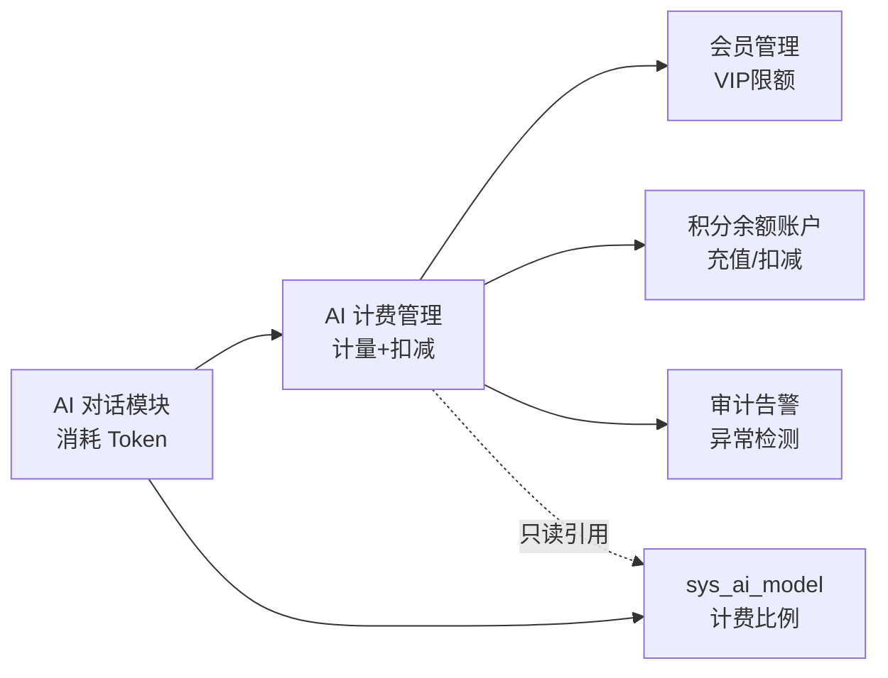

# AI 计费管理模块需求规格

## 1. 模块概述

### 1.1 模块定位

AI 计费管理是 AI 工作平台的计费基础模块，负责 AI 能力（AI 对话、知识库检索、语音交互、MCP 工具调用）的 Token/时长/字符消耗计量、积分换算、余额账户管理与配额扣减。采用**积分余额账户 + 配额限额**双控模式：用户拥有积分余额账户（充值/赠送），同时受日限额/月限额约束（防滥用）；扣减优先扣余额，限额仅作阈值告警/限流。对齐 OpenAI/Anthropic 等主流大模型平台的预付费 + 层级限额计费模式。

### 1.2 核心价值

| 价值维度 | 具体内容 |
|---------|---------|
| **预付费闭环** | 积分充值/购买/赠送 → 余额账户 → 按消耗扣减，支持退款补偿 |
| **统一计量** | 以积分（credits）为统一单位，AI 对话/知识库/语音/MCP 工具调用统一计入 AI 积分 |
| **模型差异** | 按模型计费比例换算原始 Token，支持不同模型的输入/输出/缓存命中差异化定价 |
| **余额 vs 限额** | 余额账户记录可用积分；日/月限额为防滥用阈值（不计余额，仅限流/告警） |
| **限额分层** | 日限额（成本控制）+ 月限额（预算控制），防异常消耗与预算管理 |
| **降级计费** | 模型路由降级时按实际使用的降级模型计费，用户不亏（降级模型通常更便宜） |
| **缓存节约** | Prompt Caching 命中时按折扣价计费，节省的积分透明展示 |
| **异常检测** | 异常 Token 消耗（突发峰值/单次超高开销）检测与告警 |

### 1.3 依赖关系



| 依赖方向 | 模块 | 依赖说明 |
|---------|------|---------|
| 依赖 | **会员管理** | 获取用户 VIP 等级对应的 AI 积分日限额/月限额；VIP 赠送积分按月发放 |
| 依赖 | **AI 对话模块** | 对话消耗 Token 的计量和配额扣减；`sys_ai_model` 表归 AI 对话模块所有，计费模块**只读引用**计费比例字段（input_rate/output_rate/cached_rate） |
| 被依赖 | **AI 对话模块** | 对话前调用配额校验/预扣，对话后调用实扣 |

### 1.4 模块协同

| 协同模块 | 协同内容 |
|---------|---------|
| **会员管理** | VIP 等级决定日/月限额（`sys_member_benefit.ai_credits_daily`/`ai_credits_monthly`）；VIP 赠送积分按月发放；**成长值由会员管理模块负责累计**（AI 对话每次 +1 成长值，计费模块仅触发事件，不直接写成长值） |
| **AI 对话模块** | 对话消耗 Token 计量与配额扣减；`sys_ai_model` 表归 AI 对话模块所有，计费模块只读引用计费比例字段 |
| **AI 知识库** | RAG 注入的 Top-K 片段 Token 消耗计入 AI 积分（随对话输入 Token 计量，bill_type=kb_inject） |
| **语音交互** | ASR 按音频时长（秒）计费、TTS 按字符数计费，计入 AI 积分（bill_type=asr/tts） |
| **MCP 能力网关** | MCP 工具调用中**工具推理的 LLM 调用计入 AI 积分**（bill_type=tool_llm）；**底层第三方 API 配额由底层 API 独立扣减，不重复计入 AI 积分**（指 MCP 转发的第三方 API，如图像处理次数、评估次数） |
| **多模态视觉读取限额** | 多模态视觉读取次数限额归会员权益/AI 对话模块，计费模块仅按 Token 计量，不管理视觉读取次数配额 |

---

## 2. 功能需求

### 2.1 积分余额账户 (F-MB-001)

#### 2.1.1 账户模型

- 每个用户拥有唯一积分余额账户，余额字段 `credits_balance`
- 充值/赠送增加余额，扣减减少余额，退款增加余额
- 余额账户记录流水（`sys_ai_credit_log`）：充值/赠送/扣减/退款/管理员调整，每笔流水含来源、金额、关联业务记录、操作人

#### 2.1.2 余额 vs 限额（厘清）

| 项目 | 余额账户 | 日/月限额 |
|------|---------|---------|
| 性质 | 可用积分池（财务资产） | 防滥用阈值 |
| 是否计余额 | 是（实际扣减来源） | 否（仅计数已用量，不扣余额） |
| 作用 | 实际扣减 | 限流/告警阈值 |
| 重置规则 | 不重置（随充值/消耗变动） | 日限额每日 0 点重置，月限额每月 1 日重置 |

**扣减流程**：先校验日/月限额（已用 + 预估 ≤ 限额），通过后从余额账户扣减实际积分。限额不足时拒绝调用并告警/限流；余额不足时提示充值。

### 2.2 积分充值与赠送 (F-MB-002)

#### 2.2.1 积分包定价与充值

- 预设积分包档位（如 100/500/1000/5000/10000 积分），按档定价
- 用户购买积分包 → 支付成功 → 余额增加 → 流水记录（source=recharge）
- **充值积分永久有效**，不设有效期

#### 2.2.2 VIP 赠送

- VIP 会员按月赠送积分（各等级差异化），每月发放至余额账户
- **VIP 赠送积分按月发放，月末清零未用部分**（次月重新发放）
- 赠送记录流水（source=vip_gift）

#### 2.2.3 免费试用额度

- 新用户注册赠送 **100 积分**试用额度
- 试用积分计入余额账户，流水记录（source=trial）

#### 2.2.4 管理员手动调整

- 管理员可手动调整用户积分（客服补扣/补偿）
- 记录调整原因、操作人、流水（source=admin_adjust）
- 调整后余额实时生效

### 2.3 退款与补偿 (F-MB-003)

异常消耗/系统故障误扣的退款补偿流程：

```
用户申请或系统检测到误扣
    ↓
管理员审核（关联原计费记录，核对误扣原因）
    ↓
余额回补（credits_balance += 退款金额）
    ↓
流水记录（source=refund，关联原计费记录）
```

- 退款记录关联原计费记录，便于审计追溯
- 退款**不重置**日/月限额已用计数（避免绕过限额防滥用机制）

### 2.4 积分计量 (F-MB-004)

#### 2.4.1 计量维度

| 项目 | 说明 |
|------|------|
| 计量单位 | 积分（credits），面向用户的统一计量单位 |
| 输入 Token | 用户消息 + 上下文（system prompt、长期记忆、摘要、知识库检索结果、多模态输入等） |
| 输出 Token | LLM 回复内容（含工具调用参数输出），单价通常高于输入 |
| 缓存命中 | Prompt Caching 命中时按折扣价计费（cached_rate） |

#### 2.4.2 积分换算

```
credits = inputTokens × inputRate + cachedInputTokens × cachedRate + outputTokens × outputRate
```

- `inputRate`/`outputRate`/`cachedRate`：模型计费比例，从 `sys_ai_model` 只读引用
- `credits_saved`：缓存命中的积分节省量 = `cachedInputTokens × (inputRate - cachedRate)`
- 不同 AI 能力按 `bill_type` 分类记录（见 §2.4.6），各自创建独立计费记录

#### 2.4.3 降级模型计费

模型路由降级（主模型不可用时自动切换 fallback）时的计费规则：

| 场景 | 计费模型 | 理由 |
|------|---------|------|
| 主模型正常调用 | 主模型 | 用户选择了主模型 |
| 主模型降级到 fallback | **降级模型**（更便宜） | 用户不应为服务降级多付积分 |
| 降级链（A→B→C） | 最终使用的降级模型 | 逐级降级按最终实际模型计费 |

计费记录中记录实际使用的降级模型（`model`）与用户原选模型（`actual_model`），统计可对比"用户期望成本 vs 实际成本"。

#### 2.4.4 Prompt Caching 积分节约

- 缓存命中按折扣价（cached_rate）扣减积分
- `credits_saved` 记录节省量，用户可见"本次节省 X 积分（缓存命中）"
- 节省的积分不退回或增加配额，仅信息展示

#### 2.4.5 子智能体并行计费

多个子智能体并行执行时各自独立消耗 LLM Token：

- 每个子智能体的 LLM 调用创建独立的计费记录（按实际调用类型 bill_type=chat/tool_llm，关联同一会话）
- 主智能体汇总所有子智能体的积分消耗，更新消息的积分（消息级汇总）
- 配额扣减以消息级汇总积分为准

#### 2.4.6 bill_type 计费类型分离

不同 AI 能力的 LLM 调用按 `bill_type` 区分记录：

| bill_type | 场景 | 计费单元 |
|-----------|------|---------|
| `chat` | AI 对话消息的 LLM 回复 | 输入/输出 Token |
| `tool_llm` | MCP 工具推理步骤的 LLM 调用（如 ReAct observe） | LLM Token |
| `kb_inject` | 知识库 RAG 检索注入的 Top-K 片段 | 注入 Token（随对话输入 Token 计量） |
| `asr` | 语音识别 | 按音频时长（秒） |
| `tts` | 语音合成 | 按字符数 |

> **底层 API 配额独立扣减**：MCP 工具调用转发的第三方 API（如图像处理次数、评估次数）由底层 API 独立扣减其配额，**不重复计入 AI 积分**。AI 计费仅记录工具推理的 LLM 调用（tool_llm）。

### 2.5 配额管理 (F-MB-005)

#### 2.5.1 限额分层

| 限额类型 | 说明 | 重置周期 | 扣减方式 |
|---------|------|---------|---------|
| 日限额 | 控制单日消耗（防异常调用），各 VIP 等级差异化 | 每日 0 点（Asia/Shanghai） | 原子计数 + 阈值判断 |
| 月限额 | 月度预算控制，各 VIP 等级差异化 | 每月 1 日（Asia/Shanghai） | 原子计数 + 阈值判断 |

> **TPM/RPM**（每分钟 Token/请求数）是平台级运行时并发控制，在 API 网关层统一限制，不进 VIP 配额。计费模块不调整 TPM/RPM，仅在突发峰值时告警并触发日限额限流。

#### 2.5.2 配额扣减流程（预扣 + 实扣）

采用预扣减 + 实扣减两步模式，确保配额原子性和准确性：

1. 发送消息前**预扣减**日/月配额（预扣减值 = 计费预估算法输出值，见 §2.6），不足则拒绝发送
2. 对话完成后按**实际 Token 消耗**实扣减，**退还预扣与实际之间的差额**

> 具体实现流程（预估算法、原子扣减、差额退补计算）详见 [后端实现 §4 计费流程](./后端实现.md#4-计费流程)。

#### 2.5.3 配额不足处理

配额不足时暂停 Agent 执行并保留上下文：

```
LLM Agent 对话 → 配额检查失败
    ↓
暂停 Agent，保留对话上下文
    ↓
前端展示配额不足提示 + 升级引导
    ↓
用户升级 VIP → 配额刷新 → 恢复推理
用户等待重置 → 上下文保留至重置（或超时清理）
用户放弃 → 清除上下文
```

### 2.6 计费预估 (F-MB-006)

#### 2.6.1 预估算法

| 预估项 | 算法 |
|--------|------|
| 预估输入 Token | 历史 10 轮平均上下文 × 0.8 + 当前消息 Token × 1.2 + 记忆注入 200 + 工具定义 500 |
| 预估输出 Token | 模型 max_output_tokens × 0.3（保守估计） |
| 预估积分 | 预估输入 Token × inputRate + 预估输出 Token × outputRate |
| 预估范围 | 展示为范围："预计消耗 1000 - 3000 积分" |

> **预扣减值 = 计费预估算法输出的预估积分值**（即上表"预估积分"项的计算结果）。

#### 2.6.2 预估值展示

| 展示场景 | 内容 |
|---------|------|
| 对话发送前 | "本次对话大约消耗 1000 - 3000 积分" |
| 配额不足警告 | "本次对话预计 3000 积分，今日剩余 2500 积分，可能超额" |
| 计费明细 | 实扣积分 vs 预估积分对比（偏高/正常/偏低） |

### 2.7 异常检测与告警 (F-MB-007)

#### 2.7.1 异常规则

| 异常类型 | 触发条件 | 处理方式 |
|---------|---------|---------|
| 单次超高消耗 | 单次消息积分 > 月限额 × 10% | 告警 + 记录异常标记 |
| 突发峰值 | 5 分钟内消耗 > 日限额 × 50% | 告警 + 触发日限额限流 |
| 连续配额不足 | 24 小时内配额不足触发 > 10 次 | 告警（可能异常使用，需人工核查） |
| 空回复高消耗 | LLM 输出 0 token 但输入 > 10000 token | 告警（可能是无效 prompt） |

> TPM/RPM 限流由 API 网关层统一控制，计费模块不调整 TPM；突发峰值时计费模块仅告警并触发日限额限流。

#### 2.7.2 告警渠道

| 渠道 | 对象 | 说明 |
|------|------|------|
| 站内通知 | 管理员 | 异常计数仪表盘 |
| 日志标记 | 系统日志 | 异常标记 + 计费明细关联查询 |
| 用户提示 | 用户 | 单次超高消耗时前端提示"本次消耗较高，建议简化需求" |

### 2.8 VIP 配额配置 (F-MB-008)

#### 2.8.1 功能描述

在会员管理的权益配置基础上扩展 AI 对话积分限额（日限额、月限额、多模态视觉读取日限额）三个字段，各 VIP 等级差异化配置。配置管理复用会员管理的权益配置功能，字段落地见[会员管理需求规格 §5](../会员管理/需求规格.md)。

#### 2.8.2 各等级建议配额

| 权益项 | 普通用户 | VIP1 | VIP2 | SVIP |
|--------|---------|------|------|------|
| AI 对话积分（日限额） | 10,000 | 50,000 | 200,000 | 1,000,000 |
| AI 对话积分（月限额） | 100,000 | 500,000 | 2,000,000 | 10,000,000 |
| 多模态视觉读取（次/日） | 5 | 10 | 20 | 50 |

> 多模态视觉读取次数限额归会员权益/AI 对话模块管理（按用户全局日计数，Redis `ai:multimodal:{userId}:{date}`），计费模块仅按 Token 计量。VIP 配额字段的配置管理复用会员管理的权益配置功能，不单独开发配置界面。

### 2.9 计费记录与统计 (F-MB-009)

#### 2.9.1 计费记录

记录每次 AI 能力调用的 Token/时长/字符消耗明细，区分模型降级/缓存节省/工具调用/子智能体/知识库注入/语音等计费类型，支撑成本分析和异常审计。表结构见 [02-系统架构/03-数据库设计.md](../../../02-系统架构/03-数据库设计.md)（AI 对话相关表）与本文档 §4。

#### 2.9.2 账单与发票

- 用户可下载账单明细（按日/月维度，含积分消耗/充值/退款流水）
- 月结账单：每月初生成上月积分消费汇总（消耗/充值/退款/余额变动）
- 发票：远期规划

#### 2.9.3 统计维度

| 统计维度 | 说明 |
|---------|------|
| 用户维度账单 | 日/月积分消耗趋势、模型分布 |
| 模型成本分析 | 按模型维度统计 token 消耗和积分开销（识别高成本模型） |
| 降级统计 | 各模型降级频率（识别不稳定的模型提供商） |
| 缓存命中率 | Prompt Caching 命中率和积分节省统计 |
| 异常消费 | 异常标记的计费记录列表和趋势 |

---

## 3. 与现有体系的关系

| 现有能力 | 关系 |
|---------|------|
| 月度处理/评估次数 | 继续保留，MCP 工具调用走底层 API 的配额扣减，逻辑不变 |
| 成长值体系 | AI 对话每次 +1 成长值由**会员管理模块负责累计**，计费模块仅触发事件，不直接写成长值 |
| 权益校验流程 | 新增 AI 对话积分日限额 + 月限额校验，工具调用配额由底层 API 校验 |
| 次数重置规则 | AI 对话积分日限额每日 0 点重置，月限额每月 1 日重置（时区 Asia/Shanghai） |

---

## 4. 数据模型

> 完整表结构见 [02-系统架构/03-数据库设计.md](../../../02-系统架构/03-数据库设计.md)（AI 对话相关表）与 `config/sql/schema/sys_ai_billing.sql`。本节仅列关键字段概要。

### 4.1 计费记录 sys_ai_billing

| 字段 | 说明 |
|------|------|
| user_id / conversation_id / message_id | 关联用户与 AI 对话会话/消息 |
| model / actual_model | 实际使用模型（降级场景记录降级模型）/ 用户原选模型（NULL 表示未降级） |
| bill_type | 计费类型（chat/tool_llm/kb_inject/asr/tts） |
| input_tokens / cached_input_tokens / output_tokens | 输入 Token（含缓存命中）/ 缓存命中输入 / 输出 Token |
| credits / credits_saved | 消耗积分（按实际模型计费比例换算）/ 缓存命中节省积分 |
| tool_credits | 工具调用中额外消耗的 LLM Token 积分（tool_llm 类型记录） |
| quota_consumed / pre_deduct | 实际扣减配额（credits - 预扣退还差额）/ 预扣减积分 |

> 计费记录为只追加，不逻辑删除（财务记录不可删），过期数据通过定时任务物理清理。

### 4.2 积分余额账户与流水

| 实体 | 关键字段 | 说明 |
|------|---------|------|
| 余额账户（用户表 credits_balance 字段） | credits_balance | 用户可用积分余额；充值/赠送增加，扣减减少，退款增加 |
| 流水 sys_ai_credit_log | user_id、source(recharge/vip_gift/trial/admin_adjust/refund/consume)、amount、balance_after、related_id、reason、operator_id、create_time | 每笔余额变动流水；consume 关联计费记录，refund 关联原计费记录 |

> 余额账户与流水表需在数据库设计中补充（credits_balance 字段 + sys_ai_credit_log 表），由数据库设计同步落地。

---

## 5. 非功能性需求

| 指标 | 要求 | 说明 |
|------|------|------|
| 计费准确性 | 预扣实扣差额容忍度 ≤ 1% | 预估算法保守估计，实扣按真实消耗，差额自动退补 |
| 并发扣减原子性 | Redis 原子操作（INCR/DECR）/ Lua 脚本 | 配额预扣/实扣/退还均原子，并发不超扣 |
| 配额重置时区 | Asia/Shanghai | 日限额每日 0 点重置，月限额每月 1 日 0 点重置 |
| 计费记录最终一致性 | Redis 扣减与 MySQL 记录最终一致 | Redis 扣减优先保证配额准确，MySQL 记录异步落库，异常时补偿重试 |
| 异常检测准实时 | 5 分钟内检测并告警 | 突发峰值/连续配额不足等异常 5 分钟内触发告警 |

---

## 6. 三后端一致性约束

Java/Go/Python 三后端 API 契约完全一致，Java 权威，Go/Python 对齐：

- 配额扣减三端均使用 Redis 原子操作（INCR/DECR/Lua 脚本），保证并发不超扣
- 积分换算公式、bill_type 枚举、降级计费规则三端一致
- 配额重置时区（Asia/Shanghai）、预扣实扣流程三端一致
- 计费记录字段与只追加策略三端一致
