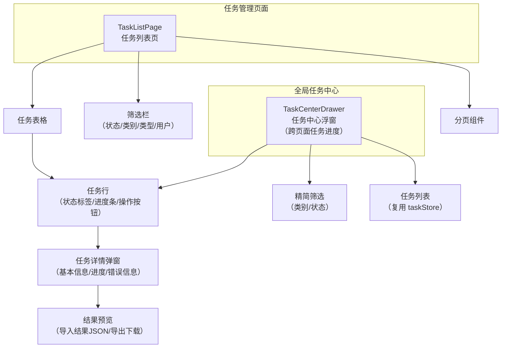

# 任务管理模块 - 前端实现设计

## 1. 文档概述

本文档描述任务管理模块的前端实现方案（dehaze-front-vue），聚焦组件架构、状态管理、路由设计与轮询策略等架构决策。任务模块为各业务模块（数据集导出、通用导入导出、图像处理等）提供统一的异步任务管理能力，前端覆盖任务列表、详情、结果下载与全局任务中心浮窗。

---

## 2. 组件树设计



### 组件职责划分

| 组件 | 职责 | 复用性 |
|------|------|--------|
| TaskListPage | 任务列表主页面，多维筛选、分页查询、操作入口 | 页面组件 |
| FilterBar | 任务四维联动筛选（状态/类别/类型/用户），用户筛选仅管理员可见 | 页面内部组件 |
| TaskDetailDrawer | 任务详情弹窗：基本信息、进度、错误信息、操作按钮（取消/下载） | 页面内部组件 |
| TaskCenterDrawer | 全局任务中心浮窗，跨页面展示任务进度，精简筛选，复用 taskStore | 全局组件 |
| TaskResultPreview | 结果预览：导入任务展示 JSON 结果、导出任务触发文件下载 | 弹窗内组件 |

> **设计决策**：任务管理为单一聚合页，无独立详情路由--任务详情经弹窗展示。TaskCenterDrawer 作为全局浮窗挂载于布局层，各业务模块创建任务后可弹出查看进度。普通用户与管理员共用同一入口，角色差异在页内按筛选器与字段渲染体现。

---

## 3. 状态管理

| Store | 核心状态 | 职责 |
|-------|---------|------|
| taskStore | taskList、total、loading、currentTask、pollingTimer、pollingFailCount | 任务列表分页数据、当前查看任务、轮询定时器管理（启动/停止/失败计数） |
| globalTaskStore | activeTaskCount、globalProgress、isVisible | 全局任务状态：进行中任务数量、全局进度摘要、任务中心浮窗显隐；跨页面响应任务创建与完成事件 |

- taskStore 封装任务列表查询（getTaskList）、取消（cancelTask）、下载校验（downloadResult）、轮询控制（startPolling/stopPolling）；TaskListPage 与 TaskCenterDrawer 共用同一 Store 实例
- 轮询机制：筛选 PENDING/PROCESSING 状态任务，每 3 秒批量查询状态更新；连续失败 5 次自动停止轮询并提示
- globalTaskStore 在布局层初始化，监听全局任务创建事件更新 activeTaskCount，任务中心浮窗图标徽标显示进行中任务数
- 查询参数（pageNum/pageSize/status/taskCategory/taskType/createdBy）在页面组件内局部管理

---

## 4. 路由设计

| 路由路径 | 组件 | 名称 | 加载方式 | 角色要求 |
|---------|------|------|---------|---------|
| `/task/list` | TaskListPage | TaskList | 动态菜单 | 登录用户 |

- 任务管理为单一聚合页，经动态菜单加载，普通用户与管理员共用同一入口
- 路由入口依据菜单权限控制可见性；角色差异在页内按筛选器与字段渲染体现
- 业务模块创建任务后通过编程式导航跳转至本页，自动启动状态轮询
- TaskCenterDrawer 不走路由，作为全局浮窗挂载于布局层，任意页面可弹出

---

## 5. 数据流

### 任务列表数据流

```
进入页面 -> 读取用户角色判断是否渲染用户筛选器
    ↓
按筛选参数请求任务列表（普通用户由后端按归属过滤，管理员默认全量）
    ↓
数据加载完成 -> 渲染列表
    ↓
检测 PENDING/PROCESSING 任务 -> 启动轮询
    ↓
轮询返回 -> 局部更新变化的任务 -> 全部终态后停止轮询
```

### 任务操作数据流

```
├─ 取消任务 -> 二次确认 -> 调用取消接口 -> 更新状态 -> 重新检测轮询
├─ 重试任务 -> 二次确认 -> 调用重试接口 -> 状态转 PENDING -> 纳入轮询
├─ 下载结果 -> 校验状态/过期 -> 302 重定向获取文件
└─ 查看详情 -> 弹窗展示 -> 导入任务显示 JSON 结果，导出任务提供下载
```

### 请求错误处理

| 错误类型 | 处理方式 |
|---------|---------|
| 任务不存在 | 从列表移除，提示任务已不存在 |
| 无权操作 | 提示无权限 |
| 结果已过期 | 提示结果已过期，禁用下载按钮 |
| 网络错误 | 显示网络连接失败提示 |
| 轮询连续失败 | 达 5 次后停止轮询，提示"任务状态更新失败，已停止自动刷新" |

### 模块间数据交互

| 交互方向 | 数据 | 说明 |
|---------|------|------|
| 业务模块 -> 任务管理 | taskId | 各业务模块（数据集导出/导入导出/图像处理）创建任务后跳转或通知任务管理页 |
| 任务管理 -> 业务模块 | 任务完成事件 | 任务完成回调通知业务模块恢复后续流程（远期规划） |
| globalTaskStore -> 布局层 | activeTaskCount | 进行中任务数量驱动导航栏徽标显示 |

### 任务创建集成

| 场景 | 交互行为 |
|------|---------|
| 创建成功 | 显示成功提示，提供"查看任务"链接跳转任务列表页 |
| 创建失败 | 显示失败原因 |
| 并发限制 | 提示"任务数量已达上限，请等待" |

---

## 6. 交互设计决策

| 决策点 | 实现方式 | 理由 |
|--------|---------|------|
| 任务状态轮询策略 | 固定 3 秒间隔批量查询进行中任务状态，连续失败 5 次自动停止；页面不可见时暂停轮询（visibilitychange） | 批量查询减少请求次数；失败熔断避免无限重试；页面不可见时暂停节省资源 |
| 任务中心浮窗 | 全局浮窗挂载于布局层，任意页面可弹出查看任务进度，复用 taskStore 数据 | 跨页面任务进度可见，用户无需跳转任务列表页即可查看 |
| 结果预览 | 导入任务结果为 JSON 对象，弹窗内展示；导出任务触发 302 重定向文件下载 | 导入/导出任务结果类型不同，前端按类型差异化展示 |
| 任务取消确认 | 弹出确认框"确认取消该任务吗？"，确认后调用取消接口 | 取消操作不可恢复，需二次确认 |
| 失败任务重试确认 | 弹出确认框"确认重试该任务吗？"，确认后状态由 FAILED 转 PENDING | 重试沿用原参数，需用户确认 |
| 角色差异化渲染 | 用户筛选器与创建人字段仅管理员可见；操作按钮统一渲染，权限由后端校验任务归属 | 前端不做角色级按钮显隐，数据隔离由后端保障 |
| 状态标签配色 | PENDING/PROCESSING 蓝色、COMPLETED 绿色、FAILED 红色、CANCELLED 灰色 | 按需求规格状态展示样式映射 |
| 进度条展示 | PROCESSING 状态展示进度条 + 百分比，COMPLETED 显示 100% 绿色，FAILED 显示红色 | 进度可视化，终态明确标识 |
| 筛选联动 | 任务类型选项随类别联动（选择"导出"时仅展示 export 类类型） | 减少无效筛选选项 |
| 离开页面清理 | 组件卸载时清除轮询定时器 | 避免内存泄漏与无效请求 |

---

## 7. 公共组件使用

| 公共组件 | 使用位置 | 配置要点 |
|---------|---------|---------|
| 分页表格 | 任务列表、任务中心浮窗 | 自定义列模板（状态标签/进度条/操作按钮），后端分页 |
| 筛选栏 | 任务列表页 | 四维联动筛选（状态/类别/类型/用户），用户筛选仅管理员可见 |
| 进度条 | 任务行/详情弹窗 | el-progress，按任务状态映射进度条 status（active/success/exception） |
| 状态标签 | 任务行/详情弹窗 | 按任务状态映射颜色（蓝/绿/红/灰） |
| 弹窗 | 任务详情 | el-dialog 展示任务信息与操作按钮 |
| 抽屉 | 任务中心浮窗 | el-drawer 挂载于布局层，全局可弹出 |
| 分页组件 | 任务列表/任务中心 | Pagination 组件，page/limit 双向绑定 |
