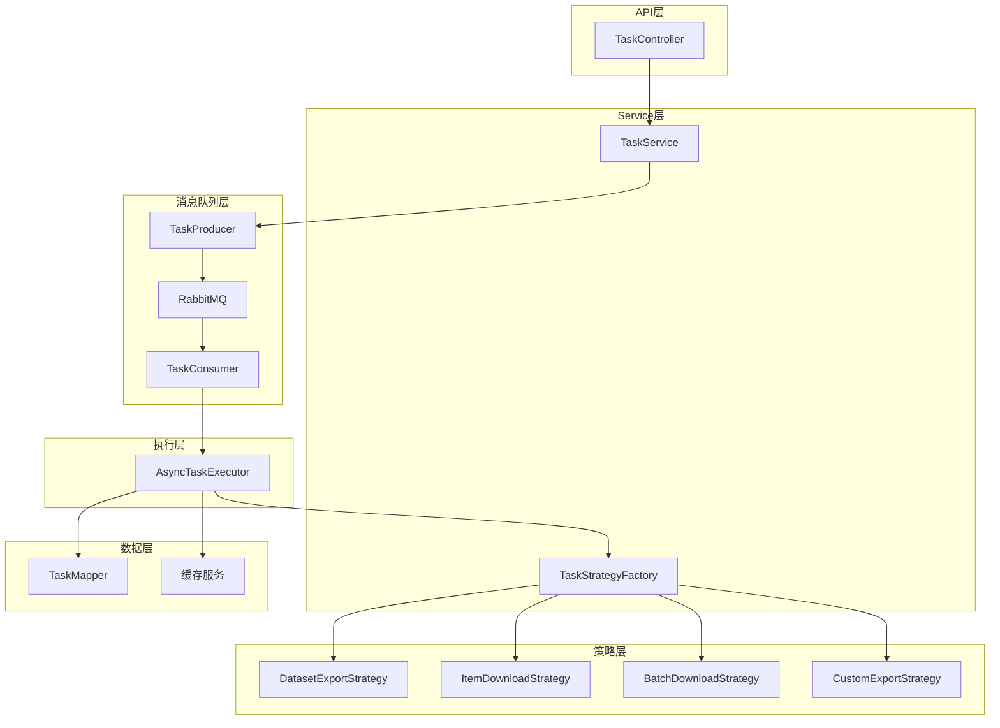
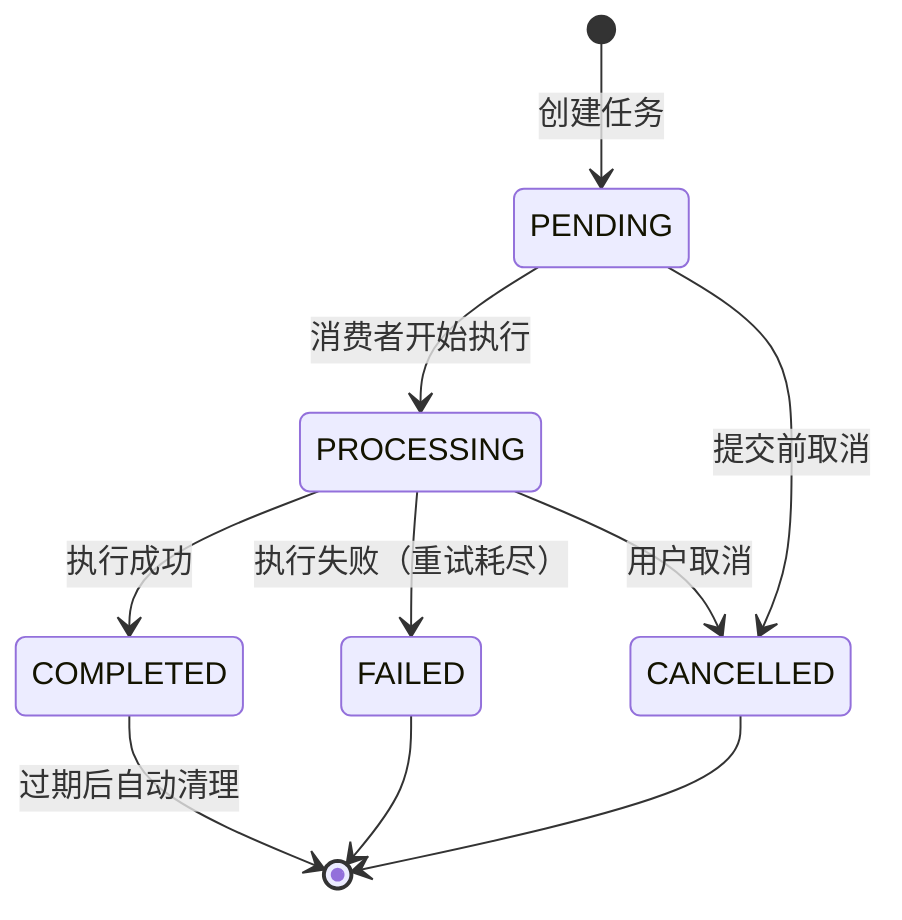
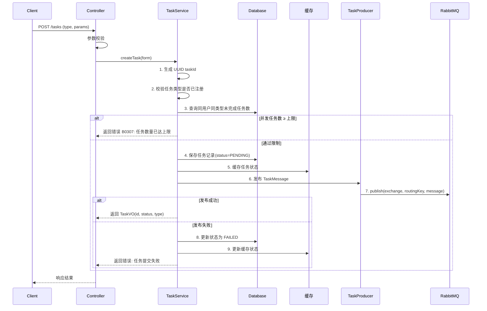
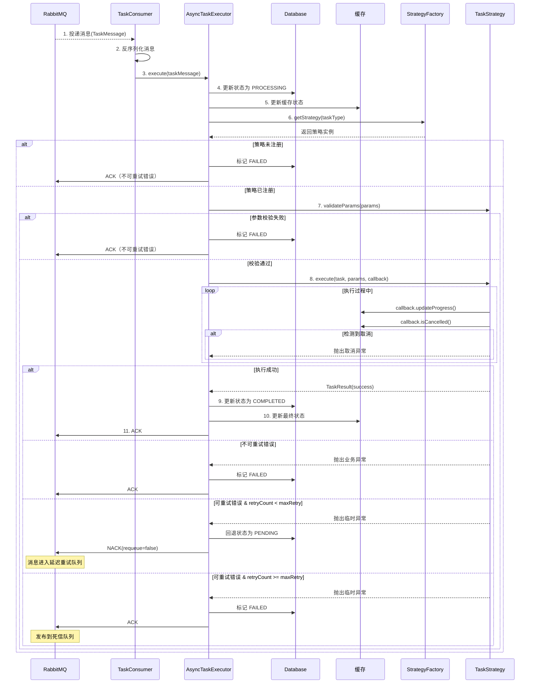
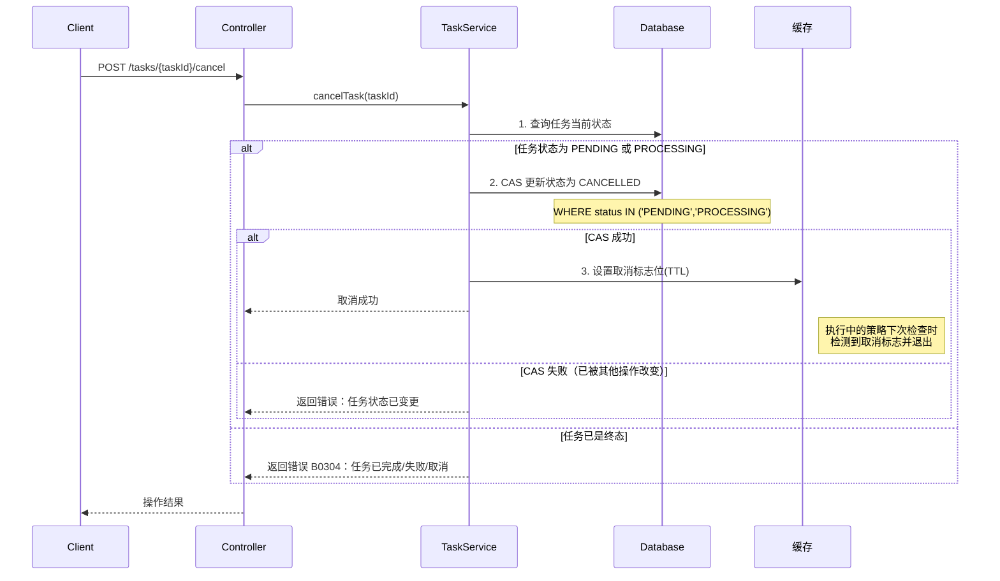
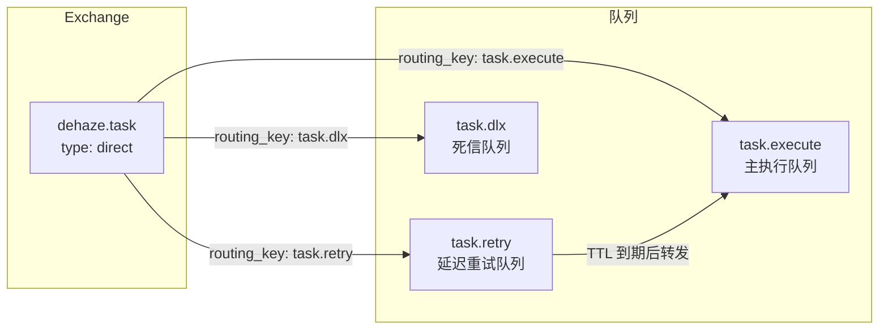
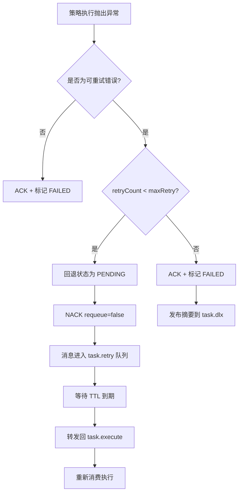
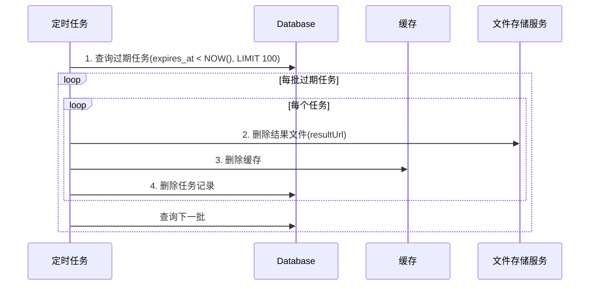

# 任务管理模块 - 后端实现设计

## 1. 文档概述

### 1.1 文档目的

本文档描述任务管理模块的后端实现方案，包括架构设计（策略模式 + 消息队列）、核心业务逻辑、外部服务集成、缓存设计、异步任务设计等。

### 1.2 相关文档

- **需求规格**：[需求规格.md](./需求规格.md)
- **API 接口**：[API接口.md](./API接口.md)
- **数据库设计**：[03-数据库设计.md](../../../02-系统架构/03-数据库设计.md)
- **测试用例**：[测试用例.md](./测试用例.md)
- **文件管理**：[文件管理/后端实现.md](../文件管理/后端实现.md)

## 2. 架构设计

### 2.1 模块分层架构

采用**策略模式 + 消息队列**实现任务执行的解耦。核心思想：

- **生产消费分离**：API 层只负责入队，执行逻辑由独立消费者驱动
- **策略模式**：不同任务类型实现统一接口，新增类型无需修改调度器



**设计考量**：
- **消息队列调度**：通过 RabbitMQ 实现任务异步调度，支持持久化、重试、削峰填谷
- **生产消费分离**：TaskService 发布消息，AsyncTaskExecutor 消费执行，独立伸缩
- **策略模式**：不同任务类型执行逻辑差异大（导出 ZIP、下载单文件、调用算法等），统一接口 + 多实现
- **工厂模式**：TaskStrategyFactory 启动时自动发现并注册策略，新增类型零改动

### 2.2 核心组件职责

| 组件 | 职责描述 | 关键能力 |
|------|---------|---------|
| TaskService | 任务管理入口 | 任务 CRUD、状态查询、取消任务、校验并发限制 |
| TaskProducer | 任务消息生产者 | 构建 TaskMessage、发布到 RabbitMQ、处理发布失败 |
| TaskConsumer | 任务消息消费者 | 监听队列、消息反序列化、分发到 AsyncTaskExecutor |
| AsyncTaskExecutor | 任务执行器 | 状态流转控制、策略调度、进度回调注入、异常处理 |
| TaskStrategyFactory | 策略工厂 | 自动注册策略、根据类型获取策略实例 |
| TaskStrategy | 策略接口 | 定义任务执行的统一契约 |
| ProgressCallback | 进度回调 | 更新进度、检测取消信号 |

### 2.3 核心接口契约

#### TaskStrategy 策略接口

| 方法 | 入参 | 出参 | 说明 |
|------|------|------|------|
| getTaskType | 无 | 任务类型字符串 | 返回任务类型标识，用于工厂注册 |
| execute | task, params, callback | TaskResult | 执行任务核心逻辑 |
| cancel | task | void | 取消任务，清理中间资源 |
| validateParams | params | void | 验证任务参数，失败抛异常 |

#### ProgressCallback 进度回调接口

| 方法 | 入参 | 出参 | 说明 |
|------|------|------|------|
| updateProgress | current, total, message | void | 更新任务进度（自动计算百分比） |
| isCancelled | 无 | boolean | 检查任务是否被用户取消 |

#### TaskResult 任务结果对象

| 字段 | 类型 | 说明 |
|------|------|------|
| success | boolean | 任务是否执行成功 |
| data | string | 结果数据（如下载 URL、导出文件路径） |
| errorMessage | string | 失败时的错误信息 |
| metadata | map | 附加元数据（如文件大小、处理数量） |

### 2.4 策略工厂机制

| 职责 | 实现方式 | 说明 |
|------|---------|------|
| 策略注册 | 启动时自动扫描 | 收集所有 TaskStrategy 实现，按 taskType 建立映射 |
| 策略获取 | 类型映射查找 | 根据任务类型返回策略实例，未找到则抛异常 |
| 类型查询 | 返回注册列表 | 提供所有已注册的任务类型，用于前端展示或校验 |

**扩展点**：新增任务类型只需实现 TaskStrategy 接口并注册到容器，工厂自动发现。

### 2.5 已实现的策略

| 策略名称 | 任务类型 | 功能描述 | 依赖服务 |
|---------|---------|---------|---------|
| DatasetExportStrategy | `dataset_export` | 数据集导出为 ZIP 压缩包 | 文件存储服务、数据集服务 |
| ItemDownloadStrategy | `item_download` | 单数据项下载 | 文件存储服务 |
| BatchDownloadStrategy | `batch_download` | 批量下载（多数据项打包） | 文件存储服务 |
| CustomExportStrategy | `custom_export` | 自定义格式导出 | 文件存储服务、算法服务 |

### 2.6 Consumer → Strategy 调用协议

消费者从队列获取消息后，需要正确路由到策略实例并传递参数：

```
TaskConsumer 收到消息
  → 反序列化为 TaskMessage
  → AsyncTaskExecutor.execute(taskMessage)
    → TaskStrategyFactory.getStrategy(taskMessage.taskType)
    → strategy.validateParams(taskMessage.params)
    → strategy.execute(task, params, progressCallback)
```

**关键约定**：
- `TaskMessage.params` 为 JSON 对象，由各策略自行解析为强类型参数
- 策略通过 `getTaskType()` 返回唯一标识，工厂启动时构建 `map[string]TaskStrategy`
- 未注册的 taskType 立即标记 FAILED，不进行重试

## 3. 内部领域对象

> API 层 DTO（Query/Form/VO）定义详见 [API接口.md](./API接口.md)

### 3.1 TaskMessage（消息体）

RabbitMQ 消息载体，生产者构建、消费者解析：

| 字段 | 类型 | 说明 |
|------|------|------|
| taskId | string | 任务 UUID |
| taskType | string | 任务类型标识，用于路由到对应策略 |
| userId | long | 任务创建用户 ID |
| params | object | 任务参数（JSON），由策略自行解析 |
| retryCount | int | 当前重试次数，初始为 0 |
| maxRetry | int | 最大重试次数，由配置决定 |
| createdAt | timestamp | 消息创建时间 |

### 3.2 TaskContext（执行上下文）

AsyncTaskExecutor 构建，传递给策略执行时的运行时上下文：

| 字段 | 类型 | 说明 |
|------|------|------|
| task | TaskEntity | 数据库任务实体 |
| params | object | 解析后的任务参数 |
| callback | ProgressCallback | 进度回调实例 |
| cancelFlag | func() bool | 取消检测函数，读取缓存标志位 |

## 4. 核心业务逻辑

### 4.1 状态流转



#### 状态定义

| 状态 | 存储值 | 说明 | 可流转到 |
|------|--------|------|---------|
| 待执行 | `PENDING` | 任务已创建，等待消息队列消费 | `PROCESSING`、`CANCELLED` |
| 执行中 | `PROCESSING` | 消费者已取出消息，正在执行策略 | `COMPLETED`、`FAILED`、`CANCELLED` |
| 已完成 | `COMPLETED` | 任务执行成功，结果可下载 | - (终态) |
| 已失败 | `FAILED` | 重试耗尽后最终失败，记录错误信息 | - (终态) |
| 已取消 | `CANCELLED` | 任务被用户主动取消 | - (终态) |

#### 状态转换规则

| 转换 | 触发条件 | 前置检查 |
|------|---------|---------|
| PENDING → PROCESSING | 消费者从队列取出消息并开始执行 | 无 |
| PROCESSING → COMPLETED | 策略执行成功返回 | 无 |
| PROCESSING → FAILED | 策略异常且重试次数已达上限 | retryCount ≥ maxRetry |
| PROCESSING → CANCELLED | 策略执行期间检测到取消标志位 | 无 |
| PENDING → CANCELLED | 用户取消尚未被消费的任务 | 任务仍在队列中 |

**重试与状态的关系**：重试对状态机透明。任务在 PROCESSING 期间如果发生可重试错误，消息 NACK 后重新投递，消费者重新消费时任务仍处于 PROCESSING 状态。只有重试耗尽后才流转到 FAILED。

### 4.2 关键流程

#### 任务创建流程



**关键决策点**：
1. **UUID 作为任务 ID**：避免自增 ID 可猜测性，提升安全性
2. **并发限制前置**：在写入 DB 前校验，避免创建后又无法执行
3. **发布失败回退**：MQ 发布失败立即标记 FAILED，不让任务停留在 PENDING 无人消费
4. **创建即提交**：简化用户操作，创建后立即入队异步执行

#### 任务执行流程



**关键决策点**：
1. **ACK 在任务完成后**：无论成功或失败，只有在确定最终处理结果后才 ACK/NACK。崩溃时消息未 ACK，RabbitMQ 自动重投
2. **重试对状态机透明**：可重试错误时回退状态为 PENDING，NACK 让消息重新入队。从外部看不到"重试中"状态
3. **三类错误分流**：不可重试（ACK + FAILED）、可重试且未耗尽（NACK + 重投）、可重试但已耗尽（ACK + FAILED + 死信）
4. **进度轮询检测取消**：每次更新进度时检查取消标志

#### 任务取消流程



**取消检测机制**：

| 阶段 | 检测方式 | 处理行为 |
|------|---------|---------|
| 队列等待中 | DB 状态 CAS | 直接更新为 CANCELLED，消费者取出后检查状态跳过执行 |
| 执行过程中 | 缓存标志位 | 策略通过 callback.isCancelled() 定期检查，检测到后抛出取消异常 |
| 已完成/失败 | 状态判断 | 拒绝取消，返回错误提示 |

### 4.3 核心业务规则

| 规则 | 校验条件 | 触发时机 | 错误码 |
|------|---------|---------|--------|
| 任务类型校验 | type 在已注册策略列表中 | 创建任务时 | B0303 |
| 目标资源存在性 | targetId 对应资源存在 | 策略执行前 | - |
| 数据集非空校验 | 数据集包含至少一个数据项 | 导出策略执行前 | - |
| 取消状态校验 | 当前状态为 PENDING 或 PROCESSING | 取消任务时 | B0304 |
| 并发任务限制 | 同用户同类型未完成任务数 ≤ 配置上限 | 创建任务时 | B0307 |
| 任务归属校验 | 操作者为任务创建者 | 查询/取消/下载时 | B0302 |

### 4.4 事务边界

| 操作 | 事务级别 | 事务范围 | 说明 |
|------|---------|---------|------|
| 创建任务 | REQUIRED | 并发限制查询 + 任务记录写入 | 写入后立即提交，MQ 发布在事务外 |
| 更新状态 | REQUIRED | 单表 CAS 更新 | 状态变更立即可见 |
| 批量清理 | REQUIRES_NEW | 独立事务 | 清理失败不影响其他业务 |

**设计考量**：
- MQ 发布在事务提交后执行。若发布失败，补偿标记为 FAILED
- 状态更新使用 CAS（`WHERE status = ?`），避免并发覆盖
- 定时清理使用独立事务，分批提交

### 4.5 幂等性与并发控制

| 场景 | 问题 | 解决方案 |
|------|------|---------|
| 消息重复投递 | 任务重复执行 | 消费者检查状态：非 PENDING 则跳过（已在执行或已完成） |
| 并发取消同一任务 | 状态混乱 | DB CAS 更新 `WHERE status IN (PENDING, PROCESSING)` |
| 重复创建相同任务 | 资源浪费 | 检查近期同参数任务，提示复用 |
| 消费者崩溃重启 | 消息丢失 | 消息未 ACK 自动重投，消费者幂等处理 |

## 5. 数据访问与数据依赖

> 表结构定义详见 [数据库设计.md](../../../02-系统架构/03-数据库设计.md)

### 5.1 依赖表清单

| 表名 | 关联方式 | 说明 |
|------|---------|------|
| sys_task | 主表 | 任务记录表 |
| sys_dataset | 外键关联 | 数据集导出时查询数据集信息 |
| sys_dataset_item | 外键关联 | 导出时遍历数据集下的数据项 |
| sys_item_file | 外键关联 | 获取数据项关联的文件 |

### 5.2 关键字段约束

| 字段 | 约束 | 业务含义 |
|------|------|---------|
| task_id | UNIQUE | UUID 格式，对外暴露的任务标识 |
| status | ENUM(5) | 仅允许状态机定义的 5 种状态 |
| expires_at | NOT NULL | 任务过期时间，默认创建时间 + 配置时长 |
| user_id | NOT NULL | 任务所属用户，用于权限控制和数据隔离 |

### 5.3 核心查询方法

| 查询方法 | 查询条件 | 索引依赖 | 说明 |
|---------|---------|---------|------|
| 根据 taskId 查询 | task_id = ? | task_id 唯一索引 | 获取任务详情 |
| 用户任务列表 | user_id = ? AND status IN (...) | user_id + status 联合索引 | 我的任务列表 |
| 并发限制统计 | user_id = ? AND type = ? AND status IN (PENDING, PROCESSING) | user_id + type + status | 创建时校验 |
| 过期任务查询 | expires_at < NOW() | expires_at 索引 | 定时清理使用 |
| 待恢复任务 | status = 'PENDING' | status 索引 | 服务重启后恢复 |

### 5.4 查询优化要点

| 场景 | 优化措施 |
|------|---------|
| 任务列表分页 | 联合索引 (user_id, status, created_at DESC) |
| 过期清理 | 分批查询删除，每批 100 条 |
| 进度查询 | 优先走缓存，缓存未命中再查库 |

## 6. 外部服务集成

任务策略执行时依赖多个外部服务，需要明确调用协议和降级策略。

### 6.1 服务依赖清单

| 依赖服务 | 依赖方 | 调用方式 | 说明 |
|---------|--------|---------|------|
| 文件存储服务 | 所有策略 | 内部接口调用 | 上传导出结果、读取源文件 |
| 数据集服务 | DatasetExportStrategy | 内部接口调用 | 查询数据集及数据项 |
| 算法服务 | CustomExportStrategy | HTTP/gRPC | 调用去雾算法处理图片 |

### 6.2 文件存储服务集成

任务结果文件通过文件管理模块的存储服务接口写入，路径规则参见 [文件管理/后端实现.md](../文件管理/后端实现.md)。

| 调用场景 | 使用的接口 | 超时 | 重试 |
|---------|-----------|------|------|
| 上传导出 ZIP | StorageService.upload | 60s | 1 次 |
| 读取源文件流 | StorageService.download | 30s | 1 次 |
| 检查文件存在 | StorageService.exists | 5s | 0 次 |
| 删除过期结果 | StorageService.delete | 10s | 0 次 |

**任务结果存储路径**：`exports/{taskId}.{ext}`（如 `exports/550e8400-xxxx.zip`）

### 6.3 降级策略

| 场景 | 检测方式 | 降级行为 | 对任务的影响 |
|------|---------|---------|-------------|
| 文件存储不可用 | 连接/上传超时 | 标记为可重试错误，触发延迟重试 | 任务延迟完成 |
| 数据集服务查询失败 | 查询异常 | 标记为可重试错误，触发延迟重试 | 任务延迟完成 |
| 算法服务不可用 | 调用超时/错误 | 标记为可重试错误，触发延迟重试 | 任务延迟完成 |
| 源文件不存在 | 404 响应 | 标记为不可重试错误，直接 FAILED | 任务永久失败 |
| 数据集不存在 | 记录不存在 | 标记为不可重试错误，直接 FAILED | 任务永久失败 |

## 7. 缓存设计

### 7.1 缓存 Key 规范

| 缓存对象 | Key 格式 | TTL | 用途 |
|---------|---------|------|------|
| 任务状态 | `task:cache:{taskId}` | 与任务过期时间对齐 | 存储任务完整状态，支持高频查询 |
| 取消标志 | `task:cancel:{taskId}` | 1 小时 | 标记任务被取消，执行中策略检测 |
| 进度信息 | `task:progress:{taskId}` | 1 小时 | 存储实时进度，前端轮询读取 |

**设计考量**：
- 任务参数不单独缓存，通过 TaskMessage 在 MQ 中传递，消费者直接使用
- 任务状态缓存 TTL 与数据库 `expires_at` 对齐，避免缓存比数据存活更久
- 取消标志 TTL 1 小时，覆盖绝大多数任务的执行时长

### 7.2 缓存更新规则

| 操作 | 缓存行为 |
|------|---------|
| 创建任务 | 写入 `task:cache:{taskId}` |
| 更新状态 | 覆盖 `task:cache:{taskId}` |
| 更新进度 | 覆盖 `task:progress:{taskId}` |
| 取消任务 | 写入 `task:cancel:{taskId}` |
| 任务过期清理 | 删除 `task:cache:{taskId}`、`task:progress:{taskId}` |

### 7.3 缓存一致性策略

| 场景 | 问题 | 解决方案 |
|------|------|---------|
| DB 更新后缓存未同步 | 查询到旧状态 | Write-Through，更新 DB 后立即更新缓存 |
| MQ 发布失败补偿 | 缓存仍为 PENDING | 补偿逻辑中同步更新缓存为 FAILED |
| 缓存雪崩 | 大量缓存同时失效 | TTL 随机化（±10%） |
| 缓存穿透 | 查询不存在的任务 | 空值缓存 5 分钟 |

**状态查询流程**：
```
查询缓存 task:cache:{taskId}
├─ 命中 → 直接返回
└─ 未命中 → 查询数据库
           ├─ 存在 → 写入缓存，返回
           └─ 不存在 → 写入空值缓存(5min)，返回 404
```

## 8. 安全设计

> 权限标识详见 [API接口.md](./API接口.md)

### 8.1 数据权限

| 操作 | 权限规则 |
|------|---------|
| 查看任务 | 仅能查看自己创建的任务 |
| 取消任务 | 仅能取消自己创建的任务 |
| 下载结果 | 仅能下载自己任务的结果 |
| 管理员 | 可查看/操作所有任务 |

### 8.2 安全防护

| 防护项 | 威胁 | 实现方式 |
|--------|------|---------|
| taskId 不可猜测 | 任务遍历 | 使用 UUID，非自增 ID |
| 结果文件访问控制 | 越权下载 | 下载前校验任务归属 |
| 任务参数校验 | 恶意参数注入 | 策略内部严格校验 |
| 并发任务限制 | 资源耗尽 | 同用户同类型任务数限制 |

## 9. 异步任务设计

### 9.1 消息队列拓扑



| 组件 | 名称 | 类型 | 说明 |
|------|------|------|------|
| Exchange | `dehaze.task` | direct | 任务专用交换机，按 routing key 分发 |
| 主队列 | `task.execute` | classic | 任务执行主队列，持久化 + 手动 ACK |
| 重试队列 | `task.retry` | classic + TTL | 延迟重试，消息 TTL 到期后转发到主队列 |
| 死信队列 | `task.dlx` | classic | 记录重试耗尽的失败任务，便于人工介入 |

**队列属性**：
- 所有队列均开启持久化（durable=true）
- 主队列绑定 routing key `task.execute`
- 重试队列绑定 routing key `task.retry`，配置 dead-letter-exchange 指回 `dehaze.task`，dead-letter-routing-key 为 `task.execute`
- 死信队列绑定 routing key `task.dlx`

### 9.2 消费者架构

#### 消费者生命周期

| 阶段 | 行为 | 说明 |
|------|------|------|
| 启动 | 声明 Exchange + 队列 + 绑定关系 | 确保基础设施存在（幂等操作） |
| 运行 | 从 `task.execute` 拉取消息，分发到 AsyncTaskExecutor | prefetch 限制并发 |
| 关闭 | 停止接收新消息，等待正在执行的任务完成 | graceful shutdown |

#### Graceful Shutdown

```
收到关闭信号 (SIGTERM)
  → 停止从队列拉取新消息
  → 等待所有正在执行的策略完成（或超时）
  → 超时时间 = 配置的 shutdown.timeout（默认 60s）
  → 未完成的任务消息未 ACK，RabbitMQ 自动重投
  → 关闭连接
```

#### 消费者配置

| 参数 | 默认值 | 说明 |
|------|--------|------|
| prefetch | 2 | 每次预取消息数，控制单节点并发任务数 |
| concurrency | 2 | 并发消费协程/线程数 |
| ackMode | manual | 手动 ACK，确保处理完成后再确认 |
| shutdown.timeout | 60s | 优雅关闭等待时间 |

### 9.3 进度回调机制

| 职责 | 说明 |
|------|------|
| 进度计算 | 根据 current/total 计算百分比 |
| 频率控制 | 每 5 秒或进度变化 >5% 时才实际写入缓存 |
| 取消检测 | 每次 updateProgress 调用时检查取消标志位 |
| 消息记录 | 可选的进度消息（如"正在处理第 3/10 个文件"） |

**频率控制的必要性**：前端轮询间隔通常为 2-5 秒，更新过频无意义，且增加缓存写入压力。

### 9.4 失败重试机制



**重试延迟策略**（通过消息 TTL 实现）：

| 重试次数 | 延迟时间 | 说明 |
|---------|---------|------|
| 1 | 5s | 第一次快速重试 |
| 2 | 30s | 短暂等待后重试 |
| 3 | 5min | 较长等待后重试 |
| >3 | 不重试 | 进入死信队列，人工介入 |

**可重试/不可重试错误分类**：

| 错误类型 | 是否重试 | 说明 |
|---------|---------|------|
| 网络超时 | ✅ 是 | 临时性问题 |
| 外部服务不可用 | ✅ 是 | 临时性问题 |
| 文件存储写入失败 | ✅ 是 | 可能是临时性问题 |
| 资源不存在 | ❌ 否 | 业务错误，重试无意义 |
| 参数校验失败 | ❌ 否 | 业务错误 |
| 策略未注册 | ❌ 否 | 配置错误 |

### 9.5 定时任务

| 任务 | Cron 表达式 | 说明 |
|------|------------|------|
| 过期任务清理 | `0 0 3 * * ?` | 每天凌晨 3 点，清理过期任务记录和结果文件 |
| 僵尸任务修复 | `0 */30 * * * ?` | 每 30 分钟，检查长时间 PROCESSING 的任务 |

#### 过期清理流程



**清理策略**：
- 分批处理，每批 100 条，避免长时间锁表
- 先删文件后删记录，文件删除失败不阻塞（孤儿文件可后续清理）

#### 僵尸任务修复

检测条件：`status = 'PROCESSING' AND updated_at < NOW() - INTERVAL 30 MINUTE`

处理方式：标记为 FAILED，记录 errorMessage = "任务执行超时，已被系统回收"

### 9.6 服务重启恢复

| 场景 | 恢复机制 | 说明 |
|------|---------|------|
| PENDING 状态任务 | 消息仍在队列中未 ACK，RabbitMQ 重投 | 自动恢复 |
| PROCESSING 状态任务 | 消息未 ACK（因 ACK 在执行完成后），RabbitMQ 重投 | 自动恢复，消费者幂等处理 |
| MQ 自身重启 | 队列和消息均持久化 | 自动恢复 |
| 极端情况 | 僵尸任务定时修复兜底 | 30 分钟内恢复 |

## 10. 性能目标

### 10.1 性能指标

| 接口 | 目标 P99 | 约束条件 | 说明 |
|------|---------|---------|------|
| 创建任务 | < 200ms | - | 仅写入记录 + 发布消息 |
| 查询任务状态 | < 50ms | 走缓存 | 支持高频轮询 |
| 取消任务 | < 200ms | - | CAS 更新 + 缓存写入 |
| 任务列表 | < 500ms | 分页 ≤20 条 | 分页查询 |

### 10.2 优化措施

| 优化项 | 实现方式 | 收益 |
|--------|---------|------|
| 状态缓存 | Redis 缓存任务状态 | 查询 QPS 提升 10x |
| 进度频率控制 | 每 5s 更新一次 | 减少缓存写入 |
| 分批清理 | 定时任务分批处理 | 避免长事务 |
| MQ 异步 | RabbitMQ 消息队列 | 创建接口快速返回、削峰填谷 |
| 消息持久化 | durable + persistent | 服务重启不丢任务 |
| prefetch 限流 | 消费者预取限制 | 防止单节点过载 |

## 11. 配置项

| 配置项 | 说明 | 默认值 | 是否必填 |
|--------|------|--------|---------|
| `task.expire.hours` | 任务结果过期时间（小时） | 24 | 否 |
| `task.cache.prefix` | 任务缓存 Key 前缀 | `task:cache:` | 否 |
| `task.cancel.prefix` | 取消标志 Key 前缀 | `task:cancel:` | 否 |
| `task.progress.prefix` | 进度缓存 Key 前缀 | `task:progress:` | 否 |
| `task.max.concurrent.per.user` | 单用户单类型最大并发任务数 | 5 | 否 |
| `task.progress.update.interval` | 进度更新最小间隔（毫秒） | 5000 | 否 |
| `task.cleanup.cron` | 过期清理 Cron 表达式 | `0 0 3 * * ?` | 否 |
| `task.zombie.cron` | 僵尸任务修复 Cron 表达式 | `0 */30 * * * ?` | 否 |
| `task.zombie.timeout.minutes` | 僵尸任务判定阈值（分钟） | 30 | 否 |
| **RabbitMQ 相关** | | | |
| `task.rabbitmq.exchange` | 任务交换机名称 | `dehaze.task` | 否 |
| `task.rabbitmq.queue.execute` | 任务执行队列名称 | `task.execute` | 否 |
| `task.rabbitmq.queue.retry` | 延迟重试队列名称 | `task.retry` | 否 |
| `task.rabbitmq.queue.dlx` | 死信队列名称 | `task.dlx` | 否 |
| `task.rabbitmq.prefetch` | 消费者预取消息数 | 2 | 否 |
| `task.rabbitmq.concurrency` | 并发消费者数量 | 2 | 否 |
| `task.rabbitmq.max-retry` | 最大重试次数 | 3 | 否 |
| `task.rabbitmq.shutdown.timeout` | 优雅关闭等待时间（秒） | 60 | 否 |
