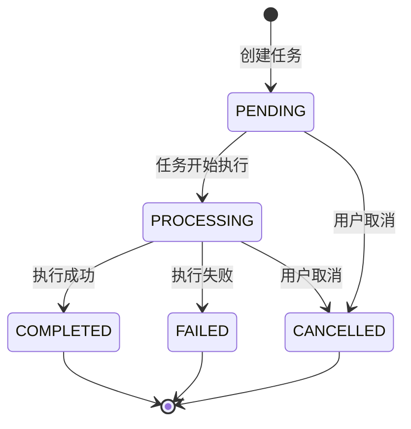

# 任务管理模块需求规格

## 1. 模块概述

### 1.1 模块定位

任务管理模块是图像去雾系统的基础能力模块，提供统一的异步任务管理能力。该模块不直接处理业务逻辑，而是为各业务模块（数据集导出、通用导入导出等）提供任务创建、状态追踪、进度更新和结果下载的通用接口。

### 1.2 核心价值

| 价值维度 | 具体内容 |
|---------|---------|
| **异步解耦** | 将耗时操作（如文件打包、数据导出）异步化，提升用户体验和系统响应速度 |
| **统一管控** | 提供统一的任务生命周期管理，避免各业务模块重复造轮子 |
| **进度透明** | 实时跟踪任务进度，用户可随时查看任务执行状态 |
| **结果分发** | 集中管理任务结果文件，提供统一的下载入口 |
| **资源管理** | 支持任务取消和结果文件过期清理，避免资源浪费 |

### 1.3 业务目标

#### 功能目标
- 提供统一的任务创建接口，支持多种任务类型
- 实现任务全生命周期管理（创建→执行→完成/失败/取消）
- 提供任务状态查询和进度跟踪能力
- 支持任务取消功能，避免资源浪费
- 提供任务结果文件下载能力，支持文件过期管理

#### 性能目标
| 指标 | 目标值 | 说明 |
|------|--------|------|
| **任务创建响应** | &lt;1s | 提交任务到接收响应的时间 |
| **状态查询响应** | &lt;500ms | 查询任务状态的响应时间 |
| **列表查询响应** | &lt;500ms | 任务列表分页查询响应时间 |
| **任务并发数** | ≥100 | 系统支持的同时执行任务数 |
| **结果保留时长** | 24小时（可配置） | 任务结果文件的保留时长 |

## 2. 用户角色分析

### 2.1 主要用户角色

| 角色 | 描述 | 主要职责 |
|------|------|---------|
| **系统用户** | 系统的所有注册用户 | 创建任务、查询状态、取消任务、下载结果 |
| **业务模块** | 数据集导出、通用导入导出等业务模块 | 调用任务管理接口创建任务、更新进度 |

### 2.2 权限矩阵

| 功能点 | 系统用户 | 业务模块 |
|--------|---------|---------|
| 创建任务 | ✅ | ✅（通过接口） |
| 查询任务状态 | ✅（仅限自己创建的） | ✅ |
| 取消任务 | ✅（仅限自己创建的） | ✅ |
| 下载任务结果 | ✅（仅限自己创建的） | ✅ |
| 查看任务列表 | ✅（仅限自己创建的） | ✅ |

## 3. 功能需求

### 3.1 任务创建 (F-TM-001)

#### 3.1.1 功能描述

为各业务模块提供统一的任务创建接口，支持多种任务类型的异步执行。

#### 3.1.2 支持的任务类型

| 任务类型标识 | 任务类别 | 任务类型名称 | 说明 | 典型场景 |
|-------------|---------|-------------|------|---------|
| dataset_export | export | 数据集导出 | 导出数据集为 ZIP 打包 | 用户导出数据集到本地 |
| user_export | export | 用户导出 | 导出用户数据为 Excel/CSV | 管理员导出用户列表 |
| role_export | export | 角色导出 | 导出角色数据 | 管理员导出角色列表 |
| dept_export | export | 部门导出 | 导出部门数据（扁平结构） | 管理员导出部门列表 |
| menu_export | export | 菜单导出 | 导出菜单数据（扁平结构） | 管理员导出菜单列表 |
| dict_export | export | 字典导出 | 导出字典类型与数据 | 管理员导出字典数据 |
| algorithm_export | export | 算法导出 | 导出算法元数据（Excel/CSV） | 管理员导出算法配置 |
| user_import | import | 用户导入 | 导入用户数据（Excel/CSV） | 管理员批量导入用户 |
| role_import | import | 角色导入 | 导入角色数据 | 管理员批量导入角色 |
| dept_import | import | 部门导入 | 导入部门数据 | 管理员批量导入部门 |
| menu_import | import | 菜单导入 | 导入菜单数据 | 管理员批量导入菜单 |
| dict_import | import | 字典导入 | 导入字典数据 | 管理员批量导入字典 |
| algorithm_import | import | 算法导入 | 导入算法元数据 | 管理员批量导入算法配置 |

> **说明**：所有导入导出任务由通用导入导出框架创建，复用 sys_task 表，通过 `task_type` 区分模块和操作。任务类别（import/export）用于列表分类筛选。

#### 3.1.3 任务创建参数

| 参数 | 类型 | 必填 | 说明 |
|------|------|------|------|
| type | String | ✅ | 任务类型，枚举值见上表 |
| targetId | Long | 否 | 目标资源ID（导出单个资源时使用） |
| targetIds | List&lt;Long&gt; | 否 | 目标资源ID列表（批量导出时使用） |
| options | Object | 否 | 导出选项配置（文件组织方式、包含类型等） |

#### 3.1.4 业务规则

1. **任务ID生成**：系统自动生成唯一任务ID（UUID）
2. **初始状态**：任务创建后初始状态为 `PENDING`
3. **用户关联**：任务与当前登录用户自动关联
4. **参数校验**：根据任务类型校验参数有效性
5. **创建权限**：已登录用户均可创建任务

### 3.2 任务状态查询 (F-TM-002)

#### 3.2.1 功能描述

用户可实时查询任务的执行状态和进度信息。

#### 3.2.2 任务状态说明

| 状态值 | 状态名称 | 说明 | 可转至 |
|--------|---------|------|--------|
| PENDING | 待执行 | 任务已创建，等待执行 | PROCESSING, CANCELLED |
| PROCESSING | 执行中 | 任务正在执行 | COMPLETED, FAILED, CANCELLED |
| COMPLETED | 已完成 | 任务执行成功 | - |
| FAILED | 失败 | 任务执行失败 | - |
| CANCELLED | 已取消 | 任务已被取消 | - |

#### 3.2.3 返回信息字段

| 字段 | 类型 | 说明 |
|------|------|------|
| taskId | String | 任务ID |
| status | String | 当前状态（PENDING/PROCESSING/COMPLETED/FAILED/CANCELLED） |
| progress | Integer | 进度百分比（0-100） |
| totalFiles | Integer | 总文件数（可选） |
| processedFiles | Integer | 已处理文件数（可选） |
| downloadUrl | String | 任务结果下载链接（完成时） |
| error | String | 错误信息（失败时） |
| createdAt | DateTime | 创建时间 |
| startedAt | DateTime | 开始执行时间 |
| completedAt | DateTime | 完成时间 |
| expiresAt | DateTime | 结果文件过期时间 |

#### 3.2.4 业务规则

1. **数据隔离**：用户只能查询自己创建的任务
2. **实时更新**：进度信息实时更新，前端可轮询查询
3. **结果保留**：`COMPLETED` 状态的任务结果文件保留 24 小时（可配置）

### 3.3 任务结果下载 (F-TM-003)

#### 3.3.1 功能描述

提供已完成任务结果文件的下载能力。

#### 3.3.2 下载条件

| 条件 | 说明 |
|------|------|
| **任务状态** | 必须为 `COMPLETED` |
| **结果存在** | 任务必须有有效的结果文件 |
| **未过期** | 结果文件未超过保留时长 |
| **权限校验** | 下载者必须是任务创建者 |

#### 3.3.3 下载方式

- 通过任务ID触发下载
- 系统返回重定向到文件存储URL（如OSS）
- 支持ZIP等压缩格式打包下载

#### 3.3.4 业务规则

1. **状态检查**：仅 `COMPLETED` 状态的任务可下载
2. **文件验证**：下载前验证结果文件是否存在
3. **过期检查**：超过保留时长的任务不可下载
4. **权限校验**：仅任务创建者可下载
5. **下载统计**：记录下载次数（可选）

### 3.4 任务取消 (F-TM-004)

#### 3.4.1 功能描述

用户可取消未完成的任务，释放系统资源。

#### 3.4.2 可取消的状态

| 当前状态 | 是否可取消 | 说明 |
|---------|-----------|------|
| PENDING | ✅ | 待执行任务可取消 |
| PROCESSING | ✅ | 执行中任务可中断取消 |
| COMPLETED | ❌ | 已完成任务不可取消 |
| FAILED | ❌ | 失败任务不可取消 |
| CANCELLED | ❌ | 已取消任务不可重复取消 |

#### 3.4.3 取消后处理

| 操作项 | 说明 |
|--------|------|
| **状态更新** | 任务状态更新为 `CANCELLED` |
| **资源释放** | 释放相关系统资源（如临时文件） |
| **结果清理** | 清理已生成的中间结果 |
| **时间记录** | 记录取消时间 |

#### 3.4.4 业务规则

1. **权限限制**：仅任务创建者可取消
2. **状态校验**：仅 `PENDING` 和 `PROCESSING` 状态可取消
3. **即时生效**：取消操作立即生效
4. **不可恢复**：取消后不可恢复

### 3.5 任务列表查询 (F-TM-005)

#### 3.5.1 功能描述

提供分页查询当前用户任务列表的能力，支持按状态筛选。

#### 3.5.2 列表展示字段

| 字段 | 显示名称 | 说明 |
|------|---------|------|
| taskId | 任务ID | 任务唯一标识 |
| status | 状态 | 任务状态（PENDING/PROCESSING/COMPLETED/FAILED/CANCELLED） |
| progress | 进度 | 进度百分比/进度条 |
| createdAt | 创建时间 | 任务创建时间 |
| completedAt | 完成时间 | 完成时间（若已完成） |
| - | 操作 | 查看详情/取消/下载 |

#### 3.5.3 查询参数与分页配置

| 配置项 | 默认值 | 可选值 |
|--------|--------|--------|
| 每页条数 | 10 | 10/20/50/100 |
| 排序方式 | 创建时间倒序 | 创建时间/完成时间 |
| status筛选 | 全部 | PENDING/PROCESSING/COMPLETED/FAILED/CANCELLED |
| taskCategory筛选 | 全部 | import（导入）/ export（导出） |
| taskType筛选 | 全部 | 支持按任务类型筛选（逗号分隔多个，如 `user_export,user_import`） |

#### 3.5.4 业务规则

1. **数据隔离**：仅显示当前用户创建的任务
2. **默认排序**：按创建时间倒序排列
3. **历史保留**：建议保留最近 N 天的任务记录（如30天）

## 4. 状态流转规则

### 4.1 状态流转图

### 4.2 状态变更规则

| 源状态 | 目标状态 | 触发条件 | 更新字段 |
|--------|---------|---------|---------|
| - | PENDING | 任务创建成功 | createdAt |
| PENDING | PROCESSING | 任务开始执行 | startedAt |
| PROCESSING | COMPLETED | 执行成功 | progress=100, completedAt, expiresAt, result |
| PROCESSING | FAILED | 执行异常 | errorMessage, completedAt |
| PENDING/PROCESSING | CANCELLED | 用户取消 | completedAt |
| - | FAILED | 参数校验失败 | errorMessage |

### 4.3 进度更新规则

| 阶段 | 进度范围 | 说明 |
|------|---------|------|
| 任务创建 | 0 | 初始进度 |
| 开始执行 | 1 | 执行开始 |
| 执行中 | 1-99 | 根据处理文件数计算 |
| 执行完成 | 100 | 完成时更新 |

## 5. 界面交互规范

### 5.1 通用交互

> 通用 UI 交互规范参见 [01-产品设计/02-UI-UX设计规范.md](../../../01-产品设计/02-UI-UX设计规范.md)

### 5.2 本模块特有交互

| 场景 | 行为 |
|------|------|
| 创建任务成功 | 显示任务ID提示，并提供"查看任务"跳转按钮 |
| 查询任务状态 | 前端可每 2-5 秒轮询一次（直至完成/失败/取消） |
| 任务取消 | 需二次确认："确认取消该任务吗？" |
| 下载结果 | 直接触发浏览器下载，或在新标签页打开 |
| 任务列表 | 支持点击任务ID查看任务详情弹窗 |

### 5.3 状态展示样式

| 状态 | 标签样式 | 颜色 |
|------|---------|------|
| PENDING | 蓝色标签 | #1890ff |
| PROCESSING | 蓝色标签 + 进度条 | #1890ff |
| COMPLETED | 绿色标签 | #52c41a |
| FAILED | 红色标签 | #ff4d4f |
| CANCELLED | 灰色标签 | #8c8c8c |

## 6. 安全设计

### 6.1 数据安全

| 安全措施 | 说明 |
|---------|------|
| **数据隔离** | 用户只能查看和操作自己创建的任务 |
| **权限校验** | 所有接口需校验用户身份 |
| **传输加密** | HTTPS加密传输 |
| **操作日志** | 记录任务创建、取消、下载等关键操作 |
| **结果文件访问控制** | 下载链接包含临时鉴权token（如OSS签名URL） |

### 6.2 资源管理

| 管理项 | 说明 |
|--------|------|
| **任务并发限制** | 单用户同时执行任务数限制（如最多5个） |
| **结果文件过期** | 超过保留时长自动清理结果文件 |
| **历史任务归档** | 定期归档历史任务记录（可选） |
| **失败任务重试** | 失败任务是否支持重试（可选） |

### 6.3 输入校验

| 校验类型 | 说明 |
|---------|------|
| **任务类型校验** | 仅允许预定义的任务类型 |
| **参数格式校验** | 根据任务类型校验JSON参数格式 |
| **用户身份校验** | 所有操作需登录认证 |
| **任务所有权校验** | 查询/取消/下载需校验任务归属 |

## 7. 依赖关系

### 7.1 依赖模块

| 模块 | 依赖说明 |
|------|---------|
| **用户管理模块** | 任务需要关联到创建用户 |
| **文件存储服务** | 任务结果文件需要存储（如OSS/本地文件系统） |
| **异步任务执行器** | 需要异步任务执行框架支持（如Spring @Async） |

### 7.2 被依赖模块

| 模块 | 依赖说明 |
|------|---------|
| **数据集管理模块** | 使用任务管理能力实现数据集导出 |
| **通用导入导出框架** | 各模块（用户/角色/部门/菜单/字典/算法）的导入导出任务统一使用任务管理能力 |
| **其他导出类业务模块** | 统一使用任务管理能力处理导出任务 |

## 8. 相关文档

| 文档类型 | 文档路径 |
|---------|---------|
| **数据库设计** | [02-系统架构/03-数据库设计.md](../../../02-系统架构/03-数据库设计.md) → sys_task 表 |
| **接口文档** | [任务管理/API接口.md](./API接口.md) |
| **API文档** | Swagger: `/swagger-ui.html` → 任务接口 |

## 9. 待确认事项

1. **任务历史保留策略**：任务记录保留多久？是否需要归档机制？
2. **失败任务重试**：是否支持失败任务手动重试？
3. **任务优先级**：是否需要支持任务优先级队列？
4. **单用户并发限制**：单用户同时执行任务数的上限？
5. **结果文件存储位置**：使用本地文件系统还是对象存储（如OSS）？
6. **下载鉴权方式**：下载URL是否需要签名token？
7. **任务执行超时**：是否设置任务执行超时时间？
8. **进度更新频率**：处理大文件时进度更新频率？
9. **取消任务的处理粒度**：取消任务是否需要回滚已处理的文件？
10. **任务统计**：是否需要任务执行统计（成功率、平均耗时等）？
