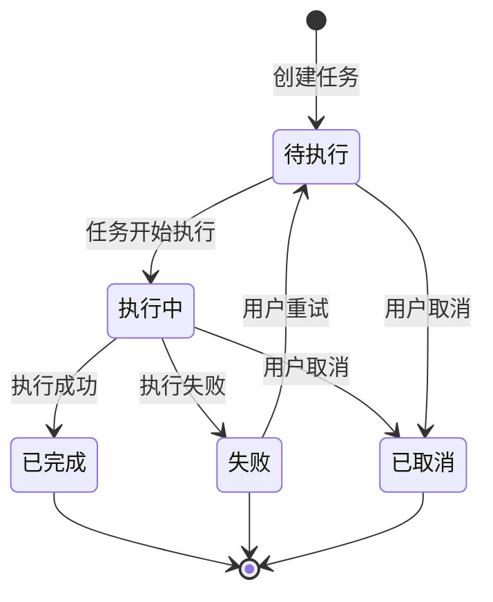

# 任务管理模块需求规格

## 1. 模块概述

### 1.1 模块定位

任务管理模块是 **AI 图像处理平台**（远期演进为「AI 工作平台」）的基础能力模块，提供统一的异步任务管理能力。该模块不直接处理业务逻辑，而是为各业务模块（数据集导出、通用导入导出、图像处理等）提供任务创建、状态追踪、进度更新、结果下载与失败重试的通用接口。

> **三后端契约**：Java/Go/Python 三后端 API 契约完全一致，Java 为权威来源，Go/Python 对齐。

### 1.2 核心价值

| 价值维度 | 具体内容 |
|---------|---------|
| **异步解耦** | 将耗时操作（如文件打包、数据导出）异步化，提升用户体验和系统响应速度 |
| **统一管控** | 提供统一的任务生命周期管理，避免各业务模块重复造轮子 |
| **进度透明** | 实时跟踪任务进度，用户可随时查看任务执行状态 |
| **结果分发** | 集中管理任务结果文件，提供统一的下载入口 |
| **资源管理** | 支持任务取消和结果文件过期清理，避免资源浪费 |

### 1.3 业务目标

#### 功能目标
- 提供统一的任务创建接口，支持多种任务类型（导入/导出/图像处理）
- 实现任务全生命周期管理（创建→执行→完成/失败/取消）
- 提供任务状态查询和进度跟踪能力
- 支持任务取消功能，避免资源浪费
- 提供任务结果文件下载能力，支持文件过期管理
- 支持失败任务手动重试
- 提供管理员视角的任务运维能力（全量任务查看、僵尸任务修复、过期清理）

#### 性能目标
| 指标 | 目标值 | 说明 |
|------|--------|------|
| **任务创建响应** | &lt;200ms | 提交任务到接收响应的时间（执行在异步队列） |
| **状态查询响应** | &lt;50ms | 查询任务状态的响应时间 |
| **列表查询响应** | &lt;500ms | 任务列表分页查询响应时间 |
| **任务并发数** | ≥100 | 系统支持的同时执行任务数 |
| **结果保留时长** | 7 天 | 任务完成后结果文件的保留时长 |

## 2. 用户角色分析

### 2.1 主要用户角色

| 角色 | 描述 | 主要职责 |
|------|------|---------|
| **系统用户** | 系统的所有注册用户 | 创建任务、查询状态、取消任务、重试、下载结果 |
| **系统管理员** | 拥有任务运维权限的管理员 | 查看全量任务、监控执行状态、处理僵尸任务、清理过期任务 |
| **业务模块** | 数据集导出、通用导入导出、图像处理等业务模块 | 通过任务管理能力创建任务、跟踪进度 |

### 2.2 权限矩阵

| 功能点 | 系统用户 | 系统管理员 | 业务模块 |
|--------|---------|-----------|---------|
| 创建任务 | ✅ | ✅ | ✅（通过接口） |
| 查询任务状态 | ✅（仅限自己创建的） | ✅（全量） | ✅ |
| 取消任务 | ✅（仅限自己创建的） | ✅（全量） | ✅ |
| 重试任务 | ✅（仅限自己创建的） | ✅（全量） | ✅ |
| 下载任务结果 | ✅（仅限自己创建的） | ✅（全量） | ✅ |
| 查看任务列表 | ✅（仅限自己创建的） | ✅（全量，支持按用户筛选） | ✅ |
| 僵尸任务修复 | ❌ | ✅（定时任务自动执行） | ❌ |
| 过期任务清理 | ❌ | ✅（定时任务自动执行） | ❌ |

> **数据隔离**：系统用户的任务操作（查询/取消/重试/下载）均校验任务归属，仅能操作自己创建的任务；系统管理员可查看与操作全量任务，用于运维监控。

## 3. 功能需求

### 3.1 任务创建 (F-TM-001)

#### 3.1.1 功能描述

为各业务模块提供统一的任务创建接口，支持多种任务类型的异步执行。

#### 3.1.2 支持的任务类型

| 任务类型标识 | 任务类别 | 任务类型名称 | 说明 | 典型场景 |
|-------------|---------|-------------|------|---------|
| dataset_export | export | 数据集导出 | 导出数据集为 ZIP 打包 | 用户导出数据集到本地 |
| user_export | export | 用户导出 | 导出用户数据为 Excel/CSV | 管理员导出用户列表 |
| role_export | export | 角色导出 | 导出角色数据 | 管理员导出角色列表 |
| dept_export | export | 部门导出 | 导出部门数据（扁平结构） | 管理员导出部门列表 |
| menu_export | export | 菜单导出 | 导出菜单数据（扁平结构） | 管理员导出菜单列表 |
| dict_export | export | 字典导出 | 导出字典类型与数据 | 管理员导出字典数据 |
| algorithm_export | export | 算法导出 | 导出算法元数据（Excel/CSV） | 管理员导出算法配置 |
| user_import | import | 用户导入 | 导入用户数据（Excel/CSV） | 管理员批量导入用户 |
| role_import | import | 角色导入 | 导入角色数据 | 管理员批量导入角色 |
| dept_import | import | 部门导入 | 导入部门数据 | 管理员批量导入部门 |
| menu_import | import | 菜单导入 | 导入菜单数据 | 管理员批量导入菜单 |
| dict_import | import | 字典导入 | 导入字典数据 | 管理员批量导入字典 |
| algorithm_import | import | 算法导入 | 导入算法元数据 | 管理员批量导入算法配置 |

> **说明**：
> 1. 任务类型采用「模块+操作」两级命名（如 `user_export`），用于任务创建与列表分类筛选；任务类别（导入/导出）由任务类型后缀推导。
> 2. **图像处理任务类型（待实施）**：规划新增 `image_processing` 任务类型，承载去雾/去雨/去雪/低光增强/超分辨率/去噪/图像修复等图像处理场景。具体算法场景经创建参数 `params.taskType` 承载（取值与 `sys_algorithm.task_type` 对齐：`dehaze`/`derain`/`desnow`/`lowlight`/`super_resolution`/`denoise`/`inpaint`），任务按 `params.taskType` 路由到对应算法集合。
>
> **注意**：`image_processing` 类型及其子类型路由为产品主线改造项（见 [近期改造计划 §3.1](../../05-改造计划/近期改造计划总览.md)），当前任务系统仅支持上表的导入/导出类型，图像处理任务类型待改造实施后启用。需区分两个同名概念：算法维度 `task_type`（`sys_algorithm.task_type`，枚举 `dehaze`/`derain` 等）与任务维度 `task_type`（`sys_task.task_type`，取值 `user_export`/`image_processing` 等"模块+操作"格式）。

#### 3.1.3 创建要求

创建任务需提供以下信息：

| 信息项 | 必填 | 说明 |
|--------|------|------|
| **任务类型** | ✅ | 任务类型枚举（见 3.1.2） |
| **任务参数** | 否 | 随任务类型变化（如导出目标资源、文件格式、包含范围等），由各业务模块约定 |

> 创建请求支持携带幂等标识，相同标识的重复请求返回已有任务，避免重复创建（业务规则见 3.1.4）。

#### 3.1.4 业务规则

1. **任务ID生成**：系统自动生成唯一任务ID（UUID，避免自增 ID 可猜测）
2. **初始状态**：任务创建后初始状态为待执行
3. **用户关联**：任务与当前登录用户自动关联
4. **参数校验**：任务类型必须在预定义枚举内（创建时校验，类型非法直接拒绝创建）；目标资源存在性、数据集非空等业务参数校验在策略执行时进行（校验失败经 PROCESSING → FAILED）
5. **幂等**：携带幂等标识（`Idempotency-Key` 请求头）的重复创建请求返回已有任务，不重复创建
6. **创建权限**：已登录用户均可创建任务
7. **并发限制**：单用户单类型最大并发任务数上限为 5（常量 `task.max.concurrent.per.user` 已定义），当前版本未启用并发校验，待图像处理任务上线后启用以防止资源耗尽

### 3.2 任务状态查询 (F-TM-002)

#### 3.2.1 功能描述

用户可实时查询任务的执行状态和进度信息。

#### 3.2.2 任务状态说明

| 状态 | 说明 | 可转至 |
|------|------|--------|
| 待执行 | 任务已创建，等待执行 | 执行中, 已取消 |
| 执行中 | 任务正在执行 | 已完成, 失败, 已取消 |
| 已完成 | 任务执行成功 | - |
| 失败 | 任务执行失败 | 待执行（重试） |
| 已取消 | 任务已被取消 | - |

#### 3.2.3 查询信息

状态查询返回任务的基本信息：任务ID、任务类型、任务类别、当前状态、进度、处理文件数、结果下载入口（完成时）、错误信息（失败时）、创建/开始/完成/过期时间等。

#### 3.2.4 业务规则

1. **数据隔离**：系统用户只能查询自己创建的任务；系统管理员可查询全量任务
2. **实时更新**：进度信息实时更新，前端可轮询查询（建议 2-5 秒间隔）
3. **结果保留**：任务记录过期时间 `expires_at` 在创建时设为 24 小时，任务完成时更新为 7 天；超过 `expires_at` 的任务结果不可下载，由定时任务清理

### 3.3 任务结果下载 (F-TM-003)

#### 3.3.1 功能描述

提供已完成任务结果文件的下载能力。下载经任务归属与完成状态校验后，由后端 302 重定向到文件下载 URL（`StorageService.getUrl` 运行时拼接，不落库），前端跟随重定向获取文件流。

#### 3.3.2 下载条件

| 条件 | 说明 |
|------|------|
| **任务状态** | 必须为已完成 |
| **结果存在** | 任务必须有有效的结果文件（导入任务结果为 JSON 对象，无下载文件） |
| **未过期** | 结果文件未超过保留时长（`expires_at`） |
| **权限校验** | 下载者必须是任务创建者（系统管理员可下载全量） |

#### 3.3.3 下载方式

- 通过任务ID触发下载（`GET /api/v1/tasks/{taskId}/download`）
- 后端校验任务归属、完成状态、过期时间后，302 重定向到文件下载 URL
- 三端统一采用 302 重定向方式（Java 为权威实现，Go/Python 对齐），不直接流式返回文件流
- 支持 ZIP 等压缩格式打包下载

#### 3.3.4 业务规则

1. **状态检查**：仅已完成状态的任务可下载（未完成/失败/已取消均拒绝）
2. **结果类型判断**：导入任务结果为 JSON 对象（无下载文件），下载导入任务结果返回"任务结果不包含下载文件"
3. **过期检查**：超过 `expires_at` 的任务不可下载
4. **权限校验**：仅任务创建者可下载（系统管理员除外）
5. **URL 运行时拼接**：结果存储对象键（`object_name`）落库，下载 URL 由 `StorageService.getUrl` 运行时拼接，环境迁移只改配置

### 3.4 任务取消 (F-TM-004)

#### 3.4.1 功能描述

用户可取消未完成的任务，释放系统资源。

#### 3.4.2 可取消的状态

| 当前状态 | 是否可取消 | 说明 |
|---------|-----------|------|
| 待执行 | ✅ | 待执行任务可取消 |
| 执行中 | ✅ | 执行中任务可中断取消 |
| 已完成 | ❌ | 已完成任务不可取消 |
| 失败 | ❌ | 失败任务不可取消 |
| 已取消 | ❌ | 已取消任务不可重复取消 |

#### 3.4.3 取消后处理

| 操作项 | 说明 |
|--------|------|
| **状态更新** | 任务状态更新为已取消 |
| **资源释放** | 释放相关系统资源（如临时文件） |
| **结果清理** | 清理已生成的中间结果 |
| **时间记录** | 记录取消时间 |

#### 3.4.4 业务规则

1. **权限限制**：仅任务创建者可取消（系统管理员可取消全量任务）
2. **状态校验**：仅待执行和执行中状态可取消（CAS 更新，避免并发覆盖）
3. **即时生效**：取消操作立即生效
4. **不可恢复**：取消后不可恢复

### 3.5 任务列表查询 (F-TM-005)

#### 3.5.1 功能描述

提供分页查询任务列表的能力，支持按状态、任务类别、任务类型筛选。系统用户仅查看自己创建的任务；系统管理员可查看全量任务并支持按用户筛选。

#### 3.5.2 列表展示信息

任务列表展示：任务ID、任务类型、当前状态、进度、创建时间、完成时间，并提供操作入口（查看详情/取消/重试失败任务/下载已完成结果）。

#### 3.5.3 筛选与排序

| 配置项 | 默认 | 说明 |
|--------|------|------|
| 状态筛选 | 全部 | 按任务状态筛选 |
| 任务类别筛选 | 全部 | 按导入/导出类别筛选 |
| 任务类型筛选 | 全部 | 按具体任务类型筛选 |
| 用户筛选 | 无 | 仅系统管理员可用，按创建人筛选 |
| 排序 | 创建时间倒序 | 列表默认排序 |

#### 3.5.4 业务规则

1. **数据隔离**：系统用户仅显示自己创建的任务；系统管理员可查看全量任务，支持按用户筛选
2. **默认排序**：按创建时间倒序排列
3. **历史保留**：任务记录保留 30 天，超过保留时长的过期任务由定时任务清理

### 3.6 任务重试 (F-TM-006)

#### 3.6.1 功能描述

提供失败任务手动重试能力，使失败任务重新执行，避免用户重复创建。

#### 3.6.2 重试条件

| 条件 | 说明 |
|------|------|
| **当前状态** | 必须为失败状态 |
| **权限校验** | 重试者必须是任务创建者 |
| **参数沿用** | 重试沿用原任务参数，不支持修改，清除上次错误信息后重新执行 |

#### 3.6.3 业务规则

1. **状态更新**：重试成功后任务状态由失败转回待执行，重新执行
2. **参数沿用**：重试沿用原任务参数（任务类型、目标资源、格式等），不支持重试时修改参数
3. **不可重复**：执行中及已完成/已取消任务不可重试
4. **权限限制**：仅任务创建者可重试（系统管理员可重试全量任务）
5. **计数可观测**：记录重试次数（`retry_count`），供任务列表与统计展示

## 4. 状态流转规则

### 4.1 状态流转图

### 4.2 状态变更规则

| 源状态 | 目标状态 | 触发条件 |
|--------|---------|---------|
| - | 待执行 | 任务创建成功（任务类型校验在创建时完成，类型非法直接拒绝创建，不产生任务记录） |
| 待执行 | 执行中 | 消费者从队列取出消息开始执行 |
| 执行中 | 已完成 | 策略执行成功 |
| 执行中 | 失败 | 策略执行异常（含参数校验失败、资源不存在等，重试耗尽后流转） |
| 待执行/执行中 | 已取消 | 用户取消（CAS 更新） |
| 失败 | 待执行 | 用户重试（F-TM-006） |

### 4.3 进度更新规则

| 阶段 | 进度范围 | 说明 |
|------|---------|------|
| 任务创建 | 0 | 初始进度 |
| 开始执行 | 1 | 执行开始 |
| 执行中 | 1-99 | 根据处理文件数计算 |
| 执行完成 | 100 | 完成时更新 |

## 5. 界面交互规范

### 5.1 通用交互

> 通用 UI 交互规范参见 [01-产品设计/02-UI-UX设计规范.md](../../../01-产品设计/02-UI-UX设计规范.md)

### 5.2 本模块特有交互

| 场景 | 行为 |
|------|------|
| 创建任务成功 | 显示任务ID提示，并提供"查看任务"跳转按钮 |
| 查询任务状态 | 前端可每 2-5 秒轮询一次（直至完成/失败/取消） |
| 任务取消 | 需二次确认："确认取消该任务吗？" |
| 下载结果 | 直接触发浏览器下载，或在新标签页打开 |
| 任务列表 | 支持点击任务ID查看任务详情弹窗 |

### 5.3 状态展示样式

| 状态 | 标签样式 |
|------|---------|
| 待执行 | 蓝色标签 |
| 执行中 | 蓝色标签 + 进度条 |
| 已完成 | 绿色标签 |
| 失败 | 红色标签 |
| 已取消 | 灰色标签 |

## 6. 安全设计

### 6.1 数据安全

| 安全措施 | 说明 |
|---------|------|
| **数据隔离** | 系统用户只能查看和操作自己创建的任务；系统管理员可查看与操作全量任务（运维监控） |
| **权限校验** | 所有操作需校验用户身份与任务归属 |
| **传输加密** | 数据传输需加密 |
| **操作日志** | 记录任务创建、取消、重试、下载等关键操作 |
| **结果文件访问控制** | 下载需校验任务归属与完成状态，存储对象键不对外暴露，下载 URL 运行时拼接 |

### 6.2 资源管理

| 管理项 | 说明 |
|--------|------|
| **任务并发限制** | 单用户单类型最大并发任务数上限 5（常量已定义，当前未启用，待图像处理任务上线后启用） |
| **结果文件过期** | 任务完成时 `expires_at` 更新为 7 天，超过保留时长的结果文件由定时任务清理 |
| **历史任务清理** | 任务记录保留 30 天，过期任务由定时任务（每日凌晨 3 点）分批清理 |
| **僵尸任务修复** | 定时任务（每 30 分钟）检测长时间处于执行中的任务，标记为失败 |
| **失败任务重试** | 支持失败任务手动重试（F-TM-006） |

### 6.3 输入校验

| 校验类型 | 说明 |
|---------|------|
| **任务类型校验** | 仅允许预定义的任务类型 |
| **参数格式校验** | 任务参数需符合对应任务类型的格式要求 |
| **用户身份校验** | 所有操作需登录认证 |
| **任务所有权校验** | 查询/取消/下载需校验任务归属 |

## 7. 依赖关系

### 7.1 依赖模块

| 模块 | 依赖说明 |
|------|---------|
| **用户管理模块** | 任务需要关联到创建用户 |
| **文件管理模块** | 任务结果文件需要持久化存储，下载经文件服务获取 |
| **消息队列** | 任务创建后异步执行，支持任务状态追踪 |

### 7.2 被依赖模块

| 模块 | 依赖说明 |
|------|---------|
| **数据集管理模块** | 使用任务管理能力实现数据集导出 |
| **通用导入导出框架** | 各模块（用户/角色/部门/菜单/字典/算法）的导入导出任务统一使用任务管理能力 |
| **图像处理模块** | 图像处理任务经任务管理模块创建与异步执行，按子类型路由到算法集合 |
| **AI 对话模块** | 异步任务完成后经回调恢复对话推理（远期） |

## 8. 相关文档

| 文档类型 | 文档路径 |
|---------|---------|
| **接口文档** | [任务管理/API接口.md](./API接口.md) |
| **后端实现** | [任务管理/后端实现.md](./后端实现.md) |
| **测试用例** | [任务管理/测试用例.md](./测试用例.md) |
| **数据库设计** | [02-系统架构/03-数据库设计.md](../../../02-系统架构/03-数据库设计.md) |

## 9. 任务完成回调机制（远期规划）

> 本节为**远期规划**（见 [产品拓展升级规划](../../05-改造计划/产品拓展升级规划.md) 与 [近期改造计划总览 §3.1](../../05-改造计划/近期改造计划总览.md)），当前三端**尚未实现**任务完成回调。现实现阶段任务状态/进度通过消息推送实时通知用户，不落回调记录。

### 9.1 回调定义

任务完成时，系统通过回调通知调用方。任务执行本身已通过异步消息队列解耦（见 §7.1），回调面向"需要感知任务结果的调用方"，分为两类：

| 回调方式 | 说明 | 适用场景 |
|---------|------|---------|
| 内部回调 | 任务完成事件写入系统内部（消息通知/业务模块订阅），不依赖外部回调 URL | AI 对话模块异步任务恢复、通知推送 |
| HTTP 回调 | 任务创建时可配置回调 URL，完成时向该 URL 发送 POST 请求携带任务结果 | 外部系统集成 |

### 9.2 回调内容

回调统一携带任务 ID、状态与结果摘要（如结果文件标识、处理指标、耗时），结果文件不通过回调直接暴露存储地址，接收方经下载入口获取。

### 9.3 AI 对话异步恢复

LLM 对话发起图像处理 → 处理过程异步执行，任务完成后通过内部回调通知恢复对话流程 → 对话继续携带处理结果推进后续推理。

---

## 10. 已定论事项与远期规划

### 10.1 已定论事项

| 事项 | 决策 | 说明 |
|------|------|------|
| **任务历史保留策略** | 任务记录保留 30 天 | 超过保留时长的过期任务由定时任务（每日凌晨 3 点）分批清理，不单独归档 |
| **任务优先级** | 当前版本不支持 | 采用单队列 FIFO 调度；远期按业务需要评估优先级队列 |
| **任务执行超时** | 由僵尸任务修复机制兜底 | 定时任务（每 30 分钟）检测长时间处于执行中（>30 分钟）的任务，标记为失败 |
| **进度更新频率** | 每 2 秒或进度变化 >5% 时更新 | 避免高频写入缓存，对齐前端轮询间隔（2-5 秒） |
| **任务并发限制** | 单用户单类型上限 5 | 常量已定义，当前未启用，待图像处理任务上线后启用 |
| **结果保留时长** | 完成后 7 天 | `expires_at` 创建时 24 小时，完成时更新为 7 天 |

### 10.2 远期规划（非本期实现）

1. **任务统计**：任务执行统计（成功率、平均耗时等），随管理端监控仪表盘一并规划
2. **任务完成回调**：见 §9，当前通过消息推送实时通知，远期支持内部回调与 HTTP 回调
3. **任务优先级队列**：按业务需要评估
4. **图像处理任务类型**：`image_processing` 类型及子类型路由（见 §3.1.2），为产品主线改造项
