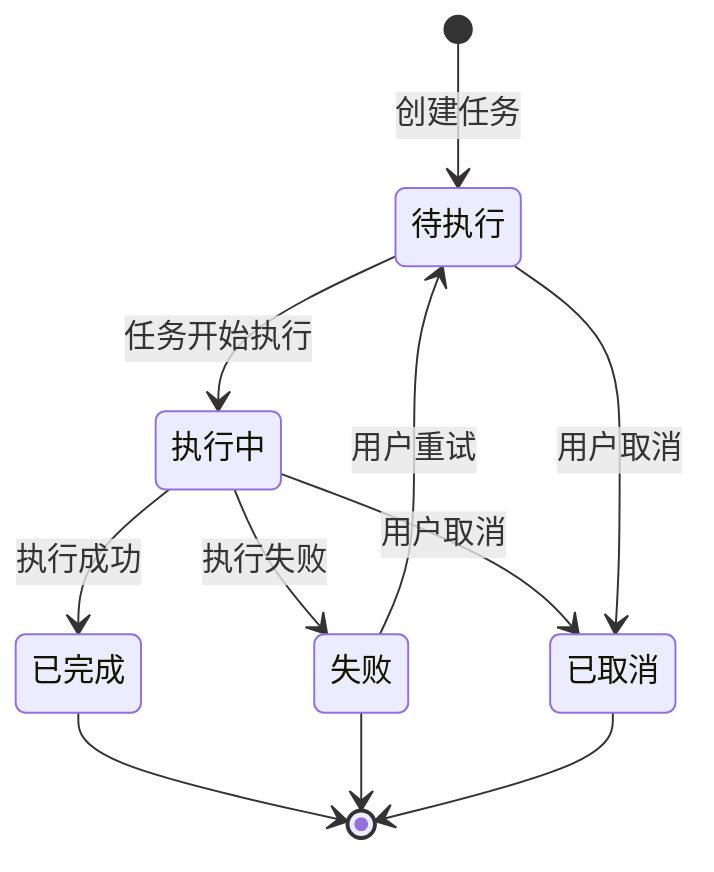

# 任务管理模块需求规格

## 1. 模块概述

### 1.1 模块定位

任务管理模块是 **AI 图像处理平台**的基础能力模块，提供统一的任务管理能力。该模块不直接处理业务逻辑，而是为各业务模块（数据集导出、通用导入导出、图像处理等）提供任务创建、状态追踪、进度更新、结果下载与失败重试的通用能力。

### 1.2 核心价值

| 价值维度 | 具体内容 |
|---------|---------|
| **后台执行** | 将耗时操作（如文件打包、数据导出）转为后台执行，用户提交后即可继续其他操作 |
| **统一管控** | 提供统一的任务生命周期管理，避免各业务模块重复实现 |
| **进度透明** | 实时跟踪任务进度，用户可随时查看任务执行状态 |
| **结果分发** | 集中管理任务结果文件，提供统一的下载入口 |

### 1.3 性能目标

| 指标 | 目标值 | 说明 |
|------|--------|------|
| **任务创建响应** | &lt;200ms | 提交任务到接收响应的时间（执行在后台进行） |
| **状态查询响应** | &lt;50ms | 查询任务状态的响应时间 |
| **取消任务响应** | &lt;200ms | 提交取消到接收响应的时间 |
| **列表查询响应** | &lt;500ms | 任务列表分页查询响应时间 |
| **任务并发数** | ≥100 | 系统支持的同时执行任务数 |
| **结果保留时长** | 7 天 | 任务完成后结果文件的保留时长 |

## 2. 用户角色分析

### 2.1 主要用户角色

| 角色 | 描述 | 主要职责 |
|------|------|---------|
| **系统用户** | 系统的所有注册用户 | 创建任务、查询状态、取消任务、重试、下载结果 |
| **系统管理员** | 拥有任务运维权限的管理员 | 查看全量任务、监控执行状态、清理过期任务 |
| **业务模块** | 数据集导出、通用导入导出、图像处理等业务模块 | 使用任务管理能力创建任务、跟踪进度 |

### 2.2 权限矩阵

| 功能点 | 系统用户 | 系统管理员 | 业务模块 |
|--------|---------|-----------|---------|
| 创建任务 | ✅ | ✅ | ✅ |
| 查询任务状态 | ✅（仅限自己创建的） | ✅（全量） | ✅ |
| 取消任务 | ✅（仅限自己创建的） | ✅（全量） | ✅ |
| 重试任务 | ✅（仅限自己创建的） | ✅（全量） | ✅ |
| 下载任务结果 | ✅（仅限自己创建的） | ✅（全量） | ✅ |
| 查看任务列表 | ✅（仅限自己创建的） | ✅（全量，支持按用户筛选） | ✅ |
| 僵尸任务修复 | ❌ | ✅（系统自动执行） | ❌ |
| 过期任务清理 | ❌ | ✅（系统自动执行） | ❌ |

> **数据隔离**：系统用户的任务操作（查询/取消/重试/下载）均校验任务归属，仅能操作自己创建的任务；系统管理员可查看与操作全量任务，用于运维监控。本矩阵是本模块权限与数据隔离的唯一依据。

## 3. 功能需求

### 3.1 任务创建 (F-TM-001)

#### 3.1.1 功能描述

为各业务模块提供统一的任务创建能力，支持多种任务类型在后台执行。

#### 3.1.2 支持的任务类型

| 任务类别 | 任务类型标识 | 说明 |
|---------|-------------|------|
| 导出 | `dataset_export` | 数据集导出为 ZIP 打包，供用户下载到本地 |
| 导出 | `user_export`、`role_export`、`dept_export`、`menu_export`、`dict_export`、`algorithm_export` | 对应模块数据导出为 Excel/CSV（部门、菜单按扁平结构导出；算法仅导出元数据） |
| 导入 | `user_import`、`role_import`、`dept_import`、`menu_import`、`dict_import`、`algorithm_import` | 从 Excel/CSV 批量导入对应模块数据 |

> **说明**：任务类型采用「模块+操作」两级命名（如 `user_export`），用于任务创建与列表分类筛选；任务类别（导入/导出）由任务类型后缀推导。

#### 3.1.3 创建要求

创建任务需提供以下信息：

| 信息项 | 必填 | 说明 |
|--------|------|------|
| **任务类型** | ✅ | 任务类型枚举（见 3.1.2） |
| **任务参数** | 否 | 随任务类型变化（如导出目标资源、文件格式、包含范围等），由各业务模块约定 |

#### 3.1.4 业务规则

1. **任务ID生成**：系统生成全局唯一且不可枚举猜测的任务ID
2. **初始状态**：任务创建后初始状态为待执行
3. **用户关联**：任务与当前登录用户自动关联
4. **参数校验**：任务类型必须在预定义枚举内，类型非法直接拒绝创建；目标资源存在性、数据集非空等业务参数在任务执行时校验，校验失败任务置为失败
5. **幂等**：携带幂等标识的重复创建请求返回已有任务，不重复创建
6. **创建权限**：已登录用户均可创建任务
7. **并发限制**：单用户单类型最大并发任务数上限为 5，超限拒绝创建

### 3.2 任务状态查询 (F-TM-002)

#### 3.2.1 功能描述

用户可实时查询任务的执行状态和进度信息。任务包含待执行、执行中、已完成、失败、已取消五种状态。

#### 3.2.2 查询信息

状态查询返回任务的基本信息：任务ID、任务类型、任务类别、当前状态、进度、处理文件数、结果下载入口（完成时）、错误信息（失败时）、创建/开始/完成/过期时间等。

#### 3.2.3 业务规则

1. **实时更新**：进度信息实时更新
2. **结果保留**：任务结果保留 7 天，超过保留期的结果不可下载

### 3.3 任务结果下载 (F-TM-003)

#### 3.3.1 功能描述

提供已完成任务结果文件的下载能力。

#### 3.3.2 下载条件

| 条件 | 说明 |
|------|------|
| **任务状态** | 必须为已完成 |
| **结果存在** | 任务必须有有效的结果文件（导入任务结果为处理统计数据，无下载文件） |
| **未过期** | 结果文件未超过保留时长 |
| **权限校验** | 下载者必须是任务创建者（系统管理员可下载全量） |

### 3.4 任务取消 (F-TM-004)

#### 3.4.1 功能描述

用户可取消未完成的任务，释放系统资源。

#### 3.4.2 业务规则

1. **权限限制**：仅任务创建者可取消（系统管理员可取消全量任务）
2. **状态校验**：仅待执行和执行中状态可取消，取消后不可恢复
3. **即时生效**：取消操作立即生效，释放已占用资源与中间结果，并记录取消时间

### 3.5 任务列表查询 (F-TM-005)

#### 3.5.1 功能描述

提供分页查询任务列表的能力，支持按状态、任务类别、任务类型筛选。系统用户仅查看自己创建的任务；系统管理员可查看全量任务并支持按用户筛选。

#### 3.5.2 列表展示信息

任务列表展示：任务ID、任务类型、当前状态、进度、创建时间、完成时间，并提供操作入口（查看详情/取消/重试失败任务/下载已完成结果）。

#### 3.5.3 筛选与排序

| 配置项 | 默认 | 说明 |
|--------|------|------|
| 状态筛选 | 全部 | 按任务状态筛选 |
| 任务类别筛选 | 全部 | 按导入/导出类别筛选 |
| 任务类型筛选 | 全部 | 按具体任务类型筛选 |
| 用户筛选 | 无 | 仅系统管理员可用，按创建人筛选 |
| 排序 | 创建时间倒序 | 列表默认排序 |

#### 3.5.4 业务规则

1. **历史保留**：任务记录保留 30 天，超过保留时长的过期任务由系统自动清理

### 3.6 任务重试 (F-TM-006)

#### 3.6.1 功能描述

提供失败任务手动重试能力，使失败任务重新执行，避免用户重复创建。

#### 3.6.2 业务规则

1. **状态限制**：仅失败状态任务可重试，执行中/已完成/已取消任务不可重试
2. **参数沿用**：重试沿用原任务参数，不支持修改，清除上次错误信息后重新执行，状态转回待执行
3. **权限限制**：仅任务创建者可重试（系统管理员可重试全量任务）
4. **计数可观测**：记录重试次数，供任务列表与统计展示

## 4. 状态流转规则

### 4.1 状态流转图

### 4.2 状态变更规则

图中未体现的补充约束：

- 任务类型非法时直接拒绝创建，不产生任务记录
- "执行失败"包含参数校验失败、目标资源不存在等业务错误，以及系统自动重试耗尽后的失败
- 已完成、已取消为终态，不可再变更；失败仅可经用户重试（F-TM-006）回到待执行

### 4.3 进度更新规则

| 阶段 | 进度范围 | 说明 |
|------|---------|------|
| 任务创建 | 0 | 初始进度 |
| 开始执行 | 1 | 执行开始 |
| 执行中 | 1-99 | 根据处理文件数计算 |
| 执行完成 | 100 | 完成时更新 |

## 5. 界面交互规范

### 5.1 本模块特有交互

| 场景 | 行为 |
|------|------|
| 创建任务成功 | 显示任务ID提示，并提供"查看任务"跳转按钮 |
| 查询任务状态 | 未完成任务的状态与进度自动刷新，直至任务进入终态 |
| 任务取消 | 需二次确认："确认取消该任务吗？" |
| 下载结果 | 直接触发浏览器下载，或在新标签页打开 |
| 任务列表 | 支持点击任务ID查看任务详情弹窗 |

### 5.2 状态展示样式

| 状态 | 标签样式 |
|------|---------|
| 待执行 | 蓝色标签 |
| 执行中 | 蓝色标签 + 进度条 |
| 已完成 | 绿色标签 |
| 失败 | 红色标签 |
| 已取消 | 灰色标签 |

### 5.3 页面布局

| 页面 | 布局要点 |
|------|---------|
| 任务列表页 | 顶部筛选区（状态/任务类别/任务类型，管理员额外可见用户筛选），主体为任务列表表格，按创建时间倒序分页加载，每行展示进度条与结果预览入口 |
| 任务详情弹窗 | 展示任务基本信息、进度时间线、结果下载入口（完成时）、错误信息（失败时） |
| 任务中心浮窗 | 跨页面悬浮展示进行中任务进度，任务完成时弹出通知提示，支持快捷跳转详情 |

### 5.4 操作反馈与错误提示

| 场景 | 反馈行为与提示文案 |
|------|----------------|
| 任务失败 | 状态标签置红，展示失败原因，提供"重试"按钮 |
| 结果下载过期 | 提示"任务结果已过期，无法下载" |
| 权限不足 | 操作非本人任务时提示"无权操作该任务" |
| 任务类型不支持 | 创建时提示"不支持的任务类型" |
| 并发超限 | 提示"已达并发任务上限，请等待已有任务完成" |

## 6. 安全设计

### 6.1 数据安全

| 安全措施 | 说明 |
|---------|------|
| **结果文件访问控制** | 下载需校验任务归属与完成状态，结果文件地址不对外暴露 |
| **操作日志** | 记录任务创建、取消、重试、下载等关键操作 |

### 6.2 资源管理

| 管理项 | 说明 |
|--------|------|
| **僵尸任务修复** | 执行中超过 30 分钟无进展的任务判定为异常，由系统标记为失败 |
| **过期资源清理** | 超过保留时长的结果文件与任务记录由系统自动分批清理 |

## 7. 依赖关系

### 7.1 依赖模块

| 模块 | 依赖说明 |
|------|---------|
| **用户管理模块** | 任务需要关联到创建用户 |
| **文件管理模块** | 任务结果文件需要持久化存储，下载经文件服务获取 |

### 7.2 被依赖模块

| 模块 | 依赖说明 |
|------|---------|
| **数据集管理模块** | 使用任务管理能力实现数据集导出 |
| **通用导入导出框架** | 各模块（用户/角色/部门/菜单/字典/算法）的导入导出任务统一使用任务管理能力 |
| **图像处理模块** | 图像处理任务经任务管理模块创建与后台执行，按子类型路由到算法集合 |

## 9. 已定论事项

| 事项 | 决策 | 说明 |
|------|------|------|
| **任务优先级** | 不区分业务优先级 | 按创建顺序先到先执行 |

## 10. 待确认事项

1. **结果保留期差异化**：不同任务类型（导入/导出）的结果保留期是否需要差异化（当前统一 7 天）？
2. **历史任务清理通知**：任务记录清理（30 天）前是否需要通知用户或提供归档下载？
3. **并发上限差异化**：单用户单类型并发上限 5 是否需要按会员等级差异化？
4. **失败重试总次数**：失败任务手动重试是否有总次数上限（当前无限制）？
