# 会员管理模块 - 前端实现设计

## 1. 文档概述

本文档描述会员管理模块的前端实现方案，聚焦组件架构、状态管理、路由设计与关键交互决策。前端覆盖用户端会员中心（等级/权益/成长值/签到）与管理端会员管理（列表/详情/等级调整/成长值调整/冻结解冻/权益配置）。

---

## 2. 组件树设计

```mermaid
flowchart TB
    subgraph 用户端
        MemberCenterPage["MemberCenterPage<br/>会员中心"]
        GrowthLogsPage["GrowthLogsPage<br/>成长值明细"]
    end

    subgraph 管理端
        MemberListPage["MemberListPage<br/>会员管理"]
    end

    MemberCenterPage --> LevelCard["LevelCard<br/>等级卡片"]
    MemberCenterPage --> GrowthProgress["GrowthProgress<br/>成长值进度卡片"]
    MemberCenterPage --> BenefitsOverview["BenefitsOverview<br/>权益概览"]
    MemberCenterPage --> SignInCard["SignInCard<br/>签到卡片"]
    MemberCenterPage --> UpgradeGuide["UpgradeGuide<br/>升级引导"]

    GrowthLogsPage --> GrowthFilter["筛选区<br/>变动类型/时间范围"]
    GrowthLogsPage --> GrowthTable["成长值流水表格"]

    MemberListPage --> MemberSearch["筛选区<br/>关键字/等级/状态/到期/成长值区间"]
    MemberListPage --> MemberTable["会员表格"]
    MemberListPage --> MemberDetailDialog["会员详情弹窗"]
    MemberListPage --> LevelAdjustDialog["等级调整弹窗"]
    MemberListPage --> GrowthAdjustDialog["成长值调整弹窗"]
    MemberListPage --> FreezeDialog["冻结/解冻弹窗"]
    MemberListPage --> BenefitConfigDrawer["权益配置抽屉"]
```



### 组件职责划分

| 组件 | 职责 | 所属端 |
|------|------|:------:|
| MemberCenterPage | 组合等级、成长值、权益、签到、升级引导五个区块 | 用户 |
| LevelCard | 等级名称、等级来源标识（会员卡到期/成长值维持）、成长值 | 用户 |
| GrowthProgress | 当前成长值、距下一等级差值、进度条 | 用户 |
| BenefitsOverview | 本月各任务类型剩余次数、批量上限、已解锁功能 | 用户 |
| SignInCard | 签到按钮、连续/累计天数、当月签到日历、签到成功动画 | 用户 |
| GrowthLogsPage | 成长值变动流水列表，按类型/时间筛选 | 用户 |
| MemberListPage | 会员分页查询与筛选，调度各操作弹窗 | 管理员 |
| MemberDetailDialog | 5 页签：基本信息/成长值流水/消费记录/权益使用/操作日志 | 管理员 |
| LevelAdjustDialog | 目标等级下拉、到期时间选择、调整原因输入 | 管理员 |
| GrowthAdjustDialog | 变动值输入（正负整数）、调整原因输入 | 管理员 |
| FreezeDialog | 冻结原因输入；解冻确认 | 管理员 |
| BenefitConfigDrawer | 各等级权益参数表格（配额/开关/优先级），行级保存 | 管理员 |

---

## 3. 状态管理

| Store | 核心状态 | 职责 |
|-------|---------|------|
| memberStore | profile、levelInfo、benefits、growthValue、signInCalendar | 会员档案（等级/成长值/到期时间）、等级权益配置、本月配额使用、签到日历 |

- memberStore 在用户登录后加载会员档案，等级/权益/成长值作为跨页面共享状态（套餐商城购买按钮文案依赖当前等级）
- 签到日历、成长值明细列表、后台会员管理（分页数据/筛选条件/弹窗显隐/表单数据）均在页面组件内局部管理

---

## 4. 路由设计

| 路由路径 | 组件 | 名称 | 加载方式 | 角色要求 |
|---------|------|------|---------|---------|
| `/member/center` | MemberCenterPage | MemberCenter | 静态路由（hidden, keepAlive） | 登录用户 |
| `/member/growth-logs` | GrowthLogsPage | MemberGrowthLogs | 静态路由（hidden, keepAlive） | 登录用户 |
| `/member/list` | MemberListPage | MemberList | 动态菜单 | 管理员 |

- 用户端路由 hidden 不显示在菜单，通过个人中心入口跳转；启用 keepAlive 保留页面状态
- 管理端路由经动态菜单加载，后端菜单权限控制入口可见性
- 会员中心页在 onActivated 时重新加载档案，确保从套餐购买返回后等级/权益为最新

### 权限控制

按钮级权限：等级调整 `member:level:edit`、成长值调整 `member:growth:edit`、冻结/解冻 `member:status:edit`、权益配置修改 `member:benefit:edit`；无权限时按钮隐藏。

---

## 5. 数据流

### 用户端会员中心

```
进入会员中心 -> 加载会员档案 + 当月签到日历
    ↓
渲染等级卡片 / 成长值进度 / 权益概览 / 签到状态
    ↓
├─ 点击签到 -> 提交签到 -> 成功动画 -> 刷新档案与日历
├─ 成长值明细 -> 跳转 growth-logs 页
└─ 升级 -> 跳转套餐商城
```

### 管理端会员管理

```
进入页面 -> 分页查询会员列表
    ↓
筛选（关键字/等级/状态/到期时间/成长值区间）-> 重新查询
    ↓
├─ 详情 -> 弹窗加载基本信息，切换页签按需加载其余页签数据
├─ 等级/成长值/冻结解冻 -> 弹窗表单 -> 提交 -> 刷新列表
└─ 权益配置 -> 抽屉 -> 行级编辑 -> 保存
```

> 套餐购买/续费支付成功后返回会员中心时重新加载档案，等级与权益展示随之更新。

---

## 6. 交互设计决策

| 决策点 | 实现方式 | 理由 |
|--------|---------|------|
| 等级进度条展示 | 按当前等级与下一等级成长值区间计算进度百分比，SVIP 显示"已达最高等级"不展示进度条 | 直观展示升级进度，激励用户积累成长值 |
| 等级配色映射 | 各等级映射渐变色与图标（level_0 灰/level_1 蓝/level_2 紫/level_3 橙），前端静态配置 | 视觉差异化强化等级感知 |
| 权益卡片展示 | 按任务类型（去雾/去雨/去雪/低光/超分/去噪/修复/评估）平铺展示剩余次数 + 功能开关列表 | 多任务权益独立配置，卡片平铺展示全貌 |
| 成长值变动时间线 | 流水表格按时间倒序，变动类型彩色标签（+绿色/-红色），关联订单号/任务ID | 变动记录可追溯，关联业务便于跳转 |
| 等级升级引导 | 展示下一等级权益对比 + 升级按钮跳转套餐商城；SVIP 不展示 | 引导用户付费升级，最高等级无需引导 |
| 签到防重复 | 今日已签到按钮置灰，后端重复签到返回错误提示 | 前端置灰 + 后端校验双重保障 |
| 降级二次确认 | 等级调整时比较新旧等级排序，降级弹二次确认框 | 避免误操作导致用户等级下降 |
| 成长值调整预览 | 调整弹窗展示"当前值 + 变动值 = 预期值"（前端计算） | 操作前预览结果，减少误操作 |
| 调整/冻结原因必填 | 等级调整、成长值调整、冻结弹窗均校验原因必填（2-200 字符） | 操作影响用户权益，需可追溯 |
| 详情页签按需加载 | 5 页签切换时才加载对应数据，非全部预加载 | 减少首次打开弹窗的请求量 |

---

## 7. 公共组件使用

| 公共组件 | 使用位置 | 配置要点 |
|---------|---------|---------|
| 分页表格 | 成长值明细、后台会员列表 | 自定义列模板（等级/状态/变动类型标签、操作列） |
| 搜索表单 | 后台会员列表筛选区 | 关键字/等级/状态/到期时间/成长值区间联动查询 |
| 弹窗表单 | 等级调整/成长值调整/冻结解冻 | 复用统一校验与提交流程 |
| 详情页签 | 会员详情弹窗 | 页签切换触发按需加载 |
| 标签 | 等级/状态/变动类型 | 按等级/状态/类型映射配色 |
| 抽屉 | 权益配置 | 各等级权益参数表格，行级编辑保存 |
| 进度条 | 成长值进度卡片 | 按成长值区间计算百分比 |
| 日历 | 签到卡片 | 已签到日期标记 |
