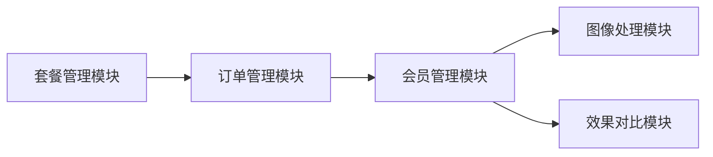

# 会员管理模块需求规格

> **文档分层说明**：本文档按"已实现（现状）/ 本次改造目标（规划中）/ 远期规划"三层组织。
> - **已实现**：当前代码已落地、可直接验证的功能
> - **本次改造目标（规划中）**：已列入[近期改造计划总览](../../05-改造计划/近期改造计划总览.md)，尚未实现的演进方向
> - **远期规划**：已列入[远期改造计划总览](../../05-改造计划/远期改造计划总览.md)，依赖后续阶段的基础设施
>
> **本次改造说明**：本次改造统一多任务权益模型（按任务类型配置配额）、接入成长值付费链路（购买套餐/图像处理/评估/退款）、定论跨等级套餐降级兜底与 level_source 自动升级规则、补齐 AI 计费字段三端一致性、实现套餐个性化权益覆盖（benefit_overrides），详见各章节。

## 1. 模块概述

### 1.1 模块定位

会员管理模块是系统商业化运营的核心模块，负责管理用户的会员等级、成长值、权益配置及会员全生命周期。该模块为图像处理（去雾/去雨/去雪/低光增强/超分辨率/去噪/图像修复）、效果对比等核心业务模块提供权益校验能力，同时与套餐管理、订单管理模块联动，构成完整的付费会员体系。

### 1.2 核心价值

| 价值维度 | 具体内容 | 状态 |
|---------|---------|------|
| **等级体系** | 建立清晰的会员等级阶梯，激励用户持续使用和付费升级 | ✅ 已实现 |
| **权益驱动** | 通过差异化权益（次数配额、功能解锁、优先处理）提升付费转化 | ✅ 已实现 |
| **成长激励** | 成长值体系将用户行为量化（签到/评价/图像处理/评估/购买套餐/退款扣减），形成持续活跃与付费转化的正向激励 | ✅ 已实现（签到/评价/处理/评估/消费/退款） |
| **运营管理** | 后台提供会员全景视图，支持等级调整、权益配置、数据统计 | ✅ 已实现 |

### 1.3 业务目标

#### 功能目标

- 建立四级会员等级体系（普通用户 → VIP1 → VIP2 → SVIP）✅ 已实现
- 实现基于成长值的自动升降级机制 ✅ 已实现（自动升级不限来源；降级受来源与有效期约束）
- 提供权益配置与管理能力 ✅ 已实现（按等级配置更新）
- 支持后台会员列表查询、等级调整、成长值管理 ✅ 已实现

#### 性能目标

| 指标 | 目标值 | 说明 |
|-----|--------|------|
| 权益校验响应 | <50ms | 单次图像处理/评估请求中的权益检查耗时 |
| 会员列表查询 | <500ms | 后台分页查询响应时间 |
| 等级变更生效 | <3s | 购买套餐后会员等级更新的延迟 |
| 成长值更新 | <1s | 用户行为后成长值写入延迟 |

### 1.4 模块依赖关系



---

## 2. 会员等级体系

### 2.1 等级定义

| 等级 | 等级标识 | 成长值区间 | 定位 |
|------|---------|-----------|------|
| 普通用户 | `level_0` | 0 - 999 | 免费体验，引导转化 |
| VIP1 | `level_1` | 1000 - 4999 | 入门付费，满足轻度需求 |
| VIP2 | `level_2` | 5000 - 19999 | 进阶付费，满足中度需求 |
| SVIP | `level_3` | ≥20000 | 高级付费，满足重度/专业需求 |

> 成长值区间以权益配置表 `growth_min`/`growth_max` 为准（`growth_max=0` 表示无上限），自动升降级基于该区间计算。

### 2.2 权益配置

#### 2.2.1 核心权益 (F-MM-001)

> 权益配置数值以 `config/sql/data/sys_member_benefit.sql` 为权威，本文档与之一致。多任务权益按任务类型独立配置配额，任务类型枚举：`dehaze`(去雾)、`derain`(去雨)、`desnow`(去雪)、`lowlight`(低光增强)、`super_resolution`(超分辨率)、`denoise`(去噪)、`inpaint`(图像修复)、`evaluate`(评估)。

**各任务类型月度配额**（每个任务类型独立配置、独立校验、独立重置，下表为默认配额，可按等级单独调整）：

| 任务类型 | 普通用户 | VIP1 | VIP2 | SVIP |
|---------|---------|------|------|------|
| 去雾 dehaze | 20 | 100 | 500 | 3000 |
| 去雨 derain | 20 | 100 | 500 | 3000 |
| 去雪 desnow | 20 | 100 | 500 | 3000 |
| 低光增强 lowlight | 20 | 100 | 500 | 3000 |
| 超分辨率 super_resolution | 10 | 50 | 200 | 1000 |
| 去噪 denoise | 20 | 100 | 500 | 3000 |
| 图像修复 inpaint | 10 | 50 | 200 | 1000 |
| 评估 evaluate | 20 | 100 | 500 | 3000 |

**通用权益**：

| 权益项 | 普通用户 | VIP1 | VIP2 | SVIP |
|--------|---------|------|------|------|
| 历史记录保留条数 | 100 | 500 | 2000 | 10000 |
| 批量处理上限 | 10 张 | 50 张 | 200 张 | 1000 张 |
| 处理优先级 | 普通 | 优先 | 高优先 | 最高 |
| 高级参数调节 | ❌ | ✅ | ✅ | ✅ |
| 高清图导出 | ❌ | ✅ | ✅ | ✅ |
| 对比报告导出 | ❌ | ✅ | ✅ | ✅ |
| 批量打包下载 | ❌ | ✅ | ✅ | ✅ |

> **说明**：
> - 每个任务类型的月度配额独立存储，字段命名 `monthly_{taskType}_quota` / `monthly_{taskType}_used`（如 `monthly_dehaze_quota`、`monthly_super_resolution_quota`、`monthly_evaluate_quota`）。权益校验按请求携带的任务类型匹配对应配额，互不占用。
> - 高级参数调节/高清图导出/对比报告导出/批量打包下载四项为能力开关（`advanced_params`/`hd_export`/`report_export`/`batch_download`），**普通用户关闭、VIP1/2/SVIP 开启**；后续如调整，修改权益配置对应字段即可。

#### 2.2.2 权益校验逻辑

```
用户发起图像处理（携带 taskType）/评估请求
    ↓
查询用户当前会员等级（缓存优先）
    ↓
查询对应等级的权益配置，取该 taskType 的配额
    ↓
检查本月该任务类型已用次数 < 配额上限
    ├─ 是 → 执行处理 → 扣减次数（原子操作 + 落库）
    └─ 否 → 返回次数不足提示 → 引导购买VIP/升级套餐
```

> **实现说明**：权益校验与配额扣减由 **Python 算法服务侧**接入（`check_and_deduct_quota`，按 taskType 维度 Redis 原子扣减 + 失败归还），Java 端 `deductQuota` 已实现但预测流程未调用（见 [图像处理模块 §4.2](../../核心模块/去雾处理/需求规格.md)）。已购买套餐的用户，配额取套餐个性化覆盖（`benefit_overrides`，见 §3.3）与等级权益的较高值。

#### 2.2.3 次数重置规则

- 每月 1 日 00:00 由定时任务自动重置全部任务类型（含评估）次数
- 重置基于会员等级对应的各任务类型配额，非累计
- 重置流程：先将上月各任务类型配额使用情况**归档至独立历史表**（每月一条），再重置当月配额字段
- **实现说明**：当月实时配额内嵌于会员表（`monthly_{taskType}_quota/used`，覆盖 7 类图像处理 + 评估共 8 个任务类型），每月重置时归档至独立配额历史表（`sys_member_quota`），形成月度追溯能力
- **重置后不推送通知**（早期设计稿的"重置后推送站内信/APP推送"未实现）

### 2.3 成长值体系 (F-MM-002)

#### 2.3.1 成长值获取规则

| 行为类型 | 成长值 | 频率限制 | change_type | 说明 |
|---------|--------|---------|------------|------|
| 每日签到 | +3 | 每日 1 次 | `sign_in` | 维持日常活跃（已实现） |
| 连续签到 7 天 | +20 | 每周期 1 次 | `sign_in_bonus` | 奖励持续活跃（已实现，连续天数满 7 的整数倍触发） |
| 提交处理评价 | +5 | 每日上限 5 | `rating` | 鼓励用户反馈（已实现，Redis 计数） |
| 完成一次图像处理 | +1 | 每日上限 10 | `process` | 鼓励核心功能使用，按处理任务实际完成次数累计（图像处理回调触发） |
| 完成一次效果评估 | +1 | 每日上限 5 | `evaluate` | 鼓励使用评估功能（评估回调触发） |
| 购买套餐 | 按消费金额 1:1 | 无上限 | `consume` | 消费直接转化为成长值，订单支付成功回调触发（金额单位：元，1 元 = 100 成长值） |

> **付费链路接入说明**：购买套餐（`consume`）、图像处理（`process`）、评估（`evaluate`）的成长值累积，以及退款扣减（`refund_deduct`）均接入业务回调——订单支付成功回调写入 `consume`、图像处理/评估完成回调写入 `process`/`evaluate`、退款成功回调等额扣减 `refund_deduct`。三后端（Java/Go/Python）契约一致，Java 权威，Go/Python 对齐。

#### 2.3.2 成长值扣减规则

- 退款成功时，按该订单获取的成长值**等量扣减**（`refund_deduct` 类型），即退款扣减的成长值 = 该订单 `consume` 获取的成长值 × 未使用比例（与退款金额折算比例一致，见 [订单管理模块退款策略](../订单管理/需求规格.md)）
- 扣减后若成长值低于当前等级下限，触发降级（仅成长值来源或套餐已到期的会员触发降级，见 §3.2）
- 成长值不允许为负数，最低为 0；实际扣减值按差额计算（余额不足部分不再追溯）
- 退款扣减成长值与跨模块退款策略一致：未使用部分全额退、已使用部分不退

#### 2.3.3 成长值流水记录

每次成长值变动均记录流水，包含用户 ID、变动类型、变动值、变动后余额、关联业务 ID（订单号/任务 ID）、变动原因、操作人、变动时间。

---

## 3. 会员生命周期管理

### 3.1 升级机制 (F-MM-003)

#### 3.1.1 升级条件

| 升级路径 | 条件 | 生效方式 |
|---------|------|---------|
| 普通 → VIP1 | 成长值 ≥ 1000 或 购买 VIP1 套餐 | 成长值升级立即生效；套餐购买支付成功回调立即生效 |
| VIP1 → VIP2 | 成长值 ≥ 5000 或 购买 VIP2 套餐 | 同上 |
| VIP2 → SVIP | 成长值 ≥ 20000 或 购买 SVIP 套餐 | 同上 |

> **level_source 规则定论**：`level_source`（`growth`/`purchase`/`admin`）**仅记录当前等级的获得来源，不影响自动升级**。任何来源的会员，当成长值达到更高等级阈值时均自动升级（升级后 `level_source` 保持不变，保留原 `expire_time`，套餐期间享有 max(套餐等级, 成长值等级)）。自动**降级**仍受来源与有效期约束：套餐未到期（`purchase`/`admin` 且 `expire_time` 未过期）不降级，仅 `growth` 来源或套餐已到期的会员在成长值低于等级下限时降级（见 §3.2）。

#### 3.1.2 升级流程

```
成长值变更（签到/评价/图像处理/评估/购买套餐/退款扣减）
    ↓
计算新成长值对应的目标等级
    ├─ 目标等级 > 当前等级 → 更新等级（level_source 保持不变）→ 更新配额 → 发送升级通知（站内信）
    └─ 否 → 仅更新成长值
```

#### 3.1.3 升级通知

- 站内信（升级模板）：恭喜您升级至 {levelName}，已解锁各任务处理 {次数}次/月，评估 {次数}次/月
- **APP 推送、个人中心等级变更动画**未实现（早期设计稿内容）

### 3.2 降级机制 (F-MM-004)

#### 3.2.1 降级条件

| 场景 | 降级规则 | 状态 |
|------|---------|:----:|
| 套餐到期未续费 | 按当前成长值对应的等级生效；成长值低于普通用户阈值（0）则降为普通用户 | ✅ 已实现（定时任务） |
| 成长值因退款扣减 | 低于当前等级下限时降级（仅 `growth` 来源或套餐已到期会员触发；套餐未到期不降级） | ✅ 已接入（refund_deduct） |
| 套餐到期但成长值达标 | 保持当前等级，不降级 | ✅ 已实现 |

> **跨等级套餐降级兜底定论**：套餐到期后，按当前成长值对应的等级生效；若成长值低于普通用户则降为普通用户；套餐购买期间享受套餐等级，到期后自然过渡到成长值等级，**不出现权益空窗**（到期即时由每日降级定时任务重算等级，过渡期间权益不中断）。

#### 3.2.2 降级流程

```
定时任务每日扫描（到期时间已过且来源非 growth）
    ↓
计算成长值对应的目标等级
    ↓
目标等级 < 当前等级
    ├─ 是 → 更新用户等级（来源置 growth）→ 更新配额 → 发送降级通知
    └─ 否 → 保持当前等级（保级，来源置 growth、清空 expire_time）
```

> 成长值因退款扣减触发的降级在退款回调事务内即时执行（不等待定时任务），逻辑同上。

#### 3.2.3 到期预警

| 提前天数 | 通知内容 | 状态 |
|---------|---------|:----:|
| 7 天 | 续费提醒（到期日期） | ✅ 已实现 |
| 3 天 | 续费提醒 + 降级后权益对比（去雾/评估次数变化） | ✅ 已实现 |
| 1 天 | 最后提醒 | ✅ 已实现 |
| 当天 | 执行降级（如成长值不达标，由每日降级定时任务处理） | ✅ 已实现 |

> 预警通过站内信发送，模板按提前天数区分；当天执行降级由每日 02:00 的过期降级定时任务完成。

### 3.3 保级机制 (F-MM-005)

套餐到期时，若用户成长值仍达到当前等级门槛，则保持等级不变，等级来源由套餐购买切换为成长值维持。

#### 套餐个性化权益覆盖（benefit_overrides）

套餐可对等级权益进行个性化覆盖，实现"套餐额外赠送"运营能力。套餐表 `benefit_overrides` 字段以 JSON 存储覆盖项，覆盖维度与多任务权益一致：

- **覆盖粒度**：可覆盖任意任务类型配额（如 VIP1 套餐额外赠送去雾 50 次/月、超分 20 次/月），以及历史保留、批量上限、优先级、能力开关
- **取值规则**：已购买套餐的用户，各任务类型配额取 `max(等级权益配额, 套餐覆盖配额)`；未覆盖的任务类型仍取等级权益
- **生效与失效**：套餐支付成功即时生效，套餐到期/退款后失效，回退至纯等级权益
- **校验与重置**：权益校验、月度配额重置均按合并后的配额执行

> **示例**：VIP1 等级去雾配额 100 次/月，某 VIP1 套餐 `benefit_overrides` 设置 `{"monthly_dehaze_quota": 150}`，则购买该套餐的用户每月去雾配额为 `max(100, 150) = 150` 次。

---

## 4. 后台管理功能

### 4.1 会员列表查询 (F-MM-006)

#### 4.1.1 功能描述

提供会员信息的分页展示和多条件筛选，支持管理员快速定位目标会员。

#### 4.1.2 查询条件

| 条件类型 | 字段 | 说明 | 匹配方式 |
|---------|------|------|---------|
| 关键字搜索 | 用户名/昵称/手机号 | 多字段模糊匹配 | LIKE |
| 会员等级 | 等级标识 | 精确匹配 | = |
| 会员状态 | 正常/冻结 | 精确匹配 | = |
| 到期时间 | 时间范围 | 套餐到期时间筛选 | BETWEEN |
| 成长值区间 | 最小值~最大值 | 数值范围 | BETWEEN |

#### 4.1.3 列表展示字段

| 字段 | 显示名称 | 说明 |
|------|---------|------|
| username | 用户名 | 登录账号 |
| nickname | 昵称 | 显示名称 |
| levelName | 会员等级 | 等级标签（带颜色） |
| growthValue | 成长值 | 当前成长值 |
| monthlyUsed | 本月已用次数 | 各任务类型（含评估）已用次数合计 |
| expireTime | 到期时间 | 套餐到期时间，无则为空 |
| status | 状态 | 正常/冻结 |
| createTime | 开通时间 | 首次成为会员的时间 |
| - | 操作 | 详情/调整等级/成长值调整/冻结解冻 |

### 4.2 会员详情 (F-MM-007)

#### 4.2.1 功能描述

展示单个会员的完整信息，包括基本信息、等级信息、成长值流水、消费记录、权益使用情况。

#### 4.2.2 详情页签

| 页签 | 内容 | 数据来源 |
|------|------|---------|
| 基本信息 | 用户信息、会员等级、等级来源、到期时间、成长值、累计消费、冻结信息 | 会员详情接口 |
| 成长值流水 | 时间、类型、变动值、余额、关联业务 | 成长值流水接口 |
| 消费记录 | 订单号、套餐名称、金额、支付时间、状态 | 订单管理模块接口 |
| 权益使用 | 本月各任务类型（含评估）次数的使用明细 | 会员详情中的月度配额字段 |
| 操作日志 | 等级调整、冻结/解冻等后台操作记录 | 系统操作日志模块接口 |

> **说明**：会员详情接口返回基本信息和权益使用数据，成长值流水/消费记录/操作日志需调用对应模块的接口加载。

### 4.3 等级调整 (F-MM-008)

#### 4.3.1 功能描述

管理员可手动调整用户会员等级，适用于客服补偿、活动奖励等场景。

#### 4.3.2 操作流程

```
选择目标用户 → 点击"调整等级"
    ↓
选择目标等级 + 填写调整原因
    ↓
设置到期时间（可选）
    ↓
二次确认 → 确认调整
    ↓
更新用户等级（来源置 admin）→ 更新配额 → 刷新缓存 → 发送等级变更通知
```

#### 4.3.3 业务规则

1. 调整后等级来源置为 `admin`，到期时间可自定义
2. 调整后立即生效，权益（各任务类型配额）同步更新，缓存失效
3. 等级变化时发送站内信通知（升级/降级模板按新旧等级排序比较）
4. 调整不改变成长值
5. 首次开通会员时记录开通时间

### 4.4 成长值管理 (F-MM-009)

#### 4.4.1 功能描述

管理员可手动调整用户成长值，适用于活动奖励、补偿等场景。

#### 4.4.2 操作流程

输入调整值（正数增加/负数扣减）→ 填写调整原因 → 确认调整 → 记录流水 → 检查等级变更

#### 4.4.3 业务规则

1. 扣减后成长值不低于 0（低于 0 时按 0 处理）
2. 调整后自动检查等级变更——成长值达到更高等级阈值时自动升级（不限来源，见 §3.1.1）；成长值低于当前等级下限时，仅 `growth` 来源或套餐已到期的会员触发降级（见 §3.2.1）
3. 调整记录永久保留，不可删除
4. 记录操作人、操作时间、调整原因、变动流水

### 4.5 会员冻结/解冻 (F-MM-010)

#### 4.5.1 功能描述

管理员可冻结违规会员，冻结后会员权益暂停使用。

#### 4.5.2 冻结规则

- 冻结后：会员等级保留，但冻结期间用户无法使用任何权益（图像处理、评估等全部功能在权益校验时拦截）
- 解冻后：恢复全部权益
- **配额顺延补回**：冻结期间未消耗的配额按剩余天数顺延补回——套餐到期时间顺延冻结天数，当月配额重置时点按冻结天数延期，确保用户不因冻结损失配额天数
- 冻结需填写原因，记录冻结时间

### 4.6 权益配置管理 (F-MM-011)

#### 4.6.1 功能描述

管理员可配置各等级的权益参数，支持动态调整。

#### 4.6.2 可配置项

| 配置项 | 类型 | 说明 |
|--------|------|------|
| 等级名称 | 文本 | 各等级显示名称 |
| 成长值区间 | 数值 | 下限/上限（上限 0 表示无上限） |
| 各任务类型月度配额 | 数值 | 去雾/去雨/去雪/低光增强/超分辨率/去噪/图像修复/评估 各自独立的月度配额（`monthly_{taskType}_quota`） |
| 历史记录保留条数 | 数值 | 各等级历史记录上限 |
| 批量处理上限 | 数值 | 单次批量处理最大图片数 |
| 处理优先级 | 枚举 | 普通/优先/高优先/最高 |
| 高级参数调节 | 开关 | 是否开放高级参数 |
| 高清图导出 | 开关 | 是否开放高清导出 |
| 对比报告导出 | 开关 | 是否开放报告导出 |
| 批量打包下载 | 开关 | 是否开放批量下载 |
| AI 日限额 | 数值 | `ai_credits_daily`（见 §5） |
| AI 月限额 | 数值 | `ai_credits_monthly`（见 §5） |
| 多模态视觉读取日限额 | 数值 | `multimodal_limit`（见 §5） |
| 排序值 | 数值 | 等级展示顺序 |
| 启用状态 | 开关 | 等级配置是否启用 |

#### 4.6.3 业务规则

1. 权益配置修改后立即生效，相关缓存失效（等级权益缓存、全部权益缓存）
2. 成长值下限不能大于上限（校验拦截）
3. 配置变更记录操作日志
4. **已购买套餐的用户，各任务类型配额取套餐个性化覆盖（`benefit_overrides`）与等级权益的较高值**（见 §3.3）

---

## 5. AI 能力计费

AI 对话积分的计量、积分换算、配额扣减流程、计费记录表由 [AI 计费管理模块](../AI计费管理/需求规格.md)统一管理，本文档不重复定义。

会员管理涉及的 AI 计费相关内容：在现有权益配置（F-MM-011）基础上，权益配置表新增 `ai_credits_daily`（日限额）、`ai_credits_monthly`（月限额）、`multimodal_limit`（多模态视觉读取日限额，按用户全局日计数）字段，各 VIP 等级建议配额见 [AI 计费管理 §2.5 VIP 配额配置](../AI计费管理/需求规格.md)。

> **三端一致性定论**：`ai_credits_daily`/`ai_credits_monthly`/`multimodal_limit` 三个字段在 Java/Go/Python 三后端的 model/VO 中必须补全（字段名、类型、含义完全一致，Java 权威，Go/Python 对齐），权益配置接口（`/api/v1/members/benefits`）必须返回 AI 限额，数据初始化脚本同步包含默认值（默认 0）。三端权益校验统一读取该限额。

---

## 6. 用户端功能

### 6.1 会员中心展示 (F-MM-012)

#### 6.1.1 功能描述

在个人中心展示用户当前会员状态、权益概览、成长值进度。

#### 6.1.2 展示内容

| 区域 | 内容 |
|------|------|
| 等级卡片 | 当前等级名称、等级来源（套餐到期时间/成长值维持）、成长值 |
| 成长值进度条 | 当前成长值、距下一等级的差值、进度百分比；**SVIP 显示"已达最高等级"**（不展示进度条/下一等级差值） |
| 权益概览 | 本月各任务类型剩余次数（含评估）、批量上限、已解锁功能列表 |
| 升级引导 | 下一等级权益对比、升级按钮（跳转套餐购买）；SVIP 不展示升级引导 |

### 6.2 成长值明细 (F-MM-013)

#### 6.2.1 功能描述

展示用户成长值的变动记录，支持按时间和类型筛选。

#### 6.2.2 展示字段

| 字段 | 说明 |
|------|------|
| 变动时间 | 精确到分钟 |
| 变动类型 | process（图像处理）/evaluate（评估）/rating（评价）/sign_in（签到）/sign_in_bonus（连续签到奖励）/consume（购买套餐）/refund_deduct（退款扣减）/admin_adjust（管理员调整） |
| 变动值 | +X / -X |
| 变动后余额 | 该次变动后的成长值 |
| 关联信息 | 订单号/任务ID/签到天数 |
| 原因 | 变动原因说明 |

### 6.3 签到功能 (F-MM-014)

#### 6.3.1 功能描述

每日签到获取成长值，连续签到有额外奖励。

#### 6.3.2 签到规则

- 每日可签到 1 次，签到后获得 3 成长值（防重复校验 + 唯一约束兜底）
- 连续签到每满 7 天额外获得 20 成长值（连续天数取模判断）
- 中断签到后连续天数归零，重新计算
- 签到日历展示当月签到情况、连续天数、累计天数

---

## 7. 交互规范

### 7.1 页面布局

| 页面 | 布局要点 |
|------|---------|
| 会员中心页 | 等级卡片（等级名称/来源/到期时间）置顶，下方成长值进度条，权益概览区（各任务类型剩余次数/批量上限/已解锁功能），底部升级引导 |
| 成长值记录页 | 时间线展示成长值变动记录，支持按变动类型筛选（签到/评价/处理/评估/消费/退款扣减/管理员调整） |
| 权益配置页（后台） | 各等级 Tab 切换，表单展示该等级全部权益配置项（配额/开关/限制） |

### 7.2 关键交互行为

| 场景 | 交互行为 |
|------|---------|
| 成长值进度条 | 展示当前成长值、距下一等级差值与进度百分比；SVIP 显示"已达最高等级" |
| 等级升级引导 | 展示升级进度与升级后权益对比，提供"升级"按钮跳转套餐购买 |
| 到期预警 | 套餐到期前 7/3/1 天站内信提醒，3 天提醒含降级后权益对比 |
| 签到日历 | 展示当月签到情况与连续天数，签到后即时更新成长值 |
| 权益配置修改 | 修改后即时生效，相关缓存失效 |

### 7.3 操作反馈

| 场景 | 反馈行为 |
|------|---------|
| 等级升级 | 站内信通知"恭喜您升级至 {等级名}，已解锁各任务处理 {次数}次/月" |
| 等级降级 | 站内信通知降级结果与当前权益 |
| 成长值变动 | 进度条与数值实时更新 |
| 配额用尽 | 处理时提示"本月次数已达上限"，引导升级会员 |
| 会员冻结 | 冻结后权益校验拦截，提示"会员已冻结，权益暂停使用" |
| 等级调整（后台） | 二次确认，调整后即时生效并通知用户 |

---

## 8. 非功能需求

### 8.1 性能需求

| 指标 | 要求 |
|-----|------|
| 权益校验 | 等级/权益缓存（Redis），缓存未命中时查询 <50ms |
| 成长值写入 | 与业务操作同一事务内写入，用户无感知延迟 |
| 月度配额重置 | 分批处理全量用户，重置在 1 小时内完成 |
| 会员列表查询 | 支持万级会员数据，分页查询 <500ms |

### 8.2 安全需求

| 方面 | 措施 |
|-----|------|
| 权益防篡改 | 次数扣减使用 Redis 原子操作，防止并发超扣 |
| 成长值防刷 | 签到、评价等行为做频率限制和防重复校验 |
| 操作审计 | 所有后台调整操作记录操作人、时间、原因 |
| 数据一致性 | 成长值变更与等级变更在同一事务内完成 |

### 8.3 可用性需求

| 方面 | 要求 |
|-----|------|
| 缓存降级 | 缓存不可用时降级为直接查询，不影响核心功能 |
| 重置容错 | 月度配额重置失败时自动重试（分批处理），失败记录日志告警 |
| 通知送达 | 升级/降级/到期通知通过站内信发送，失败记录日志 |

---

## 9. 依赖关系

### 9.1 依赖模块

| 模块 | 依赖说明 |
|------|---------|
| **用户管理模块** | 会员信息基于用户信息，用户注册时初始化会员记录 |
| **套餐管理模块** | 套餐购买触发会员等级变更和成长值增加（`consume`），套餐 `benefit_overrides` 覆盖等级权益 |
| **订单管理模块** | 订单支付成功回调触发会员权益生效与成长值累积；退款回调扣减成长值（`refund_deduct`） |

> **说明**：会员等级名称直接存储于权益配置表，**不依赖字典管理模块**（早期设计稿"等级/状态使用字典数据"未实现）。

### 9.2 被依赖模块

| 模块 | 依赖说明 |
|------|---------|
| **图像处理模块** | 处理前校验会员各任务类型次数配额和处理优先级，处理完成回调累积成长值（`process`，+1/次） |
| **效果对比模块** | 评估前校验会员评估次数配额，评估完成回调累积成长值（`evaluate`，+1/次） |
| **处理历史模块** | 历史记录保留条数受会员等级控制（配置字段，清理逻辑待接入） |
| **反馈评价模块** | 评价行为获取成长值（`rating`，+5，每日限 5） |

---

## 10. 待确认事项

> 本节原待确认项已全部定论，保留作为决策记录。

1. **成长值衰减机制（远期规划）**：长期不活跃用户的成长值按月衰减。定论规则：**180 天不活跃（无登录/无处理行为）的成长值按月衰减 5%**，衰减至 0 为止；任意活跃行为重置不活跃计时。属远期规划，依赖活跃度统计基础设施。
2. **跨等级套餐降级兜底（已定论）**：用户通过套餐直接购买 SVIP 但成长值仅 500，套餐到期后按当前成长值对应的等级生效（本例降为普通用户），不出现权益空窗（见 §3.2.1）。
3. **企业会员（远期规划）**：当前设计仅支持个人会员；企业会员（多人共享配额、统一计费）属远期规划，依赖组织架构与配额池基础设施。
4. **会员转让（远期规划）**：当前不支持会员权益转让；转让涉及实名与配额归属，属远期规划。
5. **成长值接入范围（已接入）**：购买套餐（`consume`）、图像处理（`process`）、评估（`evaluate`）、退款扣减（`refund_deduct`）均接入业务回调，三后端契约一致（见 §2.3.1）。
6. **成长值衰减用户感知**：衰减规则生效前是否需要提前通知用户？衰减后是否提供恢复途径？
7. **会员降级宽限期**：套餐到期后是否设置宽限期（如 3 天）允许补续费保留等级，还是立即按成长值降级？
8. **配额顺延计算口径**：会员冻结期间的配额顺延补回计算口径（按天顺延 vs 按剩余比例）是否需要细化？
9. **管理员等级调整审计**：管理员手动调整等级的成长值上限与审计频率是否需要规范？
