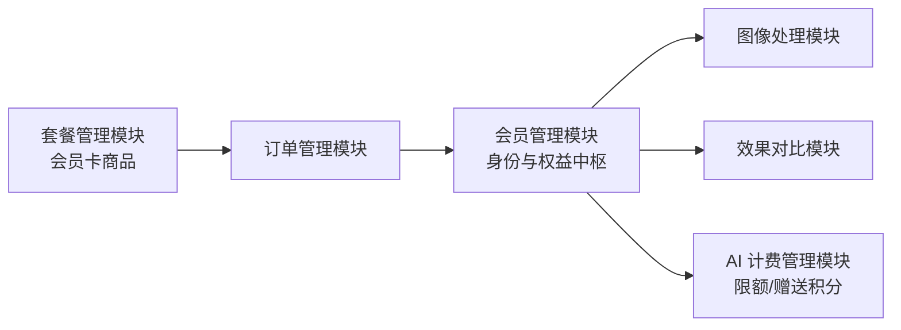

# 会员管理模块需求规格

> **模块边界说明**：本模块覆盖会员等级、多服务权益、成长值、生命周期；**会员卡商品定义/定价/营销**由[套餐管理模块](../套餐管理/需求规格.md)承接，**会员卡交易与支付**由[订单管理模块](../订单管理/需求规格.md)承接（支付成功触发本模块履约），**AI 积分计量与成本核算**由[AI 计费管理模块](../AI计费管理/需求规格.md)承接。
>
> **设计基线**：本模块遵循[商业化体系总体架构](../../../01-产品设计/07-商业化体系总体架构.md)的产品思想——"会员=身份+多服务权益包"；会员是商业化体系的身份中枢，权益覆盖本产品所有服务。

## 1. 模块概述

### 1.1 模块定位

会员管理模块是系统商业化运营的身份与权益中枢，负责管理用户的会员等级、成长值、多服务权益配置及会员全生命周期。该模块为图像处理、效果评估、AI 对话等核心业务模块提供权益校验与配额依据，与套餐管理、订单管理、AI 计费模块联动，构成完整的商业化会员体系。

### 1.2 核心价值

| 价值维度 | 具体内容 |
|---------|---------|
| **等级体系** | 建立清晰的会员等级阶梯，激励用户持续使用和付费升级 |
| **权益驱动** | 通过差异化权益（多服务配额、功能解锁、优先处理）提升付费转化 |
| **成长激励** | 成长值体系覆盖购买与使用（含 AI），形成"使用→活跃→升级"闭环 |
| **运营管理** | 后台提供会员全景视图，支持等级调整、权益配置、数据统计 |

### 1.3 业务目标

#### 功能目标

- 建立四级会员等级体系（普通用户 → VIP1 → VIP2 → SVIP）
- 实现基于成长值的自动升降级机制
- 提供权益配置与管理能力，后台精细配置
- 支持后台会员列表查询、等级调整、成长值管理

#### 性能目标

| 指标 | 目标值 | 说明 |
|-----|--------|------|
| 权益校验响应 | <50ms | 单次图像处理/评估/AI 请求中的权益检查耗时 |
| 会员列表查询 | <500ms | 后台分页查询响应时间 |
| 等级变更生效 | <3s | 会员卡支付后会员等级更新的延迟 |
| 成长值更新 | <1s | 用户行为后成长值写入延迟 |

### 1.4 模块依赖关系



| 依赖方向 | 模块 | 依赖说明 |
|---------|------|---------|
| 依赖 | **订单管理模块** | 会员卡支付成功回调触发等级变更、权益生效、成长值累积；退款回调扣减成长值 |
| 依赖 | **AI 计费管理模块** | AI 限额字段配置；VIP 赠送积分按月发放 |
| 被依赖 | **套餐管理模块** | 会员卡商品关联会员等级与权益覆盖项 |
| 被依赖 | **图像处理/效果对比/AI 对话** | 处理前校验权益配额，处理完成回调累积成长值 |

---

## 2. 会员等级体系

### 2.1 等级定义

| 等级 | 等级标识 | 成长值区间 | 定位 |
|------|---------|-----------|------|
| 普通用户 | `level_0` | 0 - 999 | 免费体验，引导转化 |
| VIP1 | `level_1` | 1000 - 4999 | 入门付费，满足轻度需求 |
| VIP2 | `level_2` | 5000 - 19999 | 进阶付费，满足中度需求 |
| SVIP | `level_3` | ≥20000 | 高级付费，满足重度/专业需求 |

> 成长值区间以权益配置表 `growth_min`/`growth_max` 为准（`growth_max=0` 表示无上限），自动升降级基于该区间计算。

### 2.2 权益配置

#### 2.2.1 权益模型与表达分层

会员权益 = 本产品**所有服务**的额度打包。权益表达采用**后台精细、前端合并**两层：

| 层 | 说明 |
|----|------|
| 后台（配置层） | 各等级逐项精细配置：任务配额、功能开关、AI 限额等，见 §2.2.2 |
| 前端（表达层） | 按服务类目合并展示："图像处理剩余 N 次"、"评估剩余 N 次"、"AI 积分余额/额度"，细粒度在权益明细中可展开（见 §7） |

> **目标**：用户只需理解"等级 + 剩余额度"，不感知后台 30+ 配置项，降低认知负荷。

#### 2.2.2 权益配置项（后台精细）

**各任务类型月度配额**（每个任务类型独立配置、独立校验、独立重置，下表为默认配额，可按等级单独调整）：

| 任务类型 | 普通用户 | VIP1 | VIP2 | SVIP |
|---------|---------|------|------|------|
| 去雾 dehaze | 20 | 100 | 500 | 3000 |
| 去雨 derain | 20 | 100 | 500 | 3000 |
| 去雪 desnow | 20 | 100 | 500 | 3000 |
| 低光增强 lowlight | 20 | 100 | 500 | 3000 |
| 超分辨率 super_resolution | 10 | 50 | 200 | 1000 |
| 去噪 denoise | 20 | 100 | 500 | 3000 |
| 图像修复 inpaint | 10 | 50 | 200 | 1000 |
| 评估 evaluate | 20 | 100 | 500 | 3000 |

**通用权益**：

| 权益项 | 普通用户 | VIP1 | VIP2 | SVIP |
|--------|---------|------|------|------|
| 历史记录保留条数 | 100 | 500 | 2000 | 10000 |
| 批量处理上限 | 10 张 | 50 张 | 200 张 | 1000 张 |
| 处理优先级 | 普通 | 优先 | 高优先 | 最高 |
| 高级参数调节 | ❌ | ✅ | ✅ | ✅ |
| 高清图导出 | ❌ | ✅ | ✅ | ✅ |
| 对比报告导出 | ❌ | ✅ | ✅ | ✅ |
| 批量打包下载 | ❌ | ✅ | ✅ | ✅ |
| AI 积分日限额 | 10,000 | 50,000 | 200,000 | 1,000,000 |
| AI 积分月限额 | 100,000 | 500,000 | 2,000,000 | 10,000,000 |
| 多模态视觉读取（次/日） | 5 | 10 | 20 | 50 |

> **说明**：
> - 每个任务类型的月度配额独立存储，字段命名 `monthly_{taskType}_quota` / `monthly_{taskType}_used`。权益校验按请求携带的任务类型匹配对应配额，互不占用
> - 高级参数调节/高清图导出/对比报告导出/批量打包下载四项为能力开关，普通用户关闭、VIP1/2/SVIP 开启
> - AI 限额字段与 VIP 赠送积分见 §6（AI 能力计费联动）

#### 2.2.3 权益校验逻辑

```
用户发起图像处理（携带 taskType）/评估/AI 请求
    ↓
查询用户当前会员等级（缓存优先）
    ↓
查询对应等级的权益配置，取对应服务额度
    ↓
检查本月/当日已用量 < 额度上限
    ├─ 是 → 执行处理 → 扣减额度（原子操作 + 落库）
    └─ 否 → 返回额度不足提示 → 引导升级会员/加购积分卡
```

> **实现说明**：权益校验与配额扣减由各业务模块接入（Python 算法服务 `check_and_deduct_quota`，按 taskType 维度 Redis 原子扣减 + 失败归还）。已购买会员卡的用户，配额取套餐个性化覆盖（`benefit_overrides`）与等级权益的较高值。AI 积分计量与配额扣减由 AI 计费模块承接（本模块仅提供限额字段与赠送积分）。

#### 2.2.4 次数重置规则

- 每月 1 日 00:00 由定时任务自动重置全部任务类型（含评估）次数
- 重置基于会员等级对应的各任务类型配额，非累计
- 重置流程：先将上月各任务类型配额使用情况**归档至独立历史表**（每月一条），再重置当月配额字段
- **重置后不推送通知**

### 2.3 成长值体系 (F-MM-002)

#### 2.3.1 成长值获取规则

| 行为类型 | 成长值 | 频率限制 | change_type | 说明 |
|---------|--------|---------|------------|------|
| 每日签到 | +3 | 每日 1 次 | `sign_in` | 维持日常活跃（已实现） |
| 连续签到 7 天 | +20 | 每周期 1 次 | `sign_in_bonus` | 奖励持续活跃（已实现） |
| 提交处理评价 | +5 | 每日上限 5 | `rating` | 鼓励用户反馈（已实现） |
| 完成一次图像处理 | +1 | 每日上限 10 | `process` | 鼓励核心功能使用（已实现） |
| 完成一次效果评估 | +1 | 每日上限 5 | `evaluate` | 鼓励使用评估功能（已实现） |
| 购买商品 | 按消费金额 1:1 | 无上限 | `consume` | 会员卡与积分卡购买均按实付金额累积（1 元 = 100 成长值） |
| 完成一次 AI 对话 | +1 | 每日上限 10 | `ai_consume` | 行为激励：鼓励使用 AI 功能；与"购买积分卡消费累积"维度不同、不双算（见 §2.3.3） |

> **付费链路说明**：购买商品（`consume`，会员卡/积分卡）、图像处理（`process`）、评估（`evaluate`）、AI 对话（`ai_consume`）的成长值累积，以及退款扣减（`refund_deduct`）均接入业务回调——订单支付成功回调写入 `consume`、图像处理/评估完成回调写入 `process`/`evaluate`、AI 对话完成回调写入 `ai_consume`（消费 AI 计费发布的对话完成事件）、退款成功回调等额扣减。三后端契约一致，Java 权威，Go/Python 对齐。

#### 2.3.2 成长值扣减规则

- 退款成功时，按该订单获取的成长值**等量扣减**（`refund_deduct` 类型），扣减值 = 该订单 `consume` 获取的成长值 × 未使用比例（与退款金额折算比例一致）
- 扣减后若成长值低于当前等级下限，触发降级（仅成长值来源或套餐已到期的会员触发降级，见 §3.2）
- 成长值不允许为负数，最低为 0；实际扣减值按差额计算
- 退款扣减成长值与退款策略一致：未使用部分全额退、已使用部分不退

#### 2.3.3 AI 使用激励（已定论：行为激励）

为形成覆盖全部服务的激励闭环，AI 对话纳入成长值激励，采用**行为激励**口径：

- **激励规则**：每次完成一次 AI 对话成长值 +1（`ai_consume`），**每日上限 10 次**（与图像处理 `process` 对称），不设每月上限
- **计次口径**：按"一次对话完成"计（AI 计费发布 `ai.chat.completed` 事件），一次对话内的多步推理/子智能体多次 LLM 调用**仅计一次**
- **双算规避（关键）**：`consume`（购买商品按实付 1:1）激励"付费"，`ai_consume`（按对话次数 +1 且封顶）激励"活跃"——两者**维度不同、并行不悖**；AI 消耗再大，每日仅 10 次激励，成长值不会因消耗量膨胀，双算不产生通胀影响
- **与退款扣减无关**：`ai_consume` 为使用行为激励，非订单消费所得，退款时不参与扣减
- **触发链路**：AI 对话完成 → AI 计费模块发布对话完成事件 → 本模块消费事件，校验当日已激励次数未达上限后写入（原子自增 + 流水，见 §2.3.4）

#### 2.3.4 成长值流水记录

每次成长值变动均记录流水，包含用户 ID、变动类型、变动值、变动后余额、关联业务 ID、变动原因、操作人、变动时间。

---

## 3. 会员生命周期管理

### 3.1 升级机制 (F-MM-003)

#### 3.1.1 升级条件

| 升级路径 | 条件 | 生效方式 |
|---------|------|---------|
| 普通 → VIP1 | 成长值 ≥ 1000 或 购买 VIP1 会员卡 | 成长值升级立即生效；会员卡支付成功回调立即生效 |
| VIP1 → VIP2 | 成长值 ≥ 5000 或 购买 VIP2 会员卡 | 同上 |
| VIP2 → SVIP | 成长值 ≥ 20000 或 购买 SVIP 会员卡 | 同上 |

> **level_source 规则定论**：`level_source`（`growth`/`purchase`/`admin`）**仅记录当前等级的获得来源，不影响自动升级**。任何来源的会员，当成长值达到更高等级阈值时均自动升级（升级后 `level_source` 保持不变，保留原 `expire_time`，会员卡期间享有 max(会员卡等级, 成长值等级)）。自动**降级**仍受来源与有效期约束：会员卡未到期（`purchase`/`admin` 且 `expire_time` 未过期）不降级，仅 `growth` 来源或会员卡已到期的会员在成长值低于等级下限时降级（见 §3.2）。

#### 3.1.2 升级流程

```
成长值变更（签到/评价/图像处理/评估/购买商品/退款扣减）
    ↓
计算新成长值对应的目标等级
    ├─ 目标等级 > 当前等级 → 更新等级（level_source 保持不变）→ 更新配额 → 发送升级通知（站内信）
    └─ 否 → 仅更新成长值
```

#### 3.1.3 升级通知

- 站内信（升级模板）：恭喜您升级至 {levelName}，已解锁各任务处理 {次数}次/月，评估 {次数}次/月

### 3.2 降级机制 (F-MM-004)

#### 3.2.1 降级条件

| 场景 | 降级规则 |
|------|---------|
| 会员卡到期未续费 | 按当前成长值对应的等级生效；成长值低于普通用户阈值（0）则降为普通用户 |
| 成长值因退款扣减 | 低于当前等级下限时降级（仅 `growth` 来源或会员卡已到期会员触发） |
| 会员卡到期但成长值达标 | 保持当前等级，不降级 |

> **跨等级会员卡降级兜底定论**：会员卡到期后，按当前成长值对应的等级生效；若成长值低于普通用户则降为普通用户；会员卡购买期间享受会员卡等级，到期后自然过渡到成长值等级，**不出现权益空窗**。

#### 3.2.2 降级流程

```
定时任务每日扫描（到期时间已过且来源非 growth）
    ↓
计算成长值对应的目标等级
    ↓
目标等级 < 当前等级
    ├─ 是 → 更新用户等级（来源置 growth）→ 更新配额 → 发送降级通知
    └─ 否 → 保持当前等级（保级，来源置 growth、清空 expire_time）
```

> 成长值因退款扣减触发的降级在退款回调事务内即时执行（不等待定时任务），逻辑同上。

#### 3.2.3 到期预警

| 提前天数 | 通知内容 |
|---------|---------|
| 7 天 | 续费提醒（到期日期） |
| 3 天 | 续费提醒 + 降级后权益对比（图像处理/评估次数变化） |
| 1 天 | 最后提醒 |
| 当天 | 执行降级（如成长值不达标，由每日降级定时任务处理） |

> 预警通过站内信发送，模板按提前天数区分；当天执行降级由每日 02:00 的过期降级定时任务完成。

### 3.3 保级机制 (F-MM-005)

会员卡到期时，若用户成长值仍达到当前等级门槛，则保持等级不变，等级来源由会员卡购买切换为成长值维持。

#### 会员卡个性化权益覆盖（benefit_overrides）

会员卡可对等级权益进行个性化覆盖，实现"会员卡额外赠送"运营能力。覆盖维度与多服务权益一致：

- **覆盖粒度**：可覆盖任意任务类型配额、AI 限额（日/月）、历史保留、批量上限、优先级、能力开关
- **取值规则**：已购买会员卡的用户，各服务额度取 `max(等级权益, 会员卡覆盖)`；未覆盖项仍取等级权益
- **生效与失效**：会员卡支付成功即时生效，到期/退款后失效，回退至纯等级权益
- **校验与重置**：权益校验、月度配额重置均按合并后的额度执行

> **示例**：VIP1 等级去雾配额 100 次/月，某 VIP1 会员卡覆盖 `{"monthly_dehaze_quota": 150}`，则购买该会员卡的用户每月去雾配额为 `max(100, 150) = 150` 次。

---

## 4. 后台管理功能

### 4.1 会员列表查询 (F-MM-006)

#### 5.1.1 查询条件

| 条件类型 | 字段 | 说明 | 匹配方式 |
|---------|------|------|---------|
| 关键字搜索 | 用户名/昵称/手机号 | 多字段模糊匹配 | LIKE |
| 会员等级 | 等级标识 | 精确匹配 | = |
| 会员状态 | 正常/冻结 | 精确匹配 | = |
| 到期时间 | 时间范围 | 会员卡到期时间筛选 | BETWEEN |
| 成长值区间 | 最小值~最大值 | 数值范围 | BETWEEN |

#### 5.1.2 列表展示字段

| 字段 | 显示名称 | 说明 |
|------|---------|------|
| username | 用户名 | 登录账号 |
| nickname | 昵称 | 显示名称 |
| levelName | 会员等级 | 等级标签（带颜色） |
| growthValue | 成长值 | 当前成长值 |
| monthlyUsed | 本月已用次数 | 各任务类型（含评估）已用次数合计 |
| expireTime | 到期时间 | 会员卡到期时间，无则为空 |
| status | 状态 | 正常/冻结 |
| createTime | 开通时间 | 首次成为会员的时间 |
| - | 操作 | 详情/调整等级/成长值调整/冻结解冻 |

### 4.2 会员详情 (F-MM-007)

#### 5.2.1 详情页签

| 页签 | 内容 | 数据来源 |
|------|------|---------|
| 基本信息 | 用户信息、会员等级、等级来源、到期时间、成长值、累计消费、冻结信息 | 会员详情接口 |
| 成长值流水 | 时间、类型、变动值、余额、关联业务 | 成长值流水接口 |
| 消费记录 | 订单号、商品名称、金额、支付时间、状态 | 订单管理模块接口 |
| 权益使用 | 本月各服务额度（任务类型/AI）使用明细 | 会员详情中的月度配额字段 |
| 操作日志 | 等级调整、冻结/解冻等后台操作记录 | 系统操作日志模块接口 |

> **说明**：会员详情接口返回基本信息和权益使用数据，成长值流水/消费记录/操作日志需调用对应模块的接口加载。

### 4.3 等级调整 (F-MM-008)

#### 5.3.1 操作流程

```
选择目标用户 → 点击"调整等级"
    ↓
选择目标等级 + 填写调整原因
    ↓
设置到期时间（可选）
    ↓
二次确认 → 确认调整
    ↓
更新用户等级（来源置 admin）→ 更新配额 → 刷新缓存 → 发送等级变更通知
```

#### 5.3.2 业务规则

1. 调整后等级来源置为 `admin`，到期时间可自定义
2. 调整后立即生效，权益（各服务额度）同步更新，缓存失效
3. 等级变化时发送站内信通知（升级/降级模板按新旧等级排序比较）
4. 调整不改变成长值
5. 首次开通会员时记录开通时间

### 4.4 成长值管理 (F-MM-009)

#### 5.4.1 操作流程

输入调整值（正数增加/负数扣减）→ 填写调整原因 → 确认调整 → 记录流水 → 检查等级变更

#### 5.4.2 业务规则

1. 扣减后成长值不低于 0（低于 0 时按 0 处理）
2. 调整后自动检查等级变更——成长值达到更高等级阈值时自动升级（不限来源）；成长值低于当前等级下限时，仅 `growth` 来源或会员卡已到期的会员触发降级（见 §3.2.1）
3. 调整记录永久保留，不可删除
4. 记录操作人、操作时间、调整原因、变动流水

### 4.5 会员冻结/解冻 (F-MM-010)

#### 5.5.1 冻结规则

- 冻结后：会员等级保留，但冻结期间用户无法使用任何权益（图像处理、评估、AI 等全部功能在权益校验时拦截）
- 解冻后：恢复全部权益
- **配额顺延补回**：冻结期间未消耗的配额按剩余天数顺延补回——会员卡到期时间顺延冻结天数，当月配额重置时点按冻结天数延期
- 冻结需填写原因，记录冻结时间

### 4.6 权益配置管理 (F-MM-011)

#### 5.6.1 可配置项

| 配置项 | 类型 | 说明 |
|--------|------|------|
| 等级名称 | 文本 | 各等级显示名称 |
| 成长值区间 | 数值 | 下限/上限（上限 0 表示无上限） |
| 各任务类型月度配额 | 数值 | 去雾/去雨/去雪/低光增强/超分辨率/去噪/图像修复/评估 各自独立 |
| 历史记录保留条数 | 数值 | 各等级历史记录上限 |
| 批量处理上限 | 数值 | 单次批量处理最大图片数 |
| 处理优先级 | 枚举 | 普通/优先/高优先/最高 |
| 高级参数调节/高清图导出/对比报告导出/批量打包下载 | 开关 | 能力开关 |
| AI 日限额/月限额 | 数值 | `ai_credits_daily`/`ai_credits_monthly` |
| 多模态视觉读取日限额 | 数值 | `multimodal_limit` |
| 排序值 | 数值 | 等级展示顺序 |
| 启用状态 | 开关 | 等级配置是否启用 |

#### 5.6.2 业务规则

1. 权益配置修改后立即生效，相关缓存失效
2. 成长值下限不能大于上限（校验拦截）
3. 配置变更记录操作日志
4. 已购买会员卡的用户，各服务额度取套餐个性化覆盖（`benefit_overrides`）与等级权益的较高值

---

## 5. AI 能力计费联动

AI 对话积分的计量、积分换算、配额扣减流程、计费记录由 [AI 计费管理模块](../AI计费管理/需求规格.md)统一管理，本文档不重复定义。

会员管理涉及的 AI 计费联动：

| 联动项 | 说明 |
|--------|------|
| AI 限额字段 | 权益配置表 `ai_credits_daily`/`ai_credits_monthly`/`multimodal_limit`，各等级差异化（见 §2.2.2），配置管理复用权益配置功能 |
| **VIP 赠送积分** | VIP 会员按月赠送积分（各等级差异化），每月发放至积分余额；**月额度语义：月末清零未用部分**（次月重新发放）。发放由 AI 计费承接到账（source=vip_gift），本模块提供等级与赠送额度依据 |
| 额度不足引导 | 用户 AI 限额/余额不足时，提示升级会员或加购积分卡（引导由 AI 计费模块发起，本模块配合权益对比展示） |

> **三端一致性定论**：`ai_credits_daily`/`ai_credits_monthly`/`multimodal_limit` 三个字段在 Java/Go/Python 三后端的 model/VO 中必须补全（字段名、类型、含义完全一致，Java 权威，Go/Python 对齐），权益配置接口必须返回 AI 限额，数据初始化脚本同步包含默认值。

---

## 6. 用户端功能

### 6.1 会员中心展示 (F-MM-012)

#### 6.1.1 展示内容

| 区域 | 内容 |
|------|------|
| 等级卡片 | 当前等级名称、等级来源（会员卡到期时间/成长值维持）、成长值 |
| 成长值进度条 | 当前成长值、距下一等级的差值、进度百分比；**SVIP 显示"已达最高等级"** |
| 升级引导 | 下一等级权益对比、升级按钮（跳转套餐商店）；SVIP 不展示升级引导 |

### 6.2 成长值明细 (F-MM-013)

#### 6.2.1 展示字段

| 字段 | 说明 |
|------|------|
| 变动时间 | 精确到分钟 |
| 变动类型 | process/evaluate/rating/sign_in/sign_in_bonus/consume/ai_consume/refund_deduct/admin_adjust |
| 变动值 | +X / -X |
| 变动后余额 | 该次变动后的成长值 |
| 关联信息 | 订单号/任务ID/签到天数 |
| 原因 | 变动原因说明 |

### 6.3 签到功能 (F-MM-014)

#### 6.3.1 签到规则

- 每日可签到 1 次，签到后获得 3 成长值（防重复校验 + 唯一约束兜底）
- 连续签到每满 7 天额外获得 20 成长值
- 中断签到后连续天数归零，重新计算
- 签到日历展示当月签到情况、连续天数、累计天数

---

## 7. 交互规范

### 7.1 页面布局

| 页面 | 布局要点 |
|------|---------|
| 会员中心页 | 等级卡片（等级名称/来源/到期时间）置顶，下方成长值进度条，权益概览区（服务类目合并展示剩余额度），试用引导（未付费用户），底部升级引导 |
| 成长值记录页 | 时间线展示成长值变动记录，支持按变动类型筛选 |
| 权益配置页（后台） | 各等级 Tab 切换，表单展示该等级全部权益配置项（配额/开关/限制） |

### 7.2 关键交互行为

| 场景 | 交互行为 |
|------|---------|
| 成长值进度条 | 展示当前成长值、距下一等级差值与进度百分比；SVIP 显示"已达最高等级" |
| 权益概览 | 服务类目合并展示剩余额度，点击展开细粒度权益明细 |
| 试用引导 | 未付费用户展示"免费试用"入口，点击进入试用流程（体验券激活/AI 试用积分） |
| 等级升级引导 | 展示升级进度与升级后权益对比，提供"升级"按钮跳转套餐商店 |
| 到期预警 | 会员卡到期前 7/3/1 天站内信提醒，3 天提醒含降级后权益对比 |
| 签到日历 | 展示当月签到情况与连续天数，签到后即时更新成长值 |

### 7.3 操作反馈

| 场景 | 反馈行为 |
|------|---------|
| 等级升级 | 站内信通知"恭喜您升级至 {等级名}，已解锁各任务处理 {次数}次/月" |
| 等级降级 | 站内信通知降级结果与当前权益 |
| 成长值变动 | 进度条与数值实时更新 |
| 额度用尽 | 处理时提示"本月次数已达上限"，引导升级会员 |
| 试用激活 | 提示"试用已生效，有效期至 {时间}" |
| 会员冻结 | 冻结后权益校验拦截，提示"会员已冻结，权益暂停使用" |

---

## 8. 非功能需求

### 8.1 性能需求

| 指标 | 要求 |
|-----|------|
| 权益校验 | 等级/权益缓存（Redis），缓存未命中时查询 <50ms |
| 成长值写入 | 与业务操作同一事务内写入，用户无感知延迟 |
| 月度配额重置 | 分批处理全量用户，重置在 1 小时内完成 |
| 会员列表查询 | 支持万级会员数据，分页查询 <500ms |

### 8.2 安全需求

| 方面 | 措施 |
|-----|------|
| 权益防篡改 | 次数扣减使用 Redis 原子操作，防止并发超扣 |
| 成长值防刷 | 签到、评价等行为做频率限制和防重复校验 |
| 操作审计 | 所有后台调整操作记录操作人、时间、原因 |
| 数据一致性 | 成长值变更与等级变更在同一事务内完成 |

### 8.3 可用性需求

| 方面 | 要求 |
|-----|------|
| 缓存降级 | 缓存不可用时降级为直接查询，不影响核心功能 |
| 重置容错 | 月度配额重置失败时自动重试（分批处理），失败记录日志告警 |
| 通知送达 | 升级/降级/到期通知通过站内信发送，失败记录日志 |

---

## 9. 依赖关系

### 9.1 依赖模块

| 模块 | 依赖说明 |
|------|---------|
| **用户管理模块** | 会员信息基于用户信息，用户注册时初始化会员记录 |
| **订单管理模块** | 会员卡支付成功触发等级变更与成长值累积（`consume`）；退款回调扣减成长值（`refund_deduct`） |

> **说明**：会员等级名称直接存储于权益配置表，**不依赖字典管理模块**。

### 9.2 被依赖模块

| 模块 | 依赖说明 |
|------|---------|
| **套餐管理模块** | 会员卡商品关联会员等级，权益配置基于等级权益 + 覆盖项 |
| **图像处理模块** | 处理前校验各任务类型配额和处理优先级，处理完成回调累积成长值（`process`） |
| **效果对比模块** | 评估前校验评估次数配额，评估完成回调累积成长值（`evaluate`） |
| **处理历史模块** | 历史记录保留条数受会员等级控制 |
| **反馈评价模块** | 评价行为获取成长值（`rating`） |

---

## 10. 待确认事项

1. **权益前端合并粒度**：图像处理 7 类任务合并展示的粒度（取最低剩余 vs 求和）与展开交互？
2. **会员降级宽限期**：会员卡到期后是否设置宽限期（如 3 天）允许补续费保留等级？
3. **配额顺延计算口径**：会员冻结期间的配额顺延补回计算口径（按天顺延 vs 按剩余比例）是否需要细化？
4. **管理员等级调整审计**：管理员手动调整等级的成长值上限与审计频率是否需要规范？
