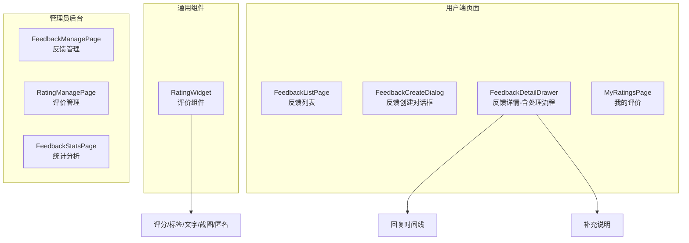
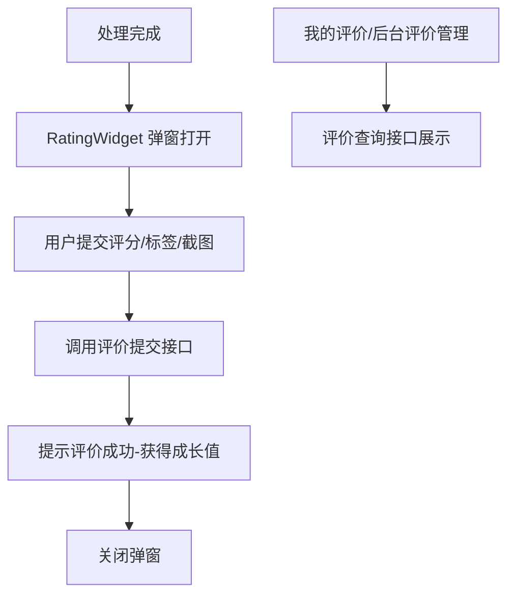
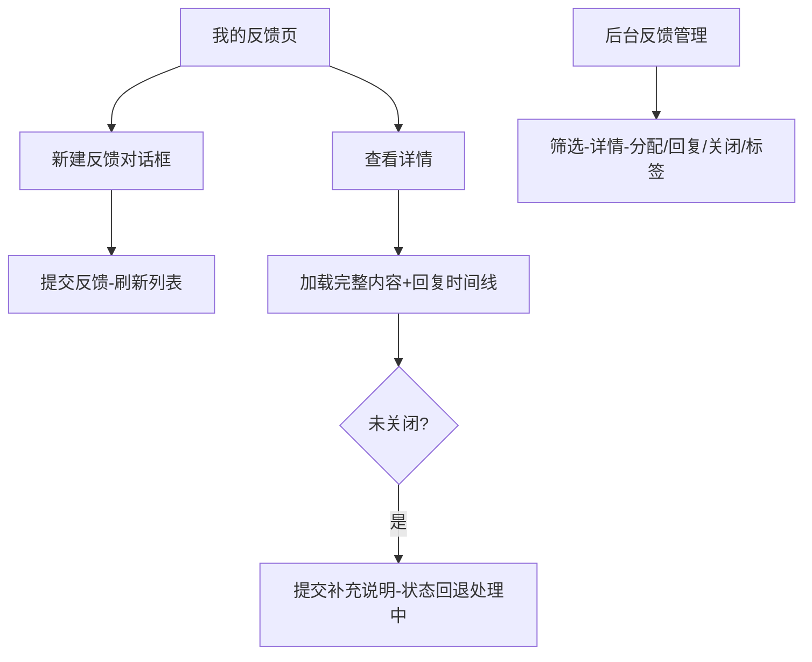

# 反馈评价模块 - 前端实现设计

## 1. 文档概述

本文档描述反馈评价模块的前端实现方案（dehaze-front-vue），聚焦组件架构、状态管理、路由设计、数据流与关键交互决策。反馈评价模块承担用户对处理结果的评分评价与产品功能反馈收集，前端提供通用评价组件、用户端反馈/评价页面与管理员后台管理页面。业务需求见[需求规格.md](./需求规格.md)。

---

## 2. 组件树设计

| 组件 | 职责 | 复用性 |
|------|------|--------|
| RatingWidget | 评价弹窗组件：星级评分、效果标签（按评分动态切换）、评价文字、截图上传、匿名开关、跳过/提交 | 可复用（业务页面按需集成） |
| FeedbackListPage | 用户反馈列表：状态卡片、类型/状态/模块标签、新建反馈入口 | 用户端页面 |
| FeedbackCreateDialog | 反馈创建对话框：类型/标题/内容/联系方式/截图/相关模块 | 用户端组件 |
| FeedbackDetailDrawer | 反馈详情：完整内容、图片、标签、回复时间线、补充说明 | 用户端组件 |
| MyRatingsPage | 我的评价列表：星级、评价文字、标签、图片、管理员回复（只读） | 用户端页面 |
| FeedbackManagePage | 管理员反馈管理：筛选表格、详情弹窗、分配/回复/关闭/标签 | 管理员页面 |
| RatingManagePage | 管理员评价管理：筛选表格、隐藏/回复评价 | 管理员页面 |
| FeedbackStatsPage | 统计分析：评价统计 + 反馈统计（图表） | 管理员页面 |

> 评分/标签/图片上传/时间线等能力内聚在页面组件与 RatingWidget 中，不做原子组件拆分。

---

## 3. 状态管理

**Store 模块划分**

| Store | 职责 |
|------|------|
| feedbackStore | 反馈分页列表、当前反馈详情（含回复时间线） |
| ratingStore | 评价列表、当前评价详情、评价弹窗提交状态（防重复提交） |

**核心状态**

| Store | 状态字段 | 说明 |
|------|---------|------|
| feedbackStore | feedbackList / total | 反馈分页列表与总数 |
| feedbackStore | currentFeedback | 当前反馈详情（含回复时间线） |
| ratingStore | ratingList / currentRating | 评价列表与当前评价详情 |
| ratingStore | ratingSubmitted | 评价提交状态标记，防重复提交 |

**核心操作**

| Store | 方法 | 说明 |
|------|------|------|
| feedbackStore | submitFeedback | 提交反馈，成功后刷新列表 |
| feedbackStore | submitSupplement | 提交补充说明，状态为"已回复"时回退为"处理中" |
| ratingStore | submitRating | 提交评价，节流防重复，成功后标记已提交 |
| ratingStore | toggleTag | 切换效果标签，切换评分档位时清空已选 |

> 页面分页参数与表单数据在组件内局部管理。

---

## 4. 路由设计

| 路径 | 组件 | 权限 | 守卫 |
|------|------|------|------|
| `/feedback/my` | FeedbackListPage | 登录用户 | 登录守卫（静态路由） |
| `/feedback/my-ratings` | MyRatingsPage | 登录用户 | 登录守卫（静态路由） |
| `/feedback/detail` | FeedbackDetailDrawer | 登录用户 | 登录守卫（静态路由） |
| 后台动态菜单 | FeedbackManagePage / RatingManagePage / FeedbackStatsPage | 管理员 | 登录守卫 + 动态菜单加载 |

> 用户端页面通过静态路由注册，登录后可直接访问（受保护路由）；后台管理页面组件已实现，由后台动态菜单按权限加载入口，不注册在静态路由中。RatingWidget 无独立路由，由业务页面嵌入。

---

## 5. 数据流

### 5.1 评价数据流

### 5.2 反馈数据流

### 5.3 模块间数据交互

| 交互方向 | 数据 | 说明 |
|---------|------|------|
| 去雾处理 -> 反馈评价 | 处理记录 ID | 评价关联的处理记录（校验归属/状态/时限） |
| 反馈评价 -> 会员管理 | 评价事件 | 提交评价获得成长值奖励 |
| 反馈评价 -> 消息通知 | 低分评价事件 | 触发管理员站内信告警 |

---

## 6. 交互设计决策

| 决策点 | 实现方式 | 理由 |
|--------|---------|------|
| 评价星级展示 | 5 星评分带文字提示（很不满意/不满意/一般/满意/非常满意）；列表只读展示带分值 | 文字提示降低理解门槛，分值提供精确参考 |
| 评价标签动态切换 | 评分 ≥4 展示正面标签、≤2 展示负面标签、=3 展示全部；切换评分档位清空已选 | 标签与评分档位语义一致，避免正面评分选负面标签的矛盾 |
| 评价提交防抖 | 提交操作节流，防止重复提交；成功后标记已提交 | 避免重复提交产生多条评价（后端虽防重，前端防抖减少无效请求） |
| 反馈状态流转 | 待处理->处理中->已回复->已关闭；卡片色带 + 状态标签区分 | 状态机约束处理流程，视觉区分帮助用户快速了解进度 |
| 管理员处理流程 | 分配处理人->回复（含回复类型）->关闭（需填关闭原因）；回复时自动分配给自己 | 分配确保反馈有责任人；关闭原因便于统计分析 |
| 补充说明状态回退 | 用户在"已回复"状态补充说明时，状态回退为"处理中" | 用户补充说明意味着问题未解决，需重新进入处理流程 |
| 截图校验 | 上传前校验类型（JPG/PNG/WEBP）与大小（≤5MB），评价限 3 张、反馈限 5 张 | 前端校验减少无效上传，限制数量避免滥用 |
| 详情联系信息 | 联系方式仅后台（管理员）可见；用户端详情不展示 | 联系方式为用户隐私，仅管理员需要用于跟进 |
| 评价弹窗约束 | 禁止关闭按钮与点击遮罩关闭，引导用户完成或跳过评价 | 引导用户完成评价提升数据收集率，但提供跳过避免强制 |
| 统计图表生命周期 | stats 页面图表按需初始化/销毁，避免内存泄漏 | 图表实例占用内存，页面离开不销毁导致泄漏 |
| 低分告警异步 | 1-2 星评价触发低分告警（异步站内信），不阻塞评价提交 | 告警为运维需求，不应影响用户评价体验 |
| 我的评价只读 | 用户端评价列表为只读展示，无补评/修改入口 | 后端修改能力已就绪但前端未接入，避免暴露未完成功能 |
| 评价弹窗奖励提示 | 提交成功后提示"评价成功，获得成长值奖励" | 即时反馈激励用户参与评价 |
| 后台评价隐藏/回复 | 管理员可隐藏不当评价（用户端不再展示）、回复用户评价 | 隐藏不当评价维护社区质量；回复形成闭环 |

---

## 7. 公共组件使用

| 公共组件 | 使用方式 |
|---------|---------|
| 评价组件（RatingWidget） | 业务页面（效果对比页等）按需嵌入；传入处理记录 ID，弹出评价弹窗 |
| 表单组件 | 反馈创建对话框、管理员回复/关闭表单使用；含实时校验 |
| 状态标签组件 | 反馈状态（待处理/处理中/已回复/已关闭）、评价类型标签展示 |
| 时间线组件 | 反馈详情回复时间线展示（提交->回复->补充，按时间升序） |
| 图表组件 | 统计分析页评价分布、反馈分布、模块排行等图表展示 |
| 图片上传组件 | 评价截图、反馈图片上传，复用文件管理上传组件 |
